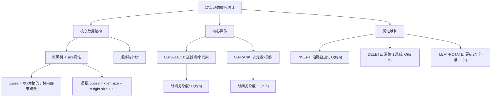
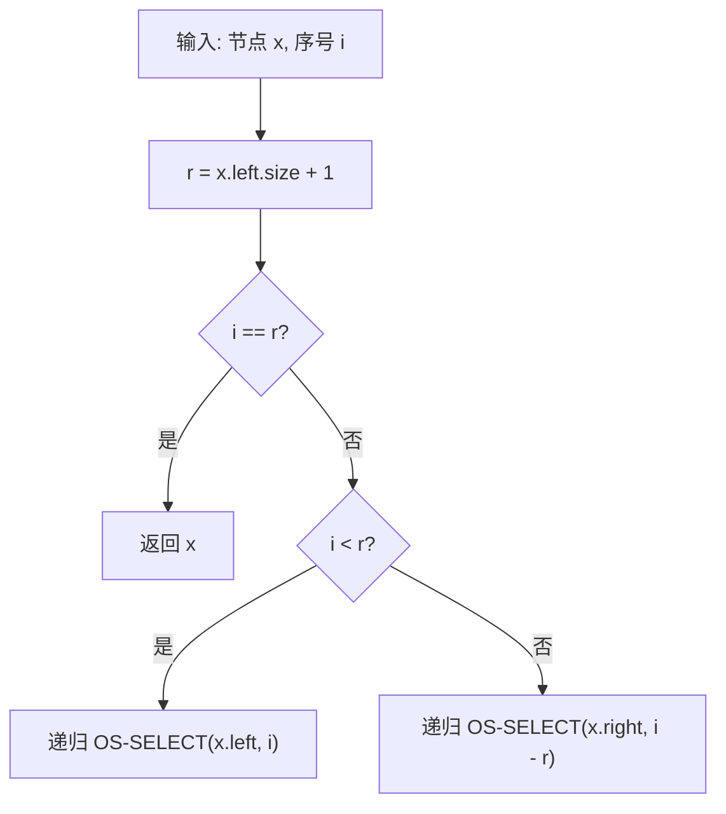
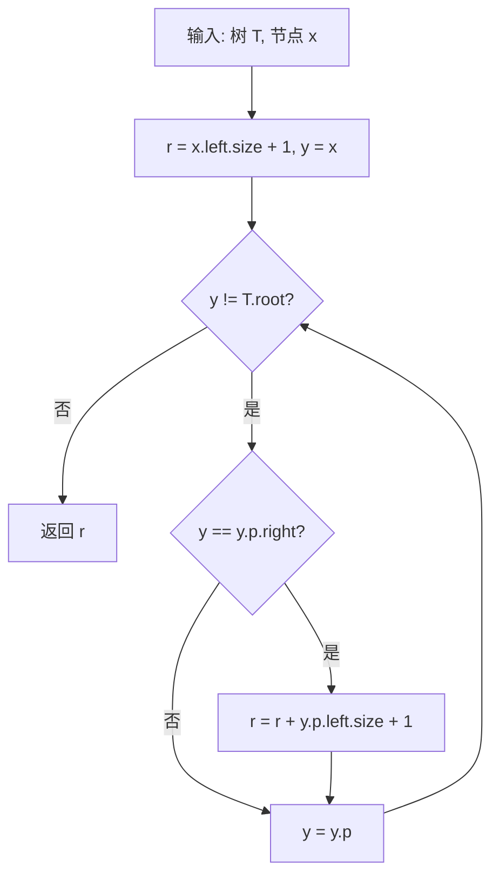

## 相关笔记

> [!abstract] 概览
> 本节介绍**顺序统计树**（Order-Statistic Tree），一种在[[算法导论/concepts/红黑树]]基础上扩张的数据结构。通过在每个节点上新增 `size` 属性，顺序统计树支持在 $O(\lg n)$ 时间内完成两种核心操作：**查找第 $i$ 小的元素**（OS-SELECT）和**计算元素的秩**（OS-RANK）。本节还详细分析了 `size` 属性在插入、删除和旋转操作中的维护代价。

---

## 知识结构总览



---

## 核心思想

> [!tip] 核心思路
> 在**红黑树**的每个节点 $x$ 上增加一个 `size` 属性，记录以 $x$ 为根的子树中的**内部节点数**（包含 $x$ 自身，不包含哨兵 `nil[T]`）。利用这一附加信息，可以在 $O(\lg n)$ 时间内完成**选择**（查找第 $i$ 小元素）和**求秩**（确定元素的排名）两种操作，且不改变红黑树插入、删除的渐近时间复杂度。

### 顺序统计树的定义

> [!def] 顺序统计树（Order-Statistic Tree）
> 顺序统计树是一棵**红黑树**，其中每个节点 $x$ 包含一个附加属性 `x.size`，满足：
> $$x.\text{size} = x.\text{left}.\text{size} + x.\text{right}.\text{size} + 1$$
> 其中哨兵 `nil[T].size = 0`。`x.size` 的含义是：以 $x$ 为根的子树中（包含 $x$ 自身）的内部节点总数。

### OS-SELECT：查找第 $i$ 小的元素

**思想**：对于节点 $x$，设 $r = x.\text{left}.\text{size} + 1$，则 $r$ 是 $x$ 在其中序遍历中的位置（即以 $x$ 为根的子树中第 $r$ 小的元素）。

- 若 $i = r$，则 $x$ 就是第 $i$ 小的元素。
- 若 $i < r$，则第 $i$ 小的元素在 $x$ 的左子树中。
- 若 $i > r$，则第 $i$ 小的元素在 $x$ 的右子树中，且在右子树中是第 $i - r$ 小的元素。

> [!tip] 算法执行流程
> 1. 计算当前节点 x 的排名 **r = x.left.size + 1**
> 2. 若 **i == r**，当前节点即为第 i 小元素，**返回 x**
> 3. 若 **i < r**，目标在**左子树**中，递归查找第 i 小
> 4. 若 **i > r**，目标在**右子树**中，递归查找第 **i - r** 小



```
OS-SELECT(x, i)
1  r = x.left.size + 1
2  if i == r
3      return x
4  elseif i < r
5      return OS-SELECT(x.left, i)
6  else return OS-SELECT(x.right, i - r)
```

**正确性证明**：

对以 $x$ 为根的子树中的节点数 $n$ 进行数学归纳法。

- **基础情况**：当 $n = 1$ 时，$x$ 是唯一的节点，$x.\text{left}.\text{size} = 0$，故 $r = 1$。若 $i = 1$，直接返回 $x$，正确。
- **归纳假设**：假设对所有节点数小于 $n$ 的子树，OS-SELECT 正确返回第 $i$ 小的元素。
- **归纳步骤**：对于节点数为 $n$ 的子树，根为 $x$：
  - **【定义排名（$r = x.\text{left}.\text{size} + 1$ 表示 $x$ 在中序遍历中的位置）】**
  - $r = x.\text{left}.\text{size} + 1$ 表示 $x$ 在中序遍历中的位置。
  - 若 $i = r$，$x$ 恰好是第 $i$ 小的元素，返回 $x$ 正确。
  - **【左子树递归（$i < r$ 时第 $i$ 小元素在左子树中，节点数 $< n$）】**
  - 若 $i < r$，第 $i$ 小的元素在左子树中，左子树节点数 $< n$，由归纳假设，递归调用正确。
  - **【右子树递归（$i > r$ 时排名调整为 $i - r$，右子树节点数 $< n$）】**
  - 若 $i > r$，第 $i$ 小的元素在右子树中。在右子树中，它的排名为 $i - r$（因为左子树和根共占 $r$ 个位置），右子树节点数 $< n$，由归纳假设，递归调用正确。

**时间复杂度分析**：每次递归调用沿树下降一层，树高为 $O(\lg n)$，故总时间为 $O(\lg n)$。

### OS-RANK：求元素 $x$ 的秩

**思想**：$x$ 的秩等于 $x$ 的左子树大小加 1，再加上所有"祖先节点中 $x$ 位于其右子树"的那些祖先的左子树大小加 1。

> [!tip] 算法执行流程
> 1. 初始化 **r = x.left.size + 1**（x 在其自身子树中的排名）
> 2. 从 x 开始**向上遍历**到根节点
> 3. 若当前节点 y 是**父节点的右孩子**，说明父节点及其左子树中所有元素都小于 x
>    - 累加 **r = r + y.p.left.size + 1**
> 4. 上移 y = y.p，继续循环
> 5. 到达根节点后，返回 r



```
OS-RANK(T, x)
1  r = x.left.size + 1
2  y = x
3  while y != T.root
4      if y == y.p.right
5          r = r + y.p.left.size + 1
6      y = y.p
7  return r
```

**正确性证明**：

从 $x$ 开始向上遍历到根。初始时 $r = x.\text{left}.\text{size} + 1$，表示 $x$ 在以 $x$ 为根的子树中的排名。对于每个祖先 $y.p$：

- **【左孩子情况（$y$ 是 $y.p$ 的左孩子时，$y.p$ 及其右子树元素都大于 $x$，秩不变）】**
- 若 $y$ 是 $y.p$ 的**左孩子**，则 $y.p$ 及其右子树中的所有元素都大于 $x$，$x$ 的秩不受影响。
- **【右孩子情况（$y$ 是 $y.p$ 的右孩子时，$y.p$ 及其左子树元素都小于 $x$，需累加 $y.p.\text{left}.\text{size} + 1$）】**
- 若 $y$ 是 $y.p$ 的**右孩子**，则 $y.p$ 的左子树中所有元素以及 $y.p$ 本身都小于 $x$（在中序遍历中排在 $x$ 前面），因此需要将 $y.p.\text{left}.\text{size} + 1$ 加到 $r$ 上。

遍历到根后，$r$ 即为 $x$ 在整棵树中的秩。

**时间复杂度分析**：从 $x$ 到根的路径长度为 $O(\lg n)$，每次循环执行 $O(1)$ 操作，故总时间为 $O(\lg n)$。

### size 属性的维护

**插入操作（INSERT）**：在从根到新插入节点的路径上，对每个经过的节点 $x$，将 $x.\text{size}$ 加 1。新节点的 `size` 初始化为 1。额外代价 $O(\lg n)$。

**删除操作（DELETE）**：类似地，在删除过程中沿路径对每个经过的节点 $x$，将 $x.\text{size}$ 减 1。额外代价 $O(\lg n)$。

**旋转操作（LEFT-ROTATE）**：旋转只影响 2 个节点的 `size` 属性。

```
// 在 LEFT-ROTATE(T, x) 中添加：
y.size = x.size
x.size = x.left.size + x.right.size + 1
```

**旋转维护正确性**：旋转前 $y$ 是 $x$ 的右孩子，旋转后 $x$ 成为 $y$ 的左孩子。旋转不改变两棵子树的节点集合，因此 $y$ 的新 `size` 等于 $x$ 的旧 `size`。而 $x$ 的新 `size` 需要根据其新的左右子树重新计算。

---

## 补充理解与拓展

> [!info] 顺序统计树的实际应用
>
> **1. 数据库 SQL 的 ORDER BY ... LIMIT n**
>
> MySQL/PostgreSQL 使用 B+ 树变体支持偏移量查询（如 `SELECT * FROM t ORDER BY col LIMIT 10 OFFSET 20`），其本质与顺序统计树相同——在有序结构上快速定位第 $i$ 个元素。B+ 树的 `size` 信息通常通过非叶子节点中的计数器来维护。
>
> **2. 竞技排行榜系统**
>
> 实时维护玩家排名，需要支持两种操作："查找排名第 $k$ 的玩家"（OS-SELECT）和"查询某玩家的当前排名"（OS-RANK）。顺序统计树可以同时高效支持这两种操作。
>
> **3. 统计分析中的中位数/百分位数实时查询**
>
> 在数据流场景中，需要动态维护中位数或百分位数。顺序统计树可以在 $O(\lg n)$ 时间内完成插入和查询，适合此类在线统计场景。
>
> **来源**：MySQL 8.0 Documentation, "ORDER BY Optimization"; CLRS Chapter 14 (第3版对应内容)

> [!info] size 属性维护的代价分析
>
> **INSERT/DELETE 的额外代价**仅为 $O(\lg n)$（沿路径更新 `size`），不影响红黑树 $O(\lg n)$ 的渐近性能。
>
> **ROTATE 的代价**仅为 $O(1)$（只更新 2 个节点），这是红黑树扩张定理的核心保证。
>
> **关键洞察**：红黑树的旋转操作只改变局部结构（2 个节点 + 3 条边），因此任何可以在 $O(1)$ 时间内从节点及其子节点计算的附加信息，都能在旋转时 $O(1)$ 维护。这正是 17.2 节红黑树扩张定理的理论基础。
>
> **来源**：CLRS Chapter 17; Cormen, T. H. "Augmenting Data Structures", Dartmouth CS 58 Lecture Notes

---

## 易混淆点与辨析

> [!warning] 常见误区
>
> **1. `size` 属性是否包含哨兵节点？**
>
> 不包含。`x.size` 只统计以 $x$ 为根的子树中的**内部节点**数量，哨兵 `nil[T]` 不计入。因此 `nil[T].size = 0`。
>
> **2. OS-SELECT 中的 $r$ 为什么是 `x.left.size + 1` 而不是 `x.left.size`？**
>
> 因为 $r$ 表示 $x$ 在中序遍历中的位置（从 1 开始编号）。$x$ 的左子树中有 `x.left.size` 个节点都比 $x$ 小，加上 $x$ 自身，所以 $x$ 是第 `x.left.size + 1` 小的元素。
>
> **3. OS-RANK 为什么从 $x$ 向上遍历到根，而不是从根向下搜索？**
>
> 因为 OS-RANK 需要统计所有比 $x$ 小的元素数量。从 $x$ 向上遍历时，每遇到一个"$x$ 在其右子树中"的祖先，就说明该祖先及其左子树中的所有元素都比 $x$ 小。这种"自底向上"的策略避免了从根开始搜索 $x$ 的额外开销。
>
> **4. 旋转时 size 的更新顺序是否重要？**
>
> 是的。在 LEFT-ROTATE(T, x) 中，必须**先更新 $y$ 的 size**（`y.size = x.size`），**再更新 $x$ 的 size**（`x.size = x.left.size + x.right.size + 1`）。因为更新 $y$ 时需要 $x$ 的原始 `size` 值，而更新 $x$ 时需要其新的子树结构（旋转后 $y$ 成为 $x$ 的父节点，$y$ 的左孩子成为 $x$ 的右孩子）。

---

## 习题精选

| 题号 | 题目描述 | 难度 |
|:---:|:---|:---:|
| 17.1-1 | 在一棵包含 $n$ 个元素的顺序统计树中，查找最小元素和最大元素的时间复杂度是多少？ | 简单 |
| 17.1-2 | 给定一棵顺序统计树和一个元素 $x$，如何在该树中找到 $x$ 的前驱和后继？ | 简单 |
| 17.1-3 | 给定一棵顺序统计树 $T$ 和两个元素 $a$ 和 $b$（$a \leq b$），如何高效地求出 $T$ 中值在 $[a, b]$ 范围内的元素个数？ | 中等 |
| 17.1-4 | 说明如何在 $O(\lg n)$ 时间内确定一棵顺序统计树的中位数。 | 简单 |

> [!faq] 17.1-1 解答
> 查找最小元素：从根出发，一直沿 `left` 指针走到底，时间 $O(\lg n)$。查找最大元素：从根出发，一直沿 `right` 指针走到底，时间 $O(\lg n)$。与普通红黑树相同，`size` 属性对此操作无影响。

> [!faq] 17.1-2 解答
> **前驱**：若 $x$ 有左子树，则前驱是其左子树中的最大元素（沿 `right` 走到底）；否则，从 $x$ 向上遍历，找到第一个"其右子树包含 $x$"的祖先，即为前驱。时间 $O(\lg n)$。
>
> **后继**：对称地，若 $x$ 有右子树，则后继是其右子树中的最小元素；否则，从 $x$ 向上遍历，找到第一个"其左子树包含 $x$"的祖先。时间 $O(\lg n)$。
>
> 与普通红黑树的前驱/后继查找过程完全相同，`size` 属性对此操作无影响。

> [!faq] 17.1-3 解答
> 值在 $[a, b]$ 范围内的元素个数等于 $\text{OS-RANK}(\text{后继}(b)) - \text{OS-RANK}(\text{前驱}(a)) - 1$。其中 $\text{后继}(b)$ 是 $T$ 中大于 $b$ 的最小元素，$\text{前驱}(a)$ 是 $T$ 中小于 $a$ 的最大元素。每次 OS-RANK 调用耗时 $O(\lg n)$，查找前驱和后继各 $O(\lg n)$，总时间 $O(\lg n)$。
>
> 更直观的方法：先找到 $a$ 和 $b$ 对应的节点（$O(\lg n)$），然后利用 `size` 属性递归计算区间内的节点数，总时间 $O(\lg n)$。

> [!faq] 17.1-4 解答
> 中位数即第 $\lceil n/2 \rceil$ 小的元素。调用 `OS-SELECT(T.root, ⌈n/2⌉)` 即可，其中 $n = T.\text{root}.\text{size}$。时间 $O(\lg n)$。

---

## 视频学习指南

| 资源 | 讲者/来源 | 内容 | 时长 |
|:---|:---|:---|:---:|
| MIT 6.006 Lecture 10 | Erik Demaine | Augmenting Data Structures | ~75min |
| CLRS 17.1 顺序统计树 | 算法导论配套视频 | OS-SELECT 与 OS-RANK 的详细讲解 | ~30min |

---

## 教材原文

> [!quote] 教材原文（中文翻译）
>
> **14.1 动态顺序统计**（第4版对应第17章）
>
> 在某些应用中，我们需要从一个由 $n$ 个互异元素构成的集合中，动态地选择第 $i$ 小的元素。我们将集合中第 $i$ 小的元素定义为该集合的**第 $i$ 个顺序统计量**（$i$th order statistic）。一般地，当 $i = 1$ 时，第 $i$ 个顺序统计量就是最小值；当 $i = n$ 时，第 $i$ 个顺序统计量就是最大值。
>
> 在本节中，我们将看到如何修改红黑树，使其能在 $O(\lg n)$ 时间内支持对顺序统计量的动态查询。本节假设集合中的元素互异。习题 14.1-1 要求读者将本节的思想推广到包含重复元素的情况。
>
> **顺序统计树**
>
> 我们在红黑树的每个节点 $x$ 中增加一个属性 `x.size`，该属性包含以 $x$ 为根的子树中的内部节点数（包括 $x$ 本身）。也就是说，$x.\text{size}$ 的值等于以 $x$ 为根的子树中内部节点的个数。如果我们将哨兵 `nil[T]` 视为大小为 0 的树，则有：
>
> $$x.\text{size} = x.\text{left}.\text{size} + x.\text{right}.\text{size} + 1$$
>
> **查找第 $i$ 小的元素**
>
> 过程 OS-SELECT$(x, i)$ 返回一个指向以 $x$ 为根的子树中第 $i$ 小的元素的指针。为了找到顺序统计树 $T$ 中的第 $i$ 小的元素，我们调用 OS-SELECT$(T.\text{root}, i)$。
>
> **确定一个元素的秩**
>
> 对于顺序统计树 $T$，过程 OS-RANK$(T, x)$ 返回 $T$ 中 $x$ 的秩，即 $x$ 在对 $T$ 进行中序遍历所得线性序中的位置。

---

## 参见Wiki

- [[算法导论/concepts/顺序统计树]] — 在红黑树上添加 size 属性，支持 OS-SELECT/OS-RANK
- [[算法导论/concepts/数据结构扩张]] — 数据结构扩张的核心思想与一般流程
- [[算法导论/concepts/红黑树扩张定理]] — 保证旋转后附加信息可 O(1) 维护的定理

---

#学习/算法导论/第17章-数据结构扩张 #学习/算法导论/数据结构扩张/动态顺序统计
