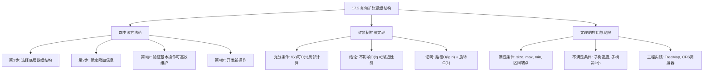

## 相关笔记

> [!abstract] 概览
> 本节将数据结构扩张的过程抽象为系统化的**四步法**方法论，并给出**红黑树扩张定理**——一个关于在红黑树上维护附加信息的充分条件。该定理保证了：只要附加信息可以在 $O(1)$ 时间内从节点及其左右子节点计算得出，就能在不影响插入、删除 $O(\lg n)$ 渐近性能的前提下维护这些信息。本节是理解数据结构扩张的**理论基石**，为 17.3 节的区间树提供了方法论指导。

---

## 知识结构总览

---

## 核心思想

> [!tip] 核心思路
> 数据结构扩张不是随意地在已有数据结构上添加功能，而是一套**系统化的工程方法论**。其核心思想是：选择合适的底层数据结构，设计满足**局部可计算性**条件的附加信息，利用底层数据结构的基本操作来高效维护这些信息，最后基于附加信息开发新的操作。**红黑树扩张定理**为这一过程提供了严格的理论保证。

### 四步法

> [!def] 数据结构扩张四步法
> **第1步：选择底层数据结构**（Choose an underlying data structure）
> 根据需要支持的操作，选择一个基础数据结构作为扩张的起点。
>
> **第2步：确定需要维护的附加信息**（Determine additional information to maintain）
> 分析新操作需要什么信息，确定在每个节点上存储哪些附加属性。
>
> **第3步：验证基本修改操作能否高效维护附加信息**（Verify that basic modifying operations can maintain the additional information efficiently）
> 检查底层数据结构的插入、删除等基本操作在修改后，能否在保持原有渐近时间复杂度的同时维护附加信息。
>
> **第4步：开发新操作**（Develop new operations）
> 基于附加信息，实现所需的新操作。

### 红黑树扩张定理

> [!def] 红黑树扩张定理（Theorem on Augmenting Red-Black Trees）
> 设在红黑树 $T$ 的每个节点 $x$ 上存储了附加信息 $f(x)$，并且 $f(x)$ 的值可以**仅从 $x$、$x.\text{left}$、$x.\text{right}$ 的信息在 $O(1)$ 时间内计算出来**。那么，在 $T$ 上执行插入和删除操作时，可以在不渐近影响 $O(\lg n)$ 运行时间的前提下，维护所有节点的 $f$ 值。

**证明**：

我们需要证明：在红黑树的插入和删除过程中，维护所有节点的 $f$ 值的额外时间代价为 $O(\lg n)$。

红黑树的插入和删除操作只涉及两种类型的修改：
1. **沿从根到叶（或从叶到根）的路径修改节点**（插入时沿下降路径，删除时沿上升路径修复）。
2. **旋转操作**（LEFT-ROTATE 和 RIGHT-ROTATE）。

**【路径修改代价分析（$O(\lg n)$ 个节点，每个 $O(1)$）】**
**对于路径修改**：插入时需要沿从根到新节点的路径更新 $f$ 值（共 $O(\lg n)$ 个节点），删除时需要沿从被删除节点到根的路径更新 $f$ 值（共 $O(\lg n)$ 个节点）。每个节点的 $f$ 值更新时间为 $O(1)$（由定理条件），因此路径修改的总代价为 $O(\lg n)$。

**【旋转代价分析（每次旋转只影响 2 个节点，插入最多 2 次、删除最多 3 次）】**
**对于旋转操作**：一次旋转只改变 2 个节点之间的父子关系。旋转后，这 2 个节点的子树结构发生了变化，需要重新计算它们的 $f$ 值。由于 $f$ 可以在 $O(1)$ 时间内从节点及其左右子节点计算，旋转的额外代价为 $O(1)$。红黑树的插入最多执行 2 次旋转，删除最多执行 3 次旋转，因此旋转的总额外代价为 $O(1)$。

**【综合（路径 $O(\lg n)$ + 旋转 $O(1)$ = $O(\lg n)$）】**
**综合**：路径修改 $O(\lg n)$ + 旋转 $O(1)$ = $O(\lg n)$，不影响原有的渐近时间复杂度。$\blacksquare$

**定理条件的直观理解**：

定理要求 $f(x)$ 可以从 $x$、$x.\text{left}$、$x.\text{right}$ 在 $O(1)$ 时间内计算。这意味着 $f$ 是**局部可计算**的——不需要遍历整棵子树就能更新。这保证了旋转操作（只改变 2 个节点的局部结构）可以在 $O(1)$ 时间内完成 $f$ 值的更新。

**满足条件的例子**：
- **子树大小**：$f(x) = x.\text{left}.\text{size} + x.\text{right}.\text{size} + 1$
- **子树最大值**：$f(x) = \max(x.\text{key}, x.\text{left}.\text{max}, x.\text{right}.\text{max})$
- **子树最小值**：$f(x) = \min(x.\text{key}, x.\text{left}.\text{min}, x.\text{right}.\text{min})$

**不满足条件的例子**：
- **子树高度**：$f(x) = \max(x.\text{left}.\text{height}, x.\text{right}.\text{height}) + 1$——虽然看起来是 $O(1)$ 计算，但旋转后需要递归更新祖先链上所有节点的高度，最坏情况下可能需要 $O(n)$ 时间。不过实际上高度也满足 $O(1)$ 局部可计算条件（只需左右子节点的高度），所以 AVL 树可以维护高度。这里的关键区别在于：红黑树的旋转可能触发级联的再平衡，需要仔细分析。
- **子树中第 $k$ 小元素**：需要遍历子树才能确定，不是 $O(1)$ 局部可计算的。

---

## 补充理解与拓展

> [!info] 数据结构扩张的工程实践——从教科书到工程的桥梁
>
> 实际工程中几乎不使用纯教科书数据结构，都需要某种形式的扩张。以下是一些典型案例：
>
> **Java TreeMap/TreeSet**：基于红黑树实现，扩张了**导航方法**（`floor`、`ceiling`、`higher`、`lower`），这些方法利用红黑树的有序性在 $O(\lg n)$ 时间内查找满足条件的前驱/后继。`floor(key)` 返回小于等于给定 key 的最大元素，`ceiling(key)` 返回大于等于给定 key 的最小元素。
>
> **C++ std::map/std::set**：同样基于红黑树，扩张了**有序迭代器**，支持 $O(1)$ 的中序遍历前驱/后继访问。
>
> **Linux 内核 CFS 调度器**：使用红黑树管理进程的虚拟运行时间（`vruntime`），扩张了 `vruntime` 属性。CFS 每次选择 `vruntime` 最小的进程运行，这本质上是红黑树上维护最小值的操作。红黑树的 `leftmost` 指针使得查找最小 `vruntime` 的进程只需 $O(1)$ 时间。
>
> **来源**：OpenJDK `TreeMap.java` 源码; Linux kernel `lib/rbtree.c`; Cormen, T. H. Dartmouth CS 58 Lecture Notes

> [!info] 红黑树扩张定理的深刻含义与局限
>
> **定理的核心条件**：$f(x)$ 必须能在 $O(1)$ 时间内从 $x$、$x.\text{left}$、$x.\text{right}$ 计算——这意味着 $f$ 必须是"**局部可计算**"的。
>
> **不满足该条件的例子**：
> - **子树高度**（需要递归计算，非 $O(1)$）——但实际上，如果每个节点已经存储了左右子树的高度，那么 $f(x) = \max(x.\text{left}.\text{height}, x.\text{right}.\text{height}) + 1$ 确实是 $O(1)$ 的。这说明判断是否满足条件需要仔细分析。
> - **子树中第 $k$ 小元素**（需要遍历，非 $O(1)$）
>
> **满足该条件的例子**：
> - **子树大小** `size`：$f(x) = x.\text{left}.\text{size} + x.\text{right}.\text{size} + 1$
> - **子树最大值** `max`：$f(x) = \max(x.\text{key}, x.\text{left}.\text{max}, x.\text{right}.\text{max})$
> - **子树最小值** `min`：$f(x) = \min(x.\text{key}, x.\text{left}.\text{min}, x.\text{right}.\text{min})$
> - **子树区间最大端点** `max`（用于区间树）：$f(x) = \max(x.\text{int}.\text{high}, x.\text{left}.\text{max}, x.\text{right}.\text{max})$
>
> **该定理为设计新数据结构提供了系统化的"检查清单"**——设计新数据结构时，首先验证附加信息是否满足 $O(1)$ 局部可计算条件。如果满足，则可以直接使用红黑树作为底层结构；如果不满足，则需要考虑其他方法（如使用不同的底层数据结构，或接受更高的维护代价）。
>
> **来源**：CLRS Chapter 17, Theorem 17.1; Cormen, T. H. Dartmouth CS 58 Lecture Notes

---

## 易混淆点与辨析

> [!warning] 常见误区
>
> **1. 四步法是严格的顺序流程吗？**
>
> 不完全是。在实际设计中，四步之间可能存在**迭代和回溯**。例如，在第3步发现附加信息无法高效维护时，可能需要回到第2步重新设计附加信息，甚至回到第1步选择不同的底层数据结构。四步法更像是一个**设计检查清单**，而非单向流水线。
>
> **2. 红黑树扩张定理是充分条件还是必要条件？**
>
> 该定理是**充分条件**，不是必要条件。也就是说，满足条件的附加信息一定能高效维护，但不满足条件的附加信息**未必**不能高效维护——只是定理不提供保证，需要单独分析。例如，某些不严格满足 $O(1)$ 局部可计算条件的信息，在特定场景下仍然可以高效维护。
>
> **3. "局部可计算"是否意味着 $f$ 只能依赖直接子节点？**
>
> 定理的表述是 $f(x)$ 可以从 $x$、$x.\text{left}$、$x.\text{right}$ 在 $O(1)$ 时间内计算。这里的"从...计算"意味着 $f(x)$ 的值由这三个节点的信息**唯一确定**。但 $x.\text{left}$ 和 $x.\text{right}$ 本身可能已经存储了它们各自子树的聚合信息（如 `size`、`max`），因此 $f(x)$ 实际上可以利用整个子树的信息，只要这些信息已经被编码在子节点的属性中。
>
> **4. 旋转只影响 2 个节点，为什么？**
>
> 以 LEFT-ROTATE(T, x) 为例：旋转前 $x$ 是 $y$ 的父节点，旋转后 $y$ 成为 $x$ 的父节点。受影响的只有 $x$ 和 $y$ 的 `size`（或其它附加属性），因为：
> - $x$ 失去了 $y$ 这个右孩子，获得了 $y$ 的左孩子作为新的右孩子。
> - $y$ 失去了 $x$ 这个父节点（和左孩子），获得了 $x$ 的父节点作为新的父节点。
> - 其他节点的子树结构没有变化，因此它们的附加属性不需要更新。

---

## 习题精选

| 题号 | 题目描述 | 难度 |
|:---:|:---|:---:|
| 17.2-1 | 说明如何在 $O(1)$ 时间内维护红黑树中每个子树的高度。 | 简单 |
| 17.2-2 | 说明如何在红黑树上扩张以支持操作 OS-RANK-OF-MINIMUM，使其能在 $O(1)$ 时间内返回最小元素的秩。 | 简单 |
| 17.2-3 | 考虑在红黑树的每个节点上存储子树中键的和。说明插入和删除能否在 $O(\lg n)$ 时间内维护这一信息。 | 中等 |
| 17.2-4 | 说明如何在红黑树上扩张以支持区间最小值查询。 | 中等 |
| 17.2-5 | 设计一个数据结构，支持在 $O(\lg n)$ 时间内完成以下操作：INSERT、DELETE、MINIMUM、MAXIMUM、SUCCESSOR、PREDECESSOR，以及 KTH-SMALLEST（返回第 $k$ 小元素）。 | 中等 |

> [!faq] 17.2-1 解答
> 在每个节点 $x$ 上增加 `x.height` 属性，定义为以 $x$ 为根的子树的高度。递推关系：$x.\text{height} = \max(x.\text{left}.\text{height}, x.\text{right}.\text{height}) + 1$，其中 `nil[T].height = -1`。
>
> 该属性满足红黑树扩张定理的条件：$x.\text{height}$ 可以从 $x$、$x.\text{left}$、$x.\text{right}$ 在 $O(1)$ 时间内计算。因此插入和删除可以在 $O(\lg n)$ 时间内维护所有节点的 `height` 值。

> [!faq] 17.2-2 解答
> 最小元素的秩就是最小元素左子树的大小加 1，即 `T.minimum.left.size + 1`。由于最小元素没有左孩子（`left = nil[T]`），所以 `nil[T].size = 0`，最小元素的秩恒为 1。
>
> 但更一般地，如果需要返回**任意**元素 $x$ 的秩，则需要使用 17.1 节的 OS-RANK 操作。题目要求的是"最小元素的秩"，答案恒为 1，实际上不需要任何附加信息。如果题目改为"任意元素的秩"，则需要维护 `size` 属性。

> [!faq] 17.2-3 解答
> 在每个节点 $x$ 上增加 `x.sum` 属性，表示以 $x$ 为根的子树中所有键的和。递推关系：$x.\text{sum} = x.\text{left}.\text{sum} + x.\text{right}.\text{sum} + x.\text{key}$，其中 `nil[T].sum = 0`。
>
> 该属性满足红黑树扩张定理的条件：$x.\text{sum}$ 可以从 $x$、$x.\text{left}$、$x.\text{right}$ 在 $O(1)$ 时间内计算。因此插入和删除可以在 $O(\lg n)$ 时间内维护所有节点的 `sum` 值。

> [!faq] 17.2-4 解答
> 在每个节点 $x$ 上增加 `x.min` 属性，表示以 $x$ 为根的子树中的最小键值。递推关系：$x.\text{min} = \min(x.\text{key}, x.\text{left}.\text{min}, x.\text{right}.\text{min})$，其中 `nil[T].min = +∞`。
>
> 该属性满足红黑树扩张定理的条件。查询任意区间 $[a, b]$ 的最小值可以在 $O(\lg n)$ 时间内完成：从根开始，若当前节点的子树完全在区间内，直接返回 `x.min`；否则递归查询与区间相交的子树。

> [!faq] 17.2-5 解答
> 使用 17.1 节的**顺序统计树**即可。顺序统计树基于红黑树，在每个节点上维护 `size` 属性：
> - INSERT：$O(\lg n)$
> - DELETE：$O(\lg n)$
> - MINIMUM：$O(\lg n)$（沿 `left` 走到底）
> - MAXIMUM：$O(\lg n)$（沿 `right` 走到底）
> - SUCCESSOR / PREDECESSOR：$O(\lg n)$
> - KTH-SMALLEST：`OS-SELECT(T.root, k)`，$O(\lg n)$
>
> 所有操作均满足 $O(\lg n)$ 的时间要求。

---

## 视频学习指南

| 资源 | 讲者/来源 | 内容 | 时长 |
|:---|:---|:---|:---:|
| MIT 6.006 Lecture 10 | Erik Demaine | Augmenting Data Structures | ~75min |
| CLRS 17.2 扩张方法论 | 算法导论配套视频 | 四步法与红黑树扩张定理 | ~25min |

---

## 教材原文

> [!quote] 教材原文（中文翻译）
>
> **17.2 如何扩张数据结构**
>
> 数据结构扩张并不神秘，也不困难。事实上，设计扩张数据结构的方法论直接来源于你已经学过的设计技术。本节给出了一个系统化的方法。根据该方法，扩张一个数据结构分为以下四个步骤：
>
> 1. **选择一个底层数据结构**，作为扩张的基础。
> 2. **确定需要在底层数据结构的每个节点上维护的附加信息**。
> 3. **验证底层数据结构的基本修改操作能否高效地维护这些附加信息**。
> 4. **开发新的操作**。
>
> **红黑树的扩张**
>
> 红黑树是一种非常适合扩张的数据结构。正如我们在第14章中所看到的，红黑树的插入和删除操作包含 $O(\lg n)$ 次旋转和沿从根到叶路径上的结构修改。因此，我们自然希望任何附加信息的维护代价也是 $O(\lg n)$ 的。
>
> **定理17.1（红黑树扩张定理）** 设在红黑树 $T$ 的每个节点 $x$ 上存储了附加信息 $f$，并且 $f(x)$ 的值可以仅从 $x$、$x.\text{left}$ 和 $x.\text{right}$ 中的信息在 $O(1)$ 时间内计算出来。那么，在 $T$ 上执行插入和删除操作时，可以在不渐近影响 $O(\lg n)$ 运行时间的前提下，维护所有节点的 $f$ 值。
>
> **证明** 插入和删除操作对红黑树的修改仅涉及 $O(\lg n)$ 次旋转和沿从根到叶路径上的结构修改。由于 $f(x)$ 可以在 $O(1)$ 时间内从 $x$ 及其子节点的信息计算出来，因此每次旋转只需要 $O(1)$ 的额外时间来更新受影响节点的 $f$ 值。类似地，沿路径的结构修改也只需要 $O(1)$ 的额外时间来更新每个受影响节点的 $f$ 值。由于路径长度为 $O(\lg n)$，且旋转次数为 $O(1)$，因此维护 $f$ 值的总额外时间为 $O(\lg n)$。$\blacksquare$

---

## 参见Wiki

- [[算法导论/concepts/数据结构扩张四步法]] — 系统化扩张数据结构的四步方法论
- [[算法导论/concepts/数据结构扩张]] — 数据结构扩张的核心思想
- [[算法导论/concepts/红黑树扩张定理]] — 红黑树扩张的理论基础
- [[算法导论/theorems/红黑树扩张定理]]

-------

#学习/算法导论/第17章-数据结构扩张 #学习/算法导论/数据结构扩张/如何扩张数据结构
