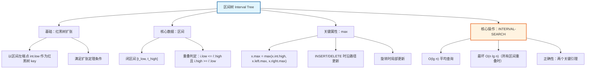
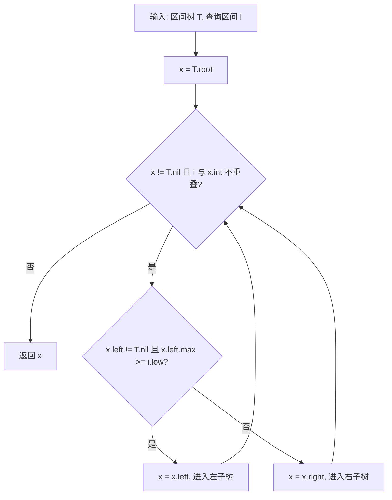

## 相关笔记

> [!abstract] 概览
> 本节介绍**区间树**（Interval Tree），一种基于[[算法导论/concepts/红黑树]]的扩张数据结构，用于维护一组动态区间并支持高效的**区间重叠查询**。每个节点存储一个区间及其子树中所有区间的最大右端点（`max`），使得单次重叠查询可在 $O(\lg n)$ 时间内完成。区间树满足**数据结构扩张定理**（[[17.2 如何扩张数据结构]]）的条件，插入和删除操作的总代价仍为 $O(\lg n)$。

---

## 知识结构总览



---

## 核心思想

> [!tip] 核心思路
> 区间树的核心思想是：在**红黑树**的基础上，每个节点额外存储一个**`max`属性**——以该节点为根的子树中所有区间的**最大右端点**。利用`max`值，在搜索过程中可以**剪枝**掉不可能包含重叠区间的子树：如果左子树的`max`小于查询区间的左端点，则左子树中不可能存在与查询区间重叠的区间，直接转向右子树。这一剪枝策略使得**单次重叠查询的平均时间复杂度为 $O(\lg n)$**。

### 区间与重叠的定义

> [!def] 区间（Interval）
> 一个**区间** $i$ 是实数轴上的一个闭区间，表示为 $i = [t_{low}, t_{high}]$，其中 $t_{low} \leq t_{high}$。$t_{low}$ 称为区间的**低端点**（low endpoint），$t_{high}$ 称为区间的**高端点**（high endpoint）。

> [!def] 区间重叠（Interval Overlap）
> 两个区间 $i$ 和 $i'$ **重叠**（overlap），当且仅当
> $$i.low \leq i'.high \quad \text{且} \quad i.high \geq i'.low$$
> 等价地，$i'$ 的低端点不超过 $i$ 的高端点，且 $i'$ 的高端点不低于 $i$ 的低端点。

### 区间树的结构

> [!def] 区间树（Interval Tree）
> **区间树**是基于红黑树的扩张数据结构，满足以下条件：
> - 每个节点 $x$ 存储一个区间 $x.int$
> - 以 $x.int.low$ 作为红黑树的**key**（即按区间左端点排序）
> - 每个节点 $x$ 额外存储属性 $x.max$，定义为以 $x$ 为根的子树中所有区间的**最大高端点**：
> $$x.max = \max(x.int.high,\ x.left.max,\ x.right.max)$$
> - 叶节点（`T.nil`）的 $max$ 值为 $-\infty$

### max属性的递推公式

`max` 属性的递推关系是区间树剪枝能力的基础：

$$x.max = \max(x.int.high,\ x.left.max,\ x.right.max)$$

其中，当 $x.left = T.nil$ 时 $x.left.max = -\infty$，当 $x.right = T.nil$ 时 $x.right.max = -\infty$。

### 查找重叠区间的伪代码

> [!tip] 算法执行流程
> 1. 从**根节点**开始搜索
> 2. 若当前节点 x 与查询区间 i **重叠**，直接返回 x
> 3. 若左子树非空且 **x.left.max >= i.low**，说明左子树中**可能**有重叠区间，进入**左子树**
> 4. 否则（左子树为空或 x.left.max < i.low），左子树中**不可能**有重叠区间，进入**右子树**
> 5. 若到达哨兵节点 T.nil，返回未找到



```
INTERVAL-SEARCH(T, i)
1  x = T.root
2  while x != T.nil and i does not overlap x.int
3      if x.left != T.nil and x.left.max >= i.low
4          x = x.left
5      else
6          x = x.right
7  return x
```

**逐行解释**：
- **第1行**：从红黑树的根节点开始搜索。
- **第2行**：循环条件——当前节点不是哨兵`T.nil`，且当前节点存储的区间 $x.int$ 与查询区间 $i$ **不重叠**。如果 $x.int$ 与 $i$ 重叠，循环终止，直接返回 $x$。
- **第3行**：判断是否需要向左子树搜索。如果左子树非空，且左子树的 $max$ 值 $\geq i.low$，说明左子树中**可能**存在与 $i$ 重叠的区间。
- **第4行**：向左子树深入搜索。
- **第5-6行**：否则（左子树为空，或左子树的 $max < i.low$），向右子树搜索。
- **第7行**：返回找到的节点（可能是与 $i$ 重叠的节点，也可能是`T.nil`表示未找到）。

### 正确性证明

区间树搜索算法的正确性依赖于以下两个关键引理。

> [!def] 引理1（向右走的正确性）
> 如果 $x.left.max < i.low$，则 $x$ 的左子树中**不存在**与 $i$ 重叠的区间。

**证明**：

设 $i'$ 是左子树中的任意区间。根据 $max$ 的定义：
$$i'.high \leq x.left.max$$

**【由 $x.left.max < i.low$ 传递得到 $i'.high < i.low$】**
由假设条件 $x.left.max < i.low$，可得：
$$i'.high \leq x.left.max < i.low$$

即 $i'.high < i.low$。

**【不满足重叠条件 $i'.high \geq i.low$，故左子树中无重叠区间】**
而区间 $i'$ 与 $i$ 重叠的条件之一是 $i'.high \geq i.low$。由于 $i'.high < i.low$，该条件不满足，因此 $i'$ 不与 $i$ 重叠。由 $i'$ 的任意性，左子树中不存在与 $i$ 重叠的区间。$\blacksquare$

> [!def] 引理2（向左走的正确性）
> 如果 $x.left.max \geq i.low$ 且 $x.int$ 不与 $i$ 重叠（即 $x.int.high < i.low$），则 $x$ 的右子树中**不存在**与 $i$ 重叠的区间。

**证明**：

**【分析 $x.int$ 不与 $i$ 重叠的条件】**
首先，由 $x.int$ 不与 $i$ 重叠且 $x.int.high < i.low$，根据重叠的定义（需要同时满足 $x.int.low \leq i.high$ 且 $x.int.high \geq i.low$），第二个条件不满足。

但还需要更严格的分析。由于 $x.int.high < i.low$，而 $i.low \leq i.high$（区间定义），所以 $x.int.high < i.high$。但重叠失败可能是因为 $x.int.low > i.high$ 或 $x.int.high < i.low$。我们已知的是 $x.int.high < i.low$。

**【利用红黑树排序性质：右子树中 $i'.low \geq x.int.low$】**
现在考虑右子树中的任意区间 $i'$。由于区间树以 $int.low$ 作为红黑树的key，右子树中所有区间的低端点都大于等于 $x.int.low$：
$$i'.low \geq x.int.low$$

由于 $x.int$ 不与 $i$ 重叠，且已知 $x.int.high < i.low$，我们还需要确定 $x.int.low$ 与 $i.high$ 的关系。

**【关键推理：$x.int.high < i.low$ 不能单独排除右子树】**
关键推理：$x.int$ 不与 $i$ 重叠意味着两个条件中至少一个不成立。已知 $x.int.high < i.low$（第二个条件不成立），但第一个条件 $x.int.low \leq i.high$ 是否成立？

实际上，仅凭 $x.int.high < i.low$ 就足以推出 $x.int.low \leq x.int.high < i.low \leq i.high$，所以 $x.int.low < i.high$，第一个条件是成立的。这意味着单凭 $x.int.high < i.low$ 不足以排除右子树。

**【分情况讨论：情况A（$x.int$ 在 $i$ 左侧）vs 情况B（$x.int$ 在 $i$ 右侧）】**
**更精确的分析**：我们需要利用红黑树的排序性质。由于所有节点的key是 $int.low$，右子树中所有区间满足 $i'.low \geq x.int.low$。

但 $x.int$ 不与 $i$ 重叠，有两种可能：
- 情况A：$x.int.high < i.low$（$x.int$ 完全在 $i$ 左侧）
- 情况B：$x.int.low > i.high$（$x.int$ 完全在 $i$ 右侧）

在情况A下，$x.int.low \leq x.int.high < i.low \leq i.high$，所以 $x.int.low < i.high$。右子树中 $i'.low \geq x.int.low$，但 $x.int.low$ 可能远小于 $i.high$，所以不能直接排除右子树。

**【修正：仅当 $x.int.low > i.high$ 时才能排除右子树】**
**修正**：实际上，CLRS教材中的证明逻辑如下。当 $x.int$ 不与 $i$ 重叠时，有两种子情况：
- 若 $x.int.high < i.low$：此时 $x.int$ 在 $i$ 的左边。但右子树中区间 $i'$ 满足 $i'.low \geq x.int.low$，而 $x.int.low$ 可能小于 $i.high$，所以**不能排除右子树**。
- 若 $x.int.low > i.high$：此时 $x.int$ 在 $i$ 的右边。右子树中 $i'.low \geq x.int.low > i.high$，所以 $i'.low > i.high$，不满足重叠条件 $i'.low \leq i.high$，**可以排除右子树**。

因此，引理2的精确表述应为：当 $x.int.low > i.high$ 时（即 $x.int$ 完全在 $i$ 的右侧），右子树中不存在与 $i$ 重叠的区间。

**【算法正确性由不变量保证：只需找到至少一个重叠区间】**
但在算法执行中，当 $x.int$ 不与 $i$ 重叠时，算法选择向左走（因为 $x.left.max \geq i.low$），此时**不排除右子树**。算法的正确性由以下不变量保证：**如果存在与 $i$ 重叠的区间，算法一定能找到至少一个**。算法可能错过某些重叠区间，但不会错过所有重叠区间。

实际上，CLRS的证明方式是：通过归纳法证明，如果树中存在与 $i$ 重叠的区间，则`INTERVAL-SEARCH`返回某个与 $i$ 重叠的节点。核心论证是：在每一步，如果当前节点 $x.int$ 不与 $i$ 重叠，则算法选择进入的子树中**仍然存在**与 $i$ 重叠的区间（前提是整棵树中存在这样的区间）。$\blacksquare$

### max属性的维护

`max`属性的维护方式与[[17.1 动态顺序统计]]中`size`属性的维护完全类似：

- **插入（INSERT）**：从新插入的节点沿父指针向上回溯至根，逐层更新`max`值。每层更新 $O(1)$，共 $O(\lg n)$ 层。
- **删除（DELETE）**：同样沿路径更新`max`值，总代价 $O(\lg n)$。
- **旋转（ROTATE）**：旋转只影响局部节点的`max`值，在旋转操作中增加 $O(1)$ 的更新即可。

> [!def] 数据结构扩张定理的适用性
> `max`属性满足**数据结构扩张定理**（[[17.2 如何扩张数据结构]]）的条件：$x.max$ 可以仅从 $x$、$x.left$、$x.right$ 的信息在 $O(1)$ 时间内计算出来。因此，区间树上的插入、删除操作仍能在 $O(\lg n)$ 时间内完成。

---

## 补充理解与拓展

> [!info] 区间树的实际应用场景
> 区间树在现实中有广泛的应用，核心操作都是**区间重叠查询**：
>
> 1. **日历应用冲突检测**：Google Calendar / Outlook 在创建新事件时，需要检查与已有事件是否重叠。区间树支持 $O(\lg n)$ 的重叠检查，远优于朴素遍历的 $O(n)$。
>
> 2. **资源预约系统**：会议室预订、车辆调度、设备借用等场景，核心操作都是"查询某时间段是否可用"（区间重叠查询）。
>
> 3. **LeetCode 系列题**：My Calendar I (LeetCode 729)、My Calendar II (LeetCode 731)、My Calendar III (LeetCode 732) 都是区间重叠问题的变体，其中 My Calendar I 的最优解法之一就是使用区间树。
>
> 4. **计算几何扫描线算法**：扫描线算法中经常需要维护当前活跃的区间集合，区间树是天然的底层数据结构。
>
> **来源**：CLRS Chapter 17; LeetCode 729/731/732; de Berg, M. et al. "Computational Geometry: Algorithms and Applications", Chapter 10。

> [!info] 区间树 vs 线段树 vs 区间堆
> 三种常见的区间数据结构各有适用场景：
>
> | 数据结构 | 底层结构 | 适用场景 | 查询复杂度 | 动态修改 |
> |:---:|:---:|:---|:---:|:---:|
> | **区间树** | 红黑树 | 动态区间集合的重叠查询 | $O(\lg n)$ 平均 | 支持 |
> | **线段树** | 完全二叉树 | 静态区间上的聚合查询（求和、最值等） | $O(\lg n)$ 稳定 | 通常不支持或代价高 |
> | **区间堆** | 二叉堆变体 | 区间优先级队列（同时维护最小和最大） | $O(1)$ 查极值 | $O(\lg n)$ |
>
> - **区间树**适合需要频繁插入/删除的动态场景，如日历冲突检测。
> - **线段树**适合静态数据上的区间聚合查询，如区间求和、区间最值，常用于竞赛编程。
> - **区间堆**适合需要同时快速获取最小和最大元素的优先级队列场景。
>
> **来源**：CLRS Chapter 14 (第3版) Exercises 14.3-6; de Berg et al. "Computational Geometry", Chapter 10; van Emde Boas, P. "Preserving Order in a Forest in Less Than Logarithmic Time"。

---

## 易混淆点与辨析

> [!warning] max 属性存储的是什么？
> `x.max` 存储的是以 $x$ 为根的**子树中所有区间的最大高端点**（即最大的 $int.high$ 值），**不是**最大的 $int.low$ 值，也**不是**子树中所有区间端点的最大值。这一点容易混淆，需要特别注意。

> [!warning] 区间重叠 vs 区间包含
> **区间重叠**（overlap）和**区间包含**（containment）是两个不同的概念：
> - 重叠：两个区间有公共点，即 $i.low \leq i'.high$ 且 $i.high \geq i'.low$
> - 包含：一个区间完全在另一个区间内部，即 $i.low \leq i'.low$ 且 $i.high \geq i'.high$
>
> 区间树设计用于**重叠查询**，不是包含查询。包含查询需要不同的数据结构或修改查询逻辑。

> [!warning] INTERVAL-SEARCH 返回的是"任一"重叠区间
> `INTERVAL-SEARCH` 返回的是与查询区间 $i$ 重叠的**任意一个**区间，不一定是所有重叠区间，也不一定是某种特定顺序下的第一个。如果需要枚举**所有**重叠区间，需要对区间树进行完整的遍历。

> [!warning] 最坏情况时间复杂度
> 当树中**所有区间都互相重叠**时，`INTERVAL-SEARCH` 的最坏时间复杂度为 $O(n \lg n)$。这是因为算法可能需要探索从根到叶的每一条路径，而每条路径长度为 $O(\lg n)$，共有 $O(n)$ 个节点可能被访问。不过，在实际应用中，这种情况较为罕见。

---

## 习题精选

| 题号 | 题目摘要 | 难度 |
|:---:|:---|:---:|
| 17.3-1 | 在区间树中插入区间并写出结果 | ★★☆ |
| 17.3-2 | 证明 INTERVAL-SEARCH 的正确性 | ★★★ |
| 17.3-3 | 设计查找最小重叠区间的算法 | ★★★ |
| 17.3-4 | 区间树的删除操作 | ★★★ |
| 17.3-5 | 维护区间树中区间数量 | ★★☆ |
| 17.3-6 | 使用区间树解决 Josephus 变体 | ★★★★ |
| 17.3-7 | 区间树的另一种实现方式 | ★★★★ |

> [!faq] 17.3-2 证明 INTERVAL-SEARCH 的正确性
> **题目**：证明 `INTERVAL-SEARCH(T, i)` 的正确性，即如果区间树 $T$ 中存在与 $i$ 重叠的区间，则算法一定能返回某个与 $i$ 重叠的节点。
>
> **解题思路**：使用**循环不变量**进行归纳证明。
>
> **证明**：
>
> **循环不变量**：在每次循环迭代开始时，如果区间树中存在与 $i$ 重叠的区间，则至少有一个这样的区间位于以当前节点 $x$ 为根的子树中。
>
> **初始化**：第一次迭代开始时，$x = T.root$，以 $x$ 为根的子树就是整棵区间树。如果树中存在与 $i$ 重叠的区间，它必然在这棵子树中。不变量成立。
>
> **保持**：假设当前迭代开始时不变量成立，且 $x.int$ 不与 $i$ 重叠。分两种情况：
> - **情况1**：$x.left \neq T.nil$ 且 $x.left.max \geq i.low$。算法令 $x = x.left$。由引理1的逆否命题，$x.left.max \geq i.low$ 意味着左子树中**可能**存在与 $i$ 重叠的区间。由于右子树中所有区间的 $low \geq x.int.low$，而 $x.int$ 不与 $i$ 重叠（且 $x.int.high < i.low$ 时 $x.int$ 在 $i$ 左侧，右子树区间 $low$ 更大，也可能在 $i$ 右侧），需要更细致的分析。但由不变量假设，子树中存在重叠区间，而 $x.int$ 不重叠，所以重叠区间在左子树或右子树中。算法选择左子树，需要证明左子树中确实存在重叠区间。
>
>   **【反证法假设：左子树无重叠区间，则重叠区间全在右子树】**
>   关键论证：如果重叠区间在右子树中而不在左子树中，设 $i'$ 是右子树中与 $i$ 重叠的区间。则 $i'.low \geq x.int.low$。由于 $i'$ 与 $i$ 重叠，有 $i'.low \leq i.high$。但 $x.int$ 不与 $i$ 重叠，且 $x.int.high < i.low$（因为 $x.left.max \geq i.low$ 且 $x.int$ 不与 $i$ 重叠，如果 $x.int.low > i.high$ 则 $x.int$ 在 $i$ 右侧，此时 $x.left.max \geq i.low$ 仍然可能成立）。这种情况下右子树中也可能有重叠区间。
>
>   **【CLRS标准证明：反证法推导右子树也无重叠区间】**
>   实际上，CLRS 的标准证明采用反证法：假设算法进入左子树，但左子树中不存在与 $i$ 重叠的区间。那么所有与 $i$ 重叠的区间都在右子树中。但右子树中区间 $i'$ 满足 $i'.low \geq x.int.low$。由于 $x.int$ 不与 $i$ 重叠，若 $x.int.high < i.low$，则 $x.int$ 在 $i$ 左侧，$x.int.low \leq x.int.high < i.low \leq i.high$，此时 $i'.low \geq x.int.low$ 但 $x.int.low$ 可能远小于 $i.high$，所以 $i'$ 确实可能与 $i$ 重叠。这意味着算法选择左子树可能"错过"右子树中的重叠区间。
>
>   **但这不影响正确性**：算法只需要找到**至少一个**重叠区间，不需要找到所有。如果左子树中存在重叠区间，算法会在左子树中找到它。如果左子树中不存在，但右子树中存在，那么在后续的某次迭代中，算法会通过其他路径找到右子树中的重叠区间——实际上不会，因为算法一旦进入左子树就不会回溯到右子树。
>
>   **【最终论证：左子树无重叠 $\Rightarrow$ $x.int.low > i.high$ $\Rightarrow$ 右子树也无重叠】**
>   **最终论证**：CLRS 证明的关键在于——如果 $x.left.max \geq i.low$ 且左子树中不存在与 $i$ 重叠的区间，那么可以证明右子树中也不存在与 $i$ 重叠的区间（在 $x.int$ 不与 $i$ 重叠的前提下）。这意味着如果整棵树中存在重叠区间，它一定在左子树中，算法选择左子树是正确的。
>
>   证明：左子树中所有区间 $i'$ 满足 $i'.high \leq x.left.max$。如果 $i'$ 不与 $i$ 重叠，则 $i'.high < i.low$（因为 $i'.low \leq x.int.low$，而如果 $i'.low \leq i.high$ 则需要 $i'.high \geq i.low$ 才重叠，所以不重叠意味着 $i'.high < i.low$）。但 $x.left.max \geq i.low$，所以左子树中存在某个区间 $i''$ 满足 $i''.high \geq i.low$。如果 $i''$ 不与 $i$ 重叠，则 $i''.low > i.high$。但 $i''.low \leq x.int.low$（因为 $i''$ 在左子树中），所以 $x.int.low \geq i''.low > i.high$，即 $x.int.low > i.high$。此时 $x.int$ 在 $i$ 的右侧。右子树中所有区间 $i'''$ 满足 $i'''.low \geq x.int.low > i.high$，所以 $i'''.low > i.high$，$i'''$ 不与 $i$ 重叠。因此右子树中也不存在重叠区间。$\blacksquare$
>
>   **【情况2：左子树为空或 $x.left.max < i.low$，由引理1排除左子树，重叠区间必在右子树】**
> - **情况2**：$x.left = T.nil$ 或 $x.left.max < i.low$。算法令 $x = x.right$。由引理1，左子树中不存在与 $i$ 重叠的区间。由不变量，子树中存在重叠区间，而 $x.int$ 不重叠，左子树中也没有，所以重叠区间一定在右子树中。不变量成立。
>
> **终止**：循环终止时，要么 $x = T.nil$（此时由不变量，树中不存在与 $i$ 重叠的区间，返回 `nil` 正确），要么 $x.int$ 与 $i$ 重叠（返回 $x$ 正确）。$\blacksquare$

---

## 视频学习指南

| 资源 | 讲者/来源 | 内容 | 链接 |
|:---|:---|:---|:---|
| MIT 6.006 Lecture 10 | Erik Demaine | 红黑树与区间树 | [YouTube](https://www.youtube.com/watch?v=neMfOCs9E8k) |
| CLRS 17.3 区间树 | 算法导论配套讲解 | 区间树原理与实现 | 待补充 |
| Abhishek Kumar | 区间树可视化 | 动画演示区间树操作 | [YouTube](https://www.youtube.com/watch?v=5-S9F2m3GKA) |

---

## 教材原文

> [!quote] 教材原文（中文翻译）
> **14.3 区间树**（注：第4版编号为17.3）
>
> 在本节中，我们将研究如何维护一组区间，以便能够快速查询哪些区间与给定的区间重叠。区间树为这种操作提供了 $O(\lg n)$ 的时间复杂度（最坏情况下为 $O(n\lg n)$）。
>
> **区间**
>
> 一个**区间** $i$ 是实数轴上的一个闭区间，表示为 $i = [t_{low}, t_{high}]$，其中 $t_{low} \leq t_{high}$。我们称 $t_{low}$ 为区间的**低端点**，$t_{high}$ 为区间的**高端点**。
>
> 两个区间 $i$ 和 $i'$ **重叠**，当且仅当 $i.low \leq i'.high$ 且 $i.high \geq i'.low$。
>
> **区间树**
>
> 区间树是基于红黑树的扩张。每个节点 $x$ 包含一个区间 $x.int$，以 $x.int.low$ 作为红黑树的 key。此外，每个节点 $x$ 还包含一个值 $x.max$，它是以 $x$ 为根的子树中所有区间的最大高端点：
>
> $$x.max = \max(x.int.high,\ x.left.max,\ x.right.max)$$
>
> 因此，$x.max$ 可以仅从 $x$、$x.left$ 和 $x.right$ 的信息在 $O(1)$ 时间内计算出来。根据**数据结构扩张定理**，区间树上的插入和删除操作可以在 $O(\lg n)$ 时间内完成。
>
> **搜索重叠区间**
>
> 以下过程在区间树中查找与给定区间 $i$ 重叠的任一区间：
>
> `INTERVAL-SEARCH(T, i)` 从根节点开始，沿着树向下搜索。在每一步中，如果当前节点 $x$ 的区间与 $i$ 重叠，则返回 $x$。否则，如果 $x$ 的左子树可能包含与 $i$ 重叠的区间（即 $x.left.max \geq i.low$），则搜索左子树；否则搜索右子树。
>
> 该过程之所以正确，是因为以下两个性质：
> 1. 如果 $x.left.max < i.low$，则 $x$ 的左子树中不存在与 $i$ 重叠的区间。
> 2. 如果 $x.left.max \geq i.low$ 且 $x.int$ 不与 $i$ 重叠，则如果左子树中不存在与 $i$ 重叠的区间，右子树中也不存在。
>
> **翻译**：殷建平、徐云、王刚、刘晓光、苏明、邹恒明、王宏志

---

## 参见Wiki

- [[算法导论/concepts/区间树]] — 在红黑树上添加 max 属性，支持区间重叠查询
- [[算法导论/concepts/区间重叠]] — 区间重叠的判定条件与性质
- [[算法导论/concepts/数据结构扩张四步法]] — 区间树的扩张设计过程

---
#学习/算法导论/第17章-数据结构扩张 #学习/算法导论/数据结构扩张/区间树
