## 相关笔记

- **前置笔记**：[[算法导论/concepts/二叉搜索树]]（B树是二叉搜索树的一般化）、[[算法导论/concepts/红黑树]]（红黑树是最小度t=2的B树）
- **关联笔记**：[[18.2 B树的基本操作]]、[[18.3 从B树中删除关键字]]
- **章节汇总**：[[第18章_B树-章节汇总]]

> [!abstract] 概览
> - B树是为==磁盘等外部存储==设计的一种==平衡搜索树==，核心目标是==最小化磁盘I/O次数==
> - 每个节点可包含==多个关键字==和==多个孩子指针==，节点大小设计为匹配==磁盘页==大小
> - 由参数==最小度t==（minimum degree）控制，每个节点最多 $2t-1$ 个关键字，最少 $t-1$ 个关键字
> - 所有==叶子节点在同一层==，保证树的高度为 $O(\log_t n)$
> - 红黑树吸收红色子节点后，等价于==最小度t=2的B树==（即2-3-4树）

---

## 知识结构总览

```mermaid
flowchart TD
    A["B树的定义"] --> B["动机：磁盘I/O优化"]
    A --> C["最小度 t 的定义"]
    A --> D["B树的5条基本性质"]
    A --> E["高度分析"]
    A --> F["节点存储结构"]
    A --> G["与红黑树的关系"]

    B --> B1["磁盘访问 ≈ 内存访问的 10^5 倍"]
    B --> B2["减少树高 = 减少磁盘I/O"]
    B --> B3["节点大小 = 磁盘页大小"]

    C --> C1["t ≥ 2"]
    C --> C2["控制分支因子范围"]

    D --> D1["性质1：每个节点最多 2t-1 个关键字"]
    D --> D2["性质2：根至少 1 个关键字"]
    D --> D3["性质3：其他节点至少 t-1 个关键字"]
    D --> D4["性质4：所有叶子在同一层"]
    D --> D5["性质5：节点关键字有序排列"]

    E --> E1["最小节点数 → 高度上界"]
    E --> E2["h ≤ log_t((n+1)/2)"]
    E --> E3["最大关键字数：(2t)^(h+1) - 1"]

    F --> F1["key[1..n]：关键字数组"]
    F --> F2["c[1..n+1]：孩子指针数组"]
    F --> F3["leaf：叶标志"]
    F --> F4["n：当前关键字数"]

    G --> G1["吸收红色子节点"]
    G --> G2["得到最小度 t=2 的B树"]
    G --> G3["即 2-3-4 树"]
```

---

## 核心思想

### 2.1 为什么需要B树？

> [!tip] 核心思路
> **B树的核心设计思想是"用空间换I/O"**：将二叉搜索树的每个节点从存储1个关键字扩展为存储多个关键字，使每个节点恰好填满一个==磁盘页==（通常4KB或16KB）。这样，每次磁盘I/O就能读取大量关键字信息，从而将==树的高度大幅降低==，将搜索所需的磁盘I/O次数从 $O(\log_2 n)$ 降到 $O(\log_t n)$（其中 $t$ 远大于2）。

**类比理解**：想象你在图书馆找一本书。

- **二叉搜索树**就像每层楼只有2个房间，每个房间只放1本书的索引卡片。要找到目标书，你需要在很多层楼之间跑来跑去。
- **B树**就像每层楼有几十个房间，每个房间放满索引卡片。你只需去很少几层楼就能找到目标书。

虽然每个房间（节点）更大了，但因为你==一次性读取整个房间==（一次磁盘I/O读取整个磁盘页），所以效率反而更高。

**具体数据对比**：

| 参数 | 二叉搜索树/红黑树 | B树（t=200） |
|------|-------------------|-------------|
| 每个节点关键字数 | 1 | 100~399 |
| n=100万时树高 | 约20 | 约3~4 |
| 每个节点大小 | 几十字节 | 约40KB |
| 磁盘页利用率 | 极低（大量浪费） | 高（每页一个节点） |
| 搜索磁盘I/O次数 | 约20次 | 约4次 |

### 2.2 最小度t的定义

> [!def] 最小度（minimum degree）
> B树的最小度 $t \geq 2$ 是一个整数参数，它控制B树的==分支因子==（branching factor）。
> - 每个节点最多有 $2t$ 个孩子（即最多 $2t-1$ 个关键字）
> - 每个非根节点至少有 $t$ 个孩子（即至少 $t-1$ 个关键字）
> - 根节点至少有 $2$ 个孩子（即至少 $1$ 个关键字），除非树中只有根节点本身

**为什么 $t \geq 2$？** 如果 $t = 1$，则每个非根节点至少有 $0$ 个关键字（$t-1=0$），这意味着节点可以是空的，这与B树的定义矛盾。此外，$t=1$ 时每个节点最多只有 $1$ 个关键字，退化为二叉搜索树，失去了B树的优势。

### 2.3 B树的5条基本性质

> [!def] B树的定义
> 一棵==最小度为 $t \geq 2$== 的B树是满足以下性质的==有根树==：
>
> **性质1**：每个节点 $x$ 具有以下属性：
> - $x.n$：当前存储在节点 $x$ 中的==关键字个数==
> - $x.n$ 个关键字 $x.key_1, x.key_2, \ldots, x.key_{x.n}$ 以==升序==排列
> - $x.leaf$：一个布尔值，当 $x$ 为==叶节点==时为 `TRUE`，当 $x$ 为==内部节点==时为 `FALSE`
>
> **性质2**：每个内部节点 $x$ 包含 $x.n + 1$ 个孩子指针 $x.c_1, x.c_2, \ldots, x.c_{x.n+1}$。叶节点没有孩子。
>
> **性质3**：关键字 $x.key_i$ 将 $x$ 的各子树的关键字范围==分隔==开：
> - 如果 $k$ 是子树 $x.c_i$ 中任意一个关键字，则：
>   $$k_1 \leq k_2 \leq \cdots \leq k_{x.n}$$
>   且对于 $i = 1, 2, \ldots, x.n$：
>   $$x.c_i \text{ 中的所有关键字} \leq x.key_i \leq x.c_{i+1} \text{ 中的所有关键字}$$
>
> **性质4**：所有==叶节点==具有==相同的深度==（即树的高度 $h$）。
>
> **性质5**：B树满足以下关于关键字数量的约束：
> - **根节点**：至少包含 $1$ 个关键字
> - **其他每个节点**：至少包含 $t - 1$ 个关键字
> - **每个节点**：最多包含 $2t - 1$ 个关键字（因此最多有 $2t$ 个孩子）。当一个节点恰好有 $2t - 1$ 个关键字时，称该节点为==满的==（full）

**节点关键字与孩子数的关系**：

$$\text{关键字数} = \text{孩子数} - 1$$

这是因为 $n$ 个关键字将搜索空间划分为 $n+1$ 个区间，每个区间对应一棵子树。

### 2.4 B树的高度分析

> [!tip] 高度上界的推导
> B树的高度 $h$ 与存储的关键字总数 $n$ 之间的关系可以通过以下步骤推导：

**下界分析（最小节点数）**：

1. 根节点至少有 $2$ 个孩子（除非 $n=0$），每个孩子至少有 $t-1$ 个关键字。
2. 第 $1$ 层（根）至少有 $1$ 个节点，至少 $1$ 个关键字。
3. 第 $2$ 层至少有 $2$ 个节点，每个至少 $t-1$ 个关键字，共至少 $2(t-1)$ 个关键字。
4. 第 $3$ 层至少有 $2t$ 个节点，每个至少 $t-1$ 个关键字，共至少 $2t(t-1)$ 个关键字。
5. 一般地，第 $j$ 层（$j \geq 2$）至少有 $2t^{j-2}$ 个节点。

因此，一棵高度为 $h$ 的B树中，关键字总数 $n$ 满足：

$$n \geq 1 + \sum_{j=1}^{h} 2t^{j-1}(t-1) = 1 + 2(t-1) \cdot \frac{t^h - 1}{t - 1} = 1 + 2(t^h - 1) = 2t^h - 1$$

解出 $h$：

$$h \leq \log_t \frac{n+1}{2}$$

**上界分析（最大关键字数）**：

每层每个节点最多有 $2t-1$ 个关键字，最多有 $2t$ 个孩子。

- 第 $0$ 层（根）：$1$ 个节点，最多 $2t - 1$ 个关键字
- 第 $1$ 层：最多 $2t$ 个节点，最多 $2t(2t-1)$ 个关键字
- 第 $j$ 层：最多 $(2t)^j$ 个节点，最多 $(2t)^j(2t-1)$ 个关键字

总关键字数：

$$n \leq \sum_{j=0}^{h} (2t)^j(2t - 1) = (2t - 1) \cdot \frac{(2t)^{h+1} - 1}{2t - 1} = (2t)^{h+1} - 1$$

### 2.5 节点存储结构

> [!def] B树节点的磁盘表示
> 一个B树节点 $x$ 在磁盘上的存储格式如下：
>
> | 字段 | 含义 | 大小 |
> |------|------|------|
> | $x.n$ | 当前存储的关键字个数 | 1个整数 |
> | $x.key[1..n]$ | $n$ 个关键字，升序排列 | $n$ 个关键字 |
> | $x.c[1..n+1]$ | $n+1$ 个孩子指针 | $n+1$ 个磁盘地址 |
> | $x.leaf$ | 是否为叶节点 | 1个布尔值 |
>
> 在实际实现中，$key$ 和 $c$ 数组通常分配固定大小 $2t-1$ 和 $2t$，以避免动态分配。

### 2.6 与红黑树的关系

> [!tip] 红黑树与B树的等价性
> 将一棵==红黑树==中每个==红色节点==与其==黑色父节点==合并（即"吸收"红色子节点），得到的结构恰好是一棵==最小度 $t = 2$ 的B树==，也称为==2-3-4树==。
>
> - **黑色节点**对应B树中的一个关键字
> - **红色节点**被吸收到其黑色父节点中，使该B树节点可以包含1、2或3个关键字（对应原来的2-3-4节点）
> - 红黑树的==黑高度==对应B树的==高度==
> - 红黑树的==旋转操作==对应B树的==分裂与合并操作**

**对应关系**：

| 红黑树结构 | B树等价结构 |
|-----------|------------|
| 黑节点（无红色子节点） | 含1个关键字的B树节点 |
| 黑节点 + 1个红色子节点 | 含2个关键字的B树节点 |
| 黑节点 + 2个红色子节点 | 含3个关键字的B树节点 |

---

## 补充理解与拓展

### 3.1 B树的发明历史

B树由 **Rudolf Bayer** 和 **Edward M. McCreight** 于1972年提出，论文发表于 *Acta Informatica*：

> Bayer, R. & McCreight, E. (1972). "Organization and Maintenance of Large Ordered Indexes". *Acta Informatica*, 1(3): 173-189.

**历史背景**：Bayer当时在==波音公司（Boeing）==工作，为大型数据库系统设计高效的索引结构。有趣的是，论文中从未解释"B"的含义——业界普遍认为"B"代表Boeing（公司名）、Bayer（发明者姓氏）或Balanced（平衡），但作者本人从未确认。McCreight在2009年的访谈中表示，B并没有特定含义，更多是因为当时论文中已经用了A、C等字母。

### 3.2 B树变体族谱

B树自1972年提出以来，衍生出多种重要变体：

| 变体 | 提出者/年份 | 核心改进 | 来源 |
|------|-----------|---------|------|
| **B+树** | Comer, 1979 | 所有数据存储在叶节点，叶节点用链表连接；内部节点仅存索引 | Comer, D. (1979). "The Ubiquitous B-Tree". *ACM Computing Surveys*, 11(2): 121-137 |
| **B\*树** | Knuth, 1973 | 非根节点至少 $\lceil(2t-1)/3\rceil$ 个关键字，节点更满，空间利用率更高 | Knuth, D.E. (1973). *The Art of Computer Programming, Vol. 3: Sorting and Searching* |
| **Bw树** | Levandoski et al., 2013 | 无锁乐观并发控制，使用CAS操作代替 latch，适合多核SSD | Levandoski, J.J., Lomet, D.B., & Sengupta, S. (2013). "The Bw-Tree: A B-tree for New Hardware Platforms". *VLDB*, 6(11): 1081-1092 |
| **Cache-Oblivious B树** | Bender et al., 2000 | 不依赖硬件缓存参数，自动适应任意层级的内存层次 | Bender, M.A., Demaine, E.D., & Farach-Colton, M. (2000). "Cache-Oblivious B-Trees". *FOCS*, 499-509 |

### 3.3 B树 vs 红黑树：磁盘I/O视角

| 维度 | 红黑树 | B树（t=200） |
|------|--------|-------------|
| 树高（n=100万） | 约20层 | 约3-4层 |
| 每节点大小 | 几十字节~几百字节 | 约40KB（匹配磁盘页） |
| 磁盘页利用率 | 极低（一页可放数百节点但只读一个） | 高（一页恰好一个节点） |
| 搜索I/O次数 | O(h) ≈ 20次 | O(h) ≈ 4次 |
| 适用场景 | 内存数据结构 | 磁盘/SSD数据结构 |
| 插入/删除复杂度 | O(log n) CPU | O(t log_t n) CPU + O(h) I/O |

**关键洞察**：红黑树在磁盘上的效率低下的根本原因是==节点太小==。一个4KB的磁盘页可以容纳数百个红黑树节点，但搜索时每次I/O只读取一个节点，其余空间全部浪费。B树通过让每个节点恰好填满一个磁盘页，实现了==I/O带宽的充分利用==。

### 3.4 现代应用场景

B树及其变体在现代计算机系统中无处不在：

- **文件系统**：
  - NTFS（Windows）：主文件表（MFT）使用B+树组织
  - HFS+（macOS）：目录索引使用B+树
  - ext4（Linux）：目录索引使用htree（基于B树思想的哈希B树）

- **数据库索引**：
  - MySQL InnoDB：B+树，16KB页大小
  - PostgreSQL：B树索引
  - Oracle：B+树索引

- **键值存储**：
  - LevelDB/RocksDB：LSM-Tree（写优化，与B树互补）
  - MongoDB：B树索引
  - SQLite：B树，页大小可配置（默认4KB）

---

## 易混淆点与辨析

> [!warning] 常见误区
>
> **误区1："B树就是二叉树（Binary Tree）的缩写"**
> 错误。B树的"B"含义不明（可能代表Boeing、Bayer或Balanced），与Binary无关。B树是多路搜索树，不是二叉树。
>
> **误区2："B树的t值越大越好"**
> 不完全正确。t越大，树高越低，I/O次数越少；但节点内搜索时间 $O(t)$ 也越大。最优t值需要平衡磁盘I/O成本和CPU搜索成本（见18.2节习题18.2-7）。
>
> **误区3："B树的所有节点都必须是满的"**
> 错误。B树只要求节点至少 $t-1$ 个关键字（根至少1个），不要求满。节点可以是半满的，这是B树插入/删除操作的基础。
>
> **误区4："B树和B+树是同一种数据结构"**
> 错误。B+树是B树的重要变体，区别在于：B+树的所有数据（关键字+卫星数据）都存储在叶节点，内部节点仅存储索引关键字；叶节点之间通过指针连接形成有序链表，支持高效的范围查询。
>
> **误区5："最小度t=1也是合法的B树"**
> 错误。t=1时，非根节点至少 $t-1=0$ 个关键字，这意味着节点可以为空，违反B树的定义。此外，t=1时B树退化为二叉搜索树，失去了多路搜索的优势。

---

## 习题精选

### 习题概览

| 题号 | 题目 | 难度 | 考察要点 |
|------|------|------|---------|
| 18.1-1 | 为什么不允许t=1？ | 基础 | B树定义的边界条件 |
| 18.1-2 | 图18.1的合法t值 | 基础 | 最小度约束 |
| 18.1-3 | t=2时{1,2,3,4,5}的所有合法B树 | 中等 | B树结构枚举 |
| 18.1-4 | 高度h的B树最多存储多少关键字 | 基础 | 高度上界推导 |
| 18.1-5 | 红黑树吸收红色子节点 | 中等 | 红黑树与B树的等价性 |

### 详细解答

> [!faq] 18.1-1 为什么最小度t=1不是B树的合法值？
> 如果 $t = 1$，根据B树的性质5：
> - 每个非根节点至少包含 $t - 1 = 0$ 个关键字
> - 每个节点最多包含 $2t - 1 = 1$ 个关键字
>
> 这意味着非根节点可以是空的（0个关键字），这与B树作为搜索树的定义矛盾。此外，$t=1$ 时每个节点最多1个关键字，B树退化为二叉搜索树，失去了多路搜索树减少I/O的核心优势。
>
> 从数学角度看，$t=1$ 时高度上界公式 $h \leq \log_t \frac{n+1}{2} = \log_1 \frac{n+1}{2}$ 无意义（$\log_1$ 未定义）。

> [!faq] 18.1-2 图18.1中的B树，合法的最小度t值有哪些？
> 图18.1中的B树，根节点有1个关键字，内部节点最多有3个关键字。
>
> 根据B树性质5：
> - 每个节点最多 $2t - 1$ 个关键字，所以 $2t - 1 \geq 3$，即 $t \geq 2$
> - 非根节点至少 $t - 1$ 个关键字，图中非根节点最少有2个关键字，所以 $t - 1 \leq 2$，即 $t \leq 3$
>
> 因此合法的 $t$ 值为 $t = 2$ 或 $t = 3$。

> [!faq] 18.1-3 当t=2时，画出包含关键字{1,2,3,4,5}的所有合法B树
> 当 $t = 2$ 时，每个节点最多 $2t-1 = 3$ 个关键字，最少 $t-1 = 1$ 个关键字（根至少1个）。
>
> 所有合法B树结构如下（仅列出根节点的不同情况）：
>
> **情况1**：根节点含3个关键字（满节点）
> - 根：[1, 2, 3]，左孩子：[4]，右孩子：[5]
> - 根：[1, 2, 4]，左孩子：[3]，右孩子：[5]
> - 根：[1, 3, 4]，左孩子：[2]，右孩子：[5]
> - ...（多种排列）
>
> **情况2**：根节点含2个关键字
> - 根：[2, 4]，左孩子：[1]，中孩子：[3]，右孩子：[5]
> - 根：[3, 5]，左孩子：[1]，中孩子：[2]，右孩子：[4]
> - ...（多种排列）
>
> **情况3**：根节点含1个关键字，高度为2
> - 根：[3]，左孩子含[1,2]，右孩子含[4,5]
> - 根：[3]，左孩子含[1]，中孩子含[2]，右孩子含[4,5]
> - ...（多种排列）
>
> **情况4**：所有关键字在一个节点中
> - 根：[1, 2, 3, 4, 5]——但 $t=2$ 时最多3个关键字，不合法！
>
> 因此不存在所有关键字在一个节点中的情况。合法B树的高度为1或2。

> [!faq] 18.1-4 证明：高度为h的B树中，关键字数n满足 $n \leq (2t)^{h+1} - 1$
> **证明**：
>
> 用数学归纳法。设 $N(h)$ 为高度为 $h$ 的B树中最多关键字数。
>
> **【基例：$h=0$ 时 $N(0) = 2t-1 = (2t)^1 - 1$】**
> **基例**：$h = 0$（只有根节点）。根最多 $2t - 1$ 个关键字。
> $$N(0) = 2t - 1 = (2t)^{0+1} - 1 = 2t - 1 \quad \checkmark$$
>
> **【归纳步：根最多 $2t-1$ 个关键字 + $2t$ 棵子树各 $N(h-1)$ 个】**
> **归纳步**：假设 $N(h-1) = (2t)^h - 1$。
>
> 高度为 $h$ 的B树，根最多 $2t - 1$ 个关键字，最多 $2t$ 棵子树，每棵子树高度最多 $h - 1$。
> $$N(h) = (2t - 1) + 2t \cdot N(h-1)$$
> $$= (2t - 1) + 2t \cdot ((2t)^h - 1)$$
> $$= 2t - 1 + (2t)^{h+1} - 2t$$
> $$= (2t)^{h+1} - 1 \quad \blacksquare$$

> [!faq] 18.1-5 将红黑树中的红色节点吸收到其黑色父节点中，说明得到的树是一棵B树
> **分析**：
>
> 红黑树满足以下性质：
> 1. 每个节点是红色或黑色
> 2. 根节点是黑色
> 3. 每个叶节点（NIL）是黑色
> 4. 红色节点的两个子节点都是黑色（不能有连续红色节点）
> 5. 从任一节点到其后代叶节点的所有路径包含相同数目的黑色节点
>
> 将每个红色节点与其黑色父节点合并后：
> - 合并后的"超级节点"可以包含1个、2个或3个关键字（对应原黑节点+0/1/2个红色子节点）
> - 这恰好对应 $t = 2$ 的B树（2-3-4树），其中每个节点可以有1~3个关键字
> - 红黑树的黑高度对应B树的高度
> - 红黑树性质5（黑高相同）保证所有叶节点在同一层（B树性质4）
> - 红黑树性质4（无连续红色）保证合并后节点最多3个关键字（B树性质5，$2t-1=3$）

---

## 视频学习指南

| 资源 | 讲者/来源 | 内容 | 时长 | 推荐度 |
|------|----------|------|------|--------|
| MIT 6.006 Lecture 10 | Erik Demaine | B树基本概念、高度分析、搜索操作 | ~80min | ★★★★★ |
| MIT 6.854 Lecture 5 | Erik Demaine | B树高级变体、缓存无关B树 | ~80min | ★★★★☆ |
| Stanford CS166 (Advanced Data Structures) | Keith Schwarz | B树与B+树深入分析 | ~60min | ★★★★★ |
| Karpathy - "Let's build GPT: from scratch" (类比) | Andrej Karpathy | 虽然是神经网络教程，但其中对数据结构的讨论有启发 | ~2h | ★★★☆☆ |
| Abdul Bari - B Trees | Abdul Bari (YouTube) | B树可视化讲解，适合入门 | ~20min | ★★★★☆ |

---

## 教材原文

> [!quote] 算法导论（第4版）第18章 18.1节
>
> 正如我们在第14章中所看到的，平衡二叉搜索树（如红黑树）能保证各种基本动态集合操作在 $O(\lg n)$ 的时间内完成。因为结点存储在磁盘上时，与内存访问相比，磁盘访问的代价要大好几个数量级，所以我们要寻找能减少磁盘I/O操作次数的搜索树结构。B树就是为此目的而设计的一种平衡搜索树。
>
> **B树的定义**
>
> 一棵B树 $T$ 是满足以下性质的有根树：
>
> 1. 每个结点 $x$ 具有以下属性：
>    - $x.n$：当前存储在结点 $x$ 中的关键字个数，
>    - $x.n$ 个关键字 $x.key_1, x.key_2, \ldots, x.key_{x.n}$ 以升序排列，
>    - $x.leaf$：一个布尔值，如果 $x$ 是叶结点，则为 TRUE；如果 $x$ 是内部结点，则为 FALSE。
>
> 2. 每个内部结点 $x$ 包含 $x.n + 1$ 个指向其孩子的指针 $x.c_1, x.c_2, \ldots, x.c_{x.n+1}$。叶结点没有孩子，所以它们的 $c_i$ 属性无定义。
>
> 3. 各关键字 $x.key_i$ 对存储在各子树中的关键字范围加以分隔：如果 $k_i$ 是任意子树 $x.c_i$ 中的一个关键字，那么
>    $$k_1 \leq k_2 \leq \cdots \leq k_{x.n}$$
>
> 4. 每个叶结点具有相同的深度，即树的高度 $h$。
>
> 5. 结点关键字数量的约束：
>    - 每个结点（根结点除外）必须至少有 $t - 1$ 个关键字。因此，除了根结点外，每个内部结点至少有 $t$ 个孩子。如果树非空，根结点至少有一个关键字。
>    - 每个结点可包含至多 $2t - 1$ 个关键字。因此，一个内部结点至多可有 $2t$ 个孩子。当一个结点恰好有 $2t - 1$ 个关键字时，称该结点是满的（full）。
>
> B树中关键字的数量与树的高度之间的关系如下。如果 $n \geq 1$，那么对于高度为 $h$、最小度为 $t \geq 2$ 的B树，有：
> $$h \leq \log_t \frac{n+1}{2}$$

---

## 参见Wiki

- [[算法导论/concepts/B树]] — B树的严格定义与五条性质
- [[算法导论/concepts/最小度]] — B树的核心参数 t 的定义与约束
- [[算法导论/concepts/B树高度定理]] — B树高度上界的严格证明
- [[算法导论/concepts/B树节点的磁盘表示]] — 磁盘I/O优化的底层设计
- [[算法导论/theorems/B树高度定理]]

#学习/算法导论/第18章-B树 #学习/算法导论/B树/B树的定义
