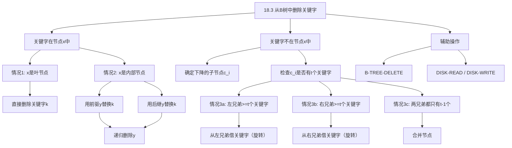
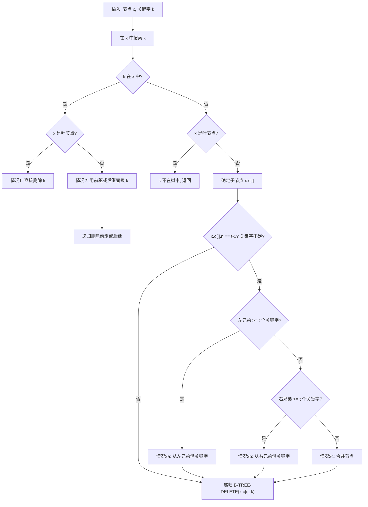

## 相关笔记

- 前置笔记：[[18.1 B树的定义]]、[[18.2 B树的基本操作]]
- 关联概念：[[算法导论/concepts/红黑树]]
- 章节汇总：[[第18章_B树-章节汇总]]

> [!abstract] 概览
> 本节介绍如何从==B树==中删除一个关键字，这是B树操作中==最复杂==的过程。与插入操作只需处理分裂不同，删除操作需要处理==借关键字==和==合并==两种修复操作，且合并可能沿搜索路径向上传播。核心知识点包括：
> - **情况1**：关键字在叶节点中——直接删除
> - **情况2**：关键字在内部节点中——用前驱或后继替换后递归删除
> - **情况3a/3b**：下降时目标子节点关键字不足——从兄弟节点借关键字（旋转）
> - **情况3c**：下降时目标子节点关键字不足且兄弟也不足——合并节点

---

## 知识结构总览



---

## 核心思想

> [!tip] 核心思路
> B树删除的核心挑战在于：删除后必须保证所有节点（除根外）至少有 $t-1$ 个关键字，以维持B树性质。这与插入时需要保证节点不超过 $2t-1$ 个关键字形成对称。
>
> 删除操作分为两大类决策：
> 1. **找到了关键字**：如果在叶节点就直接删除；如果在内部节点就转化为对前驱/后继的删除
> 2. **需要继续下降**：在下降到子节点之前，必须确保目标子节点至少有 $t$ 个关键字，否则需要通过借关键字或合并来"预备"——这保证了递归删除时不会遇到关键字不足的节点
>
> 这个"先预备再下降"的策略是保证删除正确性的关键，类似于插入时"先分裂再下降"的策略。

### 删除操作的分类体系

B树的删除操作可以系统地分为以下几种情况：

**第一类：关键字 $k$ 在当前节点 $x$ 中**

- **情况1**：$x$ 是叶节点
  - 直接从 $x$ 中删除 $k$ 及其对应的指针
  - 这是唯一真正执行删除操作的情况

- **情况2**：$x$ 是内部节点
  - 找到 $k$ 的前驱 $y$（$k$ 左侧子树中的最大关键字）或后继 $z$（$k$ 右侧子树中的最小关键字）
  - 用 $y$（或 $z$）替换 $k$ 在 $x$ 中的位置
  - 然后递归地从对应子树中删除 $y$（或 $z$）
  - 由于 $y$ 和 $z$ 一定在叶节点层（或在足够深的子树中），递归最终会到达情况1

**第二类：关键字 $k$ 不在当前节点 $x$ 中**

需要确定 $k$ 可能在哪个子节点 $c_i$ 中，但在下降到 $c_i$ 之前，必须确保 $c_i$ 至少有 $t$ 个关键字。

- **情况3a**：$c_i$ 只有 $t-1$ 个关键字，但**左兄弟** $c_{i-1}$ 至少有 $t$ 个关键字
  - 从左兄弟"借"一个关键字：将父节点中分隔 $c_{i-1}$ 和 $c_i$ 的关键字 $k'$ 下移到 $c_i$，将 $c_{i-1}$ 中的最大关键字上移到父节点
  - 这本质是一次**右旋转**

- **情况3b**：$c_i$ 只有 $t-1$ 个关键字，但**右兄弟** $c_{i+1}$ 至少有 $t$ 个关键字
  - 从右兄弟"借"一个关键字：将父节点中分隔 $c_i$ 和 $c_{i+1}$ 的关键字 $k'$ 下移到 $c_i$，将 $c_{i+1}$ 中的最小关键字上移到父节点
  - 这本质是一次**左旋转**

- **情况3c**：$c_i$ 只有 $t-1$ 个关键字，且**两个兄弟**都只有 $t-1$ 个关键字
  - 将 $c_i$ 与一个兄弟（如 $c_{i+1}$）合并：父节点中分隔它们的关键字 $k'$ 下移作为合并后节点的中间关键字
  - 合并后节点有 $(t-1) + 1 + (t-1) = 2t-1$ 个关键字（恰好满）
  - 如果父节点因此关键字不足，则合并操作可能沿路径向上传播

### B-TREE-DELETE 伪代码

> [!tip] 算法执行流程
> 1. 在当前节点 x 中**搜索**关键字 k
> 2. 若 **k 在 x 中**：
>    - **情况1**（x 是叶节点）：直接**删除** k
>    - **情况2**（x 是内部节点）：用**前驱**或**后继**替换 k，然后递归删除前驱/后继
> 3. 若 **k 不在 x 中**：
>    - 确定应下降的**子节点** x.c[i]
>    - 若子节点关键字不足（t-1 个）：
>      - **情况3a**：从**左兄弟借**关键字（旋转）
>      - **情况3b**：从**右兄弟借**关键字（旋转）
>      - **情况3c**：与兄弟**合并**（父节点关键字下移）
>    - 递归进入子节点继续删除



```
B-TREE-DELETE(x, k)
1  i = 1
2  while i <= x.n and k > x.key[i]
3      i = i + 1
4  if i <= x.n and k == x.key[i]          // 情况1或情况2：k在x中
5      if x.leaf                           // 情况1：x是叶节点
6          for j = i to x.n - 1
7              x.key[j] = x.key[j+1]       // 删除k
8          x.n = x.n - 1
9          DISK-WRITE(x)
10     else                                // 情况2：x是内部节点
11         if x.c[i].n >= t                // 情况2a：左子树有足够关键字
12             y = B-TREE-SEARCH-PREDECESSOR(x, i)
13             x.key[i] = y.key[y.n]       // 用前驱替换k
14             DISK-WRITE(x)
15             B-TREE-DELETE(y, y.key[y.n]) // 递归删除前驱
16         elseif x.c[i+1].n >= t          // 情况2b：右子树有足够关键字
17             z = B-TREE-SEARCH-SUCCESSOR(x, i)
18             x.key[i] = z.key[1]         // 用后继替换k
19             DISK-WRITE(x)
20             B-TREE-DELETE(z, z.key[1])   // 递归删除后继
21         else                            // 情况2c：两个子树都只有t-1个关键字
22             // 合并k与两个子树
23             y = x.c[i]
24             z = x.c[i+1]
25             y.key[t] = k                // 父节点的k下移
26             for j = 1 to z.n
27                 y.key[t+j] = z.key[j]   // 复制z的关键字到y
28                 y.c[t+j] = z.c[j]       // 复制z的子指针到y
29             y.c[2t] = z.c[z.n+1]
30             y.n = 2t - 1
31             for j = i to x.n - 1
32                 x.key[j] = x.key[j+1]   // 从x中删除k
33                 x.c[j+1] = x.c[j+2]
34             x.n = x.n - 1
35             DISK-WRITE(y)
36             DISK-WRITE(x)
37             if x.n == 0                 // 根节点变空
38                 // y成为新的根
39             B-TREE-DELETE(y, k)          // 递归删除合并后的节点中的k
40 else                                     // 情况3：k不在x中，需要下降
41     if x.leaf                            // k不在树中
42         return
43     flag = (i > x.n)                    // 是否需要检查最后一个子节点
44     DISK-READ(x.c[i])
45     if x.c[i].n == t - 1                // 子节点关键字不足
46         if i > 1 and x.c[i-1].n >= t    // 情况3a：从左兄弟借
47             // 左旋转：x.c[i-1]的最大关键字上移，x.key[i-1]下移
48             y = x.c[i-1]
49             for j = x.c[i].n downto 1
50                 x.c[i].key[j+1] = x.c[i].key[j]
51                 x.c[i].c[j+1] = x.c[i].c[j]
52             x.c[i].c[1] = x.c[i].c[0]
53             x.c[i].key[1] = x.key[i-1]
54             x.c[i].n = x.c[i].n + 1
55             x.key[i-1] = y.key[y.n]
56             y.n = y.n - 1
57             DISK-WRITE(y)
58             DISK-WRITE(x.c[i])
59             DISK-WRITE(x)
60         elseif i <= x.n and x.c[i+1].n >= t  // 情况3b：从右兄弟借
61             // 右旋转：x.c[i+1]的最小关键字上移，x.key[i]下移
62             z = x.c[i+1]
63             x.c[i].key[x.c[i].n+1] = x.key[i]
64             x.c[i].c[x.c[i].n+1] = z.c[0]
65             x.c[i].n = x.c[i].n + 1
66             x.key[i] = z.key[1]
67             for j = 1 to z.n - 1
68                 z.key[j] = z.key[j+1]
69                 z.c[j-1] = z.c[j]
70             z.c[z.n-1] = z.c[z.n]
71             z.n = z.n - 1
72             DISK-WRITE(z)
73             DISK-WRITE(x.c[i])
74             DISK-WRITE(x)
75         else                                     // 情况3c：合并
76             if i > 1                              // 与左兄弟合并
77                 y = x.c[i-1]
78                 z = x.c[i]
79                 y.key[t] = x.key[i-1]
80                 for j = 1 to z.n
81                     y.key[t+j] = z.key[j]
82                     y.c[t+j-1] = z.c[j-1]
83                 y.c[2t-1] = z.c[z.n]
84                 y.n = 2t - 1
85                 for j = i-1 to x.n - 1
86                     x.key[j] = x.key[j+1]
87                     x.c[j+1] = x.c[j+2]
88                 x.n = x.n - 1
89             else                                   // 与右兄弟合并
90                 z = x.c[i+1]
91                 y = x.c[i]
92                 y.key[t] = x.key[i]
93                 for j = 1 to z.n
94                     y.key[t+j] = z.key[j]
95                     y.c[t+j] = z.c[j]
96                 y.c[2t] = z.c[z.n+1]
97                 y.n = 2t - 1
98                 for j = i to x.n - 1
99                     x.key[j] = x.key[j+1]
100                    x.c[j+1] = x.c[j+2]
101                x.n = x.n - 1
102            DISK-WRITE(y)
103            DISK-WRITE(x)
104            if x.n == 0                           // 根节点变空
105                // y成为新的根
106            x = y                                  // 继续从合并后的节点下降
107     B-TREE-DELETE(x.c[i], k)
```

> [!def] B-TREE-DELETE
> **输入：** B树的根节点 $x$，待删除关键字 $k$
> **输出：** 从B树中删除 $k$，保持B树性质
>
> **算法策略：** 递归地从根向叶搜索 $k$，在每一步确保下降到的子节点至少有 $t$ 个关键字。如果找到 $k$，根据 $k$ 所在节点是叶节点还是内部节点采取不同策略。删除操作保证B树的所有性质在完成后仍然成立。

### 删除操作的具体示例

> [!info] 示例：从B树中删除关键字的完整过程
> 考虑一棵最小度 $t = 2$ 的B树（即2-3-4树），执行删除操作的过程：
>
> **初始B树（高度为2）：**
> ```
>         [M|T]
>       /   |   \
>   [C|F] [P] [W]
>   / | \   |    |
>  A D E G J Q X Y
> ```
>
> **删除 D（情况1——叶节点直接删除）：**
> - D 在叶节点 [C|F] 中，直接删除
> - 删除后 [C|F] 变为 [C|F]（仍满足至少 $t-1=1$ 个关键字）
> - 结果：叶节点变为 [C|F]，D 被移除
>
> **删除 M（情况2——内部节点，用后继替换）：**
> - M 在内部节点 [M|T] 中
> - M 的后继是 P（右子树中的最小值）
> - 用 P 替换 M，然后递归删除 P
> - 递归删除 P 时，P 在叶节点 [P] 中（情况1），直接删除
> - 结果：内部节点变为 [P|T]，P 的叶节点被删除
>
> **删除 T（情况3c——合并）：**
> - T 在根节点 [P|T] 中
> - T 的左子树有足够关键字，用前驱替换 T
> - 但假设左子树关键字不足，则需要合并

---

复杂度分析

> [!def] 删除操作的时间复杂度
> **磁盘I/O次数：** $O(h)$，其中 $h$ 为B树的高度
>
> **CPU时间：** $O(t \cdot h) = O(t \cdot \log_t n)$
>
> **分析过程：**
> 1. B-TREE-DELETE 从根向叶递归下降，最多访问 $O(h)$ 个节点，每次访问需要 $O(1)$ 次磁盘I/O（DISK-READ）
> 2. 在每个节点上，扫描关键字需要 $O(t)$ 时间（因为节点最多有 $2t-1$ 个关键字）
> 3. 借关键字（旋转）操作需要移动 $O(t)$ 个关键字和指针
> 4. 合并操作需要移动 $O(t)$ 个关键字和指针
> 5. 合并可能沿路径向上传播，但每次合并使路径上的节点关键字数减少，总共最多 $O(h)$ 次合并
>
> 因此总CPU时间为 $O(t \cdot h)$。由于 $h = O(\log_t n)$，总时间为 $O(t \cdot \log_t n)$。
>
> 当 $t$ 为常数时（如 $t = 100$），删除时间为 $O(\log n)$。

> [!tip] 删除 vs 插入的对称性
> B树的删除和插入操作具有优美的对称性。插入的触发条件是节点超过 $2t-1$ 个关键字，修复操作只有==分裂==（1种），传播方向向上。删除的触发条件是节点少于 $t-1$ 个关键字，修复操作有==借关键字==和==合并==（2种），同样向上传播。两者的预处理策略也对称：插入在下降前检查子节点是否已满，删除在下降前确保子节点至少有 $t$ 个关键字。时间复杂度均为 $O(t \cdot h)$，但删除比插入更复杂，因为需要更多的条件判断。

---

补充理解与拓展

> [!info] 补充：工程实践中的简化策略
> **来源：** PostgreSQL HOT(Heap-Only Tuples) 技术；LevelDB/RocksDB 工程实践
>
> 在实际的数据库系统中，B树的删除操作通常采用以下简化策略：
>
> 1. **标记删除 + 惰性合并**：许多数据库系统（如 PostgreSQL）不立即物理删除B树中的条目，而是将其标记为"已删除"（tombstone）。在后续的维护操作（如 VACUUM）中批量清理这些标记。这种方式将删除的代价摊还到后续操作中，避免删除时的合并开销影响在线事务的响应时间。PostgreSQL 的 HOT(Heap-Only Tuples) 技术进一步优化了这一过程：当删除的元组只被索引引用而不被其他元组引用时，可以直接在堆中重用空间，无需修改索引。
>
> 2. **B+树删除简化**：在B+树中，所有数据都存储在叶节点，内部节点只存储用于路由的键值。因此，B+树的删除操作比B树更简单——内部节点不需要处理数据指针的删除，只需处理路由键的调整。叶节点的删除逻辑与B树类似，但不需要考虑内部节点中同时存储数据的情况。
>
> 3. **批量删除优化**：LevelDB 和 RocksDB 使用 Bloom Filter 来减少不必要的磁盘读取。在删除操作前，先通过 Bloom Filter 判断关键字是否可能存在于B树中，如果 Bloom Filter 返回"不存在"，则可以直接跳过磁盘读取，避免昂贵的I/O操作。此外，这些系统还使用写前日志（WAL）来保证删除操作的原子性和持久性。
>
> 4. **延迟合并策略**：一些系统（如 SQLite 的 B-tree 实现）采用"延迟合并"策略：当节点关键字不足时，不立即合并，而是标记该节点为"欠满"状态。只有当后续操作再次访问该节点时，才执行合并。这种方式减少了合并操作的频率，但可能导致B树在一段时间内不完全满足B树性质。

> [!info] 补充：合并操作的向上传播
> **来源：** 算法导论（第4版）18.3节
>
> B树删除中最需要注意的现象是**合并的向上传播**：
>
> 当情况3c发生时，两个兄弟节点与父节点的一个关键字合并。这导致父节点的关键字数减少1。如果父节点因此关键字数低于 $t-1$，则需要在递归返回时对父节点执行同样的修复操作（借关键字或合并）。
>
> 在最坏情况下，合并可能从叶节点一直传播到根节点：
> - 叶节点合并 → 父节点关键字不足 → 父节点与兄弟合并 → 祖父节点关键字不足 → ... → 根节点
> - 如果根节点也发生合并（根节点只剩一个关键字），则根节点被其唯一的子节点替代，B树的高度减1
>
> 这与插入时分裂的向上传播形成对称：插入可能使B树高度增加1，删除可能使B树高度减少1。
>
> **关键观察：** 合并传播最多经过 $O(h)$ 层，因此不会影响删除操作的 $O(h)$ 渐近复杂度。

---

易混淆点与辨析

> [!warning] 误区：删除操作总是需要合并
> ❌ **错误理解：** "当子节点关键字不足时，总是需要将两个兄弟合并"
>
> ✅ **正确理解：** 当子节点关键字不足（只有 $t-1$ 个）时，**优先尝试从兄弟借关键字**（情况3a/3b），只有当两个兄弟都只有 $t-1$ 个关键字时才执行合并（情况3c）。借关键字操作不会减少父节点的关键字数，因此不会触发向上传播，代价更低。
>
> **记忆方法：** "先借后合"——就像缺钱时先找朋友借，借不到才考虑变卖资产（合并）。

> [!warning] 误区：前驱和后继一定在叶节点中
> ❌ **错误理解：** "情况2中，前驱和后继一定在叶节点中，所以递归删除一定是情况1"
>
> ✅ **正确理解：** 在标准B树中，前驱（左子树的最大关键字）和后继（右子树的最小关键字）**确实一定在叶节点中**。这是因为前驱是通过不断走向右子节点找到的，最终到达的叶节点中包含前驱。但在B+树中情况有所不同。此外，在情况2c中（两个子树都只有 $t-1$ 个关键字），需要先将两个子树与关键字 $k$ 合并，然后在合并后的节点中递归删除 $k$，此时 $k$ 已经在叶节点层了。
>
> **辨析：** 在B树中，前驱/后继一定在叶节点中。但在一般化的讨论中，需要注意B树和B+树的区别。

> [!warning] 误区：删除后B树高度不会改变
> ❌ **错误理解：** "删除操作不会改变B树的高度"
>
> ✅ **正确理解：** 删除操作**可能使B树高度减少1**。当合并操作传播到根节点，且根节点只有1个关键字时，根节点与其两个子节点合并，原来的根节点被丢弃，其中一个子节点成为新的根节点，高度减1。
>
> **对比：** 插入操作可能使高度增加1（根节点分裂），删除操作可能使高度减少1（根节点合并）。

---

习题精选

| 题号 | 题目描述 | 难度 |
|:---:|----------|:---:|
| 18.3-1 | 从图18.8(f)的B树中依次删除 C、P、V | ⭐⭐ |
| 18.3-2 | 写出 B-TREE-DELETE 的伪代码 | ⭐⭐⭐ |

> [!faq]- 18.3-1 解答
> **目标：** 从图18.8(f)的B树中依次删除 C、P、V。
>
> 假设图18.8(f)中的B树为最小度 $t = 2$ 的B树，结构如下：
> ```
>         [J|P]
>       /   |   \
>   [C|F] [K|M] [T|W]
>   / | \   |  |   |  \
>  A D E G J K L T U V X Y
> ```
>
> **删除 C（情况1——叶节点直接删除）：**
> - C 在叶节点中，直接删除
> - 删除后叶节点变为 [D|F]，仍满足至少 $t-1=1$ 个关键字
> - B树结构不变，只是叶节点中 C 被移除
>
> **删除 P（情况2——内部节点，用后继替换）：**
> - P 在内部节点 [J|P] 中
> - P 的后继是 T（右子树 [T|W] 中的最小关键字）
> - 用 T 替换 P，内部节点变为 [J|T]
> - 递归删除 T：T 在叶节点 [T|U|V] 中（情况1），直接删除
> - 删除后叶节点变为 [U|V]，仍满足条件
> - B树根节点变为 [J|T]
>
> **删除 V（情况1——叶节点直接删除）：**
> - V 在叶节点 [U|V] 中，直接删除
> - 删除后叶节点变为 [U]，仍满足至少 $t-1=1$ 个关键字
> - B树结构不变

> [!faq]- 18.3-2 解答
> **目标：** 写出 B-TREE-DELETE 的伪代码。
>
> B-TREE-DELETE 的伪代码已在上方"核心思想"部分给出。其核心结构为：
>
> 1. 在当前节点 $x$ 中搜索关键字 $k$
> 2. 如果找到 $k$：
>    - 情况1（叶节点）：直接删除
>    - 情况2（内部节点）：用前驱或后继替换，递归删除
> 3. 如果未找到 $k$：
>    - 确定要下降的子节点 $c_i$
>    - 如果 $c_i$ 关键字不足，执行借关键字或合并
>    - 递归到 $c_i$ 继续搜索
>
> **设计要点：**
> - 递归结构保证了代码的简洁性
> - "先预备再下降"的策略确保递归调用时不会遇到关键字不足的节点
> - 合并操作可能导致根节点变空，此时需要更新根节点指针

---

## 教材原文

> [!quote] CLRS 第4版 18.3节原文（中文翻译）
> 从B树中删除关键字 $k$ 的过程 B-TREE-DELETE 以一个指向根节点 $x$ 的指针和关键字 $k$ 作为输入。该过程保证在递归调用自身时，它所下降到的节点至少有 $t$ 个关键字，从而使得合并（如果需要的话）不会沿树向下传播。B-TREE-DELETE 的工作方式如下：
>
> 1. 如果关键字 $k$ 在节点 $x$ 中且 $x$ 是叶节点，则从 $x$ 中删除 $k$。
> 2. 如果关键字 $k$ 在节点 $x$ 中且 $x$ 是内部节点，则执行以下操作：
>    - (a) 如果 $k$ 前面的子节点 $y$ 至少有 $t$ 个关键字，则找到 $k$ 在以 $y$ 为根的子树中的前驱 $k'$，递归地删除 $k'$，并用 $k'$ 替换 $x$ 中的 $k$。
>    - (b) 对称地，如果 $k$ 后面的子节点 $z$ 至少有 $t$ 个关键字，则找到 $k$ 在以 $z$ 为根的子树中的后继 $k'$，递归地删除 $k'$，并用 $k'$ 替换 $x$ 中的 $k$。
>    - (c) 如果 $y$ 和 $z$ 都只有 $t-1$ 个关键字，则将 $k$ 和 $z$ 合并到 $y$ 中，使得 $y$ 包含 $2t-1$ 个关键字，然后释放 $z$ 并递归地从 $y$ 中删除 $k$。
> 3. 如果关键字 $k$ 不在内部节点 $x$ 中，则确定包含 $k$ 的子树的根 $c_i[x]$。如果 $c_i[x]$ 只有 $t-1$ 个关键字，则执行步骤 3a 或 3b 或 3c 以保证我们下降到一个至少包含 $t$ 个关键字的节点。然后，通过在 $x$ 的某个适当的子节点上递归调用 B-TREE-DELETE 来完成删除。
>
> B-TREE-DELETE 过程至多需要 $O(h)$ 次磁盘I/O，其中 $h$ 是B树的高度，因为在递归调用之间至多需要 $O(1)$ 次 DISK-READ 和 DISK-WRITE 调用。所需的CPU时间为 $O(t \cdot h) = O(t \cdot \log_t n)$。

---

## 参见Wiki

- [[算法导论/concepts/B树的删除操作]] — B树的借关键字与合并策略
- [[算法导论/concepts/B树]] — B树的定义与核心性质
- [[算法导论/concepts/最小度]] — 删除操作中 t 的关键约束

#学习/算法导论/第18章-B树 #学习/算法导论/B树/从B树中删除关键字
