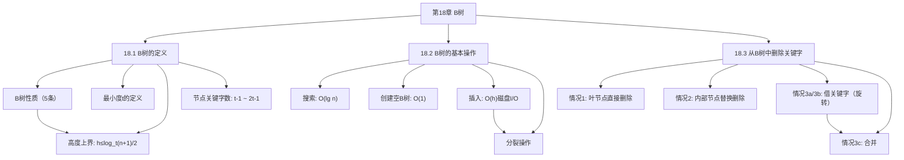

## 相关笔记

- 节笔记链接：[[18.1 B树的定义]]、[[18.2 B树的基本操作]]、[[18.3 从B树中删除关键字]]
- 前置章节：[[第13章_红黑树-章节汇总]]、[[第17章_数据结构扩张-章节汇总]]

> [!abstract] 概览
> 本章介绍==B树==（B-tree），这是一种专为==磁盘等外部存储==设计的高效搜索树数据结构。B树通过放宽节点度数限制（允许节点有多个子节点），显著降低了树的高度，从而减少了磁盘I/O次数。全章共3节，核心主题涵盖B树的定义与性质、搜索/插入等基本操作、以及最复杂的删除操作。B树是现代数据库系统和文件系统的基石，理解B树对于掌握大规模数据存储技术至关重要。

---

## 知识结构总览

---

## 核心概念回顾

### B树的5条基本性质

| 性质编号 | 描述 | 数学表达 |
|:--------:|------|---------|
| 性质1 | 每个节点 $x$ 有以下属性：关键字个数 $x.n$、$x.n+1$ 个子节点指针、是否为叶节点的标志 $x.leaf$ | $x.n \in [0, 2t-1]$ |
| 性质2 | 若 $x$ 不是叶节点，则有 $x.n + 1$ 个子节点 | $|x.c| = x.n + 1$ |
| 性质3 | 关键字按非降序排列，子树关键字范围互不相交 | $k_1 \leq k_2 \leq \cdots \leq k_{x.n}$ |
| 性质4 | 每个叶节点深度相同（B树是平衡树） | 所有叶节点在同一层 |
| 性质5 | 根节点至少有1个关键字，其他节点至少有 $t-1$ 个关键字 | 根: $n \geq 1$；其他: $n \geq t-1$ |

### B树高度上界

> [!def] B树高度定理
> 一棵含有 $n$ 个关键字、最小度为 $t \geq 2$ 的B树，其高度 $h$ 满足：
>
> $$h \leq \log_t \frac{n+1}{2}$$
>
> **证明思路：**
> - 根节点至少有1个关键字，其他节点至少有 $t-1$ 个关键字
> - 高度为 $h$ 的B树至少有 $2$ 个深度为1的节点，每个至少有 $t-1$ 个关键字
> - 深度为 $h$ 的节点（叶节点层）至少有 $2t^{h-1}$ 个
> - 因此 $n \geq 1 + (t-1)(2t^{h-1} - 1) \geq 2t^{h-1} - 1$
> - 解得 $h \leq \log_t \frac{n+1}{2}$

### 基本操作复杂度汇总

| 操作 | 磁盘I/O次数 | CPU时间 | 说明 |
|:-----|:-----------:|:-------:|:-----|
| 搜索 | $O(h) = O(\log_t n)$ | $O(t \cdot \log_t n)$ | 从根到叶的单路径搜索 |
| 插入 | $O(h) = O(\log_t n)$ | $O(t \cdot \log_t n)$ | 下降时分裂，最多 $O(h)$ 次分裂 |
| 删除 | $O(h) = O(\log_t n)$ | $O(t \cdot \log_t n)$ | 下降时借/合并，最多 $O(h)$ 次合并 |
| 创建 | $O(1)$ | $O(1)$ | 分配一个空根节点 |
| 读取节点 | $O(1)$ | $O(t)$ | 一次磁盘读取 |

> [!tip] 选择最小度 t 的工程考量
> **较大的 t** 降低树高、减少磁盘I/O次数，但增加节点内扫描时间。**较小的 t** 增加树高，但节点内操作更快。**实际选择**通常根据磁盘块大小确定 t，使一个节点恰好填满一个磁盘块。例如磁盘块大小为4KB，每个关键字加指针占16字节，则 t 约为128，对于 n 等于10的9次方，树高不超过5，即最多5次磁盘I/O即可完成搜索。

---

三节内容对比

| 维度 | 18.1 B树的定义 | 18.2 B树的基本操作 | 18.3 从B树中删除关键字 |
|:-----|:---------------|:-------------------|:---------------------|
| **核心主题** | 定义B树的数据结构及其性质 | 搜索、插入等基本操作 | 删除操作及其修复策略 |
| **关键概念** | 最小度 $t$、5条性质、高度上界 | 分裂（SPLIT-CHILD）、单次磁盘I/O | 借关键字（旋转）、合并 |
| **操作复杂度** | — | 搜索 $O(\log_t n)$、插入 $O(\log_t n)$ | 删除 $O(\log_t n)$ |
| **修复操作** | — | 分裂（1种） | 借关键字 + 合并（2种） |
| **难度** | ⭐⭐ | ⭐⭐⭐ | ⭐⭐⭐⭐ |
| **设计思想** | 平衡多路搜索树 | 预分裂策略（先分裂再下降） | 预备策略（先预备再下降） |
| **递归方向** | — | 分裂向上传播 | 合并向上传播 |

---

关键定理与证明

### 定理1：B树高度上界

$$h \leq \log_t \frac{n+1}{2}$$

**证明：** 设B树的最小度为 $t \geq 2$，高度为 $h$，含 $n$ 个关键字。

- 根节点至少有 1 个关键字（性质5）
- 深度为 1 的节点至少有 2 个（因为根至少有 2 个子节点），每个至少有 $t-1$ 个关键字
- 深度为 2 的节点至少有 $2t$ 个，每个至少有 $t-1$ 个关键字
- 一般地，深度为 $d$（$1 \leq d \leq h$）的节点至少有 $2t^{d-1}$ 个

因此B树中关键字总数满足：

$$n \geq 1 + (t-1) \sum_{d=1}^{h} 2t^{d-1} = 1 + 2(t-1) \cdot \frac{t^h - 1}{t - 1} = 2t^h - 1$$

解得：

$$t^h \leq \frac{n+1}{2}$$

$$h \leq \log_t \frac{n+1}{2}$$

$\blacksquare$

### 定理2：搜索操作的正确性

B-TREE-SEARCH 在以 $x$ 为根的子树中搜索关键字 $k$，其正确性由以下不变式保证：

- 在每次递归调用中，如果 $k$ 在以 $x$ 为根的子树中，则一定能找到
- 搜索路径上的每个节点都从磁盘读取一次
- 搜索终止条件为：找到 $k$ 或到达叶节点且未找到 $k$

### 定理3：插入操作的正确性

B-TREE-INSERT 的正确性依赖于以下性质：

- **预分裂策略**：在下降到子节点之前，如果子节点已满（$2t-1$ 个关键字），先执行 SPLIT-CHILD
- **分裂保证**：分裂后父节点至少有 1 个空位可以容纳新关键字
- **不变式**：递归调用 B-TREE-INSERT-NONFULL 时，目标节点一定不满（最多 $2t-2$ 个关键字）

### 定理4：删除操作的正确性

B-TREE-DELETE 的正确性依赖于以下性质：

- **预备策略**：在下降到子节点之前，确保子节点至少有 $t$ 个关键字
- **借关键字保证**：借关键字后子节点恰好有 $t$ 个关键字，父节点关键字数不变
- **合并保证**：合并后节点有 $2t-1$ 个关键字（恰好满），不会立即触发再次合并
- **根节点特殊处理**：当根节点关键字为0时，其唯一子节点成为新根，高度减1

---

易混淆点汇总

### B树 vs B+树 vs B*树

| 特性 | B树 | B+树 | B*树 |
|:-----|:----|:-----|:-----|
| 数据存储位置 | 所有节点都存储数据 | 数据只在叶节点 | 所有节点都存储数据 |
| 内部节点 | 存储键值+数据指针 | 只存储键值（路由） | 存储键值+数据指针 |
| 叶节点链接 | 无 | 叶节点用链表串联 | 无（或视实现而定） |
| 节点填充率 | 至少 $t-1$ 个关键字 | 至少 $t-1$ 个关键字 | 至少 $\frac{2t-1}{3}$ 个关键字 |
| 搜索性能 | 可能提前终止 | 必须到达叶节点 | 可能提前终止 |
| 范围查询 | 需要中序遍历 | 利用叶节点链表高效扫描 | 需要中序遍历 |
| 工程应用 | 理论教学 | 数据库索引（MySQL、PostgreSQL） | 较少使用 |
| 删除复杂度 | 高（需处理内部节点） | 较低（叶节点删除为主） | 最高（节点填充率要求更严格） |

### 最小度 $t$ vs 阶数 $m$

> [!warning] 误区：最小度 $t$ 等于阶数 $m$
> ❌ **错误理解：** "B树的最小度 $t$ 就是B树的阶数 $m$"
>
> ✅ **正确理解：** 最小度 $t$ 和阶数 $m$ 是两个不同的概念：
> - **最小度 $t$**（CLRS定义）：每个节点（除根外）至少有 $t-1$ 个关键字，最多有 $2t-1$ 个关键字
> - **阶数 $m$**（部分教材定义）：每个节点最多有 $m$ 个子节点，即最多有 $m-1$ 个关键字
>
> 两者关系：$m = 2t$，即阶数是最小度的两倍
>
> **举例：** $t = 2$ 的B树（2-3-4树），阶数 $m = 4$，每个节点最多3个关键字、4个子节点

### 分裂 vs 合并的对称性

| 维度 | 分裂（插入时） | 合并（删除时） |
|:-----|:--------------|:--------------|
| 触发条件 | 节点有 $2t-1$ 个关键字（已满） | 节点有 $t-1$ 个关键字（不足） |
| 操作对象 | 一个满节点 → 两个各 $t-1$ 的节点 | 两个各 $t-1$ 的节点 → 一个 $2t-1$ 的节点 |
| 父节点影响 | 父节点增加1个关键字 | 父节点减少1个关键字 |
| 传播方向 | 向上（可能使父节点也满） | 向上（可能使父节点也不足） |
| 根节点影响 | 根分裂 → 高度+1 | 根合并 → 高度-1 |
| 额外空间 | 需要1个新节点 | 释放1个节点 |

---

补充理解

### B树在现代数据库中的地位

> [!info] B树是数据库索引的基石
> **来源：** 《Database Internals》 by Alex Petrov; MySQL/PostgreSQL 官方文档
>
> B树（特别是其变体B+树）是现代关系型数据库中最广泛使用的索引结构：
>
> 1. **MySQL InnoDB**：使用B+树作为主键索引（聚簇索引）和二级索引。InnoDB的页大小默认为16KB，每个B+树节点对应一个页，最小度约为数百，使得千万级数据表的索引高度仅为3-4层。
>
> 2. **PostgreSQL**：使用B树作为默认索引类型（还有Hash、GiST、GIN、SP-GiST、BRIN等）。PostgreSQL的B树实现支持并发插入和删除（通过 Lehman-Yao 的链接技术）。
>
> 3. **Oracle**：使用B*树（B树的变体，要求节点至少2/3满）作为默认索引结构，通过延迟分裂策略提高空间利用率。
>
> 4. **SQLite**：使用B树作为其底层存储格式，整个数据库就是一个大的B树文件。

### B树 vs LSM-Tree 选型决策

> [!info] 写密集场景的替代方案
> **来源：** 《Designing Data-Intensive Applications》 by Martin Kleppmann; LevelDB/RocksDB 文档
>
> 在写密集的场景中，B树面临以下挑战：
> - 每次写入都需要随机磁盘I/O（找到对应叶节点）
> - 写放大（write amplification）：一次修改可能触发分裂，导致多页写入
> - 空间碎片：删除和分裂导致页利用率下降
>
> **LSM-Tree（Log-Structured Merge-Tree）** 是B树的主要替代方案：
>
> | 维度 | B树 | LSM-Tree |
> |:-----|:----|:---------|
> | 写入性能 | 较慢（随机I/O） | 快（顺序写入内存表） |
> | 读取性能 | 快（直接定位） | 较慢（可能需要检查多层） |
> | 写放大 | 中等 | 高（compaction） |
> | 读放大 | 低 | 高（多层SSTable） |
> | 空间放大 | 中等（碎片） | 高（多版本） |
> | 适用场景 | 读多写少 | 写多读少 |
> | 代表系统 | MySQL、PostgreSQL、Oracle | LevelDB、RocksDB、Cassandra、HBase |
>
> **选型建议：**
> - 读多写少、需要强一致性 → B树
> - 写密集、可接受最终一致性 → LSM-Tree
> - 混合负载 → 考虑 B树 + WAL + Buffer Pool 的组合（大多数关系型数据库的方案）

---

习题索引

### 18.1 B树的定义

| 题号 | 核心考点 | 难度 |
|:-----|:---------|:-----:|
| 18.1-1 | 最小度 $t=1$ 为什么不行 | ⭐ |
| 18.1-2 | 所有内部节点关键字数恰好为 $2t-1$ 的B树 | ⭐⭐ |
| 18.1-3 | $t=2$ 时B树的形态（2-3-4树） | ⭐⭐ |
| 18.1-4 | $t=3$、高度为2的B树最小/最大关键字数 | ⭐⭐ |
| 18.1-5 | 证明B树高度下界 | ⭐⭐⭐ |

### 18.2 B树的基本操作

| 题号 | 核心考点 | 难度 |
|:-----|:---------|:-----:|
| 18.2-1 | 在给定B树上执行搜索 | ⭐ |
| 18.2-2 | B-TREE-INSERT 的逐步模拟 | ⭐⭐ |
| 18.2-3 | 证明 B-TREE-INSERT-NONFULL 的正确性 | ⭐⭐⭐ |
| 18.2-4 | B-TREE-SPLIT-CHILD 的详细分析 | ⭐⭐ |
| 18.2-5 | 不预先分裂的插入算法 | ⭐⭐⭐ |
| 18.2-6 | 从空B树依次插入关键字的完整过程 | ⭐⭐ |

### 18.3 从B树中删除关键字

| 题号 | 核心考点 | 难度 |
|:-----|:---------|:-----:|
| 18.3-1 | 从给定B树中删除关键字 C、P、V | ⭐⭐ |
| 18.3-2 | 写出 B-TREE-DELETE 的伪代码 | ⭐⭐⭐ |
| 18.3-3 | 证明删除操作的正确性 | ⭐⭐⭐ |
| 18.3-4 | 删除操作的最坏情况分析 | ⭐⭐⭐ |
| 18.3-5 | B+树中的删除操作 | ⭐⭐⭐ |

---

## 参见Wiki

- [[算法导论/concepts/B树]] — B树的严格定义与五条性质
- [[算法导论/concepts/最小度]] — B树的核心参数
- [[算法导论/concepts/B树高度定理]] — B树高度上界的严格证明
- [[算法导论/concepts/B树的插入操作]] — 分裂策略与插入流程
- [[算法导论/concepts/B树的删除操作]] — 借关键字与合并策略
- [[算法导论/concepts/B树节点的磁盘表示]] — 磁盘I/O优化的底层设计
- [[算法导论/concepts/B+树]] — B树的重要工程变体

#学习/算法导论/第18章-B树 #学习/算法导论/B树/章节汇总
