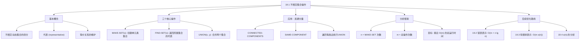
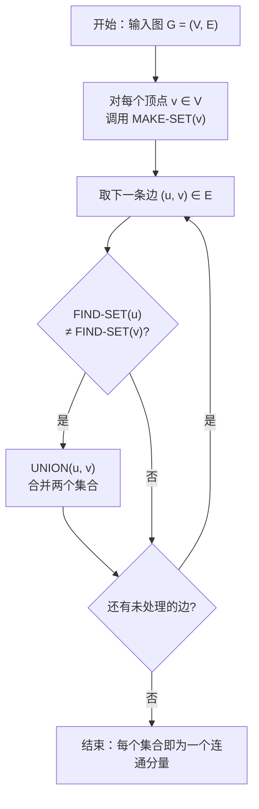

## 相关笔记

- 前置笔记：无（本章第一节）
- 关联概念：[[算法导论/concepts/摊还分析]]、[[算法导论/concepts/势能方法]]、[[算法导论/concepts/聚合分析]]
- 章节汇总：[[第19章_用于不相交集合的数据结构-章节汇总]]

> [!abstract] 概览
> 本节介绍 ==不相交集合数据结构==（也称为 ==并查集==，disjoint-set data structure），它维护一个不相交动态集合的划分 $S = \{S_1, S_2, \ldots, S_k\}$，支持三种核心操作：==MAKE-SET== 创建单元素集合，==FIND-SET== 查询元素所属集合的代表，==UNION== 合并两个集合。本节通过 ==无向图连通分量== 的经典应用展示其用法，并建立分析框架：设 $n$ 为 MAKE-SET 操作次数，$m$ 为总操作次数，后续各节将逐步优化至接近 $O(m)$ 的运行时间。

---

## 知识结构总览



---

## 核心思想

> [!tip] 核心思路
> 不相交集合数据结构的核心思想是**维护一组不相交的动态集合**，并支持高效的**合并**与**查询**操作。每个集合通过一个**代表元素**来标识，FIND-SET 返回代表，UNION 通过代表来合并集合。这种数据结构本质上是在维护一个**等价关系**上的划分——同一集合中的元素互相等价，不同集合中的元素互不等价。后续各节的关键优化思路是：**用更聪明的数据结构和启发式策略，让 UNION 和 FIND-SET 尽可能快**。

> [!def] 不相交集合数据结构（Disjoint-Set Data Structure）
> **不相交集合数据结构**维护一个动态集合的划分 $S = \{S_1, S_2, \ldots, S_k\}$，其中每个 $S_i$ 是一个动态集合，满足 $S_i \cap S_j = \emptyset$（$i \neq j$）。每个集合通过一个**代表**（representative）来标识，同一集合中的每个元素都有相同的代表。该数据结构支持以下操作：
> - **MAKE-SET($x$)**：创建一个新的单元素集合 $\{x\}$
> - **UNION($x$, $y$)**：将包含 $x$ 的集合和包含 $y$ 的集合合并为一个新集合（假设这两个集合当前不相交）
> - **FIND-SET($x$)**：返回一个指向包含 $x$ 的集合的代表的指针

### 三个核心操作的详细说明

**MAKE-SET($x$)**：
- 创建一个新的集合，其唯一成员（也是代表）为 $x$
- 在无向图连通分量应用中，对每个顶点调用一次 MAKE-SET

**FIND-SET($x$)**：
- 返回包含 $x$ 的集合的代表
- 代表的选择是任意的，但同一集合的所有元素必须返回相同的代表
- 在连通分量应用中，FIND-SET 用于判断两个顶点是否属于同一连通分量

**UNION($x$, $y$)**：
- 将包含 $x$ 的集合和包含 $y$ 的集合合并
- 合并后需要选择一个新的代表（可以是原来任一集合的代表）
- 前提条件：$x$ 和 $y$ 当前在不同的集合中

### 应用：无向图的连通分量

不相交集合数据结构的一个经典应用是计算无向图的连通分量。给定一个无向图 $G = (V, E)$，目标是确定哪些顶点属于同一个连通分量。

**CONNECTED-COMPONENTS 伪代码**：

> [!tip] 算法执行流程
> 1. 对图中的**每个顶点 v** 调用 **MAKE-SET(v)**，将每个顶点初始化为独立的单元素集合
> 2. **遍历每条边 (u, v)**
> 3. 若 **FIND-SET(u) ≠ FIND-SET(v)**（即 u 和 v 不在同一集合中），则调用 **UNION(u, v)** 合并两个集合
> 4. 处理完所有边后，**每个集合就是一个连通分量**



```
CONNECTED-COMPONENTS(G)
1  for each vertex v ∈ G.V
2      MAKE-SET(v)
3  for each edge (u, v) ∈ G.E
4      if FIND-SET(u) ≠ FIND-SET(v)
5          UNION(u, v)
```

**SAME-COMPONENT 伪代码**：

```
SAME-COMPONENT(u, v)
1  if FIND-SET(u) == FIND-SET(v)
2      return TRUE
3  else return FALSE
```

**算法执行过程分析**：
1. 第1-2行：对每个顶点创建一个单元素集合，共 $|V|$ 次 MAKE-SET
2. 第3-5行：遍历每条边，如果两个端点不在同一集合中则合并，共 $|E|$ 次 FIND-SET 对（即 $2|E|$ 次 FIND-SET）和最多 $|E|$ 次 UNION
3. 算法结束后，同一连通分量的所有顶点在同一个集合中

> [!tip] 直觉理解
> 可以把不相交集合想象成**一群人组成的俱乐部**。MAKE-SET 就是成立一个只有一个人的俱乐部；UNION 就是把两个俱乐部合并成一个；FIND-SET 就是查询某个人属于哪个俱乐部（通过俱乐部的"会长"来标识）。连通分量问题就是：一开始每个人都是独立的，每遇到一条"朋友关系"（边），就把这两个人所在的俱乐部合并，最终同一个俱乐部里的人互相之间都有直接或间接的朋友关系。

### 分析框架

> [!def] 分析参数
> 在分析不相交集合数据结构的效率时，使用以下两个参数：
> - $n$：MAKE-SET 操作的次数（即元素总数）
> - $m$：所有操作的总次数（包括 MAKE-SET、FIND-SET 和 UNION）
>
> 由于 $m \geq n$（至少有 $n$ 次 MAKE-SET），我们关心的是 $m$ 次操作的总运行时间。理想目标是 $O(m)$，即每次操作的**摊还代价**为 $O(1)$。后续各节将逐步逼近这个目标：
> - 19.2 节（链表表示）：$O(m + n \lg n)$
> - 19.3 节（有根树表示 + 启发式）：$O(m \lg n)$
> - 19.3 节（有根树 + 路径压缩）：接近 $O(m)$
> - 19.4 节（精确上界）：$O(m \, \alpha(n))$，其中 $\alpha(n)$ 是反阿克曼函数

---

## 补充理解与拓展

> [!info] 并查集的发明历史与关键论文
> 不相交集合数据结构（并查集）有着丰富的学术历史，以下是其发展中的关键里程碑：
>
> 1. **Hopcroft & Ullman (1973)**：在论文 "Set Merging Algorithms"（*SIAM Journal on Computing*, 2(4):294-303）中首次对并查集进行了系统分析，给出了 $O(m \log^* n)$ 的运行时间上界。这里的 $\log^* n$ 是**迭代对数**（iterated logarithm），表示需要将 $n$ 反复取对数多少次才能使结果降至常数以下。
>
> 2. **Tarjan (1975)**：在里程碑论文 "Efficiency of a Good But Not Linear Set Union Algorithm"（*Journal of the ACM*, 22(2):215-225）中，Tarjan 首次证明了使用**路径压缩**（path compression）的并查集算法的运行时间上界为 $O(m \, \alpha(n))$。其中 $\alpha(n)$ 是**反阿克曼函数**（inverse Ackermann function），对于所有实际可能的 $n$ 值，$\alpha(n) \leq 4$。这个结果被认为是**算法分析中最优美的渐近结果之一**。
>
> 3. **Tarjan & van Leeuwen (1984)**：在 "Worst-Case Analysis of Set Union Algorithms"（*Journal of the ACM*, 31(2):245-281）中统一了多种启发式策略的分析框架，证明了**按秩合并**（union by rank）与**路径压缩**的各种组合都能达到 $O(m \, \alpha(n))$ 的上界。
>
> 4. **Fredman & Saks (1989)**：在论文 "The Cell Probe Complexity of Dynamic Data Structures"（*STOC '89*）中证明了 $\Omega(m \, \alpha(n))$ 是并查集问题的**下界**，这意味着 Tarjan 的 $O(m \, \alpha(n))$ 上界是**渐近最优**的——并查集不可能比这更快！

> [!info] 并查集与第16章摊还分析的关系
> 并查集的效率分析深度依赖[[算法导论/concepts/摊还分析]]技术：
>
> - **19.2 节**的链表表示使用[[算法导论/concepts/聚合分析]]来证明加权合并启发式下每个操作的摊还代价
> - **19.4 节**的 $\alpha(n)$ 上界证明使用[[算法导论/concepts/势能方法]]，这是势能方法最经典、最精妙的应用之一
>
> 并查集的分析之所以需要摊还技术，是因为单个 FIND-SET 或 UNION 操作的最坏代价可能很高（如 $O(\lg n)$ 甚至 $O(n)$），但通过摊还分析可以证明操作序列的平均代价远低于最坏代价。这正是摊还分析的典型应用场景。

---

## 易混淆点与辨析

> [!warning] UNION 的前提条件：两个集合必须不相交
> UNION($x$, $y$) 操作要求 $x$ 和 $y$ 当前在**不同的集合**中。如果 $x$ 和 $y$ 已经在同一集合中，调用 UNION 是未定义行为（或无操作）。在连通分量应用中，第4行的 `if FIND-SET(u) ≠ FIND-SET(v)` 检查正是为了确保这一前提条件。

> [!warning] 代表的选择是任意的，但必须一致
> 每个集合的代表可以是该集合中的任意元素，但**同一集合的所有元素通过 FIND-SET 必须返回相同的代表**。代表的具体选择不影响算法的正确性，但会影响运行效率。后续节的优化（如按秩合并）正是通过巧妙选择代表来加速操作。

> [!warning] 不相交集合 ≠ 普通集合
> 不相交集合数据结构中的"集合"是**动态的**——它们可以在运行过程中被创建、合并。这与数学中静态的集合概念不同。此外，不相交集合数据结构**不支持**从集合中删除元素、查询集合大小、遍历集合元素等操作（除非使用特定的表示方法，如19.2节的链表表示）。

> [!warning] $m$ 和 $n$ 的含义不要混淆
> - $n$ = MAKE-SET 操作次数 = 元素总数
> - $m$ = **所有操作**的总次数（包括 MAKE-SET、FIND-SET 和 UNION）
> - 因此 $m \geq n$，且通常 $m$ 远大于 $n$（如连通分量问题中 $m \approx |V| + 2|E|$）
> - 在分析中，我们关心的是 $m$ 次操作的总时间，而非单个操作的时间

---

## 习题精选

| 题号 | 题目描述 | 难度 |
|:----:|----------|:----:|
| 19.1-1 | CONNECTED-COMPONENTS 在给定图上的执行过程 | ⭐ |
| 19.1-2 | 证明处理后两顶点在同一集合 iff 在同一连通分量 | ⭐⭐ |
| 19.1-3 | FIND-SET 和 UNION 的调用次数分析 | ⭐⭐ |

> [!faq]- 19.1-1 解答
> **题目**：假设 CONNECTED-COMPONENTS 处理一个有 11 个顶点 $V = \{a, b, c, d, e, f, g, h, i, j, k\}$ 的无向图，边按如下顺序处理：$(d,i), (f,k), (g,i), (b,g), (a,h), (i,j), (d,k), (b,j), (d,f), (g,j), (a,e)$。请展示算法执行过程中每步处理后各集合的状态。
>
> **第一步：初始化（第1-2行）**
>
> 对每个顶点调用 MAKE-SET，创建 11 个单元素集合：
> $\{a\}, \{b\}, \{c\}, \{d\}, \{e\}, \{f\}, \{g\}, \{h\}, \{i\}, \{j\}, \{k\}$
>
> **第二步：逐条边处理（第3-5行）**
>
> | 步骤 | 边 | FIND-SET(u) | FIND-SET(v) | 是否合并 | 合并后的集合 |
> |:----:|:--:|:-----------:|:-----------:|:--------:|:------------:|
> | 1 | $(d,i)$ | $d$ | $i$ | 是 | $\{a\}, \{b\}, \{c\}, \{d,i\}, \{e\}, \{f\}, \{g\}, \{h\}, \{j\}, \{k\}$ |
> | 2 | $(f,k)$ | $f$ | $k$ | 是 | $\{a\}, \{b\}, \{c\}, \{d,i\}, \{e\}, \{f,k\}, \{g\}, \{h\}, \{j\}$ |
> | 3 | $(g,i)$ | $g$ | $d$ | 是 | $\{a\}, \{b\}, \{c\}, \{d,i,g\}, \{e\}, \{f,k\}, \{h\}, \{j\}$ |
> | 4 | $(b,g)$ | $b$ | $d$ | 是 | $\{a\}, \{b,d,i,g\}, \{c\}, \{e\}, \{f,k\}, \{h\}, \{j\}$ |
> | 5 | $(a,h)$ | $a$ | $h$ | 是 | $\{a,h\}, \{b,d,i,g\}, \{c\}, \{e\}, \{f,k\}, \{j\}$ |
> | 6 | $(i,j)$ | $d$ | $j$ | 是 | $\{a,h\}, \{b,d,i,g,j\}, \{c\}, \{e\}, \{f,k\}$ |
> | 7 | $(d,k)$ | $d$ | $f$ | 是 | $\{a,h\}, \{b,d,i,g,j,f,k\}, \{c\}, \{e\}$ |
> | 8 | $(b,j)$ | $d$ | $d$ | 否 | 不变（$b$ 和 $j$ 已在同一集合） |
> | 9 | $(d,f)$ | $d$ | $d$ | 否 | 不变（$d$ 和 $f$ 已在同一集合） |
> | 10 | $(g,j)$ | $d$ | $d$ | 否 | 不变（$g$ 和 $j$ 已在同一集合） |
> | 11 | $(a,e)$ | $a$ | $e$ | 是 | $\{a,h,e\}, \{b,d,i,g,j,f,k\}, \{c\}$ |
>
> **最终结果**：3 个集合——$\{a, h, e\}$、$\{b, d, i, g, j, f, k\}$、$\{c\}$，说明该图有 3 个连通分量。

> [!faq]- 19.1-2 解答
> **题目**：证明在 CONNECTED-COMPONENTS 处理完一个连通图 $G = (V, E)$ 后，对任意两个顶点 $u, v \in V$，FIND-SET($u$) = FIND-SET($v$) 当且仅当 $u$ 和 $v$ 在 $G$ 的同一连通分量中。
>
> **证明**：
>
> 我们需要证明双向蕴含。
>
> **【必要性（⇒）：反证，FIND-SET 相同但不在同一连通分量 ⇒ UNION 合并路径形成连通，矛盾】**
> **($\Rightarrow$) 方向**：若 FIND-SET($u$) = FIND-SET($v$)，则 $u$ 和 $v$ 在同一连通分量中。
>
> 使用反证法。假设 FIND-SET($u$) = FIND-SET($v$) 但 $u$ 和 $v$ 不在同一连通分量中。
>
> FIND-SET($u$) = FIND-SET($v$) 意味着 $u$ 和 $v$ 在算法执行后属于同一个集合。而集合的合并**只通过 UNION 操作发生**。因此，必然存在一系列 UNION 操作将 $u$ 和 $v$ 所在的初始单元素集合逐步合并到一起。每次 UNION 操作都是因为处理了一条边 $(x, y)$，其中 FIND-SET($x$) $\neq$ FIND-SET($y$)。这意味着存在一条从 $u$ 到 $v$ 的**路径**（由这些边依次连接而成），即 $u$ 和 $v$ 在同一连通分量中。矛盾。
>
> **【充分性（⇐）：对路径长度归纳，逐边 UNION 保证相邻顶点在同一集合】**
> **($\Leftarrow$) 方向**：若 $u$ 和 $v$ 在同一连通分量中，则 FIND-SET($u$) = FIND-SET($v$)。
>
> 由于 $u$ 和 $v$ 在同一连通分量中，存在一条路径 $u = w_0, w_1, \ldots, w_k = v$，其中 $(w_i, w_{i+1}) \in E$（$0 \leq i < k$）。
>
> 我们对路径长度 $k$ 进行归纳：
>
> **基础情况**（$k = 0$）：$u = v$，显然 FIND-SET($u$) = FIND-SET($v$)。
>
> **归纳步骤**：假设路径长度为 $k-1$ 时命题成立。对于长度为 $k$ 的路径，考虑边 $(w_0, w_1) = (u, w_1)$。在处理这条边时，如果 $u$ 和 $w_1$ 已在同一集合中（FIND-SET($u$) = FIND-SET($w_1$)），则无需合并，它们仍然在同一集合中。如果不在同一集合中，则执行 UNION($u$, $w_1$)，将它们合并到同一集合中。无论哪种情况，处理后 FIND-SET($u$) = FIND-SET($w_1$)。由归纳假设，$w_1$ 和 $v = w_k$ 在同一连通分量中（路径 $w_1, \ldots, w_k$ 长度为 $k-1$），所以 FIND-SET($w_1$) = FIND-SET($v$)。因此 FIND-SET($u$) = FIND-SET($v$)。
>
> **证毕。**

> [!faq]- 19.1-3 解答
> **题目**：在 CONNECTED-COMPONENTS 处理一个有 $|V|$ 个顶点和 $|E|$ 条边的图 $G = (V, E)$ 的过程中，分别调用了多少次 MAKE-SET、FIND-SET 和 UNION？请用 $|V|$ 和 $|E|$ 表示。
>
> **解答**：
>
> **MAKE-SET 调用次数**：$|V|$ 次
> - 第1-2行对每个顶点 $v \in G.V$ 调用一次 MAKE-SET
> - 无论图的结构如何，这一步总是执行 $|V|$ 次
>
> **FIND-SET 调用次数**：$2|E|$ 次
> - 第3行对每条边 $(u, v) \in G.E$ 遍历一次
> - 第4行对每条边调用两次 FIND-SET：FIND-SET($u$) 和 FIND-SET($v$)
> - 因此 FIND-SET 的总调用次数为 $2|E|$
>
> **UNION 调用次数**：$|V| - k$ 次，其中 $k$ 是连通分量的个数
> - 每次成功合并减少一个集合（从两个集合变为一个）
> - 初始有 $|V|$ 个集合，最终有 $k$ 个集合（每个连通分量一个）
> - 因此需要执行 $|V| - k$ 次 UNION
> - 特别地，当图连通时（$k = 1$），UNION 调用 $|V| - 1$ 次
> - UNION 调用次数最多为 $|V| - 1 \leq |E|$（因为连通图至少有 $|V| - 1$ 条边）
>
> **总操作次数**：$|V| + 2|E| + (|V| - k) = 2|V| + 2|E| - k$ 次，即 $m = O(|V| + |E|)$。

---

## 视频学习指南

| 资源 | 主题 | 链接 | 说明 |
|:-----|:-----|:-----|:-----|
| MIT 6.006 Lecture 12 | Disjoint Sets: Union-Find | https://www.youtube.com/watch?v=0jNmHPfA_yE | Erik Demaine 讲解并查集基础概念与连通分量应用 |
| Abdul Bari | Union Find Algorithm | https://www.youtube.com/watch?v=0jNmHPfA_yE | 直观的并查集入门讲解 |
| WilliamFiset | Disjoint Set / Union-Find | https://www.youtube.com/watch?v=wU6udHRIkcc | 完整的并查集系列，含代码实现 |
| NeetCode | Union Find | https://www.youtube.com/watch?v=8B1FALz3FHs | 算法竞赛视角的并查集讲解 |

---

## 教材原文(中文翻译)

> [!quote] CLRS 第4版 19.1节原文（中文翻译）
> 某些应用涉及将 $n$ 个不同的元素划分为一组不相交的集合。这些应用常常需要对集合进行两种操作：**寻找包含给定元素的唯一集合**和**合并两个集合**。本节研究一种维护不相交动态集合的数据结构。我们将看到，这些数据结构在确定无向图的连通分量时非常有用。
>
> **不相交集合操作**
>
> 不相交集合数据结构维护一个不相交动态集合的集合 $S = \{S_1, S_2, \ldots, S_k\}$，其中每个 $S_i$ 是一个动态集合。我们用一个**代表**来标识每个集合，它是集合中的某个成员。在某些应用中，代表的选择并不重要，只要在查询时，对同一个集合中的两个元素返回相同的代表即可。在其他应用中，可能需要预先指定一个代表，例如选择集合中的最小元素。
>
> 不相交集合数据结构支持以下操作：
>
> - MAKE-SET($x$)：创建一个新的集合，其唯一成员（从而也是代表）为 $x$。由于各个集合是不相交的，我们假设 $x$ 当前不在任何其他集合中。
> - UNION($x$, $y$)：将包含 $x$ 的集合和包含 $y$ 的集合合并为一个新集合。UNION 操作的代表性选择是任意的。虽然在很多情况下，UNION 的代表性选择无关紧要，但在某些应用中可能需要特定的选择。
> - FIND-SET($x$)：返回一个指向包含 $x$ 的集合的代表的指针。
>
> 我们用以下两种方式来分析不相交集合数据结构的运行时间。我们考察 $n$ 次 MAKE-SET 操作的序列，以及 $m$ 个 MAKE-SET、UNION 和 FIND-SET 操作的混合序列，其中所有 $m$ 个操作组成一个序列。我们分析 $m$ 次操作的总运行时间。由于 MAKE-SET 操作构成一个序列，因此 $m \geq n$。
>
> **连通分量的一个应用**
>
> 不相交集合数据结构的一个典型应用是确定无向图中连通分量的个数。我们已经在第20章中看到过这个问题，但这里我们使用不相交集合来解决它。
>
> 给定一个无向图 $G = (V, E)$，CONNECTED-COMPONENTS 过程首先为每个顶点创建一个单元素集合。然后，对于每条边 $(u, v)$，它将包含 $u$ 和 $v$ 的集合合并。CONNECTED-COMPONENTS 过程可以用不相交集合操作实现如下：
>
> 对每个顶点 $v \in G.V$，执行 MAKE-SET($v$)。对每条边 $(u, v) \in G.E$，如果 FIND-SET($u$) $\neq$ FIND-SET($v$)，则执行 UNION($u$, $v$)。
>
> 为了判断两个顶点 $u$ 和 $v$ 是否在同一个连通分量中，我们只需检查 FIND-SET($u$) 是否等于 FIND-SET($v$)。

---

## 参见Wiki

- [[算法导论/concepts/不相交集合数据结构]] — 不相交集合数据结构的定义与三个核心操作
- [[算法导论/concepts/加权合并启发式]] — 链表表示中的合并优化策略
- [[算法导论/concepts/不相交集合森林]] — 基于有根树的高效表示

#学习/算法导论/第19章-用于不相交集合的数据结构 #学习/算法导论/不相交集合/不相交集合操作
