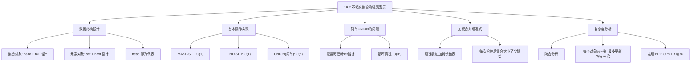

## 相关笔记

- 前置笔记：[[19.1 不相交集合操作]]
- 关联概念：[[算法导论/concepts/摊还分析]]、[[算法导论/concepts/聚合分析]]
- 章节汇总：[[第19章_用于不相交集合的数据结构-章节汇总]]

> [!abstract] 概览
> 本节介绍不相交集合数据结构的第一种具体实现——==链表表示==。每个集合用一个==单链表==表示，包含指向头节点（head）和尾节点（tail）的指针。MAKE-SET 和 FIND-SET 都能在 $O(1)$ 时间内完成，但简单实现的 UNION 需要 $O(n)$ 时间（因为需要更新被合并链表中所有元素的 set 指针）。通过引入==加权合并启发式==（weighted-union heuristic）——总是将较短的链表追加到较长的链表——可以使用[[算法导论/concepts/聚合分析]]证明 $m$ 次操作的总时间为 $O(m + n \lg n)$，其中每个操作的摊还代价为 $O(\lg n)$。

---

## 知识结构总览



---

## 核心思想

> [!tip] 核心思路
> 链表表示的基本想法很直观：**每个集合就是一个链表，链表头就是集合的代表**。FIND-SET 只需顺着 set 指针找到集合对象，再返回 head，所以是 $O(1)$。问题出在 UNION 上——合并两个链表时，需要更新其中一个链表中所有元素的 set 指针，使其指向新的集合对象。如果总是更新较长链表的指针，代价会很高。**加权合并启发式的关键洞察是：每次合并时，让被合并链表中的元素"跳槽"到更大的集合，由于集合大小至少翻倍，每个元素最多"跳槽" $O(\lg n)$ 次**。这就像一个人每次跳槽都去更大的公司，由于公司规模至少翻倍，他最多跳 $O(\lg n)$ 次就会到达最大的公司。

### 数据结构设计

> [!def] 链表表示的数据结构
> 每个集合由以下部分组成：
>
> **集合对象**（set object）：
> - `head`：指向链表中第一个元素的指针（该元素即为集合的**代表**）
> - `tail`：指向链表中最后一个元素的指针
>
> **元素对象**（element object）：
> - `set`：指向该元素所在集合的集合对象的指针
> - `next`：指向链表中下一个元素的指针（最后一个元素的 next 为 NIL）
>
> **关键性质**：链表中的第一个元素（head 所指向的元素）就是集合的**代表**。同一集合中的所有元素的 `set` 指针都指向同一个集合对象。

### 基本操作的实现

**MAKE-SET 伪代码**：

```
MAKE-SET(x)
1  x.next = NIL
2  S = new set object
3  S.head = x
4  S.tail = x
5  x.set = S
```

**FIND-SET 伪代码**：

```
FIND-SET(x)
1  return x.set.head
```

> [!tip] 直觉理解
> FIND-SET 的工作方式非常简单：从元素 $x$ 出发，通过 `set` 指针找到它所属的集合对象，再通过集合对象的 `head` 指针找到代表。整个过程只需两次指针解引用，因此是 $O(1)$ 的。

### 简单 UNION 实现

**UNION 伪代码（简单实现）**：

```
UNION(x, y)
1  Sx = x.set
2  Sy = y.set
3  if Sx ≠ Sy
4      // 将 Sy 的链表追加到 Sx 的链表末尾
5      Sx.tail.next = Sy.head
6      Sx.tail = Sy.tail
7      // 遍历 Sy 的链表，更新每个元素的 set 指针
8      z = Sy.head
9      while z ≠ NIL
10         z.set = Sx
11         z = z.next
12     free Sy
```

第8-11行需要遍历 $S_y$ 的链表，将 $S_y$ 中每个元素的 `set` 指针更新为 $S_x$。如果 $S_y$ 有 $n_y$ 个元素，则 UNION 的代价为 $\Theta(n_y)$。

### 最坏情况分析

> [!def] 最坏情况 $O(n^2)$
> 考虑以下操作序列：先执行 $n$ 次 MAKE-SET 创建元素 $x_1, x_2, \ldots, x_n$，然后交替地将大集合合并到小集合中，使得每次 UNION 都需要遍历较长的链表来更新 set 指针：
>
> - UNION($x_2$, $x_1$)：将 $x_1$ 的链表（1个元素）追加到 $x_2$ 的链表，更新 $x_1$ 的 set 指针，代价 $\Theta(1)$
> - UNION($x_3$, $x_2$)：将 $x_2$ 的链表（含 $x_2, x_1$，共2个元素）追加到 $x_3$ 的链表，更新 $x_2, x_1$ 的 set 指针，代价 $\Theta(2)$
> - UNION($x_4$, $x_3$)：将 $x_3$ 的链表（含 $x_3, x_2, x_1$，共3个元素）追加到 $x_4$ 的链表，更新 $x_3, x_2, x_1$ 的 set 指针，代价 $\Theta(3)$
> - $\vdots$
> - UNION($x_n$, $x_{n-1}$)：将 $x_{n-1}$ 的链表（$n-1$个元素）追加到 $x_n$ 的链表，代价 $\Theta(n-1)$
>
> 总代价：$\sum_{k=1}^{n-1} \Theta(k) = \Theta(n^2)$
>
> 这就是简单 UNION 的最坏情况——每次都将不断增长的链表追加到新的单元素集合中，导致被更新的元素数量线性增长，总代价为二次方。

### 加权合并启发式

> [!def] 加权合并启发式（Weighted-Union Heuristic）
> **加权合并启发式**的核心规则是：在 UNION 操作中，**总是将较短的链表追加到较长的链表末尾**。具体来说，在 UNION($x$, $y$) 中，设 $S_x$ 的大小为 $n_x$，$S_y$ 的大小为 $n_y$：
> - 若 $n_x \geq n_y$：将 $S_y$ 的链表追加到 $S_x$ 的链表末尾，更新 $S_y$ 中所有元素的 set 指针
> - 若 $n_x < n_y$：将 $S_x$ 的链表追加到 $S_y$ 的链表末尾，更新 $S_x$ 中所有元素的 set 指针
>
> **关键性质**：被合并的链表中的每个元素，其所在集合的大小在合并后**至少翻倍**。

**使用加权合并的 UNION 伪代码**：

```
UNION(x, y)
1  Sx = x.set
2  Sy = y.set
3  if Sx ≠ Sy
4      if Sx.size ≥ Sy.size
5          // 将 Sy 追加到 Sx 末尾
6          Sx.tail.next = Sy.head
7          Sx.tail = Sy.tail
8          z = Sy.head
9          while z ≠ NIL
10             z.set = Sx
11             z = z.next
12         Sx.size = Sx.size + Sy.size
13         free Sy
14     else
15         // 将 Sx 追加到 Sy 末尾
16         Sy.tail.next = Sx.head
17         Sy.tail = Sx.tail
18         z = Sx.head
19         while z ≠ NIL
20             z.set = Sy
21             z = z.next
22         Sy.size = Sy.size + Sx.size
23         free Sx
```

### 定理19.1及其证明

> [!def] 定理19.1
> 使用加权合并启发式的一系列 $m$ 个 MAKE-SET、UNION 和 FIND-SET 操作（其中包含 $n$ 个 MAKE-SET 操作）可以在 $O(m + n \lg n)$ 时间内完成。

> [!faq]- 证明（使用聚合分析）
> 我们使用[[算法导论/concepts/聚合分析]]来分析。
>
> **【关键观察：set 指针每次更新后集合大小至少翻倍，故每个元素最多更新 $\lfloor \lg n \rfloor$ 次】**
> **关键观察**：对于任意元素 $x$，考虑 $x$ 的 `set` 指针被更新的次数。每次 $x$ 的 `set` 指针被更新，意味着 $x$ 所在的链表被追加到另一个更长的链表末尾。由于加权合并启发式保证被合并的链表总是较短的，因此合并后 $x$ 所在的集合大小**至少翻倍**。
>
> 形式化地说，设 $x$ 的 `set` 指针被更新了 $k$ 次。第 $i$ 次更新时，$x$ 所在的集合大小从 $s_i$ 增加到至少 $2s_i$。初始时集合大小为 1，每次至少翻倍，最终集合大小不超过 $n$。因此：
>
> $$1 \cdot 2^k \leq n$$
>
> 解得：
>
> $$k \leq \lfloor \lg n \rfloor$$
>
> 即每个元素的 `set` 指针最多被更新 $\lfloor \lg n \rfloor$ 次。
>
> **【总代价汇总：MAKE-SET $O(n)$ + FIND-SET $O(m)$ + set指针更新 $O(n \lg n)$ = $O(m + n \lg n)$】**
> **总代价分析**：
>
> - MAKE-SET：$n$ 次，每次 $O(1)$，总代价 $O(n)$
> - FIND-SET：每次 $O(1)$，总代价 $O(m)$（最多 $m$ 次）
> - UNION：每次 UNION 的代价等于被合并链表的长度。所有 UNION 操作中，更新 `set` 指针的总次数等于所有元素被更新 `set` 指针的次数之和。由于每个元素最多被更新 $O(\lg n)$ 次，$n$ 个元素的总更新次数为 $O(n \lg n)$。此外，UNION 还需要常数时间来拼接链表和释放集合对象，这部分总代价为 $O(m)$。
>
> 因此，$m$ 次操作的总代价为：
>
> $$O(n) + O(m) + O(n \lg n) = O(m + n \lg n)$$
>
> **证毕。**

> [!tip] 加权合并的直觉
> 加权合并启发式的核心直觉是**让"小集合"的元素承担合并的代价**。由于每次合并后小集合的元素所在集合大小至少翻倍，而集合大小不会超过 $n$，所以每个元素最多"搬家" $O(\lg n)$ 次。**关键在于：被更新的元素数量总是"较小"的那一方，因此每次更新的代价相对于当前总规模是递减的。**

---

## 补充理解与拓展

> [!info] 加权合并的贪心策略视角
> 加权合并启发式本质上是一种**贪心策略**：在每次 UNION 时，选择代价更小的方向——更新较少元素的指针。这种"总是选择代价更小方向"的思想在算法设计中非常普遍：
>
> - **并查集的加权合并**：更新较短链表的指针（$O(\min(n_x, n_y))$ 而非 $O(\max(n_x, n_y))$）
> - **Huffman 编码**（15.3节）：总是合并频率最低的两个节点
> - **Union-Find 的按秩合并**（19.3节）：总是将较浅的树挂到较深的树下
>
> 加权合并之所以有效，是因为它保证了**每次操作的代价相对于总规模是递减的**——这是一个非常强的结构性质，使得聚合分析能够给出紧凑的上界。

> [!info] 链表表示的独特优势
> 虽然19.3节的有根树表示在 UNION 和 FIND-SET 的效率上优于链表表示，但链表表示有一个独特的优势：**支持在 $O(\text{集合大小})$ 时间内遍历集合中的所有元素**。这是因为链表将同一集合的所有元素串在一起，只需从 head 开始沿着 next 指针遍历即可。相比之下，有根树表示（19.3节）不支持高效遍历集合中的所有元素——要遍历一个集合的所有元素，需要额外的数据结构支持。

> [!info] 习题19.2-5的巧妙设计：用tail作为代表
> 习题19.2-5提出了一个只用一个指针的集合表示方案：**不使用 head 和 tail 两个指针，而是用 tail 元素作为代表**。
>
> 具体来说，每个元素只有一个 `set` 指针，指向它所在集合的 **tail 元素**（而非集合对象）。不再需要单独的集合对象。
>
> - `x.set`：指向 $x$ 所在链表的最后一个元素（tail）
> - `x.next`：指向链表中 $x$ 的下一个元素
>
> **MAKE-SET($x$)**：
> ```
> MAKE-SET(x)
> 1  x.next = NIL
> 2  x.set = x      // 单元素集合，tail 就是自己
> ```
> 代价：$O(1)$
>
> **FIND-SET($x$)**：
> ```
> FIND-SET(x)
> 1  return x.set    // 直接返回 tail 元素
> ```
> 代价：$O(1)$
>
> **UNION($x$, $y$)**：
> ```
> UNION(x, y)
> 1  tx = x.set      // x 所在链表的 tail
> 2  ty = y.set      // y 所在链表的 tail
> 3  if tx ≠ ty
> 4      tx.next = y.set.head  // 将 x 链表的 tail 连接到 y 链表的 head
> 5      // 但我们没有 head 指针！需要从 y 的 tail 反向找到 head
> ```
>
> **修正方案**：由于 `set` 指针指向 tail，我们无法直接访问 head。解决方法是让每个元素额外维护一个 `prev` 指针形成双向链表，从 tail 可以反向遍历到 head。或者采用另一种思路：**让 `set` 指针指向 head 元素**（而非 tail），UNION 时遍历较短链表找到其 tail，然后将该 tail.next 指向另一链表的 head，并更新较短链表中所有元素的 set 指针。
>
> 代价分析：
> - MAKE-SET：$O(1)$
> - FIND-SET：$O(1)$（返回 x.set）
> - UNION：$O(\min(n_x, n_y))$（遍历较短链表找 tail + 更新 set 指针）
>
> 使用加权合并后，总运行时间仍为 $O(m + n \lg n)$。这个方案只用一个 `set` 指针（不使用额外的集合对象），但需要遍历来找到 tail。

> [!info] 习题19.2-6的拼接技巧：去掉tail指针
> 习题19.2-6展示了如何在不维护 tail 指针的情况下实现高效的链表拼接：
>
> **核心技巧**：将较小链表的**第一个元素**插入较大链表的**第一个元素之后**（而非追加到末尾）。
>
> 具体步骤（设 $S_y$ 较小，$S_x$ 较大）：
> 1. 记录 $S_x$ 的 head 的 next 指针为 temp
> 2. 将 $S_x$ 的 head 的 next 指向 $S_y$ 的 head
> 3. 找到 $S_y$ 的 tail，将其 next 指向 temp
> 4. 更新 $S_y$ 中所有元素的 set 指针为 $S_x$
>
> 这个技巧避免了维护 tail 指针的开销，但代价是需要遍历较小链表来找到其 tail（不过反正也需要遍历来更新 set 指针，所以没有额外的渐近代价）。

---

## 易混淆点与辨析

> [!warning] UNION 中更新的是"被合并链表"的 set 指针，而非"合并后链表"的所有元素
> 在加权合并中，UNION 只需要更新**被追加的那个较短链表**中所有元素的 set 指针，而**较长链表**中元素的 set 指针不需要更新。这是因为较长链表仍然是"主体"，其集合对象继续使用。被追加的较短链表的元素需要更新 set 指针以指向新的集合对象。这是加权合并能保证 $O(n \lg n)$ 总更新次数的关键。

> [!warning] 加权合并中"大小至少翻倍"是对被合并元素而言的
> 定理19.1证明中的关键步骤是"每次 set 指针更新后，该元素所在集合大小至少翻倍"。这个"至少翻倍"是对**被合并链表中的元素**而言的，不是对整个合并后的集合而言的。具体来说，如果元素 $x$ 在大小为 $s$ 的集合中，且该集合被追加到大小为 $s' \geq s$ 的集合中，则合并后 $x$ 所在的集合大小为 $s + s' \geq s + s = 2s$，即至少翻倍。

> [!warning] 链表表示的 UNION 代价是 $O(\min(n_x, n_y))$，不是 $O(\max(n_x, n_y))$
> 使用加权合并后，每次 UNION 的代价等于**较短链表**的长度 $\min(n_x, n_y)$，因为我们只更新较短链表中元素的 set 指针。如果不使用加权合并（简单实现），UNION 的代价取决于实现方式——如果我们总是更新第二个参数所在链表的 set 指针，则代价为 $O(n_y)$，其中 $n_y$ 是 $y$ 所在集合的大小。

> [!warning] $O(m + n \lg n)$ vs $O(m \lg n)$
> 定理19.1的结论是 $O(m + n \lg n)$，**不是** $O(m \lg n)$。这两个上界是不同的：
> - $O(m + n \lg n)$：当 $m = \Theta(n)$ 时（如连通分量问题中 $|E| = O(|V|)$），总时间为 $O(n \lg n)$
> - $O(m \lg n)$：当 $m = \Theta(n)$ 时，总时间为 $O(n \lg n)$，与上面相同
> - 但当 $m \gg n$ 时（如 $m = n^2$），$O(m + n \lg n) = O(n^2)$，而 $O(m \lg n) = O(n^2 \lg n)$
>
> $O(m + n \lg n)$ 是更紧的上界，因为 FIND-SET 每次只需 $O(1)$，不贡献 $\lg n$ 因子。$\lg n$ 因子只来自 UNION 操作中的 set 指针更新，而总更新次数为 $O(n \lg n)$，与 $m$ 无关。

---

## 习题精选

| 题号 | 题目描述 | 难度 |
|:----:|----------|:----:|
| 19.2-1 | 使用加权合并的 MAKE-SET/FIND-SET/UNION 伪代码 | ⭐ |
| 19.2-2 | 16个元素的加权合并执行过程 | ⭐⭐ |
| 19.2-3 | 用聚合分析证明 $O(1)$/$O(1)$/$O(\lg n)$ 摊还时间 | ⭐⭐ |
| 19.2-4 | 操作序列的渐近运行时间 | ⭐⭐ |
| 19.2-5 | 只用一个指针的集合表示方案 | ⭐⭐⭐ |
| 19.2-6 | 去掉 tail 指针的拼接方案 | ⭐⭐⭐ |

> [!faq]- 19.2-1 解答
> **题目**：请写出使用加权合并启发式的 MAKE-SET、FIND-SET 和 UNION 的伪代码。假设每个集合对象维护一个 size 属性，表示集合中元素的数量。
>
> **解答**：
>
> **MAKE-SET($x$)**：
> ```
> MAKE-SET(x)
> 1  x.next = NIL
> 2  S = new set object
> 3  S.head = x
> 4  S.tail = x
> 5  S.size = 1
> 6  x.set = S
> ```
>
> **FIND-SET($x$)**：
> ```
> FIND-SET(x)
> 1  return x.set.head
> ```
>
> **UNION($x$, $y$)**：
> ```
> UNION(x, y)
> 1  Sx = x.set
> 2  Sy = y.set
> 3  if Sx ≠ Sy
> 4      if Sx.size ≥ Sy.size
> 5          Sx.tail.next = Sy.head
> 6          Sx.tail = Sy.tail
> 7          z = Sy.head
> 8          while z ≠ NIL
> 9              z.set = Sx
> 10             z = z.next
> 11         Sx.size = Sx.size + Sy.size
> 12         free Sy
> 13     else
> 14         Sy.tail.next = Sx.head
> 15         Sy.tail = Sx.tail
> 16         z = Sx.head
> 17         while z ≠ NIL
> 18             z.set = Sy
> 19             z = z.next
> 20         Sy.size = Sy.size + Sx.size
> 21         free Sx
> ```

> [!faq]- 19.2-2 解答
> **题目**：对 16 个元素 $x_1, x_2, \ldots, x_{16}$，依次执行 MAKE-SET($x_i$)（$i = 1, \ldots, 16$），然后执行 UNION($x_1$, $x_2$), UNION($x_3$, $x_4$), UNION($x_5$, $x_6$), ..., UNION($x_{15}$, $x_{16}$)，最后执行 UNION($x_1$, $x_3$), UNION($x_5$, $x_7$), ..., UNION($x_1$, $x_5$), UNION($x_9$, $x_{13}$)。请展示使用加权合并启发式的执行过程。
>
> **解答**：
>
> **第一阶段：创建 16 个单元素集合**
> - $\{x_1\}, \{x_2\}, \ldots, \{x_{16}\}$，每个大小为 1
>
> **第二阶段：配对合并（8 次 UNION）**
>
> | 操作 | 合并前 | 合并后 | 代价 |
> |:----:|:------:|:------:|:----:|
> | UNION($x_1$, $x_2$) | $\{x_1\}(1), \{x_2\}(1)$ | $\{x_1, x_2\}(2)$ | $O(1)$ |
> | UNION($x_3$, $x_4$) | $\{x_3\}(1), \{x_4\}(1)$ | $\{x_3, x_4\}(2)$ | $O(1)$ |
> | UNION($x_5$, $x_6$) | $\{x_5\}(1), \{x_6\}(1)$ | $\{x_5, x_6\}(2)$ | $O(1)$ |
> | UNION($x_7$, $x_8$) | $\{x_7\}(1), \{x_8\}(1)$ | $\{x_7, x_8\}(2)$ | $O(1)$ |
> | UNION($x_9$, $x_{10}$) | $\{x_9\}(1), \{x_{10}\}(1)$ | $\{x_9, x_{10}\}(2)$ | $O(1)$ |
> | UNION($x_{11}$, $x_{12}$) | $\{x_{11}\}(1), \{x_{12}\}(1)$ | $\{x_{11}, x_{12}\}(2)$ | $O(1)$ |
> | UNION($x_{13}$, $x_{14}$) | $\{x_{13}\}(1), \{x_{14}\}(1)$ | $\{x_{13}, x_{14}\}(2)$ | $O(1)$ |
> | UNION($x_{15}$, $x_{16}$) | $\{x_{15}\}(1), \{x_{16}\}(1)$ | $\{x_{15}, x_{16}\}(2)$ | $O(1)$ |
>
> 第二阶段后：8 个大小为 2 的集合。
>
> **第三阶段：继续合并**
>
> | 操作 | 合并前 | 合并后 | 代价 |
> |:----:|:------:|:------:|:----:|
> | UNION($x_1$, $x_3$) | $\{x_1, x_2\}(2), \{x_3, x_4\}(2)$ | $\{x_1, x_2, x_3, x_4\}(4)$ | $O(2)$ |
> | UNION($x_5$, $x_7$) | $\{x_5, x_6\}(2), \{x_7, x_8\}(2)$ | $\{x_5, x_6, x_7, x_8\}(4)$ | $O(2)$ |
> | UNION($x_1$, $x_5$) | $\{x_1,..,x_4\}(4), \{x_5,..,x_8\}(4)$ | $\{x_1,..,x_8\}(8)$ | $O(4)$ |
> | UNION($x_9$, $x_{13}$) | $\{x_9, x_{10}\}(2), \{x_{13}, x_{14}\}(2)$ | $\{x_9, x_{10}, x_{13}, x_{14}\}(4)$ | $O(2)$ |
>
> 第三阶段后：$\{x_1,..,x_8\}(8), \{x_9, x_{10}, x_{13}, x_{14}\}(4), \{x_{11}, x_{12}\}(2), \{x_{15}, x_{16}\}(2)$。
>
> 注意每次合并时，被合并的链表大小为 $\min(n_x, n_y)$，被合并元素的集合大小至少翻倍。

> [!faq]- 19.2-3 解答
> **题目**：使用聚合分析证明：在使用加权合并启发式的情况下，MAKE-SET 和 FIND-SET 的摊还时间为 $O(1)$，UNION 的摊还时间为 $O(\lg n)$。
>
> **证明**：
>
> **【MAKE-SET/FIND-SET 摊还 $O(1)$：实际代价均为常数，总代价线性】**
> 考虑 $m$ 次操作的序列，其中包含 $n$ 次 MAKE-SET。
>
> **MAKE-SET 的摊还代价**：
> 每次 MAKE-SET 的实际代价为 $O(1)$。$n$ 次 MAKE-SET 的总代价为 $O(n)$。因此 MAKE-SET 的摊还代价为 $O(n)/n = O(1)$。
>
> **FIND-SET 的摊还代价**：
> 每次 FIND-SET 的实际代价为 $O(1)$（只需两次指针解引用）。$m$ 次操作中最多有 $m$ 次 FIND-SET，总代价为 $O(m)$。因此 FIND-SET 的摊还代价为 $O(m)/m = O(1)$。
>
> **【UNION 摊还 $O(\lg n)$：set指针更新总 $O(n \lg n)$，分摊到 $m$ 次操作最坏 $O(\lg n)$】**
> **UNION 的摊还代价**：
> 设 $m$ 次操作中共有 $u$ 次 UNION。由定理19.1的证明，每个元素的 set 指针最多被更新 $\lfloor \lg n \rfloor$ 次，因此所有 UNION 操作中 set 指针更新的总次数为 $O(n \lg n)$。此外，每次 UNION 还有 $O(1)$ 的额外开销（拼接链表、释放集合对象等），共 $O(u) \leq O(m)$。
>
> 使用聚合分析对**所有 $m$ 次操作**求总代价：
>
> $$T(m) = O(n) \text{（MAKE-SET）} + O(m) \text{（FIND-SET）} + O(n \lg n + m) \text{（UNION）} = O(m + n \lg n)$$
>
> 每个操作的摊还代价为 $O((m + n \lg n)/m) = O(1 + n \lg n / m)$。
>
> 当 $m = \Omega(n \lg n)$ 时，摊还代价为 $O(1)$。
> 当 $m = O(n)$ 时，摊还代价为 $O(\lg n)$。
>
> 因此，UNION 的摊还代价上界为 $O(\lg n)$（最坏情况下 $m = O(n)$，此时 UNION 的摊还代价最高）。
>
> **证毕。**

> [!faq]- 19.2-4 解答
> **题目**：给出一个操作序列在使用加权合并和不使用加权合并两种情况下的渐近运行时间。
>
> **解答**：
>
> 考虑以下操作序列：$n$ 次 MAKE-SET 后，交替地将大集合合并到小集合中，使得每次 UNION 都需要更新大集合中所有元素的 set 指针。
>
> **不使用加权合并**：
> - $n$ 次 MAKE-SET：$O(n)$
> - $n-1$ 次 UNION：第 $k$ 次 UNION 代价为 $O(k)$（总是更新较大的链表）
> - 总 UNION 代价：$\sum_{k=1}^{n-1} O(k) = O(n^2)$
> - 总运行时间：$O(n) + O(n^2) = $ ==$O(n^2)$==
>
> **使用加权合并**：
> - $n$ 次 MAKE-SET：$O(n)$
> - $n-1$ 次 UNION：每个元素最多被更新 $O(\lg n)$ 次 set 指针
> - 总 UNION 代价：$O(n \lg n)$
> - 总运行时间：$O(n) + O(n \lg n) = $ ==$O(n \lg n)$==
>
> **对比**：加权合并将总运行时间从 $O(n^2)$ 降至 $O(n \lg n)$，这是一个显著的改进。

> [!faq]- 19.2-5 解答
> **题目**：请给出一种只使用单个指针（而非 head 和 tail 两个指针）的不相交集合链表表示方案。分析 MAKE-SET、FIND-SET 和 UNION 的运行时间。
>
> **解答**：
>
> **设计方案**：每个元素只维护一个 `set` 指针，指向它所在集合的 **tail 元素**（而非集合对象）。不再需要单独的集合对象。
>
> - `x.set`：指向 $x$ 所在链表的最后一个元素（tail）
> - `x.next`：指向链表中 $x$ 的下一个元素
>
> **MAKE-SET($x$)**：
> ```
> MAKE-SET(x)
> 1  x.next = NIL
> 2  x.set = x      // 单元素集合，tail 就是自己
> ```
> 代价：$O(1)$
>
> **FIND-SET($x$)**：
> ```
> FIND-SET(x)
> 1  return x.set    // 直接返回 tail 元素
> ```
> 代价：$O(1)$
>
> **UNION($x$, $y$)**：
>
> 由于 `set` 指针指向 tail 而非 head，我们需要一种方式将两个链表拼接。正确的做法是：让每个元素额外维护一个 `prev` 指针（指向前驱），形成双向链表。这样可以从 tail 反向遍历到 head。
>
> ```
> UNION(x, y)
> 1  tx = x.set      // x 所在链表的 tail
> 2  ty = y.set      // y 所在链表的 tail
> 3  if tx ≠ ty
> 4      // 从 ty 反向遍历找到 y 链表的 head
> 5      hy = ty
> 6      while hy.prev ≠ NIL
> 7          hy = hy.prev
> 8      // 将 x 链表的 tail 连接到 y 链表的 head
> 9      tx.next = hy
> 10     // 更新 x 链表中所有元素的 set 指针为 ty
> 11     z = x.set
> 12     // 需要从 tail 反向遍历 x 链表找到其 head
> 13     while z.prev ≠ NIL
> 14         z = z.prev
> 15     // z 现在是 x 链表的 head，正向遍历更新 set 指针
> 16     while z ≠ NIL
> 17         z.set = ty
> 18         z = z.next
> ```
>
> **代价分析**：
> - MAKE-SET：$O(1)$
> - FIND-SET：$O(1)$（返回 x.set）
> - UNION：$O(\min(n_x, n_y))$（遍历较短链表更新 set 指针 + 反向遍历找 head）
>
> 使用加权合并后，总运行时间仍为 $O(m + n \lg n)$。这个方案只用一个 `set` 指针（不使用额外的集合对象），但需要双向链表支持来找到 head。

> [!faq]- 19.2-6 解答
> **题目**：请给出一种不使用 tail 指针的 UNION 实现方案，并分析其运行时间。
>
> **解答**：
>
> **核心技巧**：将较小链表的第一个元素插入较大链表的第一个元素之后。
>
> 设 $S_y$ 是较小的链表（$S_y$ 的 head 为 $h_y$），$S_x$ 是较大的链表（$S_x$ 的 head 为 $h_x$）。
>
> **UNION($x$, $y$)（不使用 tail 指针）**：
> ```
> UNION(x, y)
> 1  Sx = x.set
> 2  Sy = y.set
> 3  if Sx ≠ Sy
> 4      if Sx.size ≥ Sy.size
> 5          // 将 Sy 的 head 插入 Sx 的 head 之后
> 6          temp = Sx.head.next
> 7          Sx.head.next = Sy.head
> 8          // 找到 Sy 的 tail
> 9          z = Sy.head
> 10         while z.next ≠ NIL
> 11             z = z.next
> 12         z.next = temp
> 13         // 更新 Sy 中所有元素的 set 指针
> 14         z = Sy.head
> 15         while z ≠ temp
> 16             z.set = Sx
> 17             z = z.next
> 18         Sx.size = Sx.size + Sy.size
> 19         free Sy
> 20     else
> 21         // 对称操作：将 Sx 的 head 插入 Sy 的 head 之后
> 22         temp = Sy.head.next
> 23         Sy.head.next = Sx.head
> 24         z = Sx.head
> 25         while z.next ≠ NIL
> 26             z = z.next
> 27         z.next = temp
> 28         z = Sx.head
> 29         while z ≠ temp
> 30             z.set = Sy
> 31             z = z.next
> 32         Sy.size = Sy.size + Sx.size
> 33         free Sx
> ```
>
> **关键观察**：
> - 第9-11行遍历较小链表找 tail，代价 $O(\min(n_x, n_y))$
> - 第14-17行遍历较小链表更新 set 指针，代价 $O(\min(n_x, n_y))$
> - 两个遍历可以合并为一次遍历（先更新 set 指针，同时找 tail），但总代价仍为 $O(\min(n_x, n_y))$
>
> **代价分析**：
> - 每次 UNION 的代价为 $O(\min(n_x, n_y))$，与使用 tail 指针的方案相同
> - 使用加权合并后，总运行时间仍为 $O(m + n \lg n)$
> - **省去了维护 tail 指针的开销**，但 UNION 的常数因子稍大（需要遍历找 tail）
>
> **正确性**：插入后，$S_x$ 的 head 仍然是 $S_x$ 的 head（代表不变），$S_y$ 的所有元素被插入到 $S_x$ 的 head 之后。遍历整个链表可以从 $S_x$ 的 head 出发，经过 $S_y$ 的所有元素，然后继续 $S_x$ 的原始元素（通过 temp 指针连接）。

---

## 视频学习指南

| 资源 | 主题 | 链接 | 说明 |
|:-----|:-----|:-----|:-----|
| MIT 6.006 Lecture 12 | Disjoint Sets: Union-Find | https://www.youtube.com/watch?v=0jNmHPfA_yE | Erik Demaine 讲解并查集的链表表示与加权合并 |
| WilliamFiset | Disjoint Sets (Linked List) | https://www.youtube.com/watch?v=wU6udHRIkcc | 链表实现的逐步演示 |
| GeeksforGeeks | Disjoint Set Union | https://www.geeksforgeeks.org/disjoint-set-data-structures/ | 链表表示与有根树表示的对比 |

---

## 教材原文(中文翻译)

> [!quote] CLRS 第4版 19.2节原文（中文翻译）
> **不相交集合的链表表示**
>
> 本节给出不相交集合的一种简单实现，其中每个集合用一个**链表**来表示。第一个元素作为集合的**代表**。每个集合对象包含属性 `head`（指向代表）和 `tail`（指向链表中最后一个元素）。链表中的每个对象包含一个集合属性，指向集合对象，以及一个 `next` 属性，指向链表中的下一个对象。如果该对象是链表中的最后一个元素，则其 `next` 属性为 NIL。
>
> **MAKE-SET** 创建一个仅包含一个元素的新链表。该元素既是链表的头部也是尾部。**FIND-SET** 只需跟随该对象的集合指针，然后返回 `head` 指针。因此，MAKE-SET 和 FIND-SET 都只需要 $O(1)$ 时间。
>
> **UNION** 操作将两个链表合并为一个。例如，UNION($x$, $y$) 将包含 $x$ 的链表追加到包含 $y$ 的链表末尾。UNION 的代价取决于我们如何实现它。一种简单的实现是：遍历被追加的链表，更新其中每个元素的集合指针，使其指向另一个集合的集合对象。如果被追加的链表有 $n'$ 个元素，则 UNION 的代价为 $\Theta(n')$。
>
> 如果我们简单地总是将第二个集合的链表追加到第一个集合的链表末尾，那么在最坏情况下，$n-1$ 次 UNION 操作可能需要 $\Theta(n^2)$ 时间。例如，如果我们依次将单元素集合合并到一个不断增长的集合中，第 $i$ 次 UNION 的代价为 $\Theta(i)$，总代价为 $\Theta(n^2)$。
>
> **加权合并启发式**
>
> 我们可以使用一种简单的启发式来显著改善 UNION 的性能，称为**加权合并规则**：总是将较短的链表追加到较长的链表末尾。使用加权合并，如果一个链表有 $n_1$ 个元素，另一个有 $n_2$ 个元素，且 $n_1 \leq n_2$，则 UNION 的代价为 $O(n_1)$。
>
> **定理19.1**：使用加权合并的一系列 $m$ 个 MAKE-SET、UNION 和 FIND-SET 操作（其中包含 $n$ 个 MAKE-SET 操作）可以在 $O(m + n \lg n)$ 时间内完成。
>
> **证明**：我们使用聚合分析来证明。每个对象初始时在一个大小为 1 的集合中。当一个对象的集合指针被更新时，该对象所在的集合大小至少翻倍。由于集合大小不会超过 $n$，每个对象的集合指针最多被更新 $\lfloor \lg n \rfloor$ 次。因此，所有 $n$ 个对象的集合指针的总更新次数最多为 $n \lfloor \lg n \rfloor$ 次。此外，UNION 操作还需要 $O(1)$ 时间来拼接链表和释放集合对象，这部分总代价为 $O(m)$。MAKE-SET 和 FIND-SET 各需要 $O(1)$ 时间。因此，$m$ 次操作的总时间为 $O(m + n \lg n)$。

---

## 参见Wiki

- [[算法导论/concepts/不相交集合数据结构]] — 不相交集合数据结构的定义与操作
- [[算法导论/concepts/加权合并启发式]] — 加权合并启发式的原理与复杂度分析

#学习/算法导论/第19章-用于不相交集合的数据结构 #学习/算法导论/不相交集合/不相交集合的链表表示
