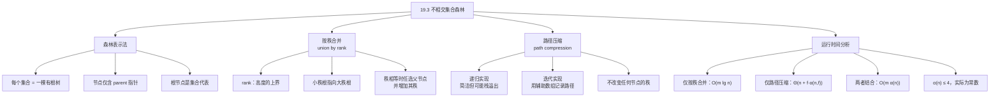

## 相关笔记

[[19.1 不相交集合操作]] | [[19.2 不相交集合的链表表示]] | [[19.4 按秩合并与路径压缩的分析]] | [[算法导论/concepts/摊还分析]] | [[第19章_用于不相交集合的数据结构-章节汇总]]

> [!abstract] 概览
> 本节介绍用**不相交集合森林**（disjoint-set forest）表示不相交集合的方法，并引入两种关键启发式策略——**按秩合并**（union by rank）和**路径压缩**（path compression），使并查集操作的实际运行时间接近线性。核心知识点包括：
> - **森林表示**：每个集合用一棵有根树表示，每个节点只含一个 parent 指针
> - **按秩合并**：利用秩（近似高度的上界）指导合并方向，避免树退化成链
> - **路径压缩**：在 FIND-SET 时将路径上所有节点直接指向根，加速后续查找
> - **两种启发式结合**：最坏情况 $O(m \alpha(n))$，实际中 $\alpha(n) \le 4$，等价于常数时间

---

## 知识结构总览



---

## 核心思想

### 森林表示法

不相交集合森林用一组**有根树**来表示不相交集合。每棵树对应一个集合，树中的每个节点包含一个集合成员。每个节点只存储一个 **parent 指针** `x.p`，指向其父节点。**根节点**的 parent 指向自己，根即为该集合的**代表元素**（representative）。

> [!def] 不相交集合森林
> 一种用有根树森林表示不相交集合的数据结构。每个节点只含一个 parent 指针，根节点的 parent 指向自身并作为集合代表。支持 MAKE-SET、FIND-SET、UNION 三种基本操作。

这种表示非常简洁：每个节点只需要一个 parent 指针和一个 rank 值（用于按秩合并），空间开销为 $O(n)$。

### 三种基本操作

**MAKE-SET(x)**：创建一个只含节点 x 的单节点树。x 的 parent 指向自身，rank 初始化为 0。时间复杂度 $O(1)$。

**FIND-SET(x)**：从节点 x 出发，沿 parent 指针不断向上走，直到到达根节点（parent 指向自身的节点）。返回根即为 x 所在集合的代表。时间复杂度为 $O(h)$，其中 $h$ 为树高。

**UNION(x, y)**：先分别对 x 和 y 执行 FIND-SET 找到两个根节点 rx 和 ry，然后让其中一个根指向另一个根，从而将两棵树合并为一棵。时间复杂度取决于 FIND-SET 的开销。

### 按秩合并（Union by Rank）

朴素实现中，如果 UNION 总是让一棵树的根指向另一棵树的根，最坏情况下 $n-1$ 次 UNION 可以产生一棵高度为 $n$ 的链式树，FIND-SET 退化为 $O(n)$。

**按秩合并**策略与链表表示中的加权合并类似，但为了简化分析，使用**秩**（rank）而非精确的子树大小。每个节点维护一个整数 `x.rank`，它是**节点高度的上界**。合并规则如下：

- 比较两个根 rx 和 ry 的 rank
- 如果 `rx.rank > ry.rank`，则让 ry 指向 rx（大秩根成为父节点）
- 如果 `rx.rank < ry.rank`，则让 rx 指向 ry
- 如果 `rx.rank == ry.rank`，任选一个作为父节点，并将其 rank 加 1

> [!tip] 核心思想
> 按秩合并的核心思想是**始终让较矮的树成为较高树的子树**，从而控制合并后树的高度增长。秩是高度的上界而非精确值，这使得理论分析更加简洁。秩只在节点成为根时才可能增加，一旦节点不再是根，其秩永远不再改变。

### 路径压缩（Path Compression）

**路径压缩**是第二种启发式策略，作用于 FIND-SET 操作。在查找过程中，当找到根节点后，将查找路径上的**所有节点**的 parent 指针直接指向根节点。这样后续对这些节点的查找只需一步即可到达根。

路径压缩**不改变任何节点的秩**。这是因为秩是高度的上界，路径压缩只可能降低实际高度，不会使高度超过秩所规定的上界。

**递归实现**（教材版本）：

```
FIND-SET(x)
1  if x ≠ x.p                    // x 不是根？
2      x.p = FIND-SET(x.p)       // 递归查找，并将根设为 x 的父节点
3  return x.p                    // 返回根
```

这个递归实现非常简洁。它是一个**两趟方法**：递归时第一趟向上找到根，递归返回时第二趟向下更新路径上每个节点的 parent 指针直接指向根。

**迭代实现**（非递归版本）：

```
FIND-SET(x)
1  if x == x.p
2      return x
3  // 用链表记录查找路径
4  path = 空链表
5  while x ≠ x.p
6      将 x 追加到 path
7      x = x.p
8  root = x                       // 找到根
9  // 路径压缩：让路径上所有节点直接指向根
10 for each node in path
11     node.p = root
12 return root
```

> [!tip] 两种实现的对比
> **递归版**代码简洁优雅，仅3行，但深层递归可能导致**栈溢出**。**迭代版**使用辅助链表记录路径，空间开销与路径长度成正比，但更安全，不会栈溢出。在实际工程中（如竞赛编程），迭代版更为常用。

### UNION 和 LINK 的伪代码

```
MAKE-SET(x)
1  x.p = x
2  x.rank = 0

UNION(x, y)
1  LINK(FIND-SET(x), FIND-SET(y))

LINK(x, y)
1  if x.rank > y.rank
2      y.p = x
3  else x.p = y
4      if x.rank == y.rank
5          y.rank = y.rank + 1
```

LINK 过程假设其参数 x 和 y 都是根节点。UNION 先调用两次 FIND-SET 找到根，再调用 LINK 完成合并。

### 运行时间分析

单独使用任一启发式都能改善运行时间，两者结合效果更佳：

| 启发式组合 | 运行时间 | 说明 |
|:-----------|:---------|:-----|
| 无启发式 | $O(mn)$ 最坏情况 | 树退化为链 |
| 仅按秩合并 | $O(m \lg n)$ | 树高为 $O(\lg n)$ |
| 仅路径压缩 | $\Theta(n + f \cdot \alpha(n, f))$ | $f$ 为 FIND-SET 次数 |
| **按秩合并 + 路径压缩** | **$O(m \alpha(n))$** | $\alpha(n) \le 4$ 对所有实际输入 |

其中 $\alpha(n)$ 是**反阿克曼函数**（inverse Ackermann function），定义在 [[19.4 按秩合并与路径压缩的分析]] 中。对于任何 conceivable 的应用，$\alpha(n) \le 4$，因此实际运行时间等同于线性。

---

## 补充理解与拓展

> [!info] 补充：按秩合并 vs 按大小合并
> **来源：** 教材第19.3节讨论；Tarjan, "Data Structures and Network Algorithms", 1983
>
> **按秩合并**使用 rank（高度上界）作为合并依据，**按大小合并**（union by size）则记录以每个根为根的子树中的节点数，让较小子树的根指向较大子树的根。
>
> 两种策略都能保证树高为 $O(\lg n)$。但在路径压缩存在时，rank 不再精确等于高度，而大小仍然精确。因此，按大小合并在某些实际场景中可能表现略优。然而，按秩合并的**理论分析更简洁**（特别是 19.4 节的 $O(m\alpha(n))$ 证明），这也是教材选择按秩合并的原因。

> [!info] 补充：路径压缩的两种实现对比
> **来源：** 教材第530页伪代码；竞赛编程实践
>
> **递归版**（教材版本）：代码仅3行，利用递归调用栈隐式记录路径。优点是极其简洁，缺点是当树很深时可能触发调用栈溢出（默认栈大小通常只能支持数万层递归）。
>
> **迭代版**：显式使用辅助数组或链表记录查找路径上的所有节点，找到根后批量更新。空间开销与路径长度相同（$O(\lg n)$ 在按秩合并下），但不受栈大小限制，更为安全。在 C++ 竞赛编程中，迭代版几乎是标准做法。

> [!info] 补充：并查集的实际应用场景
> **来源：** 多个经典教材与工程实践
>
> 并查集（不相交集合森林）是计算机科学中应用最广泛的数据结构之一，典型场景包括：
>
> 1. **Kruskal 最小生成树算法**（CLRS 第23章）：在按边权排序后，依次考察每条边，用并查集判断边的两个端点是否属于同一连通分量。若不属于同一集合，则加入该边并合并两个集合。这是并查集最经典的教科书应用。
>
> 2. **图像分割与连通域标记**：OpenCV 的 `cv::connectedComponents` 函数底层使用并查集来标记二值图像中的连通区域。在图像处理中，需要将相邻的同色像素归为同一区域，并查集能高效完成这一任务。
>
> 3. **渗透问题（Percolation）**：Sedgewick & Wayne, *Algorithms*, 4th Edition, Princeton。在 $n \times n$ 的网格中，判断是否存在从顶部到底部的渗透路径。每个格子是一个节点，相邻格子之间若都开放则合并，用并查集维护连通性。
>
> 4. **社交网络好友圈判断**：给定一组"好友关系"，判断任意两个人是否属于同一个朋友圈（间接好友也算）。这是并查集最直观的应用——维护动态等价类。
>
> 5. **动态连通性问题**：网络拓扑管理中，需要实时判断网络中两个节点是否连通。并查集支持高效的动态插入边和连通性查询。
>
> 6. **竞赛编程经典题目**：LeetCode 200 *Number of Islands*（岛屿数量）、LeetCode 684 *Redundant Connection*（冗余连接）、LeetCode 1319 *Number of Operations to Make Network Connected* 等。并查集是这些题目的标准解法。

---

## 易混淆点与辨析

> [!warning] 误区：路径压缩会改变节点的秩
> **错误理解：** 路径压缩使树变矮了，所以节点的秩也应该减小。
> **正确理解：** 路径压缩**不改变任何节点的秩**。秩是节点高度的一个**上界**，路径压缩只可能降低实际高度，不会使高度超过秩。因此秩作为上界仍然有效，无需修改。
> **辨析：** 秩的设计初衷就是作为一个"宽松的上界"来简化分析。如果路径压缩后还要更新秩，不仅增加了实现复杂度，还会破坏按秩合并的理论分析基础。

> [!warning] 误区：按秩合并中 rank 就是子树的高度
> **错误理解：** rank 精确等于以该节点为根的子树的高度。
> **正确理解：** rank 是高度的**上界**，不一定等于实际高度。特别是在路径压缩之后，实际高度可能远小于 rank。
> **辨析：** MAKE-SET 时 rank = 0 = 高度，此时精确。但路径压缩会降低实际高度而不改变 rank，因此 rank 只是一个保守的上界。教材选择使用 rank 而非精确高度，正是因为这个"宽松性"使得 $O(m\alpha(n))$ 的证明成为可能。

> [!warning] 误区：UNION 操作的时间复杂度是 O(1)
> **错误理解：** UNION 只是让一个根指向另一个根，所以是 $O(1)$。
> **正确理解：** UNION 需要先调用两次 FIND-SET 找到两个根，再执行 LINK。因此 UNION 的实际代价取决于 FIND-SET 的代价。在按秩合并+路径压缩下，UNION 的摊还代价为 $O(\alpha(n))$。
> **辨析：** 教材将 UNION 分解为 FIND-SET + FIND-SET + LINK 三步。LINK 本身确实是 $O(1)$，但两次 FIND-SET 的代价不能忽略。在 19.4 节的分析中，教材甚至假设直接调用 LINK（即 FIND-SET 单独计算），以简化势能分析。

---

## 习题精选

> [!todo] 习题概览
> | 题号 | 来源 | 核心考点 | 难度 |
> |:-----|:-----|:---------|:-----|
> | 19.3-1 | 教材习题 | 森林+按秩合并+路径压缩的执行过程 | ⭐ |
> | 19.3-2 | 教材习题 | FIND-SET 的非递归实现 | ⭐⭐ |
> | 19.3-3 | 教材习题 | 仅按秩合并的 Ω(m lg n) 下界构造 | ⭐⭐⭐ |
> | 19.3-4 | 教材习题 | 添加 PRINT-SET 操作 | ⭐⭐ |
> | 19.3-5 | 教材习题 | LINK 全在 FIND-SET 之前的 O(m) 证明 | ⭐⭐⭐ |

### 题1：19.3-1 用森林+按秩合并+路径压缩重做 19.2-2

> [!example] 题目
> 使用不相交集合森林（带按秩合并和路径压缩）重做练习 19.2-2。给出执行过程中每个节点的 $x_i$ 值和 rank。

> [!faq]- 解答
> **初始状态**：对每个 $x_i$（$i = 1, 2, \ldots, 16$）执行 MAKE-SET，每个节点自成一棵单节点树，rank = 0。
>
> **操作序列**（与 19.2-2 相同）依次为：
>
> UNION($x_1, x_2$), UNION($x_3, x_4$), UNION($x_5, x_6$), UNION($x_7, x_8$),
> UNION($x_1, x_3$), UNION($x_5, x_7$), UNION($x_1, x_5$),
> UNION($x_9, x_{10}$), UNION($x_{11}, x_{12}$), UNION($x_{13}, x_{14}$), UNION($x_{15}, x_{16}$),
> UNION($x_9, x_{11}$), UNION($x_{13}, x_{15}$), UNION($x_9, x_{13}$),
> UNION($x_1, x_9$),
> FIND-SET($x_2$), FIND-SET($x_{16}$)
>
> **逐步执行过程**：
>
> **第1-4次 UNION**：分别合并 (1,2)、(3,4)、(5,6)、(7,8)。每次合并两个 rank=0 的根，LINK 后一个根 rank 变为 1。产生 4 棵高度为 1 的树：
> - 树A：1→2（rank(1)=1, rank(2)=0）
> - 树B：3→4（rank(3)=1, rank(4)=0）
> - 树C：5→6（rank(5)=1, rank(6)=0）
> - 树D：7→8（rank(7)=1, rank(8)=0）
>
> **第5次 UNION(1,3)**：FIND-SET($x_1$)=1, FIND-SET($x_3$)=3。rank(1)=rank(3)=1，LINK 任选，假设 3 成为 1 的子节点，rank(1) 增至 2。树：1→{2, 3→4}。
>
> **第6次 UNION(5,7)**：类似地，rank(5)=rank(7)=1，LINK 后 7 成为 5 的子节点，rank(5) 增至 2。树：5→{6, 7→8}。
>
> **第7次 UNION(1,5)**：rank(1)=2, rank(5)=2，LINK 任选，假设 5 成为 1 的子节点，rank(1) 增至 3。树：1→{2, 3→4, 5→{6, 7→8}}。
>
> **第8-11次 UNION**：类似地合并 (9,10)、(11,12)、(13,14)、(15,16)，产生 4 棵高度为 1 的树。
>
> **第12次 UNION(9,11)**：rank(9)=rank(11)=1，LINK 后 rank 增至 2。
>
> **第13次 UNION(13,15)**：类似，rank 增至 2。
>
> **第14次 UNION(9,13)**：rank(9)=rank(13)=2，LINK 后 rank 增至 3。
>
> **第15次 UNION(1,9)**：rank(1)=3, rank(9)=3，LINK 任选，假设 9 成为 1 的子节点，rank(1) 增至 4。
>
> **FIND-SET($x_2$)**：路径为 2→1，路径压缩后 2 直接指向 1（已经是直接子节点，无变化）。
>
> **FIND-SET($x_{16}$)**：路径为 16→15→13→9→1。路径压缩后，16、15、13、9 全部直接指向根 1。
>
> **最终森林结构**（路径压缩后）：
>
> ```
>         1
>        /|\
>       2 3 5 9
>       | /| /|\
>       4 6 7 10 11 13
>         | |  /|
>         8 12 14 15
>               |
>              16
> ```
>
> 根节点 1 的 rank = 4。所有非根节点的 parent 指针均直接指向 1（路径压缩效果）。
>
> $\blacksquare$

> [!tip] 解题思路提示
> 画出每一步的森林状态，标注每个节点的 parent 和 rank。注意路径压缩只在 FIND-SET 时触发，UNION 中的 FIND-SET 也会触发路径压缩。最终 FIND-SET($x_{16}$) 的路径压缩将路径上所有节点直接指向根 1。

### 题2：19.3-2 FIND-SET 的非递归版本

> [!example] 题目
> 写出一个带路径压缩的 FIND-SET 的非递归版本。

> [!faq]- 解答
> **[步骤1]** 首先找到根节点：从 x 出发，沿 parent 指针向上走到根。
>
> **[步骤2]** 在向上走的过程中，用辅助数据结构（如链表或数组）记录路径上的所有节点。
>
> **[步骤3]** 找到根后，遍历记录的路径，将每个节点的 parent 设为根。
>
> 具体伪代码如下：
> ```
> FIND-SET(x)
> 1  if x == x.p
> 2      return x
> 3  // 第一趟：找到根，同时记录路径
> 4  path = 空链表
> 5  current = x
> 6  while current ≠ current.p
> 7      将 current 追加到 path
> 8      current = current.p
> 9  root = current
> 10 // 第二趟：路径压缩
> 11 for each node in path
> 12     node.p = root
> 13 return root
> ```
>
> $\blacksquare$

> [!tip] 解题思路提示
> 核心思路是"先记录路径，再批量更新"。关键在于第一趟向上遍历时保存所有经过的节点，第二趟统一修改 parent 指针。这与递归版的"递归上去、回溯下来"本质相同，只是显式地用数据结构替代了调用栈。

### 题3：19.3-3 构造 Ω(m lg n) 的操作序列

> [!example] 题目
> 给出一个由 m 次 MAKE-SET、UNION 和 FIND-SET 操作组成的序列，其中 n 次为 MAKE-SET 操作，使得仅使用按秩合并（不使用路径压缩）时，该序列的运行时间为 $\Omega(m \lg n)$。

> [!faq]- 解答
> **[步骤1]** 构造思路：我们需要让 FIND-SET 的代价尽可能大。在仅按秩合并下，树高为 $O(\lg n)$，我们需要构造一个序列使得 FIND-SET 的总代价达到 $\Omega(m \lg n)$。
>
> **[步骤2]** 构造方法：
> - 执行 $n$ 次 MAKE-SET 创建 $n$ 个单元素集合
> - 执行 $n/2$ 次 UNION，每次合并两个 rank 相同的树（类似归并排序的合并方式），构造出一棵高度为 $\Theta(\lg n)$ 的平衡树
> - 执行 $m - n - n/2 = \Omega(m)$ 次 FIND-SET，每次都从最深的叶子节点开始查找
>
> **[步骤3]** 分析：每次 FIND-SET 从叶子到根需要 $O(\lg n)$ 时间。执行 $\Omega(m)$ 次这样的 FIND-SET，总时间为 $\Omega(m \lg n)$。
>
> 更精确地，可以交替执行 UNION 和 FIND-SET：每次 UNION 后立即对刚合并的树中的深层节点执行 FIND-SET，确保每次 FIND-SET 的路径长度为 $\Theta(\lg n)$。
>
> $\blacksquare$

> [!tip] 解题思路提示
> 关键在于构造一棵高度为对数级别的树，然后反复对其深层叶子执行 FIND-SET。按秩合并保证树高不超过对数级别，而精心构造的合并顺序可以确保树高恰好达到这个上界。

### 题4：19.3-4 添加 PRINT-SET 操作

> [!example] 题目
> 考虑操作 PRINT-SET(x)，给定节点 x，以任意顺序打印 x 所在集合的所有成员。说明如何在不相交集合森林的每个节点上只添加**一个属性**，使得 PRINT-SET(x) 的时间与 x 所在集合的成员数成线性关系，且其他操作的渐近运行时间不变。假设打印每个成员的时间为 $O(1)$。

> [!faq]- 解答
> 为每个节点 x 添加一个**链表指针** `x.l`，指向 x 在所在集合成员链表中的位置。每个集合维护一个包含所有成员的**单链表**。
>
> **MAKE-SET(x)**：创建一个只含 x 的单元素链表，`x.l` 指向链表中 x 的位置。$O(1)$ 时间。
>
> **UNION(x, y)**：设 rx = FIND-SET(x)，ry = FIND-SET(y)。将 ry 所在集合的链表**拼接**到 rx 所在集合的链表末尾。拼接操作只需修改链表尾部的 next 指针，$O(1)$ 时间。UNION 的总代价仍由两次 FIND-SET 主导，渐近运行时间不变。
>
> **FIND-SET**：不涉及链表操作，运行时间不变。
>
> **PRINT-SET(x)**：先调用 FIND-SET(x) 找到根 r，然后通过 r 维护的链表头指针遍历整个链表，逐个打印成员。遍历时间为 $O(|S|)$，其中 $|S|$ 为集合大小。
>
> **路径压缩的影响**：路径压缩只改变 parent 指针，不影响链表结构。链表独立于树的 parent 指针体系，因此路径压缩不会破坏链表的正确性。
>
> $\blacksquare$

> [!tip] 解题思路提示
> 核心思路是为每个集合额外维护一个成员链表，通过链表拼接实现 $O(1)$ 的 UNION 链表合并，通过链表遍历实现 $O(|S|)$ 的 PRINT-SET。链表与 parent 指针体系相互独立，路径压缩不影响链表结构。

### 题5：19.3-5 LINK 全在 FIND-SET 之前的 O(m) 证明

> [!example] 题目
> 证明：在任何由 m 次 MAKE-SET、FIND-SET 和 LINK 操作组成的序列中，如果所有 LINK 操作出现在任何 FIND-SET 操作之前，则使用路径压缩和按秩合并时，该序列只需 $O(m)$ 时间。可以假设 LINK 的参数都是森林中的根节点。如果仅使用路径压缩而不使用按秩合并，情况如何？

> [!faq]- 解答
> **【LINK 阶段 $O(n)$：无路径压缩时按秩合并建树，每次 LINK $O(1)$】**
> **[步骤1]** 分析 LINK 阶段：所有 LINK 操作在 FIND-SET 之前执行。n 次 MAKE-SET 和最多 $n-1$ 次 LINK 的总时间为 $O(n)$，因为每次 LINK 是 $O(1)$。此时森林已经构建完毕，没有路径压缩发生（因为还没有 FIND-SET）。
>
> **[步骤2]** 分析 FIND-SET 阶段：所有 LINK 完成后，森林中每棵树的高度为 $O(\lg n)$（由按秩合并保证）。现在执行 FIND-SET 操作。
>
> **[步骤3]** 关键观察：第一次对某条路径执行 FIND-SET 时，路径压缩将该路径上所有节点直接指向根。此后，对这些节点的任何后续 FIND-SET 都是 $O(1)$。
>
> **【FIND-SET 阶段 $O(n + m')$：每个节点最多被压缩一次，后续查找 $O(1)$】**
> **[步骤4]** 总代价分析：每个节点最多被"压缩"一次（第一次出现在某条查找路径上时）。路径压缩的更新代价（修改 parent 指针）可以在第一次 FIND-SET 的代价中计入。因此，所有 FIND-SET 操作的总代价为 $O(n + m')$，其中 $m'$ 是 FIND-SET 的次数。总时间为 $O(n + m') = O(m)$。
>
> **[步骤5]** 仅使用路径压缩（无按秩合并）的情况：如果不用按秩合并，LINK 阶段可能产生高度为 $\Omega(n)$ 的链式树。此时第一次 FIND-SET 的代价可能为 $\Omega(n)$，但路径压缩后该链被压平。如果有 $f$ 次 FIND-SET，最坏情况下总代价取决于具体操作序列。在某些情况下（如每次 FIND-SET 都从不同的深层节点出发），总代价可能超过 $O(m)$。
>
> $\blacksquare$

> [!tip] 解题思路提示
> 关键在于"所有 LINK 在 FIND-SET 之前"这一条件意味着：路径压缩的效果不会被后续的 LINK 破坏。一旦一条路径被压缩，该路径上的节点就永远直接指向根。因此每个节点最多被"支付"一次路径压缩的代价，总代价为线性。

---

## 视频学习指南

> [!info] 视频资源
> | 资源 | 链接 | 对应内容 | 备注 |
> |:-----|:-----|:---------|:-----|
> | MIT 6.006 Lecture 12: Union-Find | [YouTube](https://www.youtube.com/watch?v=4gZ1jnbDMX4) | 不相交集合森林、按秩合并、路径压缩 | Erik Demaine 讲授 |
> | Princeton COS 226 Union-Find | [Coursera](https://www.coursera.org/learn/algorithms-part1) | 并查集的加权合并+路径压缩 | Sedgewick 亲自讲授 |
> | 算法导论第19章精读 | [B站](https://www.bilibili.com/video/BV1Tb411M7FA) | 中文精讲第19章 | 含习题讲解 |

---

## 教材原文(中文翻译)

> [!quote] 教材原文
> **来源：** *Introduction to Algorithms*, 4th Edition, Section 19.3, pp. 528-531
> **译者：** 殷建平、徐云、王刚、刘晓光、苏明、邹恒明、王宏志
>
> **不相交集合森林**
>
> 一种更快的不相交集合实现用有根树来表示集合，每个节点包含一个成员，每棵树表示一个集合。在如图19.4(a)所示的不相交集合森林中，每个成员只指向其父节点。每棵树的根包含代表元素，并且是它自己的父节点。正如我们将看到的，虽然使用这种表示的朴素算法并不比使用链表表示的算法更快，但两种启发式策略——"按秩合并"和"路径压缩"——产生了一个渐近最优的不相交集合数据结构。
>
> 三种不相交集合操作有简单的实现。MAKE-SET 操作简单地创建一棵只有一个节点的树。FIND-SET 操作沿着父指针直到到达树的根。在这个通向根的简单路径上访问的节点构成**查找路径**。UNION 操作（如图19.4(b)所示）简单地让一棵树的根指向另一棵树的根。
>
> **改进运行时间的启发式策略**
>
> 到目前为止，不相交集合森林还没有改进链表实现。$n-1$ 次 UNION 操作可以创建一棵恰好是 $n$ 个节点的线性链的树。然而，通过使用两种启发式策略，我们可以达到一个在操作总数 $m$ 上几乎线性的运行时间。
>
> 第一种启发式策略**按秩合并**（union by rank）类似于我们在链表表示中使用的加权合并启发式。直观的做法是让节点较少的树的根指向节点较多的树的根。然而，我们不是显式地跟踪以每个节点为根的子树大小，而是采用一种简化分析的方法。对于每个节点，维护一个**秩**（rank），它是节点高度的上界。按秩合并在 UNION 操作期间让秩较小的根指向秩较大的根。
>
> 第二种启发式策略**路径压缩**（path compression）也非常简单且高度有效。如图19.5所示，FIND-SET 操作使用它使查找路径上的每个节点直接指向根。路径压缩不改变任何秩。
>
> **不相交集合森林的伪代码**
>
> 按秩合并启发式要求其实现跟踪秩。对于每个节点 x，维护整数值 x.rank，它是 x 的高度（从后代叶节点到 x 的最长简单路径中的边数）的上界。当 MAKE-SET 创建一个单元素集合时，对应树中的唯一节点的初始秩为 0。每次 FIND-SET 操作不改变任何秩。UNION 操作有两个情况，取决于树的根是否具有相等的秩。如果根的秩不相等，让秩较高的根成为秩较低的根的父节点，但不改变秩本身。如果根的秩相等，任意选择一个根作为父节点并增加其秩。
>
> FIND-SET 过程是一个两趟方法：当它递归时，它沿查找路径向上做一趟以找到根，当递归展开时，它沿查找路径向下做第二趟以更新每个节点使其直接指向根。FIND-SET(x) 的每次调用在第3行返回 x.p。如果 x 是根，则 FIND-SET 跳过第2行并只返回 x.p，即 x 本身。在这种情况下递归到达底部。否则，第2行执行，以 x.p 为参数的递归调用返回一个指向根的指针。第2行将节点 x 更新为直接指向根，第3行返回这个指针。
>
> **启发式策略对运行时间的效果**
>
> 分别地，按秩合并或路径压缩都能改善不相交集合森林上操作的运行时间，结合两种启发式策略产生更大的改善。单独使用按秩合并，对于 m 次操作的序列（其中 n 次为 MAKE-SET），运行时间为 $O(m \lg n)$（见练习19.4-4），且这个界是紧的（见练习19.3-3）。虽然我们不会在这里证明，但对于 n 次 MAKE-SET 操作（因此至多 $n-1$ 次 UNION 操作）和 f 次 FIND-SET 操作的序列，仅使用路径压缩启发式的最坏情况运行时间为 $\Theta(n + f \cdot (1 + \log_{2+f/n} n))$。
>
> 结合按秩合并和路径压缩，最坏情况运行时间为 $O(m \alpha(n))$，其中 $\alpha(n)$ 是一个非常缓慢增长的函数，在第19.4节中定义。在任何可以想象的不相交集合数据结构的应用中，$\alpha(n) \le 4$，因此，其运行时间在所有实际目的上与 m 成线性关系。然而从数学上讲，它是超线性的。第19.4节证明了这个 $O(m \alpha(n))$ 上界。

---

**参见Wiki：** [[算法导论/concepts/不相交集合森林]] — 基于有根树的不相交集合表示 | [[算法导论/concepts/按秩合并]] — 森林表示中的合并优化 | [[算法导论/concepts/路径压缩]] — FIND-SET 的路径优化

#学习/算法导论/第19章-用于不相交集合的数据结构
#学习/算法导论/不相交集合/不相交集合森林
