## 相关笔记

[[19.1 不相交集合操作]] | [[19.2 不相交集合的链表表示]] | [[19.3 不相交集合森林]] | [[算法导论/concepts/势能方法]] | [[算法导论/concepts/聚合分析]] | [[第19章_用于不相交集合的数据结构-章节汇总]]

> [!abstract] 概览
> 本节是本章最数学化的一节，使用**摊还分析的势能方法**严格证明按秩合并+路径压缩的 $O(m \alpha(n))$ 时间上界。核心知识点包括：
> - **快速增长函数 $A_k(j)$**：一个随层级 $k$ 极速增长的函数族，用于定义节点的"级别"
> - **反阿克曼函数 $\alpha(n)$**：$A_k(j)$ 的"逆函数"，增长极其缓慢，对所有实际输入 $\alpha(n) \le 4$
> - **势能函数设计**：基于 level 和 iter 两个辅助函数，为每个节点分摊势能
> - **定理19.14**：$m$ 次操作（含 $n$ 次 MAKE-SET）的总时间为 $O(m \alpha(n))$

---

## 知识结构总览

```mermaid
graph TB
    A["19.4 按秩合并与路径压缩的分析"] --> B["快速增长函数 A_k(j)"]
    A --> C["反阿克曼函数 α(n)"]
    A --> D["秩的性质"]
    A --> E["势能函数与摊还分析"]
    A --> F["最终定理"]

    B --> B1["A_0(j) = j + 1"]
    B --> B2["A_1(j) = 2j + 1"]
    B --> B3["A_2(j) = 2^(j+1) · (j+1) - 1"]
    B --> B4["A_k(j) = A_(k-1)^(j+1)(j)<br/>对j+1次迭代"]
    B --> B5["A_4(1) >> 10^80<br/>远超宇宙原子数"]

    C --> C1["α(n) = min{k : A_k(1) ≥ n}"]
    C --> C2["α(n) ≤ 4 对所有实际n"]
    C --> C3["实际等价于常数"]

    D --> D1["引理19.4：秩的性质"]
    D --> D2["推论19.5：路径上秩严格递增"]
    D --> D3["引理19.6：rank ≤ ⌊lg n⌋"]
    D --> D4["引理19.7：rank为r的节点至多n/2^r个"]

    E --> E1["level(x) 的定义与性质"]
    E --> E2["iter(x) 的定义与性质"]
    E --> E3["节点势能 φ(x)"]
    E --> E4["引理19.10：势能单调不增"]
    E --> E5["引理19.11：MAKE-SET O(1)"]
    E --> E6["引理19.12：LINK O(α(n))"]
    E --> E7["引理19.13：FIND-SET O(α(n))"]

    F --> F1["定理19.14：O(m α(n))"]
    F --> F2["习题19.4-7：改进上界 O(m α'(n))"]
```

---

## 核心思想

本节的目标是证明：使用按秩合并和路径压缩，$m$ 次不相交集合操作（其中 $n$ 次为 MAKE-SET）的总运行时间为 $O(m \alpha(n))$。证明使用**势能方法**（potential method），这是 [[算法导论/concepts/势能方法]] 中的核心工具。

证明的整体策略分为四个层次：

1. **定义快速增长函数 $A_k(j)$ 及其逆函数 $\alpha(n)$**：建立"级别"的数学基础
2. **证明秩的基本性质**：为后续分析提供不等式工具
3. **设计势能函数**：基于 level 和 iter 两个辅助函数，为每个节点分配势能
4. **分析每种操作的摊还代价**：证明 MAKE-SET 为 $O(1)$，LINK 和 FIND-SET 均为 $O(\alpha(n))$

### 快速增长函数 $A_k(j)$ 的定义

对于整数 $j \ge 1, k \ge 0$，函数 $A_k(j)$ 的递归定义为：

$$A_0(j) = j + 1$$

$$A_k(j) = A_{k-1}^{(j+1)}(j) \quad (k \ge 1)$$

其中 $A_{k-1}^{(i)}(j)$ 表示将函数 $A_{k-1}$ 迭代作用 $i$ 次于 $j$，即：

$$A_{k-1}^{(1)}(j) = A_{k-1}(j)$$
$$A_{k-1}^{(i)}(j) = A_{k-1}\!\left(A_{k-1}^{(i-1)}(j)\right) \quad (i \ge 2)$$

参数 $k$ 称为函数 $A$ 的**层级**（level）。

### 前几层的计算与闭式表达

**第0层**：由定义直接可得

$$A_0(j) = j + 1$$

**第1层**：$A_1(j) = A_0^{(j+1)}(j)$。先求 $A_0^{(i)}(j)$ 的闭式。$A_0$ 每次作用将参数加 1，因此迭代 $i$ 次后：

$$A_0^{(i)}(j) = j + i$$

由此：

$$A_1(j) = A_0^{(j+1)}(j) = j + (j + 1) = 2j + 1$$

> [!def] 引理19.2
> 对任意整数 $j \ge 1$，$A_1(j) = 2j + 1$。

**第2层**：$A_2(j) = A_1^{(j+1)}(j)$。先求 $A_1^{(i)}(j)$ 的闭式。$A_1$ 每次作用将参数做线性变换 $x \mapsto 2x + 1$，因此：

$$A_1^{(i)}(j) = 2^i(j + 1) - 1$$

用归纳法验证：基础 $i = 1$ 时，$A_1^{(1)}(j) = A_1(j) = 2j + 1 = 2^1(j+1) - 1$。归纳步骤：$A_1^{(i+1)}(j) = A_1(A_1^{(i)}(j)) = A_1(2^i(j+1) - 1) = 2(2^i(j+1) - 1) + 1 = 2^{i+1}(j+1) - 1$。

由此：

$$A_2(j) = A_1^{(j+1)}(j) = 2^{j+1}(j+1) - 1$$

> [!def] 引理19.3
> 对任意整数 $j \ge 1$，$A_2(j) = 2^{j+1}(j+1) - 1$。

**第3层**：$A_3(j) = A_2^{(j+1)}(j)$。$A_2$ 的增长速度已经是指数级的，$A_3$ 的增长速度远超指数。教材给出：

$$A_3(1) = A_2^{(2)}(1) = A_2(A_2(1)) = A_2(7) = 2^8 \cdot 8 - 1 = 2047$$

**第4层**：

$$A_4(1) = A_3^{(2)}(1) = A_3(A_3(1)) = A_3(2047) \gg 2^{65536}$$

$A_4(1)$ 是一个远超可观测宇宙中原子数（约 $10^{80}$）的巨大数字。

**各层 $A_k(1)$ 的值汇总**：

| $k$ | $A_k(1)$ | 增长速度 |
|:----|:---------|:---------|
| 0 | 2 | 线性 |
| 1 | 3 | 线性 |
| 2 | 7 | 指数 |
| 3 | 2047 | 超指数 |
| 4 | $\gg 2^{65536}$ | 不可想象 |

### 反阿克曼函数 $\alpha(n)$

$$\alpha(n) = \min\{k : A_k(1) \ge n\}$$

换言之，$\alpha(n)$ 是使得 $A_k(1) \ge n$ 的最小层级 $k$。

根据 $A_k(1)$ 的值：

| $k$ | $A_k(1)$ | $\alpha(n)$ 的范围 |
|:----|:---------|:-------------------|
| 0 | 2 | $\alpha(n) = 0$ 当 $n = 1$ |
| 1 | 3 | $\alpha(n) = 1$ 当 $n = 2$ |
| 2 | 7 | $\alpha(n) = 2$ 当 $3 \le n \le 7$ |
| 3 | 2047 | $\alpha(n) = 3$ 当 $8 \le n \le 2047$ |
| 4 | $\gg 10^{80}$ | $\alpha(n) = 4$ 当 $2048 \le n \le A_4(1)$ |

**$\alpha(n) \le 4$ 对所有实际可能的 $n$ 值成立。** $A_4(1)$ 是一个远超宇宙中原子数（约 $10^{80}$）的巨大数字，因此任何 conceivable 的应用中 $\alpha(n)$ 都不超过 4。在实际编程中，并查集操作可以安全地视为 $O(1)$ 常数时间。

### 秩的性质

> [!def] 引理19.4（秩的性质）
> 对于所有节点 $x$，有 $x\text{.rank} \le x\text{.p.rank}$，且若 $x \ne x\text{.p}$（$x$ 不是根），则严格不等。$x\text{.rank}$ 初始为 0，随时间递增直到 $x \ne x\text{.p}$，此后 $x\text{.rank}$ 不再改变。$x\text{.p.rank}$ 随时间单调递增。

> [!faq]- 证明
> **【对操作次数归纳：基础 MAKE-SET 满足，归纳步分 MAKE-SET/LINK/FIND-SET 三种情况】**
> 对操作次数进行归纳。
>
> **基础情况**：MAKE-SET($x$) 创建节点 $x$，$x\text{.p} = x$，$x\text{.rank} = 0$。$x\text{.rank} = x\text{.p.rank} = 0$，满足 $x\text{.rank} \le x\text{.p.rank}$。
>
> **归纳步骤**：考虑三种操作。
>
> **MAKE-SET**：创建新节点 $y$，$y\text{.p} = y$，$y\text{.rank} = 0$。对 $y$ 满足条件。其他节点的 parent 和 rank 不变，由归纳假设条件成立。
>
> **LINK($x$, $y$)**：LINK 使 $y$ 成为 $x$ 的父节点（$x\text{.p} = y$）。
> - 若 $x\text{.rank} < y\text{.rank}$：$x\text{.rank} < x\text{.p.rank} = y\text{.rank}$，严格不等成立。
> - 若 $x\text{.rank} = y\text{.rank}$：$y\text{.rank}$ 增加 1，所以 $x\text{.rank} = y\text{.rank}_{\text{old}} < y\text{.rank}_{\text{old}} + 1 = y\text{.rank}_{\text{new}} = x\text{.p.rank}$，严格不等成立。
>
> 对于 $y$ 的原有子节点 $z$（$z\text{.p} = y$），LINK 后 $z\text{.p}$ 不变，$z\text{.rank}$ 不变。但 $y\text{.rank}$ 可能增加 1，所以 $z\text{.rank} \le y\text{.rank}_{\text{old}} \le y\text{.rank}_{\text{new}} = z\text{.p.rank}$ 仍然成立。
>
> **FIND-SET**：FIND-SET 只改变 parent 指针（路径压缩），不改变任何 rank。路径压缩使某些节点的 parent 变为根，而根的 rank 是最大的，所以 $x\text{.rank} \le x\text{.p.rank}$ 仍然成立。
>
> **秩的单调性**：$x\text{.rank}$ 只在 LINK 中可能增加（当 $x$ 是根且被选为父节点时）。一旦 $x$ 不再是根（$x \ne x\text{.p}$），$x\text{.rank}$ 永远不再改变（因为 LINK 只操作根节点，FIND-SET 不改变 rank）。
>
> **$x\text{.p.rank}$ 的单调递增性**：如果 $x\text{.p}$ 是根，其 rank 只增不减。如果 $x\text{.p}$ 不是根，其 rank 不变，但 $x\text{.p}$ 的 parent 的 rank 单调递增。综合来看，$x\text{.p.rank}$ 随时间单调递增。 $\blacksquare$

> [!def] 推论19.5
> 从任意节点向上到根的简单路径上，节点秩严格递增。

> [!faq]- 证明
> **【由引理19.4：路径上每对相邻节点 $x\text{.rank} < x\text{.p.rank}$，传递即得秩严格递增】**
> 由引理19.4，路径上每个非根节点 $x$ 满足 $x\text{.rank} < x\text{.p.rank}$。沿路径逐节点应用此不等式即得。 $\blacksquare$

> [!def] 引理19.6（秩上界 $\lfloor \lg n \rfloor$）
> 每个节点的秩最多为 $\lfloor \lg n \rfloor$。

> [!faq]- 证明
> **【对 $r$ 归纳：rank $r$ 的根至少 $2^r$ 棵初始树合并，故 $2^r \le n$】**
> 关键观察是 rank 为 $r$ 的根至少是 $2^r$ 棵初始树的根的后代。
>
> 对 $r$ 进行归纳。基础情况 $r = 0$：rank 为 0 的根本身就是一棵树，$1 \ge 2^0 = 1$。
>
> 归纳步骤：假设 rank 为 $r$ 的根至少是 $2^r$ 棵不同树的根的后代。考虑 rank 为 $r+1$ 的根 $x$。$x$ 的 rank 从 $r$ 增加到 $r+1$ 是在某次 LINK 操作中，此时 $x$ 与另一个 rank 也为 $r$ 的根 $y$ 合并。由归纳假设，$x$ 之前至少是 $2^r$ 棵树的根的后代，$y$ 也至少是 $2^r$ 棵树的根的后代。合并后，$x$（rank 增加到 $r+1$）至少是 $2^r + 2^r = 2^{r+1}$ 棵树的根的后代。
>
> 由于总共有 $n$ 个节点（即 $n$ 棵初始树），rank 为 $r$ 的根至少需要 $2^r$ 个节点。因此 $2^r \le n$，即 $r \le \lg n$，即 $r \le \lfloor \lg n \rfloor$。 $\blacksquare$

> [!def] 引理19.7（rank 为 $r$ 的节点个数上界）
> 在 $n$ 个节点的森林中，至多有 $n / 2^r$ 个 rank 为 $r$ 的节点。

> [!faq]- 证明
> **【rank $r$ 的根子树至少 $2^r$ 个节点，不同子树不相交，故 $N_r \le n/2^r$】**
> 由引理19.6 的归纳证明可知，rank 为 $r$ 的根至少是 $2^r$ 棵初始树合并而来的，即以 rank 为 $r$ 的根为根的子树中至少有 $2^r$ 个节点。由于不同根的子树不相交，所有 rank 为 $r$ 的根的子树中的节点总数至少为 $2^r \cdot N_r$，其中 $N_r$ 是 rank 为 $r$ 的根的个数。这个总数不超过 $n$，因此 $N_r \le n / 2^r$。
>
> 对于非根节点，其 rank 在成为非根后不再改变，而成为非根前的 rank 与某个根的历史 rank 值相同。因此 rank 为 $r$ 的非根节点的个数也不超过 $n / 2^r$。综合来看，rank 为 $r$ 的节点总数至多为 $n / 2^r$。 $\blacksquare$

### 势能函数设计

为了使用势能方法证明 $O(m \alpha(n))$ 的上界，教材设计了一个精巧的势能函数。假设操作序列已被转换为 MAKE-SET、LINK、FIND-SET 序列（每个 UNION 被替换为两次 FIND-SET 加一次 LINK）。

**辅助函数 level($x$)**（仅对非根节点且 $x\text{.rank} \ge 1$ 定义）：

$$\text{level}(x) = \max\{k : A_k(x\text{.rank}) \le x\text{.p.rank}\}$$

即 level($x$) 是满足 $A_k$ 作用于 $x\text{.rank}$ 后不超过 $x\text{.p.rank}$ 的最大层级 $k$。

**level($x$) 的性质**：

1. **下界**：$A_0(x\text{.rank}) = x\text{.rank} + 1 \le x\text{.p.rank}$（由引理19.4，$x\text{.rank} < x\text{.p.rank}$，而 rank 为整数），因此 level($x$) $\ge 0$。

2. **上界**：$A_{\alpha(n)}(x\text{.rank}) \ge A_{\alpha(n)}(1) \ge n > x\text{.p.rank}$（因为 $x\text{.p.rank} \le \lfloor \lg n \rfloor < n$），因此 level($x$) $< \alpha(n)$。

综上，$0 \le \text{level}(x) < \alpha(n)$。

3. **单调性**：对于给定的非根节点 $x$，level($x$) 随时间**单调递增**。这是因为 $x\text{.rank}$ 不变（$x$ 不是根），而 $x\text{.p.rank}$ 单调递增（引理19.4）。

**辅助函数 iter($x$)**（仅对非根节点且 $x\text{.rank} \ge 1$ 定义）：

$$\text{iter}(x) = \max\{i : A_{\text{level}(x)}^{(i)}(x\text{.rank}) \le x\text{.p.rank}\}$$

即 iter($x$) 是在层级 level($x$) 上，将 $A_{\text{level}(x)}$ 迭代作用于 $x\text{.rank}$ 后仍不超过 $x\text{.p.rank}$ 的最大迭代次数。

**iter($x$) 的性质**：

1. **下界**：$A_{\text{level}(x)}^{(1)}(x\text{.rank}) = A_{\text{level}(x)}(x\text{.rank}) \le x\text{.p.rank}$（由 level 的定义），因此 iter($x$) $\ge 1$。

2. **上界**：由 level 的定义，$A_{\text{level}(x)+1}(x\text{.rank}) > x\text{.p.rank}$。而 $A_{\text{level}(x)+1}(x\text{.rank}) = A_{\text{level}(x)}^{(x\text{.rank}+1)}(x\text{.rank})$，所以 $A_{\text{level}(x)}^{(x\text{.rank}+1)}(x\text{.rank}) > x\text{.p.rank}$，即 iter($x$) $\le x\text{.rank}$。

综上，$1 \le \text{iter}(x) \le x\text{.rank}$。

3. **单调性**：只要 level($x$) 不变，iter($x$) 随时间单调递增或不变（因为 $x\text{.p.rank}$ 单调递增）。

**节点势能**：

$$\phi_q(x) = \begin{cases} \alpha(n) \cdot x\text{.rank} & \text{若 } x \text{ 是根或 } x\text{.rank} = 0 \\ (\alpha(n) - \text{level}(x)) \cdot x\text{.rank} - \text{iter}(x) & \text{若 } x \text{ 不是根且 } x\text{.rank} \ge 1 \end{cases}$$

> [!def] 引理19.8（势能有界性）
> 对每个节点 $x$ 和所有操作计数 $q$，有 $0 \le \phi_q(x) \le \alpha(n) \cdot x\text{.rank}$。

> [!faq]- 证明
> **【分情况：根/rank=0 直接得界；非根 rank≥1 时 level≤α(n)-1 且 iter≤rank 保证非负】**
> - 若 $x$ 是根或 $x\text{.rank} = 0$：$\phi_q(x) = \alpha(n) \cdot x\text{.rank} \ge 0$，且显然 $\phi_q(x) \le \alpha(n) \cdot x\text{.rank}$。
>
> - 若 $x$ 不是根且 $x\text{.rank} \ge 1$：
>   - $\phi_q(x) \ge 0$：因为 $\text{level}(x) \le \alpha(n) - 1$（level($x$) $< \alpha(n)$），所以 $\alpha(n) - \text{level}(x) \ge 1$。又 $\text{iter}(x) \le x\text{.rank}$，所以 $(\alpha(n) - \text{level}(x)) \cdot x\text{.rank} - \text{iter}(x) \ge 1 \cdot x\text{.rank} - x\text{.rank} = 0$。
>   - $\phi_q(x) \le \alpha(n) \cdot x\text{.rank}$：因为 $\text{level}(x) \ge 0$ 且 $\text{iter}(x) \ge 1$，所以 $(\alpha(n) - \text{level}(x)) \cdot x\text{.rank} - \text{iter}(x) \le \alpha(n) \cdot x\text{.rank} - 1 < \alpha(n) \cdot x\text{.rank}$。 $\blacksquare$

### 摊还代价分析

> [!def] 引理19.10（势能变化）
> 设 $x$ 是非根节点，第 $q$ 次操作是 LINK 或 FIND-SET。则 $\phi_q(x) \le \phi_{q-1}(x)$。进一步，若 $x\text{.rank} \ge 1$ 且 level($x$) 或 iter($x$) 因第 $q$ 次操作而变化，则 $\phi_q(x) \le \phi_{q-1}(x) - 1$。

> [!faq]- 证明
> **【LINK：非根节点势能不增（p.rank 单调递增使 level/iter 递增）；FIND-SET：路径压缩后 p 变为根，势能不增】**
> 分情况讨论。
>
> **LINK 操作**：LINK 只改变根节点的 parent 指针。对于非根节点 $x$，LINK 不改变 $x\text{.p}$（除非 $x\text{.p}$ 是被链接的根，但此时 $x\text{.p}$ 仍然是根，只是 rank 可能增加）。$x\text{.rank}$ 不变。
>
> - 若 $x\text{.p}$ 是 LINK 的父节点（被选为父的根），则 $x\text{.p.rank}$ 增加 1。由于 $x\text{.p.rank}$ 单调递增，level($x$) 和 iter($x$) 均单调递增或不变。若 level($x$) 或 iter($x$) 增加，则势能减少至少 1。
>
> - 若 $x\text{.p}$ 不是 LINK 涉及的节点，则 $x\text{.p.rank}$ 不变，level($x$) 和 iter($x$) 均不变，势能不变。
>
> **FIND-SET 操作**：路径压缩将路径上节点的 parent 指向根。对于路径上的非根节点 $x$（非根节点），$x\text{.p}$ 变为根。根的 rank 是最大的，因此 $x\text{.p.rank}$ 增加（或不变）。level($x$) 和 iter($x$) 均单调递增或不变。若发生变化，势能减少至少 1。 $\blacksquare$

> [!def] 引理19.11（MAKE-SET 摊还代价）
> 每次 MAKE-SET 的摊还代价为 $O(1)$。

> [!faq]- 证明
> **【MAKE-SET 创建 rank=0 节点，势能=0，实际代价 $O(1)$，摊还 $O(1)$】**
> MAKE-SET 创建 rank 为 0 的节点 $x$，势能 $\phi_q(x) = \alpha(n) \cdot 0 = 0$。其他节点的势能不变。实际代价 $O(1)$，势能变化为 0。摊还代价 = 实际代价 + 势能变化 = $O(1) + 0 = O(1)$。 $\blacksquare$

> [!def] 引理19.12（LINK 摊还代价）
> 每次 LINK 的摊还代价为 $O(\alpha(n))$。

> [!faq]- 证明
> **【LINK 实际 $O(1)$，$x$ 从根变非根势能不增，$y$ rank 增加最多贡献 $\alpha(n)$ 势能增量】**
> LINK 的实际代价为 $O(1)$。设 LINK 使 $y$ 成为 $x$ 的父节点（$x\text{.p} = y$）。
>
> - 节点 $x$ 从根变为非根。$x$ 的势能从 $\alpha(n) \cdot x\text{.rank}$ 变为 $(\alpha(n) - \text{level}(x)) \cdot x\text{.rank} - \text{iter}(x) \le \alpha(n) \cdot x\text{.rank}$。因此 $x$ 的势能不增加。
>
> - 节点 $y$ 的 rank 可能增加 1（当 $x\text{.rank} = y\text{.rank}$ 时）。$y$ 是根，其势能为 $\alpha(n) \cdot y\text{.rank}$，增加最多 $\alpha(n)$。
>
> - $y$ 的子节点（$z\text{.p} = y$）的势能：$z\text{.p.rank}$ 可能增加 1，由引理19.10，这些节点的势能不增加。
>
> - 其他节点的势能不变。
>
> 总势能增量最多为 $\alpha(n)$（来自 $y$ 的 rank 增加）。摊还代价 = $O(1) + \alpha(n) = O(\alpha(n))$。 $\blacksquare$

> [!def] 引理19.13（FIND-SET 摊还代价）
> 每次 FIND-SET 的摊还代价为 $O(\alpha(n))$。

> [!faq]- 证明
> **【$s$ 个节点中至少 $s-(\alpha(n)+2)$ 个势能减少≥1，摊还代价 $O(s) - (s-\alpha(n)-2) = O(\alpha(n))$】**
> 设查找路径上有 $s$ 个节点（不含根）。实际代价为 $O(s)$。
>
> 关键结论：**至少 $\max\{0, s - (\alpha(n) + 2)\}$ 个节点的势能减少至少 1**。
>
> 论证如下。查找路径上的节点按从叶到根的顺序排列为 $x_1, x_2, \ldots, x_s, r$，其中 $r$ 是根。路径压缩后，$x_1, x_2, \ldots, x_s$ 全部直接指向 $r$。
>
> 将路径上的非根节点按 rank 值分组。由推论19.5，路径上节点秩严格递增，因此每个 rank 值最多出现一次。考虑路径上 rank $\ge 1$ 的节点（至多 $s$ 个），按 level 值分组。
>
> 对于每个 level 值 $k$（$0 \le k < \alpha(n)$），路径上 level 为 $k$ 的节点中，除最后一个外，每个节点 $x$ 后面都跟着某个非根节点 $y$（$y$ 在路径上且 $y$ 在 $x$ 和 $r$ 之间），使得路径压缩后 $x\text{.p} = r$ 且 $y\text{.p} = r$。由于 $y\text{.rank} > x\text{.rank}$（推论19.5），且路径压缩后 $x$ 和 $y$ 有相同的父节点 $r$，level($x$) 不变（因为 $x\text{.p.rank}$ 增加到 $r\text{.rank}$），但 iter($x$) 至少增加 1（因为 $A_{\text{level}(x)}^{(\text{iter}(x)+1)}(x\text{.rank}) \le r\text{.rank}$）。由引理19.10，$\phi(x)$ 至少减少 1。
>
> 每个 level 值至多有 1 个"最后一个"节点不满足上述条件。level 值共有 $\alpha(n)$ 个可能的取值（$0$ 到 $\alpha(n)-1$），因此至多有 $\alpha(n)$ 个"最后一个"节点。加上 rank 为 0 的节点（至多 1 个）和路径上紧跟根的节点（至多 1 个），总共有至多 $\alpha(n) + 2$ 个节点不保证势能减少。
>
> 因此，至少 $s - (\alpha(n) + 2)$ 个节点的势能减少至少 1。总势能变化 $\Delta \Phi \le -(s - (\alpha(n) + 2))$。
>
> 摊还代价 = $O(s) + \Delta \Phi \le O(s) - (s - \alpha(n) - 2) = O(\alpha(n))$。 $\blacksquare$

### 最终定理

> [!def] 定理19.14
> 使用按秩合并和路径压缩，$m$ 次 MAKE-SET、UNION 和 FIND-SET 操作（其中 $n$ 次为 MAKE-SET）可以在 $O(m \alpha(n))$ 时间内完成。

> [!faq]- 证明
> **【UNION→2×FIND-SET+LINK，总摊还 $n \cdot O(1) + (f+\ell) \cdot O(\alpha(n)) = O(m\alpha(n))$】**
> 将每个 UNION 替换为两次 FIND-SET 加一次 LINK，得到等价的 MAKE-SET、FIND-SET、LINK 操作序列。设 MAKE-SET 有 $n$ 次，FIND-SET 有 $f$ 次，LINK 有 $\ell$ 次，则 $m = n + f + 2\ell$（因为每个 UNION 贡献 2 次 FIND-SET 和 1 次 LINK）。
>
> 总摊还代价 = $n \cdot O(1) + f \cdot O(\alpha(n)) + \ell \cdot O(\alpha(n)) = O(n + (f + \ell) \cdot \alpha(n)) = O(m \alpha(n))$（因为 $n \le m$ 且 $f + \ell \le m$）。
>
> 由于初始势能 $\Phi_0 = 0$ 且势能始终非负，总实际代价不超过总摊还代价，即 $O(m \alpha(n))$。 $\blacksquare$

---

## 补充理解与拓展

> [!info] 补充：α(n) 增长极其缓慢
> **来源：** 教材第19.4节，pp. 533-534
>
> $\alpha(n)$ 是所有实用数据结构分析中出现的增长最慢的非常数函数。具体来说：
> - $\alpha(n) = 0$ 当 $n = 1$
> - $\alpha(n) = 1$ 当 $n = 2$
> - $\alpha(n) = 2$ 当 $3 \le n \le 7$
> - $\alpha(n) = 3$ 当 $8 \le n \le 2047$
> - $\alpha(n) = 4$ 当 $2048 \le n \le A_4(1)$
>
> $A_4(1) = A_3^{(2)}(1) = A_3(2047) \gg 2^{65536}$，远超宇宙中可观测原子数（约 $10^{80}$）。因此 $\alpha(n) \le 4$ 对所有"天文数字"级别的 $n$ 都成立。在实际编程中，并查集操作可以安全地视为 $O(1)$ 常数时间。

> [!info] 补充：Ackermann 函数的历史
> **来源：** Wilhelm Ackermann, "Zum Hilbertschen Aufbau der reellen Zahlen", Mathematische Annalen, 1928
>
> Ackermann 函数是最早被发现的**不是原始递归的递归函数**之一，由数学家 Wilhelm Ackermann 于 1928 年提出。原始的 Ackermann 函数 $A(m, n)$ 是一个双参数函数，增长速度极快——远超指数函数和阶乘函数。
>
> 教材中使用的快速增长函数 $A_k(j)$ 是 Ackermann 函数的一个**变体**，经过调整以便于并查集的分析。两者本质相同：都通过函数迭代来定义更高层级的增长速度。$A_k(j)$ 可以看作是将 Ackermann 函数"展平"为单参数层级 $k$ 的版本。

> [!info] 补充：Tarjan 1975 的原始证明
> **来源：** Robert E. Tarjan, "Efficiency of a Good But Not Linear Set Union Algorithm", Journal of the ACM, 22(2), 1975, pp. 215-225
>
> Tarjan 在 1975 年首次证明了按秩合并+路径压缩的 $O(m \alpha(n))$ 上界。原始证明使用了不同的势能函数和 level 定义，但核心思想相同：利用快速增长函数的逆函数来"分级"节点，使得每个 level 的摊还代价有界。
>
> Tarjan 的原始证明中使用的函数定义与教材略有不同（使用的是 Ackermann 函数的另一个变体），但最终得到的上界在量级上是相同的。这篇论文是摊还分析在数据结构中应用的经典范例之一。

> [!info] 补充：Fredman & Saks 的下界证明
> **来源：** M. Fredman and M. Saks, "The Cell Probe Complexity of Dynamic Data Structures", Proceedings of the 21st Annual ACM Symposium on Theory of Computing (STOC), 1989, pp. 345-354
>
> Fredman 和 Saks 在 1989 年证明了并查集在 **cell probe 模型**下的下界：任何实现不相交集合 MAINTAINABLE 操作的动态数据结构，每次操作至少需要 $\Omega(\alpha(n))$ 的时间。这意味着 Tarjan 的 $O(m \alpha(n))$ 上界在 cell probe 模型下是**最优的**——不可能有渐近更快的算法。
>
> Cell probe 模型是一种非常强的计算模型，它只计算算法**读取或写入内存单元的次数**，不考虑计算开销。因此，$\Omega(\alpha(n))$ 的下界是非常强的结论。

> [!info] 补充：实际意义——α(n) = O(1)
> **来源：** 教材第19.3节，p. 531
>
> 教材明确指出："在任何可以想象的不相交集合数据结构的应用中，$\alpha(n) \le 4$。"这意味着：
>
> - 在实际工程中，并查集的每次操作可以视为**常数时间** $O(1)$
> - Kruskal 最小生成树算法中使用并查集时，总时间由排序步骤的 $O(E \lg E)$ 主导，并查集部分为 $O(E \alpha(V)) = O(E)$
> - 竞赛编程中，并查集被视为"近乎常数时间"的数据结构，与哈希表同级
> - 即使 $n = 2^{65536}$（远超任何实际输入），$\alpha(n)$ 仍然只有 4

---

## 易混淆点与辨析

> [!warning] 误区：A_k(j) 的定义中 A_0(j) = 2j
> **错误理解：** $A_0(j) = 2j$，这是第3版的定义。
> **正确理解：** 在第4版中，$A_0(j) = j + 1$，$A_k(j) = A_{k-1}^{(j+1)}(j)$（$k \ge 1, j \ge 1$）。这与第3版的定义不同。
> **辨析：** 第3版使用 $A_0(j) = 2j$，$A_k(j) = A_{k-1}^{(j)}(j)$。第4版修改了定义使得 $A_1(j) = 2j + 1$（而非第3版的 $2^j j$），分析结构更加简洁。两版最终得到的 $\alpha(n)$ 在量级上相同，但具体数值有差异。阅读时务必确认使用的是哪个版本的教材。

> [!warning] 误区：level(x) 沿查找路径单调递增
> **错误理解：** 因为节点秩沿路径严格递增，所以 level 也一定沿路径单调递增。
> **正确理解：** level($x$) **不一定**沿查找路径单调递增。习题19.4-5要求给出反例。
> **辨析：** level($x$) 依赖于 $x\text{.rank}$ 和 $x\text{.p.rank}$ 之间的差距。虽然 $x\text{.p.rank}$ 沿路径递增，但 $x\text{.rank}$ 也沿路径递增，因此 $A_k(x\text{.rank})$ 和 $x\text{.p.rank}$ 之间的相对关系可能非常复杂。具体来说，当路径上两个相邻节点的 rank 差距恰好使得低 rank 节点的 level 较高时，就会出现 level 不单调的情况。

> [!warning] 误区：势能函数中的 α(n) 可以替换为任意常数
> **错误理解：** 既然 $\alpha(n) \le 4$，势能函数中直接用 4 替代 $\alpha(n)$ 就行了。
> **正确理解：** 在理论分析中，$\alpha(n)$ 不能简单替换为常数。势能函数的设计依赖于 $\alpha(n)$ 的定义（即 $A_{\alpha(n)}(1) \ge n$），这个性质在证明 level($x$) $< \alpha(n)$ 时被使用。
> **辨析：** 虽然在实际中 $\alpha(n)$ 等价于常数，但在数学证明中，$\alpha(n)$ 的精确定义和性质是证明正确性的基础。如果直接替换为 4，level($x$) $< 4$ 这个界在 $n > A_4(1)$ 时可能不成立，证明就会失效。当然，对于任何实际输入，$n \ll A_4(1)$，所以替换为 4 在实践中是安全的。

---

## 习题精选

> [!todo] 习题概览
> | 题号 | 来源 | 核心考点 | 难度 |
> |:-----|:-----|:---------|:-----|
> | 19.4-1 | 教材习题 | 证明引理19.4（秩的性质） | ⭐⭐ |
> | 19.4-2 | 教材习题 | 证明 rank ≤ ⌊lg n⌋ | ⭐⭐ |
> | 19.4-3 | 教材习题 | 存储 rank 需要的位数 | ⭐ |
> | 19.4-4 | 教材习题 | 仅按秩合并的 O(m lg n) 证明 | ⭐⭐ |
> | 19.4-5 | 教材习题 | level 是否沿路径单调递增 | ⭐⭐⭐ |
> | 19.4-7 | 教材习题 | α'(n) 的改进上界 | ⭐⭐⭐ |

### 题1：19.4-1 证明引理19.4

> [!example] 题目
> 证明引理19.4：对于所有节点 $x$，有 $x\text{.rank} \le x\text{.p.rank}$，且若 $x \ne x\text{.p}$ 则严格不等。$x\text{.rank}$ 初始为 0，随时间递增直到 $x \ne x\text{.p}$，此后不再改变。$x\text{.p.rank}$ 随时间单调递增。

> [!faq]- 解答
> 见上文"核心思想"中引理19.4的完整证明。证明采用对操作次数的归纳法，分 MAKE-SET、LINK、FIND-SET 三种情况讨论。
>
> $\blacksquare$

> [!tip] 解题思路提示
> 对操作次数进行归纳，分 MAKE-SET、LINK、FIND-SET 三种情况讨论。注意 LINK 只操作根节点，FIND-SET 只改变 parent 指针不改变 rank。

### 题2：19.4-2 证明 rank ≤ ⌊lg n⌋

> [!example] 题目
> 证明每个节点的秩最多为 $\lfloor \lg n \rfloor$。

> [!faq]- 解答
> 见上文"核心思想"中引理19.6的完整证明。核心思路是证明"rank 为 $r$ 的根至少是 $2^r$ 棵初始树合并而来的"，通过归纳法完成。
>
> $\blacksquare$

> [!tip] 解题思路提示
> 核心思路是证明"rank 为 r 的根至少是 2^r 棵初始树合并而来的"。这通过归纳法完成，利用了 LINK 只在两个 rank 相等的根合并时才增加 rank 这一事实。

### 题3：19.4-3 存储 rank 需要的位数

> [!example] 题目
> 根据练习19.4-2，存储 $x\text{.rank}$ 需要多少位？

> [!faq]- 解答
> 由习题19.4-2，$x\text{.rank} \le \lfloor \lg n \rfloor$。因此 $x\text{.rank}$ 的取值范围为 $\{0, 1, 2, \ldots, \lfloor \lg n \rfloor\}$。
>
> 表示这个范围需要 $\lceil \lg(\lfloor \lg n \rfloor + 1) \rceil$ 位，即 $\Theta(\lg \lg n)$ 位。
>
> $\blacksquare$

> [!tip] 解题思路提示
> rank 的最大值是 floor(lg n)，因此需要表示 0 到 floor(lg n) 共 floor(lg n)+1 个值。对其取对数即得所需位数。

### 题4：19.4-4 仅按秩合并的 O(m lg n) 证明

> [!example] 题目
> 利用习题19.4-2，给出一个简单的证明：仅使用按秩合并（不使用路径压缩）的不相交集合森林上的操作在 $O(m \lg n)$ 时间内运行。

> [!faq]- 解答
> **【rank ≤ ⌊lg n⌋ 保证路径长度 $O(\lg n)$，每次操作 $O(\lg n)$，总计 $O(m \lg n)$】**
> 由习题19.4-2，每个节点的 rank 最多为 $\lfloor \lg n \rfloor$。由于路径上秩严格递增（推论19.5），从任何节点到根的路径长度最多为 $\lfloor \lg n \rfloor$。
>
> **MAKE-SET**：$O(1)$ 时间。
>
> **UNION** = FIND-SET + FIND-SET + LINK。两次 FIND-SET 各需 $O(\lg n)$，LINK 需 $O(1)$。总计 $O(\lg n)$。
>
> **FIND-SET**：沿 parent 指针走到根，路径长度最多 $\lfloor \lg n \rfloor = O(\lg n)$。
>
> $m$ 次操作的总时间：每次操作最多 $O(\lg n)$，总时间为 $O(m \lg n)$。
>
> $\blacksquare$

> [!tip] 解题思路提示
> 关键在于：按秩合并保证树高为 O(lg n)（因为 rank 不超过 floor(lg n) 且路径上秩严格递增），因此每次 FIND-SET 为 O(lg n)。没有路径压缩时，这个界不会被打破。

### 题5：19.4-5 level 是否沿路径单调递增

> [!example] 题目
> Dante 教授认为，因为节点秩沿到根的简单路径严格递增，所以节点 level 也必须沿路径单调递增。换言之，如果 $x\text{.rank} > 0$ 且 $x\text{.p}$ 不是根，则 level($x$) $\le$ level($x\text{.p}$)。教授正确吗？

> [!faq]- 解答
> **【反例：$x.\text{rank}=1, x.\text{p.rank}=3 \Rightarrow \text{level}(x)=1$；$x.\text{p.rank}=3, (x.\text{p}).\text{p.rank}=4 \Rightarrow \text{level}(x.\text{p})=0$】**
> 教授**不正确**。level 不一定沿路径单调递增。
>
> 构造反例。考虑以下森林结构（经过特定的 UNION 和路径压缩操作后）：
>
> 设 $x\text{.rank} = 1$，$x\text{.p.rank} = 3$。计算 level($x$)：
> - $A_0(1) = 2 \le 3$，所以 level($x$) $\ge 0$
> - $A_1(1) = 3 \le 3$，所以 level($x$) $\ge 1$
> - $A_2(1) = 7 > 3$，所以 level($x$) $< 2$
> - 因此 level($x$) $= 1$
>
> 设 $x\text{.p.rank} = 3$，$(x\text{.p})\text{.p.rank} = 4$。计算 level($x\text{.p}$)：
> - $A_0(3) = 4 \le 4$，所以 level($x\text{.p}$) $\ge 0$
> - $A_1(3) = 7 > 4$，所以 level($x\text{.p}$) $< 1$
> - 因此 level($x\text{.p}$) $= 0$
>
> 此时 level($x$) $= 1 > 0 =$ level($x\text{.p}$)，level 沿路径**递减**而非递增。
>
> 直觉解释：level 衡量的是 $x\text{.rank}$ 和 $x\text{.p.rank}$ 之间的"函数迭代距离"。虽然 $x\text{.p.rank}$ 沿路径递增，但 $x\text{.rank}$ 也递增，且 $A_k(j)$ 随 $j$ 增长很快。当 $x\text{.rank}$ 较小而 $x\text{.p.rank}$ 相对较大时，level 可以较高；而当 $x\text{.p.rank}$ 较大但 $(x\text{.p})\text{.p.rank}$ 只大一点点时，level 可能反而较低。
>
> $\blacksquare$

> [!tip] 解题思路提示
> 要证明"不单调"，只需构造一个具体的反例。关键是找到 rank 差距"恰到好处"的相邻节点对，使得低 rank 节点的 level 反而更高。从 A_k 的定义出发，选择使 A_1 作用于 x.rank 不超过 x.p.rank 但 A_2 作用于 x.rank 超过 x.p.rank，同时 A_0 作用于 x.p.rank 不超过其父节点 rank 但 A_1 作用于 x.p.rank 超过其父节点 rank 的数值。

### 题6：19.4-7 α'(n) 的改进上界

> [!example] 题目
> 考虑函数 $\alpha'(n) = \min\{k : A_k(1) \ge \lg(n+1)\}$。证明 $\alpha'(n) \le 3$ 对所有实际 $n$ 成立，并利用习题19.4-2，说明如何修改势能函数的论证来证明：使用按秩合并和路径压缩，$m$ 次 MAKE-SET、UNION 和 FIND-SET 操作（其中 $n$ 次为 MAKE-SET）可以在 $O(m \alpha'(n))$ 时间内完成。

> [!faq]- 解答
> **【$A_3(1)=2047 \ge \lg(n+1)$ 对所有实际 $n$，替换 $\alpha(n)$ 为 $\alpha'(n)$ 其余分析平行】**
> **证明 $\alpha'(n) \le 3$ 对所有实际 $n$**：
> - $A_3(1) = 2047$
> - $\alpha'(n) \le 3$ 当 $A_3(1) \ge \lg(n+1)$，即 $\lg(n+1) \le 2047$，即 $n+1 \le 2^{2047}$
> - $2^{2047}$ 是一个天文数字，远超任何实际可能的 $n$
> - 因此 $\alpha'(n) \le 3$ 对所有实际 $n$ 成立
>
> **修改势能函数论证**：
>
> 关键变化是将 $\alpha(n)$ 替换为 $\alpha'(n)$，并相应调整 level 的上界。
>
> 由习题19.4-2，$x\text{.p.rank} \le \lfloor \lg n \rfloor$。
>
> level($x$) 的上界调整：
> - $A_{\alpha'(n)}(x\text{.rank}) \ge A_{\alpha'(n)}(1) \ge \lg(n+1) > \lfloor \lg n \rfloor \ge x\text{.p.rank}$
> - 因此 level($x$) $< \alpha'(n)$
>
> 势能函数修改为：$\phi'_q(x) = (\alpha'(n) - \text{level}(x)) \cdot x\text{.rank} - \text{iter}(x)$
>
> 其余分析与原始证明完全平行：
> - 势能有界性：$0 \le \phi'_q(x) \le \alpha'(n) \cdot x\text{.rank}$
> - 势能变化：势能不能增加，level 或 iter 变化时势能至少减少 1
> - MAKE-SET 为 $O(1)$，LINK 和 FIND-SET 为 $O(\alpha'(n))$
> - 最终定理：总时间为 $O(m \alpha'(n))$
>
> 由于 $\alpha'(n) \le \alpha(n)$（因为 $\lg(n+1) \le n$），这是一个更紧的上界。
>
> $\blacksquare$

> [!tip] 解题思路提示
> 核心思路是将分析中的 n 替换为 lg(n+1)，利用 rank 不超过 floor(lg n) 这一更紧的界。由于 rank 的最大值本身就是 O(lg n)，用 lg(n+1) 作为 level 的上界更加"紧凑"，从而得到更小的 alpha'(n)。

---

## 视频学习指南

> [!info] 视频资源
> | 资源 | 链接 | 对应内容 | 备注 |
> |:-----|:-----|:---------|:-----|
> | MIT 6.046 Lecture 11 | [YouTube](https://www.youtube.com/watch?v=Vmj3tbBmPQk) | 并查集的摊还分析 | 含 α(n) 的直观解释 |
> | Erik Demaine - Advanced Data Structures | [MIT OCW](https://ocw.mit.edu/courses/6-854j-advanced-algorithms-fall-2005/) | 不相交集合的完整分析 | 更深入的数学推导 |
> | Tarjan 1975 原论文 | [ACM DL](https://dl.acm.org/doi/10.1145/321879.321884) | 原始 O(mα(n)) 证明 | 历史文献，了解原始方法 |

---

## 教材原文(中文翻译)

> [!quote] 教材原文
> **来源：** *Introduction to Algorithms*, 4th Edition, Section 19.4, pp. 532-540
> **译者：** 殷建平、徐云、王刚、刘晓光、苏明、邹恒明、王宏志
>
> **按秩合并与路径压缩的分析**
>
> 如第19.3节所述，结合按秩合并和路径压缩的启发式策略在 $n$ 个元素上执行 $m$ 次不相交集合操作的运行时间为 $O(m \alpha(n))$。在本节中，我们将探讨函数 $\alpha$ 以了解它增长得有多慢。然后我们将使用摊还分析的势能方法来分析运行时间。
>
> **一个非常快速增长的函数及其非常缓慢增长的逆函数**
>
> 对于整数 $j, k \ge 0$，我们定义函数 $A_k(j)$ 为：$A_0(j) = j + 1$，$A_k(j) = A_{k-1}^{(j+1)}(j)$（$k \ge 1$）。我们称参数 $k$ 为函数 $A$ 的层级。
>
> 函数 $A_k(j)$ 随 $j$ 和 $k$ 严格递增。为了了解这个函数增长得有多快，我们首先获得 $A_1(j)$ 和 $A_2(j)$ 的闭式表达式。
>
> **引理19.2**：对任意整数 $j \ge 1$，$A_1(j) = 2j + 1$。
>
> **引理19.3**：对任意整数 $j \ge 1$，$A_2(j) = 2^{j+1}(j+1) - 1$。
>
> 现在我们可以通过简单地考察 $k = 0, 1, 2, 3, 4$ 时的 $A_k(1)$ 来了解 $A_k(j)$ 增长得有多快。由 $A_0(j)$ 的定义和上述引理，我们有 $A_0(1) = 2$，$A_1(1) = 3$，$A_2(1) = 7$。我们还有 $A_3(1) = A_2(A_2(1)) = A_2(7) = 2^8 \cdot 8 - 1 = 2047$，以及 $A_4(1) = A_3(A_3(1)) = A_3(2047) \gg A_2(2047) = 2^{2048} \cdot 2048 - 1 = 2^{2059} - 1 > 2^{2056} = (2^4)^{514} = 16^{514} \gg 10^{80}$，后者是可观测宇宙中估计的原子数。
>
> 我们定义函数 $A_k(n)$（$n \ge 0$ 为整数）的逆为 $\alpha(n) = \min\{k : A_k(1) \ge n\}$。换言之，$\alpha(n)$ 是使 $A_k(1)$ 至少为 $n$ 的最低层级 $k$。只有当 $n$ 大到"天文数字"这个词都低估了它（大于 $A_4(1)$，一个巨大的数字）时，$\alpha(n) > 4$，因此 $\alpha(n) \le 4$ 对所有实际目的成立。
>
> **秩的性质**
>
> **引理19.4**：对于所有节点 $x$，$x\text{.rank} \le x\text{.p.rank}$，且若 $x \ne x\text{.p}$（$x$ 不是根），则严格不等。$x\text{.rank}$ 初始为 0，随时间递增直到 $x \ne x\text{.p}$，此后 $x\text{.rank}$ 不再改变。$x\text{.p.rank}$ 随时间单调递增。
>
> **推论19.5**：从任意节点向上到根的简单路径上，节点秩严格递增。
>
> **引理19.6**：每个节点的秩最多为 $n - 1$。
>
> 引理19.6提供了一个较弱的秩的界。事实上，每个节点的秩最多为 $\lfloor \lg n \rfloor$（见练习19.4-2）。然而，引理19.6的较松界对我们的目的已经足够。
>
> **证明时间界**
>
> 为了证明 $O(m \alpha(n))$ 的时间界，我们将使用第16.3节的摊还分析势能方法。在执行摊还分析时，假设我们调用 LINK 操作而非 UNION 操作会比较方便。也就是说，由于 LINK 过程的参数是指向两个根的指针，我们表现得好像分别执行了相应的 FIND-SET 操作。
>
> **势能函数**
>
> 我们使用的势能函数在第 $q$ 次操作后为不相交集合森林中的每个节点 $x$ 分配一个势能 $\phi_q(x)$。对于第 $q$ 次操作后整个森林的势能 $\Phi_q$，对所有节点的势能求和。因为在第一次操作之前森林为空，求和在一个空集上进行，所以 $\Phi_0 = 0$。任何势能 $\Phi_q$ 都不会为负。
>
> $\phi_q(x)$ 的值取决于 $x$ 在第 $q$ 次操作后是否为树根。如果是，或者 $x\text{.rank} = 0$，则 $\phi_q(x) = \alpha(n) \cdot x\text{.rank}$。
>
> 现在假设在第 $q$ 次操作后 $x$ 不是根且 $x\text{.rank} \ge 1$。我们需要在定义 $\phi_q(x)$ 之前先定义 $x$ 上的两个辅助函数。首先定义 level($x$) $= \max\{k : A_k(x\text{.rank}) \le x\text{.p.rank}\}$。即 level($x$) 是使得 $A_k$ 作用于 $x$ 的秩后不超过 $x$ 的父节点秩的最大层级 $k$。
>
> 第二个辅助函数在 $x\text{.rank} \ge 1$ 时应用：iter($x$) $= \max\{i : A_{\text{level}(x)}^{(i)}(x\text{.rank}) \le x\text{.p.rank}\}$。即 iter($x$) 是在层级 level($x$) 上，将 $A_{\text{level}(x)}$ 迭代作用于 $x$ 的秩后仍不超过 $x$ 的父节点秩的最大迭代次数。
>
> 有了这些辅助函数，我们准备定义节点 $x$ 在 $q$ 次操作后的势能：$\phi_q(x) = (\alpha(n) - \text{level}(x)) \cdot x\text{.rank} - \text{iter}(x)$（当 $x$ 不是根且 $x\text{.rank} \ge 1$ 时）。
>
> **势能变化与操作的摊还代价**
>
> **引理19.10**：设 $x$ 是非根节点，假设第 $q$ 次操作是 LINK 或 FIND-SET。则在第 $q$ 次操作后，$\phi_q(x) \le \phi_{q-1}(x)$。进一步，若 $x\text{.rank} \ge 1$ 且 level($x$) 或 iter($x$) 因第 $q$ 次操作而变化，则 $\phi_q(x) \le \phi_{q-1}(x) - 1$。
>
> **引理19.11**：每次 MAKE-SET 操作的摊还代价为 $O(1)$。
>
> **引理19.12**：每次 LINK 操作的摊还代价为 $O(\alpha(n))$。
>
> **引理19.13**：每次 FIND-SET 操作的摊还代价为 $O(\alpha(n))$。
>
> **定理19.14**：使用按秩合并和路径压缩，$m$ 次 MAKE-SET、UNION 和 FIND-SET 操作（其中 $n$ 次为 MAKE-SET）可以在 $O(m \alpha(n))$ 时间内完成。
>
> **证明**：直接由引理19.7、19.11、19.12和19.13得出。**【总摊还代价 = 各操作摊还代价之和，初始势能=0 且势能非负】**

---

**参见Wiki：** [[算法导论/concepts/按秩合并]] — 按秩合并的定义与性质 | [[算法导论/concepts/路径压缩]] — 路径压缩的定义与效果 | [[算法导论/concepts/反阿克曼函数]] — 复杂度分析中的关键函数 α(n) | [[算法导论/theorems/按秩合并与路径压缩定理]]

#学习/算法导论/第19章-用于不相交集合的数据结构
#学习/算法导论/不相交集合/按秩合并与路径压缩的分析
