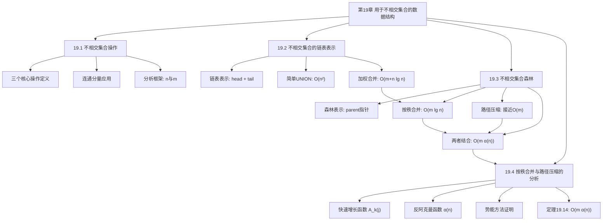

## 相关笔记

- 节笔记：[[19.1 不相交集合操作]]、[[19.2 不相交集合的链表表示]]、[[19.3 不相交集合森林]]、[[19.4 按秩合并与路径压缩的分析]]
- 前置章节：[[第18章_B树-章节汇总]]、[[第16章_摊还分析-章节汇总]]

> [!abstract] 概览
> 全章围绕**不相交集合数据结构**（并查集）展开，研究如何高效维护一组动态不相交集合的划分。核心操作为 MAKE-SET、UNION 和 FIND-SET。章节从问题定义出发（19.1），依次给出链表表示（19.2）和森林表示（19.3）两种实现，并在19.4节通过势能方法严格证明森林表示配合按秩合并与路径压缩可达到 $O(m \alpha(n))$ 的总运行时间，其中 $\alpha(n)$ 是反阿克曼函数，对所有实际输入规模不超过4。全章的优化历程——从 $O(n^2)$ 到 $O(m \alpha(n))$——是启发式设计与摊还分析协同作用的经典范例。

---

## 知识结构总览

---

## 核心概念回顾

### 三个基本操作

| 操作 | 语义 | 最佳复杂度 |
|:-----|:-----|:-----------|
| MAKE-SET($x$) | 创建单元素集合 $\{x\}$，$x$ 为代表 | $O(1)$ |
| FIND-SET($x$) | 返回包含 $x$ 的集合的代表 | $O(\alpha(n))$ |
| UNION($x$, $y$) | 合并包含 $x$ 和 $y$ 的两个集合 | $O(\alpha(n))$ |

> [!def] 分析参数
> - $n$：MAKE-SET 操作次数（元素总数）
> - $m$：所有操作的总次数（含 MAKE-SET、FIND-SET、UNION）
> - 由于 $m \geq n$，目标是使 $m$ 次操作的总时间尽可能接近 $O(m)$

### 四种组合的复杂度汇总

| 表示方法 | 启发式 | 总运行时间 | 说明 |
|:---------|:-------|:-----------|:-----|
| 链表 | 简单合并 | $O(n^2)$ | 每次 UNION 可能更新 $O(n)$ 个指针 |
| 链表 | 加权合并 | $O(m + n \lg n)$ | 每个元素 set 指针最多更新 $\lfloor \lg n \rfloor$ 次 |
| 森林 | 按秩合并 | $O(m \lg n)$ | 树高 $O(\lg n)$，FIND-SET 为 $O(\lg n)$ |
| 森林 | 按秩合并 + 路径压缩 | $O(m \alpha(n))$ | $\alpha(n) \leq 4$，实际等价于线性 |

### $\alpha(n)$ 数值表

| $n$ 的范围 | $\alpha(n)$ |
|:-----------|:-----------:|
| $n = 1$ | 0 |
| $n = 2$ | 1 |
| $3 \leq n \leq 7$ | 2 |
| $8 \leq n \leq 2047$ | 3 |
| $n \geq 2048$ | 4 |

> [!tip] α(n) 的实际意义
> **A\_4(1) 远超宇宙中可观测原子数**（约10的80次方），因此对所有实际可能的输入规模，α(n) 不超过4。并查集的每次操作在实际中可以安全地视为**常数时间** O(1)。

---

四节内容对比

| 维度 | 19.1 不相交集合操作 | 19.2 不相交集合的链表表示 | 19.3 不相交集合森林 | 19.4 按秩合并与路径压缩的分析 |
|:-----|:--------------------|:--------------------------|:--------------------|:-------------------------------|
| **核心主题** | 定义问题与三个基本操作 | 链表实现 + 加权合并启发式 | 森林实现 + 按秩合并 + 路径压缩 | $O(m \alpha(n))$ 的严格证明 |
| **关键概念** | 代表、等价关系、连通分量 | 加权合并、set 指针更新 | rank、路径压缩、LINK | $A_k(j)$、$\alpha(n)$、势能函数 |
| **关键定理** | — | 定理19.1：$O(m + n \lg n)$ | — | 定理19.14：$O(m \alpha(n))$ |
| **分析技术** | 渐近记号 | 聚合分析 | 渐近记号 | 势能方法（第16.3节） |
| **复杂度** | — | $O(m + n \lg n)$ | $O(m \alpha(n))$（声明） | $O(m \alpha(n))$（证明） |
| **难度** | ⭐⭐ | ⭐⭐⭐ | ⭐⭐⭐ | ⭐⭐⭐⭐⭐ |
| **设计思想** | 建立问题框架 | 贪心策略（选代价小的方向） | 两种启发式协同优化 | 精巧的势能函数设计 |
| **与第16章联系** | — | 聚合分析（16.1节） | — | 势能方法（16.3节） |

---

关键定理索引

| 定理/引理 | 结论 | 所在节笔记 |
|:----------|:-----|:-----------|
| 定理19.1 | 使用加权合并启发式的 $m$ 次操作可在 $O(m + n \lg n)$ 时间内完成 | [[19.2 不相交集合的链表表示]] |
| 秩上界引理 | 使用按秩合并的森林中，每个节点的秩最多为 $\lfloor \lg n \rfloor$ | [[19.4 按秩合并与路径压缩的分析]] |
| 引理19.4 | 按秩合并下，秩为 $r$ 的根至少有 $2^r$ 个后代 | [[19.4 按秩合并与路径压缩的分析]] |
| 定理19.14 | 使用按秩合并和路径压缩的 $m$ 次操作可在 $O(m \alpha(n))$ 时间内完成 | [[19.4 按秩合并与路径压缩的分析]] |

---

易混淆点汇总

### 按秩合并 vs 按大小合并

| 维度 | 按秩合并（union by rank） | 按大小合并（union by size） |
|:-----|:-------------------------|:---------------------------|
| 合并依据 | rank（高度上界） | 子树节点数 |
| 精确性 | rank 是高度的上界，不精确 | 大小精确 |
| 路径压缩后 | rank 仍有效（作为上界） | 大小仍精确 |
| 理论分析 | 更简洁（19.4节证明依赖 rank） | 分析略复杂 |
| 实际表现 | 略逊于按大小合并 | 可能略优 |

### 加权合并（链表）vs 按秩合并（森林）

> [!warning] 不同表示中的不同启发式
> 加权合并和按秩合并是**不同数据结构中的不同启发式**，不要混淆：
> - **加权合并**用于链表表示（19.2节），依据集合大小，将短链表追加到长链表
> - **按秩合并**用于森林表示（19.3节），依据 rank（高度上界），让小秩根指向大秩根
> - 两者思想类似（都是"小的服从大的"），但操作对象和具体规则不同

### $\alpha(n)$ vs $\log^* n$ vs $\lg n$ 增长速度

| 函数 | 定义 | $n = 10^{80}$ 时的值 | 增长速度 |
|:-----|:-----|:--------------------:|:---------|
| $\lg n$ | 以2为底的对数 | $\approx 266$ | 快 |
| $\log^* n$ | 迭代对数（反复取 $\lg$ 直到 $\leq 1$ 的次数） | 5 | 中 |
| $\alpha(n)$ | 反阿克曼函数 | 4 | 极慢 |

$$\alpha(n) \leq \log^* n \leq \lg n \quad \text{对所有 } n \geq 1$$

### UNION vs LINK

> [!warning] UNION 不等于 LINK
> - **UNION($x$, $y$)**：先执行两次 FIND-SET 找到 $x$ 和 $y$ 的根，再执行 LINK
> - **LINK($x$, $y$)**：假设 $x$ 和 $y$ 已经是根节点，直接让一个根指向另一个
> - UNION = FIND-SET + FIND-SET + LINK
> - 在19.4节的分析中，为了简化势能分析，假设操作序列已被转换为 MAKE-SET、LINK、FIND-SET 序列

### 不相交集合 vs 普通集合

| 维度 | 不相交集合数据结构（并查集） | 普通集合（如散列表、位向量） |
|:-----|:---------------------------|:---------------------------|
| 集合关系 | 集合之间**不相交**（划分） | 集合可以任意重叠 |
| 支持操作 | MAKE-SET、UNION、FIND-SET | INSERT、DELETE、MEMBER |
| 核心功能 | 动态合并与等价类查询 | 元素存储与检索 |
| 删除操作 | 不支持（标准接口） | 通常支持 |
| 遍历操作 | 链表表示支持，森林表示不支持 | 通常支持 |

---

补充理解（跨节综合视角）

### 并查集的演进脉络：从 $O(n^2)$ 到 $O(m \alpha(n))$

全章的优化历程可以概括为四个阶段，每一阶段解决上一阶段遗留的核心瓶颈：

**阶段一：朴素链表 + 简单合并（$O(n^2)$）**

链表表示天然支持 $O(1)$ 的 FIND-SET（两次指针解引用）和 $O(1)$ 的 MAKE-SET，但 UNION 需要遍历被合并链表的所有元素更新 set 指针。最坏情况下，$n-1$ 次 UNION 的总代价为 $O(n^2)$。瓶颈在于：**合并方向的选择是任意的，可能反复将大集合合并到小集合中**。

**阶段二：链表 + 加权合并（$O(m + n \lg n)$）**

19.2节引入加权合并启发式：总是将较短的链表追加到较长的链表。关键观察是每次元素被"搬家"（set 指针更新）时，所在集合大小至少翻倍。因此每个元素最多被更新 $\lfloor \lg n \rfloor$ 次，$n$ 个元素的总更新次数为 $O(n \lg n)$。瓶颈转移到：**链表表示的 UNION 本身需要 $O(\min(n_x, n_y))$ 时间遍历指针**，即使有加权合并也无法降到 $O(1)$。

**阶段三：森林 + 按秩合并（$O(m \lg n)$）**

19.3节换用有根树（parent 指针）表示。LINK 操作本身只需 $O(1)$（修改一个指针），UNION 的代价完全由两次 FIND-SET 决定。按秩合并保证树高为 $O(\lg n)$，因此 FIND-SET 为 $O(\lg n)$。瓶颈转移到：**树可能退化为链状，FIND-SET 的代价随树高线性增长**。

**阶段四：森林 + 按秩合并 + 路径压缩（$O(m \alpha(n))$）**

路径压缩在执行 FIND-SET 时，将路径上每个节点直接指向根。单独使用路径压缩无法保证 $O(\alpha(n))$ 的界（存在反例），但与按秩合并结合后，两种启发式产生协同效应：按秩合并控制树不会太高，路径压缩持续压平搜索路径，使得后续 FIND-SET 越来越快。19.4节通过势能方法严格证明总时间为 $O(m \alpha(n))$。

> [!tip] 优化历程的核心启示
> **表示的选择决定了优化的天花板**。链表表示无论怎样优化 UNION，都无法突破 $O(\min(n_x, n_y))$ 的指针更新代价；换用森林表示后，UNION 降为 $O(1)$，瓶颈才转移到 FIND-SET 上，路径压缩才有了用武之地。数据结构设计中，**选择正确的表示往往比在错误表示上叠加启发式更重要**。

### 工程选型指南

| 场景 | 推荐表示 | 理由 |
|:-----|:---------|:-----|
| 需要遍历集合内所有元素 | 链表表示（19.2节） | 沿链表即可遍历，森林表示无法高效遍历 |
| 只需要合并和查询（最常见） | 森林表示 + 按秩合并 + 路径压缩 | $O(m \alpha(n))$，实际接近 $O(m)$ |
| 元素数量极小（$n < 100$） | 任选，甚至朴素实现即可 | 常数因子和实现复杂度比渐近复杂度更重要 |
| 需要支持删除操作 | 均不直接支持，需扩展 | 标准并查集不支持删除；可考虑可撤销并查集（带栈回溯） |
| 并发环境 | 森林表示 + 细粒度锁 | 链表的指针更新粒度太大，不利于并发控制 |

### 实际应用场景汇总

**1. Kruskal 最小生成树算法（CLRS 第23章）**

按边权排序后，依次考察每条边，用并查集判断两个端点是否属于同一连通分量。$O(E)$ 次并查集操作，总代价 $O(E \alpha(V))$，不成为排序步骤 $O(E \lg E)$ 的瓶颈。这是并查集最经典的教科书应用。

**2. 图像连通域标记（OpenCV `cv::connectedComponents`）**

在二值图像中，将相邻的前景像素归为同一连通区域。两遍扫描算法中，第一遍用并查集临时标记等价标签，第二遍根据并查集结果统一编号。并查集的近线性性能保证了图像处理的高效性。

**3. 渗透问题（Percolation，Sedgewick & Wayne, Princeton）**

在 $n \times n$ 网格中，随机打开格子，判断顶部与底部是否连通。使用并查集维护已打开格子的连通性，每次打开操作后执行 UNION，查询顶部虚拟节点与底部虚拟节点是否在同一集合。蒙特卡洛模拟需要大量重复实验，并查集的 $O(\alpha(n))$ 单次操作至关重要。

**4. 社交网络好友圈**

将每个人视为一个元素，好友关系触发 UNION 操作，查询两个人是否在同一好友圈用 FIND-SET。动态添加好友关系时，并查集可以高效维护连通分量。

**5. 竞赛编程**

- **LeetCode 200 岛屿数量**：遍历网格，将相邻的 '1' 所在位置 UNION，统计连通分量数
- **LeetCode 684 冗余连接**：按顺序添加边，若 UNION 发现两端已在同一集合，则该边为冗余边
- **LeetCode 1319 连通网络的操作次数**：统计连通分量数，答案为分量数减一

### 与第16章摊还分析的深层联系

> [!info] 并查集分析是摊还分析的经典应用场
> 并查集的效率分析深度依赖[[第16章_摊还分析-章节汇总]]技术：
>
> - **19.2节**（链表+加权合并）使用**聚合分析**：将所有操作的代价汇总，除以操作次数得到摊还代价。核心论证"每个元素最多被更新 $\lfloor \lg n \rfloor$ 次"正是聚合分析的典型思路——不关注单次操作的代价波动，而是证明总代价有界。
> - **19.4节**（森林+按秩合并+路径压缩）使用**势能方法**：设计精巧的势能函数 $\phi_q(x)$，基于 $level(x)$ 和 $iter(x)$ 两个辅助函数，证明势能变化吸收了实际代价的超额部分。
>
> 并查集之所以需要摊还分析，是因为单个 FIND-SET 或 UNION 的最坏代价可能很高（$O(\lg n)$ 甚至 $O(n)$），但通过摊还分析可以证明操作序列的平均代价远低于最坏代价。**19.4节的势能函数设计被认为是算法分析中最精妙的构造之一**，它利用快速增长函数 $A_k(j)$ 的逆函数 $\alpha(n)$ 来"分级"节点的势能，使得每一级的摊还代价都有界。

---

习题索引

### 19.1 不相交集合操作

| 题号 | 核心考点 | 难度 |
|:-----|:---------|:-----:|
| 19.1-1 | CONNECTED-COMPONENTS 在给定图上的执行过程 | ⭐ |
| 19.1-2 | 证明处理后两顶点在同一集合 iff 在同一连通分量 | ⭐⭐ |
| 19.1-3 | FIND-SET 和 UNION 的调用次数分析 | ⭐⭐ |

### 19.2 不相交集合的链表表示

| 题号 | 核心考点 | 难度 |
|:-----|:---------|:-----:|
| 19.2-1 | 使用加权合并的 MAKE-SET/FIND-SET/UNION 伪代码 | ⭐ |
| 19.2-2 | 16个元素的加权合并执行过程 | ⭐⭐ |
| 19.2-3 | 用聚合分析证明 $O(1)$/$O(1)$/$O(\lg n)$ 摊还时间 | ⭐⭐ |
| 19.2-4 | 操作序列的渐近运行时间 | ⭐⭐ |
| 19.2-5 | 只用一个指针的集合表示方案 | ⭐⭐⭐ |
| 19.2-6 | 去掉 tail 指针的拼接方案 | ⭐⭐⭐ |

### 19.3 不相交集合森林

| 题号 | 核心考点 | 难度 |
|:-----|:---------|:-----:|
| 19.3-1 | 森林+按秩合并+路径压缩的执行过程 | ⭐ |
| 19.3-2 | FIND-SET 的非递归实现 | ⭐⭐ |
| 19.3-3 | 仅按秩合并的 $\Omega(m \lg n)$ 下界构造 | ⭐⭐⭐ |
| 19.3-4 | 添加 PRINT-SET 操作 | ⭐⭐ |
| 19.3-5 | LINK 全在 FIND-SET 之前的 $O(m)$ 证明 | ⭐⭐⭐ |

### 19.4 按秩合并与路径压缩的分析

| 题号 | 核心考点 | 难度 |
|:-----|:---------|:-----:|
| 19.4-1 | 证明引理19.4（秩的性质） | ⭐⭐ |
| 19.4-2 | 证明 rank $\leq \lfloor \lg n \rfloor$ | ⭐⭐ |
| 19.4-3 | 存储 rank 需要的位数 | ⭐ |
| 19.4-4 | 仅按秩合并的 $O(m \lg n)$ 证明 | ⭐⭐ |
| 19.4-5 | level 是否沿路径单调递增 | ⭐⭐⭐ |
| 19.4-7 | $\alpha'(n)$ 的改进上界 | ⭐⭐⭐ |

**全章习题统计：** 3 + 6 + 5 + 6 = **20道题**

---

## 参见Wiki

- [[算法导论/concepts/不相交集合数据结构]] — 不相交集合数据结构的定义与操作
- [[算法导论/concepts/加权合并启发式]] — 链表表示中的合并优化
- [[算法导论/concepts/不相交集合森林]] — 基于有根树的高效表示
- [[算法导论/concepts/按秩合并]] — 森林表示中的合并优化
- [[算法导论/concepts/路径压缩]] — FIND-SET 的路径优化
- [[算法导论/concepts/反阿克曼函数]] — 复杂度分析中的关键函数

#学习/算法导论/第19章-用于不相交集合的数据结构 #学习/算法导论/不相交集合/章节汇总
