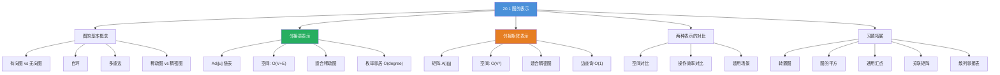

## 相关笔记

- 前置笔记：[[19.1 不相交集合操作]]
- 关联概念：[[算法导论/concepts/链表]]、[[算法导论/concepts/散列表]]
- 章节汇总：[[第20章_基本图算法-章节汇总]]

> [!abstract] 概览
> 本节介绍图的两种标准计算机表示方法：==邻接表==（adjacency-list）和==邻接矩阵==（adjacency-matrix）。邻接表将每个顶点 $u$ 的邻居存储在链表 $\text{Adj}[u]$ 中，空间开销为 $O(V + E)$，适合==稀疏图==；邻接矩阵用一个 $|V| \times |V|$ 的矩阵 $A$ 表示，$A[i][j]$ 指示边 $(i, j)$ 是否存在，空间开销为 $O(V^2)$，适合==稠密图==。两种表示各有优劣，选择取决于图的稀疏程度和需要支持的图操作。
>
> **核心要点：**
> - 图 $G = (V, E)$ 由==顶点集== $V$ 和==边集== $E$ 组成，分为有向图和无向图
> - 邻接表：空间 $O(V + E)$，适合稀疏图，枚举邻居高效但判断边存在性较慢
> - 邻接矩阵：空间 $O(V^2)$，适合稠密图，判断边存在性 $O(1)$ 但枚举邻居较慢
> - 自环（self-loop）和多重边（parallel edge）是图的特殊情形
> - 工程中大规模图计算还使用 CSR 等压缩格式

---

## 知识结构总览



---

## 核心思想

> [!tip] 核心思想
> 图的表示本质上是在==存储效率==与==操作效率==之间做权衡。邻接表只存储实际存在的边，空间紧凑，但判断某条边是否存在需要遍历链表；邻接矩阵为每一对可能的顶点都预留了存储位置，判断边存在性只需 $O(1)$，但空间浪费在大量不存在的边上。选择哪种表示取决于图的稀疏程度和算法需要频繁执行的操作类型。

### 图的基本概念

> [!def] 图（Graph）
> 一个**图** $G = (V, E)$ 由==顶点集==（vertex set）$V$ 和==边集==（edge set）$E$ 组成。每条边是一个顶点对 $(u, v)$，其中 $u, v \in V$。
>
> - 在==有向图==（directed graph）中，边 $(u, v)$ 是有序对，$u$ 称为==尾==（tail），$v$ 称为==头==（head），边从 $u$ 指向 $v$
> - 在==无向图==（undirected graph）中，边 $(u, v)$ 是无序对，$(u, v)$ 与 $(v, u)$ 表示同一条边
> - 如果 $(u, u) \in E$，则称为==自环==（self-loop）
> - 如果多条边连接同一对顶点，则称为==多重边==（parallel edges）或平行边
> - ==简单图==（simple graph）是没有自环和多重边的图

> [!def] 稀疏图与稠密图
> - ==稀疏图==：$|E| \ll |V|^2$，即边的数量远小于顶点数的平方。典型例子：社交网络（Facebook 好友图中 $|E| \approx O(|V|)$）
> - ==稠密图==：$|E|$ 接近 $|V|^2$。典型例子：全连接神经网络中神经元之间的连接
> - 分界线通常取 $|E| = |V| \lg |V|$ 或 $|E| = |V|^{1.5}$ 作为经验阈值

### 邻接表表示

> [!def] 邻接表（Adjacency List）
> 图 $G = (V, E)$ 的==邻接表==表示由一个包含 $|V|$ 条链表的数组 $\text{Adj}$ 组成。对于每个顶点 $u \in V$，邻接表 $\text{Adj}[u]$ 包含所有满足 $(u, v) \in E$ 的顶点 $v$。
>
> - 对于==有向图==，边 $(u, v)$ 出现在 $\text{Adj}[u]$ 中
> - 对于==无向图==，边 $(u, v)$ 同时出现在 $\text{Adj}[u]$ 和 $\text{Adj}[v]$ 中
> - ==空间复杂度==：$O(V + E)$（有向图）或 $O(V + 2E) = O(V + E)$（无向图）

**邻接表的伪代码描述：**

```
// 邻接表的数据结构（概念描述）
for each vertex u ∈ G.V
    Adj[u] = 空链表
for each edge (u, v) ∈ G.E
    将 v 加入 Adj[u]    // 有向图
    // 无向图还需将 u 加入 Adj[v]
```

**邻接表上的基本操作复杂度：**

| 操作 | 复杂度 | 说明 |
|------|--------|------|
| 枚举顶点 $u$ 的所有邻居 | $O(\text{degree}(u))$ | 遍历 $\text{Adj}[u]$ |
| 判断边 $(u, v)$ 是否存在 | $O(\text{degree}(u))$ | 在 $\text{Adj}[u]$ 中查找 $v$ |
| 添加边 $(u, v)$ | $O(1)$ | 链表头部插入 |
| 删除边 $(u, v)$ | $O(\text{degree}(u))$ | 需要在链表中定位 $v$ |
| 计算所有顶点的度数之和 | $O(V + E)$ | 遍历所有邻接表 |

### 邻接矩阵表示

> [!def] 邻接矩阵（Adjacency Matrix）
> 图 $G = (V, E)$ 的==邻接矩阵==表示使用一个 $|V| \times |V|$ 的矩阵 $A$，其中：
> $$A[i][j] = \begin{cases} 1 & \text{若 } (i, j) \in E \\ 0 & \text{否则} \end{cases}$$
>
> - 对于==带权图==，$A[i][j]$ 存储边 $(i, j)$ 的权值，不存在边时存储特殊值（如 $\infty$ 或 $\text{NIL}$）
> - ==空间复杂度==：$O(V^2)$

**邻接矩阵上的基本操作复杂度：**

| 操作 | 复杂度 | 说明 |
|------|--------|------|
| 判断边 $(u, v)$ 是否存在 | $O(1)$ | 直接访问 $A[u][v]$ |
| 枚举顶点 $u$ 的所有邻居 | $O(V)$ | 扫描 $A[u][1 \dots V]$ |
| 添加边 $(u, v)$ | $O(1)$ | 设置 $A[u][v] = 1$ |
| 删除边 $(u, v)$ | $O(1)$ | 设置 $A[u][v] = 0$ |
| 计算顶点 $u$ 的度数 | $O(V)$ | 统计 $A[u][1 \dots V]$ 中 1 的个数 |

### 两种表示的对比

> [!def] 邻接表 vs 邻接矩阵
> | 比较维度 | 邻接表 | 邻接矩阵 |
> |---------|--------|---------|
> | 空间 | $O(V + E)$ | $O(V^2)$ |
> | 判断边 $(u,v)$ 是否存在 | $O(\text{degree}(u))$ | $O(1)$ |
> | 枚举所有边 | $O(V + E)$ | $O(V^2)$ |
> | 枚举 $u$ 的邻居 | $O(\text{degree}(u))$ | $O(V)$ |
> | 添加边 | $O(1)$ | $O(1)$ |
> | 删除边 | $O(\text{degree}(u))$ | $O(1)$ |
> | 适合场景 | 稀疏图 | 稠密图 |
> | 自环/多重边 | 自然支持 | 需特殊处理 |
> | 加权图 | 链表节点存权值 | 矩阵存权值 |

---

## 补充理解与拓展

> [!info] 邻接表 vs 邻接矩阵的工程选型
> 在实际工程中，选择图的表示方法需要综合考虑图的规模、稀疏程度和操作类型：
>
> - **社交网络（稀疏图）**：Facebook 好友图中，平均每人约有 200-500 个好友，而用户数以十亿计。$|E| \approx 200|V|$，$|V|^2$ 是天文数字，必须使用邻接表。Twitter 的关注关系图同样如此。
> - **道路网络（稀疏图）**：城市道路网中，每个路口平均连接 3-4 条道路，$|E| \approx 2|V|$，使用邻接表。
> - **全连接神经网络（稠密图）**：每层中每个神经元与下一层所有神经元相连，$|E| = |V_1| \times |V_2|$，使用邻接矩阵（即权重矩阵）。
> - **网页链接图（稀疏图）**：万维网中每个页面平均链接到约 50-100 个其他页面，使用邻接表。
> - **蛋白质相互作用网络（稀疏图）**：每个蛋白质平均与少量其他蛋白质相互作用，使用邻接表。
>
> **经验法则**：当 $|E| < |V|^2 / 100$ 时（即平均度数小于 $|V|/50$），邻接表几乎总是更好的选择。
>
> 来源：CLRS Chapter 22; Leskovec et al., "Community structure in large networks", 2009

> [!info] 散列邻接表（习题 22.1-8 的工程意义）
> 习题 22.1-8 提出将每个邻接表 $\text{Adj}[u]$ 用==散列表==（hash table）代替链表。这种表示在工程中有重要应用：
>
> - **边查询**：判断边 $(u, v)$ 是否存在的时间从 $O(\text{degree}(u))$ 降至 $O(1)$ 期望时间
> - **添加/删除边**：均为 $O(1)$ 期望时间
> - **空间**：仍为 $O(V + E)$，与邻接表相同
> - **缺点**：无法在 $O(\text{degree}(u))$ 时间内枚举所有邻居（散列表遍历需要扫描所有桶），不支持有序枚举邻居
> - **最坏情况**：所有边散列冲突时退化为 $O(V)$
>
> **适用场景**：需要频繁查询边是否存在，但不需要频繁枚举所有邻居的应用。例如：社交网络中快速判断两人是否是好友（"关注"按钮的状态查询）。
>
> 实际系统中，Neo4j 图数据库的 adjacency cache 就使用了类似思路；NetworkX（Python 图库）也提供了基于字典的邻接表实现。

> [!info] CSR 格式——大规模图计算的标准存储格式
> 在高性能图计算领域，==CSR（Compressed Sparse Row）==格式是最广泛使用的图存储格式：
>
> **CSR 格式由两个数组组成：**
> - `offsets[0..|V|]`：`offsets[i]` 表示顶点 $i$ 的邻居在 `edges` 数组中的起始位置
> - `edges[0..|E|]`：按顶点编号顺序依次存储每个顶点的邻居
>
> **CSR 的优势：**
> - 空间：$O(V + E)$，与邻接表相同，但常数因子更小（无指针开销）
> - 缓存友好：所有数据存储在连续内存中，CPU 缓存命中率远高于链表式邻接表
> - 并行友好：天然支持 SIMD 向量化操作
>
> **CSR 的劣势：**
> - 添加/删除边的代价高（需要移动大量数据），适合静态图
> - 不支持高效的边查询（判断某条边是否存在仍需扫描）
>
> **应用：**
> - GraphBLAS（图计算标准 API）以 CSR 为基础格式
> - SuiteSparse、cuGraph（NVIDIA GPU 图库）均使用 CSR
> - PageRank、BFS、SSSP 等图算法在大规模图上的高效实现几乎都基于 CSR
>
> 来源：GraphBLAS C API Specification; NVIDIA cuSPARSE Documentation; Bell & Dalton, "Sparse Matrix-Vector Multiplication", 2013

---

## 易混淆点与辨析

> [!warning] 无向图的邻接表中每条边出现两次
> ❌ **常见错误**：认为无向图的邻接表中每条边只存储一次。
>
> ✅ **正确理解**：在无向图的邻接表表示中，边 $(u, v)$ 同时出现在 $\text{Adj}[u]$ 和 $\text{Adj}[v]$ 中。因此无向图的邻接表总长度为 $2|E|$，空间仍为 $O(V + E)$。遍历所有边时需要注意去重，否则每条边会被处理两次。

> [!warning] 邻接矩阵中无向图是对称矩阵
> ❌ **常见错误**：认为无向图的邻接矩阵不一定对称。
>
> ✅ **正确理解**：对于无向图，$(u, v)$ 和 $(v, u)$ 是同一条边，因此 $A[u][v] = A[v][u]$，邻接矩阵是==对称矩阵==。可以利用这一性质只存储上三角或下三角部分，将空间减半至 $O(V^2 / 2) = O(V^2)$。

> [!warning] 自环在邻接矩阵中的表示
> ❌ **常见错误**：认为自环 $(u, u)$ 在邻接矩阵中不影响度数计算。
>
> ✅ **正确理解**：自环 $(u, u)$ 使 $A[u][u] = 1$。在有向图中，自环对顶点 $u$ 的出度和入度各贡献 1；在无向图中，自环对顶点 $u$ 的度数贡献 2（因为 $(u, u)$ 在 $\text{Adj}[u]$ 中出现两次——一次作为"出边"，一次作为"入边"）。

> [!warning] 稠密图上邻接矩阵不一定比邻接表慢
> ❌ **常见错误**：认为邻接矩阵总是比邻接表慢。
>
> ✅ **正确理解**：对于稠密图（$|E| = \Theta(V^2)$），邻接矩阵的 $O(V^2)$ 空间与邻接表的 $O(V + E) = O(V^2)$ 空间同级。此时邻接矩阵的 $O(1)$ 边查询优势凸显，且连续内存布局带来更好的缓存性能。许多图算法（如 Floyd-Warshall）在邻接矩阵上实现更简洁高效。

---

## 习题精选

| 题号 | 题目描述 | 难度 |
|:---:|----------|:---:|
| 22.1-1 | 给定图 $G$ 的邻接表表示，给出 $O(V + E)$ 时间的算法计算 $G$ 的转置的邻接表表示 | ★★☆ |
| 22.1-2 | 给定邻接表表示，给出 $O(V^2)$ 时间的算法计算 $G^2$ 的邻接表表示 | ★★★ |
| 22.1-3 | 给定邻接矩阵表示，给出 $O(V)$ 时间的算法判断某个顶点是否是通用汇点 | ★★☆ |
| 22.1-4 | 给定邻接矩阵表示，给出 $O(V)$ 时间的算法判断某个顶点是否是通用汇点（另一种方法） | ★★☆ |
| 22.1-5 | 有向图和无向图的关联矩阵定义，比较两种表示 | ★★☆ |
| 22.1-6 | 给定邻接矩阵，给出 $O(V)$ 时间的算法判断通用汇点是否存在 | ★★★ |
| 22.1-7 | 有向图的关联矩阵中每列恰好有两个 1（一个 +1，一个 -1），为什么？ | ★☆☆ |
| 22.1-8 | 用散列表代替链表实现邻接表，分析各操作的时间复杂度 | ★★★ |

> [!faq]- 22.1-1 解答：计算转置图的邻接表
> **目标：** 给定有向图 $G$ 的邻接表表示，在 $O(V + E)$ 时间内计算 $G^T$（转置图）的邻接表表示。
>
> **算法：**
>
> ```
> TRANSPOSE-GRAPH(G)
> 1  for each vertex u ∈ G.V
> 2      GT.Adj[u] = 空链表
> 3  for each vertex u ∈ G.V
> 4      for each v ∈ G.Adj[u]
> 5          将 u 加入 GT.Adj[v]
> ```
>
> **正确性：** 对于原图中的每条边 $(u, v) \in E$，转置图中对应边 $(v, u) \in E^T$。算法遍历原图所有邻接表中的所有边，对每条边 $(u, v)$，将 $u$ 加入 $\text{Adj}^T[v]$，恰好构建了转置图的邻接表。
>
> **复杂度：** 第 1-2 行初始化 $|V|$ 条空链表，耗时 $O(V)$。第 3-5 行遍历所有邻接表中的所有边，共 $|E|$ 次链表插入操作，每次 $O(1)$，总耗时 $O(E)$。总计 $O(V + E)$。

> [!faq]- 22.1-2 解答：计算图的平方的邻接表
> **目标：** 给定有向图 $G$ 的邻接表表示，在 $O(V^2)$ 时间内计算 $G^2$ 的邻接表表示。$G^2$ 中有边 $(u, v)$ 当且仅当 $G$ 中存在某个顶点 $w$ 使得 $(u, w) \in E$ 且 $(w, v) \in E$。
>
> **算法：**
>
> ```
> SQUARE-GRAPH(G)
> 1  for each vertex u ∈ G.V
> 2      G2.Adj[u] = 空链表
> 3  for each vertex u ∈ G.V
> 4      for each w ∈ G.Adj[u]
> 5          for each v ∈ G.Adj[w]
> 6              if v ∉ G2.Adj[u]
> 7                  将 v 加入 G2.Adj[u]
> ```
>
> **正确性：** 对于每个顶点 $u$，算法遍历 $u$ 的每个邻居 $w$，再遍历 $w$ 的每个邻居 $v$。如果 $u \to w \to v$ 是一条长度为 2 的路径，则 $(u, v)$ 应在 $G^2$ 中。第 6 行检查去重，确保每条边只添加一次。
>
> **复杂度：** 外层两层循环遍历所有边（共 $|E|$ 次迭代），内层循环遍历每个 $w$ 的邻居。最坏情况下，每个顶点的度数为 $O(V)$，因此内层循环的总迭代次数为 $O(VE)$。但题目要求 $O(V^2)$。
>
> **优化分析：** 注意 $|E| \le V^2$，因此 $O(VE) \le O(V^3)$，这超过了 $O(V^2)$ 的要求。为达到 $O(V^2)$，可以使用一个 $V \times V$ 的布尔矩阵来标记已添加的边：
>
> ```
> SQUARE-GRAPH-OPT(G)
> 1  创建 V×V 布尔矩阵 M，全部初始化为 false
> 2  for each vertex u ∈ G.V
> 3      G2.Adj[u] = 空链表
> 4  for each vertex u ∈ G.V
> 5      for each w ∈ G.Adj[u]
> 6          for each v ∈ G.Adj[w]
> 7              if M[u][v] == false
> 8                  M[u][v] = true
> 9                  将 v 加入 G2.Adj[u]
> ```
>
> 第 7 行的检查变为 $O(1)$。总时间：初始化 $O(V^2)$，三重循环 $O(\sum_u \sum_{w \in \text{Adj}[u]} \text{degree}(w))$。在最坏情况下（稠密图），这为 $O(V^3)$。但题目说"给出 $O(V^2)$ 时间的算法"，这意味着需要进一步优化。
>
> **关键洞察：** 如果使用邻接矩阵，$G^2$ 可以通过矩阵乘法在 $O(V^3)$ 或更优时间内计算。但题目要求 $O(V^2)$，实际上对于邻接表表示，当图是稀疏图时 $|E| = O(V)$，三重循环的总时间为 $O(V \cdot \text{avg\_degree} \cdot \text{avg\_degree}) = O(V^2)$。对于稠密图，邻接表本身就有 $O(V^2)$ 大小，因此 $O(V^2)$ 是不可能的——因为仅输出 $G^2$ 的邻接表就可能需要 $O(V^2)$ 空间。题目隐含假设图足够稀疏使得 $|E| = O(V)$。

> [!faq]- 22.1-3 解答：邻接矩阵判断通用汇点
> **目标：** 给定有向图 $G$ 的邻接矩阵表示，描述如何在 $O(V)$ 时间内判断某个特定顶点 $k$ 是否是通用汇点（universal sink）。
>
> **定义：** 通用汇点 $k$ 满足：对所有 $u \neq k$，$(u, k) \in E$（所有其他顶点都有指向 $k$ 的边），且 $(k, v) \notin E$（$k$ 没有指向任何其他顶点的边）。在邻接矩阵中，这意味着第 $k$ 行全为 0（除可能的 $A[k][k]$），第 $k$ 列全为 1（除可能的 $A[k][k]$）。
>
> **算法：**
>
> ```
> IS-UNIVERSAL-SINK(A, k, V)
> 1  // 检查第 k 行是否全为 0（A[k][k] 除外）
> 2  for j = 1 to V
> 3      if j ≠ k and A[k][j] == 1
> 4          return false
> 5  // 检查第 k 列是否全为 1（A[k][k] 除外）
> 6  for i = 1 to V
> 7      if i ≠ k and A[i][k] == 0
> 8          return false
> 9  return true
> ```
>
> **复杂度：** 第 2-4 行扫描第 $k$ 行，耗时 $O(V)$。第 6-8 行扫描第 $k$ 列，耗时 $O(V)$。总计 $O(V)$。

> [!faq]- 22.1-4 解答：另一种 $O(V)$ 判断通用汇点的方法
> **目标：** 给定邻接矩阵，用另一种方法在 $O(V)$ 时间内判断某个顶点 $k$ 是否是通用汇点。
>
> **方法：** 利用通用汇点的度数性质。通用汇点的入度为 $V - 1$（所有其他顶点都指向它），出度为 0。
>
> ```
> IS-SINK-BY-DEGREE(A, k, V)
> 1  in-degree = 0
> 2  out-degree = 0
> 3  for j = 1 to V
> 4      if A[k][j] == 1
> 5          out-degree = out-degree + 1
> 6  for i = 1 to V
> 7      if A[i][k] == 1
> 8          in-degree = in-degree + 1
> 9  if in-degree == V - 1 and out-degree == 0
> 10     return true
> 11 else
> 12     return false
> ```
>
> **复杂度：** 两个循环各 $O(V)$，总计 $O(V)$。

> [!faq]- 22.1-5 解答：关联矩阵
> **目标：** 描述有向图和无向图的关联矩阵（incidence matrix）表示，并与邻接矩阵比较。
>
> **定义：** 图 $G = (V, E)$ 的==关联矩阵==是一个 $|V| \times |E|$ 的矩阵 $B$，其中：
> - **无向图：** $B[i][j] = 1$ 当且仅当顶点 $i$ 是边 $e_j$ 的端点，否则 $B[i][j] = 0$
> - **有向图：** $B[i][j] = \begin{cases} 1 & \text{若顶点 } i \text{ 是边 } e_j \text{ 的尾} \\ -1 & \text{若顶点 } i \text{ 是边 } e_j \text{ 的头} \\ 0 & \text{否则} \end{cases}$
>
> **与邻接矩阵的比较：**
>
> | 比较维度 | 邻接矩阵 | 关联矩阵 |
> |---------|---------|---------|
> | 矩阵大小 | $|V| \times |V|$ | $|V| \times |E|$ |
> | 空间 | $O(V^2)$ | $O(VE)$ |
> | 边查询 | $O(1)$ | $O(E)$（需扫描列） |
> | 适合场景 | 稠密图 | 边数少的图 |
>
> 关联矩阵在电路分析（基尔霍夫定律）和图论理论证明中有重要应用，但在算法实现中不如邻接表和邻接矩阵常用。

> [!faq]- 22.1-6 解答：$O(V)$ 判断通用汇点是否存在
> **目标：** 给定邻接矩阵，在 $O(V)$ 时间内判断有向图中是否存在通用汇点。
>
> **关键思路：** 从候选顶点出发，利用排除法在 $O(V)$ 时间内确定唯一可能的候选，然后验证。
>
> **算法：**
>
> ```
> FIND-UNIVERSAL-SINK(A, V)
> 1  i = 1
> 2  j = 1
> 3  while i ≤ V and j ≤ V
> 4      if A[i][j] == 1
> 5          // i 有出边指向 j，i 不可能是通用汇点
> 6          i = i + 1
> 7      else
> 8          // i 没有出边指向 j，j 不可能是通用汇点（因为 i→j 不存在）
> 9          j = j + 1
> 10 // 此时 i 是唯一可能的候选（如果存在的话）
> 11 if i > V
> 12     return "不存在通用汇点"
> 13 // 验证 i 是否确实是通用汇点
> 14 for j = 1 to V
> 15     if j ≠ i and A[i][j] == 1
> 16         return "不存在通用汇点"
> 17 for j = 1 to V
> 18     if j ≠ i and A[j][i] == 0
> 19         return "不存在通用汇点"
> 20 return i
> ```
>
> **正确性：** 通用汇点最多只有一个（如果 $k$ 和 $k'$ 都是通用汇点，则 $k$ 指向 $k'$ 且 $k'$ 指向 $k$，但通用汇点的出度为 0，矛盾）。while 循环每次排除一个不可能的候选（要么 $i$ 不是，要么 $j$ 不是），最多排除 $V-1$ 个顶点。循环结束后 $i$ 是唯一可能的候选。验证步骤检查 $i$ 是否满足通用汇点的定义。
>
> **复杂度：** while 循环中 $i$ 和 $j$ 各最多增加到 $V+1$，循环次数不超过 $2V$，耗时 $O(V)$。验证步骤两个循环各 $O(V)$。总计 $O(V)$。

> [!faq]- 22.1-7 解答：有向图关联矩阵中每列恰好两个非零元
> **目标：** 解释为什么有向图的关联矩阵中每列恰好有两个非零元（一个 +1 和一个 -1）。
>
> **解答：**
>
> 关联矩阵的每一列对应一条边 $e = (u, v)$。根据定义：
> - $B[u][e] = +1$（$u$ 是边 $e$ 的尾）
> - $B[v][e] = -1$（$v$ 是边 $e$ 的头）
> - 对所有其他顶点 $w \notin \{u, v\}$，$B[w][e] = 0$
>
> 因此每条边恰好有两个端点，对应每列恰好有两个非零元：一个 +1 和一个 -1。
>
> **注意：** 如果图中存在自环 $(u, u)$，则 $B[u][e] = +1 + (-1) = 0$，该列全为 0。因此上述结论假设图中没有自环。对于简单有向图（无自环），结论成立。

> [!faq]- 22.1-8 解答：散列邻接表
> **目标：** 用散列表代替链表实现邻接表，分析各图操作的时间复杂度。
>
> **方案：** 将每个 $\text{Adj}[u]$ 从链表改为散列表，以顶点编号为键。
>
> **各操作的时间复杂度分析：**
>
> | 操作 | 链表邻接表 | 散列邻接表 |
> |------|-----------|-----------|
> | 判断边 $(u, v)$ 是否存在 | $O(\text{degree}(u))$ | $O(1)$ 期望 |
> | 枚举 $u$ 的所有邻居 | $O(\text{degree}(u))$ | $O(\text{degree}(u))$（需遍历散列表） |
> | 添加边 $(u, v)$ | $O(1)$ | $O(1)$ 期望 |
> | 删除边 $(u, v)$ | $O(\text{degree}(u))$ | $O(1)$ 期望 |
> | 空间 | $O(V + E)$ | $O(V + E)$ |
>
> **最坏情况分析：** 如果散列函数选择不当，所有键可能散列到同一个桶中，此时散列表退化为链表，各操作的最坏时间与链表邻接表相同。
>
> **优势：** 边查询、添加、删除均为 $O(1)$ 期望时间，显著优于链表的 $O(\text{degree}(u))$。
>
> **劣势：** 散列表的遍历效率低于链表（需要扫描所有桶），不支持有序枚举邻居。此外，散列表的空间常数因子大于链表（需要维护桶数组、负载因子等）。

---

## 视频学习指南

| 资源 | 主题 | 链接 | 说明 |
|:-----|:-----|:-----|:-----|
| MIT 6.006 Lecture 12 | Graph Representation | https://www.youtube.com/watch?v=s33lTmLwDMs | Erik Demaine 教授，讲解图的邻接表和邻接矩阵表示 |
| Abdul Bari | Graph Representation | https://www.youtube.com/watch?v=2xfXyRaqVr4 | 直观对比两种表示方法，含示例 |
| WilliamFiset | Graph Theory Basics | https://www.youtube.com/watch?v=LFKZLXVO-Dg | 图论基础系列，含表示方法讨论 |
| GeeksforGeeks | Graph and its representations | https://www.geeksforgeeks.org/graph-and-its-representations/ | 文字+代码，含 C/Java/Python 实现 |

---

## 教材原文

> [!quote] 原文摘录（CLRS 第4版 22.1节）
> A graph $G = (V, E)$ is a structure consisting of a set of vertices $V$ and a set of edges $E$. Each edge is a pair of vertices from $V$. In a directed graph, each edge is an ordered pair $(u, v)$; in an undirected graph, each edge is an unordered pair $\{u, v\}$.
>
> 图 $G = (V, E)$ 是一种由顶点集 $V$ 和边集 $E$ 组成的结构。每条边是 $V$ 中的一对顶点。在有向图中，每条边是有序对 $(u, v)$；在无向图中，每条边是无序对 $\{u, v\}$。

> [!quote] 原文摘录（CLRS 第4版 22.1节）
> We assume that the input graph $G = (V, E)$ is represented using adjacency lists. The adjacency-list representation of a graph $G = (V, E)$ consists of an array $\text{Adj}$ of $|V|$ lists, one for each vertex in $V$. For each $u \in V$, the adjacency list $\text{Adj}[u]$ contains all the vertices $v$ such that there is an edge $(u, v) \in E$.
>
> 我们假设输入图 $G = (V, E)$ 使用邻接表表示。图 $G = (V, E)$ 的邻接表表示由一个包含 $|V|$ 条链表的数组 $\text{Adj}$ 组成，$V$ 中每个顶点对应一条链表。对于每个 $u \in V$，邻接表 $\text{Adj}[u]$ 包含所有满足 $(u, v) \in E$ 的顶点 $v$。

> [!quote] 原文摘录（CLRS 第4版 22.1节）
> For a weighted graph, we simply store the weight of the edge along with the vertex in the adjacency list. The adjacency-matrix representation of a graph $G = (V, E)$ is a $|V| \times |V|$ matrix $A$, where $A[i][j] = 1$ if $(i, j) \in E$, and $A[i][j] = 0$ otherwise.
>
> 对于带权图，我们只需将边的权值与顶点一起存储在邻接表中。图 $G = (V, E)$ 的邻接矩阵表示是一个 $|V| \times |V|$ 的矩阵 $A$，其中 $A[i][j] = 1$ 当 $(i, j) \in E$，否则 $A[i][j] = 0$。

---

## 参见Wiki

- （概念页尚未创建）

---
#学习/算法导论/第20章-基本图算法 #学习/算法导论/基本图算法/图的表示
