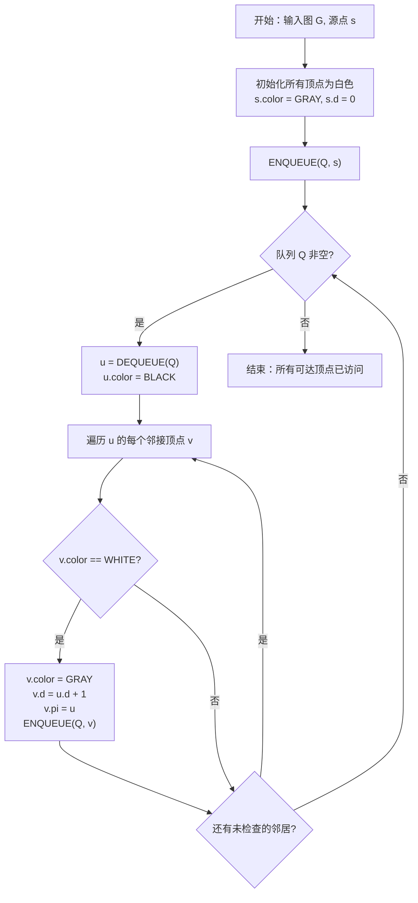

## 相关笔记

- 前置笔记：[[20.1 图的表示]]、[[19.1 不相交集合操作]]
- 关联概念：[[算法导论/concepts/队列]]、[[算法导论/concepts/链表]]
- 章节汇总：[[第20章_基本图算法-章节汇总]]

> [!abstract] 概览
> 本节介绍 ==广度优先搜索==（Breadth-First Search, BFS）算法，它是图算法中最基础、最重要的搜索策略之一。BFS 从源顶点 $s$ 出发，==逐层向外扩展==，先访问距 $s$ 为 1 的所有顶点，再访问距 $s$ 为 2 的所有顶点，依此类推。BFS 使用==队列==（FIFO）作为辅助数据结构，通过==颜色标记==（WHITE/GRAY/BLACK）、==距离== $d$ 和==前驱== $\pi$ 三个属性系统地探索图。BFS 的核心性质是：它能找到从源顶点到所有可达顶点的==最短路径==（在无权图中以边数计）。BFS 的运行时间为 $O(V + E)$。
>
> **核心要点：**
> - BFS 使用队列实现逐层扩展，时间复杂度 $O(V + E)$
> - BFS 计算出的距离 $d[v]$ 等于最短路径距离 $\delta(s, v)$
> - 前驱子图 $G_\pi$ 是一棵==广度优先树==（BFS tree）
> - BFS 是许多高级图算法的基础：Dijkstra、二部图判定、无权图最短路径等

---

## 知识结构总览

```mermaid
flowchart TD
    A["20.2 广度优先搜索 (BFS)"] --> B["算法流程"]
    A --> C["核心性质与定理"]
    A --> D["BFS 树"]
    A --> E["复杂度分析"]
    A --> F["应用与拓展"]

    B --> B1["初始化: 所有顶点 WHITE"]
    B --> B2["源点 s 入队, 标记 GRAY"]
    B --> B3["循环: 出队 u"]
    B --> B4["遍历 Adj[u]"]
    B --> B5["WHITE 邻居: 标记 GRAY, 入队"]
    B --> B6["u 标记 BLACK"]

    C --> C1["引理22.3: BFS队列性质"]
    C --> C2["定理22.4: BFS最短路径"]
    C --> C3["推论22.5: BFS前驱子图是树"]

    D --> D1["前驱子图 G_π"]
    D --> D2["π 属性定义树边"]
    D --> D3["BFS 树包含所有可达顶点"]

    E --> E1["邻接表: O(V+E)"]
    E --> E2["邻接矩阵: O(V²)"]

    F --> F1["Dijkstra 算法基础"]
    F --> F2["二部图判定"]
    F --> F3["社交网络分析"]
    F --> F4["网络爬虫"]

    style A fill:#4a90d9,color:#fff
    style C2 fill:#e74c3c,color:#fff
    style C3 fill:#27ae60,color:#fff
```



---

## 核心思想

> [!tip] 核心思想
> BFS 的核心策略是==逐层扩展==：从源点出发，先探索所有距离为 1 的顶点，再探索所有距离为 2 的顶点，依此类推。这种"先到先服务"的探索顺序通过==队列==（FIFO）自然实现——先被发现的顶点先被处理，其邻居先被探索。BFS 保证每个顶点在被发现时，记录的距离就是从源点到该顶点的==最短路径距离==。

### BFS 算法

> [!tip] 算法执行流程
> 1. **初始化**所有顶点为白色（未访问），源点 s 设为灰色（已发现），距离 d[s]=0，前驱为 NIL
> 2. 将源点 s **入队** Q
> 3. **while 队列 Q 非空**
> 4. **出队**顶点 u，将 u 标记为**黑色**（已处理完毕）
> 5. **遍历 u 的每个邻接顶点 v**：若 v 为白色，标记为灰色，记录 d[v]=d[u]+1 和前驱，将 v **入队**
> 6. 队列为空时结束，所有可达顶点的**最短路径距离和前驱**均已确定



```
BFS(G, s)
1  for each vertex u ∈ G.V - {s}
2      u.color = WHITE
3      u.d = ∞
4      u.π = NIL
5  s.color = GRAY
6  s.d = 0
7  s.π = NIL
8  Q = 空队列
9  ENQUEUE(Q, s)
10 while Q ≠ ∅
11     u = DEQUEUE(Q)
12     for each v ∈ G.Adj[u]
13         if v.color == WHITE
14             v.color = GRAY
15             v.d = u.d + 1
16             v.π = u
17             ENQUEUE(Q, v)
18     u.color = BLACK
```

### 顶点属性

> [!def] BFS 顶点属性
> BFS 为每个顶点 $v$ 维护三个属性：
>
> - **$v.\text{color}$**：顶点的颜色，取值为：
>   - **WHITE**：尚未被发现（初始状态）
>   - **GRAY**：已被发现但尚未完成对其所有邻居的探索（在队列中）
>   - **BLACK**：已完成对所有邻居的探索（已出队且处理完毕）
> - **$v.d$**：从源点 $s$ 到顶点 $v$ 的==距离==，即从 $s$ 到 $v$ 的最短路径上的边数。初始值为 $\infty$
> - **$v.\pi$**：顶点 $v$ 在 BFS 树中的==前驱==（parent），即 BFS 树中 $v$ 的父节点。初始值为 NIL

### BFS 的执行过程

BFS 的执行过程可以分为三个阶段：

1. **初始化（第 1-9 行）：** 将所有顶点（除源点 $s$）标记为 WHITE，距离设为 $\infty$，前驱设为 NIL。源点 $s$ 标记为 GRAY，距离设为 0，前驱设为 NIL，然后入队。

2. **主循环（第 10-18 行）：** 当队列非空时，取出队首顶点 $u$，遍历 $u$ 的所有邻居 $v$。如果 $v$ 尚未被发现（WHITE），则将 $v$ 标记为 GRAY，设置 $v.d = u.d + 1$，设置 $v.\pi = u$，并将 $v$ 入队。处理完 $u$ 的所有邻居后，将 $u$ 标记为 BLACK。

3. **终止：** 当队列为空时，BFS 结束。所有从 $s$ 可达的顶点都已被发现并处理。

### BFS 队列性质

> [!def] 引理 22.3（BFS 队列性质）
> 在 BFS 过程中，队列中的顶点按距离 $d$ 值==非递减==排列。更精确地说，如果队列中的顶点依次为 $\langle v_1, v_2, \ldots, v_r \rangle$，则 $d[v_1] \le d[v_2] \le \cdots \le d[v_r]$，且 $d[v_r] \le d[v_1] + 1$。

> [!faq]- 引理 22.3 的证明
> **证明：** 对 BFS 主循环的迭代次数进行归纳。
>
> **初始情况：** 在第一次迭代之前，队列中只有源点 $s$，$d[s] = 0$，性质平凡成立。
>
> **【归纳步骤：出队 $v_1$，新入队顶点 $d[w] = d[v_1]+1$，非递减性质保持】**
> **归纳步骤：** 假设在某次迭代开始时，队列中的顶点为 $\langle v_1, v_2, \ldots, v_r \rangle$，满足 $d[v_1] \le d[v_2] \le \cdots \le d[v_r]$ 且 $d[v_r] \le d[v_1] + 1$。
>
> - 出队 $v_1$，遍历 $v_1$ 的邻居。对于每个 WHITE 邻居 $w$，设置 $d[w] = d[v_1] + 1$ 并将 $w$ 入队。
> - 由于 $d[v_1] \le d[v_2] \le \cdots \le d[v_r]$ 且 $d[v_r] \le d[v_1] + 1$，新入队的顶点的 $d$ 值为 $d[v_1] + 1$。
> - 出队 $v_1$ 后，队列为 $\langle v_2, \ldots, v_r \rangle$，满足 $d[v_2] \le \cdots \le d[v_r]$。
> - 新入队的顶点 $w$ 的 $d[w] = d[v_1] + 1$。由于 $d[v_r] \le d[v_1] + 1 = d[w]$，新顶点的 $d$ 值不小于队尾的 $d$ 值。
> - 如果 $v_1$ 有多个 WHITE 邻居，它们都入队，$d$ 值相同，非递减性质保持。
> - 出队 $v_2$ 时，类似分析。$v_2$ 的 WHITE 邻居的 $d$ 值为 $d[v_2] + 1 \le d[v_r] + 1$。
> - 在出队 $v_2, \ldots, v_r$ 的过程中，新入队的顶点的 $d$ 值始终不小于队尾的 $d$ 值。
>
> 因此，队列中的顶点始终按 $d$ 值非递减排列，且队首与队尾的 $d$ 值之差不超过 1。 $\blacksquare$

### BFS 最短路径定理

> [!def] 定理 22.4（BFS 最短路径）
> 设 $G = (V, E)$ 是一个有向图或无向图，$s \in V$ 为源点。BFS 执行后，对于每个从 $s$ 可达的顶点 $v \in V$：
> $$v.d = \delta(s, v)$$
> 其中 $\delta(s, v)$ 表示从 $s$ 到 $v$ 的==最短路径距离==（以边数计）。对于从 $s$ 不可达的顶点 $v$，有 $v.d = \infty$。

> [!faq]- 定理 22.4 的证明
> **证明：** 对最短路径距离 $\delta(s, v)$ 进行归纳。
>
> **基础情况：** $\delta(s, v) = 0$，即 $v = s$。BFS 初始化时设 $s.d = 0 = \delta(s, s)$，成立。
>
> **归纳假设：** 设对所有满足 $\delta(s, v) \le k$ 的顶点 $v$，BFS 执行后有 $v.d = \delta(s, v)$。
>
> **【归纳步骤：取最短路径上前驱 $u$，由归纳假设 $u.d = k$】**
> **归纳步骤：** 考虑 $\delta(s, v) = k + 1$ 的顶点 $v$。设 $p = \langle s, u_1, u_2, \ldots, u_k, v \rangle$ 是从 $s$ 到 $v$ 的一条最短路径。令 $u = u_k$ 为 $v$ 在最短路径上的前驱，则 $\delta(s, u) = k$。
>
> 由归纳假设，$u.d = \delta(s, u) = k$。当 $u$ 出队时（此时 $u.d = k$），BFS 遍历 $u$ 的所有邻居。由于 $v$ 是 $u$ 的邻居且 $(u, v) \in E$，需要证明此时 $v$ 仍然是 WHITE。
>
> **【反证：若 $v$ 已被发现，则 $v.d \le k+1$；又 $v.d \ge \delta(s,v) = k+1$，故 $v.d = k+1$】**
> 反证：假设 $u$ 出队时 $v$ 已经不是 WHITE。则 $v$ 已经被某个顶点 $w$ 发现，$v.d = w.d + 1$。由于 $w$ 在 $u$ 之前出队（因为 $v$ 在 $u$ 出队前已被发现），由引理 22.3 的队列性质，$w.d \le u.d = k$。因此 $v.d = w.d + 1 \le k + 1$。
>
> 但 $v.d \le k + 1 = \delta(s, v)$。由于 $v.d$ 是从 $s$ 到 $v$ 某条路径的长度，而 $\delta(s, v)$ 是最短路径长度，所以 $v.d \ge \delta(s, v) = k + 1$。因此 $v.d = k + 1$。
>
> 另一方面，当 $u$ 出队时发现 $v$（$v$ 为 WHITE），设置 $v.d = u.d + 1 = k + 1$。如果 $v$ 在 $u$ 出队前已被发现，则 $v.d$ 已经被设置为 $k + 1$。无论哪种情况，$v.d = k + 1 = \delta(s, v)$。 $\blacksquare$

### BFS 前驱子图与 BFS 树

> [!def] 前驱子图（Predecessor Subgraph）
> BFS 执行后，由前驱属性 $\pi$ 定义的有向图 $G_\pi = (V_\pi, E_\pi)$ 称为==前驱子图==，其中：
> - $V_\pi = \{v \in V : v.\pi \neq \text{NIL}\} \cup \{s\}$（所有有前驱的顶点加上源点）
> - $E_\pi = \{(v.\pi, v) : v \in V_\pi - \{s\}\}$（每个非源点顶点到其前驱的边）

> [!def] 推论 22.5（BFS 前驱子图是 BFS 树）
> 在 BFS(G, s) 执行后，前驱子图 $G_\pi$ 是一棵==根为 $s$ 的树==，包含所有从 $s$ 可达的顶点。对于每个从 $s$ 可达的顶点 $v$，$G_\pi$ 中从 $s$ 到 $v$ 的唯一简单路径就是 $G$ 中从 $s$ 到 $v$ 的一条==最短路径==。

> [!faq]- 推论 22.5 的证明
> **证明：** 需要证明 $G_\pi$ 是一棵树，即 $G_\pi$ 是连通的（从 $s$ 可达所有 $V_\pi$ 中的顶点）且无环。
>
> **【连通性：沿 $\pi$ 链回溯，$d$ 值严格递减，必到达源点 $s$】**
> **连通性：** 对每个从 $s$ 可达的顶点 $v$，由定理 22.4，$v.d = \delta(s, v) < \infty$，因此 $v$ 在 BFS 过程中被发现，$v.\pi$ 被设置为某个顶点。从 $v$ 出发，沿 $\pi$ 链回溯：$v, v.\pi, (v.\pi).\pi, \ldots$，由于每次回溯 $d$ 值严格递减（$v.d = (v.\pi).d + 1$），最终到达 $d = 0$ 的源点 $s$。因此 $G_\pi$ 中存在从 $s$ 到 $v$ 的路径。
>
> **【无环性：反证，环上 $d$ 值严格递增，求和得 $v_0.d = v_0.d + k$，矛盾】**
> **无环性：** 反证，假设 $G_\pi$ 中存在环。设环为 $v_0 \to v_1 \to \cdots \to v_k = v_0$，其中每条边 $(v_i, v_{i+1})$ 满足 $v_{i+1}.\pi = v_i$。则 $v_{i+1}.d = v_i.d + 1$。沿环求和：
> $$v_0.d = v_k.d = v_0.d + k$$
> 其中 $k \ge 1$（环至少有 1 条边），矛盾。因此 $G_\pi$ 无环。
>
> **【最短路径性质：路径长度 $v.d = \delta(s, v)$】**
> **最短路径性质：** $G_\pi$ 中从 $s$ 到 $v$ 的路径长度恰好为 $v.d$（因为每条边使 $d$ 增加 1）。由定理 22.4，$v.d = \delta(s, v)$，因此这条路径就是最短路径。 $\blacksquare$

### 复杂度分析

> [!def] BFS 时间复杂度
> **邻接表表示：** $O(V + E)$
> - 初始化（第 1-7 行）：遍历所有顶点，$O(V)$
> - 主循环：每个顶点最多入队一次、出队一次，$O(V)$
> - 遍历所有邻接表：每条边被检查一次（有向图）或两次（无向图），$O(E)$
> - 总计：$O(V + E)$
>
> **邻接矩阵表示：** $O(V^2)$
> - 遍历每个顶点的邻居需要扫描矩阵的一整行，$O(V)$
> - 共 $V$ 个顶点，总计 $O(V^2)$

---

## 补充理解与拓展

> [!info] BFS 的发明历史
> BFS 的发明可以追溯到 1950 年代末至 1960 年代初的两个独立发现：
>
> - **Edward F. Moore**（1959）：在论文 "Shortest path through a maze" 中首次系统描述了 BFS 算法，用于求解迷宫中的最短路径问题。该论文发表于 1959 年的 International Symposium on the Theory of Switching。
> - **C. Y. Lee**（1961）：在论文 "An Algorithm for Path Connections and Its Applications" 中独立提出了相同的算法，用于解决电路板布线（PCB routing）问题。该算法后来被称为 "Lee's algorithm"，至今仍用于 VLSI 设计中的布线。
>
> BFS 是计算机科学中最早被形式化描述的图算法之一，其简洁性和正确性使其成为算法教科书的标配内容。
>
> 来源：Moore, E.F., "Shortest path through a maze", 1959; Lee, C.Y., "An Algorithm for Path Connections and Its Applications", IRE Trans. Electronic Computers, 1961

> [!info] BFS 的实际应用
> BFS 在现实世界中有广泛的应用：
>
> 1. **社交网络分析**：Facebook 的"你可能认识的人"推荐功能基于 BFS——从你的好友出发，逐层扩展寻找共同好友。著名的"六度分隔理论"（任何两个人之间最多通过 6 个中间人相连）可以通过 BFS 验证。Facebook 2016 年的研究表明，全球 Facebook 用户之间的平均距离已缩小到 3.57。
>
> 2. **网络爬虫**：搜索引擎的爬虫使用 BFS 从种子 URL 出发，逐层抓取网页。BFS 优先抓取距离种子近的页面，有利于优先收录重要页面。
>
> 3. **洪水填充（Flood Fill）**：图像处理中的"油漆桶"工具使用 BFS（或 DFS）将连通的同色区域填充为新颜色。BFS 版本的填充模式更均匀。
>
> 4. **无权图最短路径**：在边没有权重的图中（如地铁线路图，假设每站间距相同），BFS 直接给出最短路径。
>
> 5. **垃圾回收**：编程语言的垃圾回收器使用 BFS/DFS 标记所有从根对象可达的对象，不可达的对象被回收。
>
> 来源：Backstrom, L. et al., "Four Degrees of Separation", Facebook Research, 2012

> [!info] BFS 与 Dijkstra 算法的关系
> BFS 是 Dijkstra 算法在所有边权重相等（例如所有边权重为 1）时的特例：
>
> - **BFS**：使用普通队列（FIFO），适用于无权图，时间 $O(V + E)$
> - **Dijkstra**：使用优先队列（最小堆），适用于非负权图，时间 $O((V + E) \lg V)$
>
> 当所有边权重为 1 时，Dijkstra 算法的优先队列退化为 FIFO 队列（因为新发现的顶点的距离值总是比队列中已有的最小值大 1），此时 Dijkstra 等价于 BFS。
>
> **记忆方法：** BFS 是 Dijkstra 的"简化版"——当所有"路费"相同时，不需要优先队列，普通队列就够了。

> [!info] 二部图判定（习题 22.2-7 的工程意义）
> 习题 22.2-7 要求用 BFS 判断无向图是否是二部图（bipartite graph）。二部图判定在工程中有重要应用：
>
> - **任务调度**：将任务分为两组，同组任务不冲突，可以并行执行
> - **图着色**：二部图是 2-可着色的，判断二部图是图着色问题的特例
> - **匹配问题**：二部图上的最大匹配是经典问题，应用于求职者-岗位匹配、课程-时间槽分配等
> - **社交网络**：判断社区结构是否天然分为两组
>
> **BFS 判定方法：** 从任意顶点出发执行 BFS，交替标记顶点为"红色"和"蓝色"。如果发现某条边的两个端点颜色相同，则图不是二部图；否则是二部图。时间复杂度 $O(V + E)$。

---

## 易混淆点与辨析

> [!warning] BFS 的距离是边数，不是路径上的权值之和
> ❌ **常见错误**：认为 BFS 可以直接用于带权图的最短路径。
>
> ✅ **正确理解**：BFS 计算的距离 $d[v]$ 是从源点到 $v$ 的==最短路径上的边数==，即 $\delta(s, v)$。对于带权图（边有权重），BFS 不能正确计算最短路径。带权图的最短路径应使用 Dijkstra 算法（非负权）或 Bellman-Ford 算法（允许负权）。
>
> **反例：** 考虑路径 $s \xrightarrow{10} a \xrightarrow{10} b$ 和路径 $s \xrightarrow{1} c \xrightarrow{1} d \xrightarrow{1} b$。BFS 会选择 2 条边的路径 $s \to a \to b$（距离 20），但实际最短路径是 3 条边的路径 $s \to c \to d \to b$（距离 3）。

> [!warning] BFS 的前驱子图不包含不可达顶点
> ❌ **常见错误**：认为 BFS 的前驱子图 $G_\pi$ 包含所有顶点。
>
> ✅ **正确理解**：$G_\pi$ 只包含从源点 $s$ 可达的顶点。对于从 $s$ 不可达的顶点 $v$，$v.d = \infty$，$v.\pi = \text{NIL}$，$v$ 不在 $G_\pi$ 中。

> [!warning] BFS 树不唯一
> ❌ **常见错误**：认为 BFS 只产生一棵唯一的 BFS 树。
>
> ✅ **正确理解**：BFS 树取决于邻接表中邻居的排列顺序。不同的邻居顺序可能导致不同的 BFS 树。但无论哪种 BFS 树，从源点到每个顶点的距离 $d[v]$ 始终等于 $\delta(s, v)$。

> [!warning] BFS 的 GRAY 状态的意义
> ❌ **常见错误**：认为 GRAY 状态只是为了标记"已发现"。
>
> ✅ **正确理解**：GRAY 状态表示顶点==已发现但尚未完成处理==（在队列中等待）。GRAY 状态是 BFS 队列性质的保证——只有 GRAY 顶点在队列中，BLACK 顶点已出队且处理完毕，WHITE 顶点尚未被发现。这种三色标记方案在 DFS 中同样重要。

---

## 习题精选

| 题号 | 题目描述 | 难度 |
|:---:|----------|:---:|
| 22.2-1 | 在图 22.2(a) 上从顶点 $u$ 执行 BFS，展示 $\pi$ 和 $d$ 的值 | ★☆☆ |
| 22.2-2 | BFS 在有向图和无向图上的区别是什么？ | ★☆☆ |
| 22.2-3 | 证明 BFS 执行后，对于每条边 $(u, v) \in E$，有 $d[v] \le d[u] + 1$ | ★★☆ |
| 22.2-4 | 给定 BFS 树，说明如何找到从 $s$ 到 $v$ 的最短路径 | ★☆☆ |
| 22.2-5 | 证明 BFS 树中从 $s$ 到 $v$ 的路径是 $G$ 中的最短路径 | ★★☆ |
| 22.2-6 | 证明 BFS 中，当顶点 $v$ 入队时，$v.d$ 的值不会被后续操作改变 | ★★☆ |
| 22.2-7 | 用 BFS 判断无向图是否是二部图 | ★★★ |
| 22.2-8 | *（思考题）BFS 的变体 | ★★★ |
| 22.2-9 | *（思考题）BFS 与最短路径树 | ★★★ |

> [!faq]- 22.2-1 解答：在图 22.2(a) 上从顶点 $u$ 执行 BFS
> **目标：** 在 CLRS 图 22.2(a) 所示的有向图上，从顶点 $u$ 执行 BFS，展示每个顶点的 $\pi$ 和 $d$ 值。
>
> 图 22.2(a) 的有向图包含顶点 $r, s, t, u, v, w, x, y$ 和边：
> $(r, s), (r, v), (s, w), (t, w), (t, x), (u, y), (v, w), (w, x), (x, y)$
>
> **从 $u$ 出发的 BFS 执行过程：**
>
> 初始化：所有顶点 WHITE, $d = \infty$, $\pi = \text{NIL}$。$u$: GRAY, $d = 0$, $\pi = \text{NIL}$。队列 $Q = \langle u \rangle$。
>
> | 步骤 | 出队 | 遍历邻居 | 入队 | 队列状态 |
> |:---:|:---:|---------|:---:|---------|
> | 1 | $u$ | $y$: WHITE → GRAY, $d=1$, $\pi=u$ | $y$ | $\langle y \rangle$ |
> | 2 | $y$ | 无 WHITE 邻居 | — | $\langle \rangle$ |
>
> **结果：** 只有 $u$ 和 $y$ 被访问。从 $u$ 可达的顶点只有 $y$。
> - $u$: $d = 0$, $\pi = \text{NIL}$
> - $y$: $d = 1$, $\pi = u$
> - 其余顶点: $d = \infty$, $\pi = \text{NIL}$
>
> **BFS 树：** $u \to y$（仅一条边）

> [!faq]- 22.2-2 解答：BFS 在有向图和无向图上的区别
> **解答：**
>
> BFS 算法的伪代码在有向图和无向图上完全相同，但行为有以下区别：
>
> 1. **可达性不同**：在有向图中，$s$ 到 $v$ 可达不意味着 $v$ 到 $s$ 可达；在无向图中，可达性是对称的。
>
> 2. **边被检查的次数不同**：在无向图中，每条边 $(u, v)$ 在邻接表中出现两次（$\text{Adj}[u]$ 和 $\text{Adj}[v]$），因此每条边被检查两次。在有向图中，每条边只出现一次，被检查一次。但这不影响总时间复杂度 $O(V + E)$。
>
> 3. **BFS 树的形态不同**：无向图的 BFS 树中，边 $(u, v)$ 和 $(v, u)$ 是同一条边，树边无方向性。有向图的 BFS 树中，树边有方向（从父节点指向子节点）。
>
> 4. **最短路径的含义不同**：在有向图中，最短路径必须沿边的方向走；在无向图中，路径可以沿任意方向遍历边。

> [!faq]- 22.2-3 解答：证明 $d[v] \le d[u] + 1$
> **目标：** 证明 BFS 执行后，对于每条边 $(u, v) \in E$，有 $d[v] \le d[u] + 1$。
>
> **证明：**
>
> 分两种情况讨论：
>
> **【情况1：$v$ 在 $u$ 出队前已被发现，$v.d = w.d+1 \le u.d+1$】**
> **情况 1：** $v$ 在 $u$ 出队之前已被发现。
> - 设 $v$ 被 $w$ 发现，$v.d = w.d + 1$。
> - 由于 $v$ 在 $u$ 出队前已被发现，由引理 22.3 的队列性质，$w$ 在 $u$ 之前（或同时）出队，因此 $w.d \le u.d$。
> - 所以 $v.d = w.d + 1 \le u.d + 1$。
>
> **【情况2：$v$ 在 $u$ 出队时被发现，$v.d = u.d+1$】**
> **情况 2：** $v$ 在 $u$ 出队时被发现。
> - 此时 $v.d = u.d + 1$，等式成立。
>
> **情况 3：** $v$ 在 $u$ 出队之后才被发现。
> - 设 $v$ 被 $w$ 发现（$w$ 在 $u$ 之后出队），$v.d = w.d + 1$。
> - 由引理 22.3，$w.d \ge u.d$（因为 $w$ 在 $u$ 之后出队）。
> - 所以 $v.d = w.d + 1 \ge u.d + 1$。
> - 但 $v.d = w.d + 1$，而 $w$ 是 $v$ 的发现者，$(w, v) \in E$。我们需要 $v.d \le u.d + 1$。
> **【情况3修正：$u$ 出队时检查 $v$，$v$ 为 WHITE 则 $v.d = u.d+1$；否则 $v.d = w.d+1 \le u.d+1$】**
> **证明：** 考虑边 $(u, v) \in E$。当 $u$ 出队时，算法检查 $v$（因为 $v \in \text{Adj}[u]$）。分两种情况：
>
> - 若此时 $v$ 是 WHITE，则 $v$ 被发现，$v.d = u.d + 1$。
> - 若此时 $v$ 不是 WHITE，则 $v$ 已被之前出队的某个顶点 $w$ 发现，$v.d = w.d + 1$。由于 $w$ 在 $u$ 之前出队，由引理 22.3 可知 $w.d \le u.d$，因此 $v.d = w.d + 1 \le u.d + 1$。
>
> 综上，$v.d \le u.d + 1$。 $\blacksquare$

> [!faq]- 22.2-4 解答：给定 BFS 树，找到从 $s$ 到 $v$ 的最短路径
> **目标：** 说明如何利用 BFS 的 $\pi$ 属性找到从源点 $s$ 到顶点 $v$ 的最短路径。
>
> **算法：**
>
> ```
> PRINT-PATH(G, s, v)
> 1  if v == s
> 2      print s
> 3  else if v.π == NIL
> 4      print "从 s 到 v 不存在路径"
> 5  else
> 6      PRINT-PATH(G, s, v.π)
> 7      print v
> ```
>
> **说明：** 沿 $\pi$ 链从 $v$ 回溯到 $s$，递归地输出路径。路径长度为 $v.d$，时间复杂度为 $O(v.d) = O(\delta(s, v))$。
>
> **迭代版本：**
>
> ```
> PRINT-PATH-ITER(G, s, v)
> 1  if v.π == NIL and v ≠ s
> 2      return "无路径"
> 3  path = 空栈
> 4  while v ≠ s
> 5      PUSH(path, v)
> 6      v = v.π
> 7  PUSH(path, s)
> 8  while path ≠ ∅
> 9      print POP(path)
> ```

> [!faq]- 22.2-5 解答：证明 BFS 树中的路径是最短路径
> **目标：** 证明 BFS 树中从 $s$ 到 $v$ 的路径是 $G$ 中的最短路径。
>
> **证明：** **【由推论22.5：BFS树路径长度 $v.d$；由定理22.4：$v.d = \delta(s,v)$，故为最短路径】**
> 由推论 22.5，BFS 树 $G_\pi$ 中从 $s$ 到 $v$ 的路径长度为 $v.d$。由定理 22.4，$v.d = \delta(s, v)$，即从 $s$ 到 $v$ 的最短路径距离。因此 BFS 树中的路径长度等于最短路径距离，它就是最短路径。 $\blacksquare$

> [!faq]- 22.2-6 解答：证明 $v.d$ 在入队后不会被改变
> **目标：** 证明 BFS 中，当顶点 $v$ 入队时（$v$ 从 WHITE 变为 GRAY），$v.d$ 的值在后续操作中不会被改变。
>
> **证明：** **【$v.d$ 仅在 $v.color == WHITE$ 时赋值一次，入队后 color 变 GRAY，不再满足条件】**
> $v.d$ 只在第 15 行被赋值：`v.d = u.d + 1`，其中 $u$ 是当前出队的顶点。第 15 行只在 $v.color == WHITE$ 时执行（第 13 行的条件）。
>
> 当 $v$ 第一次被发现时（从 WHITE 变为 GRAY），$v.d$ 被设置为 $u.d + 1$。此后 $v.color$ 变为 GRAY，第 13 行的条件 `v.color == WHITE` 不再满足，因此 $v.d$ 不会再被修改。
>
> 当 $v$ 出队后，$v.color$ 变为 BLACK，第 13 行的条件更不可能满足。
>
> 因此，$v.d$ 在 $v$ 入队后被设置一次，此后不再改变。 $\blacksquare$

> [!faq]- 22.2-7 解答：用 BFS 判断无向图是否是二部图
> **目标：** 给出 $O(V + E)$ 时间的算法判断无向图 $G = (V, E)$ 是否是二部图。
>
> **算法思想：** 二部图的定义是顶点集可以划分为两个集合 $L$ 和 $R$，使得每条边的一个端点在 $L$ 中，另一个在 $R$ 中。BFS 天然地将顶点按距离分层——奇数距离的顶点和偶数距离的顶点分别构成两个集合。如果同层内存在边，则图不是二部图。
>
> **算法：**
>
> ```
> IS-BIPARTITE(G)
> 1  for each vertex u ∈ G.V
> 2      u.color = WHITE
> 3  for each vertex u ∈ G.V
> 4      if u.color == WHITE
> 5          // 开始新的 BFS（处理不连通分量）
> 6          u.color = RED
> 7          u.d = 0
> 8          Q = 空队列
> 9          ENQUEUE(Q, u)
> 10         while Q ≠ ∅
> 11             w = DEQUEUE(Q)
> 12             for each v ∈ G.Adj[w]
> 13                 if v.color == WHITE
> 14                     v.color = RED 的反色(w.color)
> 15                     v.d = w.d + 1
> 16                     ENQUEUE(Q, v)
> 17                 else if v.color == w.color
> 18                     return false  // 同色相邻，不是二部图
> 19 return true  // 所有分量都是二部图
> ```
>
> **正确性：** BFS 按层扩展，交替标记颜色。如果图是二部图，同层顶点之间不会有边（否则奇数长环存在，违反二部图性质）。如果发现同色相邻的边，说明存在奇数长环，图不是二部图。
>
> **复杂度：** 每个 BFS 耗时 $O(V + E)$（对所有分量合计），总计 $O(V + E)$。
>
> **注意：** 外层循环（第 3-4 行）处理图可能不连通的情况——每个连通分量独立判断是否是二部图。

> [!faq]- 22.2-8 解答：BFS 的变体——单源多目标最短路径
> **目标：** 给定源点 $s$ 和目标顶点集合 $T \subseteq V$，修改 BFS 使其在找到所有 $T$ 中顶点的最短路径后立即停止。
>
> **算法：**
>
> ```
> BFS-TO-TARGETS(G, s, T)
> 1  // 标准初始化
> 2  for each vertex u ∈ G.V - {s}
> 3      u.color = WHITE
> 4      u.d = ∞
> 5      u.π = NIL
> 6  s.color = GRAY
> 7  s.d = 0
> 8  s.π = NIL
> 9  Q = 空队列
> 10 ENQUEUE(Q, s)
> 11 remaining = |T|  // 尚未发现的目标数
> 12 while Q ≠ ∅ and remaining > 0
> 13     u = DEQUEUE(Q)
> 14     if u ∈ T
> 15         remaining = remaining - 1
> 16     for each v ∈ G.Adj[u]
> 17         if v.color == WHITE
> 18             v.color = GRAY
> 19             v.d = u.d + 1
> 20             v.π = u
> 21             ENQUEUE(Q, v)
> 22     u.color = BLACK
> 23 return  // 所有目标已找到
> ```
>
> **复杂度：** BFS 可能在探索完整个图之前停止。最坏情况下（目标在图的远处），仍需 $O(V + E)$。最好情况下（目标在源点附近），可能只需 $O(|T| + \text{avg\_distance})$。

> [!faq]- 22.2-9 解答：最短路径的唯一性
> **目标：** 说明如何修改 BFS 以检测从源点 $s$ 到每个顶点 $v$ 的最短路径是否唯一。
>
> **方法：** 在 BFS 过程中，当发现顶点 $v$ 时（$v$ 为 WHITE），记录 $v.d = u.d + 1$ 和 $v.\pi = u$。当再次遇到 $v$（$v$ 为 GRAY 或 BLACK）时，检查是否有另一条等长路径到达 $v$。
>
> ```
> BFS-COUNT-PATHS(G, s)
> 1  for each vertex u ∈ G.V - {s}
> 2      u.color = WHITE
> 3      u.d = ∞
> 4      u.π = NIL
> 5      u.shortest-count = 0
> 6  s.color = GRAY
> 7  s.d = 0
> 8  s.π = NIL
> 9  s.shortest-count = 1
> 10 Q = 空队列
> 11 ENQUEUE(Q, s)
> 12 while Q ≠ ∅
> 13     u = DEQUEUE(Q)
> 14     for each v ∈ G.Adj[u]
> 15         if v.color == WHITE
> 16             v.color = GRAY
> 17             v.d = u.d + 1
> 18             v.π = u
> 19             v.shortest-count = u.shortest-count
> 20             ENQUEUE(Q, v)
> 21         else if v.d == u.d + 1
> 22             v.shortest-count = v.shortest-count + u.shortest-count
> 23     u.color = BLACK
> ```
>
> **唯一性判断：** BFS 结束后，如果 $v.\text{shortest-count} = 1$，则从 $s$ 到 $v$ 的最短路径唯一；如果 $v.\text{shortest-count} > 1$，则有多条最短路径。
>
> **复杂度：** $O(V + E)$，与标准 BFS 相同。

---

## 视频学习指南

| 资源 | 主题 | 链接 | 说明 |
|:-----|:-----|:-----|:-----|
| MIT 6.006 Lecture 13 | Breadth-First Search | https://www.youtube.com/watch?v=s-CYnVz-uh4 | Erik Demaine 教授，完整讲解 BFS 算法与正确性证明 |
| MIT 6.006 Lecture 13 (cont.) | BFS Shortest Paths | https://www.youtube.com/watch?v=g5vF8jsnCDg | BFS 最短路径性质的严格证明 |
| Abdul Bari | BFS Algorithm | https://www.youtube.com/watch?v=pcKY4hjDr6k | 逐步动画演示 BFS 执行过程 |
| WilliamFiset | BFS Graph Algorithm | https://www.youtube.com/watch?v=oDqjPvD54Ss | 数据结构系列，含代码实现 |
| NeetCode | BFS Introduction | https://www.youtube.com/watch?v=-tgVpUgsQ5k | LeetCode 刷题视角，含经典 BFS 题目分类 |
| 3Blue1Brown | Graph Algorithms | https://www.youtube.com/watch?v=09_LlHjoEiY | 可视化 BFS/DFS，直观理解搜索过程 |

---

## 教材原文

> [!quote] 原文摘录（CLRS 第4版 22.2节）
> Breadth-first search is one of the simplest algorithms for searching a graph and the archetype for many important graph algorithms. Given a graph $G = (V, E)$ and a distinguished source vertex $s$, breadth-first search systematically explores the edges of $G$ to discover every vertex that is reachable from $s$.
>
> 广度优先搜索是搜索图的最简单算法之一，也是许多重要图算法的原型。给定图 $G = (V, E)$ 和一个特定的源顶点 $s$，广度优先搜索系统地探索 $G$ 的边以发现从 $s$ 可达的每个顶点。

> [!quote] 原文摘录（CLRS 第4版 22.2节）
> The breadth-first-search procedure BFS assumes that the input graph $G = (V, E)$ is represented using adjacency lists. It attaches several additional attributes to each vertex in the graph. We store the color of each vertex $u \in V$ in the attribute $u.color$, and the predecessor of $u$ in the BFS tree in the attribute $u.\pi$. When the procedure discovers a vertex $u$, it sets $u.d$ to the distance from the source $s$ to $u$.
>
> 广度优先搜索过程 BFS 假设输入图 $G = (V, E)$ 使用邻接表表示。它为图中的每个顶点附加了几个属性。我们将每个顶点 $u \in V$ 的颜色存储在属性 $u.color$ 中，将 $u$ 在 BFS 树中的前驱存储在属性 $u.\pi$ 中。当过程发现顶点 $u$ 时，它将 $u.d$ 设为从源点 $s$ 到 $u$ 的距离。

> [!quote] 原文摘录（CLRS 第4版 22.2节，定理 22.4）
> **Theorem 22.4 (Correctness of breadth-first search)** Let $G = (V, E)$ be a directed or undirected graph, and suppose that BFS is run on $G$ from a given source vertex $s \in V$. Then, upon termination, for every vertex $v$ that is reachable from $s$, $v.d = \delta(s, v)$.
>
> **定理 22.4（广度优先搜索的正确性）** 设 $G = (V, E)$ 是一个有向图或无向图，假设从给定的源顶点 $s \in V$ 出发在 $G$ 上运行 BFS。那么，在终止时，对于每个从 $s$ 可达的顶点 $v$，$v.d = \delta(s, v)$。

---

## 参见Wiki

- （概念页尚未创建）

---
#学习/算法导论/第20章-基本图算法 #学习/算法导论/基本图算法/广度优先搜索
