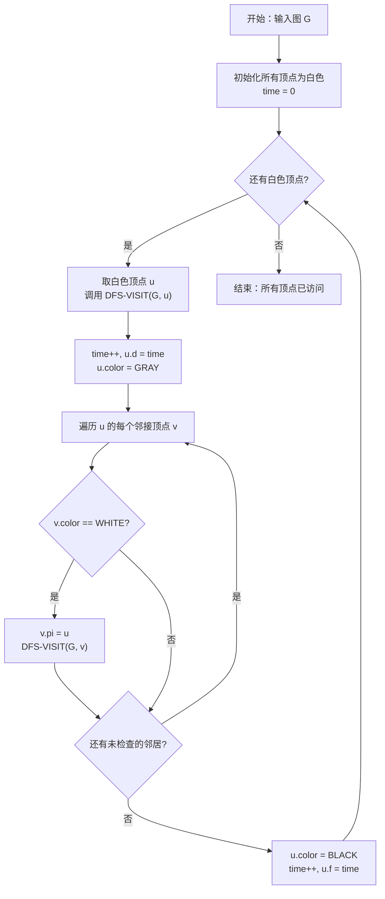

## 相关笔记

- 前置笔记：[[20.1 图的表示]]、[[20.2 广度优先搜索]]、[[19.1 不相交集合操作]]
- 关联概念：[[算法导论/concepts/栈]]
- 章节汇总：[[第20章_基本图算法-章节汇总]]

> [!abstract] 概览
> 本节介绍 ==深度优先搜索==（Depth-First Search, DFS）算法，它与 BFS 一样是图算法中最基础、最重要的搜索策略。DFS 采用==纵深优先==的策略：从源顶点出发，沿着一条路径尽可能深入探索，直到无法继续时回溯到上一个分叉点，再选择另一条路径继续深入。DFS 使用==递归==（或显式栈）实现，通过==发现时间== $d$ 和==完成时间== $f$ 两个时间戳记录每个顶点的探索过程。DFS 的核心成果包括：==括号定理==（描述顶点间的嵌套关系）、==边分类==（树边、后向边、前向边、横边）、==白色路径定理==（描述 DFS 树的构成）。DFS 是许多高级图算法的基础：拓扑排序、强连通分量、环检测等。DFS 的运行时间为 $\Theta(V + E)$。
>
> **核心要点：**
> - DFS 使用递归（或栈）实现纵深探索，时间复杂度 $\Theta(V + E)$
> - 每个顶点有发现时间 $d$ 和完成时间 $f$，满足==括号结构==（嵌套或不相交）
> - 有向图的边分为四类：树边、后向边、前向边、横边
> - 无向图只有树边和后向边两类
> - 后向边标志着图中存在环
> - DFS 是拓扑排序和强连通分量算法的基础

---

## 知识结构总览

```mermaid
flowchart TD
    A["20.3 深度优先搜索 (DFS)"] --> B["算法流程"]
    A --> C["时间戳与括号定理"]
    A --> D["边分类"]
    A --> E["核心定理"]
    A --> F["复杂度与应用"]

    B --> B1["DFS(G): 全局初始化"]
    B --> B2["DFS-VISIT(G, u): 递归探索"]
    B --> B3["递归栈隐式管理回溯"]

    C --> C1["发现时间 d[u]"]
    C --> C2["完成时间 f[u]"]
    C --> C3["括号定理 (定理22.7)"]
    C --> C4["时间戳区间嵌套/不相交"]

    D --> D1["树边 (Tree Edge)"]
    D --> D2["后向边 (Back Edge)"]
    D --> D3["前向边 (Forward Edge)"]
    D --> D4["横边 (Cross Edge)"]
    D --> D5["无向图: 只有树边和后向边"]

    E --> E1["白色路径定理 (定理22.9)"]
    E --> E2["定理22.10: 无向图边分类"]

    F --> F1["拓扑排序"]
    F --> F2["强连通分量 (SCC)"]
    F --> F3["环检测"]
    F --> F4["迭代DFS (栈实现)"]

    style A fill:#4a90d9,color:#fff
    style C3 fill:#e74c3c,color:#fff
    style E1 fill:#27ae60,color:#fff
    style E2 fill:#27ae60,color:#fff
```



---

## 核心思想

> [!tip] 核心思想
> DFS 的核心策略是==纵深优先==：选择一条路径尽可能深入，走到尽头后回溯。这种策略天然适合用==递归==实现——递归调用栈自动管理"深入"和"回溯"的过程。DFS 为每个顶点记录两个时间戳：==发现时间== $d[u]$（第一次访问 $u$ 的时间）和==完成时间== $f[u]$（完成对 $u$ 所有邻居的探索的时间）。这两个时间戳蕴含了丰富的结构信息：顶点间的祖先-后代关系对应时间戳区间的嵌套关系，边类型可以由时间戳完全确定。

### DFS 算法

> [!tip] 算法执行流程
> 1. **初始化**所有顶点为白色（未访问），前驱为 NIL，时间戳 time=0
> 2. **对每个白色顶点 u** 调用 **DFS-VISIT(G, u)**
> 3. **DFS-VISIT**：time 加 1，记录发现时间 d[u]，标记 u 为**灰色**（正在探索）
> 4. **遍历 u 的每个白色邻居 v**：设置 v 的前驱为 u，**递归调用 DFS-VISIT(G, v)**
> 5. 所有邻居处理完毕后，标记 u 为**黑色**（探索完成），time 加 1，记录完成时间 f[u]



```
DFS(G)
1  for each vertex u ∈ G.V
2      u.color = WHITE
3      u.π = NIL
4  time = 0
5  for each vertex u ∈ G.V
6      if u.color == WHITE
7          DFS-VISIT(G, u)

DFS-VISIT(G, u)
1  time = time + 1
2  u.d = time
3  u.color = GRAY
4  for each v ∈ G.Adj[u]
5      if v.color == WHITE
6          v.π = u
7          DFS-VISIT(G, v)
8  u.color = BLACK
9  time = time + 1
10 u.f = time
```

### 顶点属性

> [!def] DFS 顶点属性
> DFS 为每个顶点 $u$ 维护四个属性：
>
> - **$u.\text{color}$**：顶点颜色，取值为 WHITE（未发现）、GRAY（已发现，正在探索子树）、BLACK（探索完毕）
> - **$u.d$**：==发现时间==（discovery time），第一次访问 $u$ 的时间戳
> - **$u.f$**：==完成时间==（finishing time），完成对 $u$ 的所有可达顶点的探索的时间戳
> - **$u.\pi$**：DFS 树中 $u$ 的前驱（父节点）

### DFS 的执行过程

DFS 的执行过程分为两个阶段：

1. **全局初始化（DFS 第 1-4 行）：** 将所有顶点标记为 WHITE，前驱设为 NIL，全局时间计数器设为 0。

2. **逐顶点探索（DFS 第 5-7 行）：** 遍历所有顶点，对每个 WHITE 顶点调用 DFS-VISIT。这确保了即使图不连通，所有顶点都会被访问。

3. **递归探索（DFS-VISIT）：**
   - 记录发现时间 $u.d$，将 $u$ 标记为 GRAY
   - 遍历 $u$ 的所有邻居 $v$：如果 $v$ 为 WHITE，递归调用 DFS-VISIT(G, v)
   - 所有邻居处理完毕后，将 $u$ 标记为 BLACK，记录完成时间 $u.f$

### 括号定理

> [!def] 定理 22.7（括号定理）
> 在任何 DFS 中，对于任意两个顶点 $u$ 和 $v$，以下三种情况恰好有一种成立：
>
> 1. **区间 $[u.d, u.f]$ 与 $[v.d, v.f]$ 完全不相交**：$u$ 和 $v$ 之间没有祖先-后代关系，它们在不同的 DFS 树中，或在同一棵树中但一个是另一个的叔叔/侄子
> 2. **区间 $[u.d, u.f]$ 完全包含 $[v.d, v.f]$**：$u$ 是 $v$ 的==真祖先==（proper ancestor），即 $v$ 在 $u$ 的子树中
> 3. **区间 $[v.d, v.f]$ 完全包含 $[u.d, u.f]$**：$v$ 是 $u$ 的==真祖先==（proper ancestor）

> [!faq]- 定理 22.7 的证明
> **证明：** 对 DFS-VISIT 的调用次数进行归纳。
>
> **基础情况：** 第一次调用 DFS-VISIT 时，只有一个顶点 $u$，$u.d = 1$，$u.f = 2|V_u|$（其中 $V_u$ 是从 $u$ 可达的 WHITE 顶点集合）。只有一个区间，性质平凡成立。
>
> **【归纳步骤：$u$ 的后代区间 $[v.d, v.f]$ 嵌套在 $[u.d, u.f]$ 中，互不相交】**
> **归纳步骤：** 设在调用 DFS-VISIT(G, u) 之前，所有已完成的时间戳区间满足括号性质。考虑 DFS-VISIT(G, u) 的执行：
>
> - $u.d$ 被设置，$u$ 变为 GRAY
> - 对于 $u$ 的每个 WHITE 邻居 $v$，递归调用 DFS-VISIT(G, v)。由归纳假设，$v$ 及其后代的时间戳区间正确嵌套在 $[v.d, v.f]$ 中
> - 由于 $v.d > u.d$（$v$ 在 $u$ 之后被发现）且 $v.f < u.f$（$v$ 在 $u$ 之前完成），区间 $[v.d, v.f]$ 完全包含在 $[u.d, u.f]$ 中
> - $u$ 的多个 WHITE 邻居产生的时间戳区间互不相交（因为它们按顺序被发现和完成）
> - 最终 $u.f$ 被设置，$u$ 变为 BLACK
>
> 因此，$u$ 的所有后代的时间戳区间都嵌套在 $[u.d, u.f]$ 中，且彼此不相交。新产生的时间戳区间与之前已完成的时间戳区间也不相交（因为它们对应的顶点在 $u$ 被发现之前就已经完成了）。
>
> 综上，括号性质始终成立。 $\blacksquare$

### 边分类

> [!def] DFS 边分类（有向图）
> 在 DFS 过程中，图的每条边 $(u, v)$ 根据探索时的颜色被分为四类：
>
> | 类型 | 颜色条件 | 含义 |
> |------|---------|------|
> | **树边**（Tree Edge） | $v$ 为 WHITE | $v$ 第一次被发现，$(u, v)$ 成为 DFS 树的一条边 |
> | **后向边**（Back Edge） | $v$ 为 GRAY | $v$ 是 $u$ 的祖先，$(u, v)$ 指向已探索但未完成的祖先 |
> | **前向边**（Forward Edge） | $v$ 为 BLACK，$u.d < v.d$ | $v$ 是 $u$ 的后代，$(u, v)$ 跳过中间节点直接指向后代 |
> | **横边**（Cross Edge） | $v$ 为 BLACK，$u.d > v.d$ | $v$ 与 $u$ 没有祖先-后代关系，$(u, v)$ 跨越不同子树 |
>
> 边分类的判定在 DFS-VISIT 的第 5 行自然完成：
> - WHITE → 树边
> - GRAY → 后向边
> - BLACK → 前向边或横边（通过比较 $d$ 值区分）

> [!def] 定理 22.10（无向图的边分类）
> 在对==无向图== $G$ 执行 DFS 时，每条边要么是==树边==，要么是==后向边==。无向图中不存在前向边和横边。

> [!faq]- 定理 22.10 的证明
> **证明：** 设 $(u, v)$ 是无向图 $G$ 的一条边。在 DFS 中，$(u, v)$ 会在邻接表中被检查两次：一次在 $\text{Adj}[u]$ 中，一次在 $\text{Adj}[v]$ 中。
>
> **【情况1：第一次检查 $(u,v)$ 时，$v$ 为 WHITE（树边）或 GRAY（后向边）】**
> **情况 1：** 当第一次检查 $(u, v)$ 时，假设是从 $u$ 检查到 $v$。
> - 如果 $v$ 为 WHITE，则 $(u, v)$ 是树边，$v.\pi = u$。
> - 如果 $v$ 为 GRAY，则 $v$ 是 $u$ 的祖先（因为 $v$ 已被发现但未完成），$(u, v)$ 是后向边。
> - 如果 $v$ 为 BLACK，则需要进一步分析。
>
> **【情况2：第二次检查 $(v,u)$ 时，$u$ 是 GRAY（父节点），归类为后向边】**
> **情况 2：** 当第二次检查 $(u, v)$ 时（从 $v$ 检查到 $u$）。
> - 由于 $(u, v)$ 是无向边，$u$ 和 $v$ 之间有路径相连。
> - 如果 $(u, v)$ 在情况 1 中是树边，则 $v.\pi = u$。当从 $v$ 检查 $u$ 时，$u$ 已经是 BLACK（因为 $u$ 是 $v$ 的父节点，$u$ 的 DFS-VISIT 在 $v$ 的 DFS-VISIT 之前开始，但 $u$ 的 DFS-VISIT 在 $v$ 的 DFS-VISIT 完成后才完成——所以 $u$ 是 GRAY）。因此 $(v, u)$ 被归类为后向边。
>
> **【关键观察：排除横边和前向边的可能性】**
> **关键观察：** 在无向图中，当从 $u$ 检查 $v$ 时，$v$ 不可能是 BLACK 且 $u.d > v.d$（横边的情况）。原因如下：
>
> 假设 $(u, v)$ 是无向边，$v$ 为 BLACK，且 $u.d > v.d$。则 $v$ 在 $u$ 之前被发现。由于 $(u, v)$ 是边，$u$ 在 $v$ 的邻接表中。当 DFS-VISIT(G, v) 执行时，会检查 $u$。此时 $u$ 为 WHITE（因为 $u.d > v.d$，$u$ 尚未被其他顶点发现），所以 $(v, u)$ 是树边，$u.\pi = v$。但后来当从 $u$ 检查 $v$ 时，$v$ 是 $u$ 的父节点，$v$ 是 GRAY（因为 $v$ 的 DFS-VISIT 在 $u$ 的 DFS-VISIT 完成前不会完成），所以 $(u, v)$ 是后向边，不是横边。
>
> 类似地，$v$ 不可能是 BLACK 且 $u.d < v.d$（前向边的情况）。如果 $v$ 是 $u$ 的后代且 $v$ 已经完成（BLACK），那么在 DFS-VISIT(G, u) 执行过程中，$v$ 会被发现（$v$ 为 WHITE），$(u, v)$ 是树边。当 DFS-VISIT(G, v) 完成后回到 DFS-VISIT(G, u)，$u$ 继续检查其他邻居。当从 $v$ 检查 $u$ 时，$u$ 是 GRAY（$u$ 的 DFS-VISIT 尚未完成），$(v, u)$ 是后向边。
>
> 因此，无向图的 DFS 中每条边要么是树边，要么是后向边。 $\blacksquare$

### 白色路径定理

> [!def] 定理 22.9（白色路径定理）
> 在 DFS 中，顶点 $v$ 成为顶点 $u$ 的后代，当且仅当在发现 $u$ 的时刻 $u.d$，存在一条从 $u$ 到 $v$ 的==全白色路径==（即路径上所有顶点都是 WHITE）。

> [!faq]- 定理 22.9 的证明
> **证明：**
>
> **【必要性（$\Rightarrow$）：DFS 树路径在 $u.d$ 时刻是全白色路径】**
> **必要性（⇒）：** 如果 $v$ 是 $u$ 的后代，则 DFS 从 $u$ 出发沿着树边到达 $v$。在 $u.d$ 时刻，$u$ 刚被发现（变为 GRAY），$u$ 的所有后代都还是 WHITE。DFS 沿着 WHITE 顶点探索，因此从 $u$ 到 $v$ 的 DFS 树路径在 $u.d$ 时刻是一条全白色路径。
>
> **【充分性（$\Leftarrow$）：对路径长度归纳，$w_1$ 必被发现，$v$ 是 $w_1$ 的后代】**
> **充分性（⇐）：** 设在 $u.d$ 时刻，存在一条从 $u$ 到 $v$ 的全白色路径 $P = \langle u, w_1, w_2, \ldots, w_k, v \rangle$。对路径长度进行归纳。
>
> **基础情况：** 路径长度为 0，即 $v = u$。$u$ 是自身的后代（平凡成立）。
>
> **归纳步骤：** 设路径长度为 $k + 1$，路径为 $u \to w_1 \to \cdots \to w_k \to v$。在 $u.d$ 时刻，$w_1$ 为 WHITE。DFS-VISIT(G, u) 会遍历 $u$ 的邻居。在 $u$ 的 DFS-VISIT 完成之前，$w_1$ 必然被发现（因为 $w_1 \in \text{Adj}[u]$ 且 $w_1$ 为 WHITE）。当 $w_1$ 被发现时，路径 $w_1 \to w_2 \to \cdots \to v$ 上的所有顶点仍然为 WHITE（因为还没有其他 DFS-VISIT 访问过它们）。由归纳假设，$v$ 是 $w_1$ 的后代。由于 $w_1$ 是 $u$ 的后代（$w_1.\pi = u$），$v$ 也是 $u$ 的后代。 $\blacksquare$

### 时间戳与边分类的关系

> [!def] 边分类的时间戳判定（习题 22.3-5）
> 对于有向图的 DFS，边 $(u, v)$ 的类型可以通过时间戳判定：
>
> | 类型 | 时间戳条件 |
> |------|-----------|
> | 树边 | $v.d > u.d$ 且 $v.f < u.f$（即 $v$ 是 $u$ 的后代） |
> | 后向边 | $v.d < u.d$ 且 $v.f > u.f$（即 $v$ 是 $u$ 的祖先） |
> | 前向边 | $u.d < v.d$ 且 $u.f > v.f$（$v$ 是 $u$ 的后代，但不是直接子节点） |
> | 横边 | $u.d > v.d$ 且 $u.f > v.f$（$v$ 与 $u$ 无祖先-后代关系） |
>
> **注意：** 树边和前向边的时间戳条件形式上相同（$u.d < v.d$ 且 $u.f > v.f$），区分方法是：树边是 DFS-VISIT 中递归调用产生的边，前向边是跳过中间节点的非树边。

### 复杂度分析

> [!def] DFS 时间复杂度
> **邻接表表示：** $\Theta(V + E)$
> - 初始化（DFS 第 1-4 行）：$O(V)$
> - DFS-VISIT 调用：每个顶点恰好调用一次，每次调用中第 1-3 行和第 8-10 行共 $O(1)$
> - 遍历邻接表：每条边被检查一次（有向图）或两次（无向图），$O(E)$
> - 总计：$\Theta(V + E)$
>
> **邻接矩阵表示：** $\Theta(V^2)$
> - 每个顶点的邻居遍历需要扫描矩阵的一整行，$O(V)$
> - 共 $V$ 个顶点，总计 $\Theta(V^2)$

---

## 补充理解与拓展

> [!info] DFS 的发明历史
> DFS 的形式化描述归功于 **Robert Tarjan**（1972）：
>
> - **Robert Tarjan**（1972）：在论文 "Depth-first search and linear graph algorithms"（SIAM Journal on Computing, 1(2):146-160）中首次系统阐述了 DFS 的理论框架，包括时间戳、边分类、DFS 树等概念，并展示了如何用 DFS 在线性时间内解决连通分量、拓扑排序、强连通分量等问题。这篇论文是图算法领域的里程碑之作。
>
> DFS 的思想实际上可以追溯到更早：
> - **Trémaux**（19 世纪）：提出了一种用 DFS 思想走迷宫的方法（用粉笔标记已访问的路口）
> - **Tarjan** 的工作将这一直觉上升为严格的算法框架，并证明了其在线性时间内的正确性
>
> Tarjan 因此获得了 1986 年的图灵奖（部分原因）。DFS 至今仍是图算法中最核心的工具。
>
> 来源：Tarjan, R.E., "Depth-first search and linear graph algorithms", SIAM J. Comput., 1972

> [!info] DFS 的实际应用
> DFS 在计算机科学的各个领域都有广泛应用：
>
> 1. **编译器设计**：语法分析（递归下降分析器本质上是 DFS），检测递归类型定义中的循环引用
>
> 2. **环检测**：后向边的存在等价于图中存在有向环。DFS 是检测环的标准方法，时间 $O(V + E)$。应用于死锁检测（资源分配图中检测环）
>
> 3. **拓扑排序**：对 DAG（有向无环图）按完成时间 $f$ 的逆序排列，得到拓扑序。应用于任务调度、编译依赖分析、课程先修关系
>
> 4. **强连通分量（SCC）**：Kosaraju 算法和 Tarjan SCC 算法都基于 DFS。应用于网页分析（同一网站的页面构成 SCC）、社交网络社区发现
>
> 5. **迷宫生成**：DFS 随机选择邻居生成完美迷宫（每对格子之间恰好有一条路径），这是最常见的迷宫生成算法
>
> 6. **2-SAT 求解**：通过构建蕴含图并用 DFS 求强连通分量来判定 2-SAT 的可满足性
>
> 来源：Tarjan, 1972; Cormen et al., CLRS Chapter 22; Aho et al., "Compilers", 2006

> [!info] 迭代 DFS（习题 22.3-7）
> 递归 DFS 在深度很大的图上可能导致==栈溢出==（stack overflow）。解决方案是使用显式栈模拟递归：
>
> ```
> ITERATIVE-DFS(G)
> 1  for each vertex u ∈ G.V
> 2      u.color = WHITE
> 3      u.π = NIL
> 4  time = 0
> 5  for each vertex u ∈ G.V
> 6      if u.color == WHITE
> 7          ITERATIVE-DFS-VISIT(G, u)
>
> ITERATIVE-DFS-VISIT(G, s)
> 1  S = 空栈
> 2  PUSH(S, (s, false))  // (顶点, 是否已处理邻居)
> 3  while S ≠ ∅
> 4      (u, processed) = POP(S)
> 5      if processed
> 6          u.color = BLACK
> 7          time = time + 1
> 8          u.f = time
> 9      else if u.color == WHITE
> 10         time = time + 1
> 11         u.d = time
> 12         u.color = GRAY
> 13         PUSH(S, (u, true))  // 延后处理完成
> 14         for each v ∈ G.Adj[u]  // 逆序入栈以保持顺序一致
> 15             if v.color == WHITE
> 16                 v.π = u
> 17                 PUSH(S, (v, false))
> ```
>
> **关键技巧：** 每个顶点入栈两次——第一次是"发现"（设置 $d$，标记 GRAY），第二次是"完成"（设置 $f$，标记 BLACK）。第二次出栈时 `processed == true`，执行完成操作。这精确模拟了递归 DFS 的行为。
>
> **注意：** 第 14 行中邻居需要==逆序入栈==，才能保持与递归 DFS 相同的访问顺序（因为栈是 LIFO）。
>
> **空间：** 显式栈的最大深度为 $O(V)$，与递归栈相同。但在某些语言/环境中，显式栈可以分配在堆上，避免系统栈溢出。

> [!info] 边分类的直觉理解
> DFS 的四种边类型可以用"家谱"类比来理解：
>
> - **树边**：父→子的关系，就像族谱中的父子关系
> - **后向边**：子→祖先的关系，就像"回老家"——你指向你的祖父
> - **前向边**：祖先→非直接后代，就像祖父直接联系孙子，跳过了父亲
> - **横边**：堂兄弟之间的关系，两个顶点没有祖先-后代关系
>
> **后向边的重要性：** 后向边是唯一标志着==有向环==存在的边类型。如果有向图中存在后向边，则图中存在有向环；如果不存在后向边，则图是 DAG（有向无环图）。这一性质是拓扑排序和 DAG 相关算法的理论基础。

---

## 易混淆点与辨析

> [!warning] DFS 的时间戳不唯一
> ❌ **常见错误**：认为 DFS 产生唯一的时间戳序列。
>
> ✅ **正确理解**：DFS 的时间戳取决于邻接表中邻居的排列顺序和主循环中顶点的遍历顺序。不同的顺序产生不同的 DFS 森林和不同的时间戳。但无论哪种 DFS，括号定理、边分类规则和白色路径定理始终成立。

> [!warning] 前向边与树边的时间戳条件相同
> ❌ **常见错误**：认为前向边和树边可以通过时间戳完全区分。
>
> ✅ **正确理解**：树边和前向边的时间戳条件形式上相同（$u.d < v.d$ 且 $u.f > v.f$）。区分方法是：树边是在 DFS-VISIT 中通过递归调用产生的（$v$ 为 WHITE），前向边是 $v$ 已经为 BLACK 时发现的（$v$ 是 $u$ 的后代但不是通过当前递归路径到达的）。因此，边分类需要在 DFS 执行过程中根据颜色判定，而非事后仅凭时间戳。

> [!warning] 无向图的"后向边"不是真正的环
> ❌ **常见错误**：认为无向图中存在后向边意味着图中存在环。
>
> ✅ **正确理解**：在无向图的 DFS 中，每条非树边都被归类为"后向边"，但这是因为在无向图中，从子节点检查父节点时父节点一定是 GRAY。这种"后向边"实际上只是树边的反向遍历，不代表真正的环。只有当无向图中存在一条连接两个不同祖先-后代关系顶点的非树边时，才形成真正的环。
>
> **精确判断无向图是否有环：** 如果无向图中存在一条非树边 $(u, v)$，且 $u$ 不是 $v$ 的父节点（$v \neq u.\pi$），则图中存在环。

> [!warning] DFS 不计算最短路径
> ❌ **常见错误**：认为 DFS 可以找到最短路径。
>
> ✅ **正确理解**：DFS 找到的路径不保证是最短的。DFS 的纵深策略可能导致它找到一条很长的路径到达目标，而忽略了更短的路径。寻找最短路径应使用 BFS（无权图）或 Dijkstra 算法（非负权图）。
>
> **反例：** 在图 $s \to a \to b \to c \to t$ 和 $s \to t$ 中，DFS 可能先探索 $s \to a \to b \to c \to t$，找到长度为 4 的路径，而最短路径 $s \to t$ 长度仅为 1。

---

## 习题精选

| 题号 | 题目描述 | 难度 |
|:---:|----------|:---:|
| 22.3-1 | 颜色-边类型矩阵：在 DFS 中，根据 $v$ 的颜色判断边 $(u, v)$ 的类型 | ★★☆ |
| 22.3-2 | 给定图，展示 DFS 的完整执行过程（d, f, π 值） | ★★☆ |
| 22.3-3 | 展示 DFS 执行过程的括号结构 | ★★☆ |
| 22.3-5 | 用时间戳条件判定边类型 | ★★★ |
| 22.3-7 | 给出迭代版本的 DFS | ★★★ |
| 22.3-8 | 举反例说明 DFS 不保证找到最短路径 | ★☆☆ |
| 22.3-9 | 举反例说明 DFS 树不唯一 | ★☆☆ |
| 22.3-10 | 修改 DFS 打印每条边的类型 | ★★☆ |
| 22.3-12 | 修改 DFS 计算连通分量 | ★★☆ |
| 22.3-13 | 判断有向图是否是单连通的 | ★★★ |

> [!faq]- 22.3-1 解答：颜色-边类型矩阵
> **目标：** 在 DFS 中，根据 $v$ 的颜色判断有向边 $(u, v)$ 的类型。
>
> **解答：**
>
> | $v$ 的颜色 | 边 $(u, v)$ 的类型 |
> |:---------:|:-----------------:|
> | WHITE | 树边 |
> | GRAY | 后向边 |
> | BLACK | 前向边或横边 |
>
> **进一步区分 BLACK 的情况：**
> - 如果 $u.d < v.d$（$v$ 是 $u$ 的后代），则是==前向边==
> - 如果 $u.d > v.d$（$v$ 与 $u$ 无祖先-后代关系），则是==横边==
>
> **无向图的情况：**
>
> | $v$ 的颜色 | 边 $\{u, v\}$ 的类型 |
> |:---------:|:-----------------:|
> | WHITE | 树边 |
> | GRAY | 后向边 |
> | BLACK | 后向边（因为无向图中不存在前向边和横边） |

> [!faq]- 22.3-2 解答：DFS 执行过程
> **目标：** 在 CLRS 图 22.6 的有向图上执行 DFS，展示每个顶点的 $d$、$f$、$\pi$ 值。
>
> 图 22.6 的有向图包含顶点 $q, r, s, t, u, v, w, x, y, z$ 和边：
> $(q, s), (s, v), (v, w), (w, s), (q, w), (r, u), (u, y), (y, q), (t, x), (x, y), (t, y), (u, x), (w, t)$
>
> **DFS 执行过程（按字母顺序访问邻居）：**
>
> 从 $q$ 开始（第一个 WHITE 顶点）：
> - DFS-VISIT($q$): $q.d = 1$, GRAY
>   - 邻居 $s$: WHITE → DFS-VISIT($s$): $s.d = 2$, GRAY
>     - 邻居 $v$: WHITE → DFS-VISIT($v$): $v.d = 3$, GRAY
>       - 邻居 $w$: WHITE → DFS-VISIT($w$): $w.d = 4$, GRAY
>         - 邻居 $s$: GRAY → 后向边 $(w, s)$
>         - 邻居 $t$: WHITE → DFS-VISIT($t$): $t.d = 5$, GRAY
>           - 邻居 $x$: WHITE → DFS-VISIT($x$): $x.d = 6$, GRAY
>             - 邻居 $y$: WHITE → DFS-VISIT($y$): $y.d = 7$, GRAY
>               - 邻居 $q$: GRAY → 后向边 $(y, q)$
>             - $y.f = 8$, BLACK
>           - 邻居 $y$: BLACK, $x.d < y.d$ → 前向边 $(x, y)$
>         - $x.f = 9$, BLACK
>         - 邻居 $y$: BLACK, $t.d < y.d$ → 前向边 $(t, y)$
>       - $t.f = 10$, BLACK
>     - $w.f = 11$, BLACK
>   - $v.f = 12$, BLACK
> - 邻居 $w$: BLACK, $s.d < w.d$ → 前向边 $(s, w)$
> - $s.f = 13$, BLACK
> - 邻居 $w$: BLACK, $q.d < w.d$ → 前向边 $(q, w)$
> - $q.f = 14$, BLACK
>
> 下一个 WHITE 顶点 $r$：
> - DFS-VISIT($r$): $r.d = 15$, GRAY
>   - 邻居 $u$: WHITE → DFS-VISIT($u$): $u.d = 16$, GRAY
>     - 邻居 $y$: BLACK, $u.d > y.d$ → 横边 $(u, y)$
>     - 邻居 $x$: BLACK, $u.d > x.d$ → 横边 $(u, x)$
>   - $u.f = 17$, BLACK
> - $r.f = 18$, BLACK
>
> **结果汇总：**
>
> | 顶点 | $d$ | $f$ | $\pi$ |
> |:---:|:---:|:---:|:-----:|
> | $q$ | 1 | 14 | NIL |
> | $r$ | 15 | 18 | NIL |
> | $s$ | 2 | 13 | $q$ |
> | $t$ | 5 | 10 | $w$ |
> | $u$ | 16 | 17 | $r$ |
> | $v$ | 3 | 12 | $s$ |
> | $w$ | 4 | 11 | $v$ |
> | $x$ | 6 | 9 | $t$ |
> | $y$ | 7 | 8 | $x$ |
> | $z$ | — | — | NIL（不可达，保持 WHITE） |

> [!faq]- 22.3-3 解答：DFS 的括号结构
> **目标：** 展示 22.3-2 中 DFS 执行过程的括号结构。
>
> **括号表示：** 每个顶点 $u$ 对应一对括号，$u.d$ 对应左括号 `(`，$u.f$ 对应右括号 `)`。
>
> ```
> (q (s (v (w (s) (t (x (y (q)) y) x) t) w) v) (w) s) (q)) (r (u (y) (x) u) r)
> ```
>
> **验证括号定理：**
> - $[q.d, q.f] = [1, 14]$ 包含 $[s.d, s.f] = [2, 13]$：$q$ 是 $s$ 的祖先 ✅
> - $[s.d, s.f] = [2, 13]$ 包含 $[v.d, v.f] = [3, 12]$：$s$ 是 $v$ 的祖先 ✅
> - $[v.d, v.f] = [3, 12]$ 包含 $[w.d, w.f] = [4, 11]$：$v$ 是 $w$ 的祖先 ✅
> - $[w.d, w.f] = [4, 11]$ 包含 $[t.d, t.f] = [5, 10]$：$w$ 是 $t$ 的祖先 ✅
> - $[t.d, t.f] = [5, 10]$ 包含 $[x.d, x.f] = [6, 9]$：$t$ 是 $x$ 的祖先 ✅
> - $[x.d, x.f] = [6, 9]$ 包含 $[y.d, y.f] = [7, 8]$：$x$ 是 $y$ 的祖先 ✅
> - $[r.d, r.f] = [15, 18]$ 与 $[q.d, q.f] = [1, 14]$ 不相交：$r$ 和 $q$ 无祖先关系 ✅
> - $[r.d, r.f] = [15, 18]$ 包含 $[u.d, u.f] = [16, 17]$：$r$ 是 $u$ 的祖先 ✅

> [!faq]- 22.3-5 解答：用时间戳条件判定边类型
> **目标：** 证明有向图的 DFS 中，边 $(u, v)$ 的类型可以通过时间戳 $d$ 和 $f$ 判定。
>
> **证明：**
>
> **树边：** $v$ 在 $u$ 之后被发现，$v$ 在 $u$ 之前完成。因此 $u.d < v.d < v.f < u.f$。
>
> **后向边：** $v$ 是 $u$ 的祖先。由括号定理，$v.d < u.d < u.f < v.f$。
>
> **前向边：** $v$ 是 $u$ 的后代但不是通过树边到达。由括号定理，$u.d < v.d < v.f < u.f$。这与树边的时间戳条件相同。
>
> **横边：** $u$ 和 $v$ 无祖先-后代关系，且 $u.d > v.d$（$v$ 在 $u$ 之前被发现和完成）。因此 $v.d < v.f < u.d < u.f$。
>
> **总结：**
>
> | 类型 | 时间戳条件 |
> |------|-----------|
> | 树边 | $u.d < v.d$ 且 $v.f < u.f$ |
> | 后向边 | $v.d < u.d$ 且 $u.f < v.f$ |
> | 前向边 | $u.d < v.d$ 且 $v.f < u.f$（与树边相同） |
> | 横边 | $v.f < u.d$ |
>
> **区分树边与前向边：** 树边和前向边的时间戳条件相同，需要额外信息区分。在 DFS 执行过程中，树边是递归调用产生的（$v$ 为 WHITE），前向边是 $v$ 已完成时发现的（$v$ 为 BLACK 且 $u.d < v.d$）。
>
> **注意：** 横边的一个重要性质是 $u.d > v.d$（即横边总是从"较晚发现"的顶点指向"较早发现"的顶点）。横边不可能从"较早发现"的顶点指向"较晚发现"的顶点——如果 $u.d < v.d$ 且 $u.f > v.f$，则 $v$ 是 $u$ 的后代，边要么是树边要么是前向边。 $\blacksquare$

> [!faq]- 22.3-7 解答：迭代版本的 DFS
> **目标：** 给出使用显式栈的迭代 DFS，使其产生与递归 DFS 相同的结果。
>
> **算法：**
>
> ```
> ITERATIVE-DFS(G)
> 1  for each vertex u ∈ G.V
> 2      u.color = WHITE
> 3      u.π = NIL
> 4  time = 0
> 5  for each vertex u ∈ G.V
> 6      if u.color == WHITE
> 7          STACK-DFS-VISIT(G, u)
>
> STACK-DFS-VISIT(G, s)
> 1  S = 空栈
> 2  PUSH(S, (s, false))   // (顶点, 是否已处理完成)
> 3  while S ≠ ∅
> 4      (u, processed) = TOP(S)
> 5      if processed
> 6          POP(S)
> 7          u.color = BLACK
> 8          time = time + 1
> 9          u.f = time
> 10     else if u.color != WHITE
> 11         POP(S)
> 12     else
> 13         u.color = GRAY
> 14         time = time + 1
> 15         u.d = time
> 16         // 将当前帧标记为已处理，延后完成操作
> 17         S[TOP].processed = true
> 18         // 将 WHITE 邻居逆序入栈
> 19         for each v ∈ G.Adj[u] (逆序)
> 20             if v.color == WHITE
> 21                 v.π = u
> 22                 PUSH(S, (v, false))
> ```
>
> **关键设计要点：**
> 1. 每个顶点入栈两次：第一次是"发现"（设置 $d$，标记 GRAY），第二次是"完成"（设置 $f$，标记 BLACK）
> 2. 使用 `processed` 标志区分两次入栈
> 3. 邻居逆序入栈以保持与递归 DFS 相同的访问顺序
> 4. 第 10-11 行处理重复入栈的情况（同一顶点可能被多个邻居推入栈中）

> [!faq]- 22.3-8 解答：DFS 不保证最短路径——反例
> **目标：** 举一个反例说明 DFS 不保证找到最短路径。
>
> **反例：** 考虑无向图 $G = (V, E)$，其中 $V = \{s, a, b, t\}$，$E = \{(s, a), (a, b), (b, t), (s, t)\}$。
>
> 从 $s$ 出发的 DFS 可能按以下顺序探索：$s \to a \to b \to t$。DFS 找到的路径 $s \to a \to b \to t$ 长度为 3，但最短路径 $s \to t$ 长度为 1。
>
> **原因：** DFS 的纵深策略使其先深入探索 $s$ 的第一个邻居 $a$，然后继续深入 $b$ 和 $t$，错过了直接连接 $s$ 和 $t$ 的短路径。

> [!faq]- 22.3-9 解答：DFS 树不唯一——反例
> **目标：** 举一个反例说明 DFS 树不唯一。
>
> **反例：** 考虑无向图 $G = (V, E)$，其中 $V = \{a, b, c\}$，$E = \{(a, b), (a, c), (b, c)\}$（三角形）。
>
> 从 $a$ 出发的 DFS，如果先访问 $b$ 再访问 $c$，DFS 树为 $a \to b$ 和 $a \to c$（$b$ 和 $c$ 都是 $a$ 的子节点）。
>
> 如果先访问 $c$ 再访问 $b$，DFS 树为 $a \to c$ 和 $a \to b$（形态相同但访问顺序不同）。
>
> 更有说服力的反例：考虑图 $V = \{s, a, b\}$，$E = \{(s, a), (s, b), (a, b)\}$。从 $s$ 出发：
> - 先访问 $a$：DFS 树为 $s \to a \to b$，边 $(s, b)$ 是后向边
> - 先访问 $b$：DFS 树为 $s \to b$，边 $(s, a)$ 是树边，$(a, b)$ 是横边/后向边
>
> 两棵 DFS 树的结构不同。

> [!faq]- 22.3-10 解答：修改 DFS 打印每条边的类型
> **目标：** 修改 DFS-VISIT，使其在遍历每条边时打印边的类型。
>
> **修改后的 DFS-VISIT：**
>
> ```
> DFS-VISIT-PRINT(G, u)
> 1  time = time + 1
> 2  u.d = time
> 3  u.color = GRAY
> 4  for each v ∈ G.Adj[u]
> 5      if v.color == WHITE
> 6          print "树边 (" u "," v ")"
> 7          v.π = u
> 8          DFS-VISIT-PRINT(G, v)
> 9      else if v.color == GRAY
> 10         print "后向边 (" u "," v ")"
> 11     else  // v.color == BLACK
> 12         if u.d < v.d
> 13             print "前向边 (" u "," v ")"
> 14         else
> 15             print "横边 (" u "," v ")"
> 16 u.color = BLACK
> 17 time = time + 1
> 18 u.f = time
> ```
>
> **说明：** 第 5-8 行处理 WHITE 邻居（树边），第 9-10 行处理 GRAY 邻居（后向边），第 11-15 行处理 BLACK 邻居（前向边或横边，通过比较 $d$ 值区分）。

> [!faq]- 22.3-12 解答：修改 DFS 计算连通分量
> **目标：** 修改 DFS 以计算无向图的连通分量。
>
> **算法：**
>
> ```
> DFS-COMPONENTS(G)
> 1  for each vertex u ∈ G.V
> 2      u.color = WHITE
> 3      u.π = NIL
> 4      u.component = NIL
> 5  time = 0
> 6  component-id = 0
> 7  for each vertex u ∈ G.V
> 8      if u.color == WHITE
> 9          component-id = component-id + 1
> 10         DFS-COMPONENT-VISIT(G, u, component-id)
> 11 return component-id  // 连通分量总数
>
> DFS-COMPONENT-VISIT(G, u, id)
> 1  time = time + 1
> 2  u.d = time
> 3  u.color = GRAY
> 4  u.component = id
> 5  for each v ∈ G.Adj[u]
> 6      if v.color == WHITE
> 7          v.π = u
> 8          DFS-COMPONENT-VISIT(G, v, id)
> 9  u.color = BLACK
> 10 time = time + 1
> 11 u.f = time
> ```
>
> **正确性：** 每次 DFS 从一个 WHITE 顶点出发，恰好访问该顶点所在连通分量的所有顶点（因为无向图的连通分量内所有顶点互相可达）。每个被访问的顶点被赋予相同的 `component-id`。
>
> **复杂度：** $\Theta(V + E)$，与标准 DFS 相同。

> [!faq]- 22.3-13 解答：判断有向图是否单连通
> **目标：** 给定有向图 $G = (V, E)$，判断 $G$ 是否是==单连通==的（unilaterally connected），即对于任意两个顶点 $u, v \in V$，存在从 $u$ 到 $v$ 的路径或从 $v$ 到 $u$ 的路径。
>
> **算法思路：**
>
> 1. 对 $G$ 执行 DFS，得到 DFS 森林。检查对于每对顶点 $(u, v)$，是否存在从 $u$ 到 $v$ 或从 $v$ 到 $u$ 的路径。
> 2. 更高效的方法：对 $G$ 和 $G^T$（转置图）分别执行 DFS，然后检查每对顶点是否在至少一个 DFS 森林中连通。
>
> **具体算法：**
>
> ```
> IS-UNILATERALLY-CONNECTED(G)
> 1  // 在 G 上执行 DFS
> 2  DFS(G)
> 3  // 构建可达性矩阵
> 4  for each vertex u ∈ G.V
> 5      for each vertex v ∈ G.V
> 6          reachable[u][v] = false
> 7  for each vertex u ∈ G.V
> 8      DFS-REACHABILITY(G, u, reachable[u])
> 9  // 检查每对顶点
> 10 for each pair (u, v) with u ≠ v
> 11     if !reachable[u][v] and !reachable[v][u]
> 12         return false
> 13 return true
> ```
>
> 其中 `DFS-REACHABILITY(G, s, reachable[])` 从 $s$ 出发执行 DFS，将所有可达顶点标记为 `true`。
>
> **复杂度：** 对每个顶点执行一次 DFS，每次 $O(V + E)$，共 $V$ 次，总计 $O(V(V + E))$。
>
> **更高效的 $O(V + E)$ 算法：** 利用强连通分量的缩点技巧。先将 $G$ 缩点为 DAG（每个 SCC 缩为一个超级顶点），然后检查 DAG 是否是一条路径（即每个超级顶点的入度和出度都不超过 1，且 DAG 连通）。如果是，则原图是单连通的。

---

## 视频学习指南

| 资源 | 主题 | 链接 | 说明 |
|:-----|:-----|:-----|:-----|
| MIT 6.006 Lecture 14 | Depth-First Search | https://www.youtube.com/watch?v=AfSk24UTFS8 | Erik Demaine 教授，完整讲解 DFS 算法与括号定理 |
| MIT 6.006 Lecture 15 (cont.) | DFS Edge Classification | https://www.youtube.com/watch?v=wUgWX0nc4OM | 边分类、拓扑排序、SCC 的引入 |
| Abdul Bari | DFS Algorithm | https://www.youtube.com/watch?v=pcKY4hjDr6k | 逐步动画演示 DFS 执行过程 |
| WilliamFiset | DFS Graph Algorithm | https://www.youtube.com/watch?v=7fujbpJ0LB4 | 数据结构系列，含代码实现 |
| NeetCode | DFS Introduction | https://www.youtube.com/watch?v=Bt3F2rO1bQI | LeetCode 刷题视角，含经典 DFS 题目分类 |
| 3Blue1Brown | Graph Algorithms | https://www.youtube.com/watch?v=09_LlHjoEiY | 可视化 DFS，直观理解回溯过程 |

---

## 教材原文

> [!quote] 原文摘录（CLRS 第4版 22.3节）
> The strategy adopted by depth-first search is, as its name implies, to search "deeper" in the graph whenever possible. Depth-first search explores edges out of the most recently discovered vertex $v$ that still has unexplored edges leaving it. Once all of $v$'s edges have been explored, the search "backtracks" to explore edges leaving the vertex from which $v$ was discovered.
>
> 深度优先搜索所采用的策略，顾名思义，就是尽可能深地搜索图。深度优先搜索从最近发现的、仍有未探索出边的顶点 $v$ 出发探索边。一旦 $v$ 的所有边都被探索完毕，搜索就"回溯"到发现 $v$ 的那个顶点，从那里继续探索。

> [!quote] 原文摘录（CLRS 第4版 22.3节）
> The procedure DFS records, for each vertex $u$, a discovery time $u.d$ and a finishing time $u.f$. These times are integers between 1 and $2|V|$, and the discovery time precedes the finishing time. The timestamps provide important information about the structure of the DFS forest.
>
> 过程 DFS 为每个顶点 $u$ 记录一个发现时间 $u.d$ 和一个完成时间 $u.f$。这些时间是 1 到 $2|V|$ 之间的整数，且发现时间先于完成时间。时间戳提供了关于 DFS 森林结构的重要信息。

> [!quote] 原文摘录（CLRS 第4版 22.3节，定理 22.7）
> **Theorem 22.7 (Parenthesis theorem)** In any depth-first search of a (directed or undirected) graph $G = (V, E)$, for any two vertices $u$ and $v$, exactly one of the following three conditions holds: the intervals $[u.d, u.f]$ and $[v.d, v.f]$ are entirely disjoint, the interval $[u.d, u.f]$ is contained entirely within the interval $[v.d, v.f]$, or the interval $[v.d, v.f]$ is contained entirely within the interval $[u.d, u.f]$.
>
> **定理 22.7（括号定理）** 在对（有向或无向）图 $G = (V, E)$ 的任何深度优先搜索中，对于任意两个顶点 $u$ 和 $v$，以下三种条件恰好有一种成立：区间 $[u.d, u.f]$ 和 $[v.d, v.f]$ 完全不相交，区间 $[u.d, u.f]$ 完全包含在 $[v.d, v.f]$ 中，或区间 $[v.d, v.f]$ 完全包含在 $[u.d, u.f]$ 中。

> [!quote] 原文摘录（CLRS 第4版 22.3节，定理 22.9）
> **Theorem 22.9 (White-path theorem)** In a depth-first forest of a graph $G$, vertex $v$ is a descendant of vertex $u$ if and only if at the time $u.d$ that the search discovers $u$, there is a path from $u$ to $v$ consisting entirely of white vertices.
>
> **定理 22.9（白色路径定理）** 在图 $G$ 的深度优先森林中，顶点 $v$ 是顶点 $u$ 的后代，当且仅当在搜索发现 $u$ 的时刻 $u.d$，存在一条从 $u$ 到 $v$ 的完全由白色顶点组成的路径。

---

## 参见Wiki

- （概念页尚未创建）
- [[算法导论/theorems/括号定理]]

---
#学习/算法导论/第20章-基本图算法 #学习/算法导论/基本图算法/深度优先搜索
