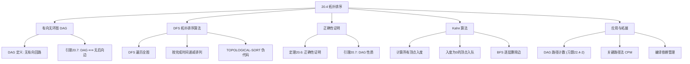
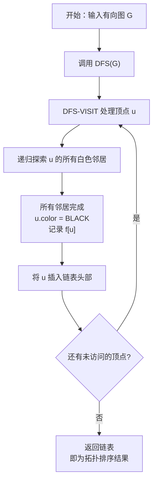
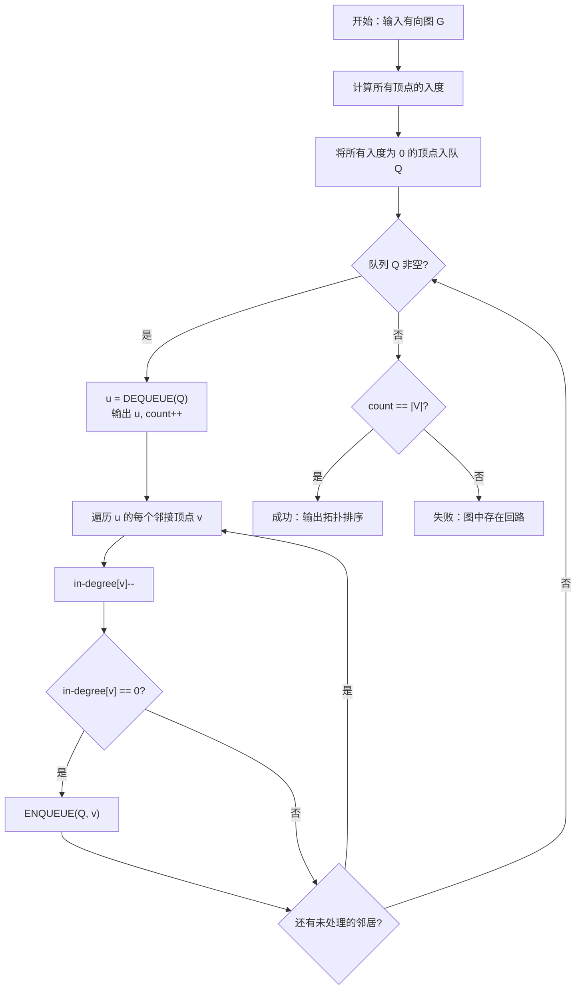

## 相关笔记

- 前置笔记：[[20.1 图的表示]]、[[20.2 广度优先搜索]]、[[20.3 深度优先搜索]]
- 关联概念：[[算法导论/concepts/栈]]、[[算法导论/concepts/队列]]
- 章节汇总：[[第20章_基本图算法-章节汇总]]

> [!abstract] 概览
> 本节介绍 ==有向无环图（DAG）== 上的 ==拓扑排序== 问题，即对有向图的顶点排成一个线性序列，使得对每条有向边 $(u, v)$，$u$ 在序列中出现在 $v$ 之前。核心知识点包括：
> - **DAG 的定义**：有向无环图，即不包含有向回路的有向图
> - **DFS 拓扑排序算法**：基于 [[20.3 深度优先搜索]] 的完成时间，按递减顺序排列顶点
> - **定理20.6**：DAG 的拓扑排序存在且算法正确
> - **引理20.7**：有向图是 DAG 当且仅当 DFS 不产生后向边
> - **Kahn 算法**：基于入度的 BFS 拓扑排序（习题22.4-5）
> - **DAG 中的路径计数**：动态规划 + 拓扑排序（习题22.4-2）

---

## 知识结构总览



---

核心概念

### 有向无环图（DAG）

> [!def] 有向无环图（Directed Acyclic Graph, DAG）
> 一个**有向图** $G = (V, E)$ 如果不包含任何**有向回路**（directed cycle），则称为有向无环图，简称 DAG。
>
> **等价表述：** 对 $G$ 中任意顶点 $v$，不存在从 $v$ 出发经过若干条有向边回到 $v$ 的路径。

> [!tip] DAG 的直观理解
> **DAG 就是"没有循环依赖"的有向图**。想象大学课程之间的先修关系：如果课程 A 是课程 B 的先修课，则有一条从 A 指向 B 的边。如果不存在"循环先修"（A 是 B 的先修，B 是 C 的先修，C 又是 A 的先修），那么这个先修关系图就是一个 DAG。DAG 保证了我们可以找到一个合理的课程学习顺序。

### 拓扑排序的定义

> [!def] 拓扑排序（Topological Sort）
> 对有向图 $G = (V, E)$ 的一个**拓扑排序**是 $V$ 中所有顶点的一个线性排列，使得对 $G$ 中的每条边 $(u, v)$，$u$ 在排列中出现在 $v$ 之前。
>
> 形式化地，拓扑排序是一个双射 $f: V \to \{1, 2, \ldots, |V|\}$，使得对每条边 $(u, v) \in E$，有 $f(u) < f(v)$。

> [!tip] 拓扑排序的存在性
> **并非所有有向图都有拓扑排序**。如果一个有向图包含有向回路，则不可能进行拓扑排序——回路中的顶点互相"要求"排在前面，形成矛盾。因此，**有向图存在拓扑排序当且仅当它是 DAG**。

### DFS 拓扑排序算法

教材给出的 TOPOLOGICAL-SORT 算法基于 [[20.3 深度优先搜索]]，核心思想是利用 DFS 的**完成时间**（finishing time）来确定顶点的排列顺序。

> [!tip] 算法执行流程
> 1. 对图 G 调用 **DFS**，计算每个顶点的**完成时间** f[v]
> 2. 当顶点完成探索（变为**黑色**）时，将其**插入链表头部**
> 3. DFS 全部完成后，链表中的顶点顺序即为**拓扑序**（完成时间递减）



```
TOPOLOGICAL-SORT(G)
1  调用 DFS(G) 计算每个顶点的完成时间 f[v]
2  按顶点的完成时间 f[v] 递减的顺序排列顶点
3  返回排列后的顶点列表
```

> [!tip] 为什么按完成时间递减排列是正确的
> **核心直觉：** 在 DFS 中，一个顶点只有当其所有**可达的后代**都完成探索后才会被"完成"（即记录完成时间）。因此，完成时间较晚的顶点"依赖"完成时间较早的顶点。按完成时间递减排列，就保证了每条边 $(u, v)$ 中 $u$ 排在 $v$ 前面。
>
> **类比：** 想象你在整理书架。你先处理最深处的书（子节点），处理完后才回到外层的书（父节点）。最后完成的总是"最外层"的书——它们应该排在最前面。

### 定理20.6（拓扑排序的正确性）

> [!def] 定理20.6
> 如果有向图 $G$ 是 DAG，则 TOPOLOGICAL-SORT(G) 产生 $G$ 的一个拓扑排序。
>
> 等价地：$G$ 是 DAG 当且仅当 $G$ 存在拓扑排序。

> [!faq]- 证明
> **必要性（$G$ 是 DAG $\Rightarrow$ 拓扑排序存在）：**
>
> 假设 $G$ 是 DAG。对 $G$ 执行 DFS，得到每个顶点的完成时间 $f[v]$。按 $f[v]$ 递减排列顶点得到序列 $L$。
>
> 需要证明：对 $G$ 中每条边 $(u, v)$，$u$ 在 $L$ 中排在 $v$ 之前（即 $f[u] > f[v]$）。
>
> **【按边分类逐一验证 $f[u] > f[v]$：树边、前向边、交叉边成立，后向边不存在】**
> 考虑边 $(u, v)$ 的分类（根据 [[20.3 深度优先搜索]] 中的边分类）：
>
> - **树边**：$v$ 在 $u$ 的搜索过程中被发现。因此 $v$ 在 $u$ 之前完成（$f[v] < f[u]$），满足 $f[u] > f[v]$。
> - **前向边**：$v$ 是 $u$ 的后代但不是通过树边到达的。$v$ 在 $u$ 之前完成，满足 $f[u] > f[v]$。
> - **交叉边**：$v$ 在 $u$ 之前完成（因为发现 $u$ 时 $v$ 已经完成，$f[v] < d[u] < f[u]$），满足 $f[u] > f[v]$。
> - **后向边**：由引理20.7，DAG 中不存在后向边。
>
> 因此对所有边 $(u, v) \in E$，都有 $f[u] > f[v]$，$L$ 是 $G$ 的拓扑排序。
>
> **【充分性：反证，有向回路导致 $v_1$ 排在 $v_1$ 前面，矛盾】**
> **充分性（拓扑排序存在 $\Rightarrow$ $G$ 是 DAG）：**
>
> 反证法。假设 $G$ 存在拓扑排序但 $G$ 不是 DAG，即 $G$ 包含有向回路 $C = v_1 \to v_2 \to \cdots \to v_k \to v_1$。
>
> 在拓扑排序中，$v_1$ 排在 $v_2$ 前面，$v_2$ 排在 $v_3$ 前面，……，$v_k$ 排在 $v_1$ 前面。因此 $v_1$ 排在 $v_1$ 前面，矛盾。
>
> 因此 $G$ 不包含有向回路，$G$ 是 DAG。 $\blacksquare$

### 引理20.7（DAG 与 DFS 边分类的关系）

> [!def] 引理20.7
> 有向图 $G$ 是 DAG 当且仅当对 $G$ 执行 DFS 不产生**后向边**（back edge）。

> [!faq]- 证明
> **【必要性：反证，后向边 $(u,v)$ + DFS 树路径形成有向回路】**
> **必要性（$G$ 是 DAG $\Rightarrow$ 无后向边）：**
>
> 反证法。假设 DFS 产生了一条后向边 $(u, v)$，其中 $u$ 是 $v$ 的后代。这意味着存在从 $v$ 到 $u$ 的有向路径（由 DFS 树边组成），加上后向边 $(u, v)$，形成了一条从 $v$ 出发经过 $u$ 回到 $v$ 的有向回路。这与 $G$ 是 DAG 矛盾。
>
> **【充分性：反证，有向回路 $C$ 中第一个被发现的顶点 $u$ 的前驱 $w$ 检查 $(w,u)$ 时 $u$ 为 GRAY】**
> **充分性（无后向边 $\Rightarrow$ $G$ 是 DAG）：**
>
> 反证法。假设 DFS 不产生后向边但 $G$ 不是 DAG，即 $G$ 包含有向回路 $C$。
>
> 设 $C$ 中第一个被 DFS 发现的顶点为 $u$。在 $C$ 中，$u$ 有一个前驱顶点 $w$（即 $C$ 中有一条边 $(w, u)$）。由于 $u$ 是 $C$ 中第一个被发现的顶点，当 DFS 探索边 $(w, u)$ 时，$u$ 已经被发现（因为 $u$ 先被发现），且 $u$ 尚未完成（因为 $C$ 是回路，从 $u$ 出发经过 $C$ 还能回到 $u$，所以 $u$ 的搜索尚未结束）。因此 $(w, u)$ 是一条后向边，矛盾。
>
> 因此 $G$ 不包含有向回路，$G$ 是 DAG。 $\blacksquare$

> [!tip] 后向边与有向回路的等价关系
> **后向边是有向回路在 DFS 中的"签名"**。DFS 将有向图的边分为四类（树边、前向边、后向边、交叉边），其中只有后向边对应有向回路。因此，判断一个有向图是否为 DAG，只需对其执行 DFS 并检查是否出现后向边——这是 $O(V + E)$ 的线性时间算法。

---

## 补充理解与拓展

### 拓扑排序的工程应用

> [!info] 补充：拓扑排序在软件工程中的核心应用
> **来源：** 教材第20.4节，pp. 612-613
>
> 拓扑排序在实际工程中有广泛的应用：
>
> 1. **编译依赖管理**：Makefile、Cargo（Rust）、npm（Node.js）等构建工具使用 DAG 表示模块间的依赖关系，通过拓扑排序确定编译顺序。如果存在循环依赖（Cyclic Dependency），构建系统会报错——这正是 DAG 性质的体现。
>
> 2. **课程先修关系**：大学教务系统中，课程之间的先修关系构成 DAG，拓扑排序给出一个可行的选课顺序。
>
> 3. **任务调度**：在操作系统的进程调度、大数据的 MapReduce 任务编排中，任务间的依赖关系用 DAG 表示，拓扑排序确定执行顺序。
>
> 4. **电子表格公式求值**：电子表格中单元格之间的公式引用关系构成 DAG，拓扑排序确定公式求值顺序，避免循环引用。

### Kahn 算法 vs DFS 拓扑排序

> [!info] 补充：两种拓扑排序算法的全面对比
> **来源：** 习题22.4-5（Kahn 算法）；A. B. Kahn, "Topological sorting of large networks", Communications of the ACM, 5(11), 1962
>
> | 比较维度 | DFS 拓扑排序 | Kahn 算法 |
> |:---------|:-------------|:-----------|
> | 核心思想 | 利用 DFS 完成时间 | 不断删除入度为 0 的顶点 |
> | 数据结构 | DFS 递归/栈 + 完成时间数组 | 队列 + 入度数组 |
> | 时间复杂度 | $O(V + E)$ | $O(V + E)$ |
> | 空间复杂度 | $O(V)$（递归栈 + 颜色数组） | $O(V + E)$（入度数组 + 邻接表） |
> | 能否检测回路 | 需额外检查后向边 | 天然支持：若结果顶点数 $< |V|$ 则有回路 |
> | 排序结果 | 不唯一（依赖 DFS 的起始顶点和邻接表顺序） | 不唯一（依赖队列中顶点的出队顺序） |
> | 并行化 | 困难 | 容易（入度为 0 的顶点可并行处理） |
> | 实际使用 | 学术教学 | 工程实践（如构建系统） |
>
> **Kahn 算法的优势：**
> - 天然支持回路检测：如果最终输出的顶点数少于 $|V|$，说明图中存在回路
> - 更容易并行化：所有入度为 0 的顶点可以同时处理
> - 不需要递归，避免栈溢出风险

### Kahn 算法伪代码

> [!tip] 算法执行流程
> 1. **计算**所有顶点的**入度** in-degree[v]
> 2. 将所有**入度为 0** 的顶点**入队** Q
> 3. **while 队列 Q 非空**
> 4. **出队**顶点 u，将其加入**结果序列**，计数器加 1
> 5. **遍历 u 的每个邻接顶点 v**：入度减 1，若入度**变为 0** 则**入队**
> 6. 若结果序列包含**所有顶点**则拓扑排序成功；否则图中**存在回路**



```
TOPOLOGICAL-SORT-KAHN(G)
1  计算每个顶点 v 的入度 in-degree[v]
2  将所有入度为 0 的顶点加入队列 Q
3  count ← 0
4  while Q 非空
5      u ← Q.dequeue()
6      输出 u
7      count ← count + 1
8      for u 的每个邻接顶点 v
9          in-degree[v] ← in-degree[v] - 1
10         if in-degree[v] == 0
11             Q.enqueue(v)
12 if count ≠ |V|
13     报告"图中存在回路"
```

### 关键路径法（Critical Path Method）

> [!info] 补充：DAG 最长路径与项目管理
> **来源：** 拓扑排序的经典应用扩展
>
> **关键路径法（CPM）** 是项目管理中的核心技术，用于确定项目的最短完成时间。其核心思想是：
>
> 1. 将项目中的任务建模为 DAG，顶点表示任务，边表示依赖关系
> 2. 每个顶点关联一个权重，表示任务的持续时间
> 3. 在 DAG 上求**最长路径**（关键路径），其长度就是项目的最短完成时间
> 4. 关键路径上的任务是"关键任务"——任何一个关键任务的延迟都会导致整个项目延迟
>
> **DAG 上的最长路径可以通过拓扑排序 + 动态规划在 $O(V + E)$ 时间内求解**：
> - 按拓扑排序的顺序处理顶点
> - 对每个顶点 $v$，$\text{dist}[v] = \max_{(u,v) \in E}(\text{dist}[u] + w(u, v))$
> - 最终 $\max_v \text{dist}[v]$ 即为最长路径长度
>
> 注意：一般有向图上的最长路径是 NP 难的，但 DAG 上的最长路径可以在多项式时间内求解——这正是 DAG 的特殊结构带来的优势。

### DAG 中的路径计数（习题22.4-2）

> [!info] 补充：动态规划 + 拓扑排序计数路径
> **来源：** 习题22.4-2
>
> 给定 DAG $G = (V, E)$ 和两个顶点 $s, t$，计算从 $s$ 到 $t$ 的不同有向路径的数目。
>
> **算法思路：**
> 1. 对 $G$ 做拓扑排序
> 2. 按拓扑序处理顶点，对每个顶点 $v$ 维护计数 $\text{count}[v]$（从 $s$ 到 $v$ 的路径数）
> 3. 初始化 $\text{count}[s] = 1$，其余为 0
> 4. 按拓扑序遍历，对每条边 $(u, v)$，$\text{count}[v] \mathrel{+}= \text{count}[u]$
> 5. 最终 $\text{count}[t]$ 即为答案
>
> **正确性：** 拓扑排序保证处理 $v$ 时，所有到达 $v$ 的前驱 $u$ 都已被处理，因此 $\text{count}[v]$ 累加了所有从 $s$ 到 $v$ 的路径。
>
> **时间复杂度：** $O(V + E)$（拓扑排序 + 遍历所有边各一次）。

---

## 易混淆点与辨析

> [!warning] 误区：拓扑排序的结果是唯一的
> **错误理解：** "一个 DAG 的拓扑排序是唯一的。"
>
> **正确理解：** 一个 DAG 可能有**多个**不同的拓扑排序。例如，两个没有依赖关系的顶点可以以任意相对顺序出现。
>
> **唯一性条件：** DAG 的拓扑排序唯一当且仅当对每对相邻顶点在拓扑排序中，它们之间存在一条有向路径。等价地，DAG 的哈密顿路径唯一时拓扑排序唯一。

> [!warning] 误区：无向图也可以做拓扑排序
> **错误理解：** "拓扑排序适用于所有图。"
>
> **正确理解：** 拓扑排序只适用于**有向图**。无向图没有边的方向性，"排在前面"和"排在后面"没有意义。即使是连通无向图，也不存在拓扑排序的概念。

> [!warning] 误区：DFS 拓扑排序中按发现时间排列
> **错误理解：** "按 DFS 的发现时间（discovery time）递增排列就是拓扑排序。"
>
> **正确理解：** 拓扑排序是按 DFS 的**完成时间**（finishing time）**递减**排列，而非发现时间。完成时间晚的顶点排在前面。这是因为一个顶点只有在其所有后代完成后才被"完成"，所以完成时间蕴含了依赖关系信息。

---

## 习题精选

| 题号 | 题目描述 | 难度 |
|:---:|----------|:---:|
| 22.4-1 | 给出图 20-8 中有向图的拓扑排序 | ⭐ |
| 22.4-2 | 设计一个线性时间算法，计算 DAG 中从顶点 $s$ 到顶点 $t$ 的不同有向路径数目 | ⭐⭐ |
| 22.4-3 | 设计一个线性时间算法，判断给定的有向图是否包含"支配顶点"（从该顶点出发可达所有其他顶点） | ⭐⭐ |
| 22.4-4 | 给定 DAG $G$ 和两个顶点 $s$ 和 $t$，设计一个线性时间算法，找出从 $s$ 到 $t$ 的最长有向路径 | ⭐⭐ |
| 22.4-5 | 给出一个 $O(V + E)$ 时间的算法，使用入度而非 DFS 完成时间来计算有向图的拓扑排序 | ⭐⭐ |

> [!faq]- 22.4-2 解答
> **目标：** 计算 DAG 中从 $s$ 到 $t$ 的不同有向路径数目。
>
> **算法：**
> 1. 对 $G$ 做拓扑排序，得到顶点序列 $v_1, v_2, \ldots, v_n$
> 2. 初始化数组 $\text{count}[1 \dots n]$，$\text{count}[s] = 1$，其余为 0
> 3. 按拓扑序遍历每个顶点 $u$：
>    - 对 $u$ 的每个邻接顶点 $v$：$\text{count}[v] \mathrel{+}= \text{count}[u]$
> 4. 返回 $\text{count}[t]$
>
> **正确性论证：**
>
> 对拓扑排序中的顶点按顺序归纳。设 $v_1, v_2, \ldots, v_n$ 是拓扑排序。
>
> **归纳假设：** 处理完 $v_1, \ldots, v_i$ 后，对每个 $j \le i$，$\text{count}[v_j]$ 等于从 $s$ 到 $v_j$ 的有向路径数目。
>
> **基础情况：** $v_1 = s$ 时，$\text{count}[s] = 1$，从 $s$ 到 $s$ 恰好有 1 条路径（空路径）。若 $v_1 \ne s$，则 $\text{count}[v_1] = 0$，因为 $s$ 在拓扑排序中排在 $v_1$ 之后，不可能有从 $s$ 到 $v_1$ 的路径。
>
> **归纳步骤：** 处理 $v_{i+1}$ 时，所有指向 $v_{i+1}$ 的前驱 $u$ 都已在 $v_1, \ldots, v_i$ 中被处理（因为拓扑排序保证前驱排在前面）。对每条边 $(u, v_{i+1})$，从 $s$ 到 $u$ 有 $\text{count}[u]$ 条路径，每条路径加上边 $(u, v_{i+1})$ 就得到一条从 $s$ 到 $v_{i+1}$ 的路径。因此 $\text{count}[v_{i+1}] = \sum_{(u, v_{i+1}) \in E} \text{count}[u]$ 正好等于从 $s$ 到 $v_{i+1}$ 的路径总数。
>
> **时间复杂度：** 拓扑排序 $O(V + E)$，遍历所有边 $O(V + E)$，总计 $O(V + E)$。
>
> $\blacksquare$

> [!faq]- 22.4-3 解答
> **目标：** 判断 DAG 中是否存在从某个顶点出发可达所有其他顶点的"支配顶点"。
>
> **算法：**
> 1. 对 $G$ 做拓扑排序，得到序列 $v_1, v_2, \ldots, v_n$
> 2. 从 $v_n$（拓扑排序的最后一个顶点）出发执行 DFS/BFS，计算可达集合 $R$
> 3. 如果 $|R| = |V|$，则 $v_n$ 是支配顶点；否则不存在支配顶点
>
> **正确性论证：**
>
> 如果存在支配顶点 $u$，则 $u$ 必须能到达所有其他顶点。在拓扑排序中，$u$ 到每个顶点 $v$ 都有路径，因此 $u$ 排在 $v$ 前面。所以 $u$ 必须是拓扑排序中的**第一个顶点** $v_1$。
>
> 但更准确地说：如果 $u$ 能到达所有顶点，则从 $u$ 出发的最长路径的终点是拓扑排序的最后一个顶点 $v_n$。反过来，$v_n$ 是否能到达所有顶点？不一定。
>
> 修正算法：从拓扑排序的**第一个顶点** $v_1$ 出发执行 DFS/BFS。如果 $v_1$ 的可达集合大小为 $|V|$，则 $v_1$ 是支配顶点。否则不存在支配顶点。
>
> **为什么检查 $v_1$ 就够了？** 如果存在支配顶点 $u$，则 $u$ 排在所有顶点前面（因为 $u$ 到每个顶点都有路径），所以 $u = v_1$。
>
> **时间复杂度：** 拓扑排序 $O(V + E)$，DFS/BFS $O(V + E)$，总计 $O(V + E)$。
>
> $\blacksquare$

> [!faq]- 22.4-4 解答
> **目标：** 找出 DAG 中从 $s$ 到 $t$ 的最长有向路径。
>
> **算法：**
> 1. 对 $G$ 做拓扑排序
> 2. 初始化 $\text{dist}[v] = -\infty$ 对所有 $v \in V$，$\text{dist}[s] = 0$
> 3. 按拓扑序遍历每个顶点 $u$：
>    - 对 $u$ 的每个邻接顶点 $v$：
>      - 若 $\text{dist}[v] < \text{dist}[u] + 1$，则 $\text{dist}[v] = \text{dist}[u] + 1$
> 4. 返回 $\text{dist}[t]$
>
> **正确性论证：**
>
> 按拓扑序处理顶点，保证处理 $v$ 时所有前驱 $u$ 都已处理完毕。$\text{dist}[v]$ 记录从 $s$ 到 $v$ 的最长路径长度。对每条边 $(u, v)$，通过 $u$ 到达 $v$ 的路径长度为 $\text{dist}[u] + 1$，取最大值即可。
>
> 如果 $\text{dist}[t] = -\infty$，说明 $s$ 不可达 $t$。
>
> **时间复杂度：** $O(V + E)$。
>
> **推广到带权 DAG：** 将 $\text{dist}[u] + 1$ 替换为 $\text{dist}[u] + w(u, v)$ 即可，算法结构和复杂度不变。这是第22章中 DAG 最短路径算法的"镜像"（将最短改为最长）。
>
> $\blacksquare$

> [!faq]- 22.4-5 解答
> **目标：** 使用入度而非 DFS 完成时间来计算拓扑排序（Kahn 算法）。
>
> **算法（Kahn 算法）：**
>
> ```
> TOPOLOGICAL-SORT-KAHN(G)
> 1  对每个顶点 v ∈ V
> 2      in-degree[v] ← 0
> 3  for 每条边 (u, v) ∈ E
> 4      in-degree[v] ← in-degree[v] + 1
> 5  初始化一个空链表 L
> 6  初始化一个队列 Q
> 7  for 每个顶点 v ∈ V
> 8      if in-degree[v] == 0
> 9          Q.enqueue(v)
> 10 while Q 非空
> 11     u ← Q.dequeue()
> 12     将 u 添加到 L 的前端
> 13     for u 的每个邻接顶点 v ∈ Adj[u]
> 14         in-degree[v] ← in-degree[v] - 1
> 15         if in-degree[v] == 0
> 16             Q.enqueue(v)
> 17 if L 中顶点数 ≠ |V|
> 18     报告"图中有回路，无法拓扑排序"
> 19 return L
> ```
>
> **正确性论证：**
>
> **有向无环的情况：** DAG 至少存在一个入度为 0 的顶点（否则所有顶点都有入边，沿入边回溯会形成回路）。算法每次删除入度为 0 的顶点及其出边，不会破坏剩余图的 DAG 性质。因此算法会处理所有顶点。
>
> **有回路的情况：** 回路中的顶点入度始终至少为 1（因为回路中每个顶点至少有一条来自回路内其他顶点的入边），永远不会被加入队列。因此 $|L| < |V|$，算法正确检测到回路。
>
> **时间复杂度：** 计算入度 $O(V + E)$，队列操作每个顶点最多入队出队各一次 $O(V)$，遍历邻接表 $O(E)$。总计 $O(V + E)$。
>
> $\blacksquare$

> [!tip] 解题思路提示
> - **22.4-2/22.4-4**：拓扑排序 + 动态规划是 DAG 上的经典范式——先确定处理顺序（拓扑排序），再按顺序递推计算。这是因为 DAG 的拓扑序保证了"依赖先于被依赖"。
> - **22.4-3**：关键观察是支配顶点必须是拓扑排序的第一个顶点（因为它能到达所有顶点，所以排在最前面）。
> - **22.4-5**：Kahn 算法的核心是"不断删除入度为 0 的顶点"。思考为什么入度为 0 的顶点可以安全删除（因为没有任何顶点依赖它）。

---

## 视频学习指南

| 资源 | 主题 | 链接 | 说明 |
|:-----|:-----|:-----|:-----|
| MIT 6.006 Lecture 9 | Graph Search, Topological Sort | https://www.youtube.com/watch?v=AfSk24UTFS8 | 完整的拓扑排序讲解 |
| Abdul Bari | Topological Sort | https://www.youtube.com/watch?v=eL-KzMXSXXI | 逐步动画演示 |
| WilliamFiset | Topological Sort Algorithm | https://www.youtube.com/watch?v=TCd71PqRXX0 | 含 Kahn 算法实现 |

---

## 教材原文

> [!quote] CLRS 第4版 20.4节原文
> A topological sort of a directed acyclic graph $G = (V, E)$ is a linear ordering of all its vertices such that if $G$ contains an edge $(u, v)$, then $u$ appears before $v$ in the ordering. If the graph contains a directed cycle, then no linear ordering of the vertices can produce a topological sort. A directed acyclic graph is often called a "dag."
>
> The following simple algorithm topologically sorts a dag:
>
> TOPOLOGICAL-SORT($G$)
> 1 call DFS($G$) to compute finishing times $f[v]$ for each vertex $v$
> 2 as each vertex is finished, insert it onto the front of a linked list
> 3 return the linked list of vertices
>
> Figure 20.7 shows the result of applying this topological-sort algorithm to the dag of Figure 20.6. The vertices are shown in the order they were inserted into the linked list, from left to right.
>
> Theorem 20.6: TOPOLOGICAL-SORT produces a topological sort of a dag.
>
> Lemma 20.7: A directed graph $G$ is acyclic if and only if a depth-first search of $G$ yields no back edges.

---

**参见Wiki：** [[第20章_基本图算法-章节汇总]] | [[20.3 深度优先搜索]] | [[20.5 强连通分量]] | [[算法导论/theorems/拓扑排序正确性定理]]

#学习/算法导论/第20章-基本图算法
#学习/算法导论/基本图算法/拓扑排序
