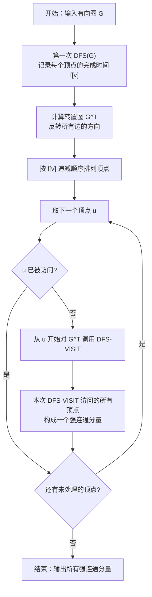

## 相关笔记

- 前置笔记：[[20.1 图的表示]]、[[20.2 广度优先搜索]]、[[20.3 深度优先搜索]]、[[20.4 拓扑排序]]
- 关联概念：[[算法导论/concepts/栈]]
- 章节汇总：[[第20章_基本图算法-章节汇总]]

> [!abstract] 概览
> 本节介绍 ==强连通分量（Strongly Connected Components, SCC）== 的概念及 ==Kosaraju 算法==，该算法利用两次 [[20.3 深度优先搜索]] 在 $O(V + E)$ 时间内找出有向图的所有强连通分量。核心知识点包括：
> - **强连通分量的定义**：有向图中顶点间互相可达的最大子集
> - **Kosaraju 算法三步走**：①对 $G$ 做 DFS 计算完成时间 ②计算转置图 $G^T$ ③按完成时间递减对 $G^T$ 做 DFS
> - **分量图（condensation）**：将每个 SCC 缩为一个超顶点，得到的分量图是 [[20.4 拓扑排序]] 中的 DAG
> - **定理20.9**：Kosaraju 算法的正确性
> - **引理20.10~20.14**：构成正确性证明链的五个关键引理

---

## 知识结构总览

```mermaid
flowchart TD
    A["20.5 强连通分量"] --> B["基本概念"]
    A --> C["Kosaraju 算法"]
    A --> D["正确性证明链"]
    A --> E["分量图"]
    A --> F["应用与拓展"]

    B --> B1["强连通: u 可达 v 且 v 可达 u"]
    B --> B2["SCC: 最大强连通子集"]
    B --> B3["SCC 划分: 每个顶点恰属于一个 SCC"]

    C --> C1["第一步: DFS(G) 计算完成时间"]
    C --> C2["第二步: 计算 G^T"]
    C --> C3["第三步: 按完成时间递减 DFS(G^T)"]

    D --> D1["引理20.10: SCC 内顶点的完成时间区间"]
    D --> D2["引理20.11: 分量图的边与完成时间"]
    D --> D3["引理20.12: G^T 中的 SCC 树"]
    D --> D4["引理20.13: G^T 中根的 SCC"]
    D --> D5["引理20.14: G^T 中 DFS 树的根"]

    E --> E1["分量图 G^SCC 是 DAG"]
    E --> E2["分量图的拓扑排序"]

    F --> F1["Kosaraju vs Tarjan SCC"]
    F --> F2["PageRank 预处理"]
    F --> F3["编译器循环检测"]
    F --> F4["2-SAT 求解"]
```



---

核心概念

### 强连通与强连通分量

> [!def] 强连通（Strongly Connected）
> 在有向图 $G = (V, E)$ 中，如果两个顶点 $u, v \in V$ 满足 $u$ 可达 $v$（存在从 $u$ 到 $v$ 的有向路径）且 $v$ 可达 $u$，则称 $u$ 和 $v$ 是**强连通**的。
>
> **性质：** 强连通关系是 $V$ 上的一个**等价关系**（自反性、对称性、传递性均成立）。

> [!def] 强连通分量（Strongly Connected Component, SCC）
> 有向图 $G = (V, E)$ 的一个**强连通分量**是一个最大顶点集合 $C \subseteq V$，使得 $C$ 中任意两个顶点互相可达。
>
> **"最大"的含义：** 不存在更大的顶点集合 $C' \supset C$ 使得 $C'$ 中所有顶点互相可达。SCC 是强连通等价关系的等价类。

> [!tip] 强连通分量的直观理解
> **SCC 就是图中"紧密抱团"的一组顶点**——组内任意两个顶点可以互相到达，但组外的顶点无法同时到达组内所有顶点并被组内所有顶点到达。
>
> **类比：** 想象一个社交网络中的"朋友圈"。如果 A 能联系到 B，B 能联系到 C，C 也能联系到 A，那么 A、B、C 就形成一个"强连通分量"——他们之间可以互相传达消息。但如果 D 只能被 A 联系到，D 却联系不到 A，那么 D 不在这个分量中。

### 转置图

> [!def] 转置图（Transpose Graph）$G^T$
> 给定有向图 $G = (V, E)$，其**转置图** $G^T = (V, E^T)$，其中 $E^T = \{(v, u) : (u, v) \in E\}$。
>
> **直观理解：** $G^T$ 就是将 $G$ 中所有边的方向反转。$G^T$ 可以在 $O(V + E)$ 时间内从 $G$ 的邻接表表示中构造出来。

> [!tip] 转置图的重要性质
> **$G^T$ 与 $G$ 具有完全相同的 SCC**。这是因为强连通关系是对称的：如果 $u$ 可达 $v$（在 $G$ 中），那么在 $G^T$ 中 $v$ 可达 $u$。因此 $u$ 和 $v$ 在 $G$ 中强连通当且仅当它们在 $G^T$ 中强连通。

### Kosaraju 算法

Kosaraju 算法（1978）通过两次 DFS 在 $O(V + E)$ 时间内找出所有 SCC。

> [!tip] 算法执行流程
> 1. 对原图 G 调用 **DFS**，记录每个顶点的**完成时间** f[v]
> 2. 计算 G 的**转置图** G^T（将所有边方向反转）
> 3. 按完成时间**递减**的顺序，对 G^T 调用 **DFS**
> 4. 第二次 DFS 中每棵 **DFS 树**就是一个**强连通分量**



```
STRONGLY-CONNECTED-COMPONENTS(G)
1  调用 DFS(G) 计算每个顶点的完成时间 f[v]
2  计算 G 的转置图 G^T
3  按照完成时间 f[v] 递减的顺序，对 G^T 调用 DFS
4  第三步中产生的每一棵 DFS 树就是一个强连通分量
```

> [!tip] Kosaraju 算法的核心直觉
> **为什么需要转置图？为什么按完成时间递减？**
>
> 核心思想分为两步理解：
>
> 1. **第一次 DFS（在 $G$ 上）**：完成时间最晚的顶点一定位于某个"源 SCC"（source SCC）中——即分量图中没有入边的 SCC。这是因为源 SCC 中的顶点不会被其他 SCC 中的顶点"阻挡"，DFS 会深入到源 SCC 的最深处。
>
> 2. **第二次 DFS（在 $G^T$ 上）**：转置图 $G^T$ 将源 SCC 变成了"汇 SCC"（sink SCC）。按完成时间递减处理，就先处理 $G^T$ 的汇 SCC（即 $G$ 的源 SCC），从中探索能到达的所有顶点——它们恰好构成一个完整的 SCC（因为在 $G^T$ 中，源 SCC 变成了汇，不会被其他 SCC 的顶点"泄漏"到）。
>
> **类比：** 想象水流从高处（源 SCC）流向低处。第一次 DFS 找到"最高处"的水源，第二次 DFS 在反转的图（水从低处流回高处）中从这些水源开始收集所有能流回的顶点——它们恰好形成一个 SCC。

### 分量图（Component Graph / Condensation）

> [!def] 分量图 $G^{SCC}$
> 给定有向图 $G = (V, E)$，其**分量图** $G^{SCC} = (V^{SCC}, E^{SCC})$ 定义为：
> - 每个顶点 $C \in V^{SCC}$ 对应 $G$ 的一个强连通分量
> - 边 $(C_i, C_j) \in E^{SCC}$ 当且仅当 $G$ 中存在从 $C_i$ 中某顶点到 $C_j$ 中某顶点的边
>
> 分量图也称为 $G$ 的**缩图**（condensation）。

> [!def] 引理（分量图是 DAG）
> 有向图 $G$ 的分量图 $G^{SCC}$ 是一个有向无环图（DAG）。

> [!faq]- 证明
> **【反证：回路中 SCC 间互相可达，应合并为一个 SCC，矛盾】**
> 反证法。假设 $G^{SCC}$ 包含有向回路 $C_1 \to C_2 \to \cdots \to C_k \to C_1$。
>
> 这意味着 $G$ 中存在从 $C_1$ 到 $C_2$ 的边、从 $C_2$ 到 $C_3$ 的边、……、从 $C_k$ 到 $C_1$ 的边。因此 $C_1$ 中的某顶点可以到达 $C_2$ 中的某顶点，$C_2$ 中的某顶点可以到达 $C_3$ 中的某顶点，……，$C_k$ 中的某顶点可以到达 $C_1$ 中的某顶点。
>
> 这意味着 $C_1 \cup C_2 \cup \cdots \cup C_k$ 中任意两个顶点互相可达（通过回路中的路径），因此它们应该属于同一个 SCC，与 $C_1, C_2, \ldots, C_k$ 是不同 SCC 矛盾。 $\blacksquare$

> [!tip] 分量图的意义
> **分量图将任意有向图"简化"为 DAG**。在分量图上可以应用 [[20.4 拓扑排序]] 的所有算法——例如对分量图做拓扑排序，就得到了 SCC 之间的"依赖顺序"。这是 Kosaraju 算法正确性的基础。

---

正确性证明链

Kosaraju 算法的正确性由五个引理（引理20.10~20.14）和一个定理（定理20.9）构成完整的证明链。下面逐一展开。

### 引理20.10（SCC 内顶点的完成时间区间）

> [!def] 引理20.10
> 设 $C$ 和 $C'$ 是有向图 $G$ 的两个不同的强连通分量。如果 $G$ 中存在一条边 $(u, v)$，其中 $u \in C$，$v \in C'$，则 $f(C) > f(C')$。
>
> 这里 $f(C) = \max_{w \in C} f[w]$ 表示分量 $C$ 中所有顶点完成时间的最大值。

> [!faq]- 证明
> 考虑对 $G$ 执行 DFS 的过程。分两种情况讨论。
>
> **【情况一：$d(C) < d(C')$，$C$ 先被发现，$f(C) = f[u]$，$v$ 在 $u$ 完成前完成】**
> **情况一：$d(C) < d(C')$。**
>
> 即 $C$ 中有顶点在 $C'$ 中任何顶点之前被发现。设 $u \in C$ 是 $C$ 中第一个被发现的顶点。由于 $C$ 是 SCC，$C$ 中所有顶点都从 $u$ 可达，因此 DFS 会探索完 $C$ 中所有顶点后才会完成 $u$。所以 $f(C) = f[u]$。
>
> 由于 $d(C) < d(C')$，$C'$ 中所有顶点在 $u$ 完成之前被发现。具体来说，$v$ 在 $u$ 完成之前被发现（因为 $u$ 到 $v$ 有边，DFS 会通过这条边发现 $v$）。$C'$ 中所有顶点在 $v$ 的搜索子树中完成，因此 $f(C') \le f[v] < f[u] = f(C)$。
>
> **【情况二：$d(C) > d(C')$，$C'$ 先完成，$f(C') < d(C) \le f(C)$】**
> **情况二：$d(C) > d(C')$。**
>
> 即 $C'$ 中有顶点在 $C$ 中任何顶点之前被发现。此时 $C$ 中所有顶点在 $C'$ 完成之后才被发现（否则情况一的条件成立）。因此 $f(C') < d(C) \le f(C)$。
>
> 两种情况下都有 $f(C) > f(C')$。 $\blacksquare$

> [!tip] 引理20.10 的直观含义
> **如果 SCC $C$ 有一条边指向 SCC $C'$，则 $C$ 的"完成时间"晚于 $C'$**。这意味着在分量图的拓扑排序中，$C$ 排在 $C'$ 前面——分量图中从 $C$ 到 $C'$ 有边，对应拓扑排序中 $C$ 在前。

### 引理20.11（分量图中边的方向与完成时间）

> [!def] 引理20.11
> 设 $C$ 和 $C'$ 是有向图 $G$ 的两个不同的强连通分量，且分量图 $G^{SCC}$ 中存在一条从 $C$ 到 $C'$ 的边。则 $f(C) > f(C')$。

> [!faq]- 证明
> **【$G^{SCC}$ 中边 $(C,C')$ $\Rightarrow$ $G$ 中边 $(u,v)$，$u \in C, v \in C'$，由引理20.10得 $f(C) > f(C')$】**
> $G^{SCC}$ 中存在从 $C$ 到 $C'$ 的边，意味着 $G$ 中存在边 $(u, v)$，其中 $u \in C$，$v \in C'$。由引理20.10，$f(C) > f(C')$。 $\blacksquare$

### 引理20.12（$G^T$ 中的 SCC 树）

> [!def] 引理20.12
> 设 $C$ 是有向图 $G$ 的一个强连通分量，$u$ 是 $C$ 中在 $G^T$ 的第二次 DFS 中第一个被发现的顶点。则在 $G^T$ 的 DFS 中，以 $u$ 为根的 DFS 树恰好包含 $C$ 中的所有顶点（不多不少）。

> [!faq]- 证明
> **【$C$ 中所有顶点都在以 $u$ 为根的树中：$G^T$ 中 $C$ 内互相可达】**
> **$C$ 中所有顶点都在以 $u$ 为根的树中：**
>
> 由于 $u \in C$ 且 $C$ 是 SCC，在 $G^T$ 中 $C$ 内任意两个顶点仍然互相可达（转置不改变 SCC）。因此从 $u$ 出发的 DFS 可以到达 $C$ 中所有顶点，它们都在以 $u$ 为根的树中。
>
> **【反证：$v \notin C$ 在树中 $\Rightarrow$ $G$ 中 $v$ 可达 $u$，分 $u$ 可达/不可达 $v$ 两种情况推导矛盾】**
> **以 $u$ 为根的树中不包含 $C$ 之外的顶点：**
>
> 反证法。假设以 $u$ 为根的树中包含某个 $v \notin C$。则在 $G^T$ 中存在从 $u$ 到 $v$ 的路径，即在 $G$ 中存在从 $v$ 到 $u$ 的路径。由于 $u$ 是 $C$ 中在 $G^T$ 的 DFS 中第一个被发现的顶点，且 $G^T$ 的 DFS 按完成时间递减处理，$u$ 的完成时间 $f[u]$ 是 $C$ 中最大的。
>
> 在 $G$ 中，$v$ 到 $u$ 有路径，所以 $v$ 可达 $C$ 中所有顶点（因为 $C$ 是 SCC，$u$ 可达 $C$ 中所有顶点，加上 $v$ 到 $u$ 的路径）。如果 $u$ 也可达 $v$（在 $G$ 中），则 $u$ 和 $v$ 属于同一个 SCC，与 $v \notin C$ 矛盾。如果 $u$ 不可达 $v$（在 $G$ 中），则 $C$ 和 $v$ 所在的 SCC $C'$ 是不同的分量，且 $G^{SCC}$ 中有从 $C'$ 到 $C$ 的边。由引理20.11，$f(C') > f(C)$，即 $f[v] \ge f(C') > f(C) \ge f[u]$。但 $G^T$ 的 DFS 按完成时间递减处理，$f[v] > f[u]$ 意味着 $v$ 应该在 $u$ 之前被处理，与 $u$ 是 $C$ 中第一个被发现的顶点矛盾。
>
> 因此以 $u$ 为根的树恰好包含 $C$ 中所有顶点。 $\blacksquare$

### 引理20.13（$G^T$ 中根的 SCC）

> [!def] 引理20.13
> 在 $G^T$ 的第二次 DFS 中，每棵 DFS 树的根 $u$ 对应的 SCC $C$ 满足：在 $G$ 的分量图 $G^{SCC}$ 中，$C$ 没有入边（即 $C$ 是 $G^{SCC}$ 中的源 SCC）。

> [!faq]- 证明
> **【反证：$C$ 有入边 $\Rightarrow$ 存在 $C'$ 满足 $f(C') > f(C)$，$C'$ 中顶点应先被处理，矛盾】**
> 设 $u$ 是 $G^T$ 的 DFS 中某棵树的根。$G^T$ 的 DFS 按完成时间递减处理，所以 $u$ 是所有尚未被发现的顶点中完成时间最大的。
>
> 反证法。假设 $C$ 在 $G^{SCC}$ 中有入边，即存在另一 SCC $C' \ne C$ 使得 $G^{SCC}$ 中有从 $C'$ 到 $C$ 的边。由引理20.11，$f(C') > f(C)$。因此 $C'$ 中有顶点的完成时间大于 $C$ 中所有顶点的完成时间。
>
> 但 $u$ 是所有未发现顶点中完成时间最大的，而 $C'$ 中有顶点完成时间更大且尚未被处理（因为 $C' \ne C$，$C'$ 中的顶点不在以 $u$ 为根的树中），矛盾。
>
> 因此 $C$ 在 $G^{SCC}$ 中没有入边。 $\blacksquare$

### 引理20.14（$G^T$ 中 DFS 树的根对应源 SCC）

> [!def] 引理20.14
> 在 $G^T$ 的第二次 DFS 中，$G$ 的分量图 $G^{SCC}$ 中的源 SCC 对应的顶点会成为 DFS 树的根。

> [!faq]- 证明
> **【$C$ 是源 SCC $\Rightarrow$ 无 $C'$ 满足 $f(C') > f(C)$ $\Rightarrow$ $C$ 中顶点完成时间最大，成为 DFS 树根】**
> 设 $C$ 是 $G^{SCC}$ 中的源 SCC。$C$ 在 $G^{SCC}$ 中没有入边，因此由引理20.11，不存在 SCC $C'$ 使得 $f(C') > f(C)$。即 $C$ 中有顶点的完成时间不小于任何其他 SCC 中顶点的完成时间。
>
> 在 $G^T$ 的 DFS 中，完成时间最大的顶点一定属于 $C$（因为 $f(C)$ 是最大的），且它会被选为某棵 DFS 树的根。由引理20.12，以该根为根的 DFS 树恰好包含 $C$ 中所有顶点。 $\blacksquare$

### 定理20.9（Kosaraju 算法的正确性）

> [!def] 定理20.9
> STRONGLY-CONNECTED-COMPONENTS 过程正确地计算出有向图 $G$ 的所有强连通分量。

> [!faq]- 证明
> **【综合引理20.13和20.14：每棵 DFS 树的根对应源 SCC，每个源 SCC 都成为根】**
> 由引理20.13，$G^T$ 的 DFS 中每棵树的根对应 $G^{SCC}$ 中的一个源 SCC。由引理20.14，$G^{SCC}$ 中的每个源 SCC 都会被选为某棵 DFS 树的根。
>
> **【由引理20.12：每棵 DFS 树恰好包含一个 SCC 的所有顶点】**
> 由引理20.12，以每个根为根的 DFS 树恰好包含对应 SCC 中的所有顶点。
>
> **【DAG 逐层处理：每次处理源 SCC 后移除，剩余仍是 DAG，仍有源 SCC】**
> $G^{SCC}$ 是 DAG（见"分量图是 DAG"引理），DAG 至少有一个源 SCC。每次 DFS 处理一个源 SCC 后，将其从图中"移除"（标记为已完成），剩余的分量图仍然是 DAG，仍有源 SCC。因此算法会逐个处理所有 SCC。
>
> 综上，STRONGLY-CONNECTED-COMPONENTS 正确地计算出 $G$ 的所有强连通分量。 $\blacksquare$

> [!tip] 证明链的逻辑结构
> **五个引理构成一条严密的逻辑链：**
> - 引理20.10：建立 SCC 间完成时间的基本不等式（核心工具）
> - 引理20.11：将引理20.10 推广到分量图的边
> - 引理20.12：证明 $G^T$ 的 DFS 树恰好对应一个 SCC（关键步骤）
> - 引理20.13：证明 DFS 树的根对应源 SCC
> - 引理20.14：证明源 SCC 一定会成为 DFS 树的根
> - 定理20.9：综合以上引理得出算法正确性

---

补充理解与拓展

### Kosaraju 算法 vs Tarjan SCC 算法

> [!info] 补充：两种经典 SCC 算法的全面对比
> **来源：** S. R. Kosaraju, "Analysis of a Simple Linear Time Path Finding Algorithm", 1978; R. E. Tarjan, "Depth-First Search and Linear Graph Algorithms", SIAM Journal on Computing, 1(2), 1972
>
> | 比较维度 | Kosaraju 算法 (1978) | Tarjan SCC 算法 (1972) |
> |:---------|:---------------------|:----------------------|
> | 核心思想 | 两次 DFS + 转置图 | 一次 DFS + 栈 |
> | DFS 次数 | 2 次 | 1 次 |
> | 是否需要转置图 | 需要（第二步构造 $G^T$） | 不需要 |
> | 额外空间 | $O(V + E)$（转置图） | $O(V)$（栈 + 数组） |
> | 时间复杂度 | $O(V + E)$ | $O(V + E)$ |
> | 实现难度 | 简单直观 | 较复杂（需要维护栈和 lowlink） |
> | 历史地位 | 教学经典 | 历史更早，影响深远 |
> | 实际使用 | 竞赛编程（实现简单） | 需要单次遍历时 |
>
> **Tarjan 算法的核心思想：** 在一次 DFS 中维护一个栈，记录当前正在探索的顶点。当发现某个顶点的"lowlink"值等于自身的发现时间时，弹出栈中从该顶点开始的所有顶点——它们构成一个 SCC。lowlink 值表示从当前顶点出发，通过树边和最多一条后向边/交叉边能到达的发现时间最小的顶点。
>
> **选择建议：** 竞赛编程中 Kosaraju 更受欢迎（代码短、不易出错）；需要最小化空间或只需要一次图遍历时，Tarjan 更优。

### SCC 的实际应用

> [!info] 补充：强连通分量的工程应用
> **来源：** 综合整理
>
> 1. **PageRank 预处理**：Google 的 PageRank 算法在计算网页排名前，先将网页图分解为 SCC。每个 SCC 内的网页具有相同的 PageRank 值（因为互相可达），只需对分量图（DAG）计算 PageRank，大幅减少计算量。
>
> 2. **编译器循环检测**：编译器的控制流分析中，基本块之间的跳转关系构成有向图。检测 SCC 可以识别循环结构（loop），这是编译器优化的基础——循环不变量外提、强度削弱等优化都依赖循环的识别。
>
> 3. **2-SAT 求解**：2-SAT 问题（每个子句恰好包含两个文字的布尔可满足性问题）可以通过构造"蕴含图"（implication graph），求 SCC 来判定可满足性。如果某个变量 $x$ 和 $\neg x$ 属于同一个 SCC，则 2-SAT 不可满足；否则可满足。
>
> 4. **社交网络社区发现**：在 Twitter/X 等社交平台中，用户之间的关注关系（有向）可以分解为 SCC。大型 SCC 代表"紧密社区"——社区内信息可以传播到每个成员。

### 分量图的性质和应用

> [!info] 补充：分量图（Condensation）的深层性质
> **来源：** 教材第20.5节
>
> 分量图 $G^{SCC}$ 是 DAG，因此可以应用 DAG 上的所有算法：
>
> - **拓扑排序**：对 $G^{SCC}$ 做拓扑排序，得到 SCC 之间的依赖顺序
> - **最长路径**：$G^{SCC}$ 上的最长路径对应原图中"最长 SCC 链"
> - **传递闭包**：$G$ 的传递闭包可以通过对 $G^{SCC}$ 计算传递闭包，再扩展到 SCC 内部得到
>
> **分量图的顶点数**：$G^{SCC}$ 的顶点数等于 $G$ 的 SCC 数量。对于"稀疏 SCC"的图（大多数 SCC 很小），$G^{SCC}$ 远小于 $G$，在其上操作更高效。

### 半连通性判定（习题22.5-7）

> [!info] 补充：半连通性
> **来源：** 习题22.5-7
>
> 有向图 $G$ 是**半连通**的（semiconnected），如果对任意两个顶点 $u, v$，要么 $u$ 可达 $v$，要么 $v$ 可达 $u$。
>
> **判定算法：**
> 1. 计算 $G$ 的所有 SCC
> 2. 构造分量图 $G^{SCC}$
> 3. 对 $G^{SCC}$ 做拓扑排序
> 4. 检查拓扑排序中相邻 SCC 之间是否都有边（即 $G^{SCC}$ 的拓扑排序中，每对相邻顶点之间都有边）
> 5. 如果是，则 $G$ 半连通；否则不半连通
>
> **时间复杂度：** $O(V + E)$。
>
> **正确性：** $G$ 半连通当且仅当 $G^{SCC}$ 的拓扑排序中每对相邻顶点之间有边。如果存在相邻 SCC $C_i, C_{i+1}$ 之间没有边，则 $C_i$ 中顶点不可达 $C_{i+1}$ 中顶点（因为拓扑排序中 $C_i$ 排在 $C_{i+1}$ 前面，$C_{i+1}$ 排在 $C_i$ 后面的所有 SCC 前面，如果没有从 $C_i$ 到 $C_{i+1}$ 的边，则 $C_i$ 中顶点无法到达 $C_{i+1}$ 中顶点），且 $C_{i+1}$ 中顶点也不可达 $C_i$ 中顶点（因为 $C_{i+1}$ 排在 $C_i$ 后面），违反半连通性。

---

易混淆点与辨析

> [!warning] 误区：无向图的连通分量和有向图的强连通分量是同一概念
> **错误理解：** "强连通分量就是无向图的连通分量在有向图中的推广。"
>
> **正确理解：** 无向图的连通分量只要求顶点之间有路径（无向路径），而有向图的强连通分量要求**双向可达**。有向图还有"弱连通分量"的概念——忽略边的方向后得到的连通分量。
>
> **关系：** 每个 SCC 是弱连通分量的一个子集。一个弱连通分量可以包含多个 SCC。

> [!warning] 误区：单个顶点不构成 SCC
> **错误理解：** "SCC 至少要有两个顶点。"
>
> **正确理解：** 单个顶点本身就是一个 SCC（平凡 SCC）。如果一个顶点不与任何其他顶点强连通，它自己就构成一个 SCC。在 Kosaraju 算法中，每个顶点恰好属于一个 SCC——要么是平凡 SCC，要么是非平凡 SCC。

> [!warning] 误区：Kosaraju 算法中第二次 DFS 的顺序不重要
> **错误理解：** "第二次 DFS 可以按任意顺序处理顶点。"
>
> **正确理解：** 第二次 DFS **必须**按第一次 DFS 的完成时间**递减**顺序处理顶点。这是算法正确性的关键——只有按这个顺序，才能保证先处理 $G^{SCC}$ 中的源 SCC（在 $G^T$ 中是汇 SCC），从而正确地"剥离"每个 SCC。
>
> **反例：** 如果按完成时间递增处理，可能先处理非源 SCC，导致 DFS 树跨越多个 SCC，无法正确分离。

> [!warning] 误区：转置图改变了 SCC 的结构
> **错误理解：** "转置图 $G^T$ 的 SCC 和 $G$ 的 SCC 不同。"
>
> **正确理解：** $G^T$ 和 $G$ 具有完全相同的 SCC。强连通关系是对称的（$u$ 可达 $v$ 且 $v$ 可达 $u$），反转所有边的方向不改变这种双向可达性。转置图改变的只是 SCC 之间的边方向。

---

习题精选

| 题号 | 题目描述 | 难度 |
|:---:|----------|:---:|
| 22.5-1 | 图 20-10 中有向图的 SCC 有哪些？ | ⭐ |
| 22.5-2 | 给出一个 $O(V + E)$ 时间算法，判断有向图 $G$ 是否只有一个 SCC | ⭐ |
| 22.5-3 | 给出一个 $O(V + E)$ 时间算法，将有向图 $G$ 的每个 SCC 缩为单个顶点，构造分量图 | ⭐⭐ |
| 22.5-4 | 证明：如果 $G$ 的分量图中有从 SCC $C$ 到 SCC $C'$ 的路径，则 $f(C) > f(C')$ | ⭐⭐ |
| 22.5-5 | 给出一个 $O(V + E)$ 时间算法，计算有向图 $G$ 的分量图中每个 SCC 的入度和出度 | ⭐⭐ |
| 22.5-6 | 给出一个 $O(V + E)$ 时间算法，将有向图 $G$ 的顶点划分为"树边 SCC"、"前向边 SCC"、"交叉边 SCC"和"后向边 SCC" | ⭐⭐⭐ |
| 22.5-7 | 给出一个 $O(V + E)$ 时间算法，判断有向图 $G$ 是否是半连通的 | ⭐⭐⭐ |

> [!faq]- 22.5-1 解答
> **目标：** 找出图 20-10 中有向图的 SCC。
>
> 根据教材图 20-10（一个包含 8 个顶点 $a, b, c, d, e, f, g, h$ 的有向图），执行 Kosaraju 算法：
>
> - SCC 1：$\{a, b, e\}$（$a \to b \to e \to a$ 形成回路）
> - SCC 2：$\{c, d\}$（$c \leftrightarrow d$ 互相可达）
> - SCC 3：$\{f\}$（平凡 SCC）
> - SCC 4：$\{g, h\}$（$g \to h \to g$ 形成回路）
>
> **验证：** 每个集合内所有顶点互相可达，且不存在更大的强连通集合。
>
> $\blacksquare$

> [!faq]- 22.5-2 解答
> **目标：** 判断有向图 $G$ 是否只有一个 SCC。
>
> **算法：**
> 1. 从 $G$ 中任选一个顶点 $s$
> 2. 从 $s$ 出发在 $G$ 中执行 DFS/BFS，得到可达集合 $R_1$
> 3. 如果 $|R_1| \ne |V|$，则 $G$ 不只有一个 SCC（存在不可达的顶点）
> 4. 从 $s$ 出发在 $G^T$ 中执行 DFS/BFS，得到可达集合 $R_2$
> 5. 如果 $|R_2| \ne |V|$，则 $G$ 不只有一个 SCC（存在不能到达 $s$ 的顶点）
> 6. 如果 $|R_1| = |V|$ 且 $|R_2| = |V|$，则 $G$ 只有一个 SCC
>
> **正确性：** $G$ 只有一个 SCC 当且仅当所有顶点互相可达。$R_1 = V$ 说明 $s$ 可达所有顶点；$R_2 = V$ 说明在 $G^T$ 中 $s$ 可达所有顶点，即在 $G$ 中所有顶点可达 $s$。两者结合说明所有顶点互相可达。
>
> **时间复杂度：** 构造 $G^T$ 需要 $O(V + E)$，两次 DFS/BFS 各 $O(V + E)$，总计 $O(V + E)$。
>
> $\blacksquare$

> [!faq]- 22.5-3 解答
> **目标：** 构造分量图 $G^{SCC}$。
>
> **算法：**
> 1. 使用 Kosaraju 算法计算所有 SCC，为每个顶点标记其所属 SCC 编号 $\text{scc}[v]$
> 2. 初始化 $G^{SCC}$ 的邻接表为空
> 3. 遍历 $G$ 的每条边 $(u, v)$：
>    - 如果 $\text{scc}[u] \ne \text{scc}[v]$，则在 $G^{SCC}$ 中添加边 $(\text{scc}[u], \text{scc}[v])$（去重）
> 4. 返回 $G^{SCC}$
>
> **时间复杂度：** Kosaraju 算法 $O(V + E)$，遍历边并去重 $O(V + E)$，总计 $O(V + E)$。
>
> **去重方法：** 使用集合或布尔矩阵记录已添加的边。由于 SCC 数量不超过 $V$，可以用 $O(V^2)$ 的布尔矩阵，但更高效的方法是使用邻接表 + 排序去重。
>
> $\blacksquare$

> [!faq]- 22.5-4 解答
> **目标：** 证明如果 $G^{SCC}$ 中有从 $C$ 到 $C'$ 的路径，则 $f(C) > f(C')$。
>
> **证明：**
>
> **【$G^{SCC}$ 中路径 $C \to C_1 \to \cdots \to C'$，由引理20.11 逐边传递得 $f(C) > f(C')$】**
> $G^{SCC}$ 是 DAG（已证）。$G^{SCC}$ 中有从 $C$ 到 $C'$ 的路径意味着存在 SCC 序列 $C = C_0, C_1, \ldots, C_k = C'$ 使得 $G^{SCC}$ 中有从 $C_{i-1}$ 到 $C_i$ 的边（$i = 1, \ldots, k$）。

> 由引理20.11，对每条边 $(C_{i-1}, C_i)$，有 $f(C_{i-1}) > f(C_i)$。
>
> 因此 $f(C) = f(C_0) > f(C_1) > \cdots > f(C_k) = f(C')$，即 $f(C) > f(C')$。 $\blacksquare$

> [!faq]- 22.5-5 解答
> **目标：** 计算分量图中每个 SCC 的入度和出度。
>
> **算法：**
> 1. 使用 Kosaraju 算法计算所有 SCC，标记 $\text{scc}[v]$
> 2. 初始化数组 $\text{in-degree}[c] = 0$ 和 $\text{out-degree}[c] = 0$ 对每个 SCC $c$
> 3. 使用集合去重：维护一个集合 $S$ 记录已处理的 SCC 对
> 4. 遍历 $G$ 的每条边 $(u, v)$：
>    - 设 $c_u = \text{scc}[u]$，$c_v = \text{scc}[v]$
>    - 若 $c_u \ne c_v$ 且 $(c_u, c_v) \notin S$：
>      - $\text{out-degree}[c_u] \mathrel{+}= 1$
>      - $\text{in-degree}[c_v] \mathrel{+}= 1$
>      - 将 $(c_u, c_v)$ 加入 $S$
> 5. 返回入度和出度数组
>
> **时间复杂度：** $O(V + E)$（Kosaraju + 遍历边 + 集合操作均摊 $O(1)$）。
>
> $\blacksquare$

> [!faq]- 22.5-7 解答
> **目标：** 判断有向图 $G$ 是否是半连通的。
>
> **算法：**
> 1. 使用 Kosaraju 算法计算所有 SCC，构造分量图 $G^{SCC}$
> 2. 对 $G^{SCC}$ 做拓扑排序，得到序列 $C_1, C_2, \ldots, C_k$
> 3. 对 $i = 1, 2, \ldots, k-1$，检查 $G^{SCC}$ 中是否存在从 $C_i$ 到 $C_{i+1}$ 的边
> 4. 如果所有相邻对之间都有边，则 $G$ 半连通；否则不半连通
>
> **正确性论证：**
>
> **【充分性：相邻 SCC 间有边 $\Rightarrow$ $G^{SCC}$ 中路径连通任意两个 SCC，$G$ 中单向可达】**
> **充分性（相邻对都有边 $\Rightarrow$ 半连通）：** 对任意两个 SCC $C_i$ 和 $C_j$（$i < j$），$G^{SCC}$ 中有路径 $C_i \to C_{i+1} \to \cdots \to C_j$（因为每对相邻 SCC 之间有边）。因此 $C_i$ 中顶点可达 $C_j$ 中顶点（在 $G$ 中）。
>
> **【必要性：反证，相邻 SCC 无边 $\Rightarrow$ 双向均不可达，违反半连通】**
> **必要性（半连通 $\Rightarrow$ 相邻对都有边）：** 反证法。假设 $G$ 半连通但存在相邻 SCC $C_i, C_{i+1}$ 之间没有边。由于 $G^{SCC}$ 是 DAG 且 $C_i$ 排在 $C_{i+1}$ 前面，$G^{SCC}$ 中不存在从 $C_i$ 到 $C_{i+1}$ 的路径（否则拓扑排序中它们不会相邻）。因此 $C_i$ 中顶点不可达 $C_{i+1}$ 中顶点。同理，$G^{SCC}$ 中也不存在从 $C_{i+1}$ 到 $C_i$ 的路径（否则 $C_{i+1}$ 排在 $C_i$ 前面）。因此 $C_{i+1}$ 中顶点也不可达 $C_i$ 中顶点。这与 $G$ 半连通矛盾。
>
> **时间复杂度：** Kosaraju 算法 $O(V + E)$，拓扑排序 $O(V + E)$，检查相邻对 $O(V + E)$（需要检查边是否存在，可以用邻接矩阵或哈希集合），总计 $O(V + E)$。
>
> $\blacksquare$

> [!tip] 解题思路提示
> - **22.5-2**：判断"只有一个 SCC"等价于"任选一个顶点能到达所有其他顶点且被所有其他顶点到达"。利用 $G$ 和 $G^T$ 各做一次 DFS/BFS 即可。
> - **22.5-3**：先计算 SCC（Kosaraju），再遍历所有边，将端点属于不同 SCC 的边映射到分量图上。
> - **22.5-7**：半连通性是"弱化的强连通"——不要求双向可达，只要求单向可达。利用分量图的拓扑排序，将问题简化为检查相邻 SCC 之间是否有边。

---

视频学习指南

| 资源 | 主题 | 链接 | 说明 |
|:-----|:-----|:-----|:-----|
| MIT 6.006 Lecture 13 | Graph Search, Strongly Connected Components | https://www.youtube.com/watch?v=za-BT3C4NN8 | Kosaraju 算法完整讲解 |
| WilliamFiset | Kosaraju's Algorithm | https://www.youtube.com/watch?v=RpgcYiky7QM | 含逐步演示和代码 |
| Abdul Bari | Strongly Connected Components | https://www.youtube.com/watch?v=Rs6DXyWpWrI | 直观的 SCC 概念讲解 |
| Tarjan's SCC by WilliamFiset | Tarjan's Algorithm | https://www.youtube.com/watch?v=wUgWX0nc4OM | Tarjan 算法对比 |

---

教材原文

> [!quote] CLRS 第4版 20.5节原文
> In this section, we show how to use depth-first search to decompose a directed graph into its strongly connected components. This section assumes some familiarity with the concept of a strongly connected component, which was defined in Section B.4.
>
> The algorithm we present uses two depth-first searches. The first depth-first search is performed on the original graph $G$, and the second is performed on the transpose $G^T$ of $G$. The transpose of a directed graph $G = (V, E)$ is the graph $G^T = (V, E^T)$, where $E^T = \{(v, u) : (u, v) \in E\}$. That is, $G^T$ is $G$ with all its edges reversed. Given an adjacency-list representation of $G$, the time to create $G^T$ is $O(V + E)$.
>
> STRONGLY-CONNECTED-COMPONENTS($G$)
> 1 call DFS($G$) to compute finishing times $f[u]$ for each vertex $u$
> 2 compute $G^T$
> 3 call DFS($G^T$), but in the main loop of DFS, consider the vertices in order of decreasing $f[u]$ (as computed in line 1)
> 4 output the vertices of each tree in the depth-first forest formed in line 3 as a separate strongly connected component
>
> Theorem 20.9: The STRONGLY-CONNECTED-COMPONENTS procedure correctly computes the strongly connected components of the directed graph $G$.
>
> The intuition behind why the algorithm works is that the first depth-first search identifies the "source" strongly connected components, and the second depth-first search, on the transpose, peels off the strongly connected components one by one.

---

**参见Wiki：** [[第20章_基本图算法-章节汇总]] | [[20.3 深度优先搜索]] | [[20.4 拓扑排序]]

#学习/算法导论/第20章-基本图算法
#学习/算法导论/基本图算法/强连通分量
