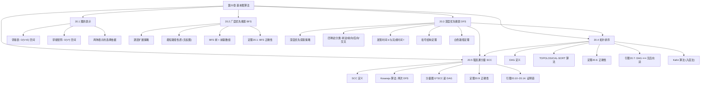

## 相关笔记

- 节笔记：[[20.1 图的表示]]、[[20.2 广度优先搜索]]、[[20.3 深度优先搜索]]、[[20.4 拓扑排序]]、[[20.5 强连通分量]]
- 前置章节：[[第19章_用于不相交集合的数据结构-章节汇总]]

> [!abstract] 概览
> 全章围绕**基本图算法**展开，系统介绍图的表示方法和两大图遍历策略（BFS 和 DFS），以及它们在拓扑排序和强连通分量分解中的应用。章节从图的两种标准表示出发（20.1），依次介绍广度优先搜索（20.2）和深度优先搜索（20.3）两种遍历算法，然后利用 DFS 的完成时间性质解决 DAG 上的拓扑排序问题（20.4），最后通过两次 DFS + 转置图实现有向图的强连通分量分解（20.5）。全章的核心主线是 **DFS 的完成时间性质**——它不仅是拓扑排序的基础，也是 SCC 分解的关键工具。

---

## 知识结构总览

---

## 核心概念回顾

### 图的两种表示对比

| 比较维度 | 邻接表（Adjacency List） | 邻接矩阵（Adjacency Matrix） |
|:---------|:------------------------|:----------------------------|
| 空间 | $O(V + E)$ | $O(V^2)$ |
| 检查边 $(u,v)$ 是否存在 | $O(\deg(u))$ | $O(1)$ |
| 枚举所有邻接顶点 | $O(\deg(u))$ | $O(V)$ |
| 添加边 | $O(1)$ | $O(1)$ |
| 删除边 | $O(\deg(u))$ | $O(1)$ |
| 适合的图 | 稀疏图（$E \ll V^2$） | 稠密图（$E \approx V^2$） |
| 自环/平行边 | 可自然支持 | 需额外处理 |
| 加权图 | 存储权重在链表节点中 | 存储权重在矩阵元素中 |

> [!tip] 表示选择的经验法则
> **当 $E = O(V)$（稀疏图）时**，邻接表空间 $O(V)$ 远优于邻接矩阵 $O(V^2)$。**当 $E = \Theta(V^2)$（稠密图）时**，两者空间相当，邻接矩阵的 $O(1)$ 边查询更优。实际工程中，大多数图是稀疏的（社交网络、Web 图、道路网），因此邻接表更为常用。

### BFS vs DFS 对比

| 比较维度 | BFS（广度优先搜索） | DFS（深度优先搜索） |
|:---------|:-------------------|:-------------------|
| 核心策略 | 逐层扩展（队列） | 深入探索（栈/递归） |
| 数据结构 | 队列（FIFO） | 栈（LIFO）/ 递归调用栈 |
| 时间复杂度 | $O(V + E)$ | $O(V + E)$ |
| 空间复杂度 | $O(V)$（队列 + 颜色 + 距离 + 前驱） | $O(V)$（递归栈 + 颜色 + 时间戳 + 前驱） |
| 最短路径 | **保证**找到无权图最短路径 | 不保证 |
| 边分类 | 树边、非树边（不细分） | 树边、前向边、后向边、交叉边 |
| 发现/完成时间 | 无（只有距离） | 有 $d[v]$ 和 $f[v]$ |
| 适用场景 | 最短路径、层序遍历 | 拓扑排序、SCC、环检测、连通性 |
| 非递归实现 | 自然（队列） | 需要显式栈 |
| 连通分量 | 可检测 | 可检测 |
| 典型应用 | Web 爬虫、社交网络最短路径 | 编译器分析、游戏 AI、迷宫生成 |

### 五种算法复杂度汇总

| 算法 | 时间复杂度 | 空间复杂度 | 适用图类型 | 核心功能 |
|:-----|:-----------|:-----------|:-----------|:---------|
| BFS | $O(V + E)$ | $O(V)$ | 无向/有向 | 最短路径（无权）、层序遍历 |
| DFS | $O(V + E)$ | $O(V)$ | 无向/有向 | 连通性、环检测、边分类 |
| 拓扑排序（DFS） | $O(V + E)$ | $O(V)$ | 有向无环图 | 线性排列 |
| 拓扑排序（Kahn） | $O(V + E)$ | $O(V + E)$ | 有向无环图 | 线性排列 + 回路检测 |
| Kosaraju SCC | $O(V + E)$ | $O(V + E)$ | 有向图 | 强连通分量分解 |

---

五节内容对比

| 维度 | 20.1 图的表示 | 20.2 广度优先搜索 | 20.3 深度优先搜索 | 20.4 拓扑排序 | 20.5 强连通分量 |
|:-----|:-------------|:-----------------|:-----------------|:-------------|:-----------------|
| **核心主题** | 图的数据结构基础 | 层序遍历策略 | 深度探索策略 | DAG 的线性排列 | 有向图的分解 |
| **关键概念** | 邻接表、邻接矩阵 | 距离、前驱、BFS 树 | 发现/完成时间、四种边、括号结构 | DAG、完成时间递减 | SCC、转置图、分量图 |
| **关键定理** | — | 定理20.1（BFS 正确性） | 白色路径定理、括号结构 | 定理20.6（拓扑排序正确性）、引理20.7 | 定理20.9（SCC 正确性）、引理20.10~20.14 |
| **核心算法** | — | BFS | DFS | TOPOLOGICAL-SORT | STRONGLY-CONNECTED-COMPONENTS |
| **时间复杂度** | — | $O(V + E)$ | $O(V + E)$ | $O(V + E)$ | $O(V + E)$ |
| **数据结构** | 数组 + 链表 | 队列 | 栈/递归 | DFS + 链表 | DFS + 转置图 |
| **难度** | ⭐⭐ | ⭐⭐ | ⭐⭐⭐ | ⭐⭐⭐ | ⭐⭐⭐⭐ |
| **设计思想** | 表示选择决定效率 | "波纹扩散" | "一条路走到黑" | 完成时间蕴含依赖序 | 两次 DFS + 图的对称性 |
| **与其他节关系** | 全章基础 | DFS 的"兄弟" | 拓扑排序和 SCC 的基础 | 依赖 DFS 完成时间 | 依赖 DFS + 拓扑排序思想 |

---

关键定理索引

| 定理/引理 | 结论 | 所在节笔记 |
|:----------|:-----|:-----------|
| 定理20.1 | BFS 正确性：BFS 正确计算从源点 $s$ 到所有可达顶点的最短路径距离 | [[20.2 广度优先搜索]] |
| 引理（BFS 最短路径） | 对每条边 $(u, v) \in E$，$\delta(s, v) \le \delta(s, u) + 1$ | [[20.2 广度优先搜索]] |
| 白色路径定理 | $v$ 是 $u$ 在 DFS 树中的后代当且仅当在发现 $u$ 时存在一条从 $u$ 到 $v$ 的全白色路径 | [[20.3 深度优先搜索]] |
| 括号结构定理 | 三个等价条件刻画 DFS 树中的祖先-后代关系 | [[20.3 深度优先搜索]] |
| 边分类定理 | DFS 将有向图的边分为四类：树边、前向边、后向边、交叉边 | [[20.3 深度优先搜索]] |
| 引理20.7 | 有向图是 DAG 当且仅当 DFS 不产生后向边 | [[20.4 拓扑排序]] |
| 定理20.6 | 如果 $G$ 是 DAG，则 TOPOLOGICAL-SORT 产生拓扑排序 | [[20.4 拓扑排序]] |
| 引理20.10 | 若 SCC $C$ 有边指向 $C'$，则 $f(C) > f(C')$ | [[20.5 强连通分量]] |
| 引理20.12 | $G^T$ 的 DFS 树恰好包含一个 SCC 的所有顶点 | [[20.5 强连通分量]] |
| 定理20.9 | Kosaraju 算法正确计算所有 SCC | [[20.5 强连通分量]] |

---

易混淆点汇总

### BFS vs DFS

| 维度 | BFS | DFS |
|:-----|:---|:---|
| 探索顺序 | "先近后远"（按距离递增） | "先深后广"（沿一条路径深入） |
| 最短路径 | 保证（无权图） | 不保证 |
| 实现方式 | 迭代（队列） | 递归或迭代（栈） |
| 栈溢出风险 | 无 | 递归实现可能栈溢出 |
| 适用场景 | 找最短路径、层序遍历 | 找所有路径、检测环、拓扑排序 |

### 拓扑排序 vs SCC

| 维度 | 拓扑排序 | 强连通分量 |
|:-----|:---------|:-----------|
| 适用图类型 | DAG（有向无环图） | 一般有向图 |
| 输出 | 顶点的线性排列 | 顶点的分组（等价类） |
| 核心操作 | 一次 DFS + 按完成时间排列 | 两次 DFS + 转置图 |
| 回路处理 | 无回路时才有解 | 有回路时 SCC 包含多个顶点 |
| 关系 | 分量图的拓扑排序 | 先求 SCC，再对分量图做拓扑排序 |

### DAG vs 一般有向图

| 维度 | DAG | 一般有向图 |
|:-----|:---|:-----------|
| 有向回路 | 无 | 可能有 |
| 拓扑排序 | 存在 | 可能不存在 |
| 最长路径 | $O(V + E)$ 可解 | NP 难 |
| DFS 边分类 | 无后向边 | 可能有后向边 |
| 分量图 | 就是自身（每个顶点是一个 SCC） | 可能有多顶点 SCC |

### 邻接表 vs 邻接矩阵

| 维度 | 邻接表 | 邻接矩阵 |
|:-----|:-------|:---------|
| 空间 | $O(V + E)$ | $O(V^2)$ |
| 边查询 | $O(\deg(u))$ | $O(1)$ |
| 邻接枚举 | $O(\deg(u))$ | $O(V)$ |
| 适合图类型 | 稀疏图 | 稠密图 |
| BFS/DFS 复杂度 | $O(V + E)$ | $O(V^2)$ |
| 实际使用 | 更常见 | 特定场景 |

### 树边 vs 前向边 vs 后向边 vs 交叉边

| 边类型 | 定义 | 出现条件 |
|:-------|:-----|:---------|
| 树边 | DFS 发现新顶点时经过的边 | 所有图 |
| 前向边 | 从祖先指向非直接后代的后代 | 有向图 |
| 后向边 | 从后代指向祖先 | 有向图（DAG 中不存在） |
| 交叉边 | 其他所有边（非树边、非前向、非后向） | 有向图 |

> [!warning] 后向边是有向回路的充要条件
> **在有向图中，DFS 产生后向边当且仅当图包含有向回路。** 这是引理20.7的核心结论，也是判断 DAG 的线性时间方法。注意：无向图中不存在前向边和交叉边的区分——无向图的 DFS 只有树边和"后向边"（实际是连接到已访问节点的边）。

---

补充理解（跨节综合视角）

### 图算法的演进脉络

本章的五节内容形成了一条清晰的逻辑链：

**基础层（20.1）：图的表示。** 邻接表和邻接矩阵是所有图算法的基石。表示的选择直接影响算法的效率——邻接表使 BFS 和 DFS 达到 $O(V + E)$，而邻接矩阵下它们退化为 $O(V^2)$。

**遍历层（20.2-20.3）：BFS 和 DFS。** 两种遍历策略是图算法的"元操作"。BFS 的核心贡献是最短路径性质（无权图），DFS 的核心贡献是完成时间性质和边分类。DFS 的完成时间 $f[v]$ 是本章后续所有高级应用的基础。

**应用层（20.4-20.5）：拓扑排序和 SCC。** 拓扑排序直接利用 DFS 的完成时间递减性质；SCC 算法则进一步利用完成时间 + 转置图的对称性。两者都建立在 DFS 的理论框架之上。

> [!tip] DFS 完成时间：贯穿全章的核心线索
> **DFS 的完成时间 $f[v]$ 是本章最重要的概念**。它蕴含了丰富的结构信息：
> - $f[u] > f[v]$ 意味着 $u$ 的"探索范围"包含 $v$（$v$ 是 $u$ 的后代或在 $u$ 之前完成）
> - 按完成时间递减排列得到拓扑排序（20.4节）
> - 完成时间最大的顶点位于源 SCC 中（20.5节引理20.10）
> - SCC 间的完成时间关系决定了 Kosaraju 算法的处理顺序
>
> 理解了完成时间的含义，就理解了本章后半部分的核心。

### 工程选型指南

| 场景 | 推荐算法 | 理由 |
|:-----|:---------|:-----|
| 无权图最短路径 | BFS | $O(V + E)$，保证最短路径 |
| 检测图中是否有环 | DFS | 检查是否有后向边（有向）或回边（无向） |
| DAG 上的任务调度 | 拓扑排序（DFS 或 Kahn） | 确定执行顺序 |
| 编译依赖管理 | Kahn 算法 | 天然支持循环依赖检测 |
| 社交网络社区发现 | Kosaraju 或 Tarjan SCC | 识别紧密社区 |
| 2-SAT 求解 | Kosaraju SCC | 检查变量与其否定是否同 SCC |
| 大规模稀疏图 | 邻接表 + BFS/DFS | $O(V + E)$ 空间和时间 |
| 小规模稠密图 | 邻接矩阵 + BFS/DFS | $O(1)$ 边查询，实现简单 |
| 迷宫生成 | DFS（随机化） | DFS 天然生成迷宫的"长走廊"结构 |
| Web 爬虫 | BFS | 按距离递增爬取，优先爬取"近"的页面 |

### 实际应用场景汇总

**1. 社交网络**
- BFS：计算两个人之间的"度数距离"（六度分隔理论）
- SCC：发现紧密社区（互相关注的用户群）

**2. 编译器**
- DFS：控制流图分析、循环检测
- SCC：识别循环结构（基本块 SCC）
- 拓扑排序：确定模块编译顺序

**3. 路由与导航**
- BFS：无权图最短路径（如地铁线路的最少换乘）
- DFS：路径枚举（如所有可能的路线）

**4. 版本管理**
- 拓扑排序：Git 的提交排序、Makefile 的依赖编译
- SCC：检测循环依赖

**5. 网络安全**
- BFS：恶意软件传播范围分析
- DFS：检测网络中的异常回路

**6. 推荐系统**
- BFS：基于图的协同过滤（二跳/三跳邻居推荐）

### 与其他章节的联系

| 本章概念 | 关联章节 | 关联概念 | 关联类型 |
|:---------|:---------|:---------|:---------|
| 图的表示 | 第11章 散列表 | 邻接表实现 | 基础依赖 |
| BFS 最短路径 | 第22章 单源最短路径 | Dijkstra、Bellman-Ford | 推广关系 |
| DFS | 第21章 最小生成树 | DFS 用于环检测 | 应用关系 |
| 拓扑排序 | 第22章 DAG 最短路径 | DAG 上的松弛顺序 | 应用关系 |
| SCC | 第22章 差分约束系统 | 差分约束系统的可行性 | 应用关系 |
| 并查集（连通分量） | 第19章 不相交集合 | Kruskal 中的连通分量 | 类比关系 |

---

习题索引

### 20.1 图的表示

| 题号 | 核心考点 | 难度 |
|:-----|:---------|:-----:|
| 22.1-1 | 邻接矩阵和邻接表的转换 | ⭐ |
| 22.1-2 | 邻接表表示的图上的 BFS 和 DFS | ⭐ |
| 22.1-3 | 稀疏图上邻接矩阵的 BFS/DFS 复杂度 | ⭐⭐ |
| 22.1-4 | 有向图的邻接表表示（入边和出边） | ⭐ |
| 22.1-5 | 邻接表和邻接矩阵的混合表示 | ⭐⭐ |
| 22.1-6 | 加权图的邻接表表示 | ⭐ |

### 20.2 广度优先搜索

| 题号 | 核心考点 | 难度 |
|:-----|:---------|:-----:|
| 22.2-1 | BFS 在给定图上的执行过程 | ⭐ |
| 22.2-2 | BFS 树的性质 | ⭐⭐ |
| 22.2-3 | BFS 的非递归实现 | ⭐⭐ |
| 22.2-4 | BFS 的入队列顺序 | ⭐ |
| 22.2-5 | BFS 中的颜色数组简化 | ⭐⭐ |
| 22.2-6 | BFS 计算最短路径树 | ⭐⭐ |
| 22.2-7 | BFS 在无向图上的性质 | ⭐⭐ |
| 22.2-8 | BFS 与队列的关系 | ⭐ |

### 20.3 深度优先搜索

| 题号 | 核心考点 | 难度 |
|:-----|:---------|:-----:|
| 22.3-1 | DFS 在给定图上的执行过程 | ⭐ |
| 22.3-2 | DFS 的发现时间和完成时间 | ⭐⭐ |
| 22.3-3 | 括号结构定理的应用 | ⭐⭐ |
| 22.3-4 | DFS 边分类 | ⭐⭐ |
| 22.3-5 | DFS 的非递归实现 | ⭐⭐⭐ |
| 22.3-6 | DFS 树的性质 | ⭐⭐ |
| 22.3-7 | DFS 与栈的关系 | ⭐⭐ |
| 22.3-8 | DFS 在无向图上的边分类 | ⭐⭐ |
| 22.3-9 | DFS 在有向图上的边分类 | ⭐⭐ |
| 22.3-10 | DFS 的前驱子图性质 | ⭐⭐⭐ |
| 22.3-11 | DFS 与拓扑排序的关系 | ⭐⭐ |
| 22.3-12 | DFS 的白色路径定理 | ⭐⭐⭐ |
| 22.3-13 | DFS 的正确性证明 | ⭐⭐⭐ |

### 20.4 拓扑排序

| 题号 | 核心考点 | 难度 |
|:-----|:---------|:-----:|
| 22.4-1 | 给定 DAG 的拓扑排序 | ⭐ |
| 22.4-2 | DAG 中路径计数（动态规划 + 拓扑排序） | ⭐⭐ |
| 22.4-3 | DAG 中支配顶点判定 | ⭐⭐ |
| 22.4-4 | DAG 中最长路径（动态规划 + 拓扑排序） | ⭐⭐ |
| 22.4-5 | Kahn 算法（基于入度的拓扑排序） | ⭐⭐ |

### 20.5 强连通分量

| 题号 | 核心考点 | 难度 |
|:-----|:---------|:-----:|
| 22.5-1 | 给定图的 SCC | ⭐ |
| 22.5-2 | 判断图是否只有一个 SCC | ⭐ |
| 22.5-3 | 构造分量图 | ⭐⭐ |
| 22.5-4 | SCC 间完成时间不等式推广 | ⭐⭐ |
| 22.5-5 | 分量图中 SCC 的入度和出度 | ⭐⭐ |
| 22.5-6 | DFS 边分类与 SCC 的关系 | ⭐⭐⭐ |
| 22.5-7 | 半连通性判定 | ⭐⭐⭐ |

**全章习题统计：** 6 + 8 + 13 + 5 + 7 = **39道题**

---

## 参见Wiki

（待补充）

#学习/算法导论/第20章-基本图算法
#学习/算法导论/基本图算法/章节汇总
