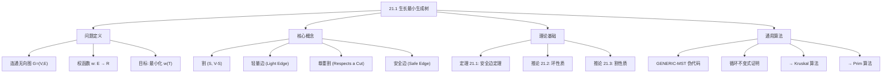
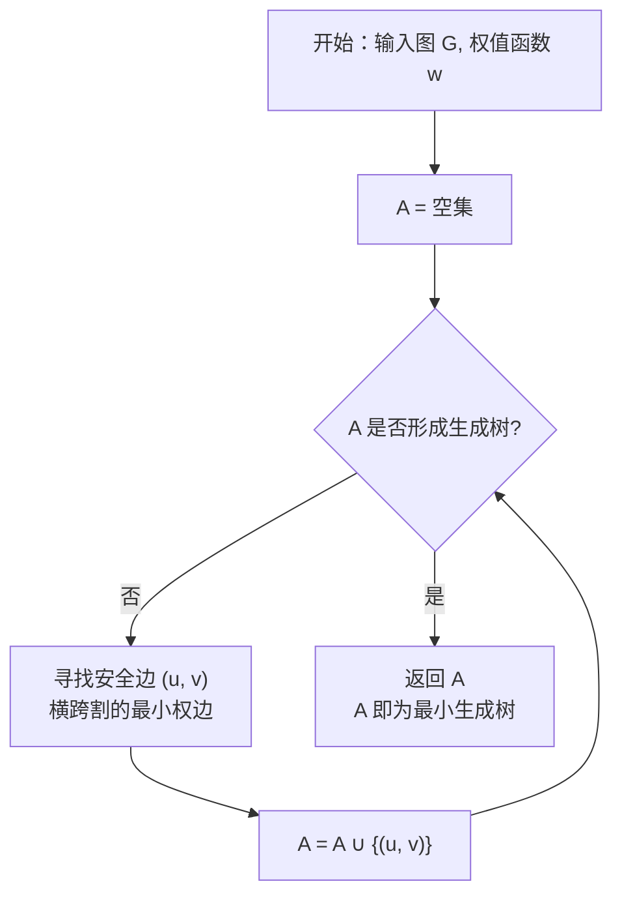

## 相关笔记

- 后续笔记：[[21.2 Kruskal与Prim算法]]
- 前置知识：[[第20章_基本图算法-章节汇总]]、[[第19章_用于不相交集合的数据结构-章节汇总]]、[[第15章_贪心算法-章节汇总]]

> [!abstract] 概览
> 本节介绍==最小生成树==（Minimum Spanning Tree, MST）问题的基本理论框架。核心思想是：通过==割==（cut）与==轻量边==（light edge）的概念，建立==安全边定理==（Theorem 21.1），为贪心策略提供严格的数学基础。在此基础上给出==通用MST算法==（GENERIC-MST）的伪代码与正确性证明。
>
> **要点列表：**
> - MST 问题要求在连通无向图中找到一棵权值之和最小的生成树
> - ==割==将顶点集划分为两个非空子集，==轻量边==是穿过割的最小权边
> - ==安全边定理==是所有MST算法的理论基石：轻量边一定是安全边
> - ==GENERIC-MST== 通过不断添加安全边来"生长"MST，其正确性由循环不变式保证
> - 推论 21.2（环性质）与推论 21.3（割性质）是安全边定理的重要推论

---

## 知识结构总览



---

## 核心思想

> [!tip] 核心思路
> MST问题的贪心策略可以用一句话概括：**每一步都选择不会"犯错误"的边加入当前集合**。所谓"不会犯错误"，就是加入这条边后，当前边集仍然是某棵MST的子集。安全边定理保证了：只要选择穿过某个割的轻量边，就一定不会犯错误。GENERIC-MST算法正是基于这一原理，不断找到安全边并加入集合，直到形成完整的MST。

### 2.1 最小生成树问题定义

> [!def] 最小生成树（Minimum Spanning Tree）
> 给定一个==连通无向图== $G = (V, E)$ 和一个权函数 $w: E \to \mathbb{R}$，$G$ 的一棵==生成树==（spanning tree）是 $G$ 的一个==连通无环==子图 $T = (V, E_T)$，其中 $E_T \subseteq E$。生成树的==权值==定义为：
>
> $$w(T) = \sum_{(u,v) \in E_T} w(u,v)$$
>
> 如果 $T$ 是 $G$ 的所有生成树中权值最小的一棵，即对所有生成树 $T'$ 都有 $w(T) \leq w(T')$，则称 $T$ 为 $G$ 的一棵==最小生成树==（Minimum Spanning Tree, MST）。

**直观理解：** 想象你要用最低成本修建道路将所有城市连通。每条可能的道路有一个修建成本（边权），生成树保证所有城市连通且没有冗余道路（无环），最小生成树则保证总成本最低。

**生成树的基本性质：**
- 一棵生成树恰好有 $|V| - 1$ 条边
- 去掉生成树中任意一条边，图将不再连通
- 给生成树中任意两个不相邻的顶点之间添加一条边，将恰好产生一个环

### 2.2 割（Cut）

> [!def] 割（Cut）
> 无向图 $G = (V, E)$ 的一个==割== $(S, V - S)$ 是顶点集 $V$ 的一个划分，将 $V$ 分为两个==非空==子集 $S$ 和 $V - S$。
>
> 如果一条边 $(u, v) \in E$ 的一个端点在 $S$ 中、另一个端点在 $V - S$ 中，则称该边==穿过==（crosses）割 $(S, V - S)$。

**直观理解：** 割就像是在地图上画一条线，把所有城市分成两组。穿过割的边就是连接这两组城市的道路。

### 2.3 轻量边（Light Edge）

> [!def] 轻量边（Light Edge）
> 穿过割 $(S, V - S)$ 的边中，权值最小的边称为该割的==轻量边==。如果有多条权值相同的最小权边，则它们都是轻量边。

**注意：** 轻量边是相对于某个特定割而言的。同一条边可能是某个割的轻量边，但不是另一个割的轻量边。

### 2.4 尊重割（Respects a Cut）

> [!def] 尊重割（Respects a Cut）
> 设 $A \subseteq E$ 是一个边集。如果 $A$ 中没有任何边穿过割 $(S, V - S)$，则称割 $(S, V - S)$ ==尊重==边集 $A$。

**直观理解：** "尊重"意味着割的两边之间没有已经被选中的边，即 $A$ 中的边要么完全在 $S$ 内部，要么完全在 $V - S$ 内部。

### 2.5 安全边（Safe Edge）

> [!def] 安全边（Safe Edge）
> 设 $A$ 是 $E$ 的一个子集，且 $A$ 包含在某棵 MST 中。如果边 $(u, v)$ 满足 $A \cup \{(u, v)\}$ 也包含在某棵 MST 中，则称 $(u, v)$ 是 $A$ 的==安全边==。

**直观理解：** 安全边就是"加入后不会犯错误"的边——加入它之后，当前边集仍然是某棵最小生成树的子集。MST贪心算法的核心就是每次都选择安全边。

### 2.6 定理 21.1（安全边定理）

> [!def] 定理 21.1（安全边定理 / Theorem 21.1）
> 设 $G = (V, E)$ 是一个连通无向图，$A \subseteq E$ 是包含在某棵 MST 中的边集，$(S, V - S)$ 是 $G$ 中==尊重== $A$ 的任意割，$(u, v)$ 是穿过割 $(S, V - S)$ 的一条==轻量边==。则边 $(u, v)$ 对 $A$ 是==安全的==。

> [!faq]- 证明
> 设 $T$ 是一棵包含 $A$ 的 MST，我们需要证明 $T' = T - \{(x, y)\} \cup \{(u, v)\}$ 也是一棵 MST，其中 $(x, y)$ 是在 $T$ 中连接 $S$ 和 $V - S$ 的边。
>
> **【第一步：证明 $T$ 中存在穿过割 $(S, V-S)$ 的边】**
> **第一步：证明 $T$ 中存在穿过割 $(S, V - S)$ 的边。**
>
> $T$ 是一棵生成树，因此 $T$ 连通所有顶点。特别地，$S$ 中的每个顶点与 $V - S$ 中的每个顶点之间在 $T$ 中存在唯一路径。因此 $T$ 中至少存在一条边穿过割 $(S, V - S)$。设 $(x, y)$ 是 $T$ 中穿过割 $(S, V - S)$ 的某条边（不妨设 $x \in S$，$y \in V - S$）。
>
> **【第二步：加入 $(u,v)$ 形成环 $C$，$(u,v)$ 和 $(x,y)$ 都穿过割】**
> **第二步：构造 $T'$。**
>
> 将 $(u, v)$ 加入 $T$，由于 $T$ 中已经存在从 $u$ 到 $v$ 的唯一路径（经过 $(x, y)$），加入 $(u, v)$ 后会形成一个环 $C$。在这个环 $C$ 中，$(u, v)$ 和 $(x, y)$ 都穿过割 $(S, V - S)$。
>
> 从 $T \cup \{(u, v)\}$ 中删除 $(x, y)$，得到：
> $$T' = T - \{(x, y)\} \cup \{(u, v)\}$$
>
> **【第三步：$T'$ 有 $|V|-1$ 条边且连通，是生成树】**
> **第三步：证明 $T'$ 是一棵生成树。**
>
> - $T'$ 有 $|V| - 1$ 条边（删除一条，添加一条，数量不变）
> - $T'$ 连通：删除 $(x, y)$ 后 $T$ 断成两个连通分量，但 $(u, v)$ 连接了这两个分量（因为 $u \in S$，$v \in V - S$）
> - 因此 $T'$ 是一棵生成树
>
> **【第四步：$w(u,v) \le w(x,y)$ $\Rightarrow$ $w(T') \le w(T)$，$T'$ 也是 MST】**
> **第四步：证明 $T'$ 也是一棵 MST。**
>
> 由于 $(u, v)$ 是割 $(S, V - S)$ 的轻量边，有：
> $$w(u, v) \leq w(x, y)$$
>
> 因此：
> $$w(T') = w(T) - w(x, y) + w(u, v) \leq w(T)$$
>
> 由于 $T$ 已经是 MST（权值最小），所以 $w(T') = w(T)$，即 $T'$ 也是一棵 MST。
>
> **【第五步：$(x,y) \notin A$（割尊重 $A$），故 $A \subseteq T' \subseteq T'$，$(u,v) \in T'$】**
> **第五步：证明 $T'$ 包含 $A \cup \{(u, v)\}$。**
>
> - $A \subseteq T$（已知条件）
> - $(x, y) \notin A$：因为割 $(S, V - S)$ 尊重 $A$，$A$ 中没有边穿过该割，而 $(x, y)$ 穿过该割
> - 因此 $A \subseteq T - \{(x, y)\} \subseteq T'$
> - 又 $(u, v) \in T'$
> - 所以 $A \cup \{(u, v)\} \subseteq T'$
>
> 综上，$(u, v)$ 对 $A$ 是安全的。$\blacksquare$

### 2.7 推论 21.2（环性质）

> [!def] 推论 21.2（环性质 / Cycle Property）
> 设 $C$ 是连通图 $G = (V, E)$ 中关于边集 $A$ 的一个==环==（即 $A$ 中的边加上边 $(u, v)$ 后形成的环），且 $(u, v)$ 是 $C$ 中权值==唯一最大==的边。则 $(u, v)$ 不属于任何包含 $A$ 的 MST。

> [!faq]- 证明
> **【反证：假设 MST $T$ 包含 $(u,v)$，环 $C$ 中存在 $w(x,y) < w(u,v)$，替换得 $w(T') < w(T)$，矛盾】**
> 用反证法。假设存在一棵 MST $T$ 包含 $A$ 和 $(u, v)$。
>
> 由于 $T$ 包含 $A \cup \{(u, v)\}$，而 $A \cup \{(u, v)\}$ 中存在环 $C$，但 $T$ 是一棵树（无环），因此 $T$ 不可能包含 $A \cup \{(u, v)\}$ 的所有边。
>
> 更精确地说：$T$ 包含 $A$ 和 $(u, v)$。考虑 $A$ 中构成环 $C$ 的那些边（不含 $(u, v)$ 的部分），设这些边在 $T$ 中形成一条从 $u$ 到 $v$ 的路径 $P$。$P$ 加上 $(u, v)$ 形成环 $C$。
>
> 由于 $(u, v)$ 是 $C$ 中唯一最大权边，路径 $P$ 上存在某条边 $(x, y)$ 满足 $w(x, y) < w(u, v)$。
>
> 构造 $T' = T - \{(u, v)\} \cup \{(x, y)\}$：
> - $T'$ 连通：删除 $(u, v)$ 后，$u$ 和 $v$ 仍通过路径 $P$ 上的其余边连通
> - $T'$ 有 $|V| - 1$ 条边
> - $w(T') = w(T) - w(u, v) + w(x, y) < w(T)$
>
> 这与 $T$ 是 MST 矛盾。因此 $(u, v)$ 不属于任何包含 $A$ 的 MST。$\blacksquare$

### 2.8 推论 21.3（割性质）

> [!def] 推论 21.3（割性质 / Cut Property）
> 设 $(S, V - S)$ 是连通图 $G = (V, E)$ 的任意割，$(u, v)$ 是穿过该割的==唯一最小权边==。则 $(u, v)$ 属于==某棵== MST。

> [!faq]- 证明
> **【令 $A = \emptyset$，割尊重空集，$(u,v)$ 是轻量边，由定理21.1得安全边】**
> 令 $A = \emptyset$。显然 $A$ 包含在某棵 MST 中（因为空集是任何 MST 的子集）。
>
> 割 $(S, V - S)$ 显然尊重 $A$（因为 $A$ 为空，没有任何边穿过割）。
>
> $(u, v)$ 是穿过该割的唯一最小权边，因此 $(u, v)$ 是该割的轻量边。
>
> 由定理 21.1（安全边定理），$(u, v)$ 对 $A = \emptyset$ 是安全的，即 $(u, v)$ 属于某棵 MST。$\blacksquare$

### 2.9 GENERIC-MST 伪代码

> [!tip] 算法执行流程
> 1. **初始化**边集 A 为**空集**
> 2. **while A 尚未形成生成树**（边数 < |V|-1 或顶点未全部连通）
> 3. 找一条**安全边 (u, v)**——即横跨割 (A, V-A) 的**最小权边**
> 4. 将安全边 (u, v) **加入 A**
> 5. 循环结束时返回 A，A 即为一棵**最小生成树**



```
GENERIC-MST(G, w)
1  A ← ∅
2  while A does not form a spanning tree
3      find an edge (u, v) that is safe for A
4      A ← A ∪ {(u, v)}
5  return A
```

**算法说明：**
- 第1行初始化边集 $A$ 为空集
- 第2-4行的 while 循环不断寻找 $A$ 的安全边并加入 $A$
- 当 $A$ 形成生成树时循环终止（此时 $A$ 有 $|V| - 1$ 条边且连通所有顶点）
- 第5行返回的就是一棵 MST

> [!tip] 关键观察
> 在 while 循环的每次迭代中，$A$ 始终是某棵MST的子集。循环开始时 $A = \emptyset$，显然满足这一性质。每次加入安全边后，该性质仍然保持。当循环结束时，$A$ 形成生成树且是某棵MST的子集，因此 $A$ 本身就是一棵MST。

### 2.10 GENERIC-MST 正确性证明

> [!def] 循环不变式
> **在 while 循环（第2-4行）每次迭代开始时：**
> - $A$ 是某棵 MST 的子集

**初始化（Initialization）：**
> **【$A = \emptyset$ 是任何 MST 的子集，循环不变式平凡成立】**
- 在第一次迭代之前，$A = \emptyset$
- 空集是任何 MST 的子集（因为空集不排除任何边）
- 循环不变式成立

**维护（Maintenance）：**
> **【安全边定义保证 $A \cup \{(u,v)\}$ 仍是某 MST 的子集】**
- 由循环不变式，在当前迭代开始时 $A$ 是某棵 MST（设为 $T$）的子集
- 第3行找到一条安全边 $(u, v)$
- 由安全边的定义，$A \cup \{(u, v)\}$ 也包含在某棵 MST 中
- 第4行将 $(u, v)$ 加入 $A$
- 因此在下次迭代开始时，新的 $A$ 仍然是某棵 MST 的子集
- 循环不变式得到维护

**终止（Termination）：**
> **【$A$ 是生成树且是 MST 子集，故 $A$ 本身就是 MST】**
- 循环在 $A$ 形成生成树时终止
- 由循环不变式，$A$ 是某棵 MST 的子集
- $A$ 本身是一棵生成树，且是某棵 MST 的子集
- 因此 $A$ 本身就是一棵 MST
- **算法正确性得证**

> [!note] 关于安全边的寻找
> GENERIC-MST 本身并没有指定如何高效地找到安全边。这正是 Kruskal 算法和 Prim 算法要解决的问题——它们各自以不同的方式高效地识别安全边：
> - **Kruskal 算法**：在所有不与 $A$ 形成环的边中选权值最小的——利用==不相交集合==数据结构（[[第19章_用于不相交集合的数据结构-章节汇总]]）高效判断是否形成环
> - **Prim 算法**：在所有连接 $A$ 中树与树外顶点的边中选权值最小的——利用==优先队列==高效选取最小权边
>
> 两种算法的具体实现将在 [[21.2 Kruskal与Prim算法]] 中详细介绍。

---

## 补充理解与拓展

> [!info] MST 的发明历史
>
> 最小生成树问题有着丰富的历史，可以追溯到20世纪初的欧洲：
>
> | 人物 | 年份 | 贡献 |
> |:-----|:----:|:-----|
> | Otakar Borůvka | 1926 | 第一个给出MST问题解法，用于优化摩拉维亚地区的电力网络铺设 |
> | Vojtěch Jarník | 1930 | 独立提出了一种MST算法（后来被称为Jarník算法，即Prim算法的先驱） |
> | Joseph Kruskal | 1956 | 提出了著名的Kruskal算法，发表在《Proceedings of the AMS》上 |
> | Robert C. Prim | 1957 | 提出了Prim算法，最初由Jarník在1930年独立发现 |
>
> **Borůvka的原始问题：** 1926年，摩拉维亚（今捷克共和国的一部分）的电力公司希望以最低成本建设电力传输网络，将各个城镇连接到发电站。Borůvka作为Brno大学的数学家，将这个工程问题抽象为图论中的最小生成树问题，并给出了第一个系统性的解决方案。他的论文"O jistém problému minimálním"（On a Certain Minimal Problem）发表在《Práce moravské přírodovědecké společnosti》上。
>
> 来源：Nesetril, J. & Nesetrilova, H., "The Origins of Minimal Spanning Tree Algorithms - Borůvka and Jarník", DMV, 2007; Northeastern University CS2510 Lecture Notes

> [!info] MST 的实际应用
>
> 最小生成树在工程和科学中有广泛的应用：
>
> | 应用领域 | 具体场景 | 说明 |
> |:---------|:---------|:-----|
> | 网络设计 | 通信网络、电力网络、管道铺设 | 以最低成本连接所有节点，MST直接给出最优解 |
> | 聚类分析 | 单连接聚类（Single-linkage clustering） | 删除MST中最大的 $k-1$ 条边，得到 $k$ 个聚类 |
> | 近似算法 | TSP的2倍近似 | 对MST进行前序遍历，跳过重复访问的顶点，得到不超过2倍最优的TSP解 |
> | 图像分割 | 将像素视为图顶点 | MST用于识别图像中的区域边界 |
> | 生物学 | 系统发育树构建 | 用MST近似物种间的进化关系 |
> | VLSI设计 | 芯片布线优化 | 最小化芯片上连线总长度 |
>
> 来源：CSDN技术文档; 掘金图算法系列; 51CTO网络优化专题

> [!info] MST 与贪心策略的关系
>
> MST问题是==贪心算法==（[[第15章_贪心算法-章节汇总]]）的经典成功案例。回顾贪心算法的两个核心要素：
>
> 1. **贪心选择性质（Greedy-Choice Property）：** 可以通过局部最优选择来构造全局最优解。在MST问题中，安全边定理保证了：选择轻量边（局部最优）不会排除全局最优解的存在。
> 2. **最优子结构（Optimal Substructure）：** 问题的最优解包含子问题的最优解。在MST问题中，如果 $(u, v)$ 是安全边，则 $A \cup \{(u, v)\}$ 的最优扩展就是原问题的最优扩展。
>
> 安全边定理本质上就是MST问题的贪心选择性质的严格表述。它告诉我们：不需要考虑所有可能的边，只需要在每一步选择"安全"的边即可。GENERIC-MST框架将这一思想抽象为通用算法，而Kruskal和Prim则分别给出了不同的"安全边选取策略"。
>
> 与活动选择问题（[[15.1 活动选择问题]]）和哈夫曼编码（[[15.3 哈夫曼编码]]）类似，MST的贪心策略之所以有效，是因为问题本身具有特殊的数学结构（割与轻量边的关系），使得局部最优选择不会"锁死"全局最优解。

---

## 易混淆点与辨析

> [!warning] 误区：MST 包含所有顶点对之间的最短路径
> ❌ **错误理解：** "最小生成树是最优的，所以它应该包含图中任意两个顶点之间的最短路径"
>
> ✅ **正确理解：** MST 保证的是==所有边的权值之和最小==，而不是任意两点间的路径最短。MST 中两个顶点之间的路径可能比原图中的最短路径长得多。
>
> **具体例子：** 考虑一个三角形图，三个顶点 $a, b, c$，边权为 $w(a,b) = 2$，$w(b,c) = 2$，$w(a,c) = 3$。MST 包含边 $(a,b)$ 和 $(b,c)$，总权值为 4。但在 MST 中，$a$ 到 $c$ 的路径是 $a \to b \to c$，长度为 4，而原图中 $a$ 到 $c$ 的直接边权值仅为 3。MST 中 $a$ 到 $c$ 的路径（长度4）大于最短路径（长度3）。
>
> **区分：** 最短路径树（Shortest Path Tree）以某个源点为根，保证从源点到所有其他顶点的路径最短；MST 则保证所有边的总权值最小。两者是不同的优化目标。

> [!warning] 误区：安全边就是轻量边
> ❌ **错误理解：** "安全边和轻量边是同一个概念"
>
> ✅ **正确理解：** 轻量边和安全边是不同层次的概念：
> - **轻量边**是相对于某个==割==而言的：穿过该割的最小权边
> - **安全边**是相对于某个==边集== $A$ 而言的：加入 $A$ 后仍属于某棵 MST 的边
>
> **关系：** 定理 21.1 说明：如果 $(u, v)$ 是尊重 $A$ 的某个割的轻量边，则 $(u, v)$ 对 $A$ 是安全的。即==轻量边一定是安全边==（在尊重 $A$ 的割中）。
>
> **但反过来不成立！** 安全边不一定是轻量边。习题 21.1-2 给出了反例：安全边可以不是任何割的轻量边。安全边的定义更宽泛，它只要求加入后不破坏"属于某棵MST"的性质。

> [!warning] 误区：MST 可以直接应用于有向图
> ❌ **错误理解：** "MST算法可以处理有向图，只需要把有向边当作无向边处理"
>
> ✅ **正确理解：** MST 问题只对==无向图==有定义。有向图中的对应问题是"最小生成树形图"（Minimum Spanning Arborescence），也称为"最小有向生成树"，由 Edmonds（1967）提出了解法（Chu-Liu/Edmonds 算法）。这是一个不同的问题，不能简单地用无向图的MST算法解决。
>
> **原因：** 在有向图中，"生成树"的概念需要指定根节点，且边的方向使得连通性的定义发生变化。有向图中的最小树形图问题比无向图的MST问题更复杂。

> [!warning] 误区：所有边权不同时MST一定唯一
> ❌ **错误理解：** "只要所有边权不同，MST就一定唯一"
>
> ✅ **正确理解：** 这个说法是正确的——当图中所有边权互不相同时，MST是唯一的。但习题 21.1-6 表明，反过来不成立：即使存在权值相同的边，MST也可能是唯一的。
>
> **唯一性的充分条件（非必要）：** 所有边权不同 $\Rightarrow$ MST唯一。
>
> **反例（唯一MST但存在等权边）：** 三角形图 $a, b, c$，边权 $w(a,b) = 1$，$w(a,c) = 1$，$w(b,c) = 2$。唯一MST包含边 $(a,b)$ 和 $(a,c)$，总权值为2。但割 $(\{a\}, \{b,c\})$ 有两条等权轻量边 $(a,b)$ 和 $(a,c)$，说明并非每个割都有唯一轻量边。

---

## 习题精选

| 题号 | 题目描述 | 难度 | 来源 |
|:----:|----------|:----:|:-----|
| 21.1-1 | 设 $(u, v)$ 是连通图 $G$ 中的一条最小权边，证明 $(u, v)$ 属于 $G$ 的某棵 MST | ⭐ | CLRS |
| 21.1-2 | Sabatier教授猜想安全边一定是轻量边，给出反例反驳 | ⭐⭐ | CLRS |
| 21.1-3 | 证明若边 $(u, v)$ 属于某棵MST，则它是某个割的轻量边 | ⭐⭐ | CLRS |
| 21.1-4 | 给出一个连通图的例子，使得所有"某个割的轻量边"的集合不构成MST | ⭐⭐ | CLRS |
| 21.1-5 | 设 $e$ 是连通图 $G$ 某个环上的最大权边，证明存在一棵不含 $e$ 的MST | ⭐⭐ | CLRS |

> [!faq]- 21.1-1 解答
> **目标：** 设 $(u, v)$ 是连通图 $G$ 中的一条最小权边，证明 $(u, v)$ 属于 $G$ 的某棵 MST。
>
> **证明：**
>
> **【取割 $(\{u\}, V-\{u\})$，$(u,v)$ 是最小权边故为轻量边，由割性质得证】**
> 令 $A = \emptyset$。$A$ 显然包含在某棵 MST 中。
>
> 考虑割 $(S, V - S)$，其中 $S = \{u\}$。该割尊重 $A$（因为 $A$ 为空）。
>
> 由于 $(u, v)$ 是 $G$ 中权值最小的边，$(u, v)$ 穿过割 $(\{u\}, V - \{u\})$，且不存在比它更小的边。因此 $(u, v)$ 是该割的轻量边。
>
> 由推论 21.3（割性质），$(u, v)$ 属于某棵 MST。$\blacksquare$
>
> 来源：walkccc.me/CLRS/Chap23/23.1/

> [!faq]- 21.1-2 解答
> **目标：** 给出反例，证明安全边不一定是轻量边。
>
> **反例：**
>
> 构造图 $G$，包含 4 个顶点 $u, v, w, z$ 和 3 条边：
> - $(u, v)$，权值为 3
> - $(u, w)$，权值为 1
> - $(w, z)$，权值为 2
>
> 注意 $G$ 本身就是一棵树（3条边，4个顶点），所以 $G$ 的唯一MST就是 $G$ 自身。
>
> 令 $A = \{(u, w)\}$。$A$ 是 MST 的子集。
>
> 令 $S = \{u, w\}$，则割 $(S, V - S) = (\{u, w\}, \{v, z\})$。$A$ 中没有边穿过该割（$(u, w)$ 的两个端点都在 $S$ 中），所以该割尊重 $A$。
>
> 穿过该割的边只有 $(u, v)$（权值3），所以 $(u, v)$ 是该割的唯一轻量边。
>
> 但 $(u, v)$ 也是 $A$ 的安全边（因为 $G$ 是树，$A \cup \{(u, v)\}$ 仍是 MST 的子集）。
>
> 现在考虑另一个割 $S' = \{u\}$，割 $(\{u\}, \{v, w, z\})$ 也尊重 $A$。穿过该割的边有 $(u, v)$（权值3）和 $(u, w)$（权值1）。该割的轻量边是 $(u, w)$，不是 $(u, v)$。
>
> 因此 $(u, v)$ 是安全边，但它不是所有尊重 $A$ 的割的轻量边。Sabatier教授的猜想（安全边一定是轻量边）是错误的。$\blacksquare$
>
> 来源：walkccc.me/CLRS/Chap23/23.1/

> [!faq]- 21.1-3 解答
> **目标：** 证明若边 $(u, v)$ 属于某棵 MST，则它是某个割的轻量边。
>
> **证明：**
>
> **【删除 $(u,v)$ 将 $T$ 分为两个连通分量 $V_0$ 和 $V_1$，$(u,v)$ 穿过割 $(V_0, V_1)$】**
> 设 $T$ 是一棵包含 $(u, v)$ 的 MST。从 $T$ 中删除边 $(u, v)$，$T$ 被分成两个连通分量（因为树中删除任意一条边都会使图断成两个连通分量）。设这两个连通分量的顶点集分别为 $V_0$ 和 $V_1$。
>
> 考虑割 $(V_0, V_1)$。边 $(u, v)$ 穿过该割（因为 $u$ 和 $v$ 分别在两个不同的连通分量中）。
>
> **【反证：若存在 $w(x,y) < w(u,v)$ 穿过割，替换后得到更小生成树，矛盾】**
> 我们需要证明 $(u, v)$ 是该割的轻量边。用反证法：假设存在另一条边 $(x, y)$ 穿过割 $(V_0, V_1)$ 且 $w(x, y) < w(u, v)$。
>
> 将 $(x, y)$ 加入 $T - \{(u, v)\}$。由于 $(x, y)$ 连接了 $V_0$ 和 $V_1$，图重新变为连通的。又因为 $T - \{(u, v)\}$ 有 $|V| - 2$ 条边，加入 $(x, y)$ 后有 $|V| - 1$ 条边且连通，所以它是一棵生成树。
>
> 这棵新生成树的权值为 $w(T) - w(u, v) + w(x, y) < w(T)$，与 $T$ 是 MST 矛盾。
>
> 因此不存在比 $(u, v)$ 更小的穿过割 $(V_0, V_1)$ 的边，即 $(u, v)$ 是该割的轻量边。$\blacksquare$
>
> 来源：walkccc.me/CLRS/Chap23/23.1/

> [!faq]- 21.1-4 解答
> **目标：** 给出一个连通图的例子，使得所有"某个割的轻量边"的集合不构成 MST。
>
> **反例：**
>
> 考虑完全图 $K_3$（三角形），三个顶点 $a, b, c$，三条边权值均为 1：
> - $w(a, b) = 1$
> - $w(b, c) = 1$
> - $w(a, c) = 1$
>
> 由于所有边权相同，每条边都是每个穿过它的割的轻量边。
>
> 考虑所有可能的割：
> - 割 $(\{a\}, \{b, c\})$：轻量边为 $(a, b)$ 和 $(a, c)$
> - 割 $(\{b\}, \{a, c\})$：轻量边为 $(a, b)$ 和 $(b, c)$
> - 割 $(\{c\}, \{a, b\})$：轻量边为 $(a, c)$ 和 $(b, c)$
>
> 所有"某个割的轻量边"的集合是 $\{(a, b), (a, c), (b, c)\}$，即所有三条边。但 MST 只能有 $3 - 1 = 2$ 条边。三条边包含一个环，不是生成树。
>
> 因此"所有轻量边的集合"不构成 MST。$\blacksquare$

> [!faq]- 21.1-5 解答
> **目标：** 设 $e$ 是连通图 $G$ 某个环上的最大权边，证明存在一棵不含 $e$ 的 MST。
>
> **证明：**
>
> **【取割切断环 $C$，$e$ 是 $C$ 上最大权边，故 $e$ 不是该割的轻量边】**
> 设 $e = (u, v)$ 是 $G$ 中某个环 $C$ 上的唯一最大权边。
>
> 任取一个割 $(S, V - S)$，使得环 $C$ 上的顶点不全在 $S$ 中，也不全在 $V - S$ 中（即环 $C$ 被"切断"了）。由于 $C$ 是一个环，至少有两条边穿过该割。
>
> 对于这样的割，$e$ 不是轻量边——因为 $C$ 上至少还有另一条边穿过该割，而 $e$ 是 $C$ 上的最大权边，所以那条边的权值严格小于 $e$ 的权值。
>
> 对于不被 $C$ "切断"的割，$e$ 根本不穿过该割，自然也不是轻量边。
>
> **【$e$ 不是任何割的轻量边，由推论21.3的逆否命题，存在不含 $e$ 的 MST】**
> 因此 $e$ 不是任何割的轻量边。由推论 21.3 的逆否命题（如果一条边不属于任何割的轻量边集合，则它不是任何MST的必要边），$e$ 不属于任何MST的必要边，即存在不含 $e$ 的 MST。$\blacksquare$
>
> 来源：walkccc.me/CLRS/Chap23/23.1/

---

## 视频学习指南

| 资源 | 主题 | 链接 | 说明 |
|:-----|:-----|:-----|:-----|
| MIT 6.006 Lecture 12 | Minimum Spanning Trees | 待补充 | MST基础理论与Prim算法 |
| Abdul Bari | Prim's Algorithm | 待补充 | 逐步动画演示 |
| Abdul Bari | Kruskal's Algorithm | 待补充 | 逐步动画演示 |
| WilliamFiset | MST Introduction | 待补充 | MST系列入门 |
| 3Blue1Brown | Spanning Trees | 待补充 | 可视化直觉理解 |

---

## 教材原文

> [!quote] CLRS 第4版 21.1节——最小生成树问题定义
> In this chapter, we shall examine algorithms for finding a minimum spanning tree of an undirected graph. Given a connected, undirected graph $G = (V, E)$ with a weight function $w: E \to \mathbb{R}$, we wish to find an acyclic subset $T \subseteq E$ that connects all of the vertices and whose total weight $w(T) = \sum_{(u,v) \in T} w(u,v)$ is minimized. Since $T$ is acyclic and connects all vertices, it must form a tree, which we call a spanning tree because it spans the graph $G$. We call the problem of determining the tree $T$ the minimum-spanning-tree problem.

> [!quote] CLRS 第4版 21.1节——割与安全边的定义
> We define a cut $(S, V - S)$ of an undirected graph $G = (V, E)$ as any partition of $V$ into two nonempty sets $S$ and $V - S$. An edge $(u, v) \in E$ crosses the cut $(S, V - S)$ if one of its endpoints is in $S$ and the other is in $V - S$. We say that a cut respects a set $A$ of edges if no edge in $A$ crosses the cut. An edge is a light edge crossing a cut if its weight is the minimum of any edge crossing the cut. Note that there can be more than one light edge crossing a cut in the case of ties. More generally, we say that an edge is a light edge satisfying a given property if it has the minimum weight of any edge satisfying the property.

> [!quote] CLRS 第4版 21.1节——安全边的定义
> When we say that an edge $(u, v)$ is a safe edge for a set $A$ of edges, we mean that $A \cup \{(u, v)\}$ is a subset of some MST.

> [!quote] CLRS 第4版 21.1节——定理 21.1（安全边定理）
> Let $G = (V, E)$ be a connected, undirected graph with a real-valued weight function $w$ defined on $E$. Let $A$ be a subset of $E$ that is included in some minimum spanning tree for $G$, let $(S, V - S)$ be any cut of $G$ that respects $A$, and let $(u, v)$ be a light edge crossing $(S, V - S)$. Then, edge $(u, v)$ is safe for $A$.

> [!quote] CLRS 第4版 21.1节——GENERIC-MST
> We can use the loop invariant shown in Figure 21.1 to show that the generic algorithm returns a minimum spanning tree.
>
> **Loop Invariant:** $A$ is a subset of some minimum spanning tree.
>
> **Initialization:** After line 1, the set $A$ is empty, and it is trivially a subset of any minimum spanning tree.
>
> **Maintenance:** The loop in lines 2-4 maintains the invariant by adding only safe edges.
>
> **Termination:** The set $A$ is a spanning tree by the termination condition, and it is a subset of some minimum spanning tree by the invariant. Since any spanning tree that is a subset of a minimum spanning tree must itself be a minimum spanning tree, $A$ is a minimum spanning tree.

---

## 参见Wiki

> [!note] 概念页尚未创建
- [[算法导论/theorems/安全边定理]]
- [[算法导论/theorems/Prim正确性定理]]
- [[算法导论/theorems/Kruskal正确性定理]]

#学习/算法导论/第21章-最小生成树 #学习/算法导论/最小生成树/生长最小生成树
