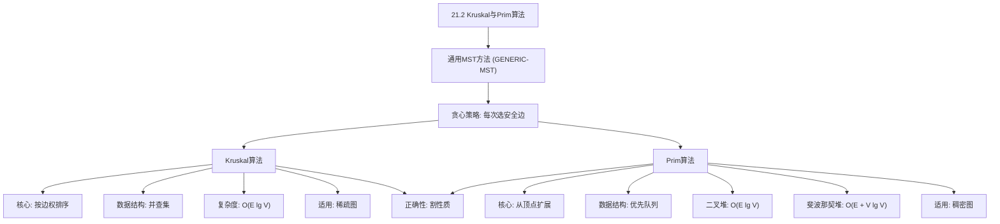
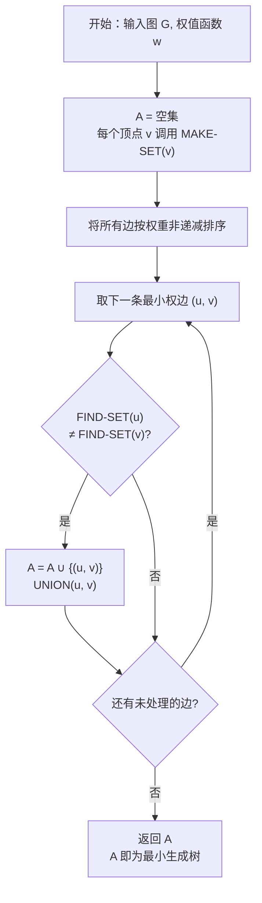
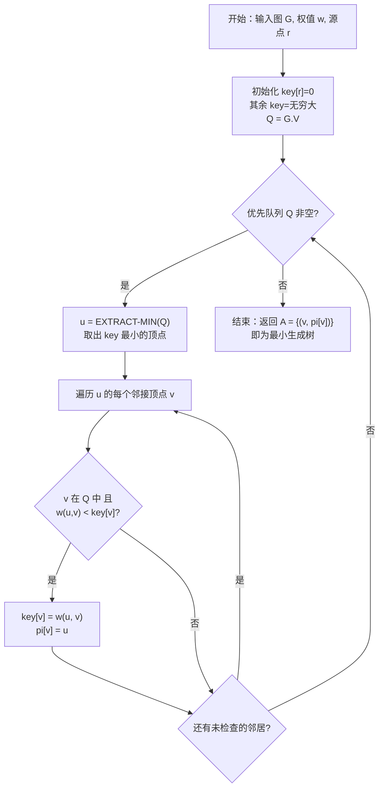

## 相关笔记

- 前置笔记：[[21.1 生长最小生成树]]
- 关联章节：[[第20章_基本图算法-章节汇总]]、[[第19章_用于不相交集合的数据结构-章节汇总]]
- 关联概念：[[算法导论/concepts/不相交集合数据结构]]、[[算法导论/concepts/路径压缩]]、[[算法导论/concepts/按秩合并]]、[[算法导论/concepts/优先队列]]

> [!abstract] 概览
> 本节介绍两种经典的==最小生成树（Minimum Spanning Tree, MST）==算法——==Kruskal算法==和==Prim算法==。两者都基于==贪心策略==，利用[[21.1 生长最小生成树]]中建立的==通用MST方法==（GENERIC-MST），但选择了不同的安全边选取方式。Kruskal算法从==边==的视角出发，将所有边按权排序后依次考虑，借助[[算法导论/concepts/不相交集合数据结构]]判断是否形成环；Prim算法从==顶点==的视角出发，从一个起点开始扩展，借助[[算法导论/concepts/优先队列]]选择最小权边。
>
> **要点列表：**
> - Kruskal算法的运行时间为 ==$O(E \lg V)$==，主要开销来自排序 $O(E \lg E) = O(E \lg V)$，并查集操作共 $O(E \alpha(V))$
> - Prim算法使用二叉堆时运行时间为 ==$O(E \lg V)$==，使用斐波那契堆时为 ==$O(E + V \lg V)$==
> - 两种算法的正确性都基于==割性质（cut property）==
> - Kruskal适合==稀疏图==，Prim适合==稠密图==

---

## 知识结构总览



---

## 核心思想

### 2.1 Kruskal算法

> [!tip] 核心思路
> Kruskal算法的基本策略是：**将所有边按权值从小到大排序，依次考虑每条边，如果这条边连接的两个顶点当前不在同一个连通分量中（即不形成环），就将其加入MST**。算法维护一个森林（forest），初始时每个顶点自成一棵树，随着边的加入，树逐渐合并，最终形成一棵完整的生成树。
>
> 这个过程就像在一个群岛中修建桥梁：先修最便宜的桥，只要两座岛之间还没有通路就修，直到所有岛都连通。

#### MST-KRUSKAL 伪代码

> [!tip] 算法执行流程
> 1. 将所有边按**权重从小到大排序**
> 2. **初始化** A 为空集，每个顶点通过 **MAKE-SET** 自成一个独立集合
> 3. 按权重**从小到大遍历**每条边 (u, v)
> 4. 若 u 和 v **不在同一集合**（FIND-SET 不同），将边**加入 A**，调用 **UNION** 合并集合
> 5. 遍历完所有边后**返回 A**，A 即为最小生成树



```
MST-KRUSKAL(G, w)
1  A ← ∅
2  for each vertex v ∈ G.V
3      MAKE-SET(v)
4  sort the edges of G.E into nondecreasing order by weight w
5  for each edge (u, v) ∈ G.E, taken in nondecreasing order by weight
6      if FIND-SET(u) ≠ FIND-SET(v)
7          A ← A ∪ {(u, v)}
8          UNION(u, v)
9  return A
```

> [!def] Kruskal算法
> **输入：** 连通无向图 $G = (V, E)$，权值函数 $w: E \to \mathbb{R}$
> **输出：** 最小生成树的边集 $A$
>
> **算法步骤：**
> 1. **初始化：** $A \leftarrow \emptyset$，为每个顶点 $v$ 创建一个单元素集合（使用 MAKE-SET）
> 2. **排序：** 将 $E$ 中的边按权值 $w$ 非递减排序
> 3. **贪心选择：** 依次考虑每条边 $(u, v)$：
>    - 若 $u$ 和 $v$ 属于不同集合（FIND-SET 判断），则 $(u, v)$ 不会形成环
>    - 将 $(u, v)$ 加入 $A$，合并 $u$ 和 $v$ 所在的集合（UNION）
> 4. **返回：** $A$ 即为最小生成树的边集

#### 正确性证明

> [!faq]- Kruskal算法正确性证明
> **目标：** 证明 Kruskal 算法返回的边集 $A$ 是 $G$ 的一棵最小生成树。
>
> **证明：**
>
> **【第一步：建立 Kruskal 森林与并查集的对应关系】**
> 我们将 Kruskal 算法与 GENERIC-MST 框架对应起来。GENERIC-MST 维护一个满足如下条件的边集 $A$：$A$ 是某棵最小生成树的子集。在每次迭代中，GENERIC-MST 从安全边集合中选取一条边加入 $A$。
>
> **第一步：建立对应关系。** 在 Kruskal 算法执行过程中的任意时刻，森林 $A$ 将 $V$ 划分为若干连通分量。每个连通分量恰好对应一个由并查集维护的集合。设某时刻森林中的连通分量为 $C_1, C_2, \ldots, C_k$，则并查集中恰好有 $k$ 个集合，分别对应这些连通分量。
>
> **【第二步：证明被选边是横跨割 $(C, V-C)$ 的轻量边，由割性质得安全边】**
> **第二步：证明每条被选中的边都是安全边。** 设算法正在考虑边 $(u, v)$，且 FIND-SET$(u) \neq$ FIND-SET$(v)$。令 $C$ 为包含 $u$ 的连通分量（即并查集中 $u$ 所在的集合）。考虑割 $(C, V - C)$：
>
> - $(u, v)$ 是横跨割 $(C, V - C)$ 的边（因为 $u \in C$，$v \notin C$）
> - $(u, v)$ 是当前考虑的权值最小的边（因为边已按权值排序，且之前所有权值更小的边要么已被加入 $A$，要么连接同一连通分量内的顶点而被跳过）
> - $A$ 中不存在横跨割 $(C, V - C)$ 的边（否则 $u$ 和 $v$ 就会在同一连通分量中，与 FIND-SET 判断矛盾）
>
> 因此，$(u, v)$ 是横跨割 $(C, V - C)$ 的==轻量边==（light edge）。由==割性质==（见 [[21.1 生长最小生成树]]），$(u, v)$ 对 $A$ 是安全边。
>
> **【第三步：归纳论证——初始、归纳步、终止】**
> **第三步：归纳论证。**
> - **初始：** $A = \emptyset$，显然是某棵 MST 的子集（空集是任何集合的子集）
> - **归纳步：** 假设当前 $A$ 是某棵 MST $T$ 的子集。算法选出的边 $(u, v)$ 是安全边，因此 $A \cup \{(u,v)\}$ 也是某棵 MST 的子集
> - **终止：** 当 $A$ 包含 $|V| - 1$ 条边时，$A$ 是一棵生成树。由于 $A$ 始终是某棵 MST 的子集，且 $A$ 本身就是生成树，因此 $A$ 就是一棵 MST
>
> **Kruskal 算法正确性得证。** $\blacksquare$

#### 运行时间分析

> [!def] 时间复杂度 $O(E \lg V)$
> Kruskal 算法的运行时间由以下部分组成：
>
> 1. **初始化（第1-3行）：** 对 $|V|$ 个顶点执行 MAKE-SET，耗时 $O(V)$
> 2. **排序（第4行）：** 对 $|E|$ 条边按权值排序，耗时 $O(E \lg E) = O(E \lg V)$（因为 $|E| \leq |V|^2$，所以 $\lg |E| \leq 2 \lg |V|$）
> 3. **主循环（第5-8行）：** 共 $|E|$ 次迭代
>    - 每次 FIND-SET 操作：$O(\alpha(V))$（使用按秩合并+路径压缩的并查集）
>    - 每次 UNION 操作：$O(\alpha(V))$
>    - 总计：$O(E \cdot \alpha(V))$，其中 $\alpha$ 是==反阿克曼函数==（见[[算法导论/concepts/反阿克曼函数]]），增长极慢，实践中可视为常数
>
> **总运行时间：** $O(V) + O(E \lg V) + O(E \alpha(V)) = $ ==$O(E \lg V)$==
>
> 排序是主要瓶颈，并查集操作的总开销在渐近意义上被排序掩盖。

---

### 2.2 Prim算法

> [!tip] 核心思路
> Prim算法的基本策略是：**从一个任意起始顶点开始，维护一个"已到达"顶点集合，每次选择连接已到达集合与未到达集合中权值最小的边，将该边和对应顶点加入MST**。算法通过 `key` 数组记录每个未到达顶点连接到已到达集合的最小边权，通过优先队列高效选取最小 key 的顶点。
>
> 这个过程就像从一座城市开始修路：每次都选择从已修好路的城市到未修路的城市中造价最低的路段，逐步扩展路网直到所有城市连通。

#### MST-PRIM 伪代码

> [!tip] 算法执行流程
> 1. **初始化**：源点 r 的 key=0，其余顶点 key=无穷大，所有顶点放入**优先队列 Q**
> 2. **while 优先队列 Q 非空**
> 3. 从 Q 中**取出 key 最小**的顶点 u
> 4. **遍历 u 的每个邻接顶点 v**：若 v 仍在 Q 中且 w(u,v) < key[v]，**更新** key[v]=w(u,v) 和前驱 pi[v]=u
> 5. Q 为空时结束，最小生成树由 **A = {(v, pi[v])}** 给出



```
MST-PRIM(G, w, r)
1  for each u ∈ G.V
2      key[u] ← ∞
3      π[u] ← NIL
4  key[r] ← 0
5  Q ← G.V
6  while Q ≠ ∅
7      u ← EXTRACT-MIN(Q)
8      for each v ∈ G.Adj[u]
9          if v ∈ Q and w(u, v) < key[v]
10             π[v] ← u
11             key[v] ← w(u, v)
```

> [!def] Prim算法
> **输入：** 连通无向图 $G = (V, E)$，权值函数 $w: E \to \mathbb{R}$，起始顶点 $r \in V$
> **输出：** 最小生成树，由前驱子图 $\{(v, \pi[v]) : v \in V - \{r\}\}$ 给出
>
> **关键数据结构：**
> - `key[u]`：顶点 $u$ 连接到当前生成树的最小边权（初始为 $\infty$，起始顶点 $r$ 的 key 为 $0$）
> - `π[u]`：$u$ 在最小生成树中的父节点
> - `Q`：包含所有未加入MST的顶点的最小优先队列，以 `key` 值为优先级
>
> **算法步骤：**
> 1. **初始化：** 所有 `key` 设为 $\infty$，所有 `π` 设为 NIL，`key[r] = 0`
> 2. **主循环：** 当 $Q$ 非空时：
>    - 从 $Q$ 中取出 `key` 最小的顶点 $u$（EXTRACT-MIN）
>    - 对 $u$ 的每个邻居 $v$，若 $v$ 仍在 $Q$ 中且 $w(u,v) < \text{key}[v]$，则更新 `π[v] = u`，`key[v] = w(u,v)`（DECREASE-KEY）

#### 正确性证明

> [!faq]- Prim算法正确性证明
> **目标：** 证明 Prim 算法返回的边集 $\{(v, \pi[v]) : v \in V - \{r\}\}$ 是 $G$ 的一棵最小生成树。
>
> **证明：**
>
> **【第一步：定义割 $(S, V-S)$，$S$ 为已从 $Q$ 中取出的顶点集合】**
> **第一步：定义割。** 在算法执行的任意时刻，令 $S$ 为已经从优先队列 $Q$ 中取出（即已加入MST）的顶点集合，$V - S$ 为仍在 $Q$ 中的顶点集合。则 $(S, V - S)$ 构成图 $G$ 的一个割。
>
> **【第二步：归纳证明 key[v] = 连接 $v$ 与 $S$ 的最小边权】**
> **第二步：证明 key 的含义。** 我们断言：对每个顶点 $v \in V - S$，$\text{key}[v]$ 等于连接 $v$ 与 $S$ 中某个顶点的所有边中的最小权值。即：
>
> $$\text{key}[v] = \min\{w(v, x) : x \in S \text{ 且 } (v, x) \in E\}$$
>
> **用归纳法证明此断言：**
> - **初始：** $S = \{r\}$，$\text{key}[r] = 0$（已取出），对其他顶点 $v$，若 $(r, v) \in E$ 则 $\text{key}[v] = w(r, v)$，否则 $\text{key}[v] = \infty$。断言成立。
> - **归纳步：** 假设在取出顶点 $u$ 之前断言成立。取出 $u$ 后，$S' = S \cup \{u\}$。对 $u$ 的每个邻居 $v \in Q$，算法检查 $w(u, v) < \text{key}[v]$ 是否成立。若成立，则更新 $\text{key}[v] = w(u, v)$，这恰好反映了 $v$ 连接到 $S'$ 的最小边权。对 $u$ 的非邻居顶点，key 不变，断言仍然成立。
>
> **【第三步：$(v,u)$ 横跨割 $(S, V-S)$，key[u] 是最小横跨边权，故为轻量边】**
> **第三步：证明每次选取的边是安全边。** 当算法从 $Q$ 中取出 `key` 最小的顶点 $u$ 时，令 $v = \pi[u]$（$v$ 是使 $\text{key}[u]$ 取得最小值的那个 $S$ 中的顶点）。则：
>
> - 边 $(v, u)$ 横跨割 $(S, V - S)$
> - $\text{key}[u] = w(v, u)$ 是所有横跨割 $(S, V - S)$ 的边中的最小权值（因为 $u$ 是 $Q$ 中 key 最小的顶点，而 key 恰好记录了每个 $V - S$ 中顶点连接到 $S$ 的最小边权）
> - 因此 $(v, u)$ 是横跨割 $(S, V - S)$ 的==轻量边==
>
> 由==割性质==（见 [[21.1 生长最小生成树]]），$(v, u)$ 是安全边。
>
> **【第四步：归纳论证，与 Kruskal 类似】**
> **第四步：归纳论证。** 与 Kruskal 类似，初始 $A = \emptyset$ 是某 MST 的子集。每次加入安全边后，$A$ 仍然是某 MST 的子集。最终 $A$ 包含 $|V| - 1$ 条边，形成生成树，因此就是 MST。
>
> **Prim 算法正确性得证。** $\blacksquare$

#### 运行时间分析

> [!def] 时间复杂度——二叉堆实现 $O(E \lg V)$
> 使用二叉堆作为优先队列时，Prim 算法的运行时间由以下部分组成：
>
> 1. **初始化（第1-5行）：** 构建 $|V|$ 个元素的优先队列，耗时 $O(V)$
> 2. **主循环（第6-11行）：**
>    - 第7行 EXTRACT-MIN：共执行 $|V|$ 次，每次 $O(\lg V)$，总计 $O(V \lg V)$
>    - 第9-11行的 DECREASE-KEY 操作：对每条边最多执行一次，共 $|E|$ 次，每次 $O(\lg V)$，总计 $O(E \lg V)$
>
> **总运行时间：** $O(V) + O(V \lg V) + O(E \lg V) = $ ==$O(E \lg V)$==

> [!def] 时间复杂度——斐波那契堆实现 $O(E + V \lg V)$
> 使用斐波那契堆（Fibonacci heap）作为优先队列时：
>
> 1. **EXTRACT-MIN：** $|V|$ 次，斐波那契堆的摊还代价为 $O(\lg V)$ 每次，总计 $O(V \lg V)$
> 2. **DECREASE-KEY：** $|E|$ 次，斐波那契堆的摊还代价为 $O(1)$ 每次，总计 $O(E)$
>
> **总运行时间：** ==$O(E + V \lg V)$==
>
> 当图较稠密（$|E| = \Omega(V \lg V)$）时，斐波那契堆的优势明显。当图较稀疏（$|E| = O(V)$）时，两种实现的渐近复杂度相同，均为 $O(V \lg V)$。

---

### 2.3 Kruskal vs Prim 对比

> [!tip] 选型要点
> **Kruskal算法**适合边数较少的稀疏图，因为它的时间主要花在排序上，边越少排序越快。**Prim算法**适合边数较多的稠密图，尤其是使用斐波那契堆时，其复杂度仅取决于顶点数和边数的线性组合。在实际工程中，如果图的邻接信息已经以邻接矩阵形式给出，Prim的 $O(V^2)$ 简单实现往往是最实用的选择。

| 比较维度 | Kruskal 算法 | Prim 算法 |
|:---------|:------------|:----------|
| **核心视角** | 全局——按边权排序，逐条考虑 | 局部——从一个顶点向外扩展 |
| **贪心策略** | 选权最小且不形成环的边 | 选连接已到达集与未到达集的最小权边 |
| **关键数据结构** | 并查集（Union-Find） | 优先队列（Priority Queue） |
| **二叉堆实现** | $O(E \lg V)$ | $O(E \lg V)$ |
| **最优实现** | $O(E \lg V)$（排序瓶颈） | $O(E + V \lg V)$（斐波那契堆） |
| **邻接矩阵实现** | $O(V^2 \lg V)$ | $O(V^2)$ |
| **适合场景** | 稀疏图（$E = O(V)$） | 稠密图（$E = \Omega(V^2)$） |
| **并行化潜力** | 较好（排序可并行） | 较差（顺序扩展） |
| **边权相同时** | 可能产生不同MST（取决于排序稳定性） | 可能产生不同MST（取决于EXTRACT-MIN的选取） |

> [!def] Kruskal与Prim的时间复杂度对比定理
> 对于连通无向图 $G = (V, E)$：
>
> - **Kruskal算法**的运行时间为 $O(E \lg V)$，无论使用何种优先级队列实现，排序步骤始终是瓶颈
> - **Prim算法**使用二叉堆时为 $O(E \lg V)$，使用斐波那契堆时为 $O(E + V \lg V)$
> - 当 $|E| = \omega(V)$（即边数渐近多于顶点数）时，Prim 的斐波那契堆实现渐近快于二叉堆实现
> - 当 $|E| = O(V)$（稀疏图）时，Kruskal 和 Prim（无论哪种堆）的渐近复杂度相同

---

## 补充理解与拓展

> [!info] MST算法的历史
>
> 最小生成树问题有着丰富的历史，三种经典算法的发现时间远早于现代计算机科学：
>
> 1. **Borůvka算法（1926年）**：Otakar Borůvka 是最早系统研究 MST 问题的人。他在解决摩拉维亚电力网络最优化的实际问题时提出了这一算法。Borůvka 算法的特点是每一步中每个连通分量同时选择到其他分量的最小权边，因此天然支持==并行化==，在现代分布式计算中仍有应用。
>
> 2. **Jarník算法（1930年）**：Vojtěch Jarník 独立发现了本质上与 Prim 相同的算法，但他的论文长期被忽视。为表彰他的贡献，该算法在中欧文献中常被称为"Jarník算法"或"Prim-Jarník算法"。
>
> 3. **Kruskal算法（1956年）**：Joseph Kruskal 在贝尔实验室（Bell Labs）工作期间发表。他的论文 "On the shortest spanning subtree of a graph and the traveling salesman problem" 发表于 *Proceedings of the American Mathematical Society*。值得注意的是，Kruskal 当时只有23岁。
>
> 4. **Prim算法（1957年）**：Robert C. Prim 在贝尔实验室独立发现了该算法。他的论文发表于 *Bell System Technical Journal*。Edsger Dijkstra 也在1959年独立发现了同一算法，因此该算法有时也被称为"Dijkstra-Prim算法"。

> [!info] 最小生成树的实际工程应用
>
> MST 在工程和科学中有广泛的应用场景：
>
> **网络设计与基础设施：**
> - **通信网络设计**：在电信和计算机网络中，MST 用于确定连接所有节点的最优拓扑，最小化线缆长度和建设成本
> - **电力传输网络**：确定电力线路的最优布局，确保所有区域获得电力供应的同时最小化线路总长度
> - **管道铺设**：天然气、自来水等管道系统的最优铺设方案
> - **交通网络规划**：道路网络规划中，用最小总长度连接所有城市
>
> **计算机科学与工程：**
> - **VLSI电路布线**：在超大规模集成电路设计中，MST 用于优化元件间的连线布局，最小化线长和功耗
> - **聚类分析（Single-linkage clustering）**：计算 MST 后删除权值最大的 $k-1$ 条边，将图分割为 $k$ 个连通分量，每个分量即为一个聚类
> - **图像分割**：基于像素相似度图构建 MST，用于图像的区域分割
> - **近似算法**：MST 是旅行商问题（TSP）2-近似算法的基础，也是 Steiner 树问题近似算法的组成部分
> - **网络协议**：生成树协议（STP, Spanning Tree Protocol）用于防止以太网中的环路，虽然不直接使用 MST，但理论基础相同
>
> **数据科学与生物信息学：**
> - **系统发育树构建**：在进化生物学中，MST 用于构建物种间的进化关系树
> - **手写字体识别**：使用 MST 进行特征提取
>
> 来源：[Fiveable - Applications of MSTs](https://library.fiveable.me/graph-theory/unit-6/applications-minimum-spanning-trees/study-guide/iOCen7zmSVC9rHOF)；[UT Dallas - Applications of MSTs](https://personal.utdallas.edu/~besp/teaching/mst-applications.pdf)；[AlgoCademy - Prim's Algorithm Guide](https://algocademy.com/blog/prims-algorithm-a-comprehensive-guide-to-minimum-spanning-trees/)

---

## 易混淆点与辨析

> [!warning] 辨析：Kruskal vs Prim 适用场景选择
> ❌ **常见误区：** "两种算法时间复杂度都是 $O(E \lg V)$，选哪个都一样"
>
> ✅ **正确理解：** 虽然使用二叉堆时两者的渐近复杂度相同，但实际性能和最优实现差异显著：
>
> - **稀疏图（$|E| \approx |V|$）：** Kruskal 的排序开销为 $O(V \lg V)$，并查集操作接近线性，整体效率高。Prim 使用二叉堆时 DECREASE-KEY 操作次数虽少（$O(V)$），但 EXTRACT-MIN 仍需 $O(V \lg V)$，两者相当。Prim 使用斐波那契堆时也为 $O(V \lg V)$，优势不大。
>
> - **稠密图（$|E| \approx |V|^2$）：** Kruskal 的排序开销为 $O(V^2 \lg V)$，而 Prim 使用邻接矩阵的简单实现只需 $O(V^2)$，优势明显。Prim 使用斐波那契堆时为 $O(V^2)$，同样优于 Kruskal。
>
> - **图以邻接矩阵给出时：** Prim 的 $O(V^2)$ 实现无需额外数据结构，代码简洁，通常是最佳选择。

> [!warning] 辨析：Prim的key数组 vs Dijkstra的dist数组
> ❌ **常见误区：** "Prim算法和Dijkstra算法几乎一样，只是把dist换成了key"
>
> ✅ **正确理解：** 两种算法的伪代码结构确实高度相似，但语义有本质区别：
>
> | 维度 | Prim 的 `key[v]` | Dijkstra 的 `dist[v]` |
> |------|:-----------------|:---------------------|
> | **含义** | $v$ 连接到当前生成树的最小边权 | 源点到 $v$ 的最短路径估计 |
> | **更新条件** | $w(u,v) < \text{key}[v]$ | $\text{dist}[u] + w(u,v) < \text{dist}[v]$ |
> | **是否累加** | 否，只看直接边权 | 是，累加路径上的边权 |
> | **解决的问题** | 最小生成树 | 单源最短路径 |
> | **正确性依据** | 割性质 | 三角不等式 + 贪心选择 |
>
> **关键区别：** Prim 的更新只看直接边权 $w(u,v)$，而 Dijkstra 的更新需要加上 $\text{dist}[u]$（从源点到 $u$ 的路径总长）。这意味着 Dijkstra 要求所有边权非负，而 Prim 对边权的正负没有限制（虽然MST通常定义在无负权环的图中）。

> [!warning] 辨析：MST-KRUSKAL中的UNION操作为什么不会出错
> ❌ **常见误区：** "UNION操作可能会把不该合并的分量合并，导致结果不是MST"
>
> ✅ **正确理解：** UNION 操作的正确性由以下逻辑保证：
>
> 1. **FIND-SET 检查确保无环：** 当 FIND-SET$(u) \neq$ FIND-SET$(v)$ 时，说明 $u$ 和 $v$ 在不同的连通分量中。加入边 $(u,v)$ 不会在这些分量内部形成环。
>
> 2. **UNION 只合并被边连接的分量：** UNION$(u,v)$ 将 $u$ 和 $v$ 所在的集合合并，这恰好反映了加入边 $(u,v)$ 后连通关系的变化。
>
> 3. **并查集正确维护连通性：** 由于每次只加入不形成环的边，并查集始终准确反映当前森林的连通分量划分。MAKE-SET、FIND-SET、UNION 三个操作共同保证了这一不变量。

> [!warning] 辨析：斐波那契堆在Prim中的优势
> ❌ **常见误区：** "斐波那契堆总是比二叉堆快，应该优先使用"
>
> ✅ **正确理解：** 斐波那契堆的优势体现在==摊还分析==（amortized analysis）层面：
>
> - **DECREASE-KEY 操作：** 斐波那契堆的摊还代价为 $O(1)$，而二叉堆为 $O(\lg V)$。在 Prim 算法中，DECREASE-KEY 可能被调用 $|E|$ 次，这是关键差异所在。
>
> - **EXTRACT-MIN 操作：** 斐波那契堆的摊还代价为 $O(\lg V)$，与二叉堆相同。
>
> - **实际开销：** 斐波那契堆的常数因子较大，实现复杂。对于中小规模图或稀疏图，二叉堆的实际性能可能更好。斐波那契堆的优势在 $|E| = \omega(V \lg V)$ 时才在渐近意义上体现出来。
>
> - **工程实践：** 由于斐波那契堆实现复杂且常数因子大，许多实际系统使用二叉堆或配对堆（pairing heap）作为替代。

---

## 习题精选

| 题号 | 题目描述 | 难度 |
|:---:|----------|:---:|
| 21.2-1 | 证明对图 $G$ 的每棵最小生成树 $T$，都存在一种边的排序方式使得 Kruskal 算法返回 $T$ | ⭐⭐ |
| 21.2-2 | 给出 Prim 算法在邻接矩阵表示下的 $O(V^2)$ 实现 | ⭐⭐ |
| 21.2-3 | 对稀疏图和稠密图，Prim 的斐波那契堆实现是否渐近快于二叉堆实现？ | ⭐⭐⭐ |
| 21.2-5 | 若边权为 $1$ 到 $|V|$ 的整数，Prim 算法能多快？若为 $1$ 到 $W$（$W$ 为常数）呢？ | ⭐⭐⭐ |
| 21.2-6 $\star$ | 若边权在 $[0,1)$ 上均匀分布，Kruskal 和 Prim 哪个能更快？ | ⭐⭐⭐⭐ |
| 21.2-8 | Borden 教授的分治 MST 算法是否正确？ | ⭐⭐⭐ |

> [!faq]- 21.2-1 解答
> **目标：** 证明对图 $G$ 的每棵最小生成树 $T$，存在一种边的排序方式使得 Kruskal 算法返回 $T$。
>
> **证明：**
>
> 我们构造一种特殊的排序方式。将 $G$ 的边集 $E$ 按如下规则排序：
>
> 1. 首先按权值 $w$ 非递减排列
> 2. 对于权值相同的边，将属于 $T$ 的边排在不属于 $T$ 的边之前
>
> 即：若 $w(e_1) < w(e_2)$，则 $e_1$ 排在 $e_2$ 前面；若 $w(e_1) = w(e_2)$ 且 $e_1 \in T, e_2 \notin T$，则 $e_1$ 排在 $e_2$ 前面。
>
> **论证：** 在此排序下，Kruskal 算法首先考虑所有权值最小的边。对于权值相同的边，属于 $T$ 的边被优先考虑。
>
> **【构造排序：同权值边中 $T$ 的边排前面】**
> 我们需要证明：按此排序执行 Kruskal 算法，恰好选出 $T$ 的所有 $|V|-1$ 条边。
>
> **【对 $T$ 中边按权值归纳：$e$ 在同权值边中最先被考虑，$u$ 和 $v$ 在不同连通分量中】**
> 对 $T$ 中的边按权值从小到大依次考虑。设当前考虑 $T$ 中的边 $e = (u,v)$，权值为 $w(e)$。在 Kruskal 算法执行到考虑 $e$ 时：
> - 所有 $T$ 中权值小于 $w(e)$ 的边已经被加入（归纳假设）
> - 所有非 $T$ 中权值小于 $w(e)$ 的边已被考虑但被跳过（因为它们要么连接同一连通分量，要么已被加入但不会阻止 $T$ 中边的加入）
> - $e$ 是当前权值下最先被考虑的边（因为 $T$ 中的边在同权值边中排最前）
> - 此时 $u$ 和 $v$ 一定在不同的连通分量中（因为 $T$ 是树，去掉 $e$ 后 $T$ 分成两棵子树，$u$ 和 $v$ 分别在两棵子树中，而之前加入的边都是 $T$ 中权值更小的边，不会连接这两棵子树）
>
> 因此 $e$ 会被加入 $A$。由归纳法，$T$ 的所有边都会被加入，且 Kruskal 算法恰好选出 $|V|-1$ 条边后终止，因此返回的就是 $T$。 $\blacksquare$

> [!faq]- 21.2-2 解答
> **目标：** 给出 Prim 算法在邻接矩阵表示下的 $O(V^2)$ 实现。
>
> **思路：** 当图以邻接矩阵 $Adj$ 表示时，不需要优先队列。维护一个数组 $A$，其中 $A[u]$ 记录顶点 $u$ 连接到当前生成树的最小权边的端点和权值。每次从所有未加入MST的顶点中选择 $A$ 值最小的顶点加入，然后更新其邻居的 $A$ 值。
>
> **伪代码：**
>
> ```
> PRIM-ADJ(G, w, r)
> 1  initialize A with every entry = (NIL, ∞)
> 2  T ← {r}
> 3  for i = 1 to |V|
> 4      if Adj[r][i] ≠ 0
> 5          A[i] ← (r, w(r, i))
> 6  while T ≠ V
> 7      min ← ∞
> 8      for each v ∈ V - T
> 9          if A[v].weight < min
> 10             min ← A[v].weight
> 11             k ← v
> 12     T ← T ∪ {k}
> 13     π[k] ← A[k].parent
> 14     for i = 1 to |V|
> 15         if Adj[k][i] ≠ 0 and i ∉ T and w(k, i) < A[i].weight
> 16             A[i] ← (k, w(k, i))
> ```
>
> **复杂度分析：**
> - 外层 while 循环执行 $|V|-1$ 次
> - 每次循环中，第8-11行扫描所有未加入的顶点找最小值，耗时 $O(V)$
> - 第14-16行扫描所有邻居更新 $A$ 值，耗时 $O(V)$
> - 总时间：$O(V) \times O(V) = O(V^2)$
>
> **总运行时间：** $O(V^2)$ $\blacksquare$

> [!faq]- 21.2-3 解答
> **目标：** 分析稀疏图和稠密图下 Prim 的斐波那契堆实现是否渐近快于二叉堆实现。
>
> **分析：**
>
> - **二叉堆实现：** $O((V + E) \lg V)$
> - **斐波那契堆实现：** $O(E + V \lg V)$
>
> **稀疏图（$|E| = \Theta(V)$）：**
> - 二叉堆：$O((V + V) \lg V) = O(V \lg V)$
> - 斐波那契堆：$O(V + V \lg V) = O(V \lg V)$
> - **结论：两者渐近相同**
>
> **稠密图（$|E| = \Theta(V^2)$）：**
> - 二叉堆：$O((V + V^2) \lg V) = O(V^2 \lg V)$
> - 斐波那契堆：$O(V^2 + V \lg V) = O(V^2)$
> - **结论：斐波那契堆渐近更快**
>
> **一般条件：** 斐波那契堆实现渐近快于二叉堆实现当且仅当 $|E| = \omega(V)$（即 $|E|$ 渐近严格大于 $|V|$）。设 $|E| = f(V)$，其中 $f(V) = \omega(V)$：
> - 二叉堆：$O(f(V) \lg V)$
> - 斐波那契堆：$O(f(V) + V \lg V)$
>
> **【渐近比较：$f(V)=\omega(V)$ 时 $f(V)\lg V \geq f(V)+V\lg V$】**
> 由于 $f(V) = \omega(V)$，$f(V) \lg V$ 严格大于 $f(V)$（因为 $\lg V \to \infty$），且 $f(V) \lg V \geq f(V) + V \lg V$ 在 $f(V) = \omega(V)$ 时成立。因此斐波那契堆实现渐近更快。 $\blacksquare$

> [!faq]- 21.2-5 解答
> **目标：** 若边权为 $1$ 到 $|V|$ 的整数，Prim 算法能多快？若为 $1$ 到 $W$（$W$ 为常数）呢？
>
> **情况一：边权为 $1$ 到 $|V|$ 的整数**
>
> 可以使用==van Emde Boas树==（vEB树）作为优先队列。vEB树支持 INSERT、DELETE、EXTRACT-MIN、DECREASE-KEY 操作，每种操作时间为 $O(\lg \lg U)$，其中 $U$ 是键值域的大小。
>
> - 键值域 $U = |V|$，因此每次操作 $O(\lg \lg V)$
> - EXTRACT-MIN：$|V|$ 次，总计 $O(V \lg \lg V)$
> - DECREASE-KEY：$|E|$ 次，总计 $O(E \lg \lg V)$
> - **总运行时间：** $O(E \lg \lg V)$
>
> 与斐波那契堆的 $O(E + V \lg V)$ 相比，当 $E = O(V \lg V / \lg \lg V)$ 时（即较稀疏的图），vEB树实现渐近更快。但此改进不是多项式级别的。
>
> **情况二：边权为 $1$ 到 $W$ 的整数（$W$ 为常数）**
>
> 由于 $W$ 是常数，只有 $W$ 种不同的 key 值。可以使用 $W$ 个双向链表，每个链表对应一种 key 值，存储具有该 key 的所有顶点。
>
> - EXTRACT-MIN：从最小的非空链表中取出一个顶点，均摊 $O(1)$
> - DECREASE-KEY：将顶点从一个链表移到另一个链表，$O(1)$
> - **总运行时间：** $O(V + E) = O(E)$（因为图连通，$V = O(E)$）
>
> 当边权范围有限时，Prim 算法可以达到==线性时间==。 $\blacksquare$

> [!faq]- 21.2-6 解答
> **目标：** 若边权在 $[0,1)$ 上均匀分布，Kruskal 和 Prim 哪个能更快？
>
> **分析：**
>
> **Kruskal 算法：** 主要瓶颈是排序。当边权在 $[0,1)$ 上均匀分布时，可以使用==桶排序==（bucket sort）在期望 $O(E)$ 时间内完成排序。排序之后，并查集操作的总摊还时间为 $O(E \alpha(V))$。
>
> **Kruskal 的期望运行时间：** $O(E) + O(E \alpha(V)) = O(E \alpha(V))$
>
> **Prim 算法：** 即使边权分布已知，Prim 算法的 DECREASE-KEY 操作仍然需要对优先队列进行修改。均匀分布并不能显著加速优先队列操作（除非使用特殊的优先队列结构，但这在实践中并不常见）。
>
> **Prim 的运行时间：** 仍为 $O(E \lg V)$（二叉堆）或 $O(E + V \lg V)$（斐波那契堆）
>
> **结论：** 当边权在 $[0,1)$ 上均匀分布时，**Kruskal 算法更快**，因为桶排序将排序步骤从 $O(E \lg V)$ 降到了期望 $O(E)$，使得总期望运行时间为 $O(E \alpha(V))$，渐近优于 Prim 的 $O(E + V \lg V)$（当 $V = o(E / \alpha(V))$ 时）。 $\blacksquare$

> [!faq]- 21.2-8 解答
> **目标：** Borden 教授的分治 MST 算法是否正确？
>
> **结论：算法不正确。**
>
> **反例：**
>
> 考虑图 $G = (V, E)$，其中 $V = \{u, v, w\}$，$E = \{(u,v), (u,w), (v,w)\}$，边权为：
> - $w(u,v) = 1$
> - $w(u,w) = 1$
> - $w(v,w) = 1000$
>
> 假设算法将顶点划分为 $V_1 = \{u\}$，$V_2 = \{v, w\}$。
>
> **第一步：递归求解子图。**
> - $G_1 = (V_1, E_1) = (\{u\}, \emptyset)$，MST 为空（只有一个顶点）
> - $G_2 = (V_2, E_2) = (\{v, w\}, \{(v,w)\})$，MST 为 $\{(v,w)\}$，权值为 $1000$
>
> **第二步：选择横跨割的最小权边。**
> - 横跨割 $(V_1, V_2)$ 的边为 $(u,v)$（权值 $1$）和 $(u,w)$（权值 $1$）
> - 算法选择其中一条，假设选 $(u,v)$
>
> **第三步：合并。**
> - 最终结果：$\{(v,w), (u,v)\}$，总权值 $= 1000 + 1 = 1001$
>
> **但真正的 MST 是：** $\{(u,v), (u,w)\}$，总权值 $= 1 + 1 = 2$
>
> **错误原因：** 算法在递归子问题中选择了 $(v,w)$ 这条权值很大的边，而这条边在全局最优解中根本不应该出现。分治策略的问题在于，子问题的最优解合并后不一定是全局最优解——这是贪心算法和分治算法的本质区别。MST 问题具有贪心选择性质，但不具有最优子结构的分治性质。 $\blacksquare$

---

## 视频学习指南

| 资源 | 主题 | 链接 | 说明 |
|:-----|:-----|:-----|:-----|
| MIT 6.006 Lecture 12 | Minimum Spanning Trees | https://www.youtube.com/watch?v=tKwno5AdXlI | Kruskal与Prim的完整讲解 |
| Abdul Bari | Kruskal's Algorithm MST | https://www.youtube.com/watch?v=71UQH7Pr9kU | 逐步动画演示Kruskal算法 |
| Abdul Bari | Prim's Algorithm MST | https://www.youtube.com/watch?v=cplfcGZmX7I | 逐步动画演示Prim算法 |
| WilliamFiset | MST (Kruskal + Prim) | https://www.youtube.com/watch?v=eBbK2irCLKE | 两种算法的对比讲解 |
| NeetCode | Minimum Spanning Tree | https://www.youtube.com/watch?v=4ZlRH0eT-qo | 实战视角的MST问题 |

---

## 教材原文

> [!quote] CLRS 第4版 21.2节原文（Kruskal算法）
> Kruskal's algorithm finds a minimum spanning tree by scanning the set of edges in monotonically increasing order by weight. In this algorithm, the set $A$ is a forest. At each step, the algorithm adds to the forest an edge of least possible weight that does not form a cycle with edges already chosen. The algorithm terminates when the forest has $|V| - 1$ edges, at which point it is a minimum spanning tree.
>
> The algorithm uses the disjoint-set data structure from Chapter 19 to maintain several disjoint sets of elements. Each set contains the vertices in one tree of the current forest. The procedure FIND-SET$(u)$ returns a representative element from the set that contains $u$. Thus, by testing whether FIND-SET$(u)$ equals FIND-SET$(v)$, the algorithm can determine whether two vertices $u$ and $v$ belong to the same tree. The procedure UNION merges the two sets containing $u$ and $v$.

> [!quote] CLRS 第4版 21.2节原文（Prim算法）
> Like Kruskal's algorithm, Prim's algorithm is a special case of the generic MST algorithm. Prim's algorithm operates much like Dijkstra's algorithm for finding shortest paths in a graph. Prim's algorithm has the property that the edges in the set $A$ always form a single tree. As the algorithm proceeds, the tree $A$ is always a subtree of some minimum spanning tree. The algorithm starts from an arbitrary root vertex $r$ and grows the tree until it spans all the vertices in $V$. At each step, a light edge connecting a vertex in $A$ to a vertex in $V - A$ is added to the tree.
>
> To implement Prim's algorithm efficiently, we use a min-priority queue $Q$ that holds all vertices not yet in the tree, keyed by their key values. The attribute $\pi[v]$ names the parent of $v$ in the tree.

---

## 参见Wiki

> [!note] 概念页尚未创建
> 以下概念页尚待创建，创建后可在此补充双向链接：
> - 最小生成树（Minimum Spanning Tree）
> - 割性质（Cut Property）
> - 环性质（Cycle Property）
> - Borůvka算法
- [[算法导论/theorems/安全边定理]]
- [[算法导论/theorems/Prim正确性定理]]
- [[算法导论/theorems/Kruskal正确性定理]]

#学习/算法导论/第21章-最小生成树 #学习/算法导论/最小生成树/Kruskal与Prim算法
