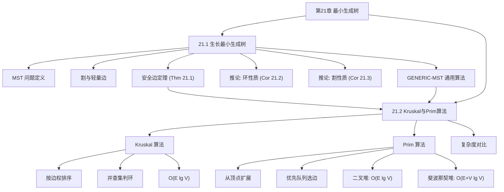

## 相关笔记

- 节笔记：[[21.1 生长最小生成树]]、[[21.2 Kruskal与Prim算法]]
- 前置章节：[[第20章_基本图算法-章节汇总]]、[[第19章_用于不相交集合的数据结构-章节汇总]]、[[第15章_贪心算法-章节汇总]]

> [!abstract] 概览
> 全章围绕**最小生成树**（Minimum Spanning Tree, MST）问题展开。首先建立MST的理论基础——通过==割==（cut）与==轻量边==（light edge）的概念，证明==安全边定理==（Theorem 21.1），为贪心策略提供严格数学依据（21.1）；然后给出两种经典算法的具体实现——==Kruskal算法==（排序+并查集）和==Prim算法==（优先队列），并分析各自的运行时间（21.2）。全章的核心主线是 **贪心策略的正确性**——安全边定理保证了每一步贪心选择的局部最优性最终导向全局最优。

---

## 知识结构总览

---

## 核心概念回顾

### MST 问题定义

| 要素 | 内容 |
|:-----|:-----|
| 输入 | 连通无向图 $G = (V, E)$，权函数 $w : E \to \mathbb{R}$ |
| 输出 | 生成树 $T \subseteq E$，使 $w(T) = \sum_{(u,v) \in T} w(u,v)$ 最小 |
| 前提 | $G$ 必须连通（否则求最小生成森林） |

### 核心术语

| 术语 | 定义 | 直觉 |
|:-----|:-----|:-----|
| 割 $(S, V-S)$ | 将 $V$ 划分为两个非空子集 | 一条"分界线" |
| 轻量边 | 穿过割的权值最小的边 | 分界线上最便宜的桥 |
| 尊重割 | 边集 $A$ 中没有边穿过割 | $A$ 没有跨越分界线 |
| 安全边 | 加入 $A$ 后仍属于某棵 MST 的边 | 不会"走错路"的边 |

### 三大定理/推论

> [!def] 定理 21.1（安全边定理）
> 设 $A$ 是 $E$ 的子集且包含在某棵 MST 中，$(S, V-S)$ 是尊重 $A$ 的割，$(u,v)$ 是穿过该割的轻量边，则 $(u,v)$ 对 $A$ 是安全的。

> [!def] 推论 21.2（环性质）
> 设 $C$ 是连通图 $G$ 中关于边集 $A$ 的环（$A$ 中的边加上 $(u,v)$ 形成环），$(u,v)$ 是 $C$ 中唯一最大权边，则 $(u,v)$ 不属于任何包含 $A$ 的 MST。

> [!def] 推论 21.3（割性质）
> 设 $(S, V-S)$ 是 $G$ 的任意割，$(u,v)$ 是穿过该割的唯一最小权边，则 $(u,v)$ 属于某棵 MST。

### Kruskal vs Prim 对比

| 比较维度 | Kruskal 算法 | Prim 算法 |
|:---------|:------------|:----------|
| **贪心视角** | 边（全局排序） | 顶点（局部扩展） |
| **核心操作** | 按权排序边 | 从队列取最小 key 顶点 |
| **辅助数据结构** | 并查集（判环） | 优先队列（选最小边） |
| **时间复杂度** | $O(E \lg V)$ | $O(E \lg V)$（二叉堆） |
| **最优复杂度** | — | $O(E + V \lg V)$（斐波那契堆） |
| **适用场景** | 稀疏图 | 稠密图 |
| **正确性基础** | 割性质（森林中每棵树定义割） | 割性质（已到达集 $S$ 定义割） |
| **关键前置** | [[第19章_用于不相交集合的数据结构-章节汇总]] | [[第06章_堆排序-章节汇总]] |

---

## 跨章关联

### 与第15章（贪心算法）的关系

MST 是贪心算法的经典成功案例。[[第15章_贪心算法-章节汇总]]中提出的贪心策略要素在MST中完整体现：

| 贪心要素 | MST中的对应 |
|:---------|:-----------|
| 贪心选择性质 | 安全边定理（Thm 21.1）保证局部最优→全局最优 |
| 最优子结构 | MST的子树仍然是其诱导子图的MST |
| 排序决策 | Kruskal按边权排序，Prim按key值排序 |

### 与第19章（不相交集合）的关系

Kruskal 算法直接使用并查集数据结构：
- `FIND-SET(u)` 判断 $u$ 和 $v$ 是否在同一棵树中（是否形成环）
- `UNION(u, v)` 将两棵树合并
- 使用[[算法导论/concepts/按秩合并]] + [[算法导论/concepts/路径压缩]]后，$m$ 次操作总代价 $O(m \alpha(V))$

### 与第20章（基本图算法）的关系

- 图的表示（邻接表/邻接矩阵）是MST算法的输入基础
- BFS/DFS 的遍历思想与 Prim 的扩展策略有相似之处（都是逐层/逐步扩展）
- MST 算法运行在无向连通图上，而 BFS/DFS 可运行在任意图上

---

## 综合复习题

> [!faq]- 复习题 1：为什么安全边定理是MST贪心策略的理论基石？
> 安全边定理建立了"局部贪心选择"与"全局最优性"之间的桥梁。它告诉我们：只要每次选择的边是某个尊重当前边集的割的轻量边，那么这条边一定属于某棵MST。GENERIC-MST 的每一步都在做这样的选择，因此最终得到的生成树一定是最小的。没有这个定理，贪心策略的正确性就无法保证。

> [!faq]- 复习题 2：Kruskal算法中，为什么用并查集就能正确判断是否形成环？
> 在Kruskal算法中，维护的边集 $A$ 始终是一个森林（若干棵树的集合）。并查集中的每个集合恰好对应森林中的一棵树。当考虑边 $(u,v)$ 时，如果 `FIND-SET(u) = FIND-SET(v)`，说明 $u$ 和 $v$ 已经在同一棵树中，加入 $(u,v)$ 会形成环；否则，加入 $(u,v)$ 不会形成环，并通过 `UNION(u,v)` 将两棵树合并。这个对应关系保证了判环的正确性。

> [!faq]- 复习题 3：Prim算法的key数组与Dijkstra算法的dist数组有什么本质区别？
> 两者的更新规则不同：
> - **Prim**：`key[v] = min(key[v], w(u,v))`，只考虑边权
> - **Dijkstra**：`dist[v] = min(dist[v], dist[u] + w(u,v))`，考虑路径总长度
>
> 这个区别导致Prim求的是MST（最小生成树），Dijkstra求的是最短路径树。MST不一定包含源点到所有顶点的最短路径，最短路径树也不一定是最小生成树。

> [!faq]- 复习题 4：什么情况下MST不唯一？如何判断？
> 当图中存在权值相同的边时，MST可能不唯一。具体地，如果某条割有多条权值相同的轻量边，选择不同的轻量边会得到不同的MST。判断方法：如果对于每一条非MST边 $(u,v)$，MST中 $u$ 到 $v$ 的路径上的最大边权严格小于 $w(u,v)$，则MST唯一（这是推论21.2的逆命题）。

---

## 常见误区

> [!warning] 误区1：MST包含所有顶点对之间的最短路径
> **正确理解**：MST是最小权生成树，它使边的总权值最小，但不保证任意两顶点间的路径最短。例如，在三角形 $a$-$b$-$c$ 中，$w(a,b)=1, w(b,c)=1, w(a,c)=3$，MST包含边 $(a,b)$ 和 $(b,c)$，但 $a$ 到 $c$ 的MST路径长度为2，而直接边长度为3——这里恰好MST路径更短。反过来，也可能存在直接边更短的情况。

> [!warning] 误区2：Kruskal和Prim总是产生相同的MST
> **正确理解**：当所有边权互不相同时，两种算法产生唯一的MST。当存在等权边时，两种算法可能因为选择顺序不同而产生不同的MST，但它们的总权值一定相同。

> [!warning] 误区3：MST算法可以直接用于有向图
> **正确理解**：MST问题仅定义在无向图上。有向图上的类似问题称为"最小树形图"（minimum arborescence），需要使用不同的算法（如Edmonds算法/Chu-Liu算法）。

---

## 学习要点总结

| 学习目标 | 掌握程度 | 对应笔记 |
|:---------|:---------|:---------|
| MST问题定义与存在性 | 理解 | [[21.1 生长最小生成树]] |
| 割、轻量边、安全边的定义与关系 | 熟练 | [[21.1 生长最小生成树]] |
| 安全边定理的陈述与证明思路 | 掌握 | [[21.1 生长最小生成树]] |
| GENERIC-MST的正确性（循环不变式） | 掌握 | [[21.1 生长最小生成树]] |
| Kruskal算法的伪代码、正确性、复杂度 | 熟练 | [[21.2 Kruskal与Prim算法]] |
| Prim算法的伪代码、正确性、复杂度 | 熟练 | [[21.2 Kruskal与Prim算法]] |
| Kruskal vs Prim的选型依据 | 掌握 | [[21.2 Kruskal与Prim算法]] |
| MST与贪心策略的关系 | 理解 | [[第15章_贪心算法-章节汇总]] |
| 并查集在Kruskal中的应用 | 掌握 | [[第19章_用于不相交集合的数据结构-章节汇总]] |

---

## 参见Wiki

> [!note] 概念页尚未创建
