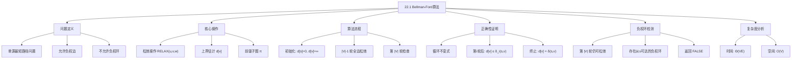
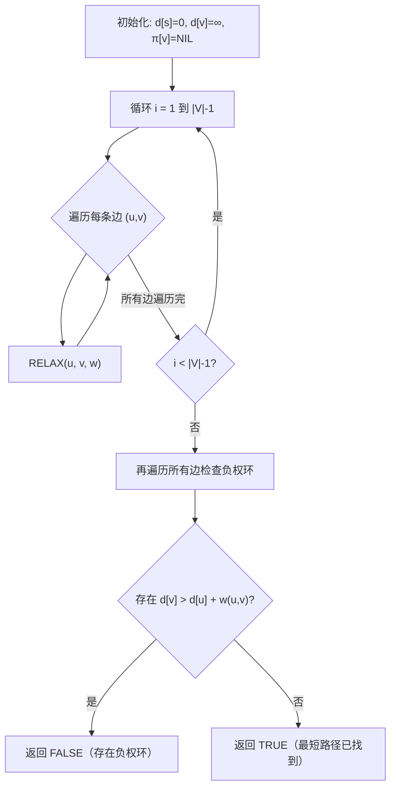

## 相关笔记

- 后续笔记：[[22.2 有向无环图中的单源最短路径]]、[[22.3 Dijkstra算法]]
- 前置笔记：[[第20章_基本图算法-章节汇总]]、[[第21章_最小生成树-章节汇总]]
- 关联概念：[[20.2 广度优先搜索]]、[[20.3 深度优先搜索]]、[[21.1 生长最小生成树]]

> [!abstract] 概览
> 本节介绍 ==Bellman-Ford 算法==，它解决==单源最短路径问题==，能够处理==负权边==，并且可以==检测负权环==。与 Dijkstra 算法不同，Bellman-Ford 不要求所有边权非负，但其时间复杂度为 $O(VE)$，比 Dijkstra 的 $O((V+E)\lg V)$ 更高。
>
> **要点列表：**
> - Bellman-Ford 通过对图中所有边进行 $|V|-1$ 轮==松弛操作==来逐步逼近最短路径
> - 第 $i$ 轮松弛后，算法已找到所有最多使用 $i$ 条边的最短路径
> - 第 $|V|$ 轮松弛用于==负权环检测==：如果还能成功松弛，则图中存在从源点可达的负权环
> - 总时间复杂度为 ==$\Theta(VE)$==，空间复杂度为 $O(V)$

---

## 知识结构总览



---

## 核心思想

> [!tip] 核心思路
> Bellman-Ford 算法的核心思想是**逐步松弛**：通过反复遍历图中的所有边，不断更新从源点到各顶点的最短路径估计值。每轮遍历都会让更多顶点的估计值逼近真实最短路径，经过最多 $|V|-1$ 轮后，所有可达顶点的估计值收敛到真实最短路径长度。如果第 $|V|$ 轮还能更新，说明存在负权环。

### 单源最短路径问题定义

> [!def] 单源最短路径问题（Single-Source Shortest Paths）
> **输入：** 带权有向图 $G = (V, E)$，权函数 $w : E \to \mathbb{R}$，源点 $s \in V$
>
> **输出：** 对每个顶点 $v \in V$，计算从 $s$ 到 $v$ 的==最短路径权重==：
> $$\delta(s, v) = \begin{cases} \min\{w(p) : s \leadsto p \text{ 是一条路径}\} & \text{若 } s \leadsto v \text{ 存在路径} \\ +\infty & \text{否则} \end{cases}$$
>
> 其中 $w(p) = \sum_{i=1}^{k} w(v_{i-1}, v_i)$ 是路径 $p = \langle v_0, v_1, \ldots, v_k \rangle$ 的总权重。
>
> **前提条件：** 图中不存在从源点 $s$ 可达的==负权环==（negative-weight cycle），否则某些顶点的最短路径权重为 $-\infty$。

### 松弛操作

> [!def] 松弛操作 RELAX(u, v, w)
> 松弛操作是 Bellman-Ford（以及 Dijkstra）算法的基础操作，其核心逻辑是：
>
> **如果**从源点经顶点 $u$ 到达 $v$ 的路径比当前已知路径更短，**则**更新 $v$ 的估计值和前驱。
>
> **形式化定义：**
> $$\text{RELAX}(u, v, w): \quad \text{if } d[v] > d[u] + w(u,v) \text{ then } d[v] \leftarrow d[u] + w(u,v), \quad \pi[v] \leftarrow u$$
>
> **直观理解：** 想象你在规划从家到各个城市的最短路线。$d[v]$ 是你当前认为到家到 $v$ 的最短距离。如果你发现"家→$u$→$v$"这条路线比已知的更短，就更新你的估计。这个过程就像不断收到新的路况信息来优化路线。

### Bellman-Ford 算法伪代码

> [!tip] 算法执行流程
> 1. **初始化**：将源点 s 的距离设为 0，其余所有顶点距离设为无穷大，前驱设为 NIL
> 2. **松弛循环**：对所有边重复执行 **|V|-1** 轮松弛操作
> 3. **负权环检测**：再遍历所有边，若仍可松弛则说明存在从源点可达的负权环
> 4. **返回结果**：存在负权环返回 FALSE，否则返回 TRUE 及各顶点的距离和前驱



```
BELLMAN-FORD(G, w, s)
1  INITIALIZE-SINGLE-SOURCE(G, s)
2  for i = 1 to |G.V| - 1
3      for each edge (u, v) ∈ G.E
4          RELAX(u, v, w)
5  for each edge (u, v) ∈ G.E
6      if d[v] > d[u] + w(u, v)
7          return FALSE
8  return TRUE
```

其中 `INITIALIZE-SINGLE-SOURCE(G, s)` 的定义为：

```
INITIALIZE-SINGLE-SOURCE(G, s)
1  for each vertex v ∈ G.V
2      d[v] = ∞
3      π[v] = NIL
4  d[s] = 0
```

> [!def] Bellman-Ford 算法
> **输入：** 带权有向图 $G = (V, E)$，权函数 $w$，源点 $s$
>
> **输出：**
> - 若图中不存在从 $s$ 可达的负权环：返回 `TRUE`，且对所有 $v \in V$，$d[v] = \delta(s, v)$
> - 若存在从 $s$ 可达的负权环：返回 `FALSE`
>
> **算法步骤：**
> 1. **初始化（第1行）：** $d[s] = 0$，其余 $d[v] = \infty$，$\pi[v] = \text{NIL}$
> 2. **松弛循环（第2-4行）：** 对所有边进行 $|V|-1$ 轮松弛
> 3. **负权环检测（第5-7行）：** 再检查所有边，若仍可松弛则存在负权环

### 正确性证明

> [!def] 定理22.3（Bellman-Ford 正确性）
> 若带权有向图 $G = (V, E)$ 不包含从源点 $s$ 可达的负权环，则 `BELLMAN-FORD` 算法终止时，对所有顶点 $v \in V$，有 $d[v] = \delta(s, v)$。
>
> **证明（循环不变式）：**
>
> **循环不变式：** 在第2-4行的 for 循环执行第 $i$ 轮（$1 \leq i \leq |V|-1$）之后，对任意顶点 $v \in V$：
> - 若存在从 $s$ 到 $v$ 的最多包含 $i$ 条边的路径，则 $d[v] \leq \delta_i(s, v)$，其中 $\delta_i(s, v)$ 是从 $s$ 到 $v$ 的最多 $i$ 条边的最短路径权重
> - 若不存在从 $s$ 到 $v$ 的路径，则 $d[v] = \infty$
>
> **初始化（$i = 0$）：**
> - 第0轮（即初始化之后、松弛循环开始之前），$d[s] = 0 = \delta_0(s, s)$（从 $s$ 到 $s$ 的0条边路径权重为0）
> - 对 $v \neq s$，$d[v] = \infty$，且不存在从 $s$ 到 $v$ 的0条边路径（除非 $v = s$）
> - 循环不变式成立
>
> **维护（$i \to i+1$）：**
> - 假设第 $i$ 轮后循环不变式成立
> - 考虑第 $i+1$ 轮松弛。设 $v$ 是一个存在从 $s$ 到 $v$ 的最多 $i+1$ 条边最短路径的顶点
> - **【路径分解（将最短路径拆分为子路径+最后一条边）】** 设这条最短路径为 $s \leadsto u \to v$，其中最后一条边为 $(u, v)$，子路径 $s \leadsto u$ 包含最多 $i$ 条边
> - **【归纳假设（利用第i轮的上界结论）】** 由归纳假设，第 $i$ 轮后 $d[u] \leq \delta_i(s, u)$
> - **【松弛传播（RELAX操作更新d[v]）】** 在第 $i+1$ 轮中，当处理边 $(u, v)$ 时，RELAX 操作会将 $d[v]$ 更新为 $\min(d[v], d[u] + w(u,v))$
> - **【不等式链（$\delta_{i+1} \geq d[u]+w \Rightarrow d[v] \leq \delta_{i+1}$）】** 由于 $\delta_{i+1}(s, v) = \delta_i(s, u) + w(u,v) \geq d[u] + w(u,v)$（由归纳假设），松弛后 $d[v] \leq \delta_{i+1}(s, v)$
> - 循环不变式成立
>
> **终止（$i = |V|-1$）：**
> - **【简单路径性质（$|V|-1$条边覆盖所有简单路径）】** 第 $|V|-1$ 轮后，对任意顶点 $v$，若存在从 $s$ 到 $v$ 的路径，则该路径最多有 $|V|-1$ 条边（简单路径的性质）
> - 因此 $d[v] \leq \delta_{|V|-1}(s, v) = \delta(s, v)$
> - **【上下界夹逼（$d[v] \geq \delta$ 且 $d[v] \leq \delta \Rightarrow d[v]=\delta$）】** 又由引理22.2（上界性质），始终有 $d[v] \geq \delta(s, v)$
> - 因此 $d[v] = \delta(s, v)$
>
> **正确性得证。** $\blacksquare$

### 负权环检测

> [!def] 引理22.2（负权环检测）
> 若 `BELLMAN-FORD` 返回 `TRUE`，则图中不存在从源点 $s$ 可达的负权环；若返回 `FALSE`，则图中存在从 $s$ 可达的负权环。
>
> **证明：**
>
> **方向一：返回 TRUE $\Rightarrow$ 不存在从 $s$ 可达的负权环**
> - 若返回 TRUE，则第5-7行的检查对所有边 $(u,v)$ 都有 $d[v] \leq d[u] + w(u,v)$
> - **【定理22.3结论（$d[v]=\delta(s,v)$）】** 由定理22.3，对所有 $v \in V$，$d[v] = \delta(s, v)$
> - **【负权环导致$\delta=-\infty$（绕行负权环使路径权重趋于$-\infty$）】** 若存在从 $s$ 可达的负权环 $c$，则反复绕行该环可使路径权重趋于 $-\infty$，$\delta(s, v) = -\infty$（$v$ 在环上或从环可达）
> - **【有限值与$-\infty$矛盾】** 但 $d[v]$ 是有限值（算法只执行有限次有限运算），矛盾
> - 因此不存在从 $s$ 可达的负权环
>
> **方向二：存在从 $s$ 可达的负权环 $\Rightarrow$ 返回 FALSE**
> - 设 $c$ 是从 $s$ 可达的负权环，$v$ 是 $c$ 上的某个顶点
> - 由于 $c$ 是从 $s$ 可达的，存在从 $s$ 到 $v$ 的路径
> - **【绕行负权环使$\delta(s,v)=-\infty$】** 反复绕行负权环 $c$ 可以使 $s$ 到 $v$ 的路径权重任意小
> - 因此 $\delta(s, v) = -\infty$
> - **【$|V|-1$轮不足以覆盖绕行路径（绕行需$|V|$条边）】** 但 $|V|-1$ 轮松弛只能找到最多 $|V|-1$ 条边的路径，而绕行 $c$ 至少需要 $|V|$ 条边
> - 所以第 $|V|-1$ 轮后 $d[v] > \delta(s, v) = -\infty$
> - **【第$|V|$轮检测到可松弛边】** 在第 $|V|$ 轮检查中，必然存在某条边 $(u, v)$ 使得 $d[v] > d[u] + w(u,v)$，返回 FALSE
>
> **得证。** $\blacksquare$

> [!tip] 负权环检测的直觉
> 一个没有环的路径最多有 $|V|-1$ 条边。如果 $|V|-1$ 轮松弛后还能改进某个 $d$ 值，说明存在一条需要"绕圈"才能更短的路径——这个"圈"就是负权环。

### 复杂度分析

> [!def] 时间与空间复杂度
> **时间复杂度：**
> - 初始化：$O(V)$
> - 松弛循环：$|V|-1$ 轮，每轮遍历所有 $|E|$ 条边，共 $O(VE)$
> - 负权环检测：遍历所有 $|E|$ 条边，$O(E)$
> - **总计：$\Theta(VE)$**
>
> **空间复杂度：** $O(V)$（存储 $d$ 数组和 $\pi$ 数组）

---

## 补充理解与拓展

> [!info] Bellman-Ford 算法的历史渊源
>
> Bellman-Ford 算法有着丰富的历史背景：
>
> 1. **Richard Bellman（1958）**：美国数学家 Richard Bellman 于1958年在其著作 "On a Routing Problem" 中首次描述了这一算法。Bellman 是动态规划理论的奠基人，该算法本质上也是一种动态规划方法——每一轮松弛对应动态规划中的一个阶段。
>
> 2. **Edward F. Moore（1956）**：实际上，Alfonso Shimbel 在1955年、Edward F. Moore 在1956年就独立发现了类似算法。Moore 的版本最初用于寻找通信网络中的最短路径。因此该算法有时也被称为 Bellman-Ford-Moore 算法。
>
> 3. **Lester R. Ford Jr.（1956）**：Ford 也独立提出了类似的算法框架。算法名称中的 "Ford" 即来源于此。
>
> 这段历史说明，同一算法被多位研究者独立发现，反映了该问题在20世纪50年代通信网络和运筹学发展中的核心地位。

> [!info] Bellman-Ford 在网络路由中的应用——RIP 协议
>
> **RIP（Routing Information Protocol）** 是互联网早期最广泛使用的路由协议之一，其核心机制直接基于 Bellman-Ford 算法（具体来说是分布式 Bellman-Ford，也称距离向量路由）：
>
> - 每个路由器维护一个**距离向量**（distance vector），记录到所有目的网络的距离估计值
> - 路由器定期与**邻居路由器**交换距离向量
> - 收到邻居的距离向量后，执行**松弛操作**：如果经邻居到某目的网络的距离更短，则更新
> - 这等价于在图的边上进行异步的松弛操作
>
> **RIP 的局限性：**
> - 使用**跳数**（hop count）作为度量，最大15跳（16跳视为不可达）
> - 收敛速度慢（Bellman-Ford 需要 $O(VE)$ 轮），大型网络中可能出现**路由环路**和**计数到无穷**（count-to-infinity）问题
> - RIP 已基本被基于 Dijkstra 算法的 OSPF 协议取代，但 Bellman-Ford 的思想在分布式计算中仍有重要价值

> [!info] 金融套利检测——Bellman-Ford 的经典应用
>
> **汇率套利检测**是 Bellman-Ford 算法的一个经典应用场景：
>
> - 将货币视为图的**顶点**，汇率视为有向边的**权重**
> - 边 $(u, v)$ 的权重设为 $-\ln(\text{汇率}_{u \to v})$
> - 若存在一个货币兑换循环，使得最终换回的金额大于初始金额，则对应图中的**负权环**
> - 使用 Bellman-Ford 算法检测负权环，即可发现套利机会
>
> **具体例子：** 假设 1美元 = 0.8欧元，1欧元 = 100日元，1日元 = 0.013美元。则：
> - $1 \text{ USD} \to 0.8 \text{ EUR} \to 80 \text{ JPY} \to 1.04 \text{ USD}$
> - 最终得到1.04美元 > 1美元，存在套利机会
> - 在图中，这对应一个权重之和为负的环
>
> 这一应用展示了算法理论在金融工程中的实际价值。

> [!info] SPFA 优化——Bellman-Ford 的队列加速版本
>
> **SPFA（Shortest Path Faster Algorithm）** 是 Bellman-Ford 的一种优化变体，由中国学者 Duan Fanding（段凡丁）于1994年提出：
>
> - 核心思想：Bellman-Ford 每轮松弛所有边，但很多边在当前轮次中并不会产生有效的松弛。SPFA 使用一个**队列**来维护那些 $d$ 值被更新的顶点，只对出队顶点的出边执行松弛
> - 平均情况下，SPFA 的性能远优于 Bellman-Ford，接近 $O(E)$
> - **最坏情况**下 SPFA 仍为 $O(VE)$（与 Bellman-Ford 相同），精心构造的图可以使 SPFA 退化为 Bellman-Ford
> - SPFA 在竞赛编程中广泛使用，但在生产环境中由于其最坏情况不可预测，一般仍推荐使用 Bellman-Ford 或 Dijkstra
>
> **注意：** CLRS 教材中未涵盖 SPFA，但了解这一优化有助于全面理解 Bellman-Ford 的改进空间。

---

## 易混淆点与辨析

> [!warning] 误区：Bellman-Ford 不能处理负权边
> ❌ **错误理解：** "Bellman-Ford 和 Dijkstra 一样，只能处理非负权边"
>
> ✅ **正确理解：** Bellman-Ford 算法的核心优势之一就是**能够正确处理负权边**。只要图中不存在从源点可达的负权环，Bellman-Ford 就能正确计算出所有最短路径。Dijkstra 算法才不能处理负权边（因为 Dijkstra 的贪心选择依赖于"已确定最短路径的顶点不会被后续更新"这一性质，而负权边会破坏这一性质）。

> [!warning] 误区：负权环和负权边是一回事
> ❌ **错误理解：** "图中有一条负权边就等于有负权环，Bellman-Ford 就会失败"
>
> ✅ **正确理解：** **负权边**（negative-weight edge）和**负权环**（negative-weight cycle）是两个不同的概念：
> - **负权边**：一条权重为负的边，例如 $w(u,v) = -3$。Bellman-Ford 可以正确处理
> - **负权环**：一个环上所有边权之和为负的环，例如三角形 $u \to v \to w \to u$，边权分别为 $-1, -1, -1$，总和为 $-3$。负权环使得最短路径无定义（可以无限绕行使路径权重趋于 $-\infty$）
>
> Bellman-Ford 可以处理负权边，但会检测并报告负权环的存在。

> [!warning] 误区：松弛操作的顺序不影响结果
> ❌ **错误理解：** "Bellman-Ford 每轮松弛边的顺序无所谓，最终结果都一样"
>
> ✅ **正确理解：** 松弛边的顺序**不影响算法的最终结果**（$|V|-1$ 轮后都会得到正确的最短路径），但**会影响中间过程和收敛速度**。Bellman-Ford 的正确性证明不依赖于边的处理顺序，这是该算法鲁棒性的体现。然而，SPFA 优化正是通过精心选择松弛顺序（只松弛可能有效的边）来加速收敛的。

> [!warning] 误区：$|V|-1$ 轮松弛总是必要的
> ❌ **错误理解：** "Bellman-Ford 必须完整执行 $|V|-1$ 轮才能得到正确结果"
>
> ✅ **正确理解：** $|V|-1$ 是一个**最坏情况上界**。如果图中从源点到所有顶点的最短路径最多只需要 $m$ 条边（$m < |V|-1$），那么算法在第 $m$ 轮后就已经收敛，后续轮次不会产生任何更新。习题22.1-3正是利用这一性质提出了一种提前终止的优化：如果某一轮没有产生任何更新，可以提前终止。

---

## 习题精选

| 题号 | 题目描述 | 难度 |
|:---:|----------|:---:|
| 22.1-1 | 在图24.4的有向图上运行 Bellman-Ford 算法，以 $z$ 为源点，展示每轮松弛后的 $d$ 和 $\pi$ 值。然后将边 $(z, x)$ 的权重改为4，以 $s$ 为源点重新运行 | ⭐ |
| 22.1-2 | 证明推论22.3：$v.d < \infty$ 当且仅当 $s$ 到 $v$ 存在路径 | ⭐⭐ |
| 22.1-3 | 修改 Bellman-Ford 使其在 $m+1$ 轮后终止，其中 $m$ 是从 $s$ 到所有顶点的最短路径中边数的最大值 | ⭐⭐ |
| 22.1-4 | 修改 Bellman-Ford 将所有从 $s$ 经负权环可达的顶点的 $d$ 值设为 $-\infty$ | ⭐⭐⭐ |
| 22.1-5 | 给定 $O(VE)$ 时间算法，计算每个顶点 $v$ 的 $\delta^*(v) = \min_{u \in V}\{\delta(u, v)\}$ | ⭐⭐⭐ |
| 22.1-6 | 给定高效算法，列出图中一个负权环的所有顶点 | ⭐⭐⭐ |

> [!faq]- 22.1-1 解答
> **目标：** 在图24.4的有向图上运行 Bellman-Ford 算法。
>
> **以 $z$ 为源点：**
>
> $d$ 值变化：
>
> $$\begin{array}{cccccc} s & t & x & y & z \\ \hline \infty & \infty & \infty & \infty & 0 \\ 2 & \infty & 7 & \infty & 0 \\ 2 & 5 & 7 & 9 & 0 \\ 2 & 5 & 6 & 9 & 0 \\ 2 & 4 & 6 & 9 & 0 \end{array}$$
>
> $\pi$ 值变化：
>
> $$\begin{array}{cccccc} s & t & x & y & z \\ \hline \text{NIL} & \text{NIL} & \text{NIL} & \text{NIL} & \text{NIL} \\ z & \text{NIL} & z & \text{NIL} & \text{NIL} \\ z & x & z & s & \text{NIL} \\ z & x & y & s & \text{NIL} \\ z & x & y & s & \text{NIL} \end{array}$$
>
> **将边 $(z, x)$ 权重改为4，以 $s$ 为源点：**
>
> $d$ 值变化：
>
> $$\begin{array}{cccccc} s & t & x & y & z \\ \hline 0 & \infty & \infty & \infty & \infty \\ 0 & 6 & \infty & 7 & \infty \\ 0 & 6 & 4 & 7 & 2 \\ 0 & 2 & 4 & 7 & 2 \\ 0 & 2 & 4 & 7 & -2 \end{array}$$
>
> $\pi$ 值变化：
>
> $$\begin{array}{cccccc} s & t & x & y & z \\ \hline \text{NIL} & \text{NIL} & \text{NIL} & \text{NIL} & \text{NIL} \\ \text{NIL} & s & \text{NIL} & s & \text{NIL} \\ \text{NIL} & s & y & s & t \\ \text{NIL} & x & y & s & t \\ \text{NIL} & x & y & s & t \end{array}$$
>
> **负权环检测：** 考虑边 $(z, x)$，$x.d = 4 > z.d + w(z, x) = -2 + 4 = 2$，返回 FALSE，说明存在从 $s$ 可达的负权环。

> [!faq]- 22.1-2 解答
> **目标：** 证明 $v.d < \infty$ 当且仅当 $s$ 到 $v$ 存在路径。
>
> **证明：**
>
> **必要性（$v.d < \infty \Rightarrow$ 存在路径）：**
> - $v.d$ 在算法执行过程中单调递减
> - RELAX 只在 $u.d + w(u,v) < v.d$ 时更新 $v.d$，同时设置 $v.\pi = u$
> - 因此 $v$ 在前驱子图中有祖先，而前驱子图是一棵以 $s$ 为根的树
> - 所以 $s$ 到 $v$ 在前驱子图中存在路径，在原图中也存在路径
>
> **充分性（存在路径 $\Rightarrow v.d < \infty$）：**
> - 若 $s$ 到 $v$ 存在路径，则存在一条最短路径，其长度 $\delta(s, v)$ 有限（路径最多 $|V|-1$ 条边，每条边权重有限）
> - 由引理22.2，算法终止时 $v.d = \delta(s, v) < \infty$
>
> **得证。** $\blacksquare$

> [!faq]- 22.1-3 解答
> **目标：** 修改 Bellman-Ford 使其在 $m+1$ 轮后终止。
>
> **方法：** 在每轮松弛结束后检查是否有任何 $d$ 值被更新。如果某一轮没有产生任何更新，说明所有最短路径已经找到，可以提前终止。
>
> **修改后的伪代码：**
>
> ```
> BELLMAN-FORD-EARLY(G, w, s)
> 1  INITIALIZE-SINGLE-SOURCE(G, s)
> 2  for i = 1 to |G.V| - 1
> 3      changed = FALSE
> 4      for each edge (u, v) ∈ G.E
> 5          if d[v] > d[u] + w(u, v)
> 6              d[v] = d[u] + w(u, v)
> 7              π[v] = u
> 8              changed = TRUE
> 9      if changed = FALSE
> 10         break
> 11 for each edge (u, v) ∈ G.E
> 12     if d[v] > d[u] + w(u, v)
> 13         return FALSE
> 14 return TRUE
> ```
>
> **正确性：** 由上界理论，$m$ 轮后所有 $d$ 值不再变化，因此第 $m+1$ 轮不会产生任何更新，`changed` 为 FALSE，算法在第 $m+1$ 轮后终止。

> [!faq]- 22.1-4 解答
> **目标：** 修改 Bellman-Ford 将从 $s$ 经负权环可达的顶点的 $d$ 值设为 $-\infty$。
>
> **方法：** 在标准 Bellman-Ford 的负权环检测阶段，标记所有仍可松弛的顶点，然后从这些顶点出发执行 DFS/BFS，将所有可达顶点的 $d$ 值设为 $-\infty$。
>
> **修改后的伪代码：**
>
> ```
> BELLMAN-FORD-MARK(G, w, s)
> 1  INITIALIZE-SINGLE-SOURCE(G, s)
> 2  for i = 1 to |G.V| - 1
> 3      for each edge (u, v) ∈ G.E
> 4          RELAX(u, v, w)
> 5  for each edge (u, v) ∈ G.E
> 6      if d[v] > d[u] + w(u, v)
> 7          mark v
> 8  for each vertex u ∈ marked vertices
> 9      DFS-MARK(u)
> 10 return TRUE
> ```
>
> ```
> DFS-MARK(u)
> 1  if u ≠ NIL and u.d ≠ -∞
> 2      u.d = -∞
> 3      for each v ∈ G.Adj[u]
> 4          DFS-MARK(v)
> ```
>
> **原理：** 第 $|V|$ 轮仍可松弛的顶点一定在或可以从负权环到达。从这些顶点出发的 DFS 将所有受影响的顶点标记为 $-\infty$。

> [!faq]- 22.1-5 解答
> **目标：** 给定 $O(VE)$ 时间算法，计算 $\delta^*(v) = \min_{u \in V}\{\delta(u, v)\}$。
>
> **思路：** 添加一个虚拟源点 $s'$，从 $s'$ 到每个顶点 $u \in V$ 添加一条权重为0的边。然后对 $s'$ 运行 Bellman-Ford。这样 $\delta(s', v) = \min_{u \in V}\{\delta(s', u) + \delta(u, v)\} = \min_{u \in V}\{0 + \delta(u, v)\} = \delta^*(v)$。
>
> **另一种方法：** 修改 RELAX 操作：
>
> ```
> RELAX'(u, v, w)
> 1  if d[v] > min(w(u, v), w(u, v) + u.d)
> 2      d[v] = min(w(u, v), w(u, v) + u.d)
> 3      v.π = u.π
> ```
>
> 这里 `min(w(u,v), w(u,v) + u.d)` 表示可以直接从 $u$ 到 $v$（如果 $u$ 本身就是起点），也可以经过某个起点到 $u$ 再到 $v$。初始化时 $d[v] = \infty$，这样 Bellman-Ford 的 $|V|-1$ 轮松弛将找到从任意起点到 $v$ 的最短路径。
>
> **时间复杂度：** 仍为 $O(VE)$，因为算法结构不变。

> [!faq]- 22.1-6 解答
> **目标：** 给定高效算法，列出图中一个负权环的所有顶点。
>
> **方法：** 基于习题22.1-4的修改版 Bellman-Ford：
>
> 1. 运行 `BELLMAN-FORD-MARK`，找出所有 $d$ 值为 $-\infty$ 的顶点
> 2. 从某个 $d = -\infty$ 的顶点出发执行 DFS
> 3. 在 DFS 过程中，维护从起点到当前顶点的路径和路径权重之和
> 4. 如果遇到一个已经访问过的顶点（灰色或黑色），且路径权重之和为负，则从该顶点到当前顶点的搜索路径构成一个负权环
>
> **时间复杂度：** Bellman-Ford 阶段 $O(VE)$，DFS 阶段 $O(V+E)$，总计 $O(VE)$。

---

## 视频学习指南

| 资源 | 主题 | 链接 | 说明 |
|:-----|:-----|:-----|:-----|
| MIT 6.006 Lecture 16 | Graph Algorithms: Bellman-Ford | https://www.youtube.com/watch?v=ozsuci5pIso | MIT 完整讲解，含负权环检测 |
| Abdul Bari | Bellman Ford Algorithm | https://www.youtube.com/watch?v=obWXjtg0L64 | 逐步动画演示，直观易懂 |
| WilliamFiset | Bellman-Ford Algorithm | https://www.youtube.com/watch?v=0nVYi3oZBf4 | 系列讲解，含伪代码与实例 |
| NeetCode | Bellman-Ford | https://www.youtube.com/watch?v=lyw4FaxrwHg | 实战编程视角 |
| GeeksforGeeks | Bellman-Ford Algorithm | https://www.geeksforgeeks.org/bellman-ford-algorithm-dp-23/ | 文字+图示详解 |

---

## 教材原文

> [!quote] CLRS 第4版 22.1节原文（对应第3版24.1节）
> The Bellman-Ford algorithm solves the single-source shortest-paths problem in the general case in which edge weights may be negative. Given a weighted, directed graph $G = (V, E)$ with source $s$ and weight function $w : E \to \mathbb{R}$, the Bellman-Ford algorithm returns a boolean value indicating whether or not there is a negative-weight cycle that is reachable from the source. If there is such a cycle, the algorithm indicates that no solution exists. If there is no such cycle, the algorithm produces the shortest paths and their weights.
>
> The algorithm uses relaxation, progressively decreasing an estimate $d[v]$ on the weight of a shortest path from the source $s$ to each vertex $v \in V$ until it achieves the actual shortest-path weight $\delta(s, v)$. The algorithm returns TRUE if and only if the graph contains no negative-weight cycles that are reachable from the source.
>
> The BELLMAN-FORD procedure, shown below, returns TRUE if and only if the graph contains no negative-weight cycles that are reachable from source $s$.

> [!quote] CLRS 第4版 22.1节原文（松弛操作）
> The RELAX procedure is used by every single-source shortest-paths algorithm in this chapter. It decreases an upper bound on the weight of a shortest path from the source $s$ to vertex $v$. The code for RELAX is quite simple. It tests whether we can improve the shortest path to $v$ found so far by going through $u$ and, if so, updates both $v.d$ and $v.\pi$.

---

## 参见Wiki

> [!note] 概念页尚未创建
> - Bellman-Ford 算法概念页待创建
> - 松弛操作概念页待创建
> - 负权环概念页待创建
- [[算法导论/theorems/Bellman-Ford正确性定理]]

#学习/算法导论/第22章-单源最短路径 #学习/算法导论/单源最短路径/Bellman-Ford算法
