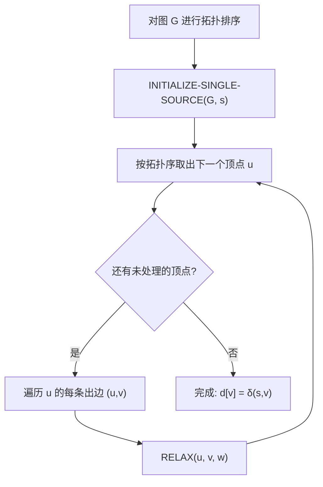

## 相关笔记

- 前置笔记：[[22.1 Bellman-Ford算法]]、[[20.4 拓扑排序]]
- 后续笔记：[[22.3 Dijkstra算法]]
- 关联概念：[[第20章_基本图算法-章节汇总]]、[[第21章_最小生成树-章节汇总]]
- 关联概念：[[20.3 深度优先搜索]]、[[14.1 钢条切割]]

> [!abstract] 概览
> 本节介绍在==有向无环图==（DAG）中求解单源最短路径问题的算法。由于 DAG 不含环，我们可以先对顶点进行==拓扑排序==，然后按拓扑序依次对每个顶点的出边执行==松弛操作==。整个过程只需==一轮松弛==，时间复杂度为 ==$O(V+E)$==，比 Bellman-Ford 的 $\Theta(VE)$ 显著更优。该算法还能自然地处理==负权边==。
>
> **要点列表：**
> - DAG 中不可能存在负权环（因为 DAG 无环），所以最短路径总是良定义的
> - 利用拓扑序保证：处理顶点 $u$ 时，从源点到 $u$ 的最短路径已经确定
> - 只需一轮按拓扑序的松弛，时间复杂度 $O(V+E)$
> - 同一框架可求解 DAG 最长路径（将所有权值取反）

---

## 知识结构总览

```mermaid
flowchart TD
    A["22.2 DAG中的单源最短路径"] --> B["问题背景"]
    A --> C["算法流程"]
    A --> D["正确性证明"]
    A --> E["复杂度分析"]
    A --> F["与Bellman-Ford对比"]
    A --> G["应用场景"]

    B --> B1["DAG: 有向无环图"]
    B --> B2["无负权环（因为无环）"]
    B --> B3["允许负权边"]

    C --> C1["步骤1: 拓扑排序 G"]
    C --> C2["步骤2: 初始化 d[s]=0, d[v]=∞"]
    C --> C3["步骤3: 按拓扑序遍历每个顶点"]
    C --> C4["步骤4: 对每个出边执行 RELAX"]

    D --> D1["拓扑序的关键性质"]
    D --> D2["处理u时, s到u的最短路径已确定"]
    D --> D3["松弛出边后, s到后继的最短路径也确定"]

    E --> E1["拓扑排序: O(V+E)"]
    E --> E2["松弛所有边: O(E)"]
    E --> E3["总计: O(V+E)"]

    F --> F1["Bellman-Ford: Θ(VE), |V|-1轮"]
    F --> F2["DAG: O(V+E), 仅1轮"]
    F --> F3["DAG更高效但要求无环"]

    G --> G1["PERT/CPM 项目调度"]
    G --> G2["编译器依赖分析"]
    G --> G3["电路延迟分析"]
```



---

## 核心思想

> [!tip] 核心思路
> DAG 最短路径算法的关键洞察是：**拓扑排序天然给出了一个正确的松弛顺序**。在拓扑序中，如果存在边 $u \to v$，则 $u$ 一定在 $v$ 之前被处理。这意味着当我们处理顶点 $u$ 时，所有可能到达 $u$ 的路径上的中间顶点都已经被处理过了，因此 $d[u]$ 已经是最终的最短路径值。接下来对 $u$ 的所有出边执行松弛，就能正确传播最短路径信息。整个过程只需**一轮**遍历。

### DAG-SHORTEST-PATHS 伪代码

> [!tip] 算法执行流程
> 1. **拓扑排序**：对有向无环图 G 的所有顶点进行拓扑排序，得到线性序列
> 2. **初始化**：源点 s 距离设为 0，其余顶点距离设为无穷大
> 3. **按序松弛**：按拓扑序依次遍历每个顶点 u，对 u 的每条出边执行松弛操作
> 4. **完成**：所有顶点处理完毕后，各顶点的距离值即为最短路径



```
DAG-SHORTEST-PATHS(G, w, s)
1  topologically sort the vertices of G
2  INITIALIZE-SINGLE-SOURCE(G, s)
3  for each vertex u, taken in topologically sorted order
4      for each vertex v ∈ G.Adj[u]
5          RELAX(u, v, w)
```

> [!def] DAG-SHORTEST-PATHS 算法
> **输入：** 带权有向无环图 $G = (V, E)$，权函数 $w : E \to \mathbb{R}$，源点 $s \in V$
>
> **输出：** 对每个顶点 $v \in V$，$d[v] = \delta(s, v)$，$\pi$ 值构成最短路径树
>
> **算法步骤：**
> 1. **拓扑排序（第1行）：** 对 $G$ 的顶点进行拓扑排序，得到线性序列
> 2. **初始化（第2行）：** $d[s] = 0$，其余 $d[v] = \infty$，$\pi[v] = \text{NIL}$
> 3. **按拓扑序松弛（第3-5行）：** 按拓扑序依次处理每个顶点 $u$，对其每条出边 $(u, v)$ 执行 RELAX

### 正确性证明

> [!def] 定理（DAG-SHORTEST-PATHS 正确性）
> 若 $G = (V, E)$ 是带权有向无环图，源点为 $s$，则 `DAG-SHORTEST-PATHS` 算法终止时，对所有顶点 $v \in V$，有 $d[v] = \delta(s, v)$。
>
> **证明：**
>
> **关键性质：** 在拓扑序中，若存在从 $s$ 到 $v$ 的路径，则该路径上的所有顶点都出现在 $v$ 之前。
>
> **【对拓扑序位置归纳：基础情况（首个顶点无入边）】**
> **我们对拓扑序的位置进行归纳证明：**
>
> **归纳假设：** 在处理完拓扑序中前 $k$ 个顶点后，对这 $k$ 个顶点中的每一个 $u$，$d[u] = \delta(s, u)$。
>
> **基础情况（$k = 1$）：**
> - 拓扑序中的第一个顶点不可能有入边（否则存在前驱，矛盾）
> - 若该顶点是 $s$，则 $d[s] = 0 = \delta(s, s)$
> - 若该顶点不是 $s$，则不存在从 $s$ 到它的路径，$d = \infty = \delta(s, \cdot)$
> - 归纳假设成立
>
> **归纳步骤（$k \to k+1$）：**
> **【最短路径前驱 $x$ 已由归纳假设确定，松弛 $(x,u)$ 后 $d[u]=\delta(s,u)$】**
> - 设第 $k+1$ 个被处理的顶点为 $u$
> - 考虑从 $s$ 到 $u$ 的任意一条最短路径 $p = s \leadsto x \to u$，其中 $(x, u)$ 是最后一条边
> - 由于 $G$ 是 DAG，路径 $p$ 上的所有顶点互不相同，且 $x$ 出现在 $u$ 之前的拓扑序中
> - 由归纳假设，处理完 $x$ 时 $d[x] = \delta(s, x)$
> - 当处理 $x$ 时，算法对边 $(x, u)$ 执行了 RELAX，因此：
> $$d[u] \leq d[x] + w(x, u) = \delta(s, x) + w(x, u) = \delta(s, u)$$
> - 又由上界性质，$d[u] \geq \delta(s, u)$
> - 因此 $d[u] = \delta(s, u)$
> - 归纳假设成立
>
> **终止：**
> - 所有顶点处理完毕，对每个顶点 $v$，$d[v] = \delta(s, v)$
>
> **正确性得证。** $\blacksquare$

> [!tip] 为什么一轮就够
> Bellman-Ford 需要 $|V|-1$ 轮松弛是因为它不知道边的正确处理顺序，只能通过反复迭代来确保信息传播到所有顶点。而 DAG 的拓扑排序提供了一个**天然的依赖顺序**——沿着拓扑序处理，信息就像水流一样从上游（源点方向）自然流向下游，一轮就足够了。

### 复杂度分析

> [!def] 时间与空间复杂度
> **时间复杂度：**
> - 拓扑排序（第1行）：$O(V + E)$（使用 DFS 或 Kahn 算法）
> - 初始化（第2行）：$O(V)$
> - 按拓扑序松弛（第3-5行）：遍历每个顶点一次，对每条出边执行 RELAX，共 $O(E)$
> - **总计：$O(V + E)$**
>
> **空间复杂度：** $O(V)$（存储 $d$ 数组、$\pi$ 数组和拓扑排序结果）
>
> **与 Bellman-Ford 对比：**
>
> | 维度 | Bellman-Ford | DAG-SHORTEST-PATHS |
> |------|-------------|-------------------|
> | 时间复杂度 | $\Theta(VE)$ | $O(V + E)$ |
> | 松弛轮数 | $|V| - 1$ 轮 | 仅 1 轮 |
> | 负权边 | 支持 | 支持 |
> | 负权环检测 | 支持 | 不需要（DAG 无环） |
> | 适用范围 | 一般有向图 | 仅 DAG |

### 关键性质：DAG 中不存在负权环

> [!def] DAG 无负权环
> **性质：** 有向无环图（DAG）中不可能存在任何环，因此自然不可能存在负权环。
>
> **推论：** 在 DAG 中，从源点 $s$ 到每个可达顶点 $v$ 的最短路径 $\delta(s, v)$ 总是良定义的（有限值），不存在"最短路径为 $-\infty$"的情况。
>
> **意义：** 这使得 DAG 最短路径问题比一般图的最短路径问题更简单——我们不需要检测负权环，也不需要担心最短路径无定义的问题。这是 DAG-SHORTEST-PATHS 算法能够达到 $O(V+E)$ 高效性的根本原因之一。

### DAG 最长路径

> [!def] DAG 最长路径
> DAG 最长路径问题可以通过==权值取反==转化为 DAG 最短路径问题：
>
> **方法：** 定义新的权函数 $w'(u,v) = -w(u,v)$，然后对 $G' = (V, E, w')$ 运行 `DAG-SHORTEST-PATHS`。设 $d'[v]$ 是在 $G'$ 中的最短路径估计值，则从 $s$ 到 $v$ 的最长路径权重为 $-d'[v]$。
>
> **注意：** 一般图的最长路径问题是 NP 困难的，但在 DAG 中可以在 $O(V+E)$ 时间内求解——这是 DAG 结构带来的巨大优势。

---

## 补充理解与拓展

> [!info] PERT/CPM 项目调度——DAG 最短路径的经典应用
>
> **PERT（Program Evaluation and Review Technique）** 和 **CPM（Critical Path Method）** 是项目管理中广泛使用的两种方法，它们的核心数据结构就是 DAG：
>
> - **顶点**表示项目中的活动（任务），或表示事件（里程碑）
> - **有向边**表示活动之间的先后约束关系（前置依赖）
> - **边权**表示活动的持续时间
>
> **关键路径（Critical Path）：** 从项目开始到结束的**最长路径**（因为并行任务中，最耗时的路径决定了项目的最短完成时间）。通过将权值取反后运行 DAG 最短路径算法，可以高效找到关键路径。
>
> **松弛时间（Slack Time）：** 每个活动的松弛时间等于其最晚开始时间减去最早开始时间。关键路径上的活动松弛时间为0，是项目进度的瓶颈。
>
> PERT/CPM 在建筑工程、软件开发、航空航天等领域的项目管理中有广泛应用，是运筹学最成功的应用之一。

> [!info] 编译器中的依赖分析
>
> 在编译器设计中，DAG 最短/最长路径算法有多个重要应用：
>
> 1. **Makefile 依赖分析：** 构建系统（如 Make）使用 DAG 表示文件之间的依赖关系。顶点是文件，边 $A \to B$ 表示文件 $B$ 依赖于文件 $A$。拓扑排序确定编译顺序，最长路径确定整个项目的最小构建时间。
>
> 2. **指令调度：** 在编译器后端，指令之间的数据依赖形成 DAG。通过在 DAG 上寻找最长路径（关键路径），编译器可以确定指令级并行的上界，优化流水线利用率。
>
> 3. **模块加载顺序：** 在编程语言的模块系统中（如 ES modules、Python imports），模块间的导入关系形成 DAG。拓扑排序确定模块的加载顺序，检测循环依赖。

> [!info] 电路延迟分析
>
> 在数字电路设计中，DAG 最长路径算法用于分析组合逻辑电路的**关键路径延迟**：
>
> - **顶点**表示逻辑门（AND、OR、NOT 等）或电路的输入/输出端口
> - **有向边**表示信号传播方向
> - **边权**表示信号通过该连接的传播延迟
>
> 从电路输入到输出的最长路径就是电路的**最大延迟**，它决定了电路的最高工作频率。这一分析是 ASIC 和 FPGA 设计流程中的标准步骤，直接影响芯片性能。

---

## 易混淆点与辨析

> [!warning] 误区：DAG 最短路径也需要多轮松弛
> ❌ **错误理解：** "DAG 最短路径和 Bellman-Ford 一样，需要多轮松弛才能保证正确性"
>
> ✅ **正确理解：** DAG 的拓扑排序保证了正确的松弛顺序。在拓扑序中，每条边 $(u, v)$ 的起点 $u$ 总是在终点 $v$ 之前被处理。因此，当处理 $u$ 时，从源点到 $u$ 的最短路径已经确定（因为所有能到达 $u$ 的路径上的中间顶点都已被处理）。对 $u$ 的出边松弛后，$v$ 的值也被正确设置。整个过程只需**一轮**遍历所有边。
>
> **对比 Bellman-Ford：** Bellman-Ford 不利用图的结构信息，盲目地对所有边进行 $|V|-1$ 轮松弛。对于 DAG 来说这是浪费的——拓扑序已经告诉我们只需要一轮。

> [!warning] 误区：DAG 最短路径不能处理负权边
> ❌ **错误理解：** "DAG 最短路径算法和 Dijkstra 一样，不能处理负权边"
>
> ✅ **正确理解：** DAG-SHORTEST-PATHS 算法**可以正确处理负权边**。该算法不依赖贪心选择（Dijkstra 的限制来源），而是依赖拓扑序保证的正确性。无论边权是正是负，只要图是 DAG，算法就能正确运行。这是 DAG 最短路径算法相对于 Dijkstra 的重要优势之一。

> [!warning] 误区：DAG 最长路径和最短路径完全一样
> ❌ **错误理解：** "DAG 最长路径直接用最短路径算法就行，没有任何区别"
>
> ✅ **正确理解：** DAG 最长路径可以通过**权值取反**转化为最短路径问题，但需要注意以下区别：
> - 转化后运行 DAG-SHORTEST-PATHS 得到的是取反后的最短路径值，需要**再取反**才能得到原始的最长路径值
> - 前驱子图 $\pi$ 记录的是取反后的图中的最短路径，对应原始图中的最长路径，$\pi$ 关系可以直接使用
> - 在实际应用中（如 PERT/CPM），通常需要同时计算**最早开始时间**（正向最长路径）和**最晚开始时间**（反向最长路径），需要运行两次算法

> [!warning] 误区：拓扑排序的结果是唯一的
> ❌ **错误理解：** "DAG 的拓扑排序只有一种结果，所以最短路径算法的结果也是唯一的"
>
> ✅ **正确理解：** DAG 的拓扑排序**可能不唯一**——当多个顶点之间没有偏序关系时，它们的相对顺序可以任意排列。然而，**无论选择哪种拓扑排序，DAG-SHORTEST-PATHS 的最终结果都是相同的**（$d[v] = \delta(s, v)$）。不同的拓扑排序只影响中间松弛的顺序，不影响最终结果。这类似于 Bellman-Ford 中边的处理顺序不影响最终结果。

---

## 习题精选

| 题号 | 题目描述 | 难度 |
|:---:|----------|:---:|
| 22.2-1 | 在图24.5的有向图上运行 DAG-SHORTEST-PATHS，以 $r$ 为源点，展示每步的 $d$ 和 $\pi$ 值 | ⭐ |
| 22.2-2 | 证明将第3行改为"for the first $|V|-1$ vertices"后算法仍然正确 | ⭐⭐ |
| 22.2-3 | 修改 DAG-SHORTEST-PATHS 使其在线性时间内求解带权顶点的 DAG 最长路径问题 | ⭐⭐⭐ |
| 22.2-4 | 给出高效算法计算 DAG 中的路径总数 | ⭐⭐ |

> [!faq]- 22.2-1 解答
> **目标：** 在图24.5的有向图上运行 DAG-SHORTEST-PATHS，以 $r$ 为源点。
>
> **拓扑序：** $r, s, t, x, y, z$
>
> $d$ 值变化：
>
> $$\begin{array}{cccccc} r & s & t & x & y & z \\ \hline 0 & \infty & \infty & \infty & \infty & \infty \\ 0 & 5 & 3 & \infty & \infty & \infty \\ 0 & 5 & 3 & 11 & \infty & \infty \\ 0 & 5 & 3 & 10 & 7 & 5 \\ 0 & 5 & 3 & 10 & 7 & 5 \\ 0 & 5 & 3 & 10 & 7 & 5 \end{array}$$
>
> $\pi$ 值变化：
>
> $$\begin{array}{cccccc} r & s & t & x & y & z \\ \hline \text{NIL} & \text{NIL} & \text{NIL} & \text{NIL} & \text{NIL} & \text{NIL} \\ \text{NIL} & r & r & \text{NIL} & \text{NIL} & \text{NIL} \\ \text{NIL} & r & r & s & \text{NIL} & \text{NIL} \\ \text{NIL} & r & r & t & t & t \\ \text{NIL} & r & r & t & t & t \\ \text{NIL} & r & r & t & t & t \end{array}$$
>
> **最终结果：** $\delta(r, s) = 5$，$\delta(r, t) = 3$，$\delta(r, x) = 10$，$\delta(r, y) = 7$，$\delta(r, z) = 5$。

> [!faq]- 22.2-2 解答
> **目标：** 证明将第3行改为"for the first $|V|-1$ vertices"后算法仍然正确。
>
> **证明：**
>
> **【拓扑序最后一个顶点出度为0，跳过它不影响任何松弛操作】**
> 拓扑序中的最后一个顶点 $v$ 一定满足出度为0。因为如果 $v$ 有出边 $(v, u)$，则 $u$ 必须在拓扑序中排在 $v$ 之后，与 "$v$ 是最后一个顶点"矛盾。
>
> 因此，对于最后一个顶点 $v$，第4行的内层 for 循环（遍历 $v$ 的邻接顶点）不会执行任何操作。跳过最后一个顶点不会影响任何松弛操作的结果。
>
> **得证。** $\blacksquare$

> [!faq]- 22.2-3 解答
> **目标：** 修改 DAG-SHORTEST-PATHS 求解带权顶点的 DAG 最长路径问题。
>
> **问题转化：** 在更自然的 PERT 模型中，顶点表示任务（有权重），边表示先后约束（无权重）。我们需要找到从源点到汇点的最长路径（按顶点权重之和）。
>
> **方法一：顶点拆分**
> - 将每个顶点 $v \in V$ 拆分为两个顶点 $v'$ 和 $v''$
> - 所有进入 $v$ 的边改为进入 $v'$，所有从 $v$ 出发的边改为从 $v''$ 出发
> - 添加边 $(v', v'')$，权重为顶点 $v$ 的权重
> - 其余边权重为0
> - 新图 $G'$ 中边权路径之和等于原图中对应顶点权路径之和
> - 对 $G'$ 运行 DAG-SHORTEST-PATHS（取反权值求最长路径）
> - $|V'| \leq 2|V|$，$|E'| \leq |V| + |E|$，时间复杂度仍为 $O(V + E)$
>
> **方法二：添加虚拟源点**
> - 添加虚拟源点 $s$，对每个入度为0的顶点 $v$ 添加边 $(s, v)$
> - 边 $(u, v) \in E'$ 的权重定义为顶点 $v$ 在原图中的权重
> - 这样每条进入 $v$ 的边的权重就是 $v$ 的权重
> - 路径的边权之和等于路径上所有顶点（除起点外）的权重之和
> - 对 $G'$ 运行 DAG-SHORTEST-PATHS
> - $|V'| = |V| + 1$，$|E'| \leq |V| + |E|$，时间复杂度仍为 $O(V + E)$

> [!faq]- 22.2-4 解答
> **目标：** 给出高效算法计算 DAG 中的路径总数。
>
> **算法：** 利用拓扑排序，按拓扑序计算每个顶点作为起点的路径数。
>
> ```
> PATHS(G)
> 1  topologically sort the vertices of G
> 2  for each vertex u, taken in topologically sorted order
> 3      for each v ∈ G.Adj[u]
> 4          v.paths = u.paths + 1 + v.paths
> 5  return the sum of all paths attributes
> ```
>
> **初始化：** 所有顶点的 `paths` 属性初始为0。
>
> **正确性：** 在拓扑序中，当处理顶点 $u$ 时，所有能到达 $u$ 的路径已经被计数。对于每条边 $(u, v)$，以 $u$ 为终点的每条路径都可以延伸为以 $v$ 为终点的路径。`v.paths = u.paths + 1 + v.paths` 的含义是：将经过 $u$ 到达 $v$ 的路径数（`u.paths + 1`，其中 +1 是直接边 $u \to v$）累加到 $v$ 的路径计数中。
>
> **时间复杂度：** 拓扑排序 $O(V + E)$，双重循环 $O(V + E)$，总计 $O(V + E)$。

---

## 视频学习指南

| 资源 | 主题 | 链接 | 说明 |
|:-----|:-----|:-----|:-----|
| MIT 6.006 Lecture 15 | DAG Shortest Paths | https://www.youtube.com/watch?v=Aa2klY6ljEM | MIT 完整讲解，含 PERT/CPM 应用 |
| Abdul Bari | Shortest Path in DAG | https://www.youtube.com/watch?v=TXkDpqjDMHA | 逐步动画演示，直观易懂 |
| WilliamFiset | DAG Shortest/Longest Path | https://www.youtube.com/watch?v=TXkDpqjDMHA | 含最长路径转化方法 |
| GeeksforGeeks | Shortest Path in DAG | https://www.geeksforgeeks.org/shortest-path-dag-weights-adjacency-list-representation/ | 文字+图示详解 |
| NeetCode | Graph Algorithms | https://www.youtube.com/watch?v=bZkzH5x0SKU | 实战编程视角 |

---

## 教材原文

> [!quote] CLRS 第4版 22.2节原文（对应第3版24.2节）
> Our algorithm for finding shortest paths from a single source in a directed acyclic graph combines topological sorting with a single pass of the RELAX procedure. The algorithm starts by topologically sorting the dag to impose a linear ordering on the vertices. If the dag contains a path from vertex $u$ to vertex $v$, then $u$ precedes $v$ in the topological sort. We then process the vertices in this topologically sorted order. When we process a vertex, we relax each edge that leaves the vertex.
>
> The total running time is linear in $|V| + |E|$, since the topological sort takes $\Theta(V + E)$ time and each of the $|E|$ edges is relaxed exactly once during the single pass over the vertices.

> [!quote] CLRS 第4版 22.2节原文（正确性）
> Because we process vertices in topologically sorted order, when we come to process a vertex, all vertices that can reach it have already had their shortest-path estimates set to their final values. The key observation is that when a vertex is processed in the topological order, its distance estimate is already correct. Therefore, we only need to relax each edge once, and the algorithm correctly computes shortest-path weights.

---

## 参见Wiki

> [!note] 概念页尚未创建
> - DAG 最短路径概念页待创建
> - 拓扑排序概念页待创建
> - 关键路径（Critical Path）概念页待创建

#学习/算法导论/第22章-单源最短路径 #学习/算法导论/单源最短路径/有向无环图中的单源最短路径
