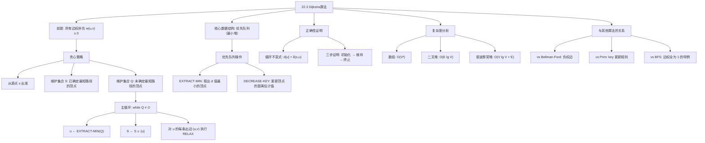
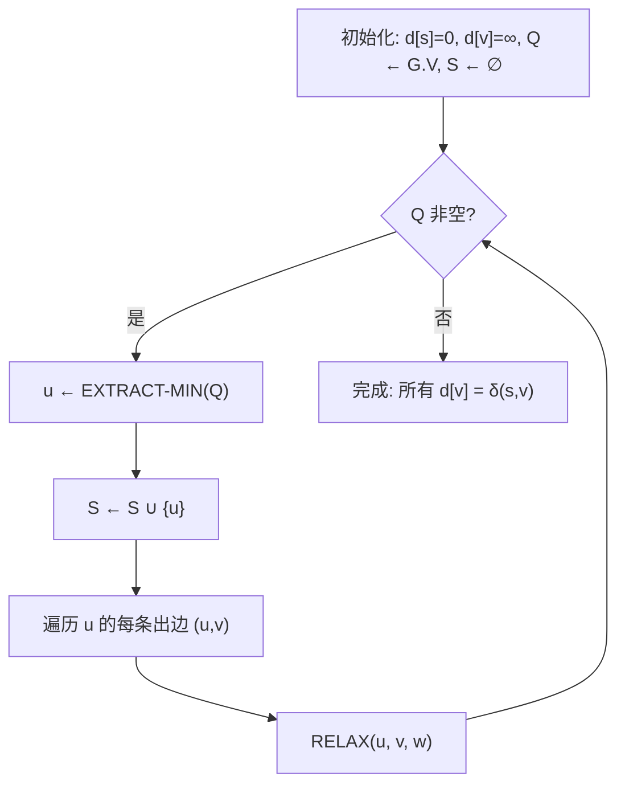

## 相关笔记

- 前置笔记：[[22.1 Bellman-Ford算法]]、[[22.2 有向无环图中的单源最短路径]]
- 关联章节：[[第21章_最小生成树-章节汇总]]、[[第06章_堆排序-章节汇总]]、[[第20章_基本图算法-章节汇总]]
- 关联概念：[[算法导论/concepts/贪心算法]]、[[算法导论/concepts/堆排序]]、[[算法导论/concepts/时间复杂度]]

> [!abstract] 概览
> 本节介绍==Dijkstra算法==，用于解决==单源最短路径问题==。该算法由荷兰计算机科学家 Edsger W. Dijkstra 于 1956 年提出，适用于==所有边权非负==的加权有向图。Dijkstra算法是一种==贪心算法==，其核心思想是：在尚未确定最短路径的顶点中，始终选择当前距离源点最近的顶点，将其标记为"已确定"，然后通过松弛（RELAX）操作更新其邻接顶点的距离估计值。
>
> **要点列表：**
> - Dijkstra算法的**前提条件**是所有边权 $w(u,v) \ge 0$
> - 使用==二叉堆==实现优先队列时，运行时间为 ==$O((V + E) \lg V)$==，对连通图即为 $O(E \lg V)$
> - 使用==斐波那契堆==实现时，运行时间优化至 ==$O(V \lg V + E)$==
> - 使用==数组==实现时，运行时间为 ==$O(V^2)$==，适合稠密图
> - Dijkstra算法**不适用于含负权边的图**，这是与[[22.1 Bellman-Ford算法]]的关键区别
> - 算法结构与[[第21章_最小生成树-章节汇总|第21章]]的Prim算法高度相似，区别仅在于key的更新规则

---

## 知识结构总览



---

## 核心思想

### 2.1 前提条件

> [!warning] 重要限制
> Dijkstra算法要求图中**所有边的权重非负**，即对每条边 $(u, v) \in E$，都有 $w(u, v) \ge 0$。如果图中存在负权边，Dijkstra算法可能产生**错误的结果**。处理含负权边的图，应使用[[22.1 Bellman-Ford算法]]。

**为什么不能有负权边？** Dijkstra算法的核心假设是：一旦某个顶点 $u$ 被从优先队列中取出（加入集合 $S$），其距离值 $d[u]$ 就等于从源点 $s$ 到 $u$ 的最短路径值 $\delta(s, u)$，此后不再被更新。如果存在负权边，一条通过 $S$ 外顶点的路径可能比已确定的路径更短，但算法不会重新考虑 $S$ 中的顶点，从而导致错误。

### 2.2 算法伪代码

Dijkstra算法的伪代码如下：

> [!tip] 算法执行流程
> 1. **初始化**：源点 s 距离设为 0，其余顶点距离设为无穷大，所有顶点加入优先队列 Q
> 2. **取出最小顶点**：从 Q 中取出距离最小的顶点 u，将其加入已确定集合 S
> 3. **松弛出边**：对 u 的每条出边 (u,v) 尝试松弛操作，更新 v 的距离估计值
> 4. **重复**：重复步骤 2-3，直到优先队列 Q 为空



```
DIJKSTRA(G, w, s)
1  INITIALIZE-SINGLE-SOURCE(G, s)
2  S ← ∅
3  Q ← G.V
4  while Q ≠ ∅
5      u ← EXTRACT-MIN(Q)
6      S ← S ∪ {u}
7      for each vertex v ∈ G.Adj[u]
8          RELAX(u, v, w)
```

其中，`INITIALIZE-SINGLE-SOURCE` 和 `RELAX` 是第22章通用的子过程：

```
INITIALIZE-SINGLE-SOURCE(G, s)
1  for each vertex v ∈ G.V
2      v.d ← ∞
3      v.π ← NIL
4  s.d ← 0
```

```
RELAX(u, v, w)
1  if v.d > u.d + w(u, v)
2      v.d ← u.d + w(u, v)
3      v.π ← u
```

**变量说明：**

- $d[v]$：从源点 $s$ 到顶点 $v$ 的**当前最短路径估计值**（上界估计）
- $\pi[v]$：顶点 $v$ 在最短路径树中的**前驱顶点**
- $S$：已经确定最短路径的顶点集合
- $Q$：优先队列（最小堆），以 $d$ 值为key，存储尚未确定最短路径的顶点
- $\delta(s, v)$：从源点 $s$ 到顶点 $v$ 的**实际最短路径值**（真实值）

**算法执行流程：**

1. **初始化**：将所有顶点的 $d$ 值设为 $\infty$，$\pi$ 值设为 NIL，源点 $s$ 的 $d$ 值设为 0。创建集合 $S = \emptyset$，将所有顶点加入优先队列 $Q$
2. **主循环**：当 $Q$ 不为空时，反复执行：
   - 从 $Q$ 中取出 $d$ 值最小的顶点 $u$（`EXTRACT-MIN` 操作）
   - 将 $u$ 加入集合 $S$
   - 对 $u$ 的每条出边 $(u, v)$ 执行松弛操作 `RELAX(u, v, w)`
3. **终止**：当 $Q$ 为空时，所有从 $s$ 可达的顶点的 $d$ 值都已等于 $\delta(s, v)$

> [!tip] 直觉理解
> Dijkstra算法的核心直觉是：**如果所有边权非负，那么当前距离源点最近的未确定顶点，其最短路径不可能再被其他路径改善**。就像在一个城市中找最短路线，如果你已经确认了到某个路口的距离是最短的，那么以后再绕路经过其他路口到达这里，只会更远（因为每段路都是正的）。

### 2.3 算法执行示例

考虑以下有向图，以顶点 $s$ 为源点：

```
    10        5
s ───→ t ───→ x
│      │      ↑
│      │      │
5      2      3
│      ↓      │
│      y ────→│
│             │
└─────────────┘
       2
```

边权如下：$w(s,t)=10$，$w(s,y)=5$，$w(t,y)=2$，$w(t,x)=5$，$w(y,t)=3$，$w(y,x)=2$，$w(x,s)=7$

**第0次迭代（初始状态）：**

| 顶点 | $s$ | $t$ | $x$ | $y$ |
|------|-----|-----|-----|-----|
| $d$  | 0   | $\infty$ | $\infty$ | $\infty$ |
| $\pi$ | NIL | NIL | NIL | NIL |

$S = \emptyset$，$Q = \{s, t, x, y\}$

**第1次迭代：** `EXTRACT-MIN(Q)` 取出 $s$（$d[s]=0$ 最小），$S = \{s\}$

松弛 $s$ 的邻边：
- $(s, t)$：$d[t] = \infty > 0 + 10 = 10$，更新 $d[t] = 10$，$\pi[t] = s$
- $(s, y)$：$d[y] = \infty > 0 + 5 = 5$，更新 $d[y] = 5$，$\pi[y] = s$

| 顶点 | $s$ | $t$ | $x$ | $y$ |
|------|-----|-----|-----|-----|
| $d$  | 0   | 10  | $\infty$ | 5   |
| $\pi$ | NIL | $s$ | NIL | $s$ |

$Q = \{t, x, y\}$

**第2次迭代：** `EXTRACT-MIN(Q)` 取出 $y$（$d[y]=5$ 最小），$S = \{s, y\}$

松弛 $y$ 的邻边：
- $(y, t)$：$d[t] = 10 > 5 + 3 = 8$，更新 $d[t] = 8$，$\pi[t] = y$
- $(y, x)$：$d[x] = \infty > 5 + 2 = 7$，更新 $d[x] = 7$，$\pi[x] = y$

| 顶点 | $s$ | $t$ | $x$ | $y$ |
|------|-----|-----|-----|-----|
| $d$  | 0   | 8   | 7   | 5   |
| $\pi$ | NIL | $y$ | $y$ | $s$ |

$Q = \{t, x\}$

**第3次迭代：** `EXTRACT-MIN(Q)` 取出 $x$（$d[x]=7$ 最小），$S = \{s, y, x\}$

松弛 $x$ 的邻边：
- $(x, s)$：$s \notin Q$，跳过

| 顶点 | $s$ | $t$ | $x$ | $y$ |
|------|-----|-----|-----|-----|
| $d$  | 0   | 8   | 7   | 5   |
| $\pi$ | NIL | $y$ | $y$ | $s$ |

$Q = \{t\}$

**第4次迭代：** `EXTRACT-MIN(Q)` 取出 $t$（$d[t]=8$），$S = \{s, y, x, t\}$

松弛 $t$ 的邻边：
- $(t, y)$：$y \notin Q$，跳过
- $(t, x)$：$x \notin Q$，跳过

| 顶点 | $s$ | $t$ | $x$ | $y$ |
|------|-----|-----|-----|-----|
| $d$  | 0   | 8   | 7   | 5   |
| $\pi$ | NIL | $y$ | $y$ | $s$ |

$Q = \emptyset$，算法终止。

**最终最短路径树：**
- $s \to y$（权5）
- $y \to t$（权3）
- $y \to x$（权2）

### 2.4 正确性证明

> [!def] 定理 22.6（Dijkstra算法的正确性）
> 设 $G = (V, E)$ 是一个加权有向图，其所有边权非负，$s \in V$ 为源点。则对于从 $s$ 可达的每个顶点 $v$，在 Dijkstra 算法终止时，$v.d = \delta(s, v)$，且前驱子图 $G_\pi$ 是一棵以 $s$ 为根的最短路径树。

**证明思路：** 使用**循环不变式**进行证明。

**循环不变式：** 在每次执行 `while` 循环体之前（即每次 `EXTRACT-MIN` 操作之前），有如下性质：

> 对每个顶点 $v \in S$，$v.d = \delta(s, v)$。

即：集合 $S$ 中的每个顶点的 $d$ 值已经等于其真正的最短路径值。

**证明分三步：**

**【循环不变式初始化：$S=\emptyset$ 时空集上全称命题平凡成立】**
**第一步：初始化。** 在第一次进入 `while` 循环之前，$S = \emptyset$，循环不变式**平凡成立**（空集上的全称命题为真）。

**【循环不变式维持：反证法证明 $u.d = \delta(s,u)$】**
**第二步：维持。** 假设在某次迭代开始时循环不变式成立，我们需要证明在本次迭代结束后它仍然成立。

设 $u$ 是本次迭代中通过 `EXTRACT-MIN(Q)` 取出的顶点。我们需要证明 $u.d = \delta(s, u)$。

**【反证：假设 $u.d > \delta(s,u)$，构造最短路径上第一个不在 $S$ 中的顶点 $y$】**
用反证法。假设 $u.d \ne \delta(s, u)$。由于 $u.d$ 始终是 $\delta(s, u)$ 的上界（由松弛操作的性质保证），所以 $u.d > \delta(s, u)$。

考虑从 $s$ 到 $u$ 的一条最短路径 $p$。由于 $s \in S$ 而 $u \notin S$（$u$ 刚从 $Q$ 中取出），路径 $p$ 上一定存在**第一条**不在 $S$ 中的顶点。设 $y$ 是这条路径上第一个不在 $S$ 中的顶点，$x$ 是 $y$ 在路径上的前驱（因此 $x \in S$）。

路径 $p$ 可以分解为：$s \leadsto x \to y \leadsto u$。

**【由循环不变式 $x.d=\delta(s,x)$，松弛 $(x,y)$ 后 $y.d=\delta(s,y)$】**
根据循环不变式的归纳假设，$x.d = \delta(s, x)$。

由于 $x$ 在 $y$ 之前被加入 $S$，当 $x$ 被处理时，边 $(x, y)$ 被松弛，因此：

$$y.d \le x.d + w(x, y) = \delta(s, x) + w(x, y) = \delta(s, y)$$

另一方面，由松弛操作的性质，$y.d \ge \delta(s, y)$ 始终成立。因此：

$$y.d = \delta(s, y)$$

又因为所有边权非负，路径 $y \leadsto u$ 上的边权之和 $\ge 0$，所以：

**【边权非负 $\Rightarrow$ $\delta(s,u) \geq \delta(s,y)=y.d$，又 $u.d \leq y.d$（EXTRACT-MIN），矛盾】**
$$\delta(s, u) = \delta(s, y) + \delta(y, u) \ge \delta(s, y) = y.d$$

而 $u$ 是 $Q$ 中 $d$ 值最小的顶点（因为它是 `EXTRACT-MIN` 的结果），所以：

$$u.d \le y.d$$

综合以上不等式：

$$u.d \le y.d = \delta(s, y) \le \delta(s, u)$$

这与假设 $u.d > \delta(s, u)$ 矛盾。因此 $u.d = \delta(s, u)$。

将 $u$ 加入 $S$ 后，$S$ 中所有顶点的 $d$ 值都等于其最短路径值，循环不变式得以维持。

**第三步：终止。** 当循环终止时，$Q = \emptyset$，因此 $S = V$。由循环不变式，对所有 $v \in V$，如果 $v$ 从 $s$ 可达，则 $v.d = \delta(s, v)$。由最短路径性质（定理22.5），前驱子图 $G_\pi$ 是一棵以 $s$ 为根的最短路径树。$\blacksquare$

> [!faq]- 关键引理：为什么 $y.d = \delta(s, y)$ 是证明的核心？
> **【核心枢纽：$y.d=\delta(s,y)$ + EXTRACT-MIN $\Rightarrow$ $u.d=\delta(s,u)$，依赖边权非负】**
> 这个等式是整个证明的关键枢纽。它的含义是：**在 $Q$ 中，真正具有最小 $\delta$ 值的顶点，其 $d$ 值也一定等于 $\delta$ 值**。一旦我们证明了这一点，结合 `EXTRACT-MIN` 总是取出 $d$ 值最小的顶点这一事实，就能推出取出的顶点 $u$ 的 $d$ 值确实等于 $\delta(s, u)$。
>
> 注意这个证明**严重依赖边权非负**的条件。如果存在负权边，那么 $\delta(s, u) < \delta(s, y)$ 可能不成立，因为从 $y$ 到 $u$ 的路径上可能有负权边使得 $\delta(y, u) < 0$，从而导致 $\delta(s, u) < \delta(s, y)$，整个不等式链就会断裂。

### 2.5 不适用于负权边的原因

> [!warning] 负权边导致错误
> Dijkstra算法在存在负权边时可能产生错误结果。以下是一个简单的反例：

考虑图：$s \to a$（权1），$s \to b$（权4），$a \to b$（权$-3$）

以 $s$ 为源点运行 Dijkstra 算法：

1. 初始：$d[s]=0$，$d[a]=\infty$，$d[b]=\infty$
2. 取出 $s$，松弛邻边：$d[a]=1$，$d[b]=4$
3. 取出 $a$（$d[a]=1 < d[b]=4$），松弛 $(a, b)$：$d[b] = \min(4, 1+(-3)) = -2$
4. 取出 $b$，$d[b]=-2$

在这个例子中，结果恰好是正确的。但如果我们修改边权：

考虑图：$s \to a$（权2），$s \to b$（权5），$a \to b$（权$-4$）

1. 初始：$d[s]=0$，$d[a]=\infty$，$d[b]=\infty$
2. 取出 $s$，松弛邻边：$d[a]=2$，$d[b]=5$
3. 取出 $a$（$d[a]=2 < d[b]=5$），松弛 $(a, b)$：$d[b] = \min(5, 2+(-4)) = -2$
4. 取出 $b$，$d[b]=-2$

结果仍然正确。关键问题出现在以下情况：

考虑图：$s \to a$（权3），$a \to b$（权2），$s \to b$（权5），$b \to a$（权$-10$）

1. 初始：$d[s]=0$，$d[a]=\infty$，$d[b]=\infty$
2. 取出 $s$，松弛：$d[a]=3$，$d[b]=5$
3. 取出 $a$（$d[a]=3 < d[b]=5$），松弛 $(a, b)$：$d[b] = \min(5, 3+2) = 5$（不变）
4. 取出 $b$（$d[b]=5$），松弛 $(b, a)$：但 $a$ 已经在 $S$ 中，**不会被重新考虑**！
5. 算法结束：$d[a]=3$，$d[b]=5$

但实际上，路径 $s \to b \to a$ 的长度为 $5 + (-10) = -5 < 3$，所以 $d[a]$ 应该是 $-5$，而不是 $3$。**Dijkstra算法给出了错误答案！**

根本原因：当 $a$ 被加入 $S$ 时，算法"认为"到 $a$ 的最短路径已经确定。但后来通过负权边 $(b, a)$ 发现了一条更短的路径，而算法不会回头更新 $S$ 中的顶点。

### 2.6 复杂度分析

Dijkstra算法的运行时间取决于优先队列的实现方式。设 $|V| = n$，$|E| = m$。

**操作分析：**

- `INITIALIZE-SINGLE-SOURCE`：$O(V)$
- `EXTRACT-MIN`：执行 $|V|$ 次
- `DECREASE-KEY`（隐含在 `RELAX` 中）：最多执行 $|E|$ 次

> [!def] 三种实现的复杂度
>
> **1. 数组实现：$O(V^2)$**
>
> - `EXTRACT-MIN`：遍历数组找最小值，$O(V)$，共 $V$ 次，总计 $O(V^2)$
> - `DECREASE-KEY`：直接修改数组元素，$O(1)$，共 $E$ 次，总计 $O(E)$
> - 总运行时间：$O(V^2 + E) = O(V^2)$（因为 $E \le V^2$）
> - 适合**稠密图**（$E = \Omega(V^2)$）
>
> **2. 二叉堆实现：$O((V + E) \lg V)$**
>
> - 建堆：$O(V)$
> - `EXTRACT-MIN`：$O(\lg V)$，共 $V$ 次，总计 $O(V \lg V)$
> - `DECREASE-KEY`：$O(\lg V)$，共 $E$ 次，总计 $O(E \lg V)$
> - 总运行时间：$O(V \lg V + E \lg V) = O((V + E) \lg V)$
> - 对连通图（$E \ge V - 1$），简化为 $O(E \lg V)$
> - 适合**稀疏图**
>
> **3. 斐波那契堆实现：$O(V \lg V + E)$**
>
> - `EXTRACT-MIN`：$O(\lg V)$ 摊还，共 $V$ 次，总计 $O(V \lg V)$
> - `DECREASE-KEY`：$O(1)$ 摊还，共 $E$ 次，总计 $O(E)$
> - 总运行时间：$O(V \lg V + E)$
> - 当 $E = o(V \lg V)$ 时优于二叉堆

> [!tip] 如何选择优先队列实现
> 实际工程中，对于稀疏图（如道路网络），二叉堆是最常用的选择，因为实现简单且性能优秀。斐波那契堆虽然理论最优，但常数因子大、实现复杂，实际应用较少。对于稠密图（如完全图），数组实现反而更高效。

### 2.7 与Prim算法的对比

Dijkstra算法与[[第21章_最小生成树-章节汇总|第21章]]的Prim算法在结构上几乎完全相同。两者的伪代码对比如下：

**Prim算法（MST-PRIM）：**

```
MST-PRIM(G, w, r)
1  for each u ∈ G.V
2      u.key ← ∞
3      u.π ← NIL
4  r.key ← 0
5  Q ← G.V
6  while Q ≠ ∅
7      u ← EXTRACT-MIN(Q)
8      for each v ∈ G.Adj[u]
9          if v ∈ Q and w(u, v) < v.key
10             v.π ← u
11             v.key ← w(u, v)
```

**Dijkstra算法（DIJKSTRA）：**

```
DIJKSTRA(G, w, s)
1  INITIALIZE-SINGLE-SOURCE(G, s)    // d[s]←0, d[v]←∞
2  S ← ∅
3  Q ← G.V
4  while Q ≠ ∅
5      u ← EXTRACT-MIN(Q)
6      S ← S ∪ {u}
7      for each v ∈ G.Adj[u]
8          RELAX(u, v, w)             // if d[v] > d[u]+w(u,v): d[v]←d[u]+w(u,v)
```

**核心区别在于key的更新规则：**

| 对比维度 | Prim算法 | Dijkstra算法 |
|---------|---------|-------------|
| 目标 | 最小生成树 | 单源最短路径 |
| key含义 | 连接到已选顶点集的最小边权 | 从源点到该顶点的最短路径估计 |
| 更新规则 | $\text{key}[v] = \min(\text{key}[v], w(u, v))$ | $d[v] = \min(d[v], d[u] + w(u, v))$ |
| 集合 $S$ | 已加入MST的顶点 | 已确定最短路径的顶点 |
| 起始顶点 | 任意顶点 $r$ | 源点 $s$ |
| 前提条件 | 连通加权无向图 | 边权非负的有向/无向图 |

> [!tip] 记忆方法
> Prim的key只看"一步之遥"的边权，Dijkstra的key看的是"从源点出发的累计距离"。Prim关心的是"怎么用最短的边把新顶点连进来"，Dijkstra关心的是"从源点走到这里总共要多远"。

### 2.8 与BFS的关系

[[第20章_基本图算法-章节汇总|第20章]]介绍的广度优先搜索（BFS）可以看作Dijkstra算法的一个**特例**。

当图中所有边的权重都为1时：

$$w(u, v) = 1 \quad \text{对所有 } (u, v) \in E$$

Dijkstra算法的松弛操作变为：

$$d[v] = \min(d[v], d[u] + 1)$$

这与BFS中通过层次遍历更新距离的方式完全一致。此时，优先队列中的 $d$ 值恰好对应BFS的层次编号，`EXTRACT-MIN` 取出的顶点顺序与BFS的遍历顺序相同。

更一般地，如果所有边权相同（设为 $c$），Dijkstra算法等价于BFS（结果只需乘以常数 $c$）。

> [!tip] 从BFS到Dijkstra的认知桥梁
> BFS解决的是"无权图"中的最短路径问题，Dijkstra解决的是"非负权图"中的最短路径问题。BFS用FIFO队列（先进先出），Dijkstra用优先队列（按距离排序）。两者都是贪心策略的体现：BFS贪心地认为"先发现的路径更短"，Dijkstra贪心地认为"当前距离最小的顶点已确定"。

---

## 补充理解

### 3.1 Dijkstra算法的发明历史

Dijkstra算法的诞生有一个广为流传的故事。荷兰计算机科学家 **Edsger Wybe Dijkstra**（1930--2002）在1956年构思了这个算法。

当时Dijkstra只有26岁，在阿姆斯特丹的荷兰数学中心（Mathematisch Centrum，现CWI）工作。他需要为计算机编程解决最短路径问题，但当时可用的计算机只有X1（一台早期计算机），而且他不想用机器语言或汇编语言来编程。

> "一天早上，我和年轻的未婚妻在阿姆斯特丹购物，累了，我们就在咖啡馆的露台上坐下来喝杯咖啡。我正在思考是否能做到这一点，然后我就设计出了最短路径算法。"
> —— Edsger W. Dijkstra

Dijkstra在1959年发表了这篇论文，题目为 *"A note on two problems in connexion with graphs"*，发表在 *Numerische Mathematik* 期刊上。这篇仅有三页的论文同时提出了Dijkstra算法和最小生成树算法（Prim算法的一个等价版本）。

Dijkstra后来获得了1972年的图灵奖，他的贡献远不止最短路径算法，还包括**信号量（semaphore）**的概念、**自顶向下编程**方法论、以及著名的**"Go To语句有害论"**。

参考来源：[Edsger Dijkstra and the shortest-path algorithm - Cornell](https://www.cs.cornell.edu/courses/JavaAndDS/shortestPath/01shortestPathHistory.pdf)

### 3.2 GPS导航与地图路由

Dijkstra算法在现代生活中最直接的应用就是**GPS导航系统**。Google Maps、Apple Maps、高德地图、百度地图等导航软件，其核心路径规划引擎都基于Dijkstra算法或其变种。

然而，直接在道路网络上运行Dijkstra算法效率不够高。一个国家的道路网络可能有数千万个节点和数亿条边，虽然 $O(E \lg V)$ 的时间复杂度在理论上可行，但在实际应用中需要进一步优化。

**实际工程中的优化技术：**

1. **A\* 算法**：在Dijkstra的基础上加入**启发函数** $h(v)$，估计从顶点 $v$ 到目标点的距离。优先队列的key变为 $d[v] + h(v)$，从而引导搜索朝目标方向进行，大幅减少探索的顶点数
2. **双向Dijkstra**：同时从源点和目标点运行Dijkstra算法，在中间相遇时停止。可将搜索空间减半
3. **收缩层次（Contraction Hierarchies, CH）**：预处理阶段通过"收缩"不重要的节点来构建层次结构，查询时只需在高层次路径上搜索
4. **Hub标签（Hub Labeling）**：预处理阶段为每个节点计算"hub标签"，查询时只需比较两个节点的标签交集
5. **分层路由**：将道路网络分为不同层级（如高速公路、主干道、地方道路），优先在高层级道路上搜索

### 3.3 A*算法与Dijkstra的关系

**A\* 算法**是最著名的路径搜索算法之一，广泛应用于游戏AI、机器人导航等领域。它与Dijkstra算法的关系非常密切：

$$\text{A}^* = \text{Dijkstra} + \text{启发函数 } h(v)$$

**具体区别：**

| 维度 | Dijkstra | A* |
|------|----------|-----|
| 优先队列key | $d[v]$（从源点到 $v$ 的距离） | $f[v] = d[v] + h(v)$ |
| 搜索方向 | 向所有方向均匀扩展 | 朝目标方向引导扩展 |
| 启发函数 | 无（$h(v) = 0$） | $h(v)$ 估计 $v$ 到目标的距离 |
| 完备性 | 是 | 是（需 $h(v)$ 可容许） |
| 最优性 | 是 | 是（需 $h(v)$ 可容许且一致） |
| 效率 | 探索较多顶点 | 通常探索更少顶点 |

**可容许启发函数（Admissible Heuristic）：** $h(v) \le \delta(v, t)$，即启发函数永远不会高估从 $v$ 到目标 $t$ 的实际最短距离。

当 $h(v) = 0$ 对所有 $v$ 成立时，A\* 退化为Dijkstra算法。因此，**Dijkstra是A\* 的特例**。

### 3.4 Dijkstra算法的其他应用

除了路径规划，Dijkstra算法还广泛应用于：

- **网络路由协议**：OSPF（Open Shortest Path First）协议使用Dijkstra算法计算最短路径树
- **社交网络分析**：计算用户之间的最短关系链
- **编译器优化**：寄存器分配中的干涉图分析
- **机器人学**：运动规划和避障
- **游戏开发**：NPC寻路（通常使用A\*，但Dijkstra是基础）

---

## 易混淆点

### 4.1 Dijkstra中的key与dist

> [!faq]- key和dist是同一个东西吗？
> 是的。在CLRS的描述中，优先队列以 $d[v]$（也称为key）为排序依据。$d[v]$ 是从源点 $s$ 到顶点 $v$ 的**最短路径估计值**（upper bound）。不同教材可能使用不同的命名：
> - CLRS 使用 $d[v]$（distance estimate）
> - 有些教材使用 $\text{dist}[v]$
> - 有些教材使用 $\text{key}[v]$
>
> 它们指的是同一个概念：**当前已知的从源点到该顶点的最短路径长度的上界估计**。

### 4.2 Dijkstra vs Bellman-Ford

> [!faq]- 什么时候用Dijkstra，什么时候用Bellman-Ford？
> **Dijkstra算法**适用于所有边权非负的图，效率更高：
> - 时间复杂度：$O(E \lg V)$（二叉堆）或 $O(V \lg V + E)$（斐波那契堆）
> - 贪心策略，不处理负权边
> - 不检测负权环
>
> **Bellman-Ford算法**适用于含负权边的图，但效率较低：
> - 时间复杂度：$O(VE)$
> - 可以检测负权环
> - 对所有边进行 $|V|-1$ 轮松弛
>
> **选择建议：**
> - 如果确定没有负权边 → 用Dijkstra（更快）
> - 如果可能有负权边 → 用Bellman-Ford（更安全）
> - 如果需要检测负权环 → 只能用Bellman-Ford

### 4.3 Dijkstra vs Prim

> [!faq]- Dijkstra和Prim看起来几乎一样，到底有什么区别？
> 两者的伪代码结构确实高度相似（都是贪心 + 优先队列），但**目标不同**导致**key的更新规则不同**：
>
> - **Prim**：$\text{key}[v] = \min(\text{key}[v], w(u, v))$——只看"一步"的边权
> - **Dijkstra**：$d[v] = \min(d[v], d[u] + w(u, v))$——看"从源点出发的累计距离"
>
> 直觉上：Prim在"长树"（找最小的边把新节点连进树），Dijkstra在"找路"（找从源点出发的最短路径）。Prim的key是局部信息（只与父节点有关），Dijkstra的key是全局信息（与源点的累计距离有关）。

### 4.4 为什么DECREASE-KEY是关键操作

> [!faq]- DECREASE-KEY在Dijkstra中为什么如此重要？
> 在Dijkstra算法的主循环中，每次取出最小key的顶点后，需要对其所有邻接顶点尝试松弛。松弛操作可能降低某个顶点的 $d$ 值，这就需要在优先队列中更新该顶点的key——这就是 `DECREASE-KEY` 操作。
>
> `DECREASE-KEY` 的执行次数最多为 $|E|$ 次（每条边最多触发一次成功的松弛），而 `EXTRACT-MIN` 执行 $|V|$ 次。因此：
>
> - 在二叉堆中，`DECREASE-KEY` 每次 $O(\lg V)$，总计 $O(E \lg V)$
> - 在斐波那契堆中，`DECREASE-KEY` 摊还 $O(1)$，总计 $O(E)$
>
> 斐波那契堆之所以能让Dijkstra更快，正是因为它将 `DECREASE-KEY` 从 $O(\lg V)$ 优化到了摊还 $O(1)$。

### 4.5 Dijkstra能否处理无向图？

> [!faq]- Dijkstra算法能用于无向图吗？
> 可以。无向图可以看作每条无向边被替换为两条方向相反的有向边（权值相同）的有向图。只要所有边权非负，Dijkstra算法同样适用。实际上，GPS导航中的道路网络就是无向图（或双向图）的典型应用场景。

### 4.6 源点出发的边可以有负权吗？

> [!faq]- 如果只有从源点出发的边有负权，其他边非负，Dijkstra还能正确工作吗？
> 可以。习题22.3-10（对应第3版习题24.3-10）讨论了这种情况。正确性证明的关键不等式 $\delta(s, y) \le \delta(s, u)$ 仍然成立，因为 $y$ 到 $u$ 的路径上的所有边（除了可能从 $s$ 出发的边）都是非负的，而如果涉及从 $s$ 出发的负权边，则意味着路径中存在环，只有当该环是负权环时才会出问题，但题目已排除负权环。

---

## 习题精选

### 习题 22.3-1（对应第3版 24.3-1）

> [!faq]- 题目
> 对图22.2的有向图运行Dijkstra算法，分别以顶点 $s$ 和顶点 $z$ 为源点。按照图22.6的风格，展示每次 `while` 循环迭代后的 $d$ 和 $\pi$ 值以及集合 $S$ 中的顶点。

**以 $s$ 为源点的 $d$ 值变化：**

$$
\begin{array}{ccccc}
s & t & x & y & z \\
\hline
0 & 3 & \infty & 5 & \infty \\
0 & 3 & 9 & 5 & \infty \\
0 & 3 & 9 & 5 & 11 \\
0 & 3 & 9 & 5 & 11 \\
0 & 3 & 9 & 5 & 11
\end{array}
$$

**以 $s$ 为源点的 $\pi$ 值变化：**

$$
\begin{array}{ccccc}
s & t & x & y & z \\
\hline
\text{NIL} & s & \text{NIL} & \text{NIL} & \text{NIL} \\
\text{NIL} & s & t & s & \text{NIL} \\
\text{NIL} & s & t & s & y \\
\text{NIL} & s & t & s & y \\
\text{NIL} & s & t & s & y
\end{array}
$$

**以 $z$ 为源点的 $d$ 值变化：**

$$
\begin{array}{ccccc}
s & t & x & y & z \\
\hline
3 & \infty & 7 & \infty & 0 \\
3 & 6 & 7 & 8 & 0 \\
3 & 6 & 7 & 8 & 0 \\
3 & 6 & 7 & 8 & 0 \\
3 & 6 & 7 & 8 & 0
\end{array}
$$

**以 $z$ 为源点的 $\pi$ 值变化：**

$$
\begin{array}{ccccc}
s & t & x & y & z \\
\hline
z & \text{NIL} & z & \text{NIL} & \text{NIL} \\
z & s & z & s & \text{NIL} \\
z & s & z & s & \text{NIL} \\
z & s & z & s & \text{NIL} \\
z & s & z & s & \text{NIL}
\end{array}
$$

### 习题 22.3-2（对应第3版 24.3-2）

> [!faq]- 题目
> 给出一个简单的含负权边的有向图例子，使得Dijkstra算法产生错误答案。为什么当允许负权边时，定理22.6的证明不能通过？

**反例：** 考虑一个包含负权环的图。`RELAX` 只被调用有限次，但负权环上每个顶点的最短路径值为 $-\infty$，因此Dijkstra算法不可能给出正确结果。

**证明失效的原因：** 定理22.6的证明依赖于不等式 $\delta(s, y) \le \delta(s, u)$。当存在负权边时，这个不等式不再成立，因为从 $y$ 到 $u$ 的路径上可能有负权边，使得 $\delta(y, u) < 0$，从而 $\delta(s, u) = \delta(s, y) + \delta(y, u) < \delta(s, y)$。

### 习题 22.3-3（对应第3版 24.3-3）

> [!faq]- 题目
> 假设我们将Dijkstra算法的第4行改为 `while |Q| > 1`，使 `while` 循环执行 $|V| - 1$ 次而非 $|V|$ 次。这个修改后的算法是否正确？

**答案：是的，算法仍然正确。**

**【未取出顶点 $u$：不可达时 $d[u]=\infty=\delta$；可达时前驱边已被松弛，$d[u]=\delta$】**
设 $u$ 是唯一一个未被从优先队列 $Q$ 中取出的顶点。

- 如果 $u$ 从 $s$ 不可达，则 $u.d = \delta(s, u) = \infty$，结果正确
- 如果 $u$ 从 $s$ 可达，则存在一条最短路径 $p = s \leadsto x \to u$。当顶点 $x$ 被取出时，$x.d = \delta(s, x)$（由循环不变式保证），然后边 $(x, u)$ 被松弛，因此 $u.d = \delta(s, u)$

无论哪种情况，$u.d$ 在算法终止时都等于 $\delta(s, u)$。

### 习题 22.3-4（对应第3版 24.3-4）

> [!faq]- 题目
> Gaedel教授写了一个声称实现了Dijkstra算法的程序，程序对每个顶点 $v \in V$ 产生 $v.d$ 和 $v.\pi$。给出一个 $O(V + E)$ 时间的算法来检查该程序的输出，判断 $d$ 和 $\pi$ 属性是否与某棵最短路径树匹配。可以假设所有边权非负。

**思路：** 检查以下条件：

1. **源点检查**：$s.d = 0$，$s.\pi = \text{NIL}$
2. **前驱树检查**：$\pi$ 值构成一棵以 $s$ 为根的树（通过从每个顶点沿 $\pi$ 回溯到 $s$ 来验证，总时间 $O(V)$）
3. **边权一致性检查**：对每个 $v \ne s$，检查 $v.d = \pi[v].d + w(\pi[v], v)$，总时间 $O(V)$
4. **最短路径检查**：对每条边 $(u, v) \in E$，检查 $v.d \le u.d + w(u, v)$（三角不等式），总时间 $O(E)$

如果以上所有条件都满足，则输出确实对应一棵最短路径树。总运行时间 $O(V + E)$。

### 习题 22.3-5（对应第3版 24.3-5）

> [!faq]- 题目
> Newman教授认为他想出了一个更简单的Dijkstra算法正确性证明。他声称Dijkstra算法按照最短路径上边的出现顺序松弛了图中每条最短路径的所有边，因此路径松弛性质适用于从源点可达的每个顶点。通过构造一个有向图，证明Newman教授是错误的——Dijkstra算法可能以错误的顺序松弛某条最短路径上的边。

**反例构造：** 考虑以下图：

- 顶点：$s, a, b, c$
- 边：$(s, a)$ 权1，$(s, b)$ 权3，$(a, b)$ 权1，$(b, c)$ 权1

从 $s$ 到 $c$ 的最短路径为 $s \to a \to b \to c$，长度为 $1+1+1=3$。

Dijkstra算法的执行过程：
1. 取出 $s$，松弛 $(s, a)$ 和 $(s, b)$：$d[a]=1$，$d[b]=3$
2. 取出 $a$（$d[a]=1 < d[b]=3$），松弛 $(a, b)$：$d[b] = \min(3, 1+1) = 2$
3. 取出 $b$（$d[b]=2$），松弛 $(b, c)$：$d[c] = 2+1 = 3$
4. 取出 $c$

注意：边 $(s, b)$ 在第1步被松弛，但最短路径 $s \to a \to b \to c$ 中并不包含 $(s, b)$。更关键的是，边 $(a, b)$ 在边 $(s, b)$ **之后**才被松弛，而如果 $(s, b)$ 是最短路径上的边，这种"乱序"松弛就不会影响结果。但Newman教授声称的是"按照最短路径上边的出现顺序松弛"，这在某些图结构中并不成立。

### 习题 22.3-6（对应第3版 24.3-6）

> [!faq]- 题目
> 给定一个有向图 $G = (V, E)$，每条边 $(u, v) \in E$ 有一个关联值 $r(u, v) \in [0, 1]$，表示从 $u$ 到 $v$ 的通信信道的可靠性（不失败的概率），且各信道独立。给出一个高效算法来寻找两个给定顶点之间的最可靠路径。

**解法：** 将问题转化为最短路径问题。

一条路径 $p = v_0 \to v_1 \to \cdots \to v_k$ 的可靠性为各边可靠性的乘积：

$$R(p) = \prod_{i=0}^{k-1} r(v_i, v_{i+1})$$

要最大化 $R(p)$，等价于最大化 $\lg R(p) = \sum_{i=0}^{k-1} \lg r(v_i, v_{i+1})$。

由于 $0 \le r(u, v) \le 1$，所以 $\lg r(u, v) \le 0$。令 $w(u, v) = -\lg r(u, v) \ge 0$，则最大化 $\lg R(p)$ 等价于最小化 $\sum w(v_i, v_{i+1})$。

由于 $w(u, v) \ge 0$，可以直接使用Dijkstra算法求解。运行时间为 $O((V + E) \lg V)$（使用二叉堆）。

### 习题 22.3-7（对应第3版 24.3-7）

> [!faq]- 题目
> 设 $G = (V, E)$ 是一个加权有向图，权函数 $w: E \to \{1, 2, \ldots, W\}$，假设没有两个顶点有相同的从源点 $s$ 出发的最短路径权值。现在定义一个无权有向图 $G' = (V \cup V', E')$，将 $G$ 中每条边 $(u, v) \in E$ 替换为 $w(u, v)$ 条串联的单位权边。$G'$ 有多少个顶点？证明在 $G'$ 上运行BFS时，将 $V$ 中的顶点染黑的顺序与在 $G$ 上运行Dijkstra算法时从优先队列中取出顶点的顺序相同。

**顶点数：** $G'$ 的顶点数为 $|V| + \sum_{(u,v) \in E} w(u,v) - |E|$。每条权为 $w(u,v)$ 的边被替换为 $w(u,v)$ 条串联边，需要 $w(u,v) - 1$ 个额外的中间顶点。

**正确性论证：** 在 $G'$ 中，从 $s$ 到 $v \in V$ 的BFS距离恰好等于 $G$ 中从 $s$ 到 $v$ 的最短路径权值。由于没有两个顶点的最短路径权值相同，BFS将按照最短路径权值从小到大的顺序将 $V$ 中的顶点染黑，这与Dijkstra算法中 `EXTRACT-MIN` 的取出顺序完全一致。

### 习题 22.3-8（对应第3版 24.3-8）

> [!faq]- 题目
> 设 $G = (V, E)$ 是一个加权有向图，权函数 $w: E \to \{0, 1, \ldots, W\}$。修改Dijkstra算法，使其在 $O(WV + E)$ 时间内计算从给定源点 $s$ 出发的最短路径。

**解法：** 由于边权为非负整数且不超过 $W$，可以使用一个大小为 $W+1$ 的**桶数组**（bucket array）代替优先队列。

每个桶 $B[i]$ 存储所有 $d$ 值等于 $i$ 的顶点。维护一个当前最小距离的指针 `cur`。

- `EXTRACT-MIN`：从 $B[\text{cur}]$ 中取出一个顶点，如果 $B[\text{cur}]$ 为空则递增 `cur`。均摊 $O(1)$
- `DECREASE-KEY`：将顶点从旧桶移到新桶。$O(1)$

由于 `cur` 最多从 0 增长到 $W \cdot (|V|-1)$（最短路径的最大可能值），总运行时间为 $O(WV + E)$。

### 习题 22.3-9（对应第3版 24.3-9）

> [!faq]- 题目
> 修改习题22.3-8的算法，使其在 $O((V + E) \lg W)$ 时间内运行。

**提示：** 在 $V - S$ 中任意时刻有多少个不同的最短路径估计值？

**解法：** 关键观察是：在任意时刻，$Q$ 中顶点的 $d$ 值最多有 $W$ 个不同的取值（因为每次松弛操作将 $d[v]$ 设为 $d[u] + w(u,v)$，其中 $w(u,v) \le W$，所以 $d$ 值的跨度不超过 $W$）。

使用一个**最小-最大堆**（min-max heap）或**多层桶**（radix heap）数据结构，可以在 $O(\lg W)$ 时间内完成 `EXTRACT-MIN` 和 `DECREASE-KEY`。

- `EXTRACT-MIN`：$O(\lg W)$，共 $V$ 次，总计 $O(V \lg W)$
- `DECREASE-KEY`：$O(\lg W)$，共 $E$ 次，总计 $O(E \lg W)$
- 总运行时间：$O((V + E) \lg W)$

### 习题 22.3-10（对应第3版 24.3-10）

> [!faq]- 题目
> 假设给定一个加权有向图 $G = (V, E)$，其中离开源点 $s$ 的边可能有负权，其他所有边权非负，且没有负权环。证明Dijkstra算法能正确找到从 $s$ 出发的最短路径。
>
> **【关键不等式 $\delta(s,y) \leq \delta(s,u)$ 仍成立：$y \ne s$，从 $y$ 出发的边均非负】**
> **证明：** 定理22.6的证明完全按照书中的论述通过。证明中的关键事实是 $\delta(s, y) \le \delta(s, u)$。书中的论证声称这成立是因为没有负权边，但实际上需要的条件比这更弱。

如果 $y$ 出现在从 $s$ 到 $u$ 的一条最短路径上且 $y \ne s$，那么从 $y$ 到 $u$ 的路径上的所有边都具有非负权值（因为只有从 $s$ 出发的边可能有负权，而 $y \ne s$，所以从 $y$ 出发的边不可能有负权）。如果从 $y$ 到 $u$ 的路径上有负权边，这意味着路径经过了某条从 $s$ 出发的负权边，这暗示路径中包含一个环，而只有当该环是负权环时才会导致问题，但题目已排除负权环。

因此 $\delta(s, y) \le \delta(s, u)$ 仍然成立，整个证明链不受影响。$\blacksquare$

---

## 视频学习指南

> [!info] 推荐学习资源
>
> **中文资源：**
> - **bilibili - 王道考研 数据结构**：搜索"Dijkstra算法"，有详细的动画演示和手算过程
> - **bilibili - 代码随想录**：搜索"Dijkstra"，有算法实现和LeetCode题目讲解
>
> **英文资源：**
> - **MIT 6.006 Introduction to Algorithms**（Lecture 17）：Dijkstra算法的完整讲解，包含正确性证明
> - **Abdul Bari - Dijkstra's Algorithm**（YouTube）：10分钟直观讲解，适合快速理解
> - **WilliamFiset - Dijkstra's Algorithm**（YouTube）：有详细的逐步动画演示
>
> **可视化工具：**
> - **USFCA Visualizer**（https://www.cs.usfca.edu/~galles/visualization/Dijkstra.html）：交互式Dijkstra算法动画
> - **VisuAlgo**（https://visualgo.net/en/sssp）：支持多种最短路径算法的可视化对比

---

## 教材原文

> [!quote] CLRS 第4版 第22.3节（英文原版摘要）
>
> "Dijkstra's algorithm solves the single-source shortest-paths problem on a weighted, directed graph $G = (V, E)$ for the case in which all edge weights are nonnegative."
>
> "Dijkstra's algorithm maintains a set $S$ of vertices whose final shortest-path weights from the source $s$ have already been determined. The algorithm repeatedly selects the vertex $u \in V - S$ with the minimum shortest-path estimate, adds $u$ to $S$, and relaxes all edges leaving $u$."
>
> "The algorithm uses a min-priority queue $Q$ keyed on the $d$ attributes. The implementation of EXTRACT-MIN and DECREASE-KEY determines the running time."

> [!note] 教材原文参考
> 完整原文请参阅《算法导论（第4版）》第22章第3节，或原始素材目录中的PDF文件：
> - `00-Raw素材/算法导论_第四版/Part_VI_Graph_Algorithms/22_Single-Source_Shortest_Paths/22.3_Dijkstra's_algorithm.pdf`

---

## 参见Wiki

> [!note] 概念页尚未创建
> 以下概念页待后续补充：
> - [[算法导论/concepts/Dijkstra算法|Dijkstra算法]] — 独立概念页
> - [[算法导论/concepts/松弛操作|松弛操作]] — 单源最短路径的核心操作
> - [[算法导论/concepts/最短路径树|最短路径树]] — Dijkstra算法的输出结构
> - [[算法导论/concepts/优先队列|优先队列]] — Dijkstra算法的关键数据结构
- [[算法导论/theorems/Dijkstra正确性定理]]

#学习/算法导论/第22章-单源最短路径 #学习/算法导论/单源最短路径/Dijkstra算法
