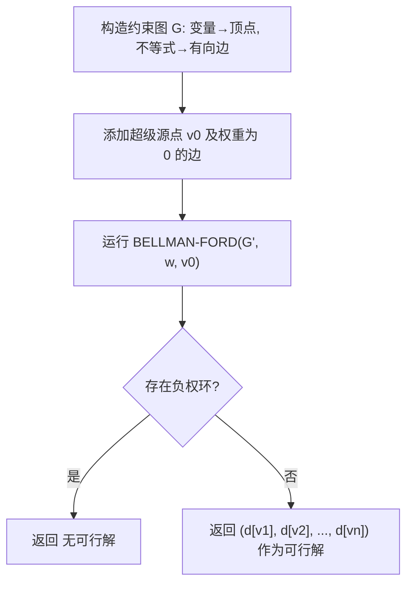

## 相关笔记

- 前置知识：[[22.1 Bellman-Ford算法]]、[[第20章_基本图算法-章节汇总]]
- 后续笔记：[[22.5 最短路径性质的证明]]

> [!abstract] 概览
> 本节介绍==差分约束系统==（System of Difference Constraints）的概念，并展示如何将其转化为==单源最短路径问题==来求解。差分约束系统是一类特殊的线性不等式组，其中每个不等式形如 $x_j - x_i \leq b_k$。通过构造==约束图==（constraint graph）并运行 [[22.1 Bellman-Ford算法]]，可以高效地判断系统是否有可行解，并在有解时求出一个可行解。
>
> **要点列表：**
> - 差分约束系统由 $n$ 个未知数和 $m$ 个形如 $x_j - x_i \leq b_k$ 的不等式组成
> - 构造约束图：每个变量对应一个顶点，每个不等式对应一条有向边
> - 添加==超级源点== $v_0$，使其到所有顶点有权为 0 的边
> - 运行 Bellman-Ford 算法，最短路径估计值即为可行解
> - 系统有可行解的充要条件是约束图中==无负权环==
> - 差分约束是==线性规划==（Linear Programming）的特殊形式

---

## 知识结构总览

```mermaid
flowchart TD
    A["22.4 差分约束与最短路径"] --> B["差分约束系统定义"]
    A --> C["约束图构造"]
    A --> D["求解算法"]
    A --> E["正确性证明"]
    A --> F["应用与拓展"]

    B --> B1["n 个未知数 x_1,...,x_n"]
    B --> B2["m 个不等式 x_j - x_i <= b_k"]
    B --> B3["矩阵形式 Ax <= b"]

    C --> C1["每个变量 = 一个顶点"]
    C --> C2["每个不等式 = 一条有向边"]
    C --> C3["边 i→j 权为 b_k"]
    C --> C4["添加超级源点 v_0"]

    D --> D1["Bellman-Ford 算法"]
    D --> D2["O(V·E) 时间复杂度"]
    D --> D3["检测负权环 → 无解"]
    D --> D4["d(v_0, v_i) = 可行解"]

    E --> E1["三角不等式 → 约束满足"]
    E --> E2["定理 22.7: 有解 ⟺ 无负权环"]
    E --> E3["解的最大分量性质"]

    F --> F1["调度问题"]
    F --> F2["VLSI 布局约束"]
    F --> F3["飞行机组调度"]
    F --> F4["系统验证时序约束"]
    F --> F5["与线性规划的关系"]
```



---

## 核心思想

> [!tip] 核心思路
> 差分约束系统的核心思想是**将不等式组转化为图论问题**。每个形如 $x_j - x_i \leq b_k$ 的不等式可以自然地映射为图中的有向边 $i \to j$（权为 $b_k$），而求解不等式组等价于在图中寻找满足三角不等式的最短路径值。Bellman-Ford 算法恰好能同时完成这两件事：计算最短路径并检测负权环（对应无解情况）。这种转化体现了图论作为"万能建模工具"的强大之处。

### 2.1 差分约束系统的定义

> [!def] 差分约束系统（System of Difference Constraints）
> 给定 $n$ 个未知数 $x_1, x_2, \ldots, x_n$ 和 $m$ 个不等式约束，其中每个约束形如：
>
> $$x_j - x_i \leq b_k$$
>
> 其中 $i, j \in \{1, 2, \ldots, n\}$，$b_k \in \mathbb{R}$。这组约束构成的系统称为==差分约束系统==。
>
> 系统的一个==可行解==（feasible solution）是满足所有 $m$ 个不等式的一组赋值 $(x_1, x_2, \ldots, x_n)$。

**矩阵形式：** 差分约束系统可以写成矩阵形式 $Ax \leq b$，其中：
- $A$ 是一个 $m \times n$ 的矩阵，每行恰好有一个 $+1$ 和一个 $-1$，其余元素为 $0$
- $x = (x_1, x_2, \ldots, x_n)^T$ 是未知数向量
- $b = (b_1, b_2, \ldots, b_m)^T$ 是常数向量

**直观理解：** 差分约束描述的是变量之间的"相对距离"限制。例如 $x_2 - x_1 \leq 3$ 表示"变量 $x_2$ 不能比 $x_1$ 大超过 3"。这就像是一组"距离约束"——如果将变量想象成时间轴上的事件，每个不等式规定了两个事件之间的最大时间间隔。

### 2.2 约束图（Constraint Graph）

> [!def] 约束图（Constraint Graph）
> 给定一个包含 $n$ 个未知数和 $m$ 个不等式 $x_j - x_i \leq b_k$ 的差分约束系统，其对应的==约束图== $G = (V, E)$ 构造如下：
>
> - **顶点集** $V = \{v_1, v_2, \ldots, v_n\}$，每个变量 $x_i$ 对应一个顶点 $v_i$
> - **边集** $E = \{(v_i, v_j)\}$，每个不等式 $x_j - x_i \leq b_k$ 对应一条从 $v_i$ 到 $v_j$ 的有向边，权为 $b_k$

**构造规则的直觉：** 不等式 $x_j - x_i \leq b_k$ 可以改写为 $x_j \leq x_i + b_k$。这恰好对应==松弛操作==（relaxation）的条件：$d[v_j] \leq d[v_i] + w(v_i, v_j)$。因此，如果我们将 $d[v_i]$ 看作 $x_i$ 的值，那么最短路径的三角不等式自然保证了所有约束被满足。

### 2.3 添加超级源点

> [!def] 超级源点（Super Source）
> 为了确保从源点出发能到达所有顶点，我们在约束图中添加一个新的顶点 $v_0$（称为==超级源点==），并添加 $n$ 条从 $v_0$ 到每个 $v_i$ 的有向边，权值均为 $0$。得到的新图记为 $G' = (V', E')$，其中：
>
> - $V' = V \cup \{v_0\}$
> - $E' = E \cup \{(v_0, v_i) : i = 1, 2, \ldots, n\}$

**超级源点的必要性：** Bellman-Ford 算法要求从源点出发能到达所有顶点。原始约束图可能不满足这个条件（某些顶点可能没有入边）。添加超级源点保证了图的连通性，使得 Bellman-Ford 能正确计算所有顶点的最短路径估计值。

**关键性质：** 由于 $v_0$ 到每个 $v_i$ 有权为 $0$ 的边，所以 $\delta(v_0, v_i) \leq 0$ 对所有 $i$ 成立。这意味着求得的可行解中，所有变量的值都非正。

### 2.4 定理 22.7（差分约束系统的可行解）

> [!def] 定理 22.7（差分约束系统有可行解的充要条件）
> 给定一个差分约束系统 $Ax \leq b$，设 $G'$ 为添加超级源点后的约束图。则：
>
> **该差分约束系统有可行解，当且仅当 $G'$ 中不包含从 $v_0$ 可达的负权环。**

> [!faq]- 证明
> **必要性（⇒）：如果系统有可行解，则 $G'$ 中无负权环。**
>
> **【可行解满足 $x_j \leq x_i + w(v_i,v_j)$，沿路径展开得环权 $w(c) \geq 0$】**
> 设 $(x_1, x_2, \ldots, x_n)$ 是一个可行解。对 $G'$ 中任意一条边 $(v_i, v_j) \in E'$，分两种情况讨论：
>
> **情况1：** 边 $(v_i, v_j)$ 来自原始约束，即对应不等式 $x_j - x_i \leq b_k$。由可行解的定义，$x_j - x_i \leq b_k = w(v_i, v_j)$，即 $x_j \leq x_i + w(v_i, v_j)$。
>
> **情况2：** 边 $(v_0, v_j)$ 是超级源点添加的边，权为 $0$。令 $x_0 = 0$，则 $x_j \leq x_0 + 0 = 0$，即 $x_j \leq x_0 + w(v_0, v_j)$。
>
> 因此，对所有边 $(v_i, v_j) \in E'$，都有 $x_j \leq x_i + w(v_i, v_j)$。
>
> 设 $c = \langle v_0, v_{i_1}, v_{i_2}, \ldots, v_{i_k} \rangle$ 是 $G'$ 中从 $v_0$ 出发的任意一条路径。沿路径逐步展开不等式：
> $$x_{i_1} \leq x_0 + w(v_0, v_{i_1})$$
> $$x_{i_2} \leq x_{i_1} + w(v_{i_1}, v_{i_2}) \leq x_0 + w(v_0, v_{i_1}) + w(v_{i_1}, v_{i_2})$$
> $$\vdots$$
> $$x_{i_k} \leq x_0 + \sum_{m=1}^{k} w(v_{i_{m-1}}, v_{i_m})$$
>
> 其中 $v_{i_0} = v_0$。如果 $c$ 是一个环（即 $v_{i_k} = v_0$），则 $x_0 \leq x_0 + w(c)$，即 $w(c) \geq 0$。
>
> 这说明 $G'$ 中从 $v_0$ 可达的任何环的权值都非负，即不存在负权环。
>
> ---
>
> **充分性（⇐）：如果 $G'$ 中无负权环，则系统有可行解。**
>
> **【Bellman-Ford 得 $d[v_i]=\delta(v_0,v_i)$，由三角不等式 $d[v_j] \leq d[v_i]+b_k$ 即满足约束】**
> 在 $G'$ 上运行 Bellman-Ford 算法，以 $v_0$ 为源点。由于 $G'$ 中无负权环，算法不会报告"负权环存在"，且对所有 $v \in V'$，$d[v] = \delta(v_0, v)$。
>
> 令 $x_i = d[v_i] = \delta(v_0, v_i)$（$i = 1, 2, \ldots, n$）。我们需要证明这组值满足所有约束。
>
> 对原始约束图中的任意边 $(v_i, v_j)$，权为 $b_k$。由 Bellman-Ford 算法的==三角不等式==（Lemma 22.1）：
> $$\delta(v_0, v_j) \leq \delta(v_0, v_i) + w(v_i, v_j)$$
>
> 即：
> $$x_j \leq x_i + b_k$$
> $$x_j - x_i \leq b_k$$
>
> 这正是原始不等式约束。因此 $(x_1, x_2, \ldots, x_n) = (d[v_1], d[v_2], \ldots, d[v_n])$ 是一组可行解。$\blacksquare$

### 2.5 求解算法

> [!tip] 算法执行流程
> 1. **构造约束图**：将每个变量映射为顶点，每个不等式 xj - xi <= bk 映射为有向边 (i,j)，权重为 bk
> 2. **添加超级源点**：新增顶点 v0，从 v0 到所有顶点添加权重为 0 的边
> 3. **运行 Bellman-Ford**：以 v0 为源点在约束图上运行 Bellman-Ford 算法
> 4. **判断结果**：若存在负权环则系统无可行解；否则返回各顶点的最短路径距离作为可行解



```
SOLVE-DIFFERENCE-CONSTRAINTS(A, b)
1  构造约束图 G = (V, E)
2  添加超级源点 v_0 和边 (v_0, v_i)，权为 0，对所有 i
3  运行 BELLMAN-FORD(G', w, v_0)
4  if BELLMAN-FORD 返回 FALSE（存在负权环）
5      then return "无可行解"
6  else return (d[v_1], d[v_2], ..., d[v_n])
```

**算法说明：**
- 第1行：根据差分约束系统构造约束图，每个变量一个顶点，每个不等式一条有向边
- 第2行：添加超级源点，确保所有顶点从源点可达
- 第3行：运行 Bellman-Ford 算法，时间复杂度为 $O((n+1)(m+n)) = O(n(m+n))$
- 第4-6行：根据 Bellman-Ford 的结果判断系统是否有可行解

> [!tip] 时间复杂度优化
> 如果不添加超级源点 $v_0$，而是将所有 $d[v_i]$ 初始化为 $0$，则可以直接在原始约束图（$n$ 个顶点、$m$ 条边）上运行 Bellman-Ford 的松弛循环，时间复杂度降为 $O(nm)$。这是因为初始化 $d[v_i] = 0$ 等价于从超级源点出发执行了一轮松弛（超级源点到每个顶点的边权为 0，松弛后 $d[v_i] = 0$）。

### 2.6 与线性规划的关系

> [!info] 差分约束与线性规划
> 差分约束系统 $Ax \leq b$ 是==线性规划==（Linear Programming, LP）的一种特殊形式。一般线性规划的目标是：
>
> $$\text{最大化（或最小化）} \quad c^T x \quad \text{ subject to } \quad Ax \leq b$$
>
> 在差分约束系统中，矩阵 $A$ 的每行恰好有一个 $+1$ 和一个 $-1$，这赋予了问题特殊的图论结构。
>
> **重要结论：**
> - Bellman-Ford 算法在约束图上求得的解 $(d[v_1], \ldots, d[v_n])$ 实际上==最大化了== $\sum_{i=1}^{n} x_i$，约束条件为 $Ax \leq b$ 且 $x_i \leq 0$（对所有 $i$）
> - 同时，Bellman-Ford 求得的解==最小化了== $\max\{x_i\} - \min\{x_i\}$，约束条件为 $Ax \leq b$
>
> 这些性质使得差分约束系统成为连接图论与线性规划的桥梁。

### 2.7 等式约束的处理

> [!def] 等式约束的转化
> 如果差分约束系统中还包含等式约束 $x_i = x_j + b_k$，可以将其转化为两个不等式约束：
>
> $$x_i - x_j \leq b_k \quad \text{和} \quad x_j - x_i \leq -b_k$$
>
> 这两个不等式合起来等价于 $x_i - x_j = b_k$，即 $x_i = x_j + b_k$。
>
> 转化后，仍然可以用 Bellman-Ford 算法求解。

### 2.8 单变量约束的处理

> [!def] 单变量约束的转化
> 如果系统中还包含单变量约束（即只涉及一个变量的不等式），可以分两种情况处理：
>
> - **$x_i \leq b_k$**：添加边 $(v_0, v_i)$，权为 $b_k$（注意：这不同于超级源点的权为 0 的边，需要单独处理）
> - **$-x_i \leq b_k$**（即 $x_i \geq -b_k$）：添加边 $(v_i, v_0)$，权为 $-b_k$
>
> 通过引入辅助顶点 $v_0$，可以将单变量约束也纳入约束图的框架。

---

## 补充理解与拓展

> [!info] 补充1：调度问题中的差分约束
>
> 差分约束系统最经典的应用之一是==调度问题==（scheduling problem）。考虑 $n$ 个任务，每个任务有一个开始时间 $x_i$。任务之间的依赖关系和约束可以自然地表示为差分约束：
>
> - **先后约束**：任务 $j$ 必须在任务 $i$ 完成后才能开始。如果任务 $i$ 的持续时间为 $a_i$，则 $x_j \geq x_i + a_i$，即 $x_i - x_j \leq -a_i$
> - **时间窗口约束**：任务 $i$ 必须在时间 $d_i$ 之前完成。如果持续时间为 $a_i$，则 $x_i + a_i \leq d_i$，即 $x_i \leq d_i - a_i$
> - **间隔约束**：任务 $i$ 和任务 $j$ 之间至少间隔 $t$ 个时间单位。如果 $i$ 在 $j$ 之前，则 $x_j - x_i \geq t$，即 $x_i - x_j \leq -t$
>
> 通过求解差分约束系统，可以找到满足所有约束的最早开始时间安排。Bellman-Ford 算法求得的解恰好最小化了总完工时间（$\max\{x_i\} - \min\{x_i\}$），这在工程调度中非常实用。
>
> 来源：CLRS Chapter 24.4; MIT 6.046J Lecture 18

> [!info] 补充2：VLSI 布局约束
>
> 在==超大规模集成电路==（VLSI）设计中，芯片上的元件布局需要满足大量的间距约束。例如：
>
> - 两个元件之间的水平距离不能小于某个最小值
> - 信号线之间的间距必须满足设计规则
> - 时钟信号的偏斜（clock skew）必须控制在一定范围内
>
> 这些约束都可以表示为差分约束的形式。将每个元件的位置坐标视为变量，间距要求转化为变量之间的不等式，然后用 Bellman-Ford 算法求解，可以高效地找到一个满足所有设计规则的合法布局。
>
> 来源：Lengauer, T. (1990). *Combinatorial Algorithms for Integrated Circuit Layout*, Wiley-Teubner

> [!info] 补充3：飞行机组调度与系统验证
>
> **飞行机组调度**（Airline Crew Scheduling）：航空公司需要为航班分配机组人员。每个航班有一个出发时间，机组人员从上一个航班到达后需要一定的转场时间才能执行下一个航班。这些约束可以建模为差分约束系统，求解后得到一个合法的机组排班方案。
>
> **系统验证中的时序约束**（Timing Constraints in System Verification）：在硬件设计和实时系统验证中，事件之间的时序关系需要满足严格的约束。例如，信号传播延迟、建立时间和保持时间等都可以表示为差分约束。通过求解差分约束系统，可以验证时序是否满足设计要求。
>
> 来源：CLRS Chapter 24.4; Sutherland, I. E. & Sproull, R. F. (1991). "Logical effort: designing fast CMOS circuits"

---

## 易混淆点与辨析

> [!warning] 误区：差分约束与等式约束可以混为一谈
> ❌ **错误理解：** "差分约束 $x_j - x_i \leq b_k$ 和等式 $x_j - x_i = b_k$ 是一样的，因为可以互相转化"
>
> ✅ **正确理解：** 虽然等式可以转化为两个不等式（$x_j - x_i \leq b_k$ 和 $x_i - x_j \leq -b_k$），但这两类约束在本质上有区别：
> - 单个差分约束定义的是一个"半空间"，解集是开放的
> - 等式约束定义的是一个超平面，解集是闭合的
> - 将等式转化为两个不等式后，约束图中的边数增加，可能出现更多负权环，导致原本有解的系统变为无解
>
> **注意：** 转化后的系统与原系统在可行解上是等价的，但约束图的结构不同，可能影响算法效率。

> [!warning] 误区：为什么用 Bellman-Ford 而非 Dijkstra
> ❌ **错误理解：** "Dijkstra 算法更快（$O(E \log V)$），应该优先使用 Dijkstra"
>
> ✅ **正确理解：** 差分约束系统中的边权 $b_k$ 可以是==任意实数==，包括负数。Dijkstra 算法要求所有边权非负，因此不能直接使用。Bellman-Ford 算法虽然时间复杂度较高（$O(VE)$），但它能正确处理负权边，并且能检测负权环（对应系统无解的情况）。
>
> **特殊情况：** 如果所有 $b_k \geq 0$，则确实可以使用 Dijkstra 算法来加速求解。但在一般性的差分约束系统中，不能做此假设。

> [!warning] 误区：超级源点是不必要的
> ❌ **错误理解：** "直接在原始约束图上运行 Bellman-Ford 就行了，不需要超级源点"
>
> ✅ **正确理解：** 超级源点的作用是确保==所有顶点从源点可达==。如果原始约束图中存在不可达的顶点，Bellman-Ford 无法为这些顶点计算最短路径估计值，也就无法给出对应的变量值。
>
> **替代方案：** 如前所述，可以将所有 $d[v_i]$ 初始化为 $0$（而非 $\infty$），这等价于从超级源点出发执行了一轮松弛。这种方法避免了显式添加超级源点和 $n$ 条额外的边，但效果相同。

> [!warning] 误区：Bellman-Ford 求得的是"唯一解"
> ❌ **错误理解：** "Bellman-Ford 算法求得的可行解是唯一的"
>
> ✅ **正确理解：** 差分约束系统的可行解通常==不唯一==。如果 $(x_1, \ldots, x_n)$ 是一个可行解，那么对任意常数 $c \geq 0$，$(x_1 - c, \ldots, x_n - c)$ 也是可行解（因为差分约束只约束变量之间的差值，不约束变量的绝对值）。
>
> Bellman-Ford 算法求得的特定解具有特殊性质：它最大化了 $\sum x_i$（在 $x_i \leq 0$ 的约束下），并且最小化了 $\max\{x_i\} - \min\{x_i\}$。这些性质使得该解在实际应用中特别有用。

---

## 习题精选

| 题号 | 题目描述 | 难度 | 来源 |
|:----:|----------|:----:|:-----|
| 22.4-1 | 求给定差分约束系统的可行解或判断无解 | ⭐⭐ | CLRS |
| 22.4-2 | 求给定差分约束系统的可行解或判断无解 | ⭐⭐ | CLRS |
| 22.4-3 | 超级源点的最短路径权值能否为正 | ⭐ | CLRS |
| 22.4-4 | 将单对最短路径问题表示为线性规划 | ⭐⭐⭐ | CLRS |
| 22.4-5 | 修改 Bellman-Ford 使运行时间为 $O(nm)$ | ⭐⭐ | CLRS |

### 题1（22.4-1）：求差分约束系统的可行解

> [!example] 题目
> 求以下差分约束系统的可行解，或判断该系统无解：
>
> $$x_1 - x_2 \leq 1, \quad x_1 - x_4 \leq -4, \quad x_2 - x_3 \leq 2, \quad x_2 - x_5 \leq 7$$
> $$x_2 - x_6 \leq 5, \quad x_3 - x_6 \leq 10, \quad x_4 - x_2 \leq 2, \quad x_5 - x_1 \leq -1$$
> $$x_5 - x_4 \leq 3, \quad x_6 - x_3 \leq 8$$

> [!faq]- 解答
> **第一步：构造约束图。**
>
> 顶点集为 $\{v_0, v_1, v_2, v_3, v_4, v_5, v_6\}$，其中 $v_0$ 为超级源点。
>
> 超级源点添加的边（权为 0）：$(v_0, v_1), (v_0, v_2), (v_0, v_3), (v_0, v_4), (v_0, v_5), (v_0, v_6)$。
>
> 原始约束对应的边：
> - $x_1 - x_2 \leq 1$：边 $v_2 \to v_1$，权为 1
> - $x_1 - x_4 \leq -4$：边 $v_4 \to v_1$，权为 $-4$
> - $x_2 - x_3 \leq 2$：边 $v_3 \to v_2$，权为 2
> - $x_2 - x_5 \leq 7$：边 $v_5 \to v_2$，权为 7
> - $x_2 - x_6 \leq 5$：边 $v_6 \to v_2$，权为 5
> - $x_3 - x_6 \leq 10$：边 $v_6 \to v_3$，权为 10
> - $x_4 - x_2 \leq 2$：边 $v_2 \to v_4$，权为 2
> - $x_5 - x_1 \leq -1$：边 $v_1 \to v_5$，权为 $-1$
> - $x_5 - x_4 \leq 3$：边 $v_4 \to v_5$，权为 3
> - $x_6 - x_3 \leq 8$：边 $v_3 \to v_6$，权为 8
>
> **第二步：运行 Bellman-Ford 算法。**
>
> 计算从 $v_0$ 到各顶点的最短路径：
> $$\delta(v_0, v_1) = -5, \quad \delta(v_0, v_2) = -3, \quad \delta(v_0, v_3) = 0$$
> $$\delta(v_0, v_4) = -1, \quad \delta(v_0, v_5) = -6, \quad \delta(v_0, v_6) = -8$$
>
> **第三步：验证。**
>
> 由于 Bellman-Ford 未检测到负权环，由定理 22.7，可行解为：
> $$(x_1, x_2, x_3, x_4, x_5, x_6) = (-5, -3, 0, -1, -6, -8)$$
>
> 来源：walkccc.me/CLRS/Chap24/24.4/

### 题2（22.4-2）：判断差分约束系统无解

> [!example] 题目
> 求以下差分约束系统的可行解，或判断该系统无解：
>
> $$x_1 - x_2 \leq 4, \quad x_1 - x_5 \leq 5, \quad x_2 - x_4 \leq -6, \quad x_3 - x_2 \leq 1$$
> $$x_4 - x_1 \leq 3, \quad x_4 - x_3 \leq 5, \quad x_4 - x_5 \leq 10, \quad x_5 - x_3 \leq -4$$
> $$x_5 - x_4 \leq -8$$

> [!faq]- 解答
> **第一步：构造约束图。**
>
> 原始约束对应的边：
> - $x_1 - x_2 \leq 4$：$v_2 \to v_1$，权 4
> - $x_1 - x_5 \leq 5$：$v_5 \to v_1$，权 5
> - $x_2 - x_4 \leq -6$：$v_4 \to v_2$，权 $-6$
> - $x_3 - x_2 \leq 1$：$v_2 \to v_3$，权 1
> - $x_4 - x_1 \leq 3$：$v_1 \to v_4$，权 3
> - $x_4 - x_3 \leq 5$：$v_3 \to v_4$，权 5
> - $x_4 - x_5 \leq 10$：$v_5 \to v_4$，权 10
> - $x_5 - x_3 \leq -4$：$v_3 \to v_5$，权 $-4$
> - $x_5 - x_4 \leq -8$：$v_4 \to v_5$，权 $-8$
>
> **第二步：检查负权环。**
>
> 考虑环 $v_1 \to v_4 \to v_2 \to v_1$：
> - $v_1 \to v_4$：权 3
> - $v_4 \to v_2$：权 $-6$
> - $v_2 \to v_1$：权 4
>
> 环的总权值 = $3 + (-6) + 4 = 1 > 0$，不是负权环。
>
> 考虑环 $v_1 \to v_4 \to v_5 \to v_1$：
> - $v_1 \to v_4$：权 3
> - $v_4 \to v_5$：权 $-8$
> - $v_5 \to v_1$：权 5
>
> 环的总权值 = $3 + (-8) + 5 = 0$，不是负权环。
>
> 考虑环 $v_1 \to v_4 \to v_2 \to v_3 \to v_5 \to v_1$：
> - $v_1 \to v_4$：权 3
> - $v_4 \to v_2$：权 $-6$
> - $v_2 \to v_3$：权 1
> - $v_3 \to v_5$：权 $-4$
> - $v_5 \to v_1$：权 5
>
> 环的总权值 = $3 + (-6) + 1 + (-4) + 5 = -1 < 0$。
>
> **第三步：结论。**
>
> 约束图中存在负权环 $(v_1, v_4, v_2, v_3, v_5, v_1)$，权值为 $-1$。由定理 22.7，该差分约束系统==无可行解==。
>
> 来源：walkccc.me/CLRS/Chap24/24.4/

### 题3（22.4-3）：超级源点的最短路径权值

> [!example] 题目
> 在约束图中，从新顶点 $v_0$ 出发的最短路径权值能否为正？请解释。

> [!faq]- 解答
> **答案：不能为正。**
>
> **【$v_0$ 到 $v$ 有权为0的直接边，故 $\delta(v_0,v) \leq 0$】**
> **证明：** 对于每个顶点 $v \neq v_0$，存在一条从 $v_0$ 到 $v$ 的边 $(v_0, v)$，权值为 $0$。因此，存在一条从 $v_0$ 到 $v$ 的路径（就是这条单边路径），权值为 $0$。
>
> 由于 $\delta(v_0, v)$ 是所有从 $v_0$ 到 $v$ 的路径中权值的最小值，而我们已经找到了一条权值为 $0$ 的路径，所以：
> $$\delta(v_0, v) \leq 0$$
>
> 即从 $v_0$ 出发到任何顶点的最短路径权值都不可能为正。
>
> 来源：walkccc.me/CLRS/Chap24/24.4/

### 题4（22.4-4）：单对最短路径问题表示为线性规划

> [!example] 题目
> 将单对最短路径问题（single-pair shortest-path problem）表示为一个线性规划。

> [!faq]- 解答
> **目标：** 给定有向图 $G = (V, E)$，权函数 $w: E \to \mathbb{R}$，以及源点 $s$ 和目标顶点 $t$，找到从 $s$ 到 $t$ 的最短路径。
>
> **线性规划形式化：**
>
> 引入变量 $d_v$（$v \in V$），表示从 $s$ 到 $v$ 的距离估计值。
>
> **目标函数：** 最小化 $d_t$。
>
> **约束条件：**
> 1. 对所有 $v \in V - \{s\}$ 和所有 $(u, v) \in E$：$d_v \leq d_u + w(u, v)$（三角不等式约束）
> 2. $d_s = 0$（源点距离为 0）
>
> 完整的线性规划为：
> $$\text{minimize} \quad d_t$$
> $$\text{subject to} \quad d_v \leq d_u + w(u, v) \quad \forall (u, v) \in E$$
> $$\qquad \qquad \quad d_s = 0$$
>
> **说明：** 这个线性规划的约束条件本质上就是一个差分约束系统（将 $d_v - d_u \leq w(u, v)$ 视为差分约束），加上一个等式约束 $d_s = 0$。最优解中 $d_t = \delta(s, t)$，即从 $s$ 到 $t$ 的最短路径权值。

### 题5（22.4-5）：修改 Bellman-Ford 优化运行时间

> [!example] 题目
> 展示如何略微修改 Bellman-Ford 算法，使得当用它来求解包含 $m$ 个不等式和 $n$ 个未知数的差分约束系统时，运行时间为 $O(nm)$。

> [!faq]- 解答
> **标准 Bellman-Ford 的时间复杂度分析：**
>
> 添加超级源点后，图有 $n + 1$ 个顶点和 $m + n$ 条边。Bellman-Ford 的时间复杂度为 $O((n+1)(m+n))$，这不等于 $O(nm)$。
>
> **优化方法：不显式添加超级源点。**
>
> 修改 Bellman-Ford 算法的初始化步骤：将所有 $d[v_i]$ 初始化为 $0$（而非 $\infty$），然后对原始约束图（$n$ 个顶点、$m$ 条边）执行 $n - 1$ 轮松弛。
>
> **正确性分析：**
>
> **【初始化 $d[v_i]=0$ 等价于从超级源点执行一轮松弛，后续 $n-1$ 轮在原始图上运行】**
> 初始化 $d[v_i] = 0$ 对所有 $i$，等价于从超级源点 $v_0$ 出发执行了一轮松弛（因为 $v_0$ 到每个 $v_i$ 有权为 $0$ 的边，松弛后 $d[v_i] = \min(0, 0 + 0) = 0$）。因此，省略超级源点并初始化为 $0$ 与显式添加超级源点后的第一轮松弛效果相同。
>
> 之后在 $n$ 个顶点、$m$ 条边的图上执行 $n - 1$ 轮松弛，每轮检查 $m$ 条边，总时间为 $O(nm)$。
>
> **完整的修改算法：**
>
> ```
> SOLVE-DIFFERENCE-CONSTRAINTS-OPT(A, b)
> 1  构造约束图 G = (V, E)，n 个顶点，m 条边
> 2  for each v_i ∈ V
> 3      do d[v_i] ← 0
> 4      π[v_i] ← NIL
> 5  for i ← 1 to n - 1
> 6      do for each edge (v_j, v_k) ∈ E
> 7          do if d[v_k] > d[v_j] + w(v_j, v_k)
> 8              then d[v_k] ← d[v_j] + w(v_j, v_k)
> 9                   π[v_k] ← v_j
> 10 for each edge (v_j, v_k) ∈ E
> 11     do if d[v_k] > d[v_j] + w(v_j, v_k)
> 12         then return "无可行解"
> 13 return (d[v_1], d[v_2], ..., d[v_n])
> ```
>
> 来源：walkccc.me/CLRS/Chap24/24.4/

> [!tip] 解题思路提示
> 差分约束系统习题的解题方法论：
> 1. **构造约束图**：将每个不等式 $x_j - x_i \leq b_k$ 转化为边 $v_i \to v_j$（权为 $b_k$），注意方向不要搞反
> 2. **添加超级源点**：确保所有顶点从源点可达，超级源点到每个顶点的边权为 $0$
> 3. **运行 Bellman-Ford**：计算最短路径，检查负权环
> 4. **验证可行解**：将最短路径估计值代入原始不等式，验证所有约束是否满足
> 5. **优化技巧**：不添加超级源点，直接初始化 $d[v_i] = 0$，可将时间复杂度从 $O(n(m+n))$ 降为 $O(nm)$

---

## 视频学习指南

| 资源 | 主题 | 链接 | 说明 |
|:-----|:-----|:-----|:-----|
| MIT 6.046J Lecture 18 | Bellman-Ford, LP, Difference Constraints | [链接](https://ocw.mit.edu/courses/6-046j-introduction-to-algorithms-sma-5503-fall-2005/resources/lecture-18-shortest-paths-ii-bellman-ford-linear-programming-difference-constraints/) | Erik Demaine 讲授，涵盖 Bellman-Ford 与差分约束的关系 |
| Abdul Bari | Bellman-Ford Algorithm | [链接](https://www.youtube.com/watch?v=obWXjtg0L64) | 逐步演示 Bellman-Ford 算法 |
| WilliamFiset | Difference Constraints | [链接](https://www.youtube.com/watch?v=0t6aCVS2Pgg) | 差分约束系统的图论建模 |
| GeeksforGeeks | Difference Constraints System | [链接](https://www.geeksforgeeks.org/system-difference-constraints-set-1-introduction/) | 差分约束系统入门教程 |

---

## 教材原文

> [!quote] CLRS 第4版 22.4节——差分约束系统的定义
> In a system of difference constraints, each constraint is of the form $x_j - x_i \leq b_k$, where $x_1, x_2, \ldots, x_n$ are $n$ real-valued unknowns and $b_1, b_2, \ldots, b_m$ are $m$ real numbers. We call the $n$ unknowns $x_1, x_2, \ldots, x_n$ and the $m$ inequalities the unknowns and constraints of the system.

> [!quote] CLRS 第4版 22.4节——约束图的构造
> Given a system of difference constraints with $n$ unknowns and $m$ constraints, we construct a weighted, directed graph $G = (V, E)$ with $n$ vertices corresponding to the $n$ unknowns. For each constraint $x_j - x_i \leq b_k$, we include a directed edge from vertex $v_i$ to vertex $v_j$ with weight $b_k$.

> [!quote] CLRS 第4版 22.4节——定理 22.7
> Let $Ax \leq b$ be a system of difference constraints, and let $G$ be the corresponding constraint graph. Then, the system $Ax \leq b$ has a feasible solution if and only if $G$ contains no negative-weight cycles that are reachable from the added vertex $v_0$.

> [!quote] CLRS 第4版 22.4节——Bellman-Ford 与线性规划的关系
> The Bellman-Ford algorithm, when run on the constraint graph for a system $Ax \leq b$ of difference constraints, minimizes the quantity $(\max\{x_i\} - \min\{x_i\})$ subject to $Ax \leq b$. This fact might come in handy if the algorithm is used to schedule construction jobs, since the quantity $\max\{x_i\} - \min\{x_i\}$ equals the difference in time between the last task and the first task.

---

## 参见Wiki

- [[第22章_单源最短路径/22.1 Bellman-Ford算法]] -- Bellman-Ford 算法的详细描述与正确性证明
- [[第22章_单源最短路径/22.5 最短路径性质的证明]] -- 三角不等式、上界性质等基础引理
- [[第20章_基本图算法-章节汇总]] -- 图的基本表示与遍历算法
- [[第15章_贪心算法-章节汇总]] -- 贪心算法的理论基础

#学习/算法导论/第22章-单源最短路径 #学习/算法导论/单源最短路径/差分约束与最短路径
