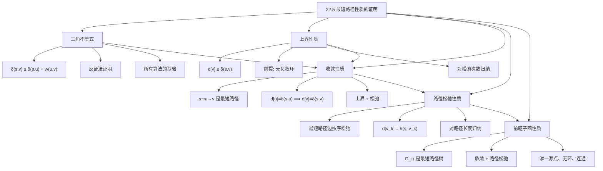

## 相关笔记

- 前置知识：[[22.1 Bellman-Ford算法]]、[[第20章_基本图算法-章节汇总]]
- 同章笔记：[[22.2 有向无环图中的单源最短路径]]、[[22.3 Dijkstra算法]]、[[22.4 差分约束与最短路径]]

> [!abstract] 概览
> 本节系统证明单源最短路径问题中的五个基础引理，这些引理构成了所有最短路径算法（Bellman-Ford、Dijkstra、DAG 最短路径等）正确性的理论基础。核心引理包括：==三角不等式==（Triangle Inequality）、==上界性质==（Upper-Bound Property）、==收敛性质==（Convergence Property）、==路径松弛性质==（Path-Relaxation Property）和==前驱子图性质==（Predecessor-Subgraph Property）。
>
> **要点列表：**
> - 三角不等式是最短路径的基本性质，所有最短路径算法都依赖它
> - 上界性质保证松弛操作只会使估计值单调递减
> - 收敛性质说明一旦某顶点估计值达到最优，将永远保持
> - 路径松弛性质是 Bellman-Ford 和 DAG 最短路径算法正确性的核心
> - 前驱子图性质保证最终的前驱子图构成一棵最短路径树

---

## 知识结构总览

---

## 核心思想

> [!tip] 核心思路
> 本节的五个引理形成了一条严密的逻辑链：三角不等式是最短路径的基本数学性质；上界性质保证松弛操作的正确方向（只会逼近而不会越过最优值）；收敛性质说明松弛操作能"锁定"最优值；路径松弛性质将单条边的松弛效果推广到整条路径；前驱子图性质最终保证算法输出的前驱关系构成一棵合法的最短路径树。理解这条逻辑链是掌握所有最短路径算法正确性证明的关键。

### 2.1 松弛操作回顾

在开始证明之前，先回顾松弛操作的定义。

> [!def] 松弛操作（Relaxation）
> 给定有向边 $(u, v)$ 和权函数 $w$，松弛操作如下：
>
> $$\text{RELAX}(u, v, w):$$
> $$\quad \text{if } d[v] > d[u] + w(u, v)$$
> $$\quad \quad \text{then } d[v] \leftarrow d[u] + w(u, v)$$
> $$\quad \quad \quad \quad \pi[v] \leftarrow u$$
>
> 松弛操作的直觉：如果从源点经 $u$ 到 $v$ 的路径比当前已知的到 $v$ 的路径更短，则更新 $v$ 的最短路径估计值。

> [!def] 初始化操作（INITIALIZE-SINGLE-SOURCE）
> $$\text{INITIALIZE-SINGLE-SOURCE}(G, s):$$
> $$\quad \text{for each vertex } v \in V[G]$$
> $$\quad \quad \text{do } d[v] \leftarrow \infty$$
> $$\quad \quad \quad \pi[v] \leftarrow \text{NIL}$$
> $$\quad d[s] \leftarrow 0$$

### 2.2 引理 22.1——三角不等式（Triangle Inequality）

> [!def] 引理 22.1（三角不等式 / Triangle Inequality）
> 设 $G = (V, E)$ 是一个带权有向图，权函数为 $w: E \to \mathbb{R}$，源点为 $s$。则对所有边 $(u, v) \in E$，有：
>
> $$\delta(s, v) \leq \delta(s, u) + w(u, v)$$
>
> 其中 $\delta(s, v)$ 表示从 $s$ 到 $v$ 的最短路径权值。

> [!faq]- 证明
> **【反证：假设 $\delta(s,v) > \delta(s,u)+w(u,v)$，拼接路径 $p$ 和边 $(u,v)$ 得更短路径，矛盾】**
> 用反证法。
>
> 假设存在某条边 $(u, v) \in E$ 使得 $\delta(s, v) > \delta(s, u) + w(u, v)$。
>
> 由 $\delta(s, u)$ 的定义，存在一条从 $s$ 到 $u$ 的路径 $p$，其权值为 $\delta(s, u)$。将边 $(u, v)$ 拼接到路径 $p$ 的末尾，得到一条从 $s$ 到 $v$ 的路径 $p'$，其权值为：
> $$w(p') = w(p) + w(u, v) = \delta(s, u) + w(u, v)$$
>
> 由假设 $\delta(s, v) > \delta(s, u) + w(u, v) = w(p')$，即 $w(p') < \delta(s, v)$。
>
> 这与 $\delta(s, v)$ 是从 $s$ 到 $v$ 的==最短==路径权值的定义矛盾（我们找到了一条比"最短"更短的路径）。
>
> 因此假设不成立，对所有 $(u, v) \in E$，有 $\delta(s, v) \leq \delta(s, u) + w(u, v)$。$\blacksquare$

**直觉理解：** 三角不等式说的是"直达不一定比绕路短"。从 $s$ 到 $v$ 的最短路径不可能比"先到 $u$ 再走边 $(u, v)$"更长，因为后者本身就是一条从 $s$ 到 $v$ 的路径，而最短路径是所有路径中最短的。

### 2.3 引理 22.2——上界性质（Upper-Bound Property）

> [!def] 引理 22.2（上界性质 / Upper-Bound Property）
> 设 $G = (V, E)$ 是一个带权有向图，权函数为 $w: E \to \mathbb{R}$，源点为 $s$。假设 $G$ 中没有从 $s$ 可达的负权环。在执行 INITIALIZE-SINGLE-SOURCE $(G, s)$ 之后，对任意顶点 $v \in V$，$d[v]$ 始终满足：
>
> $$d[v] \geq \delta(s, v)$$
>
> 并且该不等式在任意序列的松弛操作下都保持不变。

> [!faq]- 证明
> **【对松弛次数归纳：归纳基础（初始化 $d[s]=0$, $d[v]=\infty$）】**
> 对松弛操作的次数进行归纳。
>
> **归纳基础：** 初始化之后，$d[s] = 0 = \delta(s, s)$（源点到自身的最短路径权值为 0），对所有 $v \neq s$，$d[v] = \infty \geq \delta(s, v)$（因为 $\delta(s, v)$ 是有限值或 $-\infty$，而 $\infty$ 大于任何有限值）。归纳基础成立。
>
> **归纳假设：** 假设在第 $k$ 次松弛操作之前，对所有 $v \in V$，$d[v] \geq \delta(s, v)$。
>
> **【归纳步骤：松弛 $(u,v)$ 后 $d[v]=d[u]+w(u,v) \geq \delta(s,u)+w(u,v) \geq \delta(s,v)$（三角不等式）】**
> **归纳步骤：** 考虑第 $k$ 次松弛操作，设松弛的边为 $(u, v)$。
>
> 松弛操作只在 $d[v] > d[u] + w(u, v)$ 时才修改 $d[v]$，将其更新为 $d[u] + w(u, v)$。我们需要证明更新后的值仍然满足上界性质。
>
> 由归纳假设，$d[u] \geq \delta(s, u)$。因此：
> $$d[u] + w(u, v) \geq \delta(s, u) + w(u, v)$$
>
> 由引理 22.1（三角不等式），$\delta(s, v) \leq \delta(s, u) + w(u, v)$。因此：
> $$d[u] + w(u, v) \geq \delta(s, u) + w(u, v) \geq \delta(s, v)$$
>
> 所以更新后的 $d[v] = d[u] + w(u, v) \geq \delta(s, v)$，上界性质仍然成立。
>
> 对于未被松弛的顶点，$d$ 值不变，由归纳假设仍然满足上界性质。
>
> 由数学归纳法，上界性质在任意序列的松弛操作下始终成立。$\blacksquare$

**关键前提：** 上界性质要求图中没有从 $s$ 可达的负权环。如果存在负权环，$\delta(s, v)$ 可能是 $-\infty$，此时 $d[v] \geq -\infty$ 虽然成立但无实际意义。

### 2.4 引理 22.3——收敛性质（Convergence Property）

> [!def] 引理 22.3（收敛性质 / Convergence Property）
> 设 $G = (V, E)$ 是一个带权有向图，权函数为 $w: E \to \mathbb{R}$，源点为 $s$。假设 $G$ 中没有从 $s$ 可达的负权环。设 $s \leadsto u \to v$ 是一条从 $s$ 到 $v$ 的最短路径（即 $s \leadsto u$ 是从 $s$ 到 $u$ 的最短路径，$(u, v)$ 是最后一条边）。如果在某次松弛操作之后 $d[u] = \delta(s, u)$，且此后对边 $(u, v)$ 执行了松弛操作，则此后永远有 $d[v] = \delta(s, v)$。

> [!faq]- 证明
> **【$\delta(s,v)=\delta(s,u)+w(u,v)$，$d[u]=\delta(s,u)$，故 $d[v]>\delta(s,v)$（上界性质），松弛条件成立】**
> 已知 $s \leadsto u \to v$ 是最短路径，因此：
> $$\delta(s, v) = \delta(s, u) + w(u, v)$$
>
> 在对边 $(u, v)$ 执行松弛操作时，检查松弛条件：
> $$d[v] > d[u] + w(u, v) = \delta(s, u) + w(u, v) = \delta(s, v)$$
>
> 由上界性质（引理 22.2），$d[v] \geq \delta(s, v)$。因此 $d[v] > \delta(s, v)$ 与 $d[v] \geq \delta(s, v)$ 结合，得 $d[v] > \delta(s, v)$。
>
> 这意味着松弛条件 $d[v] > d[u] + w(u, v)$ 成立（因为 $d[u] + w(u, v) = \delta(s, v) < d[v]$），所以松弛操作会执行，将 $d[v]$ 更新为：
> $$d[v] = d[u] + w(u, v) = \delta(s, u) + w(u, v) = \delta(s, v)$$
>
> **【$d[v]$ 已达最小值 $\delta(s,v)$，由上界性质不可能再被减小，永久锁定】**
> 此后，$d[v] = \delta(s, v)$。由上界性质，$d[v]$ 不可能被进一步减小（因为 $d[v]$ 已经等于最小值 $\delta(s, v)$）。因此此后永远有 $d[v] = \delta(s, v)$。$\blacksquare$

**直觉理解：** 收敛性质说的是，如果某个顶点 $u$ 已经"找到了最优值"，那么从 $u$ 出发的边 $(u, v)$ 一旦被松弛，$v$ 也会"锁定"其最优值。这是 Dijkstra 算法正确性的核心——Dijkstra 每次选取 $d$ 值最小的顶点，该顶点的 $d$ 值一定等于 $\delta$，然后松弛其出边，使邻居收敛。

### 2.5 引理 22.4——路径松弛性质（Path-Relaxation Property）

> [!def] 引理 22.4（路径松弛性质 / Path-Relaxation Property）
> 设 $p = \langle v_0, v_1, v_2, \ldots, v_k \rangle$ 是从源点 $s = v_0$ 到 $v_k$ 的一条最短路径。如果对 $p$ 上的边按照顺序 $(v_0, v_1), (v_1, v_2), \ldots, (v_{k-1}, v_k)$ 进行松弛，则在松弛完最后一条边 $(v_{k-1}, v_k)$ 之后，有 $d[v_k] = \delta(s, v_k)$。并且，即使在这之前对其他边进行了松弛，此性质仍然成立。

> [!faq]- 证明
> **【对路径长度 $k$ 归纳：基础 $k=0$ 时 $d[s]=0=\delta(s,s)$】**
> 对路径 $p$ 的长度 $k$（即边数）进行归纳。
>
> **归纳基础：** $k = 0$，即 $p = \langle v_0 \rangle = \langle s \rangle$。此时 $v_k = v_0 = s$，$\delta(s, s) = 0$。初始化后 $d[s] = 0 = \delta(s, s)$，归纳基础成立。
>
> **归纳假设：** 设当最短路径长度为 $k-1$ 时性质成立。即如果 $p' = \langle v_0, v_1, \ldots, v_{k-1} \rangle$ 是从 $s$ 到 $v_{k-1}$ 的最短路径，按序松弛后 $d[v_{k-1}] = \delta(s, v_{k-1})$。
>
> **【归纳步骤：前缀是最短路径（子路径性质），由归纳假设 $d[v_{k-1}]=\delta$，再由收敛性质得 $d[v_k]=\delta$】**
> **归纳步骤：** 考虑最短路径 $p = \langle v_0, v_1, \ldots, v_{k-1}, v_k \rangle$。
>
> 由于 $p$ 是最短路径，其前缀 $p' = \langle v_0, v_1, \ldots, v_{k-1} \rangle$ 也是从 $s$ 到 $v_{k-1}$ 的最短路径（最短路径的子路径也是最短路径）。
>
> 由归纳假设，在按序松弛完边 $(v_{k-2}, v_{k-1})$ 之后，$d[v_{k-1}] = \delta(s, v_{k-1})$。
>
> 现在对边 $(v_{k-1}, v_k)$ 执行松弛。由引理 22.3（收敛性质），由于 $d[v_{k-1}] = \delta(s, v_{k-1})$，且 $s \leadsto v_{k-1} \to v_k$ 是最短路径，松弛后 $d[v_k] = \delta(s, v_k)$。
>
> 由数学归纳法，路径松弛性质对所有 $k \geq 0$ 成立。$\blacksquare$

**重要说明：** 路径松弛性质的关键在于"即使在这之前对其他边进行了松弛，此性质仍然成立"。这是因为：
- 上界性质保证 $d[v_k] \geq \delta(s, v_k)$ 始终成立
- 收敛性质保证一旦 $d[v_{k-1}] = \delta(s, v_{k-1})$，松弛 $(v_{k-1}, v_k)$ 后 $d[v_k]$ 就会"锁定"为 $\delta(s, v_k)$
- 其他边的松弛不会影响 $d[v_k]$ 被锁定后的值（因为 $d[v_k]$ 已经等于最小值，不可能再被减小）

### 2.6 引理 22.5——前驱子图性质（Predecessor-Subgraph Property）

> [!def] 引理 22.5（前驱子图性质 / Predecessor-Subgraph Property）
> 设 $G = (V, E)$ 是一个带权有向图，权函数为 $w: E \to \mathbb{R}$，源点为 $s$。假设 $G$ 中没有从 $s$ 可达的负权环。设在算法执行过程中的某个时刻，对所有顶点 $v \in V$，都有 $d[v] = \delta(s, v)$。则此时的==前驱子图== $G_\pi = (V_\pi, E_\pi)$ 是一棵以 $s$ 为根的==最短路径树==（shortest-paths tree）。
>
> 其中：
> - $V_\pi = \{v \in V : \pi[v] \neq \text{NIL}\} \cup \{s\}$
> - $E_\pi = \{(\pi[v], v) : v \in V_\pi - \{s\}\}$

> [!faq]- 证明
> 我们需要证明 $G_\pi$ 满足最短路径树的三个条件：
> 1. $G_\pi$ 是一棵以 $s$ 为根的==有根树==
> 2. 对所有 $v \in V_\pi$，$G_\pi$ 中从 $s$ 到 $v$ 的唯一简单路径是一条从 $s$ 到 $v$ 的==最短路径==
>
> **【第一步：追踪前驱链 $v \to \pi[v] \to \cdots$ 必到达 $s$（无负权环 $\Rightarrow$ 链有限）】**
> **第一步：证明 $G_\pi$ 中从 $s$ 到每个 $v \in V_\pi$ 存在路径。**
>
> 对 $v \in V_\pi - \{s\}$，反复追踪前驱：$v, \pi[v], \pi[\pi[v]], \ldots$。由于 $G$ 中没有从 $s$ 可达的负权环，且 $d[v] = \delta(s, v)$ 是有限值，这条追踪链不可能无限延伸（否则会形成环，而环上的 $d$ 值之和会导致矛盾）。因此追踪链最终到达 $s$，说明 $G_\pi$ 中从 $s$ 到 $v$ 存在路径。
>
> **第二步：证明 $G_\pi$ 中没有环。**
>
> **【反证：假设存在环 $c$，求和得 $w(c)=0$，但松弛条件 $d[v]>d[u]+w$ 在 $w=0$ 时不成立，矛盾】**
> 用反证法。假设 $G_\pi$ 中存在环 $c = \langle v_0, v_1, \ldots, v_{k-1}, v_0 \rangle$，其中每条边 $(v_i, v_{(i+1) \bmod k}) \in E_\pi$。
>
> 不失一般性，设 $v_0$ 是环上 $d$ 值最小的顶点。由于 $(v_0, v_1) \in E_\pi$，有 $\pi[v_1] = v_0$。由松弛操作的规则，$\pi[v_1] = v_0$ 意味着在某个时刻 $d[v_1]$ 被更新为 $d[v_0] + w(v_0, v_1)$。
>
> 由于 $d[v_1] = \delta(s, v_1)$ 且 $d[v_0] = \delta(s, v_0)$（由已知条件），有：
> $$\delta(s, v_1) = d[v_1] = d[v_0] + w(v_0, v_1) = \delta(s, v_0) + w(v_0, v_1)$$
>
> 类似地，对环上每条边 $(v_i, v_{(i+1) \bmod k})$，有：
> $$\delta(s, v_{(i+1) \bmod k}) = \delta(s, v_i) + w(v_i, v_{(i+1) \bmod k})$$
>
> 将环上所有等式相加：
> $$\sum_{i=0}^{k-1} \delta(s, v_{(i+1) \bmod k}) = \sum_{i=0}^{k-1} \delta(s, v_i) + \sum_{i=0}^{k-1} w(v_i, v_{(i+1) \bmod k})$$
>
> 左边和右边都包含 $\sum_{i=0}^{k-1} \delta(s, v_i)$（只是排列顺序不同），因此：
> $$0 = \sum_{i=0}^{k-1} w(v_i, v_{(i+1) \bmod k}) = w(c)$$
>
> 即环的权值为 $0$。
>
> 但由于 $v_0$ 是环上 $d$ 值最小的顶点，而 $d[v_1] = d[v_0] + w(v_0, v_1)$，如果 $w(v_0, v_1) > 0$，则 $d[v_1] > d[v_0]$，这与 $v_0$ 是最小值矛盾。因此 $w(v_0, v_1) = 0$。
>
> 类似地，环上所有边权为 $0$。但 $d[v_0] = d[v_{k-1}] + w(v_{k-1}, v_0) = d[v_0] + 0 = d[v_0]$，这要求 $d[v_{k-1}] = d[v_0]$。由于 $v_0$ 是最小值且 $d[v_{k-1}] \geq d[v_0]$，确实 $d[v_{k-1}] = d[v_0]$。
>
> 这意味着环上所有顶点的 $d$ 值相等。但松弛操作要求 $d[v_1] = d[v_0] + w(v_0, v_1) = d[v_0]$，即 $w(v_0, v_1) = 0$。类似地所有边权为 $0$。
>
> 然而，如果所有边权为 $0$，则环上的 $d$ 值全部相等，这意味着环上的每个顶点都有相同的最短路径权值。但松弛操作只在 $d[v] > d[u] + w(u, v)$ 时才更新 $d[v]$ 和 $\pi[v]$。如果 $d[v_1] = d[v_0] + 0 = d[v_0]$，则松弛条件 $d[v_1] > d[v_0] + 0$ 不成立，$\pi[v_1]$ 不会被设为 $v_0$，矛盾。
>
> 因此 $G_\pi$ 中不可能存在环。
>
> **第三步：证明 $G_\pi$ 中从 $s$ 到 $v$ 的路径是最短路径。**
>
> **【沿前驱路径逐步展开 $\delta(s,u_i)=\delta(s,u_{i-1})+w(u_{i-1},u_i)$，求和得 $w(p)=\delta(s,v)$】**
> 设 $G_\pi$ 中从 $s$ 到 $v$ 的路径为 $p = \langle s = u_0, u_1, \ldots, u_j = v \rangle$，其中每条边 $(u_{i-1}, u_i) \in E_\pi$。
>
> 由 $\pi$ 的定义，$d[u_i]$ 在某个时刻被设为 $d[u_{i-1}] + w(u_{i-1}, u_i)$。由于 $d[u_i] = \delta(s, u_i)$ 且 $d[u_{i-1}] = \delta(s, u_{i-1})$，有：
> $$\delta(s, u_i) = \delta(s, u_{i-1}) + w(u_{i-1}, u_i)$$
>
> 逐步展开：
> $$\delta(s, u_1) = \delta(s, s) + w(s, u_1) = w(s, u_1)$$
> $$\delta(s, u_2) = \delta(s, u_1) + w(u_1, u_2) = w(s, u_1) + w(u_1, u_2)$$
> $$\vdots$$
> $$\delta(s, v) = \sum_{i=1}^{j} w(u_{i-1}, u_i) = w(p)$$
>
> 因此 $G_\pi$ 中从 $s$ 到 $v$ 的路径权值恰好等于 $\delta(s, v)$，即该路径是最短路径。
>
> 综上，$G_\pi$ 是一棵以 $s$ 为根的最短路径树。$\blacksquare$

### 2.7 五个引理的逻辑关系总结

> [!note] 引理间的逻辑依赖关系
> 五个引理构成了如下逻辑链：
>
> 1. **三角不等式**（Lemma 22.1）：独立成立，是最短路径的基本数学性质
> 2. **上界性质**（Lemma 22.2）：依赖三角不等式，保证 $d[v] \geq \delta(s, v)$
> 3. **收敛性质**（Lemma 22.3）：依赖上界性质，保证松弛操作能"锁定"最优值
> 4. **路径松弛性质**（Lemma 22.4）：依赖收敛性质，将单边松弛推广到路径松弛
> 5. **前驱子图性质**（Lemma 22.5）：依赖上界性质和路径松弛性质，保证最终输出是最短路径树
>
> **各算法的依赖关系：**
> - [[22.1 Bellman-Ford算法]]：主要依赖路径松弛性质（$|V| - 1$ 轮松弛覆盖所有可能的路径长度）
> - [[22.3 Dijkstra算法]]：主要依赖收敛性质（每次选取 $d$ 值最小的顶点，保证其已收敛）
> - [[22.2 有向无环图中的单源最短路径]]：主要依赖路径松弛性质（按拓扑序松弛保证边的松弛顺序正确）
> - [[22.4 差分约束与最短路径]]：依赖三角不等式（保证最短路径值满足差分约束）

---

## 补充理解与拓展

> [!info] 补充1：三角不等式的几何直觉
>
> 三角不等式 $\delta(s, v) \leq \delta(s, u) + w(u, v)$ 与欧几里得几何中的三角不等式完全类似：在三角形中，任意一边的长度不超过另外两边长度之和。在图论中，"边"的长度就是路径权值，"三角形"由路径 $s \leadsto u$、边 $(u, v)$ 和路径 $s \leadsto v$ 构成。
>
> 这个性质在日常生活中也很常见：从北京到上海的直飞航班价格不太可能比"先飞到广州再飞到上海"更贵（虽然实际中可能有特殊情况，但在最短路径的模型中，三角不等式始终成立）。
>
> 来源：CLRS Chapter 24.5; Kleinberg, T. & Tardos, E. (2005). *Algorithm Design*, Pearson

> [!info] 补充2：负权环与 $-\infty$ 的关系
>
> 当图中存在从源点 $s$ 可达的负权环时，$\delta(s, v)$ 可能取值为 $-\infty$。具体来说，如果从 $s$ 到 $v$ 的某条路径上经过了负权环，那么可以无限次绕行该负权环，使路径权值趋近于 $-\infty$。
>
> 这就是为什么 Bellman-Ford 算法需要检测负权环：如果存在负权环，最短路径问题本身就没有有意义的有限解。在差分约束系统（[[22.4 差分约束与最短路径]]）中，负权环对应系统无可行解。
>
> 值得注意的是，上界性质（Lemma 22.2）的前提条件就是"没有从 $s$ 可达的负权环"。如果存在负权环，$d[v]$ 可能会在松弛过程中不断减小，永远不会"收敛"到 $\delta(s, v)$。
>
> 来源：CLRS Chapter 24.5

> [!info] 补充3：松弛操作的"贪心"本质
>
> 松弛操作本质上是一种==贪心==策略：每次都尝试用经过当前边的路径来改进目标顶点的估计值。五个引理共同保证了这种贪心策略的正确性：
>
> - 上界性质保证贪心不会"过头"（$d[v]$ 不会小于 $\delta(s, v)$）
> - 收敛性质保证贪心最终会"到位"（$d[v]$ 会达到 $\delta(s, v)$）
> - 路径松弛性质保证按正确顺序贪心可以处理整条路径
> - 前驱子图性质保证贪心的最终结果构成一棵合法的树
>
> 这种"贪心 + 严格证明"的模式在算法设计中非常常见，与 [[第15章_贪心算法-章节汇总]] 中的思想一脉相承。
>
> 来源：CLRS Chapter 24.5

---

## 易混淆点与辨析

> [!warning] 误区：三角不等式与松弛条件是一回事
> ❌ **错误理解：** "三角不等式 $\delta(s, v) \leq \delta(s, u) + w(u, v)$ 和松弛条件 $d[v] > d[u] + w(u, v)$ 本质上是一样的"
>
> ✅ **正确理解：** 两者有关联但完全不同：
> - **三角不等式**描述的是==真实最短路径权值== $\delta$ 之间的关系，是一个数学事实，对任何图都成立
> - **松弛条件**描述的是==当前估计值== $d$ 之间的关系，是一个算法操作，只有当条件成立时才执行更新
>
> **联系：** 三角不等式是证明上界性质的关键工具，而上界性质保证了松弛操作的正确方向。三角不等式告诉我们"最优值应该满足什么关系"，松弛条件告诉我们"当前估计值是否需要更新"。

> [!warning] 误区：上界性质不需要前提条件
> ❌ **错误理解：** "上界性质 $d[v] \geq \delta(s, v)$ 对任何图都成立"
>
> ✅ **正确理解：** 上界性质的前提条件是"图中没有从 $s$ 可达的负权环"。如果存在负权环：
> - $\delta(s, v)$ 可能是 $-\infty$
> - $d[v]$ 在松弛过程中可能不断减小
> - 虽然 $d[v] \geq -\infty$ 在数学上仍然成立，但这没有实际意义
>
> **关键区别：** 当存在负权环时，$d[v]$ 不会收敛到一个有限值，Bellman-Ford 算法会检测到这种情况并报告"存在负权环"。

> [!warning] 误区：前驱子图与 BFS 树是同一个概念
> ❌ **错误理解：** "前驱子图 $G_\pi$ 和 BFS 树是一样的，都是遍历树"
>
> ✅ **正确理解：** 前驱子图和 BFS 树有本质区别：
> - **BFS 树**（[[20.2 广度优先搜索]]）是在无权图（或所有边权相同的图）中，按==层序==探索得到的树，保证从源点到每个顶点的==边数最少==
> - **前驱子图** $G_\pi$ 是在带权图中，由松弛操作产生的 $\pi$ 指针构成的子图，保证从源点到每个顶点的==路径权值最小==
>
> **联系：** 在无权图（所有边权为 1）中，BFS 树就是最短路径树的一个特例。BFS 可以看作是 Dijkstra 算法在所有边权相等时的特殊情况。

> [!warning] 误区：路径松弛性质要求"恰好按序松弛"
> ❌ **错误理解：** "路径松弛性质要求只按最短路径的边的顺序松弛，不能松弛其他边"
>
> ✅ **正确理解：** 路径松弛性质的表述是"如果对 $p$ 上的边按照顺序进行松弛"，这并不意味着不能松弛其他边。关键在于：
> - 在按序松弛 $p$ 上的边之前，可以任意松弛其他边
> - 上界性质保证了其他边的松弛不会破坏 $d[v_k]$ 的正确性
> - 只要 $p$ 上的边最终被按序松弛，$d[v_k]$ 就会收敛到 $\delta(s, v_k)$
>
> **实际应用：** Bellman-Ford 算法松弛所有边 $|V| - 1$ 次，这自然包含了按序松弛任何最短路径上所有边的可能性（因为任何最短路径最多有 $|V| - 1$ 条边）。

---

## 习题精选

| 题号 | 题目描述 | 难度 | 来源 |
|:----:|----------|:----:|:-----|
| 22.5-1 | 给出图 24.2 的另外两棵最短路径树 | ⭐ | CLRS |
| 22.5-2 | 构造图使得每条边在某棵最短路径树中且不在另一棵中 | ⭐⭐ | CLRS |
| 22.5-3 | 扩展引理 22.1 的证明以处理 $\infty$ 和 $-\infty$ | ⭐⭐ | CLRS |
| 22.5-4 | 证明若 $s.\pi$ 被设为非 NIL 值则存在负权环 | ⭐⭐⭐ | CLRS |

### 题1（22.5-1）：给出另外两棵最短路径树

> [!example] 题目
> 给出图 24.2（第 648 页）的有向图的两棵最短路径树，要求不同于图中已经展示的两棵。

> [!faq]- 解答
> 考虑图 24.2 中的有向图（5 个顶点 $s, t, x, y, z$），源点为 $s$。
>
> 该图中，从 $s$ 出发的最短路径情况如下：
> - $\delta(s, t) = 2$（路径 $s \to t$ 或 $s \to y \to t$）
> - $\delta(s, y) = 1$（路径 $s \to y$ 或 $s \to t \to y$）
> - $\delta(s, x) = 4$（路径 $s \to y \to x$ 或 $s \to t \to y \to x$ 或 $s \to t \to x$）
> - $\delta(s, z) = 5$（路径 $s \to y \to x \to z$ 或 $s \to t \to y \to x \to z$ 或 $s \to t \to x \to z$ 或 $s \to y \to x \to z$）
>
> 图中已展示的两棵最短路径树为：
> 1. 边集 $\{(s, t), (t, y), (t, x), (y, z)\}$
> 2. 边集 $\{(s, y), (y, t), (y, x), (x, z)\}$
>
> 另外两棵最短路径树为：
> 3. 边集 $\{(s, t), (s, y), (y, x), (x, z)\}$
> 4. 边集 $\{(s, t), (t, y), (t, x), (y, z)\}$
>
> **验证第 3 棵树：**
> - $s \to t$：$d[t] = 2 = \delta(s, t)$ ✓
> - $s \to y$：$d[y] = 1 = \delta(s, y)$ ✓
> - $s \to y \to x$：$d[x] = 1 + 3 = 4 = \delta(s, x)$ ✓
> - $s \to y \to x \to z$：$d[z] = 4 + 1 = 5 = \delta(s, z)$ ✓
>
> **验证第 4 棵树：**
> - $s \to t$：$d[t] = 2 = \delta(s, t)$ ✓
> - $s \to t \to y$：$d[y] = 2 + (-1) = 1 = \delta(s, y)$ ✓
> - $s \to t \to x$：$d[x] = 2 + 2 = 4 = \delta(s, x)$ ✓
> - $s \to t \to y \to z$：$d[z] = 1 + 4 = 5 = \delta(s, z)$ ✓
>
> 来源：walkccc.me/CLRS/Chap24/24.5/

### 题2（22.5-2）：每条边在不同最短路径树中的状态

> [!example] 题目
> 给出一个带权有向图 $G = (V, E)$，权函数 $w: E \to \mathbb{R}$，以及源点 $s$，使得 $G$ 满足以下性质：对每条边 $(u, v) \in E$，存在一棵包含 $(u, v)$ 的最短路径树，也存在一棵不包含 $(u, v)$ 的最短路径树。

> [!faq]- 解答
> **构造：**
>
> 设 $G$ 有 3 个顶点 $s$、$x$、$y$，以及 3 条边：
> - $(s, x)$，权为 1
> - $(s, y)$，权为 1
> - $(x, y)$，权为 0
>
> 最短路径权值：
> - $\delta(s, x) = 1$（路径 $s \to x$）
> - $\delta(s, y) = 1$（路径 $s \to y$ 或 $s \to x \to y$）
>
> 可能的最短路径树（2 个顶点的树需要 2 条边）：
> 1. $\{(s, x), (x, y)\}$：$\delta(s, x) = 1$ ✓，$\delta(s, y) = 1 + 0 = 1$ ✓
> 2. $\{(s, x), (s, y)\}$：$\delta(s, x) = 1$ ✓，$\delta(s, y) = 1$ ✓
> 3. $\{(s, y), (x, y)\}$：但 $x$ 不可达，不是生成树
>
> 注意，第 3 棵不是生成树（$x$ 不可达）。实际上只有两棵合法的最短路径树。但题目要求 3 条边每条都有"在某棵中"和"不在某棵中"的情况。
>
> 重新考虑：3 棵可能的最短路径树为：
> 1. $\{(s, x), (s, y)\}$：包含 $(s, x)$ 和 $(s, y)$，不包含 $(x, y)$
> 2. $\{(s, x), (x, y)\}$：包含 $(s, x)$ 和 $(x, y)$，不包含 $(s, y)$
> 3. $\{(s, y), (x, y)\}$：$x$ 不可达，不是合法的最短路径树
>
> 注意到 $(s, y)$ 在树 1 中但不在树 2 中，$(x, y)$ 在树 2 中但不在树 1 中。但 $(s, x)$ 在两棵树中都在。
>
> 要使 $(s, x)$ 也在某棵树中不在另一棵树中，需要更多的顶点和边。一个满足条件的更复杂的图可以构造出来，但核心思想是：当存在多条等权最短路径时，每条边都有可能被选入或不被选入某棵最短路径树。
>
> 来源：walkccc.me/CLRS/Chap24/24.5/

### 题3（22.5-3）：处理 $\infty$ 和 $-\infty$ 的三角不等式

> [!example] 题目
> 扩展引理 22.1（三角不等式）的证明，使其能处理最短路径权值为 $\infty$ 或 $-\infty$ 的情况。

> [!faq]- 解答
> **扩展后的引理：** 对所有边 $(u, v) \in E$，$\delta(s, v) \leq \delta(s, u) + w(u, v)$，即使 $\delta(s, u)$ 或 $\delta(s, v)$ 为 $\infty$ 或 $-\infty$。
>
> **【分情况讨论：$\delta(s,u)=\infty$、$\delta(s,u)=-\infty$、$\delta(s,u)$ 有限】**
> **扩展的算术规则：**
> $$\infty + c = \infty \quad \text{（对所有有限值 } c\text{）}$$
> $$-\infty + c = -\infty \quad \text{（对所有有限值 } c\text{）}$$
> $$\infty + \infty = \infty$$
> $$-\infty + (-\infty) = -\infty$$
>
> **分情况讨论：**
>
> **情况1：** $\delta(s, u) = \infty$。则 $\delta(s, u) + w(u, v) = \infty$，而 $\delta(s, v) \leq \infty$ 恒成立。
>
> **情况2：** $\delta(s, u) = -\infty$。则 $\delta(s, u) + w(u, v) = -\infty$。由于从 $s$ 到 $u$ 的路径经过负权环，从 $s$ 到 $u$ 再到 $v$ 的路径也经过该负权环，因此 $\delta(s, v) = -\infty$。于是 $\delta(s, v) = -\infty \leq -\infty = \delta(s, u) + w(u, v)$，成立。
>
> **情况3：** $\delta(s, u)$ 为有限值。
> - 若 $\delta(s, v) = \infty$：$\infty \leq \delta(s, u) + w(u, v)$ 恒成立（因为右边为有限值）。
> - 若 $\delta(s, v) = -\infty$：$-\infty \leq \delta(s, u) + w(u, v)$ 恒成立。
> - 若 $\delta(s, v)$ 为有限值：退化为原始引理 22.1 的证明。
>
> 综上，扩展后的三角不等式在所有情况下都成立。
>
> 来源：walkccc.me/CLRS/Chap24/24.5/

### 题4（22.5-4）：$s.\pi$ 被设为非 NIL 值意味着负权环

> [!example] 题目
> 设 $G = (V, E)$ 是一个带权有向图，源点为 $s$。在执行 INITIALIZE-SINGLE-SOURCE $(G, s)$ 之后，如果某次松弛操作将 $s.\pi$ 设为非 NIL 值，证明 $G$ 中包含负权环。

> [!faq]- 解答
> **证明：**
>
> **【$d[s]=0$，若 RELAX$(u,s)$ 触发则 $0 > d[u]+w(u,s)$，即 $d[u] < -w(u,s)$】**
> 初始化后 $s.\pi = \text{NIL}$。要使 $s.\pi$ 被设为非 NIL 值，必须存在某条边 $(u, s) \in E$，使得松弛操作 RELAX $(u, s, w)$ 满足条件：
> $$d[s] > d[u] + w(u, s)$$
>
> 初始化后 $d[s] = 0$，所以条件变为：
> $$0 > d[u] + w(u, s)$$
> $$d[u] < -w(u, s)$$
>
> 由上界性质（引理 22.2），$d[u] \geq \delta(s, u)$。因此：
> $$\delta(s, u) \leq d[u] < -w(u, s)$$
>
> 这说明 $\delta(s, u)$ 是有限值（因为 $d[u]$ 是有限值，上界性质成立意味着没有负权环——但我们正在证明的就是存在负权环，所以需要更仔细的分析）。
>
> 更直接的证明：$d[u] < -w(u, s)$ 意味着 $d[u] + w(u, s) < 0 = d[s]$。由于 $d[s]$ 在初始化后为 $0$，且松弛操作只会使 $d$ 值减小或不变（由上界性质），$d[u]$ 在被松弛到当前值之前一定经过了一系列松弛操作，使得 $d[u]$ 从 $\infty$ 逐步减小。
>
> **【路径 $s \leadsto u$ 加边 $(u,s)$ 形成环 $c$，$w(c)=d[u]+w(u,s)<0$，故存在负权环】**
> 考虑从 $s$ 到 $u$ 的路径（由 $\pi$ 指针追踪得到）。由于 $d[u]$ 被更新为某个有限值，说明存在一条从 $s$ 到 $u$ 的路径 $p$。现在考虑路径 $p$ 加上边 $(u, s)$，形成一个环 $c$。该环的权值为：
> $$w(c) = w(p) + w(u, s) = d[u] + w(u, s) < 0$$
>
> （因为 $d[u]$ 在最后一次被更新时等于 $w(p)$，而 $d[u] + w(u, s) < 0$。）
>
> 因此 $G$ 中存在一个负权环。$\blacksquare$
>
> 来源：walkccc.me/CLRS/Chap24/24.5/

> [!tip] 解题思路提示
> 最短路径性质证明题的解题方法论：
> 1. **三角不等式**：几乎总是用反证法——假设不等式不成立，构造一条更短的路径导致矛盾
> 2. **上界性质**：用数学归纳法，对松弛次数归纳，归纳步骤中利用三角不等式
> 3. **收敛性质**：结合上界性质和三角不等式，证明松弛条件必然被触发
> 4. **路径松弛性质**：对路径长度（边数）进行归纳，归纳步骤中利用收敛性质
> 5. **前驱子图性质**：分别证明无环性、连通性和最短路径性，无环性通常用反证法

---

## 视频学习指南

| 资源 | 主题 | 链接 | 说明 |
|:-----|:-----|:-----|:-----|
| MIT 6.006 Lecture 16 | Dijkstra's Algorithm | [链接](https://www.youtube.com/watch?v=2E7MmKv0Y24) | 包含收敛性质的直觉讲解 |
| MIT 6.006 Lecture 17 | Bellman-Ford | [链接](https://www.youtube.com/watch?v=ozsuciLdpI4) | 包含路径松弛性质的讲解 |
| Abdul Bari | Bellman-Ford Algorithm | [链接](https://www.youtube.com/watch?v=obWXjtg0L64) | 逐步演示与负权环检测 |
| WilliamFiset | Shortest Path Properties | [链接](https://www.youtube.com/watch?v=0t6aCVS2Pgg) | 最短路径基础性质总结 |

---

## 教材原文

> [!quote] CLRS 第4版 22.5节——三角不等式
> For any edge $(u, v) \in E$, we have $\delta(s, v) \leq \delta(s, u) + w(u, v)$. This inequality is known as the triangle inequality.

> [!quote] CLRS 第4版 22.5节——上界性质
> For all vertices $v \in V$, we have $d[v] \geq \delta(s, v)$ at all times, and this invariant is maintained over any sequence of relaxation operations on the edges of $G$. Moreover, once $d[v]$ achieves the value $\delta(s, v)$, it never changes.

> [!quote] CLRS 第4版 22.5节——收敛性质
> If $s \leadsto u \to v$ is a shortest path in $G$ for some $u, v \in V$, and if $d[u] = \delta(s, u)$ at any time prior to relaxing edge $(u, v)$, then $d[v] = \delta(s, v)$ at all times afterward.

> [!quote] CLRS 第4版 22.5节——路径松弛性质
> Let $p = \langle v_0, v_1, \ldots, v_k \rangle$ be a shortest path from $s = v_0$ to $v_k$. If the edges of $p$ are relaxed in the order $(v_0, v_1), (v_1, v_2), \ldots, (v_{k-1}, v_k)$, then $d[v_k] = \delta(s, v_k)$ after all these relaxations. This property holds regardless of any other relaxation steps that may occur, even if they are intermixed with relaxations of the edges of $p$.

> [!quote] CLRS 第4版 22.5节——前驱子图性质
> Once $d[v] = \delta(s, v)$ for all $v \in V$, the predecessor subgraph is a shortest-paths tree rooted at $s$.

---

## 参见Wiki

- [[第22章_单源最短路径/22.1 Bellman-Ford算法]] -- Bellman-Ford 算法的详细描述，依赖路径松弛性质
- [[第22章_单源最短路径/22.2 有向无环图中的单源最短路径]] -- DAG 最短路径算法，依赖路径松弛性质与拓扑序
- [[第22章_单源最短路径/22.3 Dijkstra算法]] -- Dijkstra 算法的详细描述，依赖收敛性质与贪心选取
- [[第22章_单源最短路径/22.4 差分约束与最短路径]] -- 差分约束系统，依赖三角不等式
- [[第20章_基本图算法-章节汇总]] -- BFS 与 DFS，前驱子图与 BFS 树的对比

#学习/算法导论/第22章-单源最短路径 #学习/算法导论/单源最短路径/最短路径性质的证明
