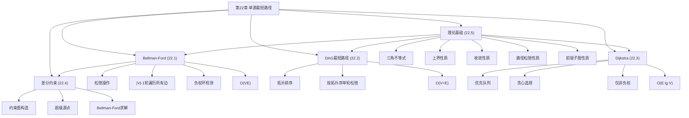

## 相关笔记

- 节笔记：[[22.1 Bellman-Ford算法]]、[[22.2 有向无环图中的单源最短路径]]、[[22.3 Dijkstra算法]]、[[22.4 差分约束与最短路径]]、[[22.5 最短路径性质的证明]]
- 前置章节：[[第20章_基本图算法-章节汇总]]、[[第21章_最小生成树-章节汇总]]、[[第06章_堆排序-章节汇总]]

> [!abstract] 概览
> 全章围绕**单源最短路径**（Single-Source Shortest Paths, SSSP）问题展开。首先建立最短路径的基本性质（三角不等式、上界性质、收敛性质、路径松弛性质、前驱子图性质），为所有算法提供统一的理论基础（22.5）；然后给出三种经典算法——==Bellman-Ford算法==（处理一般图，支持负权边，22.1）、==DAG最短路径算法==（利用拓扑序，22.2）、==Dijkstra算法==（非负权图上的最优选择，22.3）；最后展示差分约束系统与最短路径问题的等价关系（22.4）。全章的核心主线是 **松弛操作**——所有算法都基于反复应用松弛操作来逐步逼近最短路径。

---

## 知识结构总览



---

## 核心概念回顾

### 松弛操作——全章的核心

```
RELAX(u, v, w):
    if d[v] > d[u] + w(u, v)
        d[v] = d[u] + w(u, v)
        π[v] = u
```

所有SSSP算法的本质都是**以不同顺序反复执行松弛操作**，直到无法再松弛为止。

### 四种算法对比

| 比较维度 | Bellman-Ford | DAG最短路径 | Dijkstra | BFS |
|:---------|:------------|:-----------|:--------|:---|
| **适用图** | 一般有向图 | 有向无环图 | 非负权图 | 无权图 |
| **负权边** | ✅ 支持 | ✅ 支持 | ❌ 不支持 | ❌ 不支持 |
| **负权环** | 可检测 | 不存在 | 不适用 | 不适用 |
| **核心策略** | 多轮全局松弛 | 拓扑序+单轮松弛 | 贪心+优先队列 | 逐层扩展 |
| **数据结构** | 无特殊要求 | 无特殊要求 | 优先队列 | 队列 |
| **时间复杂度** | $O(VE)$ | $O(V+E)$ | $O((V+E)\lg V)$ | $O(V+E)$ |
| **最优实现** | — | — | 斐波那契堆 $O(V\lg V+E)$ | — |
| **理论基础** | 路径松弛性质 | 路径松弛+拓扑序 | 收敛+贪心 | BFS最短路径性质 |

### 五大基本性质（22.5）

> [!def] 三角不等式（Lemma 22.1）
> $\delta(s,v) \leq \delta(s,u) + w(u,v)$，对所有 $(u,v) \in E$ 成立。

> [!def] 上界性质（Lemma 22.2）
> $d[v] \geq \delta(s,v)$，对所有 $v \in V$ 成立（前提：从 $s$ 可达的顶点不存在负权环）。

> [!def] 收敛性质（Lemma 22.3）
> 若 $s \leadsto u \to v$ 是最短路径，且某时刻 $d[u] = \delta(s,u)$，则此后永远有 $d[v] = \delta(s,v)$。

> [!def] 路径松弛性质（Lemma 22.4）
> 若 $p = \langle v_0, v_1, \ldots, v_k \rangle$ 是从 $s=v_0$ 到 $v_k$ 的最短路径，按边序松弛，则 $d[v_k] = \delta(s, v_k)$。

> [!def] 前驱子图性质（Lemma 22.5）
> 一旦 $d[v] = \delta(s,v)$，前驱子图 $G_\pi$ 是以 $s$ 为根的最短路径树。

---

## 跨章关联

### 与第20章（基本图算法）的关系

| 第20章概念 | 第22章应用 |
|:-----------|:----------|
| BFS | BFS是无权图上Dijkstra的特例 |
| 图的表示 | 邻接表是所有SSSP算法的标准输入 |
| DFS/拓扑排序 | DAG最短路径算法直接使用拓扑排序 |
| DFS完成时间 | 与Bellman-Ford的松弛顺序有关 |

### 与第21章（最小生成树）的关系

| MST概念 | SSSP对应 |
|:--------|:---------|
| Prim算法 | Dijkstra算法（结构几乎相同） |
| 贪心选择性质 | Dijkstra的贪心选择由收敛性质保证 |
| 割性质 | Dijkstra中 $S$ 集合定义割 |

### 与第6章（堆排序）的关系

- Dijkstra算法使用[[第06章_堆排序-章节汇总]]中的优先队列（EXTRACT-MIN、DECREASE-KEY）
- 斐波那契堆可将Dijkstra优化到 $O(V\lg V + E)$

### 与第19章（不相交集合）的关系

- Bellman-Ford不使用并查集（与Kruskal不同）
- 但Bellman-Ford的负权环检测与并查集的环检测有概念关联

---

## 综合复习题

> [!faq]- 复习题 1：为什么Dijkstra算法不适用于含负权边的图？
> Dijkstra算法的核心假设是：一旦顶点 $u$ 被加入集合 $S$，$d[u]$ 就是最终的最短路径值，不会再被更新。这个假设依赖于所有边权非负——因为任何通过 $S$ 外顶点的路径都不会比已知的路径更短。如果存在负权边，一条通过 $S$ 外顶点的路径可能更短，但Dijkstra不会重新考虑 $S$ 中的顶点，因此可能得到错误结果。

> [!faq]- 复习题 2：Bellman-Ford算法为什么需要恰好 $|V|-1$ 轮？
> 任何不含环的最短路径最多有 $|V|-1$ 条边。第 $i$ 轮松弛后，算法找到了最多使用 $i$ 条边的最短路径。因此 $|V|-1$ 轮足以找到所有最短路径。第 $|V|$ 轮如果还能松弛，说明存在负权环（因为需要 $|V|$ 条边的"最短路径"必然包含环，且该环的权为负）。

> [!faq]- 复习题 3：差分约束系统与最短路径问题有什么关系？
> 差分约束系统 $x_j - x_k \leq b_k$ 可以转化为一个约束图：每个变量对应一个顶点，每个不等式对应一条边 $k \to j$ 权为 $b_k$。如果约束图从超级源点 $s$ 出发不存在负权环，则 $d(s,v)$ 就是一个可行解。这建立了差分约束系统与最短路径问题之间的等价关系。

> [!faq]- 复习题 4：Dijkstra算法与Prim算法有什么异同？
> 两者结构几乎相同：都维护一个集合 $S$（已确定顶点），都用优先队列选择下一个顶点，都通过松弛更新邻居。**唯一区别**在于key的更新规则：
> - Prim: $\text{key}[v] = \min(\text{key}[v], w(u,v))$——只看边权
> - Dijkstra: $\text{key}[v] = \min(\text{key}[v], d[u] + w(u,v))$——看路径总长度
> 这个区别导致Prim求MST，Dijkstra求最短路径树。

---

## 常见误区

> [!warning] 误区1：Bellman-Ford可以找到含负权环的图的最短路径
> **正确理解**：Bellman-Ford可以**检测**负权环的存在，但不能为从源点可达负权环的顶点找到有定义的最短路径（因为可以无限绕负权环使路径长度趋近于 $-\infty$）。

> [!warning] 误区2：Dijkstra算法总是比Bellman-Ford快
> **正确理解**：Dijkstra在非负权图上确实更快（$O(E\lg V)$ vs $O(VE)$），但Dijkstra无法处理负权边。在含负权边的场景下，Bellman-Ford是唯一的选择（除非使用SPFA等优化变体）。

> [!warning] 误区3：BFS可以替代Dijkstra
> **正确理解**：BFS只在所有边权相等（通常为1）时等价于Dijkstra。如果边权不同，BFS不能正确求解最短路径问题。

---

## 学习要点总结

| 学习目标 | 掌握程度 | 对应笔记 |
|:---------|:---------|:---------|
| 松弛操作的定义与作用 | 熟练 | [[22.1 Bellman-Ford算法]] |
| Bellman-Ford伪代码、正确性、复杂度 | 熟练 | [[22.1 Bellman-Ford算法]] |
| 负权环检测原理 | 掌握 | [[22.1 Bellman-Ford算法]] |
| DAG最短路径的拓扑序方法 | 熟练 | [[22.2 有向无环图中的单源最短路径]] |
| Dijkstra伪代码、正确性、复杂度 | 熟练 | [[22.3 Dijkstra算法]] |
| Dijkstra不适用负权边的原因 | 掌握 | [[22.3 Dijkstra算法]] |
| 差分约束系统与约束图的构造 | 掌握 | [[22.4 差分约束与最短路径]] |
| 五大基本性质的陈述与证明思路 | 掌握 | [[22.5 最短路径性质的证明]] |
| 四种算法的选型依据 | 熟练 | 全章 |

---

## 参见Wiki

> [!note] 概念页尚未创建
