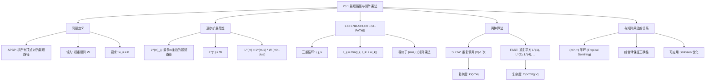

## 相关笔记

- 后续笔记：[[23.2 Floyd-Warshall算法]]、[[23.3 稀疏图的Johnson算法]]
- 前置笔记：[[第22章_单源最短路径-章节汇总]]、[[第04章_分治策略-章节汇总]]
- 关联概念：[[22.1 Bellman-Ford算法]]、[[4.1 矩阵乘法]]、[[4.2 Strassen算法]]、[[14.2 矩阵链乘法]]

> [!abstract] 概览
> 本节介绍一种基于==矩阵乘法==的==所有结点对最短路径==（All-Pairs Shortest Paths, APSP）算法。核心思想是将最短路径问题转化为==$(\min, +)$ 半环==上的矩阵乘法，通过逐步扩展路径所允许的边数来逼近最短路径。由此衍生出两种算法：==SLOW-ALL-PAIRS-SHORTEST-PATHS==（$O(V^4)$）和 ==FASTER-ALL-PAIRS-SHORTEST-PATHS==（$O(V^3 \lg V)$），后者利用==重复平方==技术加速收敛。
>
> **要点列表：**
> - 定义 $L^{(m)}_{ij}$ 为从顶点 $i$ 到顶点 $j$ 的==最多包含 $m$ 条边==的最短路径权重
> - ==EXTEND-SHORTEST-PATHS== 过程执行一次 $(\min, +)$ 矩阵乘法，将路径边数上限从 $m$ 扩展到 $2m$
> - 慢速版本重复调用 EXTEND $|V|-1$ 次，复杂度为 $O(V^4)$
> - 快速版本利用重复平方，仅需 $O(\lg V)$ 次矩阵乘法，复杂度为 $O(V^3 \lg V)$
> - 该框架可进一步结合 ==Strassen 算法==，将矩阵乘法的复杂度从 $O(V^3)$ 降低到 $o(V^3)$

---

## 知识结构总览



---

## 核心思想

> [!note] 核心思路
> 将所有结点对最短路径问题视为一种特殊的矩阵乘法。标准矩阵乘法使用 **(加法, 乘法)** 运算，而最短路径使用 **(min, 加法)** 运算。通过反复执行这种"扩展"操作，路径所允许的边数逐步增加，最终收敛到真正的最短路径。

### 1. APSP 问题定义

> [!def] 所有结点对最短路径问题（All-Pairs Shortest Paths）
> **输入：** 一个带权有向图 $G = (V, E)$，权重函数 $w: E \to \mathbb{R}$，以==权重矩阵== $W = (w_{ij})_{n \times n}$ 表示，其中 $n = |V|$
> - 若 $(i, j) \in E$，则 $w_{ij}$ 为边 $(i, j)$ 的权重
> - 若 $(i, j) \notin E$ 且 $i \ne j$，则 $w_{ij} = \infty$
> - 对所有 $i$，要求 $w_{ii} = 0$（从顶点到自身的空路径权重为0）
>
> **输出：** 一个 $n \times n$ 矩阵 $D = (d_{ij})$，其中 $d_{ij}$ 为从顶点 $i$ 到顶点 $j$ 的==最短路径权重==
> - 若从 $i$ 到 $j$ 不存在路径，则 $d_{ij} = \infty$
> - 若从 $i$ 到 $j$ 的路径上存在==负权环==，则 $d_{ij} = -\infty$

### 2. 逐步扩展性质

> [!def] 逐步扩展（Extending Shortest Paths）
> 定义 $L^{(m)}$ 为一个 $n \times n$ 矩阵，其中 $L^{(m)}_{ij}$ 表示从顶点 $i$ 到顶点 $j$ 的==最多包含 $m$ 条边==的最短路径权重。
>
> **关键递推关系：**
> $$L^{(m)} = L^{(m-1)} \cdot W \quad \text{（$(\min, +)$ 乘法）}$$
>
> 展开写即为：
> $$L^{(m)}_{ij} = \min_{1 \le k \le n} \left\{ L^{(m-1)}_{ik} + w_{kj} \right\}$$
>
> **直觉理解：** 一条从 $i$ 到 $j$ 的最多 $m$ 条边的路径，可以看作一条从 $i$ 到某个中间顶点 $k$ 的最多 $m-1$ 条边的路径，再加上最后一条边 $(k, j)$。

**为什么这个递推是正确的？**

考虑从 $i$ 到 $j$ 的最多 $m$ 条边的最短路径 $p$。如果 $p$ 有 $m$ 条边，设 $p$ 的倒数第二个顶点为 $k$，则 $p$ 的前缀是从 $i$ 到 $k$ 的最多 $m-1$ 条边的路径，权重为 $L^{(m-1)}_{ik}$，加上最后一条边 $(k, j)$ 的权重 $w_{kj}$。遍历所有可能的 $k$ 取最小值即可。如果 $p$ 少于 $m$ 条边，则 $L^{(m-1)}_{ij}$ 已经记录了这条更短路径的权重，取 $\min$ 时自然会被选中。

### 3. EXTEND-SHORTEST-PATHS 伪代码

> [!tip] 算法执行流程
> 1. 对每对顶点 **(i, j)**，将新矩阵对应位置初始化为 **无穷大**
> 2. 遍历所有中间顶点 **k**
> 3. 对每个 **k**，尝试经过 **k** 中转：比较当前值与 **l.ik + w.kj**，取较小者
> 4. 返回新矩阵 **L'**

```mermaid flowchart TD
    A["创建新矩阵 L'"] --> B["对每对顶点 i, j 初始化为无穷大"]
    B --> C["遍历中间顶点 k = 1 到 n"]
    C --> D{"l.ik + w.kj < 当前值?"}
    D -- 是 --> E["更新 l'_ij = l.ik + w.kj"]
    D -- 否 --> F["保持 l'_ij 不变"]
    E --> G{"还有下一个 k?"}
    F --> G
    G -- 是 --> C
    G -- 否 --> H{"还有下一对 i, j?"}
    H -- 是 --> B
    H -- 否 --> I["返回 L'"]
```

```
EXTEND-SHORTEST-PATHS(L, W)
1  n = L.rows
2  let L' = (l'_{ij}) be a new n x n matrix
3  for i = 1 to n
4      for j = 1 to n
5          l'_{ij} = ∞
6          for k = 1 to n
7              l'_{ij} = min(l'_{ij}, l_{ik} + w_{kj})
8  return L'
```

> [!note] EXTEND-SHORTEST-PATHS 的理解
> **三重循环的结构**：外层遍历目标顶点对，内层遍历所有可能的中间顶点。对每对顶点，尝试"经过中间顶点中转"能否得到更短的路径。
>
> **与标准矩阵乘法的对应**：标准矩阵乘法中用求和与乘法，而此处将求和替换为 **min**，将乘法替换为 **加法**。

### 4. 引理23.1（EXTEND 的正确性）

> [!def] 引理23.1
> 给定权重矩阵 $W$，其中对所有 $i \in V$ 有 $w_{ii} = 0$。令 $L^{(m)} = W$（当 $m = 1$ 时），$L^{(m)} = \text{EXTEND-SHORTEST-PATHS}(L^{(m-1)}, W)$（当 $m > 1$ 时）。则对 $m = 1, 2, \ldots, n-1$，矩阵 $L^{(m)}$ 中的元素 $L^{(m)}_{ij}$ 等于从顶点 $i$ 到顶点 $j$ 的==最多包含 $m$ 条边==的最短路径权重。

> [!faq]- 引理23.1 的证明
> **采用数学归纳法对 $m$ 进行归纳。**
>
> **基础情况（$m = 1$）：**
> - $L^{(1)} = W$，即 $L^{(1)}_{ij} = w_{ij}$
> - 从 $i$ 到 $j$ 的最多1条边的路径只有两种情况：
>   - 空路径（仅当 $i = j$）：权重为 $0 = w_{ii}$
>   - 单条边 $(i, j)$（仅当 $(i, j) \in E$）：权重为 $w_{ij}$
>   - 不存在边 $(i, j)$ 且 $i \ne j$：权重为 $\infty = w_{ij}$
> - 因此 $L^{(1)}_{ij}$ 确实等于最多1条边的最短路径权重
> - 基础情况成立
>
> **归纳步骤：**
> - **归纳假设：** 对某个 $m \ge 1$，$L^{(m)}_{ij}$ 等于从 $i$ 到 $j$ 的最多 $m$ 条边的最短路径权重
> - **要证：** $L^{(m+1)}_{ij}$ 等于从 $i$ 到 $j$ 的最多 $m+1$ 条边的最短路径权重
> - 由 EXTEND-SHORTEST-PATHS 的定义：
>   $$L^{(m+1)}_{ij} = \min_{1 \le k \le n} \left\{ L^{(m)}_{ik} + w_{kj} \right\}$$
> - 考虑从 $i$ 到 $j$ 的最多 $m+1$ 条边的最短路径 $p$：
>   - **情况1：** $p$ 最多有 $m$ 条边。由归纳假设，$L^{(m)}_{ij}$ 已经是这条路径的权重。此时取 $k = j$，有 $L^{(m)}_{ij} + w_{jj} = L^{(m)}_{ij} + 0 = L^{(m)}_{ij}$，因此 $\min$ 操作不会遗漏这种情况
>   - **【路径分解（$p$拆分为$m$边子路径+最后一条边）】** **情况2：** $p$ 恰好有 $m+1$ 条边。设 $k$ 为 $p$ 的倒数第二个顶点。则 $p$ 可以分解为：从 $i$ 到 $k$ 的最多 $m$ 条边的子路径 $p'$，加上最后一条边 $(k, j)$。由归纳假设，$p'$ 的权重为 $L^{(m)}_{ik}$，因此 $p$ 的权重为 $L^{(m)}_{ik} + w_{kj}$。$\min$ 操作遍历所有 $k$，必然能找到使 $L^{(m)}_{ik} + w_{kj}$ 最小的那个 $k$
> - 综合两种情况，$L^{(m+1)}_{ij}$ 确实等于最多 $m+1$ 条边的最短路径权重
> - 归纳步骤成立
>
> **结论：** 由数学归纳法，引理23.1对所有 $m = 1, 2, \ldots, n-1$ 成立。$\blacksquare$

### 5. SLOW-ALL-PAIRS-SHORTEST-PATHS

> [!tip] 算法执行流程
> 1. 初始化 **L^(1) = W**（权重矩阵）
> 2. 依次计算 **L^(2), L^(3), ..., L^(n-1)**，每次用 **EXTEND-SHORTEST-PATHS** 扩展
> 3. 每次扩展将路径边数上限从 **m-1** 增加到 **m**
> 4. 返回 **L^(n-1)** 作为所有结点对最短路径

```mermaid flowchart TD
    A["初始化 L^(1) = W"] --> B["令 m = 2"]
    B --> C["L^(m) = EXTEND-SHORTEST-PATHS(L^(m-1), W)"]
    C --> D{"m <= n - 1?"}
    D -- 是 --> E["m = m + 1"]
    E --> C
    D -- 否 --> F["返回 L^(n-1)"]
```

```
SLOW-ALL-PAIRS-SHORTEST-PATHS(W)
1  n = W.rows
2  L^(1) = W
3  for m = 2 to n - 1
4      L^(m) = EXTEND-SHORTEST-PATHS(L^(m-1), W)
5  return L^(n-1)
```

> [!def] SLOW-ALL-PAIRS-SHORTEST-PATHS
> **正确性：** 由引理23.1，$L^{(n-1)}_{ij}$ 等于从 $i$ 到 $j$ 的最多 $n-1$ 条边的最短路径权重。由于简单路径最多包含 $n-1$ 条边（$n$ 个顶点的路径最多 $n-1$ 条边），若图中不存在从 $i$ 可达的负权环，则最短路径一定是简单路径，因此 $L^{(n-1)}_{ij}$ 就是真正的最短路径权重。
>
> **时间复杂度：**
> - EXTEND-SHORTEST-PATHS 的三重循环耗时 $\Theta(n^3)$
> - 共调用 $n - 2$ 次 EXTEND（从 $m = 2$ 到 $n-1$）
> - 总时间：$(n-2) \cdot \Theta(n^3) = $ ==$\Theta(n^4)$== = $O(V^4)$
>
> **空间复杂度：** $\Theta(n^2)$（存储两个 $n \times n$ 矩阵 $L^{(m-1)}$ 和 $L^{(m)}$）

### 6. FASTER-ALL-PAIRS-SHORTEST-PATHS（重复平方）

> [!tip] 算法执行流程
> 1. 初始化 **L^(1) = W**
> 2. 令 **m = 1**，重复倍增：**L^(2m) = L^(m) x L^(m)**（Min-Plus 乘法）
> 3. 每次迭代将路径边数上限**翻倍**
> 4. 直到 **2m >= n - 1** 时停止，返回最终矩阵

```mermaid flowchart TD
    A["初始化 L^(1) = W, m = 1"] --> B{"m < n - 1?"}
    B -- 是 --> C["L^(2m) = EXTEND-SHORTEST-PATHS(L^(m), L^(m))"]
    C --> D["m = 2m"]
    D --> B
    B -- 否 --> E["返回 L^(m)"]
```

```
FASTER-ALL-PAIRS-SHORTEST-PATHS(W)
1  n = W.rows
2  L^(1) = W
3  m = 1
4  while m < n - 1
5      L^(2m) = EXTEND-SHORTEST-PATHS(L^(m), L^(m))
6      m = 2m
7  return L^(m)
```

> [!def] FASTER-ALL-PAIRS-SHORTEST-PATHS
> **核心思想——重复平方（Repeated Squaring）：**
> - 注意到 $L^{(2m)}_{ij} = \min_k \{L^{(m)}_{ik} + L^{(m)}_{kj}\}$，即 $L^{(2m)}$ 可以通过将 $L^{(m)}$ 与自身做 $(\min, +)$ 乘法得到
> - 这类似于快速幂的思想：不是一步一步从 $L^{(1)}$ 推到 $L^{(n-1)}$，而是指数级跳跃：$L^{(1)} \to L^{(2)} \to L^{(4)} \to L^{(8)} \to \cdots$
>
> **正确性：** $L^{(m)}$ 与 $L^{(m)}$ 的 $(\min, +)$ 乘法等价于 $L^{(2m)}$。因为：
> $$[L^{(m)} \cdot L^{(m)}]_{ij} = \min_k \{L^{(m)}_{ik} + L^{(m)}_{kj}\}$$
> 这表示从 $i$ 到 $j$ 先走最多 $m$ 条边到 $k$，再从 $k$ 走最多 $m$ 条边到 $j$，总共最多 $2m$ 条边。
>
> **时间复杂度：**
> - 每次迭代执行一次 EXTEND-SHORTEST-PATHS，耗时 $\Theta(n^3)$
> - while 循环执行 $\lceil \lg(n-1) \rceil$ 次
> - 总时间：$\lceil \lg(n-1) \rceil \cdot \Theta(n^3) = $ ==$\Theta(n^3 \lg n)$== = $O(V^3 \lg V)$
>
> **空间优化：** 原始算法需要存储 $\lceil \lg(n-1) \rceil$ 个矩阵，空间为 $\Theta(n^2 \lg n)$。可以只保留两个矩阵交替使用，将空间降至 $\Theta(n^2)$。

### 7. 与矩阵乘法的深层关系

> [!def] $(\min, +)$ 半环与标准矩阵乘法
> 定义**热带半环**（Tropical Semiring）$(\mathbb{R} \cup \{\infty\}, \min, +)$：
> - "加法"运算为 $\min$（取最小值），单位元为 $\infty$
> - "乘法"运算为 $+$（普通加法），单位元为 $0$
>
> 在此半环上定义矩阵乘法：
> $$[A \star B]_{ij} = \min_{1 \le k \le n} \{a_{ik} + b_{kj}\}$$
>
> 这恰好就是 EXTEND-SHORTEST-PATHS 执行的操作。因此：
> - $L^{(m)} = W^{\star m}$（$W$ 在 $(\min, +)$ 半环上的 $m$ 次幂）
> - $L^{(n-1)} = W^{\star (n-1)}$ 给出所有结点对的最短路径权重
>
> **与标准矩阵乘法的类比：**
>
> | 标准矩阵乘法 $(\mathbb{R}, +, \times)$ | 最短路径矩阵乘法 $(\mathbb{R}, \min, +)$ |
> |:---|:---|
> | $[C]_{ij} = \sum_k a_{ik} \cdot b_{kj}$ | $[C]_{ij} = \min_k (a_{ik} + b_{kj})$ |
> | 单位矩阵 $I$（对角线为1） | 单位矩阵 $L^{(0)}$（对角线为0） |
> | 结合律成立 | 结合律成立 |
> | $A^m$ = $A$ 自乘 $m$ 次 | $W^{\star m}$ = $W$ 自乘 $m$ 次 |

### 8. 与 Strassen 算法的结合

> [!def] 利用 Strassen 算法加速 APSP
> 既然 APSP 可以归约为 $(\min, +)$ 半环上的矩阵乘法，而 Strassen 算法将标准矩阵乘法从 $O(n^3)$ 优化到 $O(n^{\lg 7}) \approx O(n^{2.807})$，那么能否直接套用？
>
> **关键观察：** Strassen 算法只依赖于加法和乘法的==分配律==和==结合律==，不依赖于具体的数值运算。$(\min, +)$ 半环同样满足这些代数性质（$\min$ 对 $+$ 满足分配律：$a + \min(b, c) = \min(a+b, a+c)$），因此 Strassen 的分治策略可以直接移植。
>
> **将 Strassen 应用于 $(\min, +)$ 矩阵乘法：**
> - 将 Strassen 中的 $+$ 替换为 $\min$，将 $\times$ 替换为 $+$
> - 每次递归将 $n \times n$ 矩阵乘法分解为 7 个 $\frac{n}{2} \times \frac{n}{2}$ 矩阵乘法
> - 复杂度从 $O(n^3 \lg n)$ 降低到 $O(n^{\lg 7} \lg n) \approx O(n^{2.807} \lg n)$
>
> **理论意义：** 这是 APSP 问题的一个次立方算法。虽然实际中 [[23.2 Floyd-Warshall算法]] 的 $O(n^3)$ 常数因子更小，但 Strassen 方法证明了 APSP 可以突破立方复杂度。

---

## 补充理解与拓展

> [!info] Min-Plus 矩阵乘法（Tropical Semiring）的广泛应用
>
> $(\min, +)$ 矩阵乘法不仅用于最短路径，在许多领域都有重要应用：
>
> 1. **运筹学与调度问题**：关键路径法（CPM）中，项目完成时间可以通过 $(\max, +)$ 矩阵乘法计算（与 $(\min, +)$ 对偶）
> 2. **语言与自动机理论**：有限自动机的语言接受问题可以表示为 $(\cup, \cdot)$ 半环上的矩阵乘法，而最短路径是 $(\min, +)$ 的特例
> 3. **图像处理**：形态学运算（膨胀、腐蚀）可以用 $(\max, +)$ 和 $(\min, +)$ 矩阵运算表示
> 4. **生物信息学**：序列比对中的动态规划可以看作 $(\min, +)$ 矩阵乘法的变体
>
> **为什么叫"Tropical"（热带）？** 这个名字来自巴西数学家 Imre Simon，他在圣保罗大学（位于热带地区）对这种代数结构做了大量研究。$(\min, +)$ 半环也被称为"min-plus 代数"或"热带代数"。
>
> 来源：Min-plus algebra (Wikipedia); Butkovic, "Max-linear Systems: Theory and Algorithms" (Springer, 2010)

> [!info] 重复平方技术的通用性
>
> 重复平方（Repeated Squaring）是一种通用的算法加速技术，不仅限于最短路径：
>
> | 应用场景 | 操作 | 加速效果 |
> |:---|:---|:---|
> | 快速幂 | $a^m$ 的计算 | $O(m) \to O(\lg m)$ |
> | APSP（本节） | $(\min, +)$ 矩阵幂 | $O(V^4) \to O(V^3 \lg V)$ |
> | 传递闭包 | 布尔矩阵幂 | $O(V^4) \to O(V^3 \lg V)$ |
> | Fibonacci 数 | 矩阵幂 | $O(n) \to O(\lg n)$ |
>
> 核心思想一致：利用运算的**结合律**，将线性次数的迭代压缩为对数次数。在 APSP 中，关键洞察是 $L^{(2m)} = L^{(m)} \star L^{(m)}$，即两次 $m$ 步扩展等价于一次 $2m$ 步扩展。

---

## 易混淆点与辨析

> [!warning] 混淆：逐步扩展矩阵乘法 vs Floyd-Warshall 算法
> 两种算法都解决 APSP 问题，但扩展方式完全不同：
>
> | 维度 | 逐步扩展（本节） | Floyd-Warshall（23.2节） |
> |:---|:---|:---|
> | 扩展维度 | 按**边数**扩展：$L^{(1)}, L^{(2)}, \ldots, L^{(n-1)}$ | 按**中间顶点集合**扩展：$D^{(0)}, D^{(1)}, \ldots, D^{(n)}$ |
> | 递推公式 | $L^{(m)}_{ij} = \min_k(L^{(m-1)}_{ik} + w_{kj})$ | $D^{(k)}_{ij} = \min(D^{(k-1)}_{ij}, D^{(k-1)}_{ik} + D^{(k-1)}_{kj})$ |
> | 慢速复杂度 | $O(V^4)$ | $O(V^3)$ |
> | 快速复杂度 | $O(V^3 \lg V)$（重复平方） | $O(V^3)$（就地更新） |
> | 直觉 | "路径最多能走几步" | "路径最多能经过哪些中间点" |
>
> **关键区别：** 逐步扩展的"慢速"版本是 $O(V^4)$，而 Floyd-Warshall 直接就是 $O(V^3)$。逐步扩展需要借助重复平方才能达到 $O(V^3 \lg V)$，仍比 Floyd-Warshall 多一个 $\lg V$ 因子。但逐步扩展的理论价值在于揭示了 APSP 与矩阵乘法的深刻联系。

> [!warning] 混淆：$O(V^4)$ vs $O(V^3 \lg V)$ 的差异来源
> - **$O(V^4)$（SLOW版本）：** EXTEND-SHORTEST-PATHS 本身是 $O(V^3)$（三重循环），调用 $V-1$ 次，所以 $O(V^3 \times V) = O(V^4)$
> - **$O(V^3 \lg V)$（FAST版本）：** 同样是 $O(V^3)$ 的 EXTEND，但只调用 $\lceil \lg V \rceil$ 次（重复平方），所以 $O(V^3 \times \lg V) = O(V^3 \lg V)$
> - 加速的核心是利用了==结合律==：$L^{(m)} \star L^{(m)} = L^{(2m)}$，一次乘法将路径边数上限翻倍

> [!warning] 混淆：$L^{(m)}$ 与 $D^{(k)}$ 的含义
> - $L^{(m)}_{ij}$：从 $i$ 到 $j$ 的**最多 $m$ 条边**的最短路径权重（本节）
> - $D^{(k)}_{ij}$：从 $i$ 到 $j$ 的**所有中间顶点编号不超过 $k$** 的最短路径权重（23.2节）
> - 两者刻画路径的方式不同，不要混淆

---

## 习题精选

| 题号 | 题目描述 | 难度 |
|:---:|----------|:---:|
| 23.1-1 | 对图25.2中的加权有向图运行 SLOW-ALL-PAIRS-SHORTEST-PATHS 和 FASTER-ALL-PAIRS-SHORTEST-PATHS，展示每次迭代得到的矩阵 | ⭐⭐ |
| 23.1-2 | 为什么要求对所有 $1 \le i \le n$ 有 $w_{ii} = 0$？ | ⭐ |
| 23.1-3 | 矩阵 $L^{(0)}$（对角线为0，其余为 $\infty$）在常规矩阵乘法中对应什么？ | ⭐ |
| 23.1-4 | 证明 EXTEND-SHORTEST-PATHS 定义的矩阵乘法满足结合律 | ⭐⭐⭐ |
| 23.1-5 | 如何将单源最短路径问题表示为矩阵与向量的乘积？ | ⭐⭐ |
| 23.1-6 | 如何从完成的最短路径权重矩阵 $L$ 在 $O(n^3)$ 时间内计算出前驱矩阵 $\Pi$？ | ⭐⭐ |

> [!faq]- 23.1-1 解答
> **目标：** 对图25.2中的加权有向图分别运行两种算法。
>
> **初始权重矩阵 $W$：**
> $$W = \begin{pmatrix} 0 & \infty & \infty & \infty & -1 & \infty \\ 1 & 0 & \infty & 2 & \infty & \infty \\ \infty & 2 & 0 & \infty & \infty & -8 \\ -4 & \infty & \infty & 0 & 3 & \infty \\ \infty & 7 & \infty & \infty & 0 & \infty \\ \infty & 5 & 10 & \infty & \infty & 0 \end{pmatrix}$$
>
> **SLOW-ALL-PAIRS-SHORTEST-PATHS 的迭代过程：**
>
> $m = 2$：
> $$L^{(2)} = \begin{pmatrix} 0 & 6 & \infty & \infty & -1 & \infty \\ -2 & 0 & \infty & 2 & 0 & \infty \\ 3 & -3 & 0 & 4 & \infty & -8 \\ -4 & 10 & \infty & 0 & -5 & \infty \\ 8 & 7 & \infty & 9 & 0 & \infty \\ 6 & 5 & 10 & 7 & \infty & 0 \end{pmatrix}$$
>
> $m = 3$：
> $$L^{(3)} = \begin{pmatrix} 0 & 6 & \infty & 8 & -1 & \infty \\ -2 & 0 & \infty & 2 & -3 & \infty \\ -2 & -3 & 0 & -1 & 2 & -8 \\ -4 & 2 & \infty & 0 & -5 & \infty \\ 5 & 7 & \infty & 9 & 0 & \infty \\ 3 & 5 & 10 & 7 & 5 & 0 \end{pmatrix}$$
>
> $m = 4$：
> $$L^{(4)} = \begin{pmatrix} 0 & 6 & \infty & 8 & -1 & \infty \\ -2 & 0 & \infty & 2 & -3 & \infty \\ -5 & -3 & 0 & -1 & -3 & -8 \\ -4 & 2 & \infty & 0 & -5 & \infty \\ 5 & 7 & \infty & 9 & 0 & \infty \\ 3 & 5 & 10 & 7 & 2 & 0 \end{pmatrix}$$
>
> $m = 5$：
> $$L^{(5)} = \begin{pmatrix} 0 & 6 & \infty & 8 & -1 & \infty \\ -2 & 0 & \infty & 2 & -3 & \infty \\ -5 & -3 & 0 & -1 & -6 & -8 \\ -4 & 2 & \infty & 0 & -5 & \infty \\ 5 & 7 & \infty & 9 & 0 & \infty \\ 3 & 5 & 10 & 7 & 2 & 0 \end{pmatrix}$$
>
> **FASTER-ALL-PAIRS-SHORTEST-PATHS 的迭代过程（重复平方）：**
>
> $m = 2$：与 SLOW 的 $L^{(2)}$ 相同
>
> $m = 4$：$L^{(4)} = L^{(2)} \star L^{(2)}$，结果与 SLOW 的 $L^{(4)}$ 相同
>
> $m = 8$：$L^{(8)} = L^{(4)} \star L^{(4)}$，结果与 SLOW 的 $L^{(5)}$ 相同（因为 $n = 6$，$n-1 = 5 < 8$，所以 $L^{(8)}$ 已经收敛到最终答案）
>
> **观察：** 两种算法得到相同的最终结果，但 FAST 版本只需 3 次迭代（$m = 2, 4, 8$），而 SLOW 版本需要 4 次迭代（$m = 2, 3, 4, 5$）。对于更大的图，差异会更加显著。

> [!faq]- 23.1-2 解答
> **目标：** 解释为什么要求 $w_{ii} = 0$。
>
> **原因分析：**
>
> 1. **语义一致性：** 从顶点 $i$ 到自身的最短路径是空路径（不经过任何边），其权重为 0。如果 $w_{ii} \ne 0$，则 $L^{(1)}_{ii} = w_{ii} \ne 0$，与"空路径权重为0"矛盾。
>
> 2. **负权环检测：** 如果存在 $w_{ii} < 0$，意味着存在一个从 $i$ 到 $i$ 的负权环（自环）。如果 $w_{ii} > 0$，则 $L^{(1)}_{ii} = w_{ii} > 0$，但空路径权重为 0，这会导致 $L^{(1)}$ 中的对角线元素不正确。
>
> 3. **EXTEND 的正确性依赖：** 在 EXTEND-SHORTEST-PATHS 中，当 $k = j$ 时，计算 $l_{ij} + w_{jj}$。如果 $w_{jj} \ne 0$，则 $l_{ij} + w_{jj} \ne l_{ij}$，这意味着"不经过任何中间顶点"的情况不会被正确处理。具体来说，取 $\min$ 时，$l_{ij} + w_{jj}$ 会偏离 $l_{ij}$ 的真实值，导致 $L^{(1)}$ 产生错误结果。
>
> **结论：** $w_{ii} = 0$ 保证了 $L^{(0)}$（单位矩阵）在 $(\min, +)$ 半环中充当正确的单位元角色，同时确保了 EXTEND 操作的正确性。

> [!faq]- 23.1-3 解答
> **目标：** 确定 $L^{(0)}$ 在常规矩阵乘法中的对应物。
>
> $$L^{(0)} = \begin{pmatrix} 0 & \infty & \infty & \cdots & \infty \\ \infty & 0 & \infty & \cdots & \infty \\ \infty & \infty & 0 & \cdots & \infty \\ \vdots & \vdots & \vdots & \ddots & \vdots \\ \infty & \infty & \infty & \cdots & 0 \end{pmatrix}$$
>
> 在 $(\min, +)$ 半环中，$L^{(0)}$ 是==单位矩阵==：
> - 对角线元素为 $0$，即 $(\min, +)$ 半环中"乘法"（$+$）的单位元
> - 非对角线元素为 $\infty$，即 $(\min, +)$ 半环中"加法"（$\min$）的单位元
>
> 在标准矩阵乘法 $(\mathbb{R}, +, \times)$ 中，对应的单位矩阵为：
> $$I = \begin{pmatrix} 1 & 0 & 0 & \cdots & 0 \\ 0 & 1 & 0 & \cdots & 0 \\ 0 & 0 & 1 & \cdots & 0 \\ \vdots & \vdots & \vdots & \ddots & \vdots \\ 0 & 0 & 0 & \cdots & 1 \end{pmatrix}$$
>
> 其中对角线为 $1$（$\times$ 的单位元），非对角线为 $0$（$+$ 的单位元）。
>
> **结论：** $L^{(0)}$ 是 $(\min, +)$ 半环上的单位矩阵，对应标准矩阵乘法中的==单位矩阵 $I$==。

> [!faq]- 23.1-4 解答
> **目标：** 证明 EXTEND-SHORTEST-PATHS 定义的矩阵乘法满足结合律。
>
> **证明：**
>
> 需要证明：$(A \star B) \star C = A \star (B \star C)$，其中 $\star$ 表示 $(\min, +)$ 矩阵乘法。
>
> 考虑等式左边 $[(A \star B) \star C]_{ab}$：
>
> $$\begin{aligned} [(A \star B) \star C]_{ab} &= \min_{1 \le k \le n} \{[A \star B]_{ak} + c_{kb}\} \\ &= \min_{1 \le k \le n} \left\{ \min_{1 \le q \le n} \{a_{aq} + b_{qk}\} + c_{kb} \right\} \\ &= \min_{1 \le k \le n} \min_{1 \le q \le n} \{a_{aq} + b_{qk} + c_{kb}\} \\ &= \min_{1 \le q \le n} \min_{1 \le k \le n} \{a_{aq} + b_{qk} + c_{kb}\} \\ &= \min_{1 \le q \le n} \left\{ a_{aq} + \min_{1 \le k \le n} \{b_{qk} + c_{kb}\} \right\} \\ &= \min_{1 \le q \le n} \{a_{aq} + [B \star C]_{qb}\} \\ &= [A \star (B \star C)]_{ab} \end{aligned}$$
>
> **【$\min$交换律（$\min_k \min_q = \min_q \min_k$）】** 关键步骤是第三行到第四行的交换：$\min_k \min_q = \min_q \min_k$（两个 $\min$ 可以交换顺序），**【提出常数（$a_{aq}$不依赖$k$可提到$\min$外）】** 以及第五行将 $a_{aq}$ 提到内层 $\min$ 外面（因为 $a_{aq}$ 不依赖于 $k$）。
>
> 因此 $(A \star B) \star C = A \star (B \star C)$，结合律成立。$\blacksquare$

> [!faq]- 23.1-6 解答
> **目标：** 从完成的最短路径权重矩阵 $L$ 在 $O(n^3)$ 时间内计算前驱矩阵 $\Pi$。
>
> **算法思路：**
>
> 对每个源顶点 $i$，需要构建以 $i$ 为根的最短路径树。对每个目标顶点 $j \ne i$，找到 $j$ 在最短路径上的前驱顶点。
>
> **具体方法：** 对固定的 $i$ 和 $j$，前驱 $\pi_{ij}$ 是满足 $L_{ik} + w_{kj} = L_{ij}$ 的顶点 $k$（即最短路径上 $j$ 的前一个顶点）。
>
> **算法：**
> ```
> COMPUTE-PREDECESSOR-FROM-L(L, W)
> 1  n = L.rows
> 2  let Pi = (pi_{ij}) be a new n x n matrix
> 3  for i = 1 to n
> 4      for j = 1 to n
> 5          if i == j
> 6              pi_{ij} = NIL
> 7          else
> 8              pi_{ij} = NIL
> 9              for k = 1 to n
> 10                 if k != j and L[i][k] + W[k][j] == L[i][j]
> 11                     pi_{ij} = k
> 12                     break
> 13 return Pi
> ```
>
> **复杂度分析：** 外层两重循环 $O(n^2)$，内层搜索 $O(n)$，总计 $O(n^3)$。
>
> **注意：** 这里使用的是原始权重矩阵 $W$ 而非 $L$ 来检查最后一条边，因为我们需要找到最短路径上 $j$ 的直接前驱（通过一条边相连的顶点）。

---

## 视频学习指南

| 资源 | 主题 | 链接 | 说明 |
|:-----|:-----|:-----|:-----|
| MIT 6.006 Lecture 16 | Graph APSP | https://www.youtube.com/watch?v=KXzJ7dOqTqI | MIT公开课，涵盖APSP的矩阵乘法方法 |
| Abdul Bari | Floyd-Warshall & APSP | https://www.youtube.com/watch?v=oNI0rf2P9gE | 直观的逐步演示 |
| WilliamFiset | Floyd Warshall | https://www.youtube.com/watch?v=4OQeClyHbew | 包含代码实现与复杂度分析 |
| GeeksforGeeks | APSP | https://www.geeksforgeeks.org/floyd-warshall-algorithm-dp-16/ | 文字+图示，适合对照学习 |

---

## 教材原文

> [!quote] CLRS 第4版 23.1节原文
> To solve the all-pairs shortest-paths problem on an input graph $G = (V, E)$, we need to compute the shortest-path weight $\delta(u, v)$ for every pair of vertices $u, v \in V$. We can enumerate all pairs, running a single-source shortest-paths algorithm from each vertex, but doing so takes $O(V \cdot T)$ time, where $T$ is the running time of the single-source algorithm. If we use Bellman-Ford, which runs in $O(VE)$ time, the total time becomes $O(V^2 E)$. If all edge weights are nonnegative, we can use Dijkstra's algorithm, which runs in $O((V + E)\lg V)$ time with a binary min-heap, yielding a total time of $O(V(V + E)\lg V)$.
>
> This section presents two dynamic-programming algorithms for the all-pairs shortest-paths problem. The first, which we call SLOW-ALL-PAIRS-SHORTEST-PATHS, computes the shortest-path weights by exploiting the relationship between the all-pairs shortest-paths problem and the matrix multiplication problem. The second, FASTER-ALL-PAIRS-SHORTEST-PATHS, computes the same result more quickly by using the technique of "repeated squaring."

---

## 参见Wiki

- [[算法导论/concepts/所有结点对最短路径]] — 所有结点对最短路径问题概述
- [[算法导论/concepts/Floyd-Warshall算法]] — Floyd-Warshall 算法详解

#学习/算法导论/第23章-所有结点对的最短路径 #学习/算法导论/所有结点对的最短路径/最短路径与矩阵乘法
