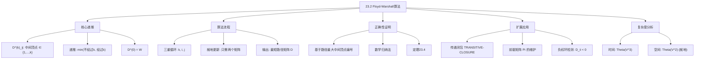

## 相关笔记

- 前置笔记：[[23.1 最短路径与矩阵乘法]]、[[第22章_单源最短路径-章节汇总]]
- 后续笔记：[[23.3 稀疏图的Johnson算法]]
- 关联概念：[[22.1 Bellman-Ford算法]]、[[22.3 Dijkstra算法]]、[[20.5 强连通分量]]

> [!abstract] 概览
> 本节介绍 ==Floyd-Warshall 算法==，它解决==所有结点对最短路径==（APSP）问题，时间复杂度为 ==$\Theta(V^3)$==，空间复杂度为 ==$\Theta(V^2)$==（就地更新版本）。算法基于==动态规划==，通过逐步放宽"中间顶点"的约束来逼近最短路径。Floyd-Warshall 算法能够正确处理==负权边==，并且可以==检测负权环==。
>
> **要点列表：**
> - 定义 $D^{(k)}_{ij}$ 为从 $i$ 到 $j$ 且所有中间顶点编号不超过 $k$ 的最短路径权重
> - 核心递推：$D^{(k)}_{ij} = \min(D^{(k-1)}_{ij}, D^{(k-1)}_{ik} + D^{(k-1)}_{kj})$
> - 三重循环结构，外层循环变量 $k$ 为当前允许的最大中间顶点编号
> - 就地更新版本只需 $\Theta(V^2)$ 空间
> - 可自然扩展为==传递闭包==算法和==前驱矩阵==维护
> - 负权环检测：检查最终矩阵的对角线元素 $D_{ii} < 0$

---

## 知识结构总览



---

## 核心思想

> [!tip] 核心思路
> Floyd-Warshall 算法的核心思想是**逐步放宽中间顶点的约束**。想象你要从城市 **i** 飞到城市 **j**，最初只允许直飞（不经过任何中转城市）。然后逐步允许经过城市1中转、经过城市1和2中转、...、直到允许经过所有城市中转。每放宽一个约束，某些路径可能变得更短。最终，当允许经过所有城市中转时，得到的就是真正的最短路径。

### 1. Floyd-Warshall 递推

> [!def] Floyd-Warshall 递推公式
> 设图的顶点编号为 $1, 2, \ldots, n$。定义 $D^{(k)}_{ij}$ 为从顶点 $i$ 到顶点 $j$ 的==所有中间顶点编号均不超过 $k$==的最短路径权重。
>
> **递推关系：**
> $$D^{(k)}_{ij} = \min\left(D^{(k-1)}_{ij},\; D^{(k-1)}_{ik} + D^{(k-1)}_{kj}\right) \quad \text{对 } k \ge 1$$
>
> **初始条件：**
> $$D^{(0)}_{ij} = w_{ij}$$
>
> 即 $D^{(0)} = W$（权重矩阵），表示不允许经过任何中间顶点时的最短路径（只有直连边或 $\infty$）。
>
> **最终结果：**
> $$D^{(n)}_{ij} = \delta(i, j) \quad \text{（从 $i$ 到 $j$ 的最短路径权重）}$$

### 2. 直觉解释

> [!note] 递推的直觉理解
> 递推公式的含义是：从顶点 **i** 到顶点 **j** 且中间顶点不超过 **k** 的最短路径，只有两种可能：
> 1. **不经过顶点 k**：那么它就是中间顶点不超过 **k-1** 的最短路径
> 2. **经过顶点 k**：那么路径分为两段——从 **i** 到 **k** 和从 **k** 到 **j**（两段的中间顶点都不超过 **k-1**）
>
> 取两者的最小值即可。
>
> **生活类比：** 假设你在规划从北京到广州的最优路线。一开始你只考虑直达航班。然后允许在上海中转，看看经过上海会不会更便宜。接着允许在武汉中转，看看经过武汉会不会更便宜。每增加一个允许的中转城市，你都重新检查所有城市对，看看新允许的中转城市能否带来更优路线。

### 3. FLOYD-WARSHALL 伪代码

> [!tip] 算法执行流程
> 1. 初始化 **D^(0) = W**（权重矩阵）
> 2. 令 **k** 从 **1** 到 **n** 循环，逐步放宽中间顶点约束
> 3. 对每对 **(i, j)**：若 **D[i][k] + D[k][j] < D[i][j]**，则更新 **D[i][j]**
> 4. 返回 **D^(n)** 作为所有结点对最短路径

```mermaid flowchart TD
    A["初始化 D^(0) = W"] --> B["令 k = 1"]
    B --> C["对每对顶点 i, j"]
    C --> D{"D[i][k] + D[k][j] < D[i][j]?"}
    D -- 是 --> E["更新 D[i][j] = D[i][k] + D[k][j]"]
    D -- 否 --> F["保持 D[i][j] 不变"]
    E --> G{"还有下一对 i, j?"}
    F --> G
    G -- 是 --> C
    G -- 否 --> H{"k <= n?"}
    H -- 是 --> I["k = k + 1"]
    I --> C
    H -- 否 --> J["返回 D^(n)"]
```

```
FLOYD-WARSHALL(W)
1  n = W.rows
2  D^(0) = W
3  for k = 1 to n
4      let D^(k) = (d^(k)_{ij}) be a new n x n matrix
5      for i = 1 to n
6          for j = 1 to n
7              d^(k)_{ij} = min(d^(k-1)_{ij}, d^(k-1)_{ik} + d^(k-1)_{kj})
8  return D^(n)
```

> [!note] 伪代码的理解
> **三重循环的层次：**
> - 最外层（**k**）：当前允许的最大中间顶点编号
> - 中间层（**i**）：源顶点
> - 最内层（**j**）：目标顶点
>
> **循环顺序的重要性：** **k** 必须在最外层。因为第 **k** 轮的计算依赖第 **k-1** 轮的结果，必须先完成所有上一轮的计算，才能正确计算当前轮。

### 4. 就地更新版本

```
FLOYD-WARSHALL'(W)
1  n = W.rows
2  D = W
3  for k = 1 to n
4      for i = 1 to n
5          for j = 1 to n
6              d[i][j] = min(d[i][j], d[i][k] + d[k][j])
7  return D
```

> [!def] 就地更新的正确性
> 就地更新版本将 $D^{(k)}$ 直接覆盖写入 $D^{(k-1)}$，只需 $\Theta(n^2)$ 空间。其正确性基于以下观察：
>
> 当计算 $d_{ij}^{(k)} = \min(d_{ij}^{(k-1)}, d_{ik}^{(k-1)} + d_{kj}^{(k-1)})$ 时：
> - $d_{ij}^{(k-1)}$ 是 $D$ 中尚未被第 $k$ 轮更新的值（因为 $i$ 和 $j$ 的循环在 $k$ 的循环内部，$d_{ij}$ 在第 $k$ 轮中只被更新一次）
> - $d_{ik}^{(k-1)}$：即使 $d_{ik}$ 在第 $k$ 轮中已被更新为 $d_{ik}^{(k)}$，由于 $d_{ik}^{(k)} = \min(d_{ik}^{(k-1)}, d_{ik}^{(k-1)} + d_{kk}^{(k-1)})$，而 $d_{kk}^{(k-1)} \le 0$（因为 $w_{kk} = 0$，且最短路径权重不超过空路径的权重0），所以 $d_{ik}^{(k)} \le d_{ik}^{(k-1)}$。但使用 $d_{ik}^{(k)}$ 代替 $d_{ik}^{(k-1)}$ 不会导致错误，因为如果 $d_{ik}^{(k)} < d_{ik}^{(k-1)}$，说明经过 $k$ 的路径更短，这恰好是我们想要考虑的情况
>
> 更精确的分析表明，就地更新是安全的，因为 $d_{ik}^{(k)}$ 和 $d_{kj}^{(k)}$ 的值都不会大于 $d_{ik}^{(k-1)}$ 和 $d_{kj}^{(k-1)}$，因此使用更新后的值只会使结果更优或不变。

### 5. 定理23.4（正确性）

> [!def] 定理23.4（Floyd-Warshall 算法的正确性）
> 给定带权有向图 $G = (V, E)$，其权重函数为 $w: E \to \mathbb{R}$，权重矩阵为 $W$，且对所有 $i \in V$ 有 $w_{ii} = 0$。若 $G$ 不包含从源顶点 $s$ 可达的负权环，则对所有顶点 $i, j \in V$，运行 FLOYD-WARSHALL 后返回的矩阵 $D^{(n)}$ 满足 $D^{(n)}_{ij} = \delta(i, j)$（从 $i$ 到 $j$ 的最短路径权重）。

> [!faq]- 定理23.4 的完整证明
> **证明基于对 $k$ 的数学归纳法。**
>
> **核心概念——路径的最大中间顶点编号：**
> 对一条路径 $p = \langle v_0, v_1, \ldots, v_l \rangle$（其中 $v_0 = i$，$v_l = j$），定义其**最大中间顶点编号**为 $\max\{v_1, v_2, \ldots, v_{l-1}\}$（不包含端点 $v_0$ 和 $v_l$）。若 $l = 1$（直连边），则路径没有中间顶点，定义最大中间顶点编号为 0。
>
> **命题：** $D^{(k)}_{ij}$ 等于从 $i$ 到 $j$ 的所有中间顶点编号不超过 $k$ 的最短路径权重。
>
> **基础情况（$k = 0$）：**
> - $D^{(0)}_{ij} = w_{ij}$
> - 中间顶点编号不超过 0 的路径只有两种：
>   - 空路径（$i = j$）：权重为 $0 = w_{ii}$
>   - 单条边 $(i, j)$：权重为 $w_{ij}$
> - 因此 $D^{(0)}_{ij}$ 确实等于中间顶点编号不超过 0 的最短路径权重
> - 基础情况成立
>
> **归纳步骤：**
> - **归纳假设：** 对某个 $k \ge 0$，$D^{(k)}_{ij}$ 等于从 $i$ 到 $j$ 的所有中间顶点编号不超过 $k$ 的最短路径权重
> - **要证：** $D^{(k+1)}_{ij}$ 等于从 $i$ 到 $j$ 的所有中间顶点编号不超过 $k+1$ 的最短路径权重
>
> 考虑从 $i$ 到 $j$ 的中间顶点编号不超过 $k+1$ 的最短路径 $p$：
>
> - **情况1：** $p$ 的最大中间顶点编号不超过 $k$
>   - 由归纳假设，$p$ 的权重为 $D^{(k)}_{ij}$
>   - 此时 $D^{(k+1)}_{ij} = \min(D^{(k)}_{ij}, D^{(k)}_{ik} + D^{(k)}_{kj})$，取第一项即为 $D^{(k)}_{ij}$
>
> - **情况2：** $p$ 的最大中间顶点编号恰好为 $k+1$
>   - **【路径分界点（$k+1$在$p$上的位置$v_r$）】** 设 $k+1$ 在路径 $p$ 上出现的位置为 $v_r$（$0 < r < l$）
>   - **【路径拆分（$p$分为$p_1$: $i\to k+1$ 和 $p_2$: $k+1\to j$）】** 将 $p$ 分为两段：$p_1 = \langle v_0, v_1, \ldots, v_r \rangle$（从 $i$ 到 $k+1$）和 $p_2 = \langle v_r, v_{r+1}, \ldots, v_l \rangle$（从 $k+1$ 到 $j$）
>   - **【端点非中间顶点（$k+1$作为端点不计入中间顶点）】** $p_1$ 的中间顶点编号不超过 $k$（因为 $k+1$ 是端点，不是中间顶点），由归纳假设，$p_1$ 的权重为 $D^{(k)}_{i,k+1}$
>   - 同理，$p_2$ 的中间顶点编号不超过 $k$，权重为 $D^{(k)}_{k+1,j}$
>   - **【两段权重相加】** 因此 $p$ 的权重为 $D^{(k)}_{i,k+1} + D^{(k)}_{k+1,j}$
>   - 此时 $D^{(k+1)}_{ij}$ 取第二项 $D^{(k)}_{ik} + D^{(k)}_{kj}$（令 $k+1$ 为中间顶点）即为这个值
>
> - 综合两种情况，$D^{(k+1)}_{ij}$ 确实等于中间顶点编号不超过 $k+1$ 的最短路径权重
> - 归纳步骤成立
>
> **终止：**
> - 当 $k = n$ 时，$D^{(n)}_{ij}$ 等于从 $i$ 到 $j$ 的所有中间顶点编号不超过 $n$ 的最短路径权重
> - **【无中间顶点限制（所有顶点编号 $\leq n$）】** 由于所有顶点编号都在 $1$ 到 $n$ 之间，这等价于不加任何中间顶点限制的最短路径
> - **【无负权环 $\Rightarrow$ 最短路径为简单路径】** 若图中不存在从 $i$ 可达的负权环，则最短路径一定是简单路径（最多 $n-1$ 条边），$D^{(n)}_{ij} = \delta(i, j)$
>
> **结论：** 定理23.4得证。$\blacksquare$

### 6. 传递闭包

> [!def] 传递闭包（Transitive Closure）
> 给定有向图 $G = (V, E)$，$G$ 的==传递闭包== $G^* = (V, E^*)$ 满足：$(i, j) \in E^*$ 当且仅当从 $i$ 到 $j$ 存在一条路径（路径长度至少为0，即每个顶点到自身可达）。
>
> 传递闭包可以用布尔矩阵 $T^{(k)}_{ij}$ 表示，其中 $T^{(k)}_{ij} = \text{TRUE}$ 当且仅当从 $i$ 到 $j$ 存在一条所有中间顶点编号不超过 $k$ 的路径。

> [!tip] 算法执行流程
> 1. 初始化 **T^(0)** 为邻接矩阵（有边为 **1**，无边为 **0**，对角线为 **1**）
> 2. 令 **k** 从 **1** 到 **n** 循环
> 3. 对每对 **(i, j)**：**T[i][j] = T[i][j] OR (T[i][k] AND T[k][j])**
> 4. 返回 **T^(n)** 作为传递闭包

```mermaid flowchart TD
    A["初始化 T^(0): 有边=1, 无边=0"] --> B["令 k = 1"]
    B --> C["对每对顶点 i, j"]
    C --> D{"T[i][k] AND T[k][j] == 1?"}
    D -- 是 --> E["T[i][j] = 1"]
    D -- 否 --> F["保持 T[i][j] 不变"]
    E --> G{"还有下一对 i, j?"}
    F --> G
    G -- 是 --> C
    G -- 否 --> H{"k <= n?"}
    H -- 是 --> I["k = k + 1"]
    I --> C
    H -- 否 --> J["返回 T^(n)"]
```

```
TRANSITIVE-CLOSURE(W)
1  n = W.rows
2  for i = 1 to n
3      for j = 1 to n
4          if i == j or (i, j) ∈ E
5              t^(0)_{ij} = 1
6          else
7              t^(0)_{ij} = 0
8  for k = 1 to n
9      let T^(k) = (t^(k)_{ij}) be a new n x n matrix
10     for i = 1 to n
11         for j = 1 to n
12             t^(k)_{ij} = t^(k-1)_{ij} OR (t^(k-1)_{ik} AND t^(k-1)_{kj})
13 return T^(n)
```

> [!note] 传递闭包与 Floyd-Warshall 的关系
> 传递闭包是 Floyd-Warshall 算法在**布尔半环**上的特例：
> - 将 **min** 替换为 **OR**
> - 将 **+** 替换为 **AND**
> - 将 **∞** 替换为 **0**（FALSE）
> - 将权重矩阵替换为邻接矩阵
>
> 传递闭包的时间复杂度同样是 **Θ(n³)**，空间可以优化为 **Θ(n²)**（就地更新）。

### 7. 前驱矩阵的维护

> [!def] 前驱矩阵 $\Pi^{(k)}$
> 为了重建最短路径，Floyd-Warshall 算法可以同时维护前驱矩阵 $\Pi^{(k)}$，其中 $\Pi^{(k)}_{ij}$ 是从 $i$ 到 $j$ 的中间顶点不超过 $k$ 的最短路径上 $j$ 的前驱顶点。
>
> **递推公式：**
> $$\Pi^{(k)}_{ij} = \begin{cases} \Pi^{(k-1)}_{ij} & \text{若 } D^{(k-1)}_{ij} \le D^{(k-1)}_{ik} + D^{(k-1)}_{kj} \\ \Pi^{(k-1)}_{kj} & \text{若 } D^{(k-1)}_{ij} > D^{(k-1)}_{ik} + D^{(k-1)}_{kj} \end{cases}$$
>
> **初始条件：**
> $$\Pi^{(0)}_{ij} = \begin{cases} i & \text{若 } i \ne j \text{ 且 } (i, j) \in E \\ \text{NIL} & \text{其他情况} \end{cases}$$

```
FLOYD-WARSHALL-WITH-PI(W)
1  n = W.rows
2  D^(0) = W
3  for i = 1 to n
4      for j = 1 to n
5          if i != j and w[i][j] < ∞
6              pi^(0)_{ij} = i
7          else
8              pi^(0)_{ij} = NIL
9  for k = 1 to n
10     let D^(k) be a new n x n matrix
11     let Pi^(k) be a new n x n matrix
12     for i = 1 to n
13         for j = 1 to n
14             if d^(k-1)_{ij} <= d^(k-1)_{ik} + d^(k-1)_{kj}
15                 d^(k)_{ij} = d^(k-1)_{ij}
16                 pi^(k)_{ij} = pi^(k-1)_{ij}
17             else
18                 d^(k)_{ij} = d^(k-1)_{ik} + d^(k-1)_{kj}
19                 pi^(k)_{ij} = pi^(k-1)_{kj}
20 return (D^(n), Pi^(n))
```

> [!note] 前驱矩阵的使用
> 得到最终的前驱矩阵后，可以通过递归过程重建从顶点 **i** 到顶点 **j** 的最短路径：
> - 若前驱为 **NIL**，则不存在从 **i** 到 **j** 的路径
> - 若前驱为 **i**，则边 (**i**, **j**) 是最短路径的最后一条边
> - 否则，递归输出从 **i** 到前驱顶点的最短路径，然后输出 **j**

### 8. 负权环检测

> [!def] 负权环检测
> Floyd-Warshall 算法运行结束后，可以通过检查矩阵 $D^{(n)}$ 的==对角线元素==来检测负权环：
>
> - 若 $D^{(n)}_{ii} < 0$ 对某个 $i$ 成立，则从顶点 $i$ 出发存在一条==负权环==可达
> - 若对所有 $i$ 都有 $D^{(n)}_{ii} \ge 0$，则图中不存在任何顶点可达的负权环
>
> **原理：** $D^{(n)}_{ii}$ 表示从 $i$ 到 $i$ 的最短路径权重。空路径权重为 0，所以如果 $D^{(n)}_{ii} < 0$，说明存在一条从 $i$ 出发又回到 $i$ 的路径，其权重为负——这就是一个负权环。
>
> **注意区分：** 负权边（某条边权重为负）是允许的，负权环（一个环的总权重为负）才是问题所在。负权环会导致最短路径无定义（可以无限绕环使路径权重趋近于 $-\infty$）。

### 9. 复杂度分析

> [!def] 时间与空间复杂度
> **时间复杂度：** ==$\Theta(V^3)$==
> - 三重嵌套循环，每层 $O(V)$
> - 循环体内执行常数次运算
> - 总计 $\Theta(V \times V \times V) = \Theta(V^3)$
>
> **空间复杂度：**
> - 非就地版本：$\Theta(V^2)$（存储 $D^{(k)}$ 和 $D^{(k-1)}$ 两个矩阵）
> - 就地更新版本：$\Theta(V^2)$（只需一个矩阵）
> - 若同时维护前驱矩阵：$\Theta(V^2)$（额外一个 $\Pi$ 矩阵）
>
> **与单源算法运行 $|V|$ 次的对比：**
>
> | 方法 | 总时间 | 适用条件 |
> |:---|:---|:---|
> | Bellman-Ford 运行 $|V|$ 次 | $O(V^2 E)$ | 允许负权边 |
> | Dijkstra 运行 $|V|$ 次 | $O(V(V + E)\lg V)$ | 仅非负权边 |
> | Floyd-Warshall | $O(V^3)$ | 允许负权边 |
>
> 当图为稠密图（$E = \Theta(V^2)$）时，Floyd-Warshall 的 $O(V^3)$ 与 Bellman-Ford 运行 $|V|$ 次的 $O(V^4)$ 相比优势明显。

---

## 补充理解与拓展

> [!info] Floyd-Warshall 算法的发明历史
>
> Floyd-Warshall 算法的历史是一段有趣的"多重发现"故事：
>
> 1. **Bernard Roy（1959年）**：法国数学家 Bernard Roy 在1959年实际上已经发表了本质相同的算法，用于解决可达性问题（传递闭包）。然而这篇论文在当时并未引起广泛关注。
>
> 2. **Stephen Warshall（1962年）**：美国计算机科学家 Stephen Warshall 于1962年在《Journal of the ACM》上发表了传递闭包算法，用于计算有向图的传递闭包。Warshall 当时在一家名为 Computer Associates 的公司工作。
>
> 3. **Robert W. Floyd（1962年）**：美国计算机科学家 Robert W. Floyd 于1962年独立发表了相同的算法，但将其应用于最短路径问题。Floyd 的论文 "Algorithm 97: Shortest Path" 发表在《Communications of the ACM》上，仅用了不到一页的篇幅。
>
> 4. **Peter Ingerman（1962年）**：Peter Z. Ingerman 对 Floyd 的算法给出了清晰的解释和推广。
>
> 由于 Floyd 和 Warshall 的论文影响力最大，算法最终以两人的名字命名。实际上，Bernard Roy 才是最早的发现者，但科学史上这种"多重独立发现"的现象并不罕见。
>
> **Robert Floyd 的其他贡献：** Floyd 还发明了 Floyd 判圈算法（龟兔赛跑算法，用于检测链表中的环）、Floyd-Steinberg 抖动算法（图像处理），并在程序验证和语义学方面做出了奠基性工作。他于1978年获得图灵奖。
>
> 来源：Wikipedia "Floyd-Warshall algorithm"; Grokipedia; CLRS 第4版

> [!info] 传递闭包的实际应用
>
> 传递闭包在计算机科学的许多领域都有重要应用：
>
> 1. **社交网络分析**：在社交网络中，传递闭包可以回答"A 能否通过朋友链到达 B？"这类可达性问题。例如 Twitter/X 的关注关系图中，传递闭包可以计算信息的潜在传播范围。
>
> 2. **数据库查询优化**：SQL 中的递归公共表表达式（Recursive CTE，如 `WITH RECURSIVE`）本质上就是在计算传递闭包。数据库引擎需要高效计算表之间的可达关系来优化查询执行计划。
>
> 3. **编译器数据流分析**：编译器在优化阶段需要分析程序的==控制流图==（CFG），传递闭包用于计算变量的活跃范围、可达定义、支配关系等。例如，要判断某条语句是否可能被执行，就需要分析控制流图的传递闭包。
>
> 4. **软件工程——死锁检测**：在操作系统中，资源分配图（RAG）的传递闭包可以用于检测死锁：如果存在一个进程等待环路，则系统处于死锁状态。
>
> 5. **网络路由**：在计算机网络中，路由协议（如 BGP）需要计算网络的可达性信息，这与传递闭包问题密切相关。
>
> 来源：Wikipedia "Transitive closure"; CLRS 第4版第23章

---

## 易混淆点与辨析

> [!warning] 混淆：Floyd-Warshall vs 逐步扩展矩阵乘法
> 两种算法都是解决 APSP 的动态规划方法，但递推维度不同：
>
> | 维度 | Floyd-Warshall | 逐步扩展矩阵乘法 |
> |:---|:---|:---|
> | DP状态 | $D^{(k)}_{ij}$：中间顶点 $\le k$ | $L^{(m)}_{ij}$：边数 $\le m$ |
> | 递推 | $D^{(k)} = f(D^{(k-1)})$ | $L^{(m)} = L^{(m-1)} \star W$ |
> | 循环次数 | 恰好 $n$ 次 | 慢速 $n-1$ 次，快速 $\lceil \lg n \rceil$ 次 |
> | 复杂度 | $\Theta(n^3)$ | 慢速 $O(n^4)$，快速 $O(n^3 \lg n)$ |
> | 就地更新 | 可以 | 重复平方版本可以 |
> | 负权边 | 支持 | 支持 |
>
> **Floyd-Warshall 的优势：** 代码极其简洁（三重循环 + 一行递推），常数因子小，无需重复平方就能达到 $O(n^3)$。
>
> **逐步扩展的优势：** 揭示了 APSP 与矩阵乘法的代数联系，为 Strassen 等快速矩阵乘法优化打开了大门。

> [!warning] 混淆：就地更新 vs 非就地更新
> - **非就地更新**（原始版本）：为每个 $k$ 创建新的矩阵 $D^{(k)}$，空间为 $\Theta(n^2 \lg n)$（存储所有中间矩阵）或 $\Theta(n^2)$（只保留 $D^{(k)}$ 和 $D^{(k-1)}$）
> - **就地更新**（$D^{(k)}$ 覆盖 $D^{(k-1)}$）：只需 $\Theta(n^2)$ 空间
>
> **就地更新为什么是安全的？** 关键在于：当计算 $d_{ij}^{(k)}$ 时，需要读取 $d_{ik}^{(k-1)}$ 和 $d_{kj}^{(k-1)}$。即使 $d_{ik}$ 和 $d_{kj}$ 已经被更新为 $d_{ik}^{(k)}$ 和 $d_{kj}^{(k)}$，由于 $d_{ik}^{(k)} \le d_{ik}^{(k-1)}$（经过 $k$ 中转不会使路径变长），使用更新后的值不会导致错误——它只是可能发现一条更短的路径。

> [!warning] 混淆：负权边 vs 负权环
> - **负权边**（negative-weight edge）：某条边 $(u, v)$ 的权重 $w(u, v) < 0$。Floyd-Warshall 和 Bellman-Ford 都能正确处理负权边。
> - **负权环**（negative-weight cycle）：一个环上所有边权重之和为负。负权环会导致最短路径无定义（因为可以无限绕环使路径权重趋近于 $-\infty$）。
> - **Dijkstra 算法**既不能处理负权边，也不能处理负权环。
> - **Bellman-Ford 和 Floyd-Warshall** 能处理负权边，并能检测负权环的存在。
>
> **检测方法：** Floyd-Warshall 运行后检查 $D_{ii} < 0$；Bellman-Ford 运行 $|V|$ 轮后检查是否还能松弛。

---

## 习题精选

| 题号 | 题目描述 | 难度 |
|:---:|----------|:---:|
| 23.2-1 | 对图25.2中的加权有向图运行 Floyd-Warshall 算法，展示每次外层循环得到的矩阵 $D^{(k)}$ | ⭐⭐ |
| 23.2-2 | 如何使用23.1节的技术来计算传递闭包？ | ⭐⭐ |
| 23.2-3 | 修改 FLOYD-WARSHALL 过程以计算前驱矩阵 $\Pi^{(k)}$，并严格证明 $G_{\pi,i}$ 是最短路径树 | ⭐⭐⭐ |
| 23.2-4 | 证明就地更新版本 FLOYD-WARSHALL' 的正确性 | ⭐⭐ |
| 23.2-5 | 修改前驱矩阵的等号处理方式为 $\ge$，这种替代定义是否正确？ | ⭐⭐ |
| 23.2-6 | 如何利用 Floyd-Warshall 的输出来检测负权环？ | ⭐ |
| 23.2-7 | 使用最高编号中间顶点 $\phi^{(k)}_{ij}$ 重建最短路径，给出递推公式和修改后的算法 | ⭐⭐⭐ |
| 23.2-8 | 给出一个 $O(VE)$ 时间的有向图传递闭包算法 | ⭐⭐ |

> [!faq]- 23.2-1 解答
> **目标：** 对图25.2运行 Floyd-Warshall，展示每次迭代的 $D^{(k)}$。
>
> **初始矩阵 $D^{(0)} = W$：**
> $$D^{(0)} = \begin{pmatrix} 0 & \infty & \infty & \infty & -1 & \infty \\ 1 & 0 & \infty & 2 & \infty & \infty \\ \infty & 2 & 0 & \infty & \infty & -8 \\ -4 & \infty & \infty & 0 & 3 & \infty \\ \infty & 7 & \infty & \infty & 0 & \infty \\ \infty & 5 & 10 & \infty & \infty & 0 \end{pmatrix}$$
>
> **$k = 1$（允许经过顶点1中转）：**
> $$D^{(1)} = \begin{pmatrix} 0 & \infty & \infty & \infty & -1 & \infty \\ 1 & 0 & \infty & 2 & 0 & \infty \\ \infty & 2 & 0 & \infty & \infty & -8 \\ -4 & \infty & \infty & 0 & -5 & \infty \\ \infty & 7 & \infty & \infty & 0 & \infty \\ \infty & 5 & 10 & \infty & \infty & 0 \end{pmatrix}$$
>
> **$k = 2$（允许经过顶点1、2中转）：**
> $$D^{(2)} = \begin{pmatrix} 0 & \infty & \infty & \infty & -1 & \infty \\ 1 & 0 & \infty & 2 & 0 & \infty \\ 3 & 2 & 0 & 4 & 2 & -8 \\ -4 & \infty & \infty & 0 & -5 & \infty \\ 8 & 7 & \infty & 9 & 0 & \infty \\ 6 & 5 & 10 & 7 & 5 & 0 \end{pmatrix}$$
>
> **$k = 3$：**
> $$D^{(3)} = \begin{pmatrix} 0 & \infty & \infty & \infty & -1 & \infty \\ 1 & 0 & \infty & 2 & 0 & \infty \\ 3 & 2 & 0 & 4 & 2 & -8 \\ -4 & \infty & \infty & 0 & -5 & \infty \\ 8 & 7 & \infty & 9 & 0 & \infty \\ 6 & 5 & 10 & 7 & 5 & 0 \end{pmatrix}$$
>
> **$k = 4$：**
> $$D^{(4)} = \begin{pmatrix} 0 & \infty & \infty & \infty & -1 & \infty \\ -2 & 0 & \infty & 2 & -3 & \infty \\ 0 & 2 & 0 & 4 & -1 & -8 \\ -4 & \infty & \infty & 0 & -5 & \infty \\ 5 & 7 & \infty & 9 & 0 & \infty \\ 3 & 5 & 10 & 7 & 2 & 0 \end{pmatrix}$$
>
> **$k = 5$：**
> $$D^{(5)} = \begin{pmatrix} 0 & 6 & \infty & 8 & -1 & \infty \\ -2 & 0 & \infty & 2 & -3 & \infty \\ 0 & 2 & 0 & 4 & -1 & -8 \\ -4 & 2 & \infty & 0 & -5 & \infty \\ 5 & 7 & \infty & 9 & 0 & \infty \\ 3 & 5 & 10 & 7 & 2 & 0 \end{pmatrix}$$
>
> **$k = 6$：**
> $$D^{(6)} = \begin{pmatrix} 0 & 6 & \infty & 8 & -1 & \infty \\ -2 & 0 & \infty & 2 & -3 & \infty \\ -5 & -3 & 0 & -1 & -6 & -8 \\ -4 & 2 & \infty & 0 & -5 & \infty \\ 5 & 7 & \infty & 9 & 0 & \infty \\ 3 & 5 & 10 & 7 & 2 & 0 \end{pmatrix}$$
>
> **观察：** 最终结果与 [[23.1 最短路径与矩阵乘法]] 中两种算法的结果一致，验证了算法的正确性。

> [!faq]- 23.2-2 解答
> **目标：** 使用23.1节的技术计算传递闭包。
>
> **方法：** 将图的邻接矩阵转化为权重矩阵，然后用 EXTEND-SHORTEST-PATHS 的变体计算传递闭包。
>
> 具体步骤：
> 1. 构造权重矩阵 $W$：若 $(i, j) \in E$，则 $w_{ij} = 1$；否则 $w_{ij} = 0$
> 2. 修改 EXTEND-SHORTEST-PATHS 的第7行：将 $l'_{ij} = \min(l'_{ij}, l_{ik} + w_{kj})$ 替换为 $t'_{ij} = t'_{ij} \lor (t_{ik} \land w_{kj})$
> 3. 运行 SLOW-ALL-PAIRS-SHORTEST-PATHS 的变体，执行 $n-1$ 次扩展
>
> 本质上，这是在布尔半环 $(\{0, 1\}, \lor, \land)$ 上执行矩阵乘法。也可以使用快速版本（重复平方），将时间从 $O(n^4)$ 降到 $O(n^3 \lg n)$。

> [!faq]- 23.2-4 解答
> **目标：** 证明就地更新版本 FLOYD-WARSHALL' 的正确性。
>
> **证明思路：**
>
> 需要证明：在就地更新中，当执行 $d_{ij} = \min(d_{ij}, d_{ik} + d_{kj})$ 时，即使 $d_{ik}$ 和 $d_{kj}$ 可能已经被第 $k$ 轮更新过，结果仍然正确。
>
> **关键引理：** 在第 $k$ 轮迭代中，对任意 $i, j$：
> - $d_{ik}$ 在被第 $k$ 轮更新后的值 $d_{ik}^{(k)}$ 满足 $d_{ik}^{(k)} \le d_{ik}^{(k-1)}$
> - $d_{kj}$ 在被第 $k$ 轮更新后的值 $d_{kj}^{(k)}$ 满足 $d_{kj}^{(k)} \le d_{kj}^{(k-1)}$
>
> **【$d_{kk}^{(k-1)}\leq 0$（空路径权重为0保证）】** 这是因为 $d_{ik}^{(k)} = \min(d_{ik}^{(k-1)}, d_{ik}^{(k-1)} + d_{kk}^{(k-1)})$，而 $d_{kk}^{(k-1)} \le 0$（因为 $w_{kk} = 0$ 且空路径权重为0，最短路径权重不超过0），所以 $d_{ik}^{(k-1)} + d_{kk}^{(k-1)} \le d_{ik}^{(k-1)}$，即 $d_{ik}^{(k)} \le d_{ik}^{(k-1)}$。
>
> **情况分析：**
> 1. 若 $d_{ik}$ 和 $d_{kj}$ 在计算 $d_{ij}$ 时都未被第 $k$ 轮更新，则使用的是 $d_{ik}^{(k-1)}$ 和 $d_{kj}^{(k-1)}$，结果正确
> 2. 若 $d_{ik}$ 已被更新为 $d_{ik}^{(k)}$，则 $d_{ik}^{(k)} \le d_{ik}^{(k-1)}$，所以 $d_{ik}^{(k)} + d_{kj}^{(k-1)} \le d_{ik}^{(k-1)} + d_{kj}^{(k-1)}$。取 $\min$ 时，使用更小的值不会导致错误
> 3. 类似地，若 $d_{kj}$ 已被更新，同理成立
>
> 因此就地更新版本产生正确结果。$\blacksquare$

> [!faq]- 23.2-5 解答
> **目标：** 分析修改等号处理方式后的前驱矩阵定义是否正确。
>
> **修改后的定义：**
> $$\Pi^{(k)}_{ij} = \begin{cases} \Pi^{(k-1)}_{ij} & \text{若 } D^{(k-1)}_{ij} < D^{(k-1)}_{ik} + D^{(k-1)}_{kj} \\ \Pi^{(k-1)}_{kj} & \text{若 } D^{(k-1)}_{ij} \ge D^{(k-1)}_{ik} + D^{(k-1)}_{kj} \end{cases}$$
>
> **分析：** 这种修改是正确的。当 $D^{(k-1)}_{ij} = D^{(k-1)}_{ik} + D^{(k-1)}_{kj}$ 时，经过 $k$ 中转的路径与不经过 $k$ 的路径权重相同。此时选择 $\Pi^{(k-1)}_{kj}$ 意味着优先选择经过 $k$ 中转的路径。虽然路径可能更长（经过更多中间顶点），但权重相同，仍然是一条合法的最短路径。
>
> **区别：** 原始定义在等号时保留 $\Pi^{(k-1)}_{ij}$（偏向更短的路径——边数更少），修改后的定义在等号时选择 $\Pi^{(k-1)}_{kj}$（偏向经过 $k$ 的路径）。两种定义都能正确重建一条最短路径，只是重建出的具体路径可能不同。

> [!faq]- 23.2-6 解答
> **目标：** 如何利用 Floyd-Warshall 的输出检测负权环。
>
> **方法：** 运行 Floyd-Warshall 后，检查矩阵 $D$ 的对角线元素：
> - 对每个顶点 $i$，检查 $D_{ii} < 0$
> - 若存在某个 $i$ 使得 $D_{ii} < 0$，则图中存在从 $i$ 可达的负权环
> - 若对所有 $i$ 都有 $D_{ii} \ge 0$，则图中不存在任何顶点可达的负权环
>
> **原理：** $D_{ii}$ 表示从 $i$ 到 $i$ 的最短路径权重。空路径权重为 0，所以 $D_{ii} \le 0$ 恒成立。若 $D_{ii} < 0$，说明存在一条非空的从 $i$ 回到 $i$ 的路径，其权重为负——这就是一个负权环。
>
> **时间复杂度：** 检查对角线只需 $O(V)$ 时间，不影响总体 $O(V^3)$ 复杂度。

> [!faq]- 23.2-7 解答
> **目标：** 使用最高编号中间顶点 $\phi^{(k)}_{ij}$ 重建最短路径。
>
> **递推公式：**
> $$\phi^{(k)}_{ij} = \begin{cases} \phi^{(k-1)}_{ij} & \text{若 } D^{(k-1)}_{ij} \le D^{(k-1)}_{ik} + D^{(k-1)}_{kj} \\ k & \text{若 } D^{(k-1)}_{ij} > D^{(k-1)}_{ik} + D^{(k-1)}_{kj} \end{cases}$$
>
> **直觉：** $\phi^{(k)}_{ij}$ 记录的是从 $i$ 到 $j$ 的最短路径上编号最大的中间顶点。如果选择经过 $k$ 中转（即路径变短了），则 $k$ 成为新的最大中间顶点；否则保持不变。
>
> **修改后的 FLOYD-WARSHALL：**
> ```
> FLOYD-WARSHALL-PHI(W)
> 1  n = W.rows
> 2  D = W
> 3  for i = 1 to n
> 4      for j = 1 to n
> 5          phi[i][j] = NIL
> 6  for k = 1 to n
> 7      for i = 1 to n
> 8          for j = 1 to n
> 9              if d[i][k] + d[k][j] < d[i][j]
> 10                 d[i][j] = d[i][k] + d[k][j]
> 11                 phi[i][j] = k
> 12 return (D, Phi)
> ```
>
> **路径重建（递归分治）：**
> ```
> PRINT-PATH-PHI(Phi, i, j)
> 1  if phi[i][j] == NIL
> 2      print "直接边或不可达"
> 3  else
> 4      mid = phi[i][j]
> 5      PRINT-PATH-PHI(Phi, i, mid)
> 6      print mid
> 7      PRINT-PATH-PHI(Phi, mid, j)
> ```
>
> **与矩阵链乘法的 $s$ 表的类比：** $\phi$ 矩阵与 [[14.2 矩阵链乘法]] 中的 $s$ 表非常相似——$s[i][j]$ 记录矩阵链 $A_i \cdots A_j$ 的最优分割点，而 $\phi[i][j]$ 记录路径 $i \to j$ 的最优"分割点"（最大中间顶点）。两者都通过递归分治重建最优解。

> [!faq]- 23.2-8 解答
> **目标：** 给出一个 $O(VE)$ 时间的传递闭包算法。
>
> **算法思路：** 对每个顶点 $u$，执行一次 BFS 或 DFS 来找出从 $u$ 可达的所有顶点。
>
> ```
> TRANSITIVE-CLOSURE-BFS(G)
> 1  for each vertex u ∈ V
> 2      run BFS or DFS from u
> 3      for each vertex v ∈ V
> 4          if v is reachable from u
> 5              T[u][v] = TRUE
> 6          else
> 7              T[u][v] = FALSE
> 8  return T
> ```
>
> **复杂度分析：**
> - 对每个顶点执行一次 BFS/DFS，每次耗时 $O(V + E)$
> - 共执行 $V$ 次，总时间 $O(V(V + E)) = O(V^2 + VE)$
> - 若 $|E| \ge |V|$（图不是极度稀疏的），则 $VE \ge V^2$，总时间为 $O(VE)$
> - 若 $|E| < |V|$，可以先预处理删除所有入度和出度都为 0 的顶点（这些顶点的行和列全为 FALSE），使剩余图中 $|E| \ge |V|/2$，然后对剩余图运行上述算法
>
> **结论：** 传递闭包可以在 $O(VE)$ 时间内计算，对于稀疏图这比 Floyd-Warshall 的 $O(V^3)$ 更高效。

---

## 视频学习指南

| 资源 | 主题 | 链接 | 说明 |
|:-----|:-----|:-----|:-----|
| MIT 6.006 Lecture 16 | Graph APSP | https://www.youtube.com/watch?v=KXzJ7dOqTqI | MIT公开课，涵盖Floyd-Warshall |
| Abdul Bari | Floyd-Warshall Algorithm | https://www.youtube.com/watch?v=oNI0rf2P9gE | 逐步动画演示，清晰易懂 |
| WilliamFiset | Floyd Warshall | https://www.youtube.com/watch?v=4OQeClyHbew | 包含代码实现与复杂度分析 |
| Tushar Roy | Floyd Warshall | https://www.youtube.com/watch?v=LmXs8pD7xQ8 | 白板推导，适合理解递推过程 |
| NeetCode | Floyd Warshall | https://www.youtube.com/watch?v=nV_eKstrsE8 | 实战视角，含LeetCode题目 |

---

## 教材原文

> [!quote] CLRS 第4版 23.2节原文
> The Floyd-Warshall algorithm solves the all-pairs shortest-paths problem for a weighted, directed graph. It runs in $\Theta(V^3)$ time. The algorithm is based on a dynamic-programming approach. For every pair of vertices $i, j \in V$, consider a path from $i$ to $j$ for which all intermediate vertices are in the set $\{1, 2, \ldots, k\}$. Let $d_{ij}^{(k)}$ be the weight of a shortest path from $i$ to $j$ with all intermediate vertices in $\{1, 2, \ldots, k\}$. The Floyd-Warshall algorithm computes a sequence of matrices $D^{(0)}, D^{(1)}, \ldots, D^{(n)}$, where $D^{(k)} = (d_{ij}^{(k)})$.
>
> The final matrix $D^{(n)}$ contains the shortest-path weights. The algorithm can detect the presence of a negative-weight cycle: if $d_{ii}^{(n)} < 0$ for some vertex $i$, then $G$ contains a negative-weight cycle reachable from $i$.

---

## 参见Wiki

- [[算法导论/concepts/所有结点对最短路径]] — 所有结点对最短路径问题概述
- [[算法导论/concepts/Floyd-Warshall算法]] — Floyd-Warshall 算法详解
- [[算法导论/concepts/传递闭包]] — 传递闭包的定义与应用
- [[算法导论/theorems/Floyd-Warshall正确性定理]]

#学习/算法导论/第23章-所有结点对的最短路径 #学习/算法导论/所有结点对的最短路径/Floyd-Warshall算法
