## 相关笔记

- 前置笔记：[[22.1 Bellman-Ford算法]]、[[22.3 Dijkstra算法]]、[[23.1 最短路径与矩阵乘法]]、[[23.2 Floyd-Warshall算法]]
- 关联章节：[[第22章_单源最短路径-章节汇总]]、[[第20章_基本图算法-章节汇总]]
- 关联概念：[[算法导论/concepts/松弛操作|松弛操作]]、[[算法导论/concepts/负权环|负权环]]、[[算法导论/concepts/优先队列|优先队列]]

> [!abstract] 概览
> 本节介绍 ==Johnson算法==，用于解决==所有结点对的最短路径问题==。该算法由 Donald B. Johnson 于1977年提出，巧妙地结合了[[22.1 Bellman-Ford算法]]和[[22.3 Dijkstra算法]]的优势：先用 Bellman-Ford 通过==重赋权==（reweighting）技术将含负权边的图转化为所有边权非负的等价图，再对每个顶点运行 Dijkstra 算法。
>
> **要点列表：**
> - Johnson算法的核心思想是**重赋权**：通过修改边权使得所有边权非负，同时保持最短路径不变
> - 重赋权需要添加一个==超级源点==，运行 Bellman-Ford 计算每个顶点的势函数 $h(v)$
> - 新边权定义为 $w'(u,v) = w(u,v) + h(u) - h(v)$，由三角不等式保证非负
> - 对重赋权后的图运行 $|V|$ 次 Dijkstra，总复杂度为 ==$O(V^2 \lg V + VE)$==
> - 对稀疏图（$E = o(V^2)$），Johnson算法优于[[23.2 Floyd-Warshall算法]]的 $O(V^3)$
> - 若 Bellman-Ford 检测到负权环，则报告图中不存在有效的最短路径

---

## 知识结构总览

```mermaid
flowchart TD
    A["23.3 稀疏图的Johnson算法"] --> B["动机: 稀疏图上的高效全源最短路"]
    A --> C["核心: 重赋权技术"]
    A --> D["算法流程"]
    A --> E["正确性证明"]
    A --> F["复杂度分析"]
    A --> G["与其他算法的对比"]

    B --> B1["Floyd-Warshall: O(V³) 对稀疏图不优"]
    B --> B2["V次Dijkstra: O(V(E+V lg V)) 在稀疏图上更优"]
    B --> B3["问题: Dijkstra不能处理负权边"]

    C --> C1["添加超级源点 s"]
    C --> C2["Bellman-Ford 计算 h(v) = δ(s,v)"]
    C --> C3["新边权 w'(u,v) = w(u,v) + h(u) - h(v)"]

    D --> D1["阶段1: 构造 G' 并运行 Bellman-Ford"]
    D --> D2["阶段2: 重赋权所有边"]
    D --> D3["阶段3: 对每个顶点运行 Dijkstra"]
    D --> D4["阶段4: 恢复原始距离 d[u][v] = d'[u][v]+h[v]-h[u]"]

    E --> E1["引理23.1: w'非负"]
    E --> E2["引理23.2: w'保持最短路径"]
    E --> E3["定理23.3: Johnson算法正确性"]

    F --> F1["Bellman-Ford: O(VE)"]
    F --> F2["V次Dijkstra: O(V(E+V lg V))"]
    F --> F3["总计: O(V² lg V + VE)"]

    G --> G1["稀疏图: Johnson < Floyd-Warshall"]
    G --> G2["稠密图: Johnson ≈ Floyd-Warshall"]
```



---

## 核心思想

### 2.1 动机：为什么需要Johnson算法

解决所有结点对的最短路径问题，前面已经介绍了两种方法：

- **[[23.1 最短路径与矩阵乘法]]**：对每个顶点运行[[22.1 Bellman-Ford算法]]，总复杂度 $O(V^2 E)$
- **[[23.2 Floyd-Warshall算法]]**：动态规划方法，总复杂度 $O(V^3)$

如果图是**稀疏图**（$E = o(V^2)$，即边数远小于顶点数的平方），我们自然想到：能否对每个顶点运行[[22.3 Dijkstra算法]]？Dijkstra的单次运行时间为 $O(E + V \lg V)$（使用二叉堆），运行 $V$ 次的总时间为 $O(VE + V^2 \lg V)$。

当 $E = O(V)$ 时，$O(VE + V^2 \lg V) = O(V^2 \lg V)$，远优于 Floyd-Warshall 的 $O(V^3)$。

**问题在于：Dijkstra算法要求所有边权非负。** 如果原图中存在负权边（但没有负权环），Dijkstra无法直接使用。

> [!tip] 核心思路
> Johnson算法的核心思路是**重赋权**：先通过一次 Bellman-Ford 计算出一个"势函数" **h**，然后利用 **h** 将所有边权调整为非负值，同时保证调整后的图中任意两点间的最短路径与原图相同。这样就可以安全地对每个顶点运行 Dijkstra 算法了。

### 2.2 重赋权技术

> [!def] 重赋权（Reweighting）
> 给定带权有向图 $G = (V, E)$ 和权函数 $w : E \to \mathbb{R}$，**重赋权**是指定义一个新的权函数 $\hat{w}$（本文记为 $w'$），使得：
>
> 1. 对所有顶点对 $u, v \in V$，$G$ 中 $u$ 到 $v$ 的一条路径是==按 $w$ 的最短路径==当且仅当它是==按 $w'$ 的最短路径==
> 2. 对所有边 $(u, v) \in E$，$w'(u, v) \ge 0$
>
> 如果满足以上两个条件，就可以在重赋权后的图上运行 Dijkstra 算法来求解所有结点对的最短路径。

**重赋权的关键方法：**

1. **添加超级源点**：构造一个新图 $G' = (V' = V \cup \{s\}, E' = E \cup \{(s, v) : v \in V\})$，其中 $s$ 是新增的超级源点，$s$ 到每个顶点 $v$ 的边权为 0
2. **运行 Bellman-Ford**：在 $G'$ 上以 $s$ 为源点运行 Bellman-Ford 算法，计算 $h(v) = \delta(s, v)$（从 $s$ 到 $v$ 的最短路径权重）
3. **定义新权函数**：对原图 $G$ 中的每条边 $(u, v)$，定义
   $$w'(u, v) = w(u, v) + h(u) - h(v)$$
4. **删除超级源点**：从 $G'$ 中删除 $s$ 及其关联边，得到重赋权后的图

> [!tip] 直觉理解重赋权
> 想象每个顶点 **v** 有一个"海拔高度" **h(v)**。从高处走到低处，实际距离会被"海拔差"补偿，使得调整后的距离始终非负。就像下山时虽然实际走了很远的路，但因为海拔降低，"等效距离"不会变成负数。而任意路径的总调整量只取决于起点和终点的海拔，与中间经过哪些顶点无关，因此最短路径的选择不会改变。

### 2.3 正确性引理

#### 引理23.1：重赋权后的边权非负

> [!def] 引理23.1（重赋权后的边权非负）
> 若 $G$ 不包含负权环，则对 $G$ 中所有边 $(u, v) \in E$，有 $w'(u, v) \ge 0$。

**证明：**

考虑 $G'$ 中从超级源点 $s$ 到任意顶点 $v$ 的最短路径。由最短路径的三角不等式（参见[[22.5 最短路径性质的证明]]），对任意边 $(u, v) \in E$：

$$\delta(s, v) \le \delta(s, u) + w(u, v)$$

即：

$$h(v) \le h(u) + w(u, v)$$

移项得：

$$w(u, v) + h(u) - h(v) \ge 0$$

即 $w'(u, v) \ge 0$。$\blacksquare$

> [!faq]- 为什么三角不等式在这里成立？
> 三角不等式是单源最短路径的基本性质之一：从源点 $s$ 到顶点 $v$ 的最短路径权重不会超过从 $s$ 先到 $u$ 再沿边 $(u,v)$ 到 $v$ 的路径权重。这是因为 $s \leadsto u \to v$ 只是 $s$ 到 $v$ 的众多可能路径之一，而 $\delta(s,v)$ 是所有路径中的最小值。这一性质不要求边权非负，只要不存在从 $s$ 可达的负权环即可。由于 $G$ 不含负权环，$G'$ 中从 $s$ 出发也不存在负权环（新增的边权均为0），因此三角不等式成立。

#### 引理23.2：重赋权保持最短路径

> [!def] 引理23.2（重赋权保持最短路径）
> 设 $G = (V, E)$ 是一个不含负权环的带权有向图，$w$ 为其权函数，$h : V \to \mathbb{R}$ 为任意函数。对任意路径 $p = \langle v_0, v_1, \ldots, v_k \rangle$，有：
> $$w'(p) = w(p) + h(v_0) - h(v_k)$$
>
> 因此，$p$ 是 $G$ 中从 $v_0$ 到 $v_k$ 按 $w$ 的最短路径，当且仅当 $p$ 是 $G$ 中从 $v_0$ 到 $v_k$ 按 $w'$ 的最短路径。

**证明：**

将路径 $p = \langle v_0, v_1, \ldots, v_k \rangle$ 按 $w'$ 计算权重：

$$w'(p) = \sum_{i=1}^{k} w'(v_{i-1}, v_i) = \sum_{i=1}^{k} \left[ w(v_{i-1}, v_i) + h(v_{i-1}) - h(v_i) \right]$$

展开求和：

$$w'(p) = \sum_{i=1}^{k} w(v_{i-1}, v_i) + \sum_{i=1}^{k} h(v_{i-1}) - \sum_{i=1}^{k} h(v_i)$$

第一个求和就是 $w(p)$。观察后两个求和：

$$\sum_{i=1}^{k} h(v_{i-1}) = h(v_0) + h(v_1) + \cdots + h(v_{k-1})$$

$$\sum_{i=1}^{k} h(v_i) = h(v_1) + h(v_2) + \cdots + h(v_k)$$

**【望远镜求和（中间项$h(v_1),\ldots,h(v_{k-1})$全部抵消）】** 两者相减，中间项 $h(v_1), h(v_2), \ldots, h(v_{k-1})$ 全部抵消，只剩下：

$$w'(p) = w(p) + h(v_0) - h(v_k)$$

**【偏移量仅取决于起终点（与中间顶点无关）】** 由于 $h(v_0)$ 和 $h(v_k)$ 只取决于路径的起点和终点，与路径的中间顶点无关，因此对于从 $v_0$ 到 $v_k$ 的所有路径，$w'(p)$ 与 $w(p)$ 之间相差同一个常数 $h(v_0) - h(v_k)$。

**【常数偏移不改变路径相对长短】** 这意味着：如果路径 $p_1$ 按 $w$ 比路径 $p_2$ 更短（$w(p_1) < w(p_2)$），那么按 $w'$ 也更短（$w'(p_1) < w'(p_2)$）。因此最短路径的选择不受重赋权影响。$\blacksquare$

> [!tip] 关键洞察
> 重赋权的精妙之处在于：路径权重的变化量只取决于起点和终点，与路径长度无关。这意味着无论路径经过多少个顶点，重赋权对每条路径的"偏移量"都是相同的。因此，比较两条路径的相对长短时，这个偏移量会相互抵消，最短路径的选择不会改变。

### 2.4 Johnson算法伪代码

> [!tip] 算法执行流程
> 1. 添加**超级源 s**，s 到所有顶点添加权重为 **0** 的边
> 2. 用 **Bellman-Ford** 计算从 s 出发的最短路径距离 **h(v)**
> 3. 若存在**负权环**则报告并终止
> 4. 用 **h(v)** 重赋权：**w'(u,v) = w(u,v) + h(u) - h(v)**
> 5. 对每个顶点 **u**，用 **Dijkstra** 在重赋权图上计算最短路径
> 6. 还原原始权重：**d[u][v] = d'[u][v] - h(v) + h(u)**

```mermaid flowchart TD
    A["添加超级源 s, 连接所有顶点（权重0）"] --> B["运行 Bellman-Ford 计算 h(v)"]
    B --> C{"存在负权环?"}
    C -- 是 --> D["报告错误并终止"]
    C -- 否 --> E["重赋权: w'(u,v) = w(u,v) + h(u) - h(v)"]
    E --> F["对每个顶点 u 运行 Dijkstra"]
    F --> G{"还有下一个 u?"}
    G -- 是 --> F
    G -- 否 --> H["还原距离: d[u][v] = d'[u][v] + h(v) - h(u)"]
    H --> I["返回距离矩阵 d"]
```

```
JOHNSON(G, w)
1  G' ← (V' = G.V ∪ {s}, E' = G.E ∪ {(s, v) : v ∈ G.V})
2  for each vertex v ∈ G.V
3      w(s, v) ← 0
4  if BELLMAN-FORD(G', w, s) == FALSE
5      error "图包含负权环"
6  for each vertex v ∈ G.V
7      h(v) ← s.d          // h(v) = δ(s, v) 在 G' 中
8  for each edge (u, v) ∈ G.E
9      w'(u, v) ← w(u, v) + h(u) - h(v)
10 for each vertex u ∈ G.V
11     run DIJKSTRA(G, w', u) to compute d'[u][v] for all v ∈ G.V
12     for each vertex v ∈ G.V
13         d[u][v] ← d'[u][v] + h[v] - h[u]
14 return d
```

**算法流程详解：**

**阶段1（第1-7行）：计算势函数 $h$**

- 构造 $G'$：在原图基础上添加超级源点 $s$，$s$ 到每个顶点添加权为0的边
- 运行 Bellman-Ford：计算从 $s$ 到每个顶点 $v$ 的最短路径权重 $h(v) = \delta(s, v)$
- 如果 Bellman-Ford 返回 FALSE，说明原图包含负权环，算法终止并报错

**阶段2（第8-9行）：重赋权**

- 对原图每条边 $(u, v)$，计算新权 $w'(u, v) = w(u, v) + h(u) - h(v)$
- 由引理23.1，所有 $w'(u, v) \ge 0$

**阶段3（第10-11行）：运行V次Dijkstra**

- 对每个顶点 $u \in V$，以 $u$ 为源点在重赋权后的图上运行 Dijkstra
- 得到 $d'[u][v]$：按 $w'$ 从 $u$ 到 $v$ 的最短路径权重

**阶段4（第12-13行）：恢复原始距离**

- 由引理23.2，$d'[u][v] = d[u][v] + h(u) - h(v)$
- 因此 $d[u][v] = d'[u][v] + h[v] - h[u]$

### 2.5 正确性定理

> [!def] 定理23.3（Johnson算法的正确性）
> 若图 $G$ 不包含负权环，则 Johnson 算法返回所有顶点对之间的最短路径权重。

**证明：**

由引理23.1，重赋权后所有边权非负，因此 Dijkstra 算法可以正确运行。

由引理23.2，对任意顶点对 $(u, v)$，$G$ 中从 $u$ 到 $v$ 的最短路径按 $w'$ 也是最短路径。因此 Dijkstra 计算出的 $d'[u][v]$ 满足：

$$d'[u][v] = \delta_{w'}(u, v) = \delta_w(u, v) + h(u) - h(v)$$

其中 $\delta_w(u, v)$ 是原图中从 $u$ 到 $v$ 的最短路径权重。

由第13行的恢复操作：

$$d[u][v] = d'[u][v] + h[v] - h[u] = \delta_w(u, v) + h(u) - h(v) + h(v) - h(u) = \delta_w(u, v)$$

因此 $d[u][v]$ 确实等于原图中的最短路径权重。$\blacksquare$

### 2.6 复杂度分析

> [!def] 时间与空间复杂度
> **时间复杂度：**
> - 阶段1（Bellman-Ford）：$O(VE)$
> - 阶段2（重赋权）：$O(E)$
> - 阶段3（$V$ 次 Dijkstra）：$O(V \cdot (E + V \lg V)) = O(VE + V^2 \lg V)$
> - 阶段4（恢复距离）：$O(V^2)$
> - **总计：$O(V^2 \lg V + VE)$**
>
> **空间复杂度：** $O(V^2)$（存储距离矩阵 $d$）

### 2.7 与Floyd-Warshall算法的对比

| 对比维度 | Johnson算法 | Floyd-Warshall算法 |
|---------|------------|-------------------|
| 时间复杂度 | $O(V^2 \lg V + VE)$ | $O(V^3)$ |
| 空间复杂度 | $O(V^2)$ | $O(V^2)$ |
| 稠密图 $E = \Theta(V^2)$ | $O(V^3)$ | $O(V^3)$ |
| 稀疏图 $E = O(V)$ | $O(V^2 \lg V)$ | $O(V^3)$ |
| 负权边处理 | 支持（通过重赋权） | 原生支持 |
| 负权环检测 | 支持（Bellman-Ford阶段） | 需额外检查 |
| 实现复杂度 | 较高（组合两个算法） | 较低（单一动态规划） |
| 并行化 | 困难（V次串行Dijkstra） | 较易（矩阵运算可并行） |

> [!tip] 选型建议
> 对于稀疏图（如道路网络、社交网络），Johnson算法在理论上更优。对于稠密图（如完全图），两者复杂度相当，Floyd-Warshall 由于实现简单且易于并行化，通常是更好的选择。在实际工程中，还需考虑图的规模、是否需要负权支持、以及是否需要并行计算等因素。

---

## 补充理解

### 3.1 Johnson算法的历史

> [!info] Donald B. Johnson 与1977年论文
>
> Johnson算法由 Donald B. Johnson 于1977年在论文 *"Efficient algorithms for shortest paths in sparse networks"* 中提出，发表在 *Journal of the ACM* 上。该论文的核心贡献是提出了重赋权技术，将Bellman-Ford和Dijkstra两个看似不兼容的算法优雅地结合在一起。
>
> 参考来源：
> - Johnson, D. B. (1977). Efficient algorithms for shortest paths in sparse networks. *Journal of the ACM*, 24(1), 1-13. [JSTOR](https://www.jstor.org/stable/321992)
> - NIST DADS: [Johnson's algorithm](https://xlinux.nist.gov/dads/HTML/johnsonsAlgorithm.html)

### 3.2 重赋权技术的数学本质

> [!info] 重赋权与势函数
>
> Johnson算法中的 $h(v)$ 本质上是一个**势函数**（potential function）。这一思想在数学和物理学中有深刻的类比：
>
> - **物理学类比**：在重力场中，物体从高处移动到低处会获得动能。$h(v)$ 类似于每个顶点的"势能"，$w'(u,v)$ 类似于"等效距离"。重力势能的变化只取决于起点和终点的高度差，与路径无关——这与重赋权保持最短路径的性质完全对应。
>
> - **差分约束系统**：重赋权技术与[[22.4 差分约束与最短路径]]有密切联系。差分约束系统中的变量可以看作势函数，约束 $x_v - x_u \le w(u,v)$ 正是最短路径三角不等式的体现。
>
> - **对偶理论**：在线性规划的对偶理论中，重赋权对应于对原始问题添加对偶变量（势函数），从而将约束条件转化为更易处理的形式。

### 3.3 与A*算法的关系

> [!info] Johnson重赋权与A*启发函数
>
> Johnson算法的重赋权思想与**A\*算法**的启发函数有深刻的相似性：
>
> - **A\*算法**使用启发函数 $h(v)$ 估计从顶点 $v$ 到目标点的距离，优先队列的key为 $d[v] + h(v)$
> - **Johnson算法**使用势函数 $h(v)$ 修改边权为 $w'(u,v) = w(u,v) + h(u) - h(v)$
>
> 两者都利用了对目标距离的估计来引导搜索或修改图的性质。区别在于：
> - A\* 的 $h(v)$ 是对**到目标的距离**的估计，用于引导搜索方向
> - Johnson 的 $h(v)$ 是从**超级源点的最短距离**，用于消除负权边
>
> 参考来源：[Brilliant - Johnson's Algorithm](https://brilliant.org/wiki/johnsons-algorithm/)

### 3.4 实际应用场景

> [!info] Johnson算法的应用
>
> 1. **路由表预计算**：在网络路由中，需要预先计算所有路由器对之间的最短路径。对于稀疏的网络拓扑（如互联网的AS级拓扑），Johnson算法比Floyd-Warshall更高效。
>
> 2. **社交网络分析**：在社交平台中，用户之间的关注/好友关系通常形成稀疏图。利用Johnson算法可以计算所有用户对之间的最短关系链长度，用于推荐系统、社区发现等。
>
> 3. **GPS导航预处理**：虽然实时导航通常使用A\*或其变种，但在离线预处理阶段，可能需要计算路网中所有关键节点对之间的距离。对于稀疏的道路网络，Johnson算法是一个可行的选择。
>
> 4. **物流路径规划**：在物流配送中，配送中心与所有配送点之间可能存在负成本（如返程补贴），Johnson算法可以正确处理这种含负权边的情况。
>
> 参考来源：[CSDN - 从原理到实战：一文吃透Johnson算法](https://blog.csdn.net/dayuxixi.blog.csdn.net/article/details/150990848)

---

## 易混淆点

### 4.1 Johnson vs Floyd-Warshall：如何选型？

> [!faq]- 稀疏图和稠密图分别应该用哪个算法？
> **选型标准：**
>
> - **稀疏图**（$E = o(V^2)$，例如 $E = O(V)$ 或 $E = O(V \lg V)$）：优先使用 Johnson算法，复杂度 $O(V^2 \lg V + VE)$ 优于 Floyd-Warshall 的 $O(V^3)$
> - **稠密图**（$E = \Theta(V^2)$）：两者复杂度都为 $O(V^3)$，Floyd-Warshall 实现更简单，且矩阵运算易于并行化（如Strassen-like优化）
> - **含负权边**：两者都支持，但 Johnson 需要额外的 Bellman-Ford 阶段
> - **需要检测负权环**：Johnson 在 Bellman-Ford 阶段自动检测；Floyd-Warshall 需要额外检查对角线元素是否变为负值
>
> **实际经验法则**：当 $E < V^2 / \lg V$ 时，Johnson算法更快。

### 4.2 重赋权为什么能保持最短路径？

> [!faq]- 为什么修改了边权，最短路径却不变？
> 关键在于重赋权公式 $w'(u,v) = w(u,v) + h(u) - h(v)$ 的特殊结构。对于任意路径 $p = v_0 \to v_1 \to \cdots \to v_k$，其重赋权后的权重为：
>
> $$w'(p) = w(p) + h(v_0) - h(v_k)$$
>
> 注意：中间顶点的 $h$ 值全部抵消了！这意味着**任意两条具有相同起点和终点的路径，其权重的变化量完全相同**。因此，比较两条路径的相对长短时，这个变化量相互抵消，最短路径的选择不会改变。
>
> 这就像给每个人发了一个不同的"起始奖金" $h(v_0)$ 和"到达奖金" $-h(v_k)$，无论走哪条路，总奖金都一样，所以选择走哪条路仍然取决于原始的路费 $w(p)$。

### 4.3 为什么需要Bellman-Ford而非Dijkstra来计算h？

> [!faq]- 能否用Dijkstra代替Bellman-Ford来计算势函数 $h$？
> **不能。** 计算 $h(v) = \delta(s, v)$ 的阶段必须使用 Bellman-Ford，原因如下：
>
> 1. 超级源点 $s$ 到各顶点的边权为0，但原图中可能存在负权边。从 $s$ 出发的路径可能经过负权边，因此 $h(v)$ 可能为负值
> 2. Dijkstra算法要求所有边权非负，而 $G'$ 中存在负权边（来自原图），Dijkstra无法正确处理
> 3. Bellman-Ford能够正确处理负权边，并且能检测负权环
>
> 这正是Johnson算法设计的巧妙之处：**用Bellman-Ford（能处理负权边但较慢）只运行一次来消除负权边，然后用Dijkstra（快但不能处理负权边）运行多次来求解全源最短路径**。

### 4.4 超级源点的必要性

> [!faq]- 为什么不能直接用图中已有的顶点作为源点来计算 $h$？
> 使用超级源点 $s$ 而非图中已有顶点的原因有两个：
>
> 1. **可达性保证**：超级源点 $s$ 通过权为0的边连接到所有顶点，保证 $s$ 能到达所有顶点。如果用图中某个顶点 $v_0$ 代替 $s$，则从 $v_0$ 不可达的顶点 $u$ 的 $h(u) = \delta(v_0, u) = \infty$，导致 $w'$ 的计算涉及 $\infty - \infty$，无意义
> 2. **负权环检测**：超级源点能确保Bellman-Ford检测到图中**任何**负权环（因为从 $s$ 可以到达所有顶点）。如果用图中某个顶点，则只检测到从该顶点可达的负权环

### 4.5 0权环上的边重赋权后为0

> [!faq]- 为什么0权环上的边重赋权后都变为0？
> 设 $c$ 是图中一个0权环，$(u, v)$ 是 $c$ 上的一条边。由于 $c$ 是0权环，从 $s$ 沿着到 $u$ 的最短路径再经过 $c$ 回到 $u$ 的路径权重等于 $\delta(s, u)$（因为绕行0权环不改变总权重）。
>
> 因此 $\delta(s, v) \le \delta(s, u) + w(u, v)$。但如果 $\delta(s, v) < \delta(s, u) + w(u, v)$，则从 $s$ 到 $u$ 经 $v$ 的路径比直接到 $u$ 的最短路径更短，矛盾。所以 $\delta(s, v) = \delta(s, u) + w(u, v)$。
>
> 代入重赋权公式：$w'(u, v) = w(u, v) + h(u) - h(v) = w(u, v) + \delta(s, u) - \delta(s, v) = 0$。

---

## 习题精选

| 题号 | 题目描述 | 难度 |
|:---:|----------|:---:|
| 23.3-1 | 使用Johnson算法求图25.2中所有顶点对的最短路径，展示 $h$ 和 $w'$ 的值 | ⭐⭐ |
| 23.3-2 | 添加新顶点 $s$ 到 $V'$ 的目的是什么？ | ⭐ |
| 23.3-3 | 若所有边权非负，$w$ 和 $w'$ 之间有什么关系？ | ⭐ |
| 23.3-4 | 教授Greenstreet提出一种更简单的重赋权方法，有什么问题？ | ⭐⭐ |
| 23.3-5 | 证明若 $G$ 包含0权环 $c$，则 $c$ 上每条边的 $w'$ 都为0 | ⭐⭐ |

> [!faq]- 23.3-1 解答
> **目标：** 使用Johnson算法求图25.2中所有顶点对的最短路径。
>
> **步骤1：计算 $h(v)$**
>
> 添加超级源点 $s$，运行Bellman-Ford后得到：
>
> $$\begin{array}{c|c} v & h(v) \\ \hline 1 & -5 \\ 2 & -3 \\ 3 & 0 \\ 4 & -1 \\ 5 & -6 \\ 6 & -8 \end{array}$$
>
> **步骤2：重赋权 $w'(u,v) = w(u,v) + h(u) - h(v)$**
>
> $$\begin{array}{ccc|ccc} u & v & w'(u, v) & u & v & w'(u, v) \\ \hline 1 & 2 & \text{NIL} & 4 & 1 & 0 \\ 1 & 3 & \text{NIL} & 4 & 2 & \text{NIL} \\ 1 & 4 & \text{NIL} & 4 & 3 & \text{NIL} \\ 1 & 5 & 0 & 4 & 5 & 8 \\ 1 & 6 & \text{NIL} & 4 & 6 & \text{NIL} \\ 2 & 1 & 3 & 5 & 1 & \text{NIL} \\ 2 & 3 & \text{NIL} & 5 & 2 & 4 \\ 2 & 4 & 0 & 5 & 3 & \text{NIL} \\ 2 & 5 & \text{NIL} & 5 & 4 & \text{NIL} \\ 2 & 6 & \text{NIL} & 5 & 6 & \text{NIL} \\ 3 & 1 & \text{NIL} & 6 & 1 & \text{NIL} \\ 3 & 2 & 5 & 6 & 2 & 0 \\ 3 & 4 & \text{NIL} & 6 & 3 & 2 \\ 3 & 5 & \text{NIL} & 6 & 4 & \text{NIL} \\ 3 & 6 & 0 & 6 & 5 & \text{NIL} \end{array}$$
>
> （NIL表示原图中不存在该边）
>
> **步骤3：恢复后的距离矩阵 $d$**
>
> $$\begin{pmatrix} 0 & 6 & \infty & 8 & -1 & \infty \\ -2 & 0 & \infty & 2 & -3 & \infty \\ -5 & -3 & 0 & -1 & -6 & -8 \\ -4 & 2 & \infty & 0 & -5 & \infty \\ 5 & 7 & \infty & 9 & 0 & \infty \\ 3 & 5 & 10 & 7 & 2 & 0 \end{pmatrix}$$
>
> 来源：[walkccc.me/CLRS/Chap25/25.3](https://walkccc.me/CLRS/Chap25/25.3/)

> [!faq]- 23.3-2 解答
> **目标：** 解释添加新顶点 $s$ 到 $V'$ 的目的。
>
> 添加超级源点 $s$ 主要有两个目的：
>
> 1. **避免 $\infty - \infty$ 问题**：如果图中存在负权环，某些顶点可能不可达。使用超级源点可以确保所有顶点都可达（通过权为0的边），从而避免在计算 $w'$ 时出现 $\infty - \infty$ 的无意义运算
> 2. **可达性保证**：如果使用图中已有的某个顶点 $v$ 代替 $s$，则从 $v$ 不可达的顶点 $u$ 的 $h(u) = \infty$，导致重赋权公式失效
>
> 来源：[walkccc.me/CLRS/Chap25/25.3](https://walkccc.me/CLRS/Chap25/25.3/)

> [!faq]- 23.3-3 解答
> **目标：** 若所有边权非负，$w$ 和 $w'$ 之间有什么关系？
>
> **答案：$w(u, v) = w'(u, v)$，两者完全相同。**
>
> **证明：** 构造 $G'$ 时，$s$ 到每个顶点的边权为0。由于原图中所有边权非负，从 $s$ 到任何顶点 $v$ 的最短路径就是直接边 $(s, v)$，权重为0（因为任何经过其他顶点的路径权重都 $\ge 0$）。
>
> 因此 $h(v) = \delta(s, v) = 0$ 对所有 $v \in V$ 成立。
>
> 代入重赋权公式：$w'(u, v) = w(u, v) + h(u) - h(v) = w(u, v) + 0 - 0 = w(u, v)$。
>
> 来源：[walkccc.me/CLRS/Chap25/25.3](https://walkccc.me/CLRS/Chap25/25.3/)

> [!faq]- 23.3-4 解答
> **目标：** 教授Greenstreet提出令 $w^* = \min_{(u,v) \in E}\{w(u,v)\}$，然后定义 $w'(u,v) = w(u,v) - w^*$。这个方法有什么问题？
>
> **答案：这种方法不能保持最短路径。**
>
> **反例：** 考虑一个4顶点图，顶点为 $A, B, C, D$。从 $A$ 到 $C$ 有两条路径：
> - 直接边 $A \to C$，权为5
> - 两步路径 $A \to B \to C$，权分别为1和1，总权为2
>
> 原始最短路径为 $A \to B \to C$（权2）。
>
> 设 $w^* = 1$（最小边权），则重赋权后：
> - $w'(A, C) = 5 - 1 = 4$
> - $w'(A, B) = 1 - 1 = 0$，$w'(B, C) = 1 - 1 = 0$，路径总权为 $0 + 0 = 0$
>
> 虽然在这个例子中最短路径没有改变，但考虑更一般的情况：如果路径 $A \to B \to C$ 的边权为3和3（总权6），直接边 $A \to C$ 权为5：
> - 原始最短路径：$A \to C$（权5）
> - $w^* = 3$，重赋权后：$w'(A, C) = 2$，$w'(A \to B \to C) = 0 + 0 = 0$
> - 重赋权后最短路径变为 $A \to B \to C$（权0），与原始结果不同！
>
> **根本原因：** 这种简单的平移方法对每条边的偏移量相同（都是 $-w^*$），但路径上的总偏移量与路径长度成正比（$k$ 条边的路径偏移 $k \cdot w^*$）。因此，边数不同的路径受到不同的偏移影响，最短路径可能改变。
>
> Johnson的重赋权方法之所以有效，正是因为路径上的总偏移量只取决于起点和终点，与路径长度无关。
>
> 来源：[walkccc.me/CLRS/Chap25/25.3](https://walkccc.me/CLRS/Chap25/25.3/)

> [!faq]- 23.3-5 解答
> **目标：** 证明若 $G$ 包含0权环 $c$，则 $c$ 上每条边 $(u, v)$ 的 $w'(u, v) = 0$。
>
> **证明：**
>
> 设 $c$ 是 $G$ 中的一个0权环，$(u, v)$ 是 $c$ 上的一条边。
>
> 由三角不等式，$\delta(s, v) \le \delta(s, u) + w(u, v)$。
>
> 假设 $\delta(s, v) < \delta(s, u) + w(u, v)$，则：
>
> $$\delta(s, u) \le \delta(s, v) + (0 - w(u, v)) < \delta(s, u) + w(u, v) - w(u, v) = \delta(s, u)$$
>
> 这意味着 $\delta(s, u) < \delta(s, u)$，矛盾。
>
> 因此 $\delta(s, v) = \delta(s, u) + w(u, v)$，即 $w(u, v) = \delta(s, v) - \delta(s, u)$。
>
> 代入重赋权公式：
>
> $$w'(u, v) = w(u, v) + h(u) - h(v) = w(u, v) + \delta(s, u) - \delta(s, v) = 0$$
>
> 来源：[walkccc.me/CLRS/Chap25/25.3](https://walkccc.me/CLRS/Chap25/25.3/)

---

## 视频学习指南

| 资源 | 主题 | 链接 | 说明 |
|:-----|:-----|:-----|:-----|
| MIT 6.006 Lecture 18 | All-Pairs Shortest Paths | https://www.youtube.com/watch?v=KXzJ7dXsNnU | MIT完整讲解Johnson算法 |
| Abdul Bari | Johnson's Algorithm | https://www.youtube.com/watch?v=XmS47a5jKzY | 逐步动画演示 |
| WilliamFiset | Johnson's Algorithm | https://www.youtube.com/watch?v=09cJvHlOiMg | 系列讲解，含伪代码 |
| GeeksforGeeks | Johnson's Algorithm | https://www.geeksforgeeks.org/johnsons-algorithm/ | 文字+图示详解 |
| 洛谷日报 | Johnson全源最短路径算法 | https://www.luogu.com.cn/article/eew64dlc | 中文详解，含代码实现 |

---

## 教材原文

> [!quote] CLRS 第4版 23.3节原文（对应第3版25.3节）
> Johnson's algorithm finds shortest paths between all pairs in $O(V^2 \lg V + VE)$ time. It is a combination of the Bellman-Ford algorithm and Dijkstra's algorithm. First, it adds a new vertex with zero-weight edges from it to all other vertices, and runs the Bellman-Ford algorithm to check for negative-weight cycles and find $h(v)$, the least weight of a path from the new node to node $v$. Next it reweights the edges using the nodes' $h(v)$ values. Finally for each node, it runs Dijkstra's algorithm on the reweighted graph.
>
> If the graph contains a negative-weight cycle, Johnson's algorithm detects this during the Bellman-Ford phase and reports that no solution exists. Otherwise, the algorithm returns a matrix of shortest-path distances for all pairs of vertices.

> [!quote] CLRS 第4版 23.3节原文（重赋权引理）
> If $G$ contains no negative-weight cycles, then for every edge $(u, v) \in E$, the reweighted edge has nonnegative weight: $\hat{w}(u, v) = w(u, v) + h(u) - h(v) \ge 0$.
>
> A path $p$ is a shortest path from $u$ to $v$ using weight function $w$ if and only if $p$ is also a shortest path from $u$ to $v$ using weight function $\hat{w}$.

> [!note] 教材原文参考
> 完整原文请参阅《算法导论（第4版）》第23章第3节，或原始素材目录中的PDF文件。

---

## 参见Wiki

> [!note] 概念页尚未创建
> 以下概念页待后续补充：
> - Johnson算法 — 独立概念页
> - 重赋权技术 — 核心技术概念
> - 势函数 — 数学背景概念
> - 所有结点对的最短路径 — 问题定义概念

#学习/算法导论/第23章-所有结点对的最短路径 #学习/算法导论/所有结点对的最短路径/稀疏图的Johnson算法
