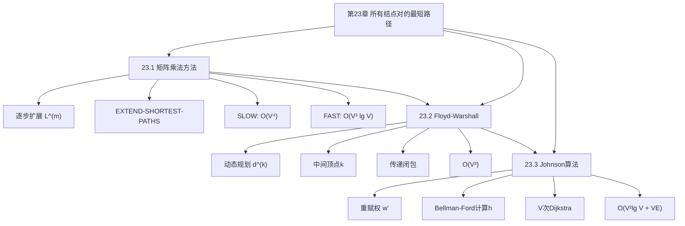

## 相关笔记

- 节笔记：[[23.1 最短路径与矩阵乘法]]、[[23.2 Floyd-Warshall算法]]、[[23.3 稀疏图的Johnson算法]]
- 前置章节：[[第22章_单源最短路径-章节汇总]]、[[第04章_分治策略-章节汇总]]

> [!abstract] 概览
> 全章围绕**所有结点对的最短路径**（All-Pairs Shortest Paths, APSP）问题展开。首先建立最短路径与矩阵乘法的联系，利用==逐步扩展==和==重复平方==策略得到 $O(V^3 \lg V)$ 的算法（23.1）；然后介绍经典的==Floyd-Warshall算法==，通过动态规划在 $O(V^3)$ 时间内求解（23.2）；最后针对稀疏图，==Johnson算法==通过==重赋权==技术将Bellman-Ford与Dijkstra结合，达到 $O(V^2 \lg V + VE)$ 的时间复杂度（23.3）。全章的核心主线是 **如何高效计算所有顶点对之间的最短路径**——三种算法分别适用于不同的图密度场景。

---

## 知识结构总览

---

## 核心概念回顾

### 三种算法对比

| 比较维度 | 矩阵乘法(FAST) | Floyd-Warshall | Johnson |
|:---------|:--------------|:---------------|:--------|
| **时间复杂度** | $O(V^3 \lg V)$ | $O(V^3)$ | $O(V^2 \lg V + VE)$ |
| **适用图** | 一般有向图 | 一般有向图 | 一般有向图 |
| **负权边** | ✅ 支持 | ✅ 支持 | ✅ 支持 |
| **负权环** | 不检测 | ✅ 可检测 | ✅ 可检测 |
| **核心思想** | 重复平方+矩阵乘法 | 动态规划(中间顶点) | 重赋权+V次Dijkstra |
| **稀疏图优势** | — | — | ✅ 显著优于FW |
| **稠密图优势** | — | ✅ 实现简单 | — |
| **空间** | $O(V^2)$ | $O(V^2)$ | $O(V^2)$ |

### 算法选型指南

> [!note] 根据图密度选择算法
> - **稠密图**（边数接近 $V^2$）：Floyd-Warshall，复杂度为 **V 的三次方**，实现简单
> - **稀疏图**（边数远小于 $V^2$）：Johnson，利用 Dijkstra 优势
> - **需要传递闭包**：Floyd-Warshall 的变体直接计算

### 核心递推关系

> [!def] 逐步扩展（23.1）
> $L^{(m)}_{ij} = \min(L^{(m-1)}_{ij}, \min_{1 \leq k \leq n}\{L^{(m-1)}_{ik} + w_{kj}\})$

> [!def] Floyd-Warshall（23.2）
> $d^{(k)}_{ij} = \min(d^{(k-1)}_{ij}, d^{(k-1)}_{ik} + d^{(k-1)}_{kj})$

> [!def] Johnson重赋权（23.3）
> $w'(u,v) = w(u,v) + h(u) - h(v)$，其中 $h(v) = \delta(s,v)$

---

## 跨章关联

### 与第22章（单源最短路径）的关系

| 第22章算法 | 第23章应用 |
|:-----------|:----------|
| Bellman-Ford | Johnson算法第一阶段：计算重赋权函数 $h(v)$ |
| Dijkstra | Johnson算法第二阶段：对每个顶点运行Dijkstra |
| 松弛操作 | 所有APSP算法的基础操作 |

### 与第4章（分治策略）的关系

- 矩阵乘法方法中的重复平方策略本质上是==分治思想==的应用
- Strassen矩阵乘法可进一步优化矩阵乘法方法的常数因子
- $O(V^3 \lg V)$ vs $O(V^{2.81} \lg V)$（Strassen优化）

### 与第21章（最小生成树）的关系

- MST的Prim算法与SSSP的Dijkstra算法结构相似（已在第22章讨论）
- APSP问题与MST问题都是图论中的经典"全局"优化问题

---

## 综合复习题

> [!faq]- 复习题 1：Floyd-Warshall算法为什么能在 O(V³) 时间内求解APSP？
> Floyd-Warshall的核心递推 $d^{(k)}_{ij} = \min(d^{(k-1)}_{ij}, d^{(k-1)}_{ik} + d^{(k-1)}_{kj})$ 的直觉是：$d^{(k)}_{ij}$ 表示从 $i$ 到 $j$ 且中间顶点只取自 $\{1, 2, \ldots, k\}$ 的最短路径。三重循环（$k$ 在最外层）对每个 $(i,j)$ 对尝试所有可能的中间顶点 $k$。每层循环处理 $V^2$ 个 $(i,j)$ 对，共 $V$ 层，因此总复杂度为 $O(V^3)$。

> [!faq]- 复习题 2：Johnson算法的重赋权为什么能保持最短路径？
> 设路径 $p = \langle v_0, v_1, \ldots, v_k \rangle$，则 $w'(p) = \sum_{i=0}^{k-1} w'(v_i, v_{i+1}) = \sum_{i=0}^{k-1} (w(v_i, v_{i+1}) + h(v_i) - h(v_{i+1}))$。这是一个望远镜求和，中间项全部抵消，最终 $w'(p) = w(p) + h(v_0) - h(v_k)$。因此，对于固定的起点 $u$ 和终点 $v$，所有从 $u$ 到 $v$ 的路径在 $w'$ 下的长度都等于在 $w$ 下的长度加上同一个常数 $h(u) - h(v)$。这意味着最小化 $w'(p)$ 等价于最小化 $w(p)$。

> [!faq]- 复习题 3：什么情况下应该选择Johnson而非Floyd-Warshall？
> 当图是稀疏图（$E = o(V^2)$）时，Johnson的 $O(V^2 \lg V + VE)$ 优于Floyd-Warshall的 $O(V^3)$。具体地，当 $E = O(V)$ 时，Johnson为 $O(V^2 \lg V)$，而Floyd-Warshall为 $O(V^3)$。当 $E = \Theta(V^2)$ 时，两者均为 $O(V^3)$，但Floyd-Warshall实现更简单，常数因子更小。

> [!faq]- 复习题 4：传递闭包与最短路径有什么关系？
> 传递闭包 $t_{ij}$ 表示是否存在从 $i$ 到 $j$ 的路径（0/1值）。将Floyd-Warshall中的 $\min$ 替换为逻辑或 $(\vee)$，加法替换为逻辑与 $(\wedge)$，即可在 $O(V^3)$ 时间内计算传递闭包。传递闭包是APSP的"布尔版本"。

---

## 常见误区

> [!warning] 误区1：Floyd-Warshall只能处理非负权图
> **正确理解**：Floyd-Warshall可以处理负权边（不像Dijkstra）。它还能检测负权环（检查 $d_{ii} < 0$）。只有当存在负权环时，某些顶点对的最短路径无定义。

> [!warning] 误区2：Johnson算法的时间复杂度总是优于Floyd-Warshall
> **正确理解**：仅在稀疏图上Johnson更优。在稠密图（$E = \Theta(V^2)$）上，两者均为 $O(V^3)$，且Floyd-Warshall的常数因子更小。

> [!warning] 误区3：矩阵乘法方法比Floyd-Warshall更好
> **正确理解**：FAST-ALL-PAIRS-SHORTEST-PATHS的 $O(V^3 \lg V)$ 比 Floyd-Warshall的 $O(V^3)$ 多了一个 $\lg V$ 因子。矩阵乘法方法的理论价值在于揭示了最短路径与矩阵乘法的联系，以及Strassen优化的可能性，但在实际应用中Floyd-Warshall更常用。

---

## 学习要点总结

| 学习目标 | 掌握程度 | 对应笔记 |
|:---------|:---------|:---------|
| 逐步扩展性质与EXTEND操作 | 掌握 | [[23.1 最短路径与矩阵乘法]] |
| 重复平方策略 | 掌握 | [[23.1 最短路径与矩阵乘法]] |
| Floyd-Warshall递推与正确性 | 熟练 | [[23.2 Floyd-Warshall算法]] |
| 传递闭包的计算 | 掌握 | [[23.2 Floyd-Warshall算法]] |
| Johnson重赋权技术 | 熟练 | [[23.3 稀疏图的Johnson算法]] |
| Johnson正确性证明 | 掌握 | [[23.3 稀疏图的Johnson算法]] |
| 三种算法的选型依据 | 熟练 | 全章 |

---

## 参见Wiki

> [!note] 概念页尚未创建
