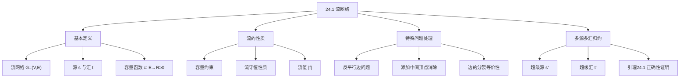

## 相关笔记

- 后续笔记：[[24.2 Ford-Fulkerson方法]]、[[24.3 最大二分匹配]]
- 前置笔记：[[第23章_所有结点对的最短路径-章节汇总]]、[[第20章_基本图算法-章节汇总]]
- 关联概念：[[算法导论/concepts/图的表示]]、[[算法导论/concepts/广度优先搜索]]、[[算法导论/concepts/Bellman-Ford算法]]

> [!abstract] 概览
> 本节介绍==流网络==（flow network）的形式化定义与基本性质，为后续的最大流算法奠定基础。流网络是一个==有向图== $G = (V, E)$，其中每条边关联一个非负的==容量==（capacity），图中指定一个==源==（source）$s$ 和一个==汇==（sink）$t$。==流==（flow）是边集上的一个函数，满足==容量约束==和==流守恒==（flow conservation）两个基本条件。本节还讨论了==反平行边==的处理方法和将==多源多汇==网络归约为==单源单汇==网络的技术。
>
> **要点列表：**
> - 流网络 $G = (V, E)$ 是一个==有向图==，每条边 $(u, v) \in E$ 有非负容量 $c(u, v) \geq 0$
> - 流 $f$ 满足两个约束：==容量约束== $0 \leq f(u, v) \leq c(u, v)$ 和==流守恒== $\sum_{v \in V} f(v, u) = \sum_{v \in V} f(u, v)$（对所有 $u \in V - \{s, t\}$）
> - ==流值== $|f| = \sum_{v \in V} f(s, v) - \sum_{v \in V} f(v, s)$，即从源流出的净流量
> - ==反平行边==（antiparallel edges）指同时存在 $(u, v)$ 和 $(v, u)$ 的边对，可通过添加中间顶点消除
> - 任何==多源多汇==网络都可以通过添加==超级源==和==超级汇==归约为单源单汇网络
> - 最大流问题的目标是找到流值最大的流 $f^*$

---

## 知识结构总览



---

## 核心思想

> [!tip] 核心思路
> 流网络的核心思想是将现实中的**流量传输问题**抽象为**图论模型**。想象一个城市的供水系统：水从水厂（源）出发，通过管道网络（有向边），每根管道有最大输水能力（容量），最终到达用户端（汇）。我们希望知道这个系统最多能同时输送多少水（最大流）。流必须满足两个基本约束：**任何管道中的流量不能超过其容量**（容量约束），**除源和汇外，任何节点的流入量等于流出量**（流守恒——水不会凭空产生或消失）。

### 流网络的形式化定义

> [!def] 流网络（Flow Network）
> 一个**流网络**是一个四元组 $G = (V, E, s, t, c)$，其中：
> - $V$ 是==顶点集==
> - $E$ 是==有向边集==，满足反对称性：若 $(u, v) \in E$，则 $(v, u) \notin E$
> - $s \in V$ 是==源==（source），$t \in V$ 是==汇==（sink），且 $s \neq t$
> - $c: E \to \mathbb{R}_{\geq 0}$ 是==容量函数==，为每条边赋予非负实数容量
>
> 假设对每个顶点 $v \in V$，都存在一条路径 $s \leadsto v \leadsto t$（即每个顶点都在从源到汇的某条路径上）。

> [!def] 流（Flow）
> 给定流网络 $G = (V, E)$，$G$ 中的一个**流**是一个函数 $f: V \times V \to \mathbb{R}$，满足以下两个性质：
>
> **1. 容量约束（Capacity Constraint）：**
> 对所有 $(u, v) \in E$，要求 $0 \leq f(u, v) \leq c(u, v)$。
> 若 $(u, v) \notin E$，则 $f(u, v) = 0$。
>
> **2. 流守恒（Flow Conservation）：**
> 对所有 $u \in V - \{s, t\}$，要求 $\displaystyle\sum_{v \in V} f(v, u) = \sum_{v \in V} f(u, v)$。
> 即除源和汇外，每个顶点的流入量等于流出量。

> [!def] 流值（Flow Value）
> 流 $f$ 的**值**定义为从源 $s$ 流出的净流量：
>
> $$|f| = \sum_{v \in V} f(s, v) - \sum_{v \in V} f(v, s)$$
>
> 即源的所有出边流量之和减去源的所有入边流量之和。==最大流问题==的目标是找到流值最大的流 $f^*$。

### 流守恒性质的证明

**命题：** 流守恒性质蕴含 $|f| = \sum_{v \in V} f(v, t) - \sum_{v \in V} f(t, v)$，即从源流出的净流量等于流入汇的净流量。

**证明：**

由流守恒，对任意 $u \in V - \{s, t\}$，有：

$$\sum_{v \in V} f(v, u) = \sum_{v \in V} f(u, v)$$

对所有 $u \in V - \{s, t\}$ 求和：

$$\sum_{u \in V - \{s, t\}} \sum_{v \in V} f(v, u) = \sum_{u \in V - \{s, t\}} \sum_{v \in V} f(u, v)$$

**【交换求和变量（$u$和$v$互换）】** 将左边的求和变量 $u$ 和 $v$ 交换（因为求和遍历所有顶点对），左边变为：

$$\sum_{v \in V} \sum_{u \in V - \{s, t\}} f(v, u)$$

这等价于对所有顶点 $v$，计算 $v$ 到所有非源非汇顶点 $u$ 的流量之和。因此：

$$\sum_{v \in V} \sum_{u \in V - \{s, t\}} f(v, u) = \sum_{v \in V} \sum_{u \in V - \{s, t\}} f(u, v)$$

**【分离$s$和$t$的项】** 将求和展开，把 $v = s$ 和 $v = t$ 的项分离出来：

$$\sum_{u \in V - \{s, t\}} f(s, u) + \sum_{u \in V - \{s, t\}} f(t, u) + \sum_{v \in V - \{s, t\}} \sum_{u \in V - \{s, t\}} f(v, u) = \sum_{u \in V - \{s, t\}} f(u, s) + \sum_{u \in V - \{s, t\}} f(u, t) + \sum_{v \in V - \{s, t\}} \sum_{u \in V - \{s, t\}} f(u, v)$$

**【消去相同双重求和项】** 注意到中间的双重求和项在等式两边完全相同，可以消去。整理得：

$$\sum_{u \in V - \{s, t\}} f(s, u) - \sum_{u \in V - \{s, t\}} f(u, s) = \sum_{u \in V - \{s, t\}} f(u, t) - \sum_{u \in V - \{s, t\}} f(t, u)$$

**【扩展求和范围（$f(s,s)=f(t,t)=0$）】** 由于 $(s, s) \notin E$ 且 $(t, t) \notin E$（流网络中不存在自环），所以 $f(s, s) = f(t, t) = 0$。因此可以将求和范围扩展到 $V$：

$$\sum_{v \in V} f(s, v) - \sum_{v \in V} f(v, s) = \sum_{v \in V} f(v, t) - \sum_{v \in V} f(t, v)$$

即 $|f| = \sum_{v \in V} f(v, t) - \sum_{v \in V} f(t, v)$。

**证毕。** 直观地说，从源流出的净流量一定等于流入汇的净流量——流在网络中既不会凭空产生也不会凭空消失。

### 反平行边问题

> [!def] 反平行边（Antiparallel Edges）
> 若流网络中同时存在边 $(u, v)$ 和 $(v, u)$，则称这两条边为==反平行边==。反平行边会导致流守恒约束出现歧义，因为无法仅通过 $f(u, v)$ 和 $f(v, u)$ 的值判断净流量方向。
>
> **消除方法：** 添加一个新的中间顶点 $w$，将 $(u, v)$ 替换为 $(u, w)$ 和 $(w, v)$，令 $c(u, w) = c(w, v) = c(u, v)$。这样反平行边就被消除了，且网络的流值不变。

### 反平行边消除的正确性

**命题：** 消除反平行边后得到的网络与原网络等价（最大流值相同）。

**证明：**

设原网络 $G$ 中存在反平行边 $(u, v)$ 和 $(v, u)$。我们选择其中一条边，比如 $(u, v)$，用新顶点 $w$ 替换：删除 $(u, v)$，添加 $(u, w)$ 和 $(w, v)$，令 $c(u, w) = c(w, v) = c(u, v)$。

对于 $G$ 中的任意流 $f$，构造 $G'$ 中的流 $f'$ 如下：
- 对所有 $(x, y) \neq (u, v)$，令 $f'(x, y) = f(x, y)$
- 令 $f'(u, w) = f(u, v)$，$f'(w, v) = f(u, v)$

验证 $f'$ 是 $G'$ 中的合法流：
1. **容量约束：** $f'(u, w) = f(u, v) \leq c(u, v) = c(u, w)$，$f'(w, v) = f(u, v) \leq c(u, v) = c(w, v)$，其余边不变。
2. **流守恒：** 新顶点 $w$ 的流入量 $f'(u, w) = f(u, v)$ 等于流出量 $f'(w, v) = f(u, v)$，满足流守恒。顶点 $u$ 和 $v$ 的净流量不变（原来 $u$ 通过 $(u, v)$ 流出 $f(u, v)$，现在通过 $(u, w)$ 流出相同的量）。

流值不变：$|f'| = |f|$。

反之，对于 $G'$ 中的任意流 $f'$，可以类似地构造 $G$ 中的流 $f$，令 $f(u, v) = f'(u, w) = f'(w, v)$。由于 $w$ 满足流守恒，$f'(u, w) = f'(w, v)$，所以 $f(u, v)$ 定义良好。

**证毕。**

### 多源多汇归约

> [!def] 多源多汇归约为单源单汇
> 给定一个包含源集合 $S$ 和汇集合 $T$ 的流网络，可以通过以下方式归约为单源单汇网络：
> 1. 添加一个==超级源== $s'$，对每个 $s_i \in S$，添加边 $(s', s_i)$，容量为 $\infty$
> 2. 添加一个==超级汇== $t'$，对每个 $t_j \in T$，添加边 $(t_j, t')$，容量为 $\infty$
> 3. 指定 $s'$ 为唯一的源，$t'$ 为唯一的汇

```
MULTI-SOURCE-MULTI-SINK(G, S, T)
1  创建超级源 s' 和超级汇 t'
2  V' = V ∪ {s', t'}
3  E' = E ∪ {(s', s_i) : s_i ∈ S} ∪ {(t_j, t') : t_j ∈ T}
4  对所有 s_i ∈ S: c(s', s_i) = ∞
5  对所有 t_j ∈ T: c(t_j, t') = ∞
6  return G' = (V', E', s', t', c)
```

### 引理24.1的完整证明

> [!def] 引理24.1（多源多汇归约的正确性）
> 设 $G = (V, E)$ 是一个源集合为 $S$、汇集合为 $T$ 的流网络，$G' = (V', E')$ 是通过添加超级源 $s'$ 和超级汇 $t'$ 得到的单源单汇网络。则 $G$ 中流值为 $v$ 的流与 $G'$ 中流值为 $v$ 的流之间存在一一对应关系。

**证明：**

**方向一：从 $G$ 的流构造 $G'$ 的流。**

设 $f$ 是 $G$ 中的一个流。构造 $G'$ 中的流 $f'$ 如下：

- 对所有 $(u, v) \in E$，令 $f'(u, v) = f(u, v)$
- 对所有 $s_i \in S$，令 $f'(s', s_i) = \sum_{v \in V} f(s_i, v) - \sum_{v \in V} f(v, s_i)$（即从 $s_i$ 流出的净流量）
- 对所有 $t_j \in T$，令 $f'(t_j, t') = \sum_{v \in V} f(v, t_j) - \sum_{v \in V} f(t_j, v)$（即流入 $t_j$ 的净流量）
- 对所有其他 $(u, v) \notin E' \cup \{(s', s_i), (t_j, t')\}$，令 $f'(u, v) = 0$

验证 $f'$ 是 $G'$ 中的合法流：

1. **容量约束：**
   - 对 $(u, v) \in E$：$f'(u, v) = f(u, v) \leq c(u, v) = c'(u, v)$
   - 对 $(s', s_i)$：$f'(s', s_i) = \sum_{v} f(s_i, v) - \sum_{v} f(v, s_i)$。由于 $s_i$ 在原网络中是源，在 $G$ 中不一定满足流守恒。但 $f'(s', s_i)$ 的值等于从 $s_i$ 流出的总流量减去流入 $s_i$ 的总流量，这是一个有限值，而 $c(s', s_i) = \infty$，所以 $f'(s', s_i) \leq \infty$ 成立。
   - 对 $(t_j, t')$：类似地，$f'(t_j, t') \leq \infty$ 成立。

2. **流守恒：**
   - 对 $u \in V - S - T$：$u$ 在 $G$ 中满足流守恒，在 $G'$ 中没有新增的边与 $u$ 关联（除了 $E$ 中的边），所以 $f'$ 在 $u$ 处也满足流守恒。
   - **【$s_i$的流守恒（超级源边补偿净流出量）】** 对 $s_i \in S$：在 $G'$ 中，$s_i$ 不再是源，需要满足流守恒。验证：
     $$\sum_{v \in V'} f'(v, s_i) = \sum_{v \in V} f(v, s_i) + f'(s', s_i) = \sum_{v \in V} f(v, s_i) + \left(\sum_{v \in V} f(s_i, v) - \sum_{v \in V} f(v, s_i)\right) = \sum_{v \in V} f(s_i, v) = \sum_{v \in V'} f'(s_i, v)$$
     流守恒成立。
   - 对 $t_j \in T$：类似地验证：
     $$\sum_{v \in V'} f'(v, t_j) = \sum_{v \in V} f(v, t_j) = \sum_{v \in V} f(t_j, v) + f'(t_j, t') = \sum_{v \in V'} f'(t_j, v)$$
     流守恒成立。
   - 对超级源 $s'$：$s'$ 是 $G'$ 的源，不需要满足流守恒。
   - 对超级汇 $t'$：$t'$ 是 $G'$ 的汇，不需要满足流守恒。

3. **流值：**
   $$|f'| = \sum_{v \in V'} f'(s', v) - \sum_{v \in V'} f'(v, s') = \sum_{s_i \in S} f'(s', s_i) - 0 = \sum_{s_i \in S} \left(\sum_{v \in V} f(s_i, v) - \sum_{v \in V} f(v, s_i)\right)$$

   这恰好等于所有源流出的净流量之和，即 $G$ 中流 $f$ 的总流值 $v$。

**方向二：从 $G'$ 的流构造 $G$ 的流。**

设 $f'$ 是 $G'$ 中的一个流。构造 $G$ 中的流 $f$ 如下：

- 对所有 $(u, v) \in E$，令 $f(u, v) = f'(u, v)$

验证 $f$ 是 $G$ 中的合法流：

1. **容量约束：** 对 $(u, v) \in E$，$f(u, v) = f'(u, v) \leq c'(u, v) = c(u, v)$。

2. **流守恒：** 对 $u \in V - S - T$，$u$ 在 $G'$ 中满足流守恒，且 $G'$ 中与 $u$ 关联的边就是 $G$ 中与 $u$ 关联的边（因为新增的边只与 $s'$、$t'$、$S$ 中顶点、$T$ 中顶点关联），所以 $f$ 在 $u$ 处也满足流守恒。

3. **【流值保持（$s_i$在$G'$中流守恒 $\Rightarrow f'(s',s_i)=s_i$的净流出量）】** 流值：$G$ 中流 $f$ 的总流值为 $\sum_{s_i \in S} \left(\sum_{v} f(s_i, v) - \sum_{v} f(v, s_i)\right)$。由于 $s_i$ 在 $G'$ 中满足流守恒，有 $\sum_{v} f'(v, s_i) = \sum_{v} f'(s_i, v)$，即 $f'(s', s_i) + \sum_{v \in V} f'(v, s_i) = \sum_{v \in V} f'(s_i, v)$。因此 $f'(s', s_i) = \sum_{v \in V} f'(s_i, v) - \sum_{v \in V} f'(v, s_i) = \sum_{v \in V} f(s_i, v) - \sum_{v \in V} f(v, s_i)$。

   所以 $G$ 中流的总流值 $= \sum_{s_i \in S} f'(s', s_i) = |f'|$。

**双向构造互逆，因此一一对应关系成立。**

**证毕。**

---

## 补充理解与拓展

> [!info] 网络流理论的历史渊源
>
> 网络流问题有着丰富的历史背景，其诞生直接源于冷战时期的军事战略需求：
>
> **1. 起源：苏联铁路网络研究（1955）**
> 1955年，美国空军研究人员 **T. E. Harris** 和退役将军 **F. S. Ross** 发表了一份（当时为机密的）研究报告，研究苏联与东欧卫星国之间的铁路网络。他们将铁路网络建模为一个包含 **44个顶点**（地理区域）和 **105条边**（铁路连线）的有向图，每条边的权重代表该铁路线的运输能力。他们需要回答两个核心问题：
> - 从苏联到东欧的==最大运输量==是多少？（最大流问题）
> - ==最小代价==切断哪些铁路线可以使运输完全中断？（最小割问题）
>
> 研究结果发现最大流值为 **163,000吨**，同时识别出网络中的"瓶颈"——容量之和恰好等于最大流值的边集。这一发现暗示了最大流与最小割之间的深刻联系。
>
> 来源：Harris, T. E. & Ross, F. S. (1955), *Fundamentals of a Method for Evaluating Rail Net Capacities*, RAND Corporation Research Memorandum RM-1573
>
> **2. 形式化：Ford-Fulkerson方法（1954-1956）**
> **L. R. Ford Jr.** 和 **D. R. Fulkerson** 在RAND公司工作期间，于1954年12月29日发表了内部研究报告（RM-1400），首次给出了求解最大流问题的系统方法——即著名的 ==Ford-Fulkerson方法==。1956年，他们在 *Canadian Journal of Mathematics* 上正式发表了论文 "Maximal Flow Through a Network"，其中提出了：
> - 流增广路径（augmenting path）的概念
> - 最大流最小割定理（Max-Flow Min-Cut Theorem）
> - 基于贪心增广的算法框架
>
> 来源：Ford, L. R. Jr. & Fulkerson, D. R. (1956), "Maximal Flow Through a Network", *Canadian Journal of Mathematics*, 8, 399-404
>
> **3. 后续发展**
> - 1970年，Dinic提出了 $O(V^2 E)$ 的算法
> - 1972年，Edmonds和Karp证明了使用BFS选择增广路径可使Ford-Fulkerson方法达到 $O(VE^2)$
> - 1986年，Goldberg和Tarjan提出了推-重标号（push-relabel）算法，目前实际性能最快的实现之一

> [!info] 网络流的实际应用场景
>
> 网络流算法在工程和科学中有广泛的应用，以下列举几个典型领域：
>
> **1. 交通网络优化**
> 在城市交通规划中，道路网络可以建模为流网络——路口是顶点，道路是有向边，道路的通行能力（如每小时可通过的车辆数）是容量。最大流算法帮助规划者确定路网的最大吞吐量，识别交通瓶颈，优化信号灯配时和道路扩建方案。
>
> **2. 电力分配**
> 电网中的输电线路有最大承载容量，发电站是源，用户端是汇。网络流模型可用于计算电网的最大输电能力，确保在高峰期不会出现过载，同时帮助规划电网扩容方案。
>
> **3. 计算机网络带宽分配**
> 在互联网中，路由器之间的链路有带宽限制。最大流算法可用于计算两个网络节点之间的最大可用带宽，优化数据包路由策略，实现负载均衡。软件定义网络（SDN）中广泛使用流网络模型进行流量工程。
>
> **4. 供应链物流**
> 在多工厂、多仓库的供应链中，工厂是源，仓库和零售商是汇，运输路线是边，运输能力是容量。多源多汇的最大流模型可直接用于优化物资调运计划，最大化从生产端到消费端的货物吞吐量。
>
> **5. 图像分割（计算机视觉）**
> 1989年，Greig、Porteous和Seheult首次将最大流/最小割定理应用于图像分割问题。将图像的每个像素建模为图的顶点，相邻像素之间的相似度作为边的权重，前景和背景分别对应源和汇。通过求解最大流（等价于最小割），可以将图像分割为前景和背景两个区域。Boykov和Kolmogorov（2004）提出的算法使图割方法成为计算机视觉中图像分割的标准技术之一。
>
> 来源：Greig, D. M., Porteous, B. T. & Seheult, A. H. (1989), "Exact Maximum A Posteriori Estimation for Binary Images", *Journal of the Royal Statistical Society, Series B*, 51(2), 271-279; Boykov, Y. & Kolmogorov, V. (2004), "An Experimental Comparison of Min-Cut/Max-Flow Algorithms for Energy Minimization in Vision", *IEEE PAMI*, 26(9), 1124-1137

---

## 易混淆点与辨析

> [!warning] 辨析：流（flow）vs 容量（capacity）
> **容量** $c(u, v)$ 是边 $(u, v)$ 的固有属性，表示该边能承载的==最大流量上限==，是网络结构的一部分，不随流的变化而改变。
>
> **流** $f(u, v)$ 是在网络上运行的==实际流量==，是问题的解，可以改变。流必须满足 $0 \leq f(u, v) \leq c(u, v)$。
>
> **类比：** 容量就像水管的粗细（固定属性），流就像水管中实际流过的水量（可变）。水管再粗，实际流过的水量也可能很少。
>
> **注意：** 当 $(u, v) \notin E$ 时，$c(u, v) = 0$，因此 $f(u, v) = 0$。但流函数 $f$ 定义在 $V \times V$ 上，对不在 $E$ 中的边对，流值恒为0。

> [!warning] 辨析：反平行边（antiparallel edges）vs 平行边（parallel edges）
> **反平行边**指同时存在 $(u, v)$ 和 $(v, u)$ 两条方向相反的边。反平行边在流网络中会导致问题，因为流守恒约束 $\sum f(v, u) = \sum f(u, v)$ 无法区分 $f(u, v)$ 和 $f(v, u)$ 各自的值。解决方案是添加中间顶点。
>
> **平行边**指同时存在多条从 $u$ 到 $v$ 的同方向边，即多条 $(u, v)$ 边。平行边本身不违反流网络的定义（每条边有独立的容量），但通常可以通过将多条平行边合并为一条（容量为各边容量之和）来简化网络。
>
> **关键区别：** 反平行边是方向相反的边对，平行边是方向相同的边集。

> [!warning] 辨析：多源多汇 vs 单源单汇
> **多源多汇网络**中存在多个源 $S = \{s_1, s_2, \ldots\}$ 和多个汇 $T = \{t_1, t_2, \ldots\}$，流可以从任意源出发，到达任意汇。流守恒条件对所有非源非汇顶点成立。
>
> **单源单汇网络**中只有一个源 $s$ 和一个汇 $t$，这是最大流算法的标准输入形式。
>
> **归约关系：** 任何多源多汇网络都可以通过添加超级源 $s'$（连接到所有原源，容量为 $\infty$）和超级汇 $t'$（所有原汇连接到它，容量为 $\infty$）转化为等价的单源单汇网络。归约保持最大流值不变（引理24.1）。
>
> **注意：** 归约后，原网络中的源和汇在 $G'$ 中变为普通顶点，必须满足流守恒。超级源和超级汇的引入保证了这一性质。

---

## 习题精选

| 题号 | 题目描述 | 难度 |
|:---:|----------|:---:|
| 24.1-1 | 证明将一条边分裂为两条边（经过中间顶点）得到等价网络 | ⭐⭐ |
| 24.1-2 | 证明反平行边可以通过添加中间顶点消除 | ⭐⭐ |
| 24.1-3 | 证明流守恒性质蕴含 $|f|$ 等于流入汇的净流量 | ⭐⭐ |
| 24.1-4 | 证明引理24.1（多源多汇归约的正确性） | ⭐⭐⭐ |
| 24.1-5 | 将给定的多源多汇网络扩展为单源单汇网络 | ⭐ |

> [!faq]- 24.1-1 解答
> **题目：** 证明将一条边 $(u, v)$ 分裂为两条边 $(u, x)$ 和 $(x, v)$（其中 $x$ 是新顶点，$c(u, x) = c(x, v) = c(u, v)$）得到等价网络。
>
> **证明：**
>
> 设原网络 $G = (V, E)$ 包含边 $(u, v)$，分裂后得到 $G' = (V \cup \{x\}, (E - \{(u, v)\}) \cup \{(u, x), (x, v)\})$。
>
> **从 $G$ 的流构造 $G'$ 的流：** 设 $f$ 是 $G$ 中的流。定义 $f'$ 如下：
> - 对所有 $(a, b) \neq (u, v)$，$f'(a, b) = f(a, b)$
> - $f'(u, x) = f(u, v)$，$f'(x, v) = f(u, v)$
>
> 验证：
> - **容量约束：** $f'(u, x) = f(u, v) \leq c(u, v) = c(u, x)$，$f'(x, v) = f(u, v) \leq c(u, v) = c(x, v)$。
> - **流守恒：** 新顶点 $x$ 的流入量 $f'(u, x) = f(u, v)$ 等于流出量 $f'(x, v) = f(u, v)$。顶点 $u$ 和 $v$ 的净流量不变。
> - **流值不变：** $|f'| = |f|$。
>
> **从 $G'$ 的流构造 $G$ 的流：** 设 $f'$ 是 $G'$ 中的流。定义 $f$ 如下：
> - 对所有 $(a, b) \neq (u, v)$，$f(a, b) = f'(a, b)$
> - $f(u, v) = f'(u, x) = f'(x, v)$（由 $x$ 的流守恒，$f'(u, x) = f'(x, v)$）
>
> 验证类似。因此 $G$ 和 $G'$ 的最大流值相同。
>
> 参考：https://walkccc.me/CLRS/Chap26/26.1/#261-1

> [!faq]- 24.1-2 解答
> **题目：** 证明反平行边可以通过添加中间顶点消除。
>
> **证明：**
>
> 设流网络 $G$ 中存在反平行边 $(u, v)$ 和 $(v, u)$。添加新顶点 $w$，将 $(u, v)$ 替换为 $(u, w)$ 和 $(w, v)$，令 $c(u, w) = c(w, v) = c(u, v)$。得到新网络 $G'$。
>
> $G'$ 中不再存在反平行边：原来与 $(u, v)$ 反平行的 $(v, u)$ 仍然存在，但 $(u, w)$ 和 $(w, v)$ 的反平行边分别是 $(w, u)$ 和 $(v, w)$，这两条边都不在 $E'$ 中。
>
> 等价性证明与24.1-1完全类似（因为消除反平行边的操作本质上就是边的分裂）：
> - $G$ 中流 $f$ 对应 $G'$ 中流 $f'$，其中 $f'(u, w) = f'(w, v) = f(u, v)$，其余不变
> - $G'$ 中流 $f'$ 对应 $G$ 中流 $f$，其中 $f(u, v) = f'(u, w) = f'(w, v)$（由 $w$ 的流守恒保证相等）
> - 流值不变
>
> **证毕。** 注意：如果网络中有多对反平行边，每对需要添加不同的中间顶点。

> [!faq]- 24.1-3 解答
> **题目：** 证明流守恒性质蕴含 $|f| = \sum_{v \in V} f(v, t) - \sum_{v \in V} f(t, v)$。
>
> **证明：**
>
> 由流守恒，对所有 $u \in V - \{s, t\}$：
>
> $$\sum_{v \in V} f(v, u) = \sum_{v \in V} f(u, v)$$
>
> 对所有 $u \in V - \{s, t\}$ 求和：
>
> $$\sum_{u \in V - \{s, t\}} \sum_{v \in V} f(v, u) = \sum_{u \in V - \{s, t\}} \sum_{v \in V} f(u, v)$$
>
> 交换左边的求和变量 $u$ 和 $v$：
>
> $$\sum_{v \in V} \sum_{u \in V - \{s, t\}} f(v, u) = \sum_{u \in V - \{s, t\}} \sum_{v \in V} f(u, v)$$
>
> 将 $v = s$ 和 $v = t$ 的项分离：
>
> $$\sum_{u \in V - \{s, t\}} f(s, u) + \sum_{u \in V - \{s, t\}} f(t, u) + \sum_{v \in V - \{s, t\}} \sum_{u \in V - \{s, t\}} f(v, u) = \sum_{u \in V - \{s, t\}} f(u, s) + \sum_{u \in V - \{s, t\}} f(u, t) + \sum_{v \in V - \{s, t\}} \sum_{u \in V - \{s, t\}} f(u, v)$$
>
> 消去两边相同的双重求和项，整理得：
>
> $$\sum_{u \in V - \{s, t\}} f(s, u) - \sum_{u \in V - \{s, t\}} f(u, s) = \sum_{u \in V - \{s, t\}} f(u, t) - \sum_{u \in V - \{s, t\}} f(t, u)$$
>
> 由于 $f(s, s) = f(t, t) = 0$，扩展求和范围到 $V$：
>
> $$\sum_{v \in V} f(s, v) - \sum_{v \in V} f(v, s) = \sum_{v \in V} f(v, t) - \sum_{v \in V} f(t, v)$$
>
> 即 $|f| = \sum_{v \in V} f(v, t) - \sum_{v \in V} f(t, v)$。
>
> **证毕。**

> [!faq]- 24.1-4 解答
> **题目：** 证明引理24.1（多源多汇归约的正确性）。
>
> **证明：** 见"二、核心思想"中引理24.1的完整证明。此处给出证明的核心思路概要：
>
> 1. **$G \to G'$：** 将 $G$ 中的流 $f$ 扩展为 $G'$ 中的流 $f'$，在超级源到各原源的边上设置流量等于该原源的净流出量，在各原汇到超级汇的边上设置流量等于该原汇的净流入量。验证容量约束和流守恒。
> 2. **$G' \to G$：** 将 $G'$ 中的流 $f'$ 限制到 $E$ 上得到 $G$ 中的流 $f$。利用 $G'$ 中原源和原汇的流守恒性质，验证 $f$ 在 $G$ 中满足流守恒。
> 3. **流值保持：** $|f'| = \sum_{s_i \in S} f'(s', s_i) = \sum_{s_i \in S}$（$s_i$ 的净流出量）$= |f|$。
> 4. **一一对应：** 两个方向的构造互逆。
>
> 参考：https://walkccc.me/CLRS/Chap26/26.1/#261-2

> [!faq]- 24.1-5 解答
> **题目：** 将给定的多源多汇网络扩展为单源单汇网络。
>
> **解法：**
>
> 给定多源多汇网络 $G = (V, E)$，源集合 $S = \{s_1, s_2, \ldots, s_k\}$，汇集合 $T = \{t_1, t_2, \ldots, t_l\}$。
>
> 构造步骤：
> 1. 添加超级源 $s'$ 和超级汇 $t'$
> 2. 对每个 $s_i \in S$，添加边 $(s', s_i)$，容量 $c(s', s_i) = \infty$
> 3. 对每个 $t_j \in T$，添加边 $(t_j, t')$，容量 $c(t_j, t') = \infty$
> 4. 新网络 $G' = (V \cup \{s', t'\}, E \cup \{(s', s_i)\}_{s_i \in S} \cup \{(t_j, t')\}_{t_j \in T})$
>
> **直观理解：** 超级源 $s'$ 像一个"总水厂"，通过无限容量的管道向各个"分水厂"（原源）供水；超级汇 $t'$ 像一个"总用户端"，通过无限容量的管道接收来自各个"分用户端"（原汇）的水。由于连接管道容量为无穷大，不会成为瓶颈，因此最大流值完全由原网络决定。

---

## 视频学习指南

| 资源 | 主题 | 链接 | 说明 |
|:-----|:-----|:-----|:-----|
| MIT 6.006 Lecture 13 | Graph Search, BFS, DFS | https://www.youtube.com/watch?v=s-CYnVzZuhc | 图搜索基础，为流网络做铺垫 |
| MIT 6.006 Lecture 15 | Network Flow | https://www.youtube.com/watch?v=-S3L_3dcmnQ | 流网络与最大流问题入门 |
| Abdul Bari | 3.5 Max Flow Min Cut | https://www.youtube.com/watch?v=LdOnanfc5TM | 直观的流网络讲解，含实例 |
| WilliamFiset | Max Flow Ford Fulkerson | https://www.youtube.com/watch?v=Tl90tNtKvxs | 系列教程，从基础概念讲起 |
| NeetCode | Network Flow Intro | https://www.youtube.com/watch?v=GiN3jRdgxU4 | 竞赛编程视角的网络流 |

---

## 教材原文

> [!quote] CLRS 第4版 26.1节原文
> A **flow network** is a tuple $G = (V, E, s, t, c)$, where $V$ is a set of **vertices**, $E$ is a set of **edges**, $s \in V$ is the **source** vertex, $t \in V$ is the **sink** vertex, and $c$ is a **capacity function** that maps each edge $(u, v) \in E$ to a nonnegative real number $c(u, v) \geq 0$. We require that if $(u, v) \in E$, then $(v, u) \notin E$. We assume that for every vertex $v \in V$, there is a path from $s$ to $v$ to $t$.
>
> A **flow** in $G$ is a real-valued function $f: V \times V \to \mathbb{R}$ that satisfies two properties:
>
> **Capacity constraint:** For all $(u, v) \in E$, we require $0 \leq f(u, v) \leq c(u, v)$.
>
> **Flow conservation:** For all $u \in V - \{s, t\}$, we require $\sum_{v \in V} f(v, u) = \sum_{v \in V} f(u, v)$.
>
> The **value** of a flow $f$ is defined as $|f| = \sum_{v \in V} f(s, v) - \sum_{v \in V} f(v, s)$, which is the net flow out of the source. In the **maximum-flow problem**, we wish to find a flow of maximum value.

---

## 参见Wiki

- [[算法导论/concepts/流网络]] — 流网络定义与基本性质

#学习/算法导论/第24章-最大流 #学习/算法导论/最大流/流网络
