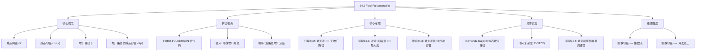
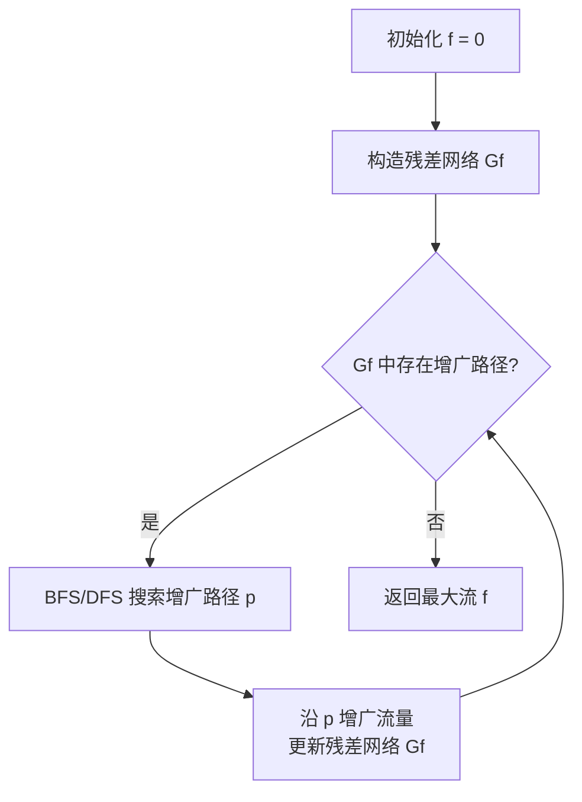

## 相关笔记

- 前置笔记：[[24.1 流网络]]
- 后续笔记：[[24.3 最大二分匹配]]
- 关联概念：[[20.2 广度优先搜索]]、[[20.3 深度优先搜索]]、[[22.1 Bellman-Ford算法]]
- 章节汇总：[[第24章_最大流-章节汇总]]

> [!abstract] 概览
> 本节介绍 ==Ford-Fulkerson方法==，这是求解==最大流问题==的经典框架。其核心思想是反复在==残差网络==中寻找==增广路径==来增大流量，直到无法再增大为止。本节还给出了==最大流最小割定理==——网络流理论的基石之一，证明了最大流的值恰好等于最小割的容量。在此基础上，本节介绍了 ==Edmonds-Karp算法==，通过使用BFS选择最短增广路径，将时间复杂度改进到 ==O(VE^2)==。
>
> **要点列表：**
> - ==残差网络==记录了当前流还能在哪些边上增加或减少流量
> - ==增广路径==是残差网络中从源s到汇t的简单路径，其残差容量决定了本次能增加的流量
> - Ford-Fulkerson方法是一个框架，增广路径的选择策略决定了具体算法的效率
> - ==最大流最小割定理==：最大流的值等于最小割的容量，这是网络流理论的核心定理
> - ==Edmonds-Karp算法==通过BFS选择最短增广路径，保证O(VE^2)的多项式时间复杂度
> - 当所有容量为整数时，Ford-Fulkerson方法一定终止，且产生整数流

---

## 知识结构总览



---

## 核心思想

> [!tip] 核心思路
> Ford-Fulkerson方法的核心策略是**贪心地反复增广**：
> 1. 从一个零流开始（所有边的流量为0）
> 2. 在当前流的==残差网络==中寻找一条从源s到汇t的==增广路径==
> 3. 沿这条路径尽可能多地增加流量（受限于路径上的最小残差容量）
> 4. 更新残差网络，重复步骤2-3
> 5. 当残差网络中不再存在增广路径时，当前流即为最大流
>
> 这个过程就像不断在管道网络中寻找还能输送更多水的路线，直到再也找不到新的路线为止。每找到一条路线，就沿该路线尽可能多地增加流量。

### 残差网络

> [!def] 残差网络 Gf
> 给定流网络G=(V,E)，容量函数c，以及一个流f，==残差网络== Gf=(V,Ef) 定义如下：
>
> - **残差容量**：对于每条边(u,v)属于E，残差容量 cf(u,v) = c(u,v) - f(u,v)，表示该边还能增加多少流量
> - **反向残差容量**：对于每条有流量的边(u,v)，反向边(v,u)的残差容量 cf(v,u) = f(u,v)，表示该边可以"撤销"多少流量
> - **残差边集合** Ef 包含所有残差容量大于0的边，即 Ef = {(u,v)属于VxV : cf(u,v) > 0}
>
> **直观理解：** 残差网络就像一张"还能怎么调整流量"的地图。正向边表示还能增加流量，反向边表示可以减少（撤销）之前分配的流量。反向边的存在是关键——它允许算法"纠正"之前不够优的流量分配。

### 增广路径

> [!def] 增广路径
> 在残差网络Gf中，一条从源s到汇t的==简单路径==p称为==增广路径==。
>
> - 增广路径的==残差容量== cf(p) 定义为路径上所有边残差容量的最小值：cf(p) = min{cf(u,v) : (u,v)在p上}
> - 沿增广路径p增广流量f，得到新流 f'，其中：
>   - 对于p上的每条正向边(u,v)：f'(u,v) = f(u,v) + cf(p)
>   - 对于p上的每条反向边(u,v)：f'(u,v) = f(u,v) - cf(p)
>   - 不在p上的边：f'(u,v) = f(u,v)
>
> **增广的效果：** 沿增广路径增广后，流的值恰好增加 cf(p)。可以验证增广后的f'仍然是合法流（满足容量约束和流守恒）。

### FORD-FULKERSON 伪代码

> [!tip] 算法执行流程
> 1. **初始化**流 f 为零流（所有边流量为0）
> 2. **构造残差网络** Gf（正向边容量为剩余容量，反向边容量为当前流量）
> 3. 在 Gf 中**搜索增广路径** p（从源 s 到汇 t 的路径）
> 4. 若找到 p：沿 p **增广流量**（增加量 = 路径上最小残差容量）→ **更新残差网络** → 回到步骤3
> 5. 若找不到 p：f 即为**最大流**，返回 f



```
FORD-FULKERSON(G, s, t)
1  for each edge (u, v) ∈ G.E
2      (u, v).f = 0
3  while there exists an augmenting path p in the residual network Gf
4      cf(p) = min{cf(u, v) : (u, v) is on path p}
5      for each edge (u, v) on path p
6          if (u, v) ∈ G.E        // 正向边
7              (u, v).f = (u, v).f + cf(p)
8          else                    // 反向边
9              (v, u).f = (v, u).f - cf(p)
10 return f
```

**关键观察：** Ford-Fulkerson方法本身是一个**框架**而非具体算法——第3行"寻找增广路径"的策略未指定。不同的选择策略产生不同的算法：
- DFS选择（朴素Ford-Fulkerson）：可能不终止，时间复杂度无多项式保证
- BFS选择（Edmonds-Karp）：O(VE^2)，保证多项式时间
- 最大容量增广路径：O(E^2 lg C)，其中C为最大容量

### 最大流最小割定理

> [!def] 最大流最小割定理（定理24.2）
> 设f是流网络G=(V,E)中的一个流，该网络的源为s，汇为t，容量函数为c。
>
> **以下三个条件等价：**
> 1. f是G的一个==最大流==
> 2. 残差网络Gf中==不包含任何增广路径==
> 3. 对G的某个割(S,T)，有 ==|f| = c(S,T)==
>
> 进一步地，==最大流的值等于最小割的容量==（推论24.3）。

**证明通过以下三个引理完成：**

> [!def] 引理24.2：f是最大流 ⟺ Gf中不含增广路径
> **证明（⇒方向）：** 假设f是最大流，但Gf中存在增广路径p。沿p增广cf(p)单位流量后得到流f'，且 |f'| = |f| + cf(p) > |f|（因为cf(p) > 0）。这与f是最大流矛盾。因此Gf中不含增广路径。
>
> **证明（⇐方向）：** 假设Gf中不含增广路径。**【构造割（$S$=Gf中$s$可达的顶点集）】** 令S为Gf中从s可达的所有顶点集合，T = V - S。显然s属于S，t属于T（否则t在Gf中从s可达，存在增广路径）。**【正向边饱和（$u \in S, v \in T \Rightarrow cf(u,v)=0 \Rightarrow f=c$）】** 对于任意u属于S、v属于T，(u,v)不属于Ef（否则v在Gf中从s可达，应在S中），因此 cf(u,v) = 0，即 f(u,v) = c(u,v)。同时，对于任意v属于S、u属于T，(v,u)属于Ef意味着v从s可达，但u不在S中，所以(v,u)不属于Ef，即 f(v,u) = 0。**【净流=割容量（$f(S,T)=c(S,T)$）】** 因此割(S,T)的净流为 f(S,T) = c(S,T)。由引理24.3，f是最大流。

> [!def] 引理24.3：流的值等于某割的容量 ⟺ 流是最大流
> **证明（⇒方向）：** 设f是G中的一个流，(S,T)是G的一个割。**【流值不超过割容量（$|f|=f(S,T)\leq c(S,T)$）】** 由流的性质，对任意流f和任意割(S,T)，有 |f| = f(S,T) ≤ c(S,T)。**【所有割中取最小 $\Rightarrow$ 最大流】** 如果 |f| = c(S,T)，则对任意割(S',T')，有 |f| ≤ c(S',T')。因此f的值不大于任何割的容量，f是最大流。
>
> **证明（⇐方向）：** 如果f是最大流，由引理24.2，Gf中不含增广路径。按照引理24.2⇐方向的构造，可以得到一个割(S,T)使得 |f| = c(S,T)。

> [!def] 推论24.3：最大流值 = 最小割容量
> **证明：** 设f*是最大流，(S*,T*)是最小割。**【最大流达到某割容量（引理24.3）】** 由引理24.3的⇒方向，|f*| = c(S*,T*)。**【任意流不超过任意割容量 $\Rightarrow |f^*|\leq c(S^*,T^*)$】** 又因为对任意流f和任意割(S,T)，有 |f| ≤ c(S,T)，所以 |f*| ≤ c(S*,T*)。**【等式夹逼】** 两者结合得 |f*| = c(S*,T*)。
>
> **直观理解：** 最大流和最小割是同一个问题的两面——从源到汇能输送的最大水量，恰好等于切断所有从源到汇路径所需的最小"管道容量"。

### Edmonds-Karp算法

> [!def] Edmonds-Karp算法
> ==Edmonds-Karp算法==是Ford-Fulkerson方法的一个具体实现，其核心改进是：**在每次迭代中，使用BFS在残差网络中选择==最短==（边数最少）的增广路径**。
>
> **时间复杂度：** ==O(VE^2)==
>
> **算法步骤：** 与FORD-FULKERSON伪代码相同，但第3行使用BFS（而非DFS或其他方法）来寻找增广路径。

> [!def] 引理24.4：最短增广路径的边数单调递增
> 在Edmonds-Karp算法的执行过程中，每次找到的增广路径的长度（边数）是==单调递增==的。
>
> **证明思路：**
> 设第i次增广使用的路径pi的长度为li，第i+1次增广使用的路径pi+1的长度为li+1。需要证明 li+1 ≥ li。
>
> 1. 增广路径pi将残差网络中的边分为两类：**关键边**（残差容量等于cf(pi)的边，增广后饱和消失）和**非关键边**（增广后仍存在于残差网络中）
> 2. 对于任意顶点v，定义其**级别**为BFS树中从s到v的最短距离
> 3. 增广后，关键边(u,v)从残差网络中消失，但其反向边(v,u)被加入残差网络
> 4. **【反向边级别差为1（$(v,u)$从高级别指向低级别）】** 关键观察：反向边(v,u)连接的是级别差为1的相邻顶点，且方向是从高级别指向低级别
> 5. **【最短距离单调不减】** 因此，增广后从s到任何顶点的最短距离不会减小
> 6. 特别地，从s到t的最短距离不会减小，即 li+1 ≥ li
>
> **推论：** 每条边最多成为O(V)次关键边（因为每次成为关键边后，其端点的级别差至少增加2，而级别最大为V-1）。因此总增广次数为O(VE)，每次BFS耗时O(E)，总时间为O(VE^2)。

### 整数流性质

> [!def] 整数流性质
> 如果流网络G的所有边容量都是==整数==，则Ford-Fulkerson方法：
> 1. **一定终止**（不会无限循环）
> 2. 产生的流f是==整数流==（每条边的流量都是整数）
> 3. 最大流的值也是整数
>
> **证明思路：** 初始时所有流量为0（整数）。每次增广时，cf(p)是整数残差容量的最小值，因此也是整数。增广后每条边的流量变化量为整数加减整数，仍为整数。每次增广使流值至少增加1，而流值有上界（不超过任何割的容量），因此算法最多增广有限次后必然终止。

---

## 补充理解与拓展

> [!info] Edmonds-Karp的历史背景
>
> 1972年，Jack Edmonds和Richard M. Karp发表了论文"Theoretical Improvements in Algorithmic Efficiency for Network Flow Problems"，发表在Journal of the ACM上。这篇论文的核心贡献是证明了：只要在Ford-Fulkerson框架中用BFS选择最短增广路径，就能获得O(VE^2)的多项式时间复杂度。这一结果的意义在于——朴素Ford-Fulkerson方法在选择不当的增广路径时可能不终止（如容量为无理数时），或者即使终止也需要指数时间。Edmonds-Karp的工作首次为最大流问题给出了一个概念简洁且多项式时间的算法。
>
> 值得注意的是，同一篇论文中也引用了Dinic在1970年独立发现的O(V^2 E)算法，说明在1970年代初期，最大流算法经历了快速的理论突破。
>
> 来源：Edmonds, J. & Karp, R.M. (1972), "Theoretical improvements in algorithmic efficiency for network flow problems", Journal of the ACM, 19(2), pp.248-264

> [!info] Dinic算法——O(V^2 E)的最大流算法
>
> ==Dinic算法==（又称Dinitz算法）由Yefim Dinitz于1970年提出，时间复杂度为 ==O(V^2 E)==，比Edmonds-Karp的O(VE^2)更优（尤其在稠密图中）。
>
> **核心思想：** Dinic算法将增广过程分为多个"阶段"（phase），每个阶段内：
> 1. 使用BFS构建==分层网络==（level graph）：只保留从s到t的最短路径上的边
> 2. 在分层网络中使用DFS寻找==阻塞流==（blocking flow）：一组增广路径，使得分层网络中不再存在从s到t的路径
> 3. 阻塞流找到后，进入下一个阶段，重新构建分层网络
>
> **关键性质：** 分层网络的层数（从s到t的最短距离）在每个阶段严格递增，因此最多有O(V)个阶段。每个阶段找阻塞流耗时O(VE)，总时间为O(V^2 E)。
>
> 来源：Dinitz, Y. (1970), "Algorithm for solution of a problem of maximum flow in networks with power estimation", Soviet Mathematics Doklady, 11, pp.1277-1280

> [!info] 推送-重贴标签算法——O(V^3)的最大流算法
>
> ==推送-重贴标签算法==（Push-Relabel Algorithm）由Andrew V. Goldberg和Robert E. Tarjan于1986年提出，是最大流问题的一个重要算法族。其基本版本的时间复杂度为 ==O(V^3)==，使用FIFO队列的改进版本可达 ==O(V^2 sqrt(E))==。
>
> **核心思想：** 与Ford-Fulkerson方法（维护合法流，逐步增大）不同，推送-重贴标签算法维护一个==预流==（preflow）——允许顶点"囤积"流量（即流入量可以超过流出量）。算法通过两种操作逐步将预流转化为合法流：
> 1. **推送（Push）：** 当一个顶点的"溢出"（excess）大于0，且存在高度差为1的邻居时，将溢出流量推送到邻居
> 2. **重贴标签（Relabel）：** 当一个溢出顶点无法推送流量到任何邻居时，增加该顶点的高度
>
> **直观理解：** 想象水从源s注入网络，水会自然地从高处流向低处。推送操作模拟水的自然流动，重贴标签操作则相当于"抬高"某个积水点，让水能继续流向汇t。
>
> 来源：Goldberg, A.V. & Tarjan, R.E. (1986), "A new approach to the maximum-flow problem", Proceedings of the 18th Annual ACM Symposium on Theory of Computing (STOC), pp.136-146

> [!info] 最大流的实际应用
>
> 最大流问题在现实世界中有广泛的应用：
>
> **1. 图像分割（Graph Cut）**
> 将图像分割问题建模为最大流/最小割问题。每个像素对应图中的一个顶点，相邻像素之间有边（权重反映颜色相似度），源和汇分别代表"前景"和"背景"。最小割将图像分为前景和背景两部分。Boykov和Kolmogorov在2004年提出的算法是计算机视觉中广泛使用的图像分割工具。
>
> **2. 棒球淘汰判定（Baseball Elimination）**
> 判断一支棒球队是否已被数学淘汰（无法获得赛区冠军）。将剩余比赛建模为流网络中的边，如果最大流无法为某支球队分配足够的胜利，则该队被淘汰。Wayne Winston在1996年用此方法证明了某些球队在赛季中段就已被数学淘汰。
>
> **3. 项目选择问题（Project Selection）**
> 给定一组项目和它们之间的依赖关系，每个项目有利润或成本，选择一个互相兼容的项目子集使总利润最大。通过最小割可以高效求解。
>
> 来源：Boykov, Y. & Kolmogorov, V. (2004), "An experimental comparison of min-cut/max-flow algorithms for energy minimization in vision", IEEE TPAMI; Kleinberg, J. & Tardos, E. (2005), Algorithm Design, Chapter 7

---

## 易混淆点与辨析

> [!warning] Ford-Fulkerson方法 vs Edmonds-Karp算法
> **Ford-Fulkerson方法**是一个算法框架，只规定了"反复寻找增广路径并增广"的大方向，但**没有规定如何选择增广路径**。选择DFS可能导致不终止或指数时间。
>
> **Edmonds-Karp算法**是Ford-Fulkerson方法的一个具体实现，**明确规定使用BFS选择最短增广路径**。这一看似简单的改动带来了本质性的改进：保证O(VE^2)的多项式时间。
>
> **类比：** Ford-Fulkerson方法像说"不断找路走就能到达目的地"，Edmonds-Karp算法则说"每次都走最短的路"。后者不仅更快，而且保证一定能到达。

> [!warning] 增广路径 vs 最短增广路径
> **增广路径**是残差网络中从s到t的任意简单路径，只要残差容量大于0即可。Ford-Fulkerson方法允许选择任意增广路径。
>
> **最短增广路径**是所有增广路径中边数最少的那条（可能有多个）。Edmonds-Karp算法每次都选择最短增广路径。选择最短路径的关键好处是：路径长度单调递增，每条边最多成为O(V)次关键边，从而保证了多项式时间复杂度。

> [!warning] 最大流 vs 最小割
> **最大流**是流网络中从源s到汇t能输送的最大流量值，是一个**优化问题**的解。
>
> **最小割**是将顶点集V划分为(S,T)使得s属于S、t属于T，且割的容量c(S,T)最小的划分，也是一个**优化问题**的解。
>
> **最大流最小割定理**表明这两个看似不同的问题的解值相等。但它们回答的是不同的问题：最大流告诉你"最多能输送多少"，最小割告诉你"最薄弱的环节在哪里"。在实际应用中，最小割往往更有意义——它指出了网络的"瓶颈"。

---

## 习题精选

| 题号 | 题目描述 | 难度 |
|:---:|----------|:---:|
| 24.2-1 | 证明等式(26.6)的求和等于等式(26.7)的求和 | ⭐⭐ |
| 24.2-2 | 在图26.1(b)中，求割({s,v2,v4},{v1,v3,t})的流值和容量 | ⭐ |
| 24.2-3 | 展示Edmonds-Karp算法在图26.1(a)流网络上的执行过程 | ⭐⭐ |
| 24.2-4 | 在图26.6的例子中，找出对应最大流的最小割，并指出哪条增广路径取消了流量 | ⭐⭐ |
| 24.2-5 | 证明：将多源多汇网络转换为单源单汇网络后，任何流都有有限值 | ⭐⭐ |
| 24.2-6 | 将带流量约束的多源多汇网络转换为标准最大流问题 | ⭐⭐⭐ |

> [!faq]- 24.2-2 解答
> **目标：** 求割(S,T) = ({s,v2,v4}, {v1,v3,t})的流值和容量。
>
> **割的流值：**
> f(S,T) = f(s,v1) + f(v2,v1) + f(v4,v3) + f(v4,t) - f(v3,v2)
> = 11 + 1 + 7 + 4 - 4 = **19**
>
> **割的容量：**
> c(S,T) = c(s,v1) + c(v2,v1) + c(v4,v3) + c(v4,t)
> = 16 + 4 + 7 + 4 = **31**
>
> 注意：流值19等于最大流的值（符合最大流最小割定理），而割的容量31大于流值（因为这不是最小割）。

> [!faq]- 24.2-3 解答
> **目标：** 展示Edmonds-Karp算法在图26.1(a)上的执行过程。
>
> 按照BFS在顶点顺序{s, v1, v2, v3, v4, t}下的执行：
>
> **第1次增广：** BFS找到路径 s → v1 → v3 → t，最小残差容量为12，发送12单位流量。
>
> **第2次增广：** 在更新后的残差网络中BFS找到路径 s → v2 → v4 → t，最小残差容量为4，发送4单位流量。
>
> **第3次增广：** 残差网络中仅剩路径 s → v2 → v4 → v3 → t，最小残差容量为7，发送7单位流量。
>
> **结果：** 总流量值 = 12 + 4 + 7 = **23**，即为最大流。

> [!faq]- 24.2-4 解答
> **目标：** 找出图26.6中最大流对应的最小割，以及哪条增广路径取消了流量。
>
> **最小割：** S = {s, v1, v2, v4}，T = {v3, t}
>
> **取消流量的增广路径：** 图26.6(c)中的增广路径取消了边(v3, v2)上的流量。这条增广路径利用了残差网络中的反向边(v3, v2)，将之前分配给(v2, v3)的部分流量"撤销"并重新路由。

> [!faq]- 24.2-5 解答
> **目标：** 证明多源多汇网络转换后任何流都有有限值。
>
> **证明：** 转换过程中添加的边只有从超源s到各源si的边，以及从各汇tj到超汇t的边，这些边的容量为无穷大。其余所有边（原网络中的边）的容量都是有限的。
>
> 考虑割(S,T)，其中S包含超源s和所有原源si，T包含超汇t和所有原汇tj。这个割只切割原网络中的边（容量有限），因此割的容量有限。由推论24.3（最大流值等于最小割容量），流的值不超过任何割的容量，因此任何流的值都是有限的。

> [!faq]- 24.2-6 解答
> **目标：** 将带流量约束的多源多汇网络转换为标准最大流问题。
>
> **构造方法：** 添加超源s和超汇t：
> - 从s到每个源si添加边(s, si)，容量 c(s, si) = pi
> - 从每个汇tj到t添加边(tj, t)，容量 c(tj, t) = qj
>
> 在转换后的网络上求最大流。由于 c(s, si) = pi 限制了从si流出的总量不超过pi，c(tj, t) = qj 限制了流入tj的总量不超过qj，最大流自动满足所有流量约束。

---

## 视频学习指南

| 资源 | 主题 | 链接 | 说明 |
|:-----|:-----|:-----|:-----|
| MIT 6.006 Lecture 13 | Graph Search, BFS, DFS | https://www.youtube.com/watch?v=s-CYnVz-uh4 | 图搜索基础 |
| Abdul Bari | Ford-Fulkerson Algorithm | https://www.youtube.com/watch?v=Tl90tNtKvxs | 逐步动画演示Ford-Fulkerson方法 |
| WilliamFiset | Max Flow Ford Fulkerson | https://www.youtube.com/watch?v=LdOnanfc5TM | 含残差网络和增广路径的详细演示 |
| WilliamFiset | Edmonds Karp Algorithm | https://www.youtube.com/watch?v=v1VgJmkSMyU | Edmonds-Karp算法详解 |
| NeetCode | Max Flow | https://www.youtube.com/watch?v=GiN3jRdgxU4 | 实战编码视角 |

---

## 教材原文

> [!quote] CLRS 第4版 24.2节原文
> The Ford-Fulkerson method is a general approach to solving the maximum-flow problem. It solves the problem by repeatedly finding augmenting paths in the residual network and augmenting flow along these paths until no more augmenting paths exist. At that point, the flow is a maximum flow.
>
> The Ford-Fulkerson method is not a specific algorithm, but rather a paradigm. The method relies on three important ideas that apply to augmenting-path algorithms in general: the concepts of residual networks, augmenting paths, and cuts. These ideas are based on the following three lemmas, which we state without proof.
>
> Lemma 24.2 (Augmenting-path lemma). A flow f in a flow network G is a maximum flow if and only if the residual network Gf contains no augmenting paths.
>
> Lemma 24.3 (Max-flow min-cut theorem). If f is a flow in a flow network G with source s and sink t, then the following conditions are equivalent:
> 1. f is a maximum flow in G.
> 2. The residual network Gf contains no augmenting paths.
> 3. |f| = c(S, T) for some cut (S, T) of G.
>
> Corollary 24.3 (Value of maximum flow). The value of a maximum flow in a flow network equals the capacity of a minimum cut of the network.

---

## 参见Wiki

- [[离散数学/concepts/最大流]] — 网络流问题的定义与基本性质
- [[算法导论/theorems/最大流最小割定理]]

#学习/算法导论/第24章-最大流 #学习/算法导论/最大流/Ford-Fulkerson方法
