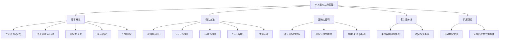

## 相关笔记

- 前置笔记：[[24.1 流网络]]、[[24.2 Ford-Fulkerson方法]]
- 关联概念：[[第25章_二部图匹配]]（如有）
- 章节汇总：[[第24章_最大流-章节汇总]]

> [!abstract] 概览
> 本节展示如何将==最大二分匹配==问题==归约==为==最大流问题==，从而利用Ford-Fulkerson方法高效求解。二分匹配是组合优化中的经典问题：给定一个二部图，找到最多的边使得没有两个边共享端点。本节首先给出匹配的形式化定义，然后构造一个特殊的流网络将匹配问题转化为最大流问题，最后证明最大匹配的大小恰好等于最大流的值。利用==Edmonds-Karp算法==在==单位容量网络==上的高效表现，最大二分匹配可以在 ==O(VE)== 时间内求解。
>
> **要点列表：**
> - ==匹配==是图中一组两两不共享端点的边的集合
> - ==最大二分匹配==可以通过构造特殊的流网络归约为==最大流问题==
> - 流网络构造：源s连接左部L，右部R连接汇t，所有边容量为1
> - ==最大匹配大小 = 最大流值==（定理24.10）
> - 在单位容量网络上Edmonds-Karp的复杂度从O(VE^2)改进到 ==O(VE)==
> - ==Hall婚配定理==给出了完美匹配存在的充要条件

---

## 知识结构总览

---

## 核心思想

> [!tip] 核心思路
> 最大二分匹配问题的求解策略是**归约为最大流**：
> 1. 给定一个二部图G=(L∪R, E)，构造一个对应的流网络G'
> 2. 在G'中添加超源s和超汇t，将L中的每个顶点与s相连，R中的每个顶点与t相连
> 3. 所有边的容量设为1
> 4. 在G'上运行最大流算法
> 5. 从最大流中提取匹配：流量为1的L→R边构成最大匹配
>
> 这个归约之所以有效，是因为**容量为1的约束天然保证了"每个顶点最多被匹配一次"**——就像每个求职者只能接受一个岗位、每个岗位只能分配给一个求职者一样。

### 匹配的形式化定义

> [!def] 匹配（Matching）
> 给定无向图G=(V,E)，一个==匹配==M是E的一个子集，使得M中的任意两条边都不共享端点。即对于任意(u,v)和(x,y)属于M，有 {u,v} ∩ {x,y} = 空集。
>
> - **匹配的大小**：匹配M中边的数量，记为|M|
> - **最大匹配**：图中所有匹配中大小最大的那个
> - **最大二分匹配**：当G是==二部图==（顶点集V=L∪R，L∩R=空集，E中每条边的一个端点在L中，另一个在R中）时的最大匹配
> - **完美匹配**：如果|M| = |V|/2（即每个顶点都被匹配），则称M为完美匹配
>
> **直观理解：** 匹配就像"一对一配对"——将图中的一些顶点两两配对，每对之间有边相连，且每个顶点最多参与一对。

### 流网络构造

> [!def] 二分匹配到最大流的归约
> 给定二部图G=(V,E)，其中V=L∪R，构造对应的流网络G'=(V',E')如下：
>
> **顶点集：** V' = V ∪ {s, t}，其中s是新添加的源，t是新添加的汇
>
> **边集与容量：**
> - 从源s到L中每个顶点u添加有向边(s,u)，容量 c(s,u) = **1**
> - 从R中每个顶点v到汇t添加有向边(v,t)，容量 c(v,t) = **1**
> - 对于原图G中的每条边(u,v)（u属于L，v属于R），添加有向边(u,v)，容量 c(u,v) = **1**
> - 所有其他边对(u,v)的容量为0
>
> **关键性质：**
> - 这是一个==单位容量网络==——所有边的容量都是1
> - s只有出边（到L），t只有入边（从R）
> - L中的顶点只有来自s的入边和到R的出边
> - R中的顶点只有来自L的入边和到t的出边

### 定理：最大匹配大小 = 最大流值

> [!def] 定理24.10（最大匹配 = 最大流）
> 设二部图G的对应流网络为G'，f是G'中的一个最大流，M是由G'中流量为1的L→R边组成的集合。则M是G中的一个==最大匹配==，且 ==|M| = |f|==。
>
> **证明分两部分：**
>
> **第一部分：M是G的一个匹配。**
> 需要证明M中任意两条边不共享端点。
> - **【反证假设（两条边共享端点）】** 反证：假设M中有两条边(u1,v1)和(u2,v2)共享端点。
> - **【情况1：共享左端点（容量1约束被违反）】** 情况1：u1 = u2。由于边(s,u1)的容量为1，而f(s,u1) ≥ f(u1,v1) + f(u1,v2) = 2，违反容量约束。矛盾。
> - **【情况2：共享右端点（同理容量1约束被违反）】** 情况2：v1 = v2。类似地，f(v1,t) ≥ f(u1,v1) + f(u2,v1) = 2，违反容量约束。矛盾。
> - 因此M是合法匹配。
>
> **第二部分：|M| = |f|。**
> - **【流值=从s流出的总流量】** 流值 |f| = 从s流出的总流量 = sum of f(s,u) for u in L
> - **【整数流性质（容量1 $\Rightarrow f(s,u) \in \{0,1\}$）】** 由于每条边(s,u)容量为1且f(s,u)是整数（整数流性质），f(s,u)要么为0要么为1
> - **【$f(s,u)=1$当且仅当$u$被匹配】** f(s,u) = 1 当且仅当存在v属于R使得f(u,v) = 1（因为u的流入等于流出）
> - **【计数对应（$|f|$等于被匹配的$u$的数量$=|M|$）】** 因此 |f| = |{u in L : f(s,u) = 1}| = |{u in L : 存在v使得(u,v)属于M}| = |M|
>
> **结论：** 最大匹配的大小等于最大流的值。

### 复杂度分析：O(VE)

> [!def] Edmonds-Karp在单位容量网络上的改进
> 在二分匹配对应的流网络G'上运行Edmonds-Karp算法，时间复杂度可以从一般的O(VE^2)改进到 ==O(VE)==。
>
> **分析过程：**
>
> 1. **增广次数：** 在单位容量网络中，每次增广路径的残差容量cf(p) = 1（因为所有边容量为1），所以每次增广使流值恰好增加1。流值的上限为O(V)（因为从s出发的边最多|L|条，每条容量为1），因此最多增广O(V)次。
>
> 2. **每次BFS的时间：** G'有O(V)个顶点和O(E)条边，BFS耗时O(E)。
>
> 3. **总时间：** O(V)次增广 x O(E)每次BFS = ==O(VE)==。
>
> **更精细的分析：** 实际上，增广路径可以分为两类：
> - 长度为3的路径（s→u→v→t，其中(u,v)是原图中的边）：最多O(E)条这样的路径
> - 长度大于3的路径：由引理24.4，路径长度单调递增，且长度大于3的路径最多O(V)条
> - 因此总增广次数为O(E) + O(V) = O(E)，总时间为O(E^2)或O(VE)（取较小者）

### Hall婚配定理

> [!def] Hall婚配定理（Hall's Marriage Theorem）
> 设G=(V,E)是二部图，V=L∪R，|L| = |R|。对于L的任意子集A，定义A的==邻域== N(A) = {v属于R : 存在u属于A使得(u,v)属于E}。
>
> G中存在==完美匹配== 当且仅当 对L的**每个**子集A，都有 ==|A| ≤ |N(A)|==。
>
> **直观理解：** Hall条件说的是"左部任意一组候选人，他们认识的人的数量不少于候选人的人数"。如果存在一组k个候选人只认识少于k个人，那这k个人中至少有一个找不到匹配对象。
>
> **与最大流的关系：** Hall定理可以通过最大流最小割定理来证明。考虑对应的流网络G'，如果存在A属于L使得|N(A)| < |A|，则割(S,T) = ({s}∪A∪N(A), 其余顶点)的容量为 |L| - |A| + |N(A)| < |L|，因此最大流值小于|L|，不存在完美匹配。反之，如果对所有A都有|A| ≤ |N(A)|，则任何割的容量至少为|L|，最大流值至少为|L|，存在完美匹配。

---

## 补充理解与拓展

> [!info] 匹配理论的历史
>
> 匹配理论是组合数学和图论中最古老也最丰富的领域之一，其发展跨越了一个多世纪：
>
> **早期奠基（1910s-1930s）：**
> - **Konig (1916)**：匈牙利数学家Denis Konig证明了==Konig定理==——在二部图中，最大匹配的大小等于最小顶点覆盖的大小。这是二部图匹配理论的第一个重要结果。
> - **Hall (1935)**：英国数学家Philip Hall发表了==Hall婚配定理==，给出了二部图存在完美匹配的充要条件。这个定理最初被称为"婚配定理"（Marriage Theorem），因为可以用"男士和女士的匹配"来直观解释。
> - **Konig-Egervary定理**：将Konig定理推广，建立了二部图中最大匹配、最小顶点覆盖和最大独立集之间的深刻联系。
>
> **算法时代（1950s-1970s）：**
> - **Kuhn (1955)** 和 **Munkres (1957)**：提出了求解赋权二分匹配（最优分配问题）的==匈牙利算法==，时间复杂度O(V^3)。
> - **Hopcroft & Karp (1973)**：提出了O(E sqrt(V))的最大二分匹配算法，显著改进了基于最大流的O(VE)方法。
>
> 这些理论结果之间有着深刻的等价关系——Borgersen (2004)证明了组合数学中七个主要定理（包括Menger定理、Konig定理、Hall定理、最大流最小割定理等）实际上是互相等价的。
>
> 来源：Konig, D. (1916), "Uber Graphen und ihre Anwendung auf Determinantentheorie und Mengenlehre"; Hall, P. (1935), "On Representatives of Subsets", Journal of the London Mathematical Society; Borgersen, R. (2004), "Equivalence of Seven Major Theorems in Combinatorics"

> [!info] 最大二分匹配的实际应用
>
> 二分匹配在现实世界中有大量重要应用：
>
> **1. 求职者-岗位匹配**
> 最经典的应用场景。左部L代表求职者，右部R代表岗位，边(u,v)表示求职者u胜任岗位v。最大匹配给出最多能安排的求职者-岗位配对数。实际应用中通常结合权重（如匹配质量评分），转化为==赋权二分匹配==问题。
>
> **2. 课程-教室/时间段分配**
> 将课程和教室（或时间段）分别作为二部图的两部分，边表示课程可以在该教室（或时间段）进行。最大匹配确定最多能同时安排多少门课程。
>
> **3. 肾交换程序（Kidney Exchange）**
> 这是最动人的应用之一。需要肾移植的病人如果有愿意捐肾但血型不匹配的亲属，可以通过"交换"找到匹配。将捐献者-病人对作为二部图的一部分，最大匹配帮助找到最多的兼容交换链。美国自2000年代起建立了全国性的肾交换登记系统。
>
> **4. 推荐系统与在线广告**
> 在在线广告投放中，将广告位和广告主分别作为二部图的两部分，边表示广告主愿意在该广告位投放。最大匹配（及其在线版本）帮助实现广告位的最优分配，最大化平台收益。
>
> 来源：Roth, A.E. et al. (2004), "Kidney Exchange", Quarterly Journal of Economics; Mehta, A. (2012), "Online Matching and Ad Allocation", Foundations and Trends in Theoretical Computer Science

---

## 易混淆点与辨析

> [!warning] 匹配 vs 最大匹配 vs 完美匹配
> **匹配**是图中一组两两不共享端点的边的集合。一个图可以有很多不同的匹配，包括空匹配（不选任何边）。
>
> **最大匹配**是所有匹配中边数最多的那个。一个图的最大匹配可能有多个（不同的边集但边数相同）。
>
> **完美匹配**是一种特殊的最大匹配，要求图中每个顶点都被匹配（|M| = |V|/2）。完美匹配一定存在的前提是|V|是偶数，且满足Hall条件等。并非所有图都有完美匹配。
>
> **关系：** 完美匹配 ⟹ 最大匹配 ⟹ 匹配（但反向不成立）。

> [!warning] 二分匹配 vs 一般图匹配
> **二分匹配**问题（本节讨论的）中，图是二部图，可以用最大流高效求解，时间复杂度为O(VE)或O(E sqrt(V))。
>
> **一般图匹配**问题中，图不一定是二部图，求解更加困难。Edmonds在1965年提出了著名的"开花算法"（Blossom Algorithm），时间复杂度为O(V^2 E)。一般图匹配比二分匹配复杂得多，因为一般图中可能存在奇数长度的环（"花"），需要特殊处理。
>
> **类比：** 二分匹配像"男生-女生配对"，天然两两分组；一般图匹配像"任意人群配对"，可能形成三角关系等复杂结构。

> [!warning] 最大流值 vs 匹配大小
> 在二分匹配到最大流的归约中，==最大流值 = 最大匹配大小==。但需要注意：
> - 流值等于从s流出的总流量，也等于流入t的总流量
> - 由于所有边容量为1，流值恰好等于被使用的s→L边的数量
> - 每条被使用的s→L边恰好对应匹配中的一条边
> - 因此流值 = 匹配大小，这个等式是精确的（不是渐近的）

---

## 习题精选

| 题号 | 题目描述 | 难度 |
|:---:|----------|:---:|
| 24.3-1 | 在图26.8(c)的流网络上运行Ford-Fulkerson算法，展示每次增广后的残差网络 | ⭐⭐ |
| 24.3-2 | 证明定理24.10（最大匹配大小=最大流值） | ⭐⭐ |
| 24.3-3 | 给出二分图对应流网络中增广路径长度的上界 | ⭐⭐ |
| 24.3-4 | 证明Hall婚配定理 | ⭐⭐⭐ |
| 24.3-5 | 证明每个d-正则二部图都有大小为|L|的匹配 | ⭐⭐⭐ |

> [!faq]- 24.3-1 解答
> **目标：** 在图26.8(c)的流网络上运行Ford-Fulkerson，每次选字典序最小的增广路径。
>
> 将L中顶点从上到下编号为1到5，R中顶点从上到下编号为6到9。
>
> **第1次增广：** 选择经过顶点1和6的路径 s → 1 → 6 → t。增广1单位流量。
>
> **第2次增广：** 选择经过顶点2和8的路径 s → 2 → 8 → t。增广1单位流量。
>
> **第3次增广：** 选择经过顶点3和7的路径 s → 3 → 7 → t。增广1单位流量。
>
> **终止：** 增广后的残差网络中不存在从s到t的路径，算法终止。
>
> **结果：** 最大匹配为 {(1,6), (2,8), (3,7)}，匹配大小为3。这与割 {s,4,5} 的容量（切割边(s,3)、(6,t)、(7,t)，容量为3）一致，验证了最大流最小割定理。

> [!faq]- 24.3-2 解答
> **目标：** 证明定理24.10——整数容量二分图对应流网络中，最大流值等于最大匹配大小。
>
> **证明：** 对Ford-Fulkerson的while循环迭代次数进行归纳。
>
> **基础情况：** 第一次迭代前，所有流量为0（整数），所有残差容量也是整数。
>
> **归纳步骤：** 假设第n次迭代后所有边的流量都是整数。第n+1次迭代中，cf(p)是整数残差容量的最小值，因此也是整数。第7-8行对流量进行加或减cf(p)的操作，结果仍为整数。
>
> 因此，算法终止时所有边的流量都是整数。由于所有边容量为1，每条边的流量只能是0或1。流值 |f| 是从s流出的总流量，等于流量为1的s→L边数，也等于流量为1的L→R边数。这些L→R边恰好构成一个匹配M，且 |M| = |f|。由于f是最大流，M是最大匹配。

> [!faq]- 24.3-3 解答
> **目标：** 给出二分图对应流网络中增广路径长度的上界。
>
> 在二分图G=(L∪R,E)对应的流网络G'中，任何从s到t的路径必须经过以下结构：
> s → (某个u属于L) → (某个v属于R) → t
>
> 因此，任何增广路径的长度**至少为3**（s→u→v→t）。
>
> 另一方面，由于G'是一个简单图（没有重边），增广路径不可能重复访问同一个顶点。G'中有|V|+2个顶点，因此增广路径的长度**至多为|V|+1**。
>
> **更紧的上界：** 由于增广路径在L和R之间交替，且s只有到L的边、t只有从R的边，路径的长度一定是**奇数**，且至多为 **2·min(|L|,|R|) + 1**。

> [!faq]- 24.3-4 解答
> **目标：** 证明Hall婚配定理——|L|=|R|的二部图G存在完美匹配 ⟺ 对所有A属于L，|A| ≤ |N(A)|。
>
> **证明（⇒方向）：** 设G存在完美匹配M。对任意A属于L，A中每个顶点在M中匹配到N(A)中的不同顶点（因为M是匹配，不共享端点）。因此 |N(A)| ≥ |A|。
>
> **证明（⇐方向）：** 设对所有A属于L都有|A| ≤ |N(A)|。在对应流网络G'上运行Ford-Fulkerson。每次增广使流值增加1，需要证明while循环至少运行|L|次。
>
> 反证：假设while循环运行了少于|L|次就终止（即残差网络中不存在s到t的路径）。令v1属于L为某个未被完全匹配的顶点。由Hall条件，N({v1}) ≥ 1，所以v1至少有一个邻居v1'属于R。如果(v1',t)在残差网络中，则存在增广路径，矛盾。因此存在(v2,v1')有流量1（即v2被匹配到v1'）。由Hall条件，N({v1,v2}) ≥ 2，存在v2' ≠ v1'。继续此过程，不断扩展已访问的顶点集。由于while循环运行了少于|L|次，仍有边进入t在残差网络中，此过程必然在某个vk'处终止，得到增广路径 s→v1→v1'→v2→v2'→...→vk→vk'→t，矛盾。
>
> 因此while循环至少运行|L|次，|f| ≥ |L|。又因为 |f| ≤ |L|（s的出边总容量为|L|），所以 |f| = |L|，即存在大小为|L|的完美匹配。

> [!faq]- 24.3-5 解答
> **目标：** 证明每个d-正则二部图都有大小为|L|的匹配。
>
> **证明：** 转化为流网络后，需要证明最小割的容量至少为|L|。
>
> 考虑任意割(S,T)，其中s属于S，t属于T。设S1 = L ∩ S，S2 = R ∩ S。
>
> 割的容量由三部分组成：
> 1. 从s到L∩T的边：|L| - |S1|条，每条容量1
> 2. 从R∩S到t的边：|S2|条，每条容量1
> 3. 从S1到R∩T的边（原图中的边）
>
> 由于G是d-正则的，S1中所有顶点的总度数为 d·|S1|。这些度数分配给R中的邻居。S1在S2中的邻居至多为 d·|S2|（因为S2中每个顶点度数为d），所以S1在R∩T中的邻居至少有 d·|S1| - d·|S2| = d(|S1| - |S2|) 条边。但每条边容量为1，所以第3部分至少贡献 |S1| - |S2| 的容量。
>
> 因此割的总容量至少为：
> (|L| - |S1|) + |S2| + (|S1| - |S2|) = |L|
>
> 由最大流最小割定理，最大流值 ≥ |L|。又因为最大流值 ≤ |L|（s的出边总容量），所以最大流值 = |L|，对应大小为|L|的匹配。

---

## 视频学习指南

| 资源 | 主题 | 链接 | 说明 |
|:-----|:-----|:-----|:-----|
| MIT 6.006 Lecture 16 | Graph Matching | https://www.youtube.com/watch?v=dQ6mKdFzFCA | 匹配问题与最大流归约 |
| Abdul Bari | Bipartite Matching | https://www.youtube.com/watch?v=laW2_Ib6FkM | 二分匹配入门讲解 |
| WilliamFiset | Bipartite Matching | https://www.youtube.com/watch?v=oD2j8z-peMk | 匈牙利算法与最大流方法 |
| NeetCode | Bipartite Graph | https://www.youtube.com/watch?v=9qVij6FxmMI | 二分图判定与匹配 |
| 3Blue1Brown | Matching (Visual) | https://www.youtube.com/watch?v=thZ3eFH9uKE | 可视化匹配理论 |

---

## 教材原文

> [!quote] CLRS 第4版 24.3节原文
> A bipartite graph is an undirected graph G = (V, E) in which each vertex in V can be partitioned into two disjoint sets L and R, and every edge in E connects a vertex in L to a vertex in R.
>
> To find a maximum matching in a bipartite graph, we can use the Ford-Fulkerson method. We construct a flow network G' = (V', E') from G as follows. We add a source vertex s and a sink vertex t. We direct all edges of G from L to R, and we assign each edge a capacity of 1. We add edges from s to each vertex in L with capacity 1, and we add edges from each vertex in R to t with capacity 1.
>
> Theorem 24.10 (Integrality theorem). If all capacities in a flow network are integers, then the Ford-Fulkerson method produces a maximum flow in which every flow value is an integer.
>
> Corollary 24.11. The size of a maximum matching in a bipartite graph equals the value of a maximum flow in its corresponding flow network.

---

## 参见Wiki

- [[算法导论/concepts/二分匹配]] — 二部图中的匹配问题
- [[离散数学/concepts/最大流]] — 最大流问题与Ford-Fulkerson方法
- [[离散数学/theorems/Hall婚姻定理]] — 完美匹配的充要条件

#学习/算法导论/第24章-最大流 #学习/算法导论/最大流/最大二分匹配
