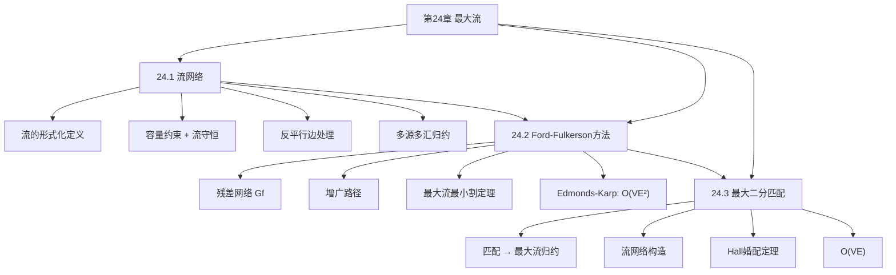

## 相关笔记

- 节笔记：[[24.1 流网络]]、[[24.2 Ford-Fulkerson方法]]、[[24.3 最大二分匹配]]
- 前置章节：[[第23章_所有结点对的最短路径-章节汇总]]、[[第20章_基本图算法-章节汇总]]
- 后续章节：[[第25章_二部图匹配-章节汇总]]

> [!abstract] 概览
> 全章围绕==最大流==（Maximum Flow）问题展开。首先建立==流网络==的形式化框架，定义==流==、==容量约束==、==流守恒==等基本概念（24.1）；然后介绍经典的==Ford-Fulkerson方法==，通过==残差网络==和==增广路径==迭代逼近最大流，并证明核心的==最大流最小割定理==（24.2）；最后将最大流算法应用于==二部图最大匹配==问题，展示问题归约的威力（24.3）。全章的核心主线是 **如何高效计算网络中的最大流量**——从基本概念到经典算法再到实际应用。

---

## 知识结构总览

---

## 核心概念回顾

### 三节内容对比

| 比较维度 | 24.1 流网络 | 24.2 Ford-Fulkerson | 24.3 最大二分匹配 |
|:---------|:-----------|:-------------------|:-----------------|
| **定位** | 基础概念框架 | 核心算法 | 应用实例 |
| **核心问题** | 如何定义流？ | 如何求最大流？ | 如何求最大匹配？ |
| **关键概念** | 容量约束、流守恒、流值 | 残差网络、增广路径、割 | 匹配、完美匹配、归约 |
| **核心定理** | 引理24.1（归约正确性） | 最大流最小割定理 | 定理24.10（匹配=流值） |
| **复杂度** | — | Ford-Fulkerson不确定；Edmonds-Karp $O(VE^2)$ | $O(VE)$ |

### 算法选型指南

> [!note] 最大流算法选择
> - **一般场景**：Edmonds-Karp（BFS选最短增广路径），$O(VE^2)$，实现简单
> - **大规模稀疏图**：Dinic算法，$O(V^2 E)$，理论更优
> - **大规模稠密图**：推送-重贴标签算法，$O(V^3)$
> - **二部图匹配**：直接归约为最大流，$O(VE)$；或使用Hopcroft-Karp算法，$O(E\sqrt{V})$

### 核心定理

> [!def] 最大流最小割定理（Theorem 24.2）
> 以下三个条件等价：
> 1. $f$ 是 $G$ 的最大流
> 2. 残差网络 $G_f$ 中不包含从 $s$ 到 $t$ 的增广路径
> 3. 对 $G$ 的某个割 $(S, T)$，有 $|f| = c(S, T)$
>
> **推论：** 最大流值等于最小割容量。

> [!def] 二部图匹配与最大流的关系（Theorem 24.10）
> 在二部图匹配归约得到的流网络中，最大匹配的大小等于最大流的值。

---

## 跨章关联

### 与第20章（基本图算法）的关系

| 第20章概念 | 第24章应用 |
|:-----------|:----------|
| BFS（广度优先搜索） | Edmonds-Karp算法中用BFS找最短增广路径 |
| DFS（深度优先搜索） | Ford-Fulkerson方法中可用DFS找增广路径 |
| 图的表示（邻接表/邻接矩阵） | 流网络使用邻接表表示，便于遍历残差边 |

### 与第22章（单源最短路径）的关系

- Edmonds-Karp用BFS找**最短**增广路径（按边数），这与BFS求无权图最短路径的思想一致
- 残差网络中边的权重视为1（每条增广路径的"长度"=边数），因此BFS天然适用
- 最大流最小割定理的证明中，割的概念与最短路径中的距离概念有类比关系

### 与第23章（所有结点对最短路径）的关系

- 第23章的==矩阵乘法方法==与第24章的==Ford-Fulkerson方法==都是迭代改进策略
- 两者都通过逐步"扩展"或"增广"来逼近最优解
- 最大流问题与最短路径问题都是==网络优化==的经典问题

### 与第25章（二部图匹配）的关系

- 24.3节是第25章的前置：24.3展示了匹配→最大流的归约方法
- 第25章将进一步讨论稳定婚姻问题、匈牙利算法等更高级的匹配算法

---

## 综合复习题

> [!faq]- 复习题 1：为什么Ford-Fulkerson方法在容量为无理数时可能不终止？
> 当容量为无理数时，Ford-Fulkerson方法可能反复选择不恰当的增广路径，导致流值收敛但不终止。经典反例中，每次增广路径的选择使流值的增量构成一个无限递减序列，极限为最大流值但永远无法达到。Edmonds-Karp通过BFS选择最短增广路径避免了这个问题——它保证每条边最多被增广 $O(V)$ 次，因此总增广次数为 $O(VE)$。

> [!faq]- 复习题 2：最大流最小割定理的直观含义是什么？
> 想象一个管道网络，源是水厂，汇是目的地。流是管道中实际的水量，容量是管道的最大承载能力。割是将网络分成两部分（包含源的部分和包含汇的部分）的切割线，割的容量是所有跨越切割线的管道容量之和。定理说：**实际能从水厂送到目的地的最大水量，恰好等于任何切割线上管道容量之和的最小值**。这意味着网络的"瓶颈"决定了最大流量——找到最窄的瓶颈（最小割），就确定了最大流量。

> [!faq]- 复习题 3：如何将二部图最大匹配归约为最大流问题？
> 给定二部图 $G = (L, R, E)$，构造流网络 $G'$：
> 1. 添加源 $s$ 和汇 $t$
> 2. 从 $s$ 向 $L$ 中每个顶点添加边，容量为 1
> 3. 将 $E$ 中每条边从 $L$ 指向 $R$，容量为 1
> 4. 从 $R$ 中每个顶点向 $t$ 添加边，容量为 1
>
> 在 $G'$ 中求最大流，由于所有容量为 1，流值为 1 的边对应匹配中的一条边。最大流值等于最大匹配的大小。正确性依赖于：每个 $L$ 顶点最多接收 1 单位流（源边容量为 1），每个 $R$ 顶点最多输出 1 单位流（汇边容量为 1），因此流自然构成一个匹配。

> [!faq]- 复习题 4：Edmonds-Karp算法为什么是 $O(VE^2)$ 而非 $O(VE \cdot \text{增广次数})$？
> Edmonds-Karp的关键洞察（引理24.4）是：每次BFS找到的最短增广路径的长度（边数）单调不减。更精确地说，每条边 $(u, v)$ 从成为残差网络中的"关键边"（即被增广路径首次使用）到再次成为关键边之间，最短增广路径的长度至少增加 2。由于最短路径长度最多为 $V-1$，每条边最多成为关键边 $O(V)$ 次。因此总增广次数为 $O(VE)$，每次BFS耗时 $O(E)$，总时间为 $O(VE^2)$。

---

## 常见误区

> [!warning] 误区1：流和容量是同一个概念
> **正确理解**：容量 $c(u,v)$ 是边 $(u,v)$ 能承载的流量的**上界**，是网络的固有属性。流 $f(u,v)$ 是实际通过边 $(u,v)$ 的流量，是算法的输出。流必须满足 $0 \le f(u,v) \le c(u,v)$（容量约束）。类比：容量是管道的粗细，流是实际流过的水量。

> [!warning] 误区2：Ford-Fulkerson方法总是能在多项式时间内终止
> **正确理解**：基本的Ford-Fulkerson方法（用DFS选增广路径）在容量为无理数时可能不终止。即使容量为整数，其运行时间为 $O(E|f^*|)$，其中 $|f^*|$ 是最大流值——这不是输入规模的多项式。只有Edmonds-Karp（BFS选最短增广路径）才能保证 $O(VE^2)$ 的多项式时间。

> [!warning] 误区3：最大流问题只适用于运输网络
> **正确理解**：最大流是一个通用的组合优化框架，应用远超运输网络。典型应用包括：二部图匹配（24.3节）、图像分割（Graph Cut）、棒球淘汰判定、项目选择问题、网络可靠性分析、社交网络影响力最大化等。任何可以建模为"在容量约束下最大化流量"的问题都可以用最大流算法求解。

---

## 学习要点总结

| 学习目标 | 掌握程度 | 对应笔记 |
|:---------|:---------|:---------|
| 流网络的形式化定义 | 掌握 | [[24.1 流网络]] |
| 容量约束与流守恒 | 熟练 | [[24.1 流网络]] |
| 反平行边与多源多汇处理 | 掌握 | [[24.1 流网络]] |
| 残差网络与增广路径 | 熟练 | [[24.2 Ford-Fulkerson方法]] |
| 最大流最小割定理及证明 | 熟练 | [[24.2 Ford-Fulkerson方法]] |
| Edmonds-Karp算法与复杂度分析 | 掌握 | [[24.2 Ford-Fulkerson方法]] |
| 二部图匹配→最大流归约 | 熟练 | [[24.3 最大二分匹配]] |
| Hall婚配定理 | 掌握 | [[24.3 最大二分匹配]] |

---

## 参见Wiki

> [!note] 概念页尚未创建

#学习/算法导论/第24章-最大流 #学习/算法导论/最大流/章节汇总
