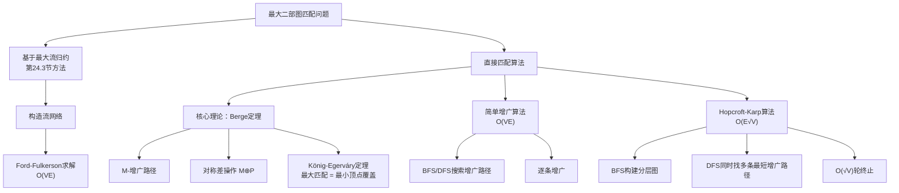
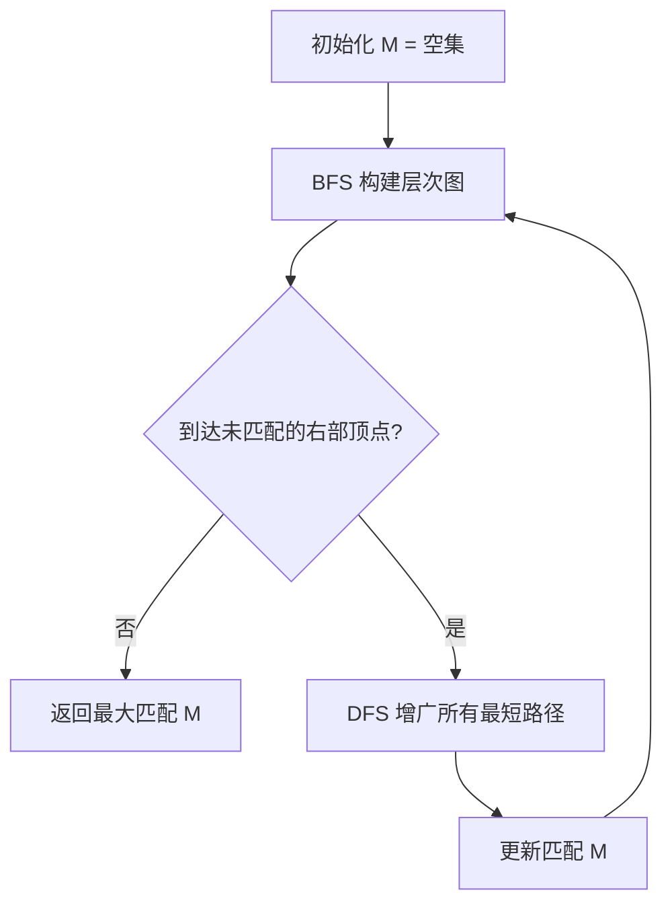

## 相关笔记

**前置知识：**
- [[24.1 流网络]] — 流网络的基本定义与性质
- [[24.2 Ford-Fulkerson方法]] — 增广路径与最大流的基本求解框架
- [[24.3 最大二分匹配]] — 基于最大流归约的二分匹配方法

**后续内容：**
- [[25.2 稳定婚姻问题]]
- [[25.3 指派问题]]

**关联知识：**
- [[第20章_基本图算法-章节汇总|第20章 BFS与DFS]] — 本节算法的搜索基础

---

## [!abstract] 概览

本节重新审视==最大二部图匹配==问题。第24.3节已展示如何通过==最大流==归约求解，本节介绍更高效的直接方法：

- **Berge定理**：匹配M是最大的，当且仅当图中不存在==M-增广路径==
- **引理25.1**：沿增广路径做==对称差==操作可使匹配规模增1
- **Hopcroft-Karp算法**：每轮同时寻找多条==最短==顶点不相交增广路径，时间复杂度为 ==O(E根号V)==
- **简单增广算法**：基于BFS/DFS逐条寻找增广路径，时间复杂度为 ==O(VE)==

---

## 知识结构总览



---

## 核心思想

### [!tip] 核心思路

最大二部图匹配的核心思路是：从空匹配出发，**反复寻找增广路径并沿路径翻转匹配状态**，每次操作使匹配规模恰好增加1。当找不到任何增广路径时，由**Berge定理**保证当前匹配即为最大匹配。

这一思路的关键在于两个问题：
1. **为什么增广路径不存在就意味着匹配最大？** — Berge定理给出了充要条件的严格证明
2. **如何高效地寻找增广路径？** — 简单方法用BFS/DFS逐条搜索（**O(VE)量级**），Hopcroft-Karp算法通过同时找多条最短增广路径将复杂度降至**O(E根号V)量级**

---

### [!def] 基本概念

**匹配（Matching）**：给定无向图 G=(V,E)，匹配 M 是边集 E 的一个子集，使得 V 中每个顶点在 M 中至多关联一条边。

**最大匹配（Maximum Matching）**：在所有匹配中，边数最多的匹配。

**极大匹配（Maximal Matching）**：无法再添加任何边而仍保持匹配性质的匹配。最大匹配一定是极大匹配，但极大匹配不一定是最大匹配。

**完美匹配（Perfect Matching）**：图中每个顶点都被匹配的匹配。完美匹配一定是最大匹配。

**已匹配顶点 / 未匹配顶点**：在匹配 M 下，有边关联的顶点称为已匹配顶点，否则称为未匹配顶点（自由顶点）。

**M-交替路径（M-Alternating Path）**：一条简单路径，其边在 M 和 E-M 之间交替出现。

**M-增广路径（M-Augmenting Path）**：一条M-交替路径，且其第一条边和最后一条边都不属于 M。增广路径的两个端点都是未匹配顶点，且包含奇数条边（非匹配边比匹配边多1条）。

**对称差（Symmetric Difference）**：两个集合 X 和 Y 的对称差定义为 X⊕Y = (X-Y) ∪ (Y-X)，即属于 X 或 Y 但不同时属于两者的元素集合。对称差运算满足交换律和结合律。

---

### [!def] Berge定理（定理25.4 / Corollary 25.4）

**定理**：图 G=(V,E) 中的匹配 M 是最大匹配，当且仅当 G 中不存在 M-增广路径。

**完整证明**：

> **【逆否命题双向证明（存在增广路径⇔非最大）】** 逆否命题双向证明：方向一（存在增广路径→非最大）+ 方向二（非最大→存在增广路径）

我们证明两个方向的逆否命题。

**方向一（正向的逆否）：若存在 M-增广路径，则 M 不是最大匹配。**

设 P 是一条 M-增广路径，P 包含 q 条边。由于 P 是增广路径，其端点 $v_1$ 和 $v_{q+1}$ 在 M 下未匹配，其余顶点均已匹配。P 中属于 E-M 的边为 $(v_1,v_2), (v_3,v_4), ..., (v_q,v_{q+1})$，共 $\lceil q/2 \rceil$ 条；属于 M 的边为 $(v_2,v_3), (v_4,v_5), ..., (v_{q-1},v_q)$，共 $\lfloor q/2 \rfloor$ 条。因为 $\lceil q/2 \rceil = \lfloor q/2 \rfloor + 1$，所以非匹配边比匹配边多1条。

> **【对称差构造（$M' = M \oplus P$ 翻转匹配边，$|M'| = |M|+1$）】**：对称差操作将 P 中原属于 M 的边移出、原不属于 M 的边加入。由于 P 是简单路径，翻转后每个顶点在 $M'$ 中至多关联一条边，因此 $M'$ 仍是合法匹配。且 $|M'| = |M| + 1$，故 M 不是最大匹配。

**方向二（反向的逆否）：若 M 不是最大匹配，则 G 中存在 M-增广路径。**

设 $M^*$ 是 G 中的最大匹配，且 $|M^*| > |M|$。考虑图 $G' = (V, E')$，其中 $E' = M \oplus M^*$。

**引理25.3**指出：$G'$ 中每个顶点的度数至多为2（因为每个顶点在 M 中至多关联1条边，在 $M^*$ 中也至多关联1条边），因此 $G'$ 的每个连通分量要么是孤立顶点，要么是边交替属于 M 和 $M^*$ 的偶长度简单环，要么是边交替属于 M 和 $M^*$ 的简单路径。

> **【对称差分量分析（偶环边数相等，多出的 $M^*$ 边构成增广路径）】**，$E'$ 中属于 $M^*$ 的边比属于 M 的边多 $|M^*| - |M|$ 条。偶长度环中 M 和 $M^*$ 的边数相等，因此多出的边全部出现在简单路径分量中。具体来说，那些以 $M^*$ 中的边为起点和终点的路径，每条包含的 $M^*$ 边比 M 边多1条，且两个端点在 M 下未匹配——这正是 M-增广路径。这样的路径至少有 $|M^*| - |M| > 0$ 条，且它们顶点不相交。

因此，G 中存在 M-增广路径。证毕。

---

### Hopcroft-Karp 算法伪代码

> [!tip] 算法执行流程
> 1. **初始化**匹配 M 为空集，BFS 队列清空
> 2. **BFS 阶段**：从所有未匹配的左部顶点出发，沿交替边构建**层次图**（分层图）
> 3. 若 BFS **未到达**任何未匹配的右部顶点 → 算法**终止**，返回 M
> 4. **DFS 阶段**：在层次图上对每个最短增广路径执行 DFS **增广**（路径顶点不相交）
> 5. 更新匹配 M = M 对称差 所有增广路径 → 回到步骤2



```
HOPCROFT-KARP(G)
1  M = 空集
2  repeat
3      用 BFS 从所有未匹配的左部顶点出发，构建分层图
4      在分层图上用 DFS 找到一组顶点不相交的最短 M-增广路径 P = {P_1, P_2, ..., P_k}
5      M = M ⊕ (P_1 ∪ P_2 ∪ ... ∪ P_k)
6  until P 为空
7  return M
```

**算法要点：**

- **第3行（BFS阶段）**：从所有未匹配的左部顶点同时出发做BFS，构建分层图。BFS只沿交替边前进（非匹配边从左到右，匹配边从右到左），记录每个顶点的层次。当BFS到达某个未匹配的右部顶点时，当前层次即为最短增广路径的长度。
- **第4行（DFS阶段）**：在分层图上用DFS从各未匹配的左部顶点出发，只沿层次递增的方向搜索，找到多条顶点不相交的最短增广路径。已使用的顶点在当前轮次中标记为不可再用，保证路径之间顶点不相交。
- **第5行**：利用推论25.2，对多条顶点不相交的增广路径同时做对称差，匹配规模一次增加 k。

---

### 复杂度分析

**简单增广算法（基于BFS/DFS逐条搜索）：**

- 每次寻找一条增广路径需要 $O(E)$ 时间（BFS或DFS遍历）
- 最多需要 $|M^*| \leq V/2$ 次增广（$M^*$ 为最大匹配）
- 总时间复杂度：**$O(VE)$**

**Hopcroft-Karp 算法：**

- **BFS阶段**：每轮 $O(E)$ 时间构建分层图
- **DFS阶段**：每轮 $O(E)$ 时间（每条边至多被访问一次）
- **轮数上界**：$O(\sqrt{V})$ 轮。证明思路：设经过 $\sqrt{V}$ 轮后匹配为 M，此后最短增广路径长度至少为 $2\sqrt{V} + 1$。考虑 M 与最大匹配 $M^*$ 的对称差，其中每条 M-增广路径长度至少为 $2\sqrt{V} + 1$，每条路径至少包含 $\sqrt{V} + 1$ 条 M 的边。但 $|M^*| - |M| \leq V/2$，因此这样的路径最多有 $V/(2(\sqrt{V}+1)) < \sqrt{V}$ 条，即最多还需 $\sqrt{V}$ 轮即可终止。
- 总时间复杂度：**$O(E\sqrt{V})$**

---

### 与第24.3节最大流归约方法的对比

| 对比维度 | 第24.3节 最大流归约 | 本节 Hopcroft-Karp 算法 |
|---|---|---|
| **基本思路** | 将二部图转化为流网络，用Ford-Fulkerson求最大流 | 直接在二部图上搜索增广路径 |
| **时间复杂度** | $O(VE)$（单位容量网络上的Ford-Fulkerson） | $O(E\sqrt{V})$ |
| **空间开销** | 需要构造流网络（添加超源s、超汇t） | 直接在原图上操作，无需额外构造 |
| **适用范围** | 可推广到一般流问题 | 专为二部图匹配设计，效率更高 |
| **实现复杂度** | 需理解流网络概念 | 概念更直接，但BFS+DFS配合较精巧 |

---

## 补充理解

### Hopcroft-Karp 算法详解

**核心创新**：简单增广算法每次只找一条增广路径，而 Hopcroft-Karp 算法在每一"阶段"（phase）中同时找出**一组顶点不相交的最短增广路径**，然后一次性将它们全部应用到匹配上。

**算法分为两个阶段交替执行：**

1. **BFS阶段（广度优先搜索）**：从所有未匹配的左部顶点出发，构建分层图。BFS只沿"交替方向"前进——从左部顶点沿非匹配边到右部，再从右部顶点沿匹配边回到左部。BFS为每个到达的顶点标记层次。当遇到未匹配的右部顶点时停止扩展，此时确定的层次就是当前最短增广路径的长度。

2. **DFS阶段（深度优先搜索）**：在BFS构建的分层图上，从各未匹配的左部顶点出发，只沿层次严格递增的方向做DFS。每找到一条到达未匹配右部顶点的路径，就记录下来，并将路径上的顶点标记为已使用（本阶段内不再参与其他路径），保证路径之间顶点不相交。

**$O(\sqrt{V})$ 轮终止的证明要点**：

- 设第 i 轮后最短增广路径长度为 $l_i$，则 $l_1 \leq l_2 \leq ...$（路径长度单调不减）
- 经过 $\sqrt{V}$ 轮后，若算法未终止，则 $l_{\sqrt{V}+1} \geq 2\sqrt{V} + 1$
- 此时匹配 M 与最大匹配 $M^*$ 之间至少有 $|M^*| - |M|$ 条 M-增广路径，每条长度 $\geq 2\sqrt{V} + 1$
- 每条这样的路径至少包含 $\sqrt{V} + 1$ 条 M 的边，因此 $|M^*| - |M| \leq |M|/(\sqrt{V} + 1) \leq V/(2(\sqrt{V} + 1)) < \sqrt{V}$
- 故最多还需 $\sqrt{V}$ 轮即可终止，总轮数 $\leq 2\sqrt{V} = O(\sqrt{V})$

> 来源：Hopcroft, J.E. & Karp, R.M. (1973). An $n^{5/2}$ Algorithm for Maximum Matchings in Bipartite Graphs. *SIAM Journal on Computing*, 2(4), 225-231. https://doi.org/10.1137/0202019

---

### 匹配理论在计算机科学中的应用

**1. 计算机视觉中的特征匹配**

在计算机视觉中，二部图匹配被广泛用于特征点对应问题。给定两幅图像中检测到的特征点集合，可以构建一个二部图：左部顶点表示第一幅图像的特征点，右部顶点表示第二幅图像的特征点，边的权重反映两个特征点之间的相似度。通过求解最大权二部图匹配，可以建立两幅图像之间最优的特征对应关系，进而应用于图像拼接、三维重建和目标识别等任务。

> 来源：Huttenlocher, D.P. & Ullman, S. (1990). Recognizing Solid Objects by Alignment with an Image. *International Journal of Computer Vision*, 5(2), 195-212.

**2. 数据库查询优化**

在数据库系统中，查询优化器需要为查询计划中的各个操作符选择最优的执行算法。这可以被建模为二部图匹配问题：左部顶点代表查询计划中的操作符节点，右部顶点代表可用的执行算法（如不同的连接方法、扫描方式等），边表示操作符与算法之间的兼容性及代价评估。通过匹配算法可以找到使总执行代价最小的分配方案。

> 来源：Selinger, P.G. et al. (1979). Access Path Selection in a Relational Database Management System. *Proceedings of the 1979 ACM SIGMOD International Conference on Management of Data*, 23-34.

**3. 编译器寄存器分配**

在编译器的寄存器分配阶段，需要将程序中的临时变量映射到有限的CPU寄存器上。这一问题可以通过图着色来建模，而二部图匹配在其中扮演重要角色——当变量的干涉图是二部图时，寄存器分配问题可以高效求解。具体而言，可以通过寻找最大匹配来确定哪些变量可以被分配到寄存器，哪些需要溢出到内存。

> 来源：Chaitin, G.J. (1982). Register Allocation & Spilling via Graph Coloring. *Proceedings of the 1982 SIGPLAN Symposium on Compiler Construction*, 98-105.

---

### König-Egerváry 定理

**定理**：在任何二部图中，==最大匹配的边数等于最小顶点覆盖的顶点数==。

**直观理解**：

- **最大匹配**是边集问题——找最多的两两不共享端点的边
- **最小顶点覆盖**是顶点集问题——找最少的顶点使得每条边至少有一个端点被选中
- 这两个看似不同的问题在二部图中具有相同的最优值

**证明思路**：

> **【构造性证明（从最大匹配M构造等大规模顶点覆盖U）】**构造顶点覆盖U → 验证U是覆盖 → 验证|U|=|M| → 结合|C|≥|M|得等式

设 M 是二部图 G=(L∪R, E) 中的一个最大匹配。我们构造一个顶点覆盖 U 如下：

1. 从所有未匹配的左部顶点出发，沿交替路径做BFS/DFS搜索
2. 将所有**被访问到的右部顶点**和所有**未被访问到的左部顶点**加入集合 U

可以验证：
- U 是一个顶点覆盖：对于任意边 (u,v)（u∈L, v∈R），若 u 未被访问，则 u∈U，边被覆盖；若 u 被访问，则 v 也必然被访问（否则通过 (u,v) 可以找到增广路径，与M是最大匹配矛盾），此时 v∈U，边也被覆盖。
- |U| = |M|：M 中的每条边恰好有一个端点在 U 中（左端点被访问则右端点在U中，左端点未被访问则左端点在U中），因此 |U| ≤ |M|。又因为任何顶点覆盖必须至少包含 |M| 个顶点（每条匹配边至少需要一个端点被覆盖），所以 |U| = |M|。

> **【覆盖性验证（BFS可达性分析：左端被访问+右端未访问⇒可延伸增广路径）】** =（被访问到的右部顶点）∪（未被访问到的左部顶点）。验证覆盖性时，关键在于：若左端点 u 被访问而右端点 v 未被访问，则 (u,v) 可延伸为增广路径，与 M 最大矛盾。验证 |U|=|M| 时，每条匹配边 (l,r) 恰有一个端点在 U 中（l 被访问→r 被访问→r∈U, l∉U；l 未被访问→l∈U, r 未被访问→r∉U）。

> 来源：König, D. (1931). Graphen und Matrizen. *Matematikai és Fizikai Lapok*, 38, 116-119; Egerváry, J. (1931). Matrixok kombinatorikus tulajdonságairól. *Matematikai és Fizikai Lapok*, 38, 16-28.

---

## 易混淆点

### [!warning] 匹配 vs 独立集 vs 顶点覆盖

| 概念 | 定义 | 优化目标 | 关系 |
|---|---|---|---|
| **匹配** | 边的子集，任意两条边不共享端点 | 最大化边数 | König定理：二部图中最大匹配 = 最小顶点覆盖 |
| **独立集** | 顶点的子集，任意两个顶点不相邻 | 最大化顶点数 | 顶点集的补集 = 顶点覆盖 |
| **顶点覆盖** | 顶点的子集，每条边至少有一个端点在其中 | 最小化顶点数 | König定理：二部图中最小顶点覆盖 = 最大匹配 |

**记忆技巧**：在二部图中，"最大匹配 = 最小顶点覆盖"，而"最大独立集 = 最小顶点覆盖的补集 = V - 最小顶点覆盖"。

---

### [!warning] 增广路径 vs 最短增广路径

| 概念 | 定义 | 在算法中的角色 |
|---|---|---|
| **增广路径** | 连接两个未匹配顶点的M-交替路径 | Berge定理的核心判定条件 |
| **最短增广路径** | 在所有增广路径中边数最少的路径 | Hopcroft-Karp算法的关键——每轮只找最短的，保证路径长度单调递增，从而证明$O(\sqrt{V})$轮终止 |

简单增广算法对增广路径的选择没有限制，可能反复找很长的增广路径，导致效率较低。Hopcroft-Karp算法通过优先找最短增广路径，确保了轮数的上界。

---

### [!warning] 匈牙利算法（匹配） vs 匈牙利算法（指派问题）

| 算法 | 解决的问题 | 出现位置 | 核心思想 |
|---|---|---|---|
| **匈牙利算法（匹配）** | 无权二部图的最大匹配 | 本节（25.1） | 通过搜索增广路径逐步扩大匹配 |
| **匈牙利算法（指派）** | 带权二部图的最大权完美匹配 | 第25.3节 | 通过维护势函数（顶点标号）将带权问题转化为无权匹配问题 |

两者名称相似但解决的问题和核心机制完全不同。本节的匈牙利算法（也称Kuhn算法）处理的是无权图上的最大基数匹配，而25.3节的匈牙利算法处理的是带权图上的最大权匹配（即指派问题）。

---

## 习题精选

| 题号 | 题目描述 | 难度 |
|---|---|---|
| 25.1-1 | 证明Berge定理 | ★★★ |
| 25.1-2 | 在给定二部图上运行匈牙利算法 | ★★ |
| 25.1-3 | 证明König-Egerváry定理 | ★★★ |
| 25.1-4 | 设计$O(V+E)$的匹配算法（对森林） | ★★★ |
| 25.1-5 | 匹配与顶点覆盖的关系 | ★★ |

### [!faq] 25.1-1 证明Berge定理

**题目**：证明在图 G=(V,E) 中，匹配 M 是最大匹配当且仅当 G 中不存在 M-增广路径。

**提示**：分别证明两个方向。正向用引理25.1，反向用引理25.3。

**解答**：

**（⇒）若 M 是最大匹配，则 G 中不存在 M-增广路径。**

采用逆否命题证明：若存在 M-增广路径 P，则 M 不是最大匹配。

由引理25.1，$M' = M \oplus P$ 是一个合法匹配，且 $|M'| = |M| + 1 > |M|$，因此 M 不是最大匹配。矛盾。

**（⇐）若 G 中不存在 M-增广路径，则 M 是最大匹配。**

采用逆否命题证明：若 M 不是最大匹配，则 G 中存在 M-增广路径。

设 $M^*$ 是 G 中的最大匹配，$|M^*| > |M|$。由引理25.3，考虑 $E' = M \oplus M^*$，图 $G' = (V, E')$ 中每个顶点度数至多为2，因此 $G'$ 由孤立顶点、偶长度环和简单路径组成。由于 $|M^*| > |M|$，$E'$ 中 $M^*$ 的边比 M 的边多 $|M^*| - |M|$ 条。偶长度环中 M 和 $M^*$ 的边数相等，因此多出的边出现在简单路径中。那些以 $M^*$ 的边为起点和终点的路径就是 M-增广路径，且至少有 $|M^*| - |M| > 0$ 条。证毕。

---

### [!faq] 25.1-2 在给定二部图上运行匈牙利算法

**题目**：给定二部图 G，其中 $L = \{l_1, l_2, l_3, l_4\}$，$R = \{r_1, r_2, r_3, r_4\}$，边集 $E = \{(l_1,r_1), (l_1,r_2), (l_2,r_1), (l_2,r_3), (l_3,r_2), (l_3,r_3), (l_4,r_3), (l_4,r_4)\}$。使用匈牙利算法求最大匹配。

**提示**：从空匹配开始，依次尝试为每个左部顶点寻找增广路径。

**解答**：

**初始**：M = 空集

**第1步**：为 $l_1$ 寻找增广路径。$l_1$ 的邻接顶点为 $r_1, r_2$，均未匹配。选择 $r_1$，增广路径为 $l_1\text{-}r_1$。$M = \{(l_1,r_1)\}$。

**第2步**：为 $l_2$ 寻找增广路径。$l_2$ 的邻接顶点为 $r_1$（已匹配，匹配边为$(l_1,r_1)$）、$r_3$（未匹配）。
- 尝试 $r_1$ → $r_1$ 已被 $l_1$ 匹配 → 尝试从 $l_1$ 找交替路径 → $l_1$ 的其他邻接顶点 $r_2$ 未匹配 → 增广路径 $l_2\text{-}r_1\text{-}l_1\text{-}r_2$。$M = \{(l_1,r_2), (l_2,r_1)\}$。

**第3步**：为 $l_3$ 寻找增广路径。$l_3$ 的邻接顶点为 $r_2$（已匹配，匹配边为$(l_1,r_2)$）、$r_3$（未匹配）。
- 直接选择 $r_3$，增广路径为 $l_3\text{-}r_3$。$M = \{(l_1,r_2), (l_2,r_1), (l_3,r_3)\}$。

**第4步**：为 $l_4$ 寻找增广路径。$l_4$ 的邻接顶点为 $r_3$（已匹配，匹配边为$(l_3,r_3)$）、$r_4$（未匹配）。
- 直接选择 $r_4$，增广路径为 $l_4\text{-}r_4$。$M = \{(l_1,r_2), (l_2,r_1), (l_3,r_3), (l_4,r_4)\}$。

**结果**：最大匹配 $M = \{(l_1,r_2), (l_2,r_1), (l_3,r_3), (l_4,r_4)\}$，$|M| = 4$。这是一个完美匹配。

---

### [!faq] 25.1-3 证明König-Egerváry定理

**题目**：证明在任何二部图中，最大匹配的边数等于最小顶点覆盖的顶点数。

**提示**：利用最大匹配 M 构造一个大小为 $|M|$ 的顶点覆盖，再利用任意顶点覆盖至少包含 $|M|$ 个顶点的事实。

**解答**：

设 G = (L ∪ R, E) 是二部图，M 是 G 的最大匹配。

**第一步：构造大小为 $|M|$ 的顶点覆盖。**

从所有在 M 下未匹配的左部顶点出发，沿交替路径搜索（非匹配边从左到右，匹配边从右到左），标记所有可达的顶点。定义集合：
- $U = $（被访问到的右部顶点）$\cup$（未被访问到的左部顶点）

验证 U 是顶点覆盖：对于任意边 $(u,v) \in E$（$u \in L$, $v \in R$）：
- 若 u 未被访问，则 $u \in U$，边 $(u,v)$ 被覆盖。
- 若 u 被访问，则 v 也必然被访问（否则 u-v 构成增广路径的延伸，与BFS终止条件矛盾），此时 $v \in U$，边 $(u,v)$ 被覆盖。

验证 $|U| = |M|$：M 中每条边 $(l,r)$ 恰好有一个端点在 U 中（若 l 被访问则 r 被访问，故 $l \notin U$ 但 $r \in U$；若 l 未被访问则 $l \in U$ 但 r 可能被访问或不被访问，但 r 被访问时 l 必然也被访问，所以 l 未被访问时 r 也未被访问，此时 $l \in U, r \notin U$）。因此 $|U| = |M|$。

**第二步：证明最小顶点覆盖至少为 $|M|$。**

对于任意顶点覆盖 C 和任意匹配 $M'$，C 必须包含 $M'$ 中每条边的至少一个端点，且 $M'$ 中不同边的端点互不相同，因此 $|C| \geq |M'|$。取 $M'$ 为最大匹配 M，得 $|C| \geq |M|$。

**结论**：最大匹配的边数 $|M| = |U| \leq$ 最小顶点覆盖 $\leq |M|$，因此最大匹配 = 最小顶点覆盖。证毕。

---

### [!faq] 25.1-4 设计$O(V+E)$的匹配算法（对森林）

**题目**：设计一个 $O(V+E)$ 时间的算法，在一棵森林（即无环无向图的每个连通分量都是树）中求最大匹配。

**提示**：利用树的特性——叶子节点至多有一个邻居。对树做自底向上的贪心处理。

**解答**：

**算法思路**：对森林中的每棵树分别处理。对于每棵树，通过自底向上的方式贪心地构建匹配。

**具体步骤**：

1. 对森林中的每棵树，从叶子节点开始自底向上处理。
2. 对于每个叶子节点 v（度为1的顶点），设其唯一的邻居为 u：
   - 若 u 尚未被匹配，则将边 (v,u) 加入匹配 M，标记 v 和 u 为已匹配。
   - 若 u 已被匹配，则跳过 v（v 保持未匹配状态）。
3. 处理完 v 后，将 v 从树中删除（相当于将 u 的度数减1）。
4. 重复步骤2-3直到所有节点处理完毕。

**正确性**：对于叶子节点 v，若其邻居 u 未被匹配，将 (v,u) 加入匹配总是最优的——v 只有这一条可能的匹配边，不匹配 v 不会带来任何好处。若 u 已被匹配，则 v 无法被匹配。这种贪心选择不会影响其他节点的最优匹配。

**复杂度**：每个节点和每条边至多被访问一次，总时间为 $O(V+E)$。

---

### [!faq] 25.1-5 匹配与顶点覆盖的关系

**题目**：证明对于二部图 G=(L∪R, E) 中的任意匹配 M 和任意顶点覆盖 C，有 $|M| \leq |C|$。并说明等号何时成立。

**提示**：直接利用顶点覆盖的定义。

**解答**：

**证明 $|M| \leq |C|$：**

顶点覆盖 C 的定义是：E 中的每条边至少有一个端点在 C 中。匹配 M 是 E 的子集，因此 M 中的每条边也至少有一个端点在 C 中。

由于 M 是匹配，M 中任意两条边不共享端点。因此，M 中每条边至少需要一个 C 中不同的顶点来覆盖它（因为不同匹配边的端点集合不相交）。所以 $|C| \geq |M|$。

**等号成立的条件：**

由 König-Egerváry 定理，当 M 是最大匹配且 C 是最小顶点覆盖时，等号成立。此时 $|M| = |C|$。

更一般地，等号成立当且仅当 M 是最大匹配且 C 是最小顶点覆盖。如果 M 不是最大匹配，则存在更大的匹配 $M'$ 使得 $|M'| > |M|$，而 $|C| \geq |M'| > |M|$。如果 C 不是最小顶点覆盖，则存在更小的顶点覆盖 $C'$ 使得 $|C'| < |C|$，而 $|M| \leq |C'| < |C|$。

---

## 视频学习指南

| 视频 | 讲者/来源 | 内容覆盖 | 推荐度 |
|---|---|---|---|
| MIT 6.006 Lecture 16: Graph Algorithms | Erik Demaine | 二部图匹配基本概念、增广路径 | ★★★★ |
| Stanford CS166: Matching | Tim Roughgarden | Hopcroft-Karp算法详细分析 | ★★★★★ |
| abhishek's channel: Hopcroft Karp | Abhishek | Hopcroft-Karp算法实现与演示 | ★★★ |
| GeeksforGeeks: Bipartite Matching | GeeksforGeeks | 匈牙利算法代码实现 | ★★★ |

---

## 教材原文

> [!quote] 算法导论（第4版）第25.1节
>
> Section 24.3 demonstrated one way to find a maximum matching in a bipartite graph, by finding a maximum flow. This section provides a more efficient method, the Hopcroft-Karp algorithm, which runs in $O(E\sqrt{V})$ time.
>
> Many algorithms to find maximum matchings, the Hopcroft-Karp algorithm included, work by incrementally increasing the size of a matching. Given a matching M in an undirected graph G = (V, E), an M-alternating path is a simple path whose edges alternate between being in M and being in E − M. An M-augmenting path (sometimes called an augmenting path with respect to M) is an M-alternating path whose first and last edges belong to E − M. Since an M-augmenting path contains one more edge in E − M than in M, it must consist of an odd number of edges.
>
> Matching M in graph G = (V, E) is a maximum matching if and only if G contains no M-augmenting path.

---

## 参见Wiki

- [[算法导论/concepts/二分匹配|最大二部图匹配]] — 概念总览页
- [[算法导论/concepts/Berge定理|Berge定理]] — 增广路径与最大匹配的充要条件
- [[算法导论/concepts/Hopcroft-Karp算法|Hopcroft-Karp算法]] — $O(E\sqrt{V})$ 最大二部图匹配算法
- [[算法导论/concepts/König-Egerváry定理|König-Egerváry定理]] — 最大匹配与最小顶点覆盖的等价性
- [[算法导论/concepts/增广路径|增广路径]] — 匹配增广路径的定义与性质
- [[算法导论/concepts/对称差|对称差]] — 集合对称差运算
- [[算法导论/theorems/Berge定理]]
- [[算法导论/theorems/Hall婚姻定理]]
- [[算法导论/theorems/Konig-Egervary定理]]

-------

#学习/算法导论/第25章-二部图匹配 #学习/算法导论/二部图匹配/最大二部图匹配
