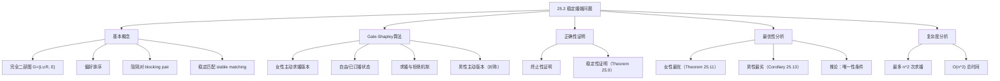
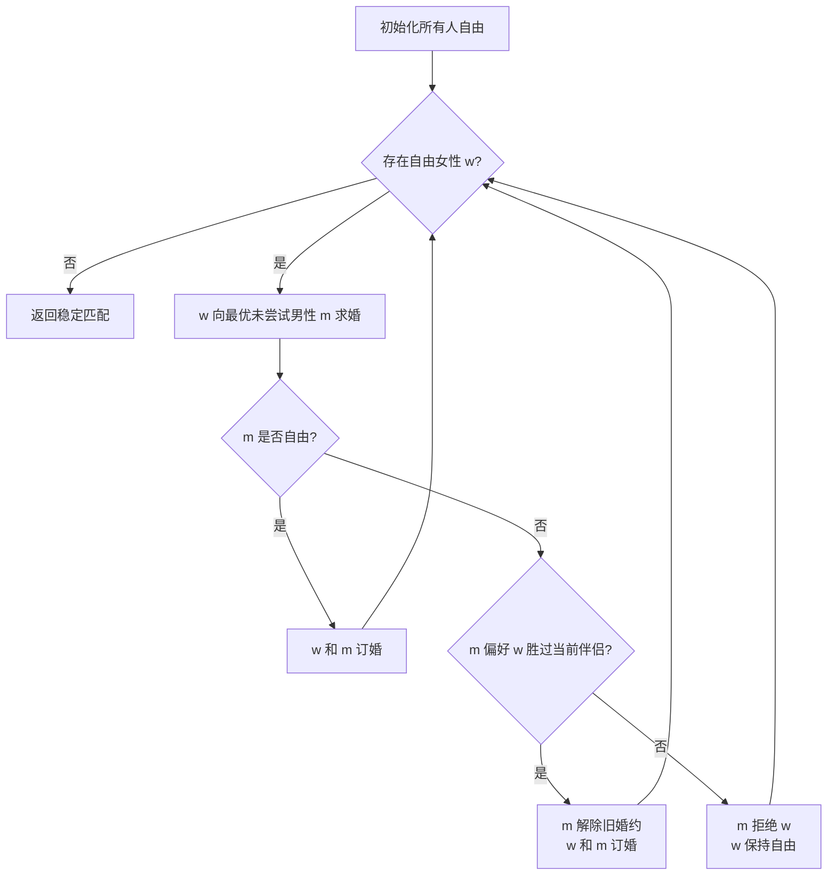

## 相关笔记

- 前置笔记：[[25.1 二部图中的最大匹配（重温）]]
- 关联概念：[[24.3 最大二分匹配]]、[[第24章_最大流-章节汇总]]
- 后续笔记：[[25.3 匈牙利算法]]
- 章节汇总：[[第25章_二部图匹配-章节汇总]]

> [!abstract] 概览
> 本节研究==稳定婚姻问题==（Stable Marriage Problem）：给定n个女性和n个男性，每个人对另一方的所有成员有一个严格的偏好排序，目标是找到一个==完美匹配==使得不存在==阻隔对==（blocking pair）。Gale和Shapley在1962年提出了==Gale-Shapley算法==（也称==延迟接受算法==），该算法不仅总能找到稳定匹配，而且具有深刻的结构性质：求婚方获得所有稳定匹配中的最优伴侣，被求婚方则获得最劣伴侣。算法的时间复杂度为 ==$O(n^2)$==。
>
> **要点列表：**
> - ==阻隔对==（blocking pair）指一对未匹配的男女，他们各自比当前伴侣更偏好对方
> - ==稳定匹配==是不存在阻隔对的完美匹配
> - ==Gale-Shapley算法==（延迟接受算法）总能找到稳定匹配
> - 算法有"女性主动"和"男性主动"两个对称版本
> - 女性最优性质（Theorem 25.11）：女性主动版本中，每位女性获得所有稳定匹配中的最优伴侣
> - 男性最劣性质（Corollary 25.13）：女性主动版本中，每位男性获得所有稳定匹配中的最劣伴侣
> - 时间复杂度为 ==$O(n^2)$==

---

## 知识结构总览



---

## 核心思想

> [!tip] 核心思路
> 稳定婚姻问题的核心矛盾是：每个人对伴侣有自己的偏好，但匹配必须"稳定"——没有人有动力偏离当前匹配。这就像给n个女生和n个男生安排舞伴，每个人都有一份心仪名单，我们需要找到一种配对方式，使得不会出现"两个人都觉得跟对方跳舞比跟当前舞伴跳舞更好"的情况。Gale-Shapley算法通过"延迟接受"机制巧妙地解决这个问题：让一方（如女性）主动求婚，另一方（男性）暂时接受但可以"升级"到更好的求婚者。被拒绝的女性继续向名单上下一个人求婚，直到所有人都订婚为止。

### 问题的形式化定义

> [!def] 稳定婚姻问题（Stable Marriage Problem）
> 给定一个==完全二部图== G = (V, E)，其中 V = L ∪ R，L和R各含n个顶点。L中的每个顶点（女性）对R中所有顶点有一个==严格的偏好排序==，R中的每个顶点（男性）对L中所有顶点也有一个严格的偏好排序。目标是找到一个==完美匹配== M（即每个顶点恰好被匹配一次），使得M中不存在==阻隔对==。
>
> **直观理解：** 想象一个班级里有n个女生和n个男生，每个女生心中有一个男生排名（从最心仪到最不心仪），每个男生心中也有一个女生排名。我们需要把每个人都配对，使得配对结果是"稳定的"——不会有一对男女私下觉得"我们俩在一起比现在的伴侣更好"。

### 阻隔对与稳定匹配

> [!def] 阻隔对（Blocking Pair）
> 给定一个完美匹配M，如果存在女性w和男性m满足以下三个条件，则称(w, m)为一个==阻隔对==：
> 1. w和m在M中没有相互匹配
> 2. w偏好m胜过她在M中的伴侣
> 3. m偏好w胜过他在M中的伴侣
>
> **直观理解：** 阻隔对就是"有私奔动机的一对"。如果w觉得m比现在的男朋友好，同时m也觉得w比现在的女朋友好，那他们就有动机抛弃各自的伴侣在一起，这就"阻隔"了当前匹配的稳定性。

> [!def] 稳定匹配（Stable Matching）
> 一个完美匹配M被称为==稳定匹配==，如果M中不存在任何阻隔对。如果存在阻隔对，则M是==不稳定匹配==。
>
> **关键事实：** 一个稳定婚姻问题的实例可能存在多个不同的稳定匹配，也可能只存在唯一一个稳定匹配。

### 示例：唯一稳定匹配

考虑4个女性（Wanda, Emma, Lacey, Karen）和4个男性（Oscar, Davis, Brent, Hank），偏好如下：

- Wanda: Brent, Hank, Oscar, Davis
- Emma: Davis, Hank, Oscar, Brent
- Lacey: Brent, Davis, Hank, Oscar
- Karen: Brent, Hank, Davis, Oscar
- Oscar: Wanda, Karen, Lacey, Emma
- Davis: Wanda, Lacey, Karen, Emma
- Brent: Lacey, Karen, Wanda, Emma
- Hank: Lacey, Wanda, Emma, Karen

该实例存在唯一的稳定匹配：
- Lacey -- Brent
- Wanda -- Hank
- Karen -- Davis
- Emma -- Oscar

验证稳定性：以Karen为例，她偏好Brent和Hank胜过Davis，但Brent偏好Lacey（他的伴侣）胜过Karen，Hank偏好Wanda（他的伴侣）胜过Karen，因此Karen-Brent和Karen-Hank都不是阻隔对。

### 示例：多个稳定匹配

考虑3个女性（Monica, Phoebe, Rachel）和3个男性（Chandler, Joey, Ross），偏好如下：

- Monica: Chandler, Joey, Ross
- Phoebe: Joey, Ross, Chandler
- Rachel: Ross, Chandler, Joey
- Chandler: Phoebe, Rachel, Monica
- Joey: Rachel, Monica, Phoebe
- Ross: Monica, Phoebe, Rachel

该实例存在三个稳定匹配：

| 匹配1 | 匹配2 | 匹配3 |
|:---:|:---:|:---:|
| Monica -- Chandler | Phoebe -- Chandler | Rachel -- Chandler |
| Phoebe -- Joey | Rachel -- Joey | Monica -- Joey |
| Rachel -- Ross | Monica -- Ross | Phoebe -- Ross |

- 匹配1：所有女性获得第一选择，所有男性获得最后选择
- 匹配2：所有男性获得第一选择，所有女性获得最后选择
- 匹配3：所有人都获得第二选择

---

Gale-Shapley算法

> [!def] Gale-Shapley算法（延迟接受算法，Deferred Acceptance Algorithm）
> Gale-Shapley算法通过迭代求婚过程找到稳定匹配。以下是==女性主动==版本：
>
> **初始化：** 所有女性和男性都标记为"自由"（free）
>
> **核心循环：** 只要存在自由女性w，执行以下操作：
> 1. w向她偏好列表中尚未拒绝过她的第一个男性m求婚
> 2. 如果m是自由的，w和m订婚（双方变为非自由）
> 3. 如果m已订婚但偏好w胜过当前伴侣w'，则m解除与w'的婚约（w'变为自由），w和m订婚
> 4. 如果m已订婚且偏好当前伴侣胜过w，则m拒绝w（w保持自由）
>
> **终止：** 当所有人都已订婚时，返回所有订婚对构成的匹配

> [!tip] 算法执行流程
> 1. **初始化**：所有人和男性都标记为自由（未婚）
> 2. 取一个**自由女性** w
> 3. w 向她偏好列表中**尚未拒绝过她的最优男性** m 求婚
> 4. 若 m **自由**：w 和 m 订婚；若 m **已订婚且偏好 w**：m 解除旧婚约，与 w 订婚；否则 m **拒绝** w
> 5. 重复步骤2-4，直到**所有女性都已订婚**



```
GALE-SHAPLEY(men, women, rankings)
为每个女性和男性标记为 free
1  while 存在自由女性 w
2      令 m 为 w 的偏好列表中她尚未求婚的第一个男性
3      if m 是 free
4          w 和 m 订婚（双方变为非 free）
5      elseif m 偏好 w 胜过当前伴侣 w'
6          m 解除与 w' 的婚约（w' 变为 free）
7          w 和 m 订婚（双方变为非 free）
8      else m 拒绝 w（w 保持 free）
9  return 由所有订婚对构成的稳定匹配
```

### 算法执行示例

以4女4男的唯一稳定匹配实例为例，算法执行过程如下：

1. Wanda向Brent求婚。Brent是自由的，两人订婚
2. Emma向Davis求婚。Davis是自由的，两人订婚
3. Lacey向Brent求婚。Brent已与Wanda订婚，但偏好Lacey胜过Wanda。Brent解除与Wanda的婚约，与Lacey订婚。Wanda变为自由
4. Karen向Brent求婚。Brent已与Lacey订婚，偏好Lacey胜过Karen。Brent拒绝Karen
5. Karen向Hank求婚。Hank是自由的，两人订婚
6. Wanda向Hank求婚。Hank已与Karen订婚，但偏好Wanda胜过Karen。Hank解除与Karen的婚约，与Wanda订婚。Karen变为自由
7. Karen向Davis求婚。Davis已与Emma订婚，但偏好Karen胜过Emma。Davis解除与Emma的婚约，与Karen订婚。Emma变为自由
8. Emma向Hank求婚。Hank已与Wanda订婚，偏好Wanda胜过Emma。Hank拒绝Emma
9. Emma向Oscar求婚。Oscar是自由的，两人订婚

此时所有人都已订婚，算法终止。返回的稳定匹配为：Lacey--Brent, Wanda--Hank, Karen--Davis, Emma--Oscar。

> [!tip] 关键观察
> - 一旦男性订婚，他将永远保持订婚状态（虽然伴侣可能更换）
> - 女性可能被拒绝后重新变为自由，然后继续向偏好列表中的下一个人求婚
> - 每位女性最多向n个男性各求婚一次，因此总求婚次数不超过 **n的平方**
> - 算法中第2行可以选择任意自由女性，不影响最终结果（Theorem 25.11）

---

正确性证明

> [!def] 定理25.9（Gale-Shapley算法的正确性）
> GALE-SHAPLEY过程==总能终止==，且返回的匹配是==稳定匹配==。因此，稳定匹配==总是存在==的。
>
> **证明分两部分：终止性和稳定性。**
>
> > **【反证法+终止性论证（自由女性⇒所有男性已订婚⇒矛盾）】** 终止性（反证法：自由女性→所有男性已订婚→矛盾）+ 稳定性（反证法：假设阻隔对→分析m'对w的处理→m'最终伴侣更优→矛盾）
>
> **第一部分：终止性。**
> 用反证法。假设while循环不终止，则存在某个女性始终是自由的。一个女性保持自由的条件是她已经向所有男性求婚但都被拒绝。一个男性拒绝女性的前提是他已经订婚。因此所有男性都已订婚。一旦订婚，男性将永远保持订婚状态（虽然伴侣可能更换）。由于男性和女性数量相等（都是n），如果所有男性都已订婚，则所有女性也都已订婚，这与"存在自由女性"矛盾。
>
> > **【终止性核心推理（自由女性→所有男性订婚→所有女性订婚→矛盾）】**核心推理链：自由女性存在的必要条件是所有男性都已订婚，而所有男性订婚推出所有女性也已订婚，形成矛盾。
>
> 此外，while循环的迭代次数有上界：每个女性最多向n个男性各求婚一次，因此总迭代次数不超过 $n^2$。
>
> **第二部分：稳定性。**
> 需要证明返回的匹配中不存在阻隔对。
>
> 首先观察一个关键性质：一旦男性m与女性w订婚，此后m的所有行为都发生在第6-8行。因此，一旦男性订婚，他将永远保持订婚状态，且每次更换伴侣都是换成一个他更偏好的女性。
>
> > **【单调升级性质（男性每次换伴侣都是偏好升级，最终伴侣是最优订婚对象）】**，且每次换伴侣都是"升级"——新伴侣比旧伴侣更受偏好。这意味着男性的最终伴侣是他所有订婚对象中最偏好的。
>
> 假设女性w在最终匹配中与男性m配对，但w偏好男性m'胜过m。我们需要证明(w, m')不是阻隔对，即证明m'不偏好w胜过他的最终伴侣。
>
> 由于w偏好m'胜过m，w在向m求婚之前一定已经向m'求过婚。当时m'对w的处理有两种可能：
> - **情况1：** m'拒绝了w的求婚。这说明m'当时已经与某个他偏好胜过w的女性订婚。
> - **情况2：** m'接受了w的求婚但后来解除了婚约。这说明m'后来接受了某个他偏好胜过w的女性的求婚。
>
> 无论哪种情况，m'最终都与一个他偏好胜过w的女性在一起。因此，虽然w可能偏好m'胜过m，但m'并不偏好w胜过他的最终伴侣。(w, m')不是阻隔对。
>
> > **【阻隔对排除（w偏好m'→w曾求婚→m'最终伴侣更优→(w,m')不构成阻隔对）】**
>
> **结论：** GALE-SHAPLEY过程总能终止并返回一个稳定匹配，从而证明了稳定匹配总是存在的。

---

最优性分析

> [!def] 定理25.11（女性最优性质）
> 无论GALE-SHAPLEY过程中第2行如何选择自由女性，过程==总是返回同一个稳定匹配==，且在这个稳定匹配中，每位女性获得了==所有稳定匹配中==她能获得的==最优伴侣==。
>
> **证明思路：** 用反证法。假设GALE-SHAPLEY返回稳定匹配M，但存在另一个稳定匹配M'中某女性w偏好她的伴侣m'胜过M中的伴侣m。
>
> > **【反证法+最小反例（假设存在更优稳定匹配→构造阻隔对→矛盾）】**
>
> 由于w偏好m'胜过m，w在向m求婚之前一定已经向m'求过婚。当时m'对w的处理有两种可能：
> - m'当时已经与某个女性w''订婚，且m'偏好w''胜过w
> - m'接受了w的求婚但后来为了w''解除了与w的婚约
>
> 不失一般性，假设这是所有稳定匹配中第一次出现"某男性拒绝了属于某个稳定匹配的伴侣"的时刻。
>
> > **【最小反例假设（首次拒绝时刻确保w''无更优稳定匹配伴侣）】**——假设这是所有稳定匹配中第一次出现"某男性拒绝了属于某个稳定匹配的伴侣"的时刻。这一假设确保w''不可能在某个稳定匹配中有比m'更偏好的伴侣，否则就存在更早的拒绝时刻，矛盾。
>
> 那么w''在任何稳定匹配中都不可能有一个她偏好胜过m'的伴侣。如果存在这样的男性m''，则w''在向m'求婚之前一定先向m''求过婚并被拒绝，这意味着m''之前拒绝了属于某个稳定匹配的伴侣，与"这是第一次"的假设矛盾。
>
> 既然w''在任何稳定匹配中都不偏好任何人胜过m'，且w''在M中不与m'配对（因为m'在M中与w配对），那么w''偏好m'胜过她在M中的伴侣。同时m'偏好w''胜过w（因为m'选择了w''而不是w）。因此(w'', m')是M中的阻隔对，与M是稳定匹配矛盾。
>
> > **【阻隔对构造（w''在M中偏好m'胜过伴侣 + m'偏好w''胜过w → (w'',m')是阻隔对）】**（由"最小反例"假设）→ w''在M中不与m'配对 → w''偏好m'胜过M中的伴侣 → m'偏好w''胜过w（因为m'选择了w''）→ (w'', m')构成M的阻隔对 → 与M是稳定匹配矛盾。
>
> 由于我们没有对第2行的选择施加任何条件，这说明所有可能的执行顺序都返回同一个稳定匹配。

> [!def] 推论25.12（存在其他稳定匹配）
> 存在GALE-SHAPLEY过程==不会返回==的稳定匹配。
>
> **证明：** 定理25.11表明对于给定的一组偏好，GALE-SHAPLEY只返回一个匹配。前面3女3男的例子说明同一组偏好可以对应多个不同的稳定匹配。因此GALE-SHAPLEY只能返回这些稳定匹配中的一个。

> [!def] 推论25.13（男性最劣性质）
> 在GALE-SHAPLEY返回的稳定匹配中（女性主动版本），每位男性获得了==所有稳定匹配中==他能获得的==最劣伴侣==。
>
> **证明思路：** 设M是GALE-SHAPLEY返回的匹配。假设存在另一个稳定匹配M'中某男性m偏好他在M'中的伴侣w'胜过他在M中的伴侣w。设w'在M中的伴侣为m'。由定理25.11（女性最优性质），m'是w'在所有稳定匹配中的最优伴侣，因此w'偏好m'胜过m。既然m偏好w'胜过w，且w'偏好m'胜过m，则(w', m')是M'中的阻隔对，与M'是稳定匹配矛盾。
>
> > **【反证法+最优性传递（男性更优伴侣⇒女性最优性质⇒阻隔对⇒矛盾）】**
>
> > **【最优性传递链（m偏好w'→w'最优伴侣是m'→w'偏好m'→(w',m)是M'阻隔对）】**：若m在M'中有更优伴侣w'，则w'在M中的伴侣m'是w'在所有稳定匹配中的最优（由定理25.11），因此w'偏好m'胜过m。而m偏好w'胜过w（假设），所以(w', m)构成M'的阻隔对，与M'稳定矛盾。

> [!tip] 定理25.11与推论25.13的对称性
> 女性最优 = 男性最劣，这是一个深刻的对称性。如果改为男性主动求婚版本，则结论完全反转：男性获得最优伴侣，女性获得最劣伴侣。这说明==谁主动求婚，谁就占据优势==。这个结论在实际应用中有重要的机制设计含义——NRMP（美国住院医师匹配计划）采用的就是"申请者（学生）主动"版本，保护了医学生的利益。

---

复杂度分析

> [!def] 推论25.10（时间复杂度）
> 给定n个女性和n个男性的偏好排序，Gale-Shapley算法可以在 ==$O(n^2)$== 时间内实现。
>
> **分析：**
> - 每位女性最多向n个男性各求婚一次，总求婚次数不超过 $n^2$
> - 每次求婚操作（查找下一个未求婚的男性、比较偏好、更新状态）可以在O(1)时间内完成
> - 前提：偏好列表需要预处理，使得对每个女性可以O(1)找到下一个未求婚的男性，对每个男性可以O(1)比较两个女性的偏好高低
> - 预处理方法：为每个男性维护一个数组 rank[w]，表示他对女性w的偏好排名，比较时只需比较 rank[w1] 和 rank[w2]
> - 预处理本身需要 $O(n^2)$ 时间（读取所有偏好列表）
>
> **总时间：** $O(n^2)$（包括预处理和算法执行）

---

补充理解与拓展

> [!info] Gale-Shapley算法的历史与诺贝尔奖
>
> **原始论文：** David Gale和Lloyd Shapley于1962年在《American Mathematical Monthly》上发表了经典论文"College Admissions and the Stability of Marriage"。这篇论文开创了==匹配理论==（Matching Theory）这一研究领域。论文同时讨论了两个相关问题：大学录取（多对一匹配）和婚姻匹配（一对一匹配），并提出了延迟接受算法来求解这两个问题。
>
> **2012年诺贝尔经济学奖：** Lloyd Shapley与Alvin Roth共同获得了201年度瑞典中央银行纪念阿尔弗雷德·诺贝尔经济学奖。Shapley的贡献在于利用==合作博弈论==对匹配市场进行了抽象理论分析，特别是Gale-Shapley算法的提出和稳定匹配性质的证明。Roth的贡献在于将匹配理论从抽象理论发展为==实际市场设计==的工具，他在1980年代发现了NRMP使用的算法正是Gale-Shapley算法的变体，并随后参与了纽约市公立学校录取系统、波士顿学校录取系统等多个实际匹配机制的设计与改进。
>
> 来源：Gale, D. & Shapley, L.S. (1962), "College Admissions and the Stability of Marriage", American Mathematical Monthly, Vol. 69, No. 1, pp. 9-15. https://www.jstor.org/stable/2312726
>
> 来源：The Royal Swedish Academy of Sciences (2012), "Nobel Prize in Economic Sciences 2012 - Press Release". https://www.nobelprize.org/uploads/2018/06/press_02.pdf

> [!info] NRMP：美国住院医师匹配计划
>
> **背景：** 美国的住院医师匹配由==国家住院医师匹配计划==（National Resident Matching Program, NRMP）负责协调。每年约有4万多名医学生和近3万个住院医师职位参与匹配。
>
> **算法：** NRMP使用的是==Roth-Peranson算法==，这是Gale-Shapley延迟接受算法的改进版本。核心机制是"申请者主动"（applicant-proposing）：每位申请者（医学生）提交一份对医院项目的偏好排名列表，每个医院项目也提交一份对申请者的偏好排名列表。算法首先让每位申请者向其第一志愿医院"提案"，医院接受其配额内最优的申请者并拒绝其余申请者。被拒绝的申请者继续向下一志愿提案，重复此过程直到所有申请者都被临时匹配或列表用尽。
>
> **关键特点：** NRMP允许医院有多个名额（多对一匹配），这是对经典一对一稳定婚姻问题的推广。每个医院h有配额 $r_h$，最多接受 $r_h$ 名申请者。
>
> 来源：NRMP Official Website, "How the Matching Algorithm Works". https://www.nrmp.org/intro-to-the-match/how-matching-algorithm-works/
>
> 来源：Williams, K. (2021), "A Primer on the Game Theory Behind the National Resident Matching Program", Academic Medicine, 96(10), pp. 1362-1366. https://pmc.ncbi.nlm.nih.gov/articles/PMC8368266/

> [!info] 中国高考志愿匹配机制
>
> 中国高考录取是世界上最大规模的集中匹配事件之一，其机制设计与稳定匹配理论密切相关：
>
> **顺序志愿（志愿优先）：** 早期的高考录取采用"志愿优先"机制，类似于串行独裁（serial dictatorship）。每个考生填报若干志愿，录取时按志愿顺序逐个投档。这种机制容易导致高分考生因志愿填报策略不当而落榜，匹配稳定性较差。
>
> **平行志愿：** 2000年代起，各省份逐步推行"平行志愿"改革。平行志愿的核心是"分数优先、遵循志愿"——按考生分数从高到低排序，每位考生依次向其志愿列表中的学校投档。研究表明，平行志愿大幅提高了匹配的稳定性，使各院校录取的学生名次范围更窄、匹配结果更加精确分层。
>
> **内蒙古动态机制：** 内蒙古自治区采用了一种独特的实时动态匹配机制，考生可以在录取过程中实时查看当前匹配状态并动态调整志愿列表，类似于"连续型"的延迟接受机制。
>
> 来源：吴斌珍、钟笑寒 (2012), "高考志愿填报机制与大学招生质量", 经济学(季刊), 第11卷第2期.
>
> 来源：Chen, Y. & Kesten, O. (2017), "College Admissions with Entrance Exams: Centralized versus Decentralized", Journal of Economic Theory, 169, pp. 261-316.

> [!info] 稳定匹配的变体与扩展
>
> **不完全偏好（Incomplete Preferences）：** 经典模型假设每个人对所有另一方成员都有严格的完全偏好排序。实际应用中，参与者可能只愿意接受部分匹配对象（如某些医院只考虑特定背景的申请者），这对应于不完全偏好列表。Gale-Shapley算法可以自然地推广到不完全偏好情况。
>
> **室友匹配问题（Stable Roommates Problem）：** 这是稳定婚姻问题在非二部图上的推广。给定偶数个人，每个人对其他所有人有偏好排序，目标是找到稳定匹配。与稳定婚姻问题不同，==室友匹配问题不一定存在稳定匹配==。Irving (1985)提出了一个$O(n^2)$算法来判断稳定匹配是否存在，若存在则找到一个。Gusfield和Irving (1989)猜想：当偏好随机均匀选取时，稳定匹配以高概率不存在。这一猜想最近已被证明。
>
> **三方匹配（Three-way Matching）：** 三方匹配问题涉及三类参与者（如学生、学校、宿舍），每类参与者对下一类有偏好。Lam和Plaxton (2022)研究了具有循环偏好的三维稳定匹配问题。三方匹配比二维匹配复杂得多，许多基本问题尚未解决。
>
> 来源：Irving, R.W. (1985), "An Efficient Algorithm for the Stable Roommates Problem", Journal of Algorithms, 6(4), pp. 577-595.
>
> 来源：Lam, C.K. & Plaxton, C.G. (2022), "On the Existence of Three-Dimensional Stable Matchings with Cyclic Preferences", Theory of Computing Systems.

---

易混淆点与辨析

> [!warning] 稳定匹配 vs 最优匹配
> **稳定匹配**关注的是匹配的"稳定性"——没有人有动力偏离。稳定匹配可能有多个，且不同的稳定匹配中参与者的伴侣质量不同。
>
> **最优匹配**（如[[25.3 匈牙利算法]]中的最大权完美匹配）关注的是匹配的"总价值最大"——所有配对的效用之和最大。最优匹配不一定稳定，稳定匹配也不一定最优。
>
> **类比：** 稳定匹配像"没有人想离婚的婚姻安排"，最优匹配像"全社会的幸福总和最大的婚姻安排"。前者关注个体激励相容，后者关注全局效率。

> [!warning] 女性最优 vs 全局最优
> **女性最优**（woman-optimal）指的是在==所有稳定匹配==中，每位女性都获得了她能获得的最好伴侣。这并不意味着这个匹配在全局意义上是最优的——事实上，在女性最优稳定匹配中，每位男性反而获得了他在所有稳定匹配中的最差伴侣（推论25.13）。
>
> **全局最优**通常指某种全局度量（如总效用）的最大化，与"某一方最优"是完全不同的概念。
>
> **关键区分：** 女性最优是一个==帕累托最优==概念（在稳定匹配集合内的最优），而非全局最优。

> [!warning] GS算法的求婚方向对结果的影响
> Gale-Shapley算法有"女性主动"和"男性主动"两个版本。==求婚方向决定了哪一方获得最优结果==：
> - 女性主动版本：女性获得所有稳定匹配中的最优伴侣，男性获得最劣伴侣
> - 男性主动版本：男性获得所有稳定匹配中的最优伴侣，女性获得最劣伴侣
>
> 两个版本返回的==不是同一个匹配==（除非只有一个稳定匹配），但它们都是稳定匹配。实际应用中选择哪个版本是一个==公平性问题==，而非技术问题。NRMP选择"申请者主动"版本是出于保护弱势方（医学生）的考虑。

---

习题精选

| 题号 | 题目描述 | 难度 |
|:---:|----------|:---:|
| 25.2-1 | 说明如何实现Gale-Shapley算法使其在$O(n^2)$时间内运行 | ⭐⭐ |
| 25.2-2 | 2女2男的情况下是否可能存在不稳定匹配？ | ⭐ |
| 25.2-3 | 修改GS算法以适应NRMP的多对一匹配场景 | ⭐⭐⭐ |
| 25.2-4 | 证明GS算法产生的稳定匹配具有弱帕累托最优性 | ⭐⭐⭐ |
| 25.2-5 | 室友匹配问题中构造不存在稳定匹配的实例 | ⭐⭐ |

> [!faq]- 25.2-1 解答
> **目标：** 说明如何实现Gale-Shapley算法使其在$O(n^2)$时间内运行。
>
> **实现方案：**
>
> **数据结构：**
> - 为每个女性w维护一个指针 next[w]，指向她偏好列表中下一个尚未求婚的男性。初始时 next[w] = 1。
> - 为每个男性m维护一个数组 rank[m][w]，表示m对女性w的偏好排名。rank[m][w]越小表示m越偏好w。预处理该数组需要$O(n^2)$时间。
> - 为每个男性m维护变量 partner[m]，表示当前伴侣（NIL表示自由）。
> - 用一个栈或队列维护当前所有自由女性的集合。
>
> **算法：**
> - 初始化：所有女性入栈，所有男性的 partner 设为 NIL。预处理 rank 数组。
> - 主循环：当栈非空时，弹出自由女性w，令 m 为 w 的偏好列表中第 next[w] 个男性，next[w]++。
> - 如果 m.partner == NIL，设置 m.partner = w。
> - 否则如果 rank[m][w] < rank[m][m.partner]，令 w' = m.partner，设置 m.partner = w，将 w' 压入栈。
> - 否则（m偏好当前伴侣），w保持自由，继续循环。
>
> **复杂度分析：**
> - 预处理 rank 数组：$O(n^2)$
> - 每位女性最多求婚n次，总求婚次数不超过 $n^2$
> - 每次求婚操作为O(1)（数组查找和比较）
> - 总时间：$O(n^2)$

> [!faq]- 25.2-2 解答
> **目标：** 判断2女2男的情况下是否可能存在不稳定匹配。
>
> **答案：** 是的，可能存在不稳定匹配。
>
> **反例：** 设女性为A, B，男性为X, Y。偏好如下：
> - A: X, Y
> - B: X, Y
> - X: A, B
> - Y: A, B
>
> 考虑匹配 M = {(A, Y), (B, X)}。验证：A偏好X胜过Y，X偏好A胜过B（X的当前伴侣）。因此(A, X)构成阻隔对，M是不稳定匹配。
>
> **注：** 该实例的唯一稳定匹配是 {(A, X), (B, Y)}，其中每个人都获得了第一选择。

> [!faq]- 25.2-3 解答
> **目标：** 修改GS算法以适应NRMP场景——医院可以匹配多名学生，且学生数和医院数不必相等。
>
> **修改方案：**
>
> **模型变化：**
> - 每个医院h有一个配额 $r_h$（$r_h \geq 1$），表示最多接受的学生数
> - 学生数和医院数不必相等
> - 每个学生对所有医院有偏好排序
> - 每个医院对所有学生有偏好排序
>
> **算法修改（学生主动版本）：**
> 1. 所有学生标记为 free，所有医院的已匹配学生列表为空
> 2. while 存在自由学生 s
> 3.     令 h 为 s 的偏好列表中尚未提案的第一个医院
> 4.     if h 的已匹配学生数 < $r_h$
> 5.         s 与 h 订婚（s 变为非 free，加入 h 的匹配列表）
> 6.     elseif h 偏好 s 胜过其已匹配学生中最不偏好的一位 s'
> 7.         h 解除与 s' 的匹配（s' 变为 free）
> 8.         s 与 h 订婚
> 9.     else h 拒绝 s
> 10. return 所有订婚对
>
> **正确性：** 该算法是GS算法的自然推广，终止性和稳定性的证明与原始版本类似。关键变化在于医院可以"持有"多个匹配，拒绝条件变为"已满且新申请者不如当前最差匹配者"。

> [!faq]- 25.2-4 解答
> **目标：** 证明弱帕累托最优性——GS算法（女性主动版本）产生的稳定匹配M中，不存在任何匹配（稳定或不稳定）使得所有女性都获得比M中更偏好的伴侣。
>
> **证明：** 用反证法。假设存在某个匹配M'（不一定是稳定匹配）使得每位女性在M'中的伴侣都比在M中的伴侣更受偏好。
>
> 由于M是GS算法（女性主动版本）返回的匹配，由定理25.11，M是女性最优稳定匹配。因此M'不可能是稳定匹配（否则M'中的女性伴侣不可能全部优于M中的）。
>
> 由于M'不稳定，M'中存在阻隔对(w, m)。这意味着在M'中w与某个不是m的男性配对，且w偏好m胜过M'中的伴侣，m偏好w胜过M'中的伴侣。
>
> 但由假设，w在M'中的伴侣比在M中的伴侣更受偏好，即w偏好M'中的伴侣胜过M中的伴侣。而w偏好m胜过M'中的伴侣，因此w偏好m胜过M中的伴侣。
>
> 同时，m在M'中的伴侣比在M中的伴侣更受偏好（由假设），即m偏好M'中的伴侣胜过M中的伴侣。而m偏好w胜过M'中的伴侣，因此m偏好w胜过M中的伴侣。
>
> 因此(w, m)也是M中的阻隔对，与M是稳定匹配矛盾。
>
> **结论：** 不存在任何匹配使得所有女性都获得比M中更偏好的伴侣。

> [!faq]- 25.2-5 解答
> **目标：** 在室友匹配问题中，构造一个不存在稳定匹配的实例。
>
> **反例：** 考虑4个人——A, B, C, D，偏好如下：
> - A: B, C, D
> - B: C, A, D
> - C: A, B, D
> - D: A, B, C
>
> **分析：** 注意D是所有人的最后选择。共有3种可能的完美匹配：
>
> 匹配1: {A,B}, {C,D}
> - A偏好C胜过B，C偏好A胜过D。因此(A,C)是阻隔对。不稳定。
>
> 匹配2: {A,C}, {B,D}
> - A偏好B胜过C，B偏好C胜过D。因此(A,B)不是阻隔对（B偏好C胜过A）。
> - 但B偏好A胜过D，A偏好C胜过B。因此(B,A)不是阻隔对（A偏好C胜过B）。
> - C偏好B胜过A，B偏好C胜过D。因此(C,B)是阻隔对。不稳定。
>
> 匹配3: {A,D}, {B,C}
> - A偏好B胜过D，B偏好C胜过A。因此(A,B)不是阻隔对。
> - A偏好C胜过D，C偏好A胜过B。因此(A,C)是阻隔对。不稳定。
>
> **结论：** 所有3种完美匹配都不稳定，因此该实例不存在稳定匹配。

---

教材原文

> [!quote] CLRS 第4版 25.2节原文
> If a woman and a man are not matched to each other but each prefers the other over their assigned partner, they form a blocking pair. A blocking pair has incentive to opt out of the assigned pairing and get together on their own. If that were to occur, then this pair would block the matching from being "stable." A stable matching, therefore, is a matching that has no blocking pair.
>
> Theorem 25.9: The procedure GALE-SHAPLEY always terminates and returns a stable matching.
>
> Theorem 25.11: Regardless of how women are chosen in line 2 of GALE-SHAPLEY, the procedure always returns the same stable matching, and in this stable matching, each woman has the best partner possible in any stable matching.
>
> Corollary 25.13: In the stable matching returned by the procedure GALE-SHAPLEY, each man has the worst partner possible in any stable matching.

---

## 参见Wiki

- [[离散数学/concepts/二分匹配]] — 二部图中的匹配问题
- [[离散数学/concepts/最大流]] — 最大流问题与Ford-Fulkerson方法
- [[第25章_二部图匹配/25.3 匈牙利算法]] — 加权二部图上的最优匹配

#学习/算法导论/第25章-二部图匹配 #学习/算法导论/二部图匹配/稳定婚姻问题
