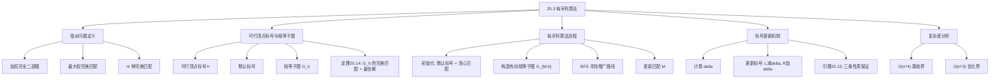
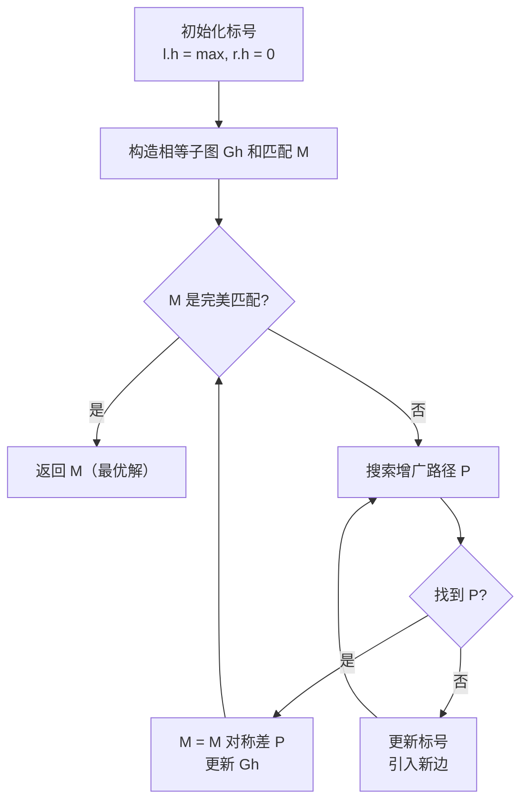
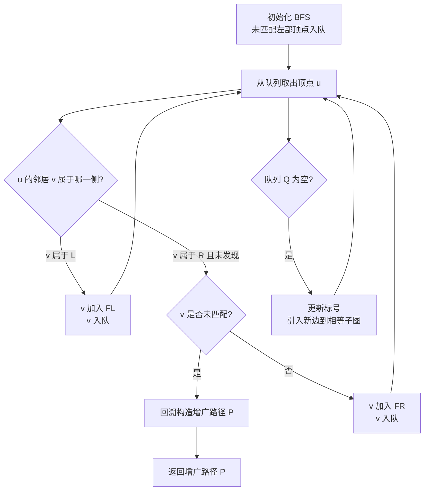

## 相关笔记

- 前置笔记：[[25.1 二部图中的最大匹配（重温）]]、[[25.2 稳定婚姻问题]]
- 关联概念：[[24.3 最大二分匹配]]、[[第24章_最大流-章节汇总]]
- 章节汇总：[[第25章_二部图匹配-章节汇总]]

> [!abstract] 概览
> 本节研究==指派问题==（Assignment Problem）：给定一个==加权完全二部图==，目标是找到一个==完美匹配==使得边权总和最大。==匈牙利算法==（Hungarian Algorithm），也称==Kuhn-Munkres算法==，通过==可行顶点标号==（feasible vertex labeling）和==相等子图==（equality subgraph）的概念，将最优匹配问题转化为在相等子图中寻找完美匹配的问题。算法的核心思想是：在相等子图中反复寻找==增广路径==来扩大匹配，当搜索失败时==更新顶点标号==以引入新边，最终在相等子图中找到完美匹配即为最优解。本节证明 $O(n^4)$ 的时间上界，进一步优化可达 $O(n^3)$。
>
> **要点列表：**
> - ==指派问题==是在加权完全二部图上求最大权完美匹配
> - ==可行顶点标号== h 满足 $l.h + r.h \ge w(l,r)$ 对所有边成立
> - ==相等子图== $G_h$ 包含所有满足 $l.h + r.h = w(l,r)$ 的边
> - 相等子图中的完美匹配就是指派问题的最优解（定理25.14）
> - 算法通过BFS在相等子图中寻找增广路径，失败时更新标号
> - ==标号更新==保证不破坏已有匹配和搜索森林
> - 本节证明时间复杂度 $O(n^4)$，优化后可达 $O(n^3)$

---

## 知识结构总览



---

## 核心思想

> [!tip] 核心思路
> 指派问题的目标是找到"总价值最大"的完美匹配，这与[[25.2 稳定婚姻问题]]追求"稳定性"不同。匈牙利算法的精妙之处在于引入了==顶点标号==这一工具：给每个顶点分配一个数值（标签），使得对于任意一条边(l, r)，两个端点的标签之和不小于边权。满足这个条件的标号称为"可行标号"。在可行标号下，所有满足"标签之和恰好等于边权"的边构成一个子图——"相等子图"。定理25.14保证了相等子图中的完美匹配就是原问题的最优解。算法通过不断调整标号来"激活"新边，在相等子图中逐步扩大匹配，直到找到完美匹配。

### 指派问题的形式化定义

> [!def] 指派问题（Assignment Problem）
> 给定一个==加权完全二部图== G = (V, E)，其中 $V = L \cup R$，L和R各含n个顶点。每条边(l, r)（l属于L, r属于R）关联一个==权重== $w(l, r)$，表示将l与r匹配所获得的效用。目标是找到一个==完美匹配== $M^*$ 使得边权总和最大：
>
> $w(M^*) = \max \{w(M) : M \text{ 是完美匹配}\}$
>
> 其中 $w(M) = \sum_{(l,r) \in M} w(l, r)$。
>
> **直观理解：** 想象有n个工人和n个任务，每个工人做每个任务有一个效率评分（边权）。我们需要给每个工人分配恰好一个不同的任务，使得总效率最高。这就是指派问题。
>
> **与最大流的关系：** 指派问题是[[24.3 最大二分匹配]]中无权最大匹配问题的加权版本。无权匹配可以用最大流求解，加权匹配则需要更精细的工具。

### 可行顶点标号

> [!def] 可行顶点标号（Feasible Vertex Labeling）
> 给完全二部图 G = ($L \cup R$, E) 的每个顶点v分配一个数值 v.h（称为v的==标签==）。如果标号 h 满足以下条件，则称 h 为一个==可行顶点标号==：
>
> $l.h + r.h \ge w(l, r)$，对所有 $l \in L$, $r \in R$
>
> 即对于任意一条边，其两端标签之和不小于该边的权重。
>
> **默认顶点标号：** 以下标号总是可行的：
> - 对每个 $l \in L$：$l.h = \max \{w(l, r) : r \in R\}$（l连接的所有边中的最大权重）
> - 对每个 $r \in R$：$r.h = 0$
>
> **验证：** 对任意 $l \in L$, $r \in R$，有 $l.h + r.h = l.h + 0 = \max \{w(l, r')\} \ge w(l, r)$。因此默认标号总是可行的。
>
> **直观理解：** 可以把顶点标号想象成每个参与者的"期望值"。可行标号要求任何一对(l, r)的期望值之和不低于他们实际能产生的价值。

### 相等子图

> [!def] 相等子图（Equality Subgraph）
> 给定可行顶点标号 h，==相等子图== $G_h = (V, E_h)$ 是G的子图，包含与G相同的顶点集V，但只包含满足以下条件的边：
>
> $E_h = \{(l, r) \in E : l.h + r.h = w(l, r)\}$
>
> 即只保留那些"标签之和恰好等于边权"的边。
>
> **直观理解：** 在"期望值"的类比中，相等子图包含的是"期望值恰好等于实际价值"的配对——这些配对是"物有所值"的。

### 核心定理：相等子图中的完美匹配就是最优解

> [!def] 定理25.14（相等子图与最优解的关系）
> 设 G = (V, E)（$V = L \cup R$）是完全二部图，每条边(l, r)有权重 $w(l, r)$。设 h 是G的一个可行顶点标号，$G_h$ 是对应的相等子图。如果 $G_h$ 包含一个完美匹配 $M^*$，则 $M^*$ 是G上指派问题的==最优解==。
>
> **证明：**
>
> **【上界论证（标号之和≥任意匹配权重，相等子图完美匹配达到上界）】**
>
> 由于 $M^*$ 是 $G_h$ 的完美匹配，$M^*$ 中的每条边(l, r)都属于 $E_h$，因此 $l.h + r.h = w(l, r)$。
>
> 对 $M^*$ 中所有边求和：
> $w(M^*) = \sum_{(l,r) \in M^*} w(l,r) = \sum_{(l,r) \in M^*} (l.h + r.h)$
>
> 由于 $M^*$ 是完美匹配，每个顶点恰好出现一次，因此：
> $w(M^*) = \sum_{l \in L} l.h + \sum_{r \in R} r.h$
>
> > **【完美匹配求和拆分（每个顶点恰好出现一次→标号之和=匹配权重）】** → 求和可拆分为左部标号之和 + 右部标号之和 → 这个和就是任意完美匹配权重的上界。

> 设 M 是G中的任意完美匹配，由于 h 是可行标号：
> 对M中每条边(l,r)，有 $l.h + r.h \ge w(l,r)$
>
> 对M中所有边求和：
> $\sum_{l \in L} l.h + \sum_{r \in R} r.h \ge w(M)$
>
> > **【可行标号上界（每条边标签之和不小于边权→求和得标号总和≥任意匹配权重）】** → 对所有边求和得标号总和 ≥ 任意匹配权重 → 而 $M^*$ 恰好达到这个上界 → $M^*$ 是最优解。

> 因此 $w(M^*) \ge w(M)$ 对所有完美匹配 M 成立。$M^*$ 是最优解。

> [!tip] 定理25.14的直观含义
> 定理25.14建立了一个深刻的对偶关系：**最大权匹配的权重 = 最小可行标号之和**。这与[[24.1 流网络]]中的最大流最小割定理有异曲同工之妙——都是将一个优化问题与其"对偶"问题联系起来。最大权匹配是"原始问题"，最小可行标号之和是"对偶问题"，两者在最优解处相等。

---

匈牙利算法

### 算法整体流程

匈牙利算法的目标是在某个相等子图中找到完美匹配。算法的关键洞察是：我们有自由选择使用哪个相等子图，甚至可以在算法执行过程中动态改变相等子图。

> [!tip] 算法执行流程
> 1. **初始化标号**：左部 l.h = max{w(l,r)}，右部 r.h = 0
> 2. 在相等子图 Gh 中找**任意匹配** M（如贪心匹配）
> 3. M 是**完美匹配**? → 返回 M（即为最优解）
> 4. 在有向相等子图中**搜索增广路径** P
> 5. 找到 P → M = M 对称差 P → 更新相等子图 → 回到步骤3



```
HUNGARIAN(G)
1  for 每个 l ∈ L
2      l.h = max{w(l, r) : r ∈ R}    // 默认标号
3  for 每个 r ∈ R
4      r.h = 0                            // 默认标号
5  令 M 为 Gh 中的任意匹配（如 GREEDY-BIPARTITE-MATCHING 返回的匹配）
6  由 G, M, h 构造相等子图 Gh 和有向相等子图 G_{M,h}
7  while M 不是 Gh 中的完美匹配
8      P = FIND-AUGMENTING-PATH(G_{M,h})
9      M = M ⊕ P                         // 对称差更新匹配
10     更新相等子图 Gh 和有向相等子图 G_{M,h}
11 return M
```

### 有向相等子图

> [!def] 有向相等子图（Directed Equality Subgraph）
> 给定相等子图 $G_h$ 和匹配 M，==有向相等子图== $G_{M,h} = (V, E_{M,h})$ 是将 $G_h$ 中的边按如下规则定向后得到的有向图：
>
> - M中的边从R指向L：$\{(r, l) : r \in R, l \in L, \text{且 } (l, r) \in M\}$
> - 不在M中的边从L指向R：$\{(l, r) : l \in L, r \in R, \text{且 } (l, r) \in E_h - M\}$
>
> **直观理解：** 有向相等子图的设计使得==M-增广路径==在其中具有统一的方向：从L中的未匹配顶点出发，沿非匹配边（L→R）前进，沿匹配边（R→L）前进，最终到达R中的未匹配顶点。

### 贪心最大匹配初始化

```
GREEDY-BIPARTITE-MATCHING(G)
1  M = 空集
2  for 每个 l ∈ L
3      if l 在 R 中有未匹配的邻居
4          选择任意一个这样的未匹配邻居 r ∈ R
5          M = M ∪ {(l, r)}
6  return M
```

> [!tip] 贪心匹配的质量保证
> 虽然贪心匹配不一定是最优的，但可以证明它返回的匹配大小至少是最大匹配的一半（习题25.3-2）。这意味着匈牙利算法的while循环最多需要 **n的一半** 次迭代就能从贪心匹配扩展到完美匹配。

### 寻找增广路径

> [!tip] 算法执行流程
> 1. **BFS 初始化**：从所有未匹配的左部顶点出发，加入队列 Q
> 2. **BFS 扩展**：从队列取出顶点 u，沿有向相等子图的边搜索邻居 v
> 3. 若队列**空但未找到**增广路径 → **更新标号**（计算 delta，调整 FL 和 FR 的标签）→ 引入新边 → 继续搜索
> 4. 找到**未匹配的右部顶点** → 利用前驱属性 **回溯构造增广路径** P → 返回 P



```
FIND-AUGMENTING-PATH(G_{M,h})
1  Q = 空队列
2  F_L = 空集
3  F_R = 空集
4  for 每个 L 中的未匹配顶点 l
5      l.π = NIL
6      ENQUEUE(Q, l)
7      F_L = F_L ∪ {l}                    // 森林 F 以 L 中的未匹配顶点为根
8  repeat
9      if Q 为空                          // 队列空了还没找到增广路径？
10         δ = min{l.h + r.h - w(l,r) : l ∈ F_L, r ∈ R - F_R}
11         for 每个 l ∈ F_L
12             l.h = l.h - δ           // 按公式(25.5)更新标号
13         for 每个 r ∈ F_R
14             r.h = r.h + δ           // 按公式(25.5)更新标号
15         由 G, M, h 构造新的有向相等子图 G_{M,h}
16         for 每条 G_{M,h} 中的新边 (l, r)
17             if r ∉ F_R
18                 r.π = l               // 发现 r，加入森林
19                 if r 是未匹配的
20                     找到了 M-增广路径（退出循环）
21                 else ENQUEUE(Q, r)      // 稍后从 r 继续搜索
22                 F_R = F_R ∪ {r}
23     u = DEQUEUE(Q)                     // 从 u 继续搜索
24     for G_{M,h} 中 u 的每个邻居 v
25         if v ∈ L
26             v.π = u
27             F_L = F_L ∪ {v}            // 发现 v，加入森林
28             ENQUEUE(Q, v)              // 稍后从 v 继续搜索
29         elseif v ∉ F_R            // v ∈ R，执行与第18-22行相同的操作
30             v.π = u
31             if v 是未匹配的
32                 找到了 M-增广路径（退出循环）
33             else ENQUEUE(Q, v)
34             F_R = F_R ∪ {v}
35 until 找到了 M-增广路径
36 利用前驱属性 π，从 R 中的未匹配顶点回溯构造 M-增广路径 P
37 return P
```

---

标号更新机制

当BFS队列变空但尚未找到增广路径时，算法需要更新可行顶点标号以引入新边。

> [!def] 标号更新规则
> 当搜索在队列变空时停滞，设 $F_L = L \cap F$（BFS森林中属于L的顶点），$F_R = R \cap F$（BFS森林中属于R的顶点）。计算：
>
> $\delta = \min \{l.h + r.h - w(l, r) : l \in F_L, r \in R - F_R\}$
>
> 然后更新标号：
> - 对每个 $l \in F_L$：$l.h = l.h - \delta$
> - 对每个 $r \in F_R$：$r.h = r.h + \delta$
>
> 其余顶点的标号不变。

> [!def] 引理25.15（标号更新的三条性质）
> 设 h 是完全二部图 G 的可行顶点标号，$G_h$ 是对应的相等子图，M 是 $G_h$ 中的匹配，F 是正在为 $G_{M,h}$ 构建的BFS森林。则更新后的标号 $h'$ 满足：
>
> **性质1：** 如果(u, v)是BFS森林F中的边，则(u, v)仍然属于 $E_{M,h'}$（更新后的有向相等子图）。
>
> **性质2：** 如果(l, r)属于匹配M，则(r, l)仍然属于 $E_{M,h'}$。
>
> **性质3：** 存在 $l \in F_L$ 和 $r \in R - F_R$ 使得 $(l, r)$ 不属于 $E_{M,h}$ 但 $(l, r)$ 属于 $E_{M,h'}$。即至少有一条新边进入有向相等子图。
>
> **证明思路：**
>
> **【分类验证（可行性→森林边保留→匹配边保留→新边进入）】**
>
> **可行性：** 首先证明 $h'$ 仍然是可行标号。唯一可能违反可行性的是 $l \in F_L$ 且 $r \in R - F_R$ 的边，此时 $l.h' + r.h' = l.h - \delta + r.h$。由 $\delta$ 的定义，$l.h - \delta + r.h \ge w(l,r)$，因此 $h'$ 仍然是可行标号。对于其他边，标签之和不变或增大，可行性自然满足。
>
> > **【可行性验证（$\delta$取最小差值保证减少后标签之和仍≥边权）】**、$R - F_R$ 中标签不变这两类边可能违反可行性 → 由 $\delta$ 的定义（取最小差值）保证减少后仍 ≥ 边权 → 其余边标签之和不变或增大，自然满足。
>
> **性质1：** 如果 $l \in F_L$ 且 $r \in F_R$，则 $l.h' + r.h' = (l.h - \delta) + (r.h + \delta) = l.h + r.h$，标签之和不变，因此F中的边仍然在 $E_{M,h'}$ 中。
>
> > **【森林边保留（$F_L$减$\delta$与$F_R$加$\delta$抵消，标签之和不变）】** → 两者抵消 → 森林边的标签之和不变 → 森林边保留。
>
> **性质2：** 可以证明在计算 $h'$ 时，对于匹配M中的每条边(l, r)，有 $l \in F_L$ 当且仅当 $r \in F_R$。因此 $l.h' + r.h' = l.h + r.h$，匹配边仍然在 $E_{M,h'}$ 中。
>
> > **【匹配边保留（BFS沿匹配边传播保证 $l \in F_L \Leftrightarrow r \in F_R$）】**（因为BFS沿匹配边从R到L传播发现）→ 标签之和不变 → 匹配边保留。
>
> **性质3：** 由 $\delta$ 的定义，存在 $l \in F_L$ 和 $r \in R - F_R$ 使得 $\delta = l.h + r.h - w(l,r)$。此时 $l.h' + r.h' = l.h - \delta + r.h = w(l,r)$，因此 $(l, r)$ 属于 $E_{h'}$。由于 $r \notin F_R$，$(l, r)$ 不在M中（否则由性质2的证明 $r$ 应属于 $F_R$），因此在 $E_{M,h'}$ 中 $(l, r)$ 从L指向R。
>
> > **【新边进入（$\delta$最小差值边标签之和=边权→进入相等子图且从L指向R）】** → 达到最小值的边标签之和恰好等于边权 → 该边进入相等子图 → 且不在M中（否则 $r \in F_R$，矛盾）→ 从L指向R的新边出现。

> [!tip] 标号更新的直观理解
> 标号更新可以理解为"微调期望值"：降低已发现顶点（**已发现的左部顶点集合**）的期望，提高已到达顶点（**已到达的右部顶点集合**）的期望。这种调整使得某些之前"不够划算"的边变得"刚好划算"，从而引入新边供搜索继续。同时，已经建立的匹配关系和搜索路径不受影响。

---

复杂度分析

> [!def] 时间复杂度：$O(n^4)$（本节证明），可优化至 $O(n^3)$
>
> 设 $|V| = n/2$（即 L 和 R 各有 $n/2$ 个顶点），$|E| = n^2/4$（完全二部图的边数）。
>
> **分析（$O(n^4)$ 上界）：**
>
> 1. **初始化（第1-6行）：** 计算默认标号需要 $O(n^2)$ 时间（每条边检查一次）。贪心匹配需要 $O(n^2)$ 时间。构造相等子图需要 $O(n^2)$ 时间。总计 $O(n^2)$。
>
> 2. **while循环次数：** 每次迭代使匹配M的大小增加1（通过增广路径），从贪心匹配（至少 $n/4$ 条边）到完美匹配（$n/2$ 条边），最多迭代 $n/4$ 次。
>
> 3. **每次 FIND-AUGMENTING-PATH 调用：**
>    - BFS部分（忽略标号更新）：$O(V + E) = O(n^2)$ 时间
>    - 标号更新（"增长步"）：每次调用中最多发生 $n/2$ 次增长步（每次至少发现R中的一个新顶点）
>    - 每次增长步中，第10行计算 $\delta$ 需要 $O(n^2)$ 时间（遍历所有 $F_L \times (R - F_R)$ 的边）
>    - 第15行重建有向相等子图需要 $O(n^2)$ 时间
>    - 因此每次 FIND-AUGMENTING-PATH 调用需要 $O(n^2)$（BFS）+ $(n/2) \times O(n^2)$（增长步）= $O(n^3)$ 时间
>
> 4. **总时间：** $O(n^2)$（初始化）+ $(n/2) \times O(n^3)$（while循环）= $O(n^4)$。
>
> **优化至 $O(n^3)$：**
> - 习题25.3-5指出第15行重建有向相等子图是不必要的，可以省去 $O(n^2)$ 的开销
> - 问题25-2要求将第10行计算 $\delta$ 的开销降至 $O(n)$，使用优先队列等数据结构
> - 优化后每次 FIND-AUGMENTING-PATH 调用降至 $O(n^2)$ 时间，总时间降至 $O(n^3)$

---

补充理解与拓展

> [!info] 匈牙利算法的历史
>
> **Kuhn (1955)：** Harold W. Kuhn在1955年发表了论文"The Hungarian Method for the Assignment Problem"，提出了求解指派问题的多项式时间算法。Kuhn将算法命名为"匈牙利方法"，因为算法的核心思想很大程度上基于两位匈牙利数学家——==Denes Konig==和==Jeno Egervary==——早年的工作。Konig在1916年证明了二部图中最大匹配等于最小顶点覆盖的定理，Egervary在1931年将此结果推广到加权情形。
>
> **Munkres (1957)：** James Munkres在1957年对Kuhn的算法进行了简化和改进，使得算法更加清晰易懂，并给出了更精细的复杂度分析。因此该算法也被称为==Kuhn-Munkres算法==。
>
> **后续发展：** 匈牙利算法后来被Edmonds和Johnson等人进一步推广到更一般的赋权匹配问题。算法的对偶解释（原始-对偶方法）也成为了组合优化中的重要范式。
>
> 来源：Kuhn, H.W. (1955), "The Hungarian Method for the Assignment Problem", Naval Research Logistics Quarterly, 2(1-2), pp. 83-97.
>
> 来源：Munkres, J. (1957), "Algorithms for the Assignment and Transportation Problems", Journal of the Society for Industrial and Applied Mathematics, 5(1), pp. 32-38.

> [!info] 匈牙利算法的实际应用
>
> **1. 任务分配（Task Assignment）**
> 最直接的应用场景。给定n个工人和n个任务，每对(工人, 任务)有一个效率或成本评分，匈牙利算法找到总效率最高（或总成本最低）的分配方案。广泛应用于工厂排班、项目管理中的任务分配等场景。
>
> **2. 排班调度（Scheduling）**
> 在排班问题中，工人和班次分别构成二部图的两部分，边权表示工人适合该班次的程度。匈牙利算法可以找到最优的排班方案。类似地，在考试安排、课程调度等问题中也有应用。
>
> **3. 物流路径优化**
> 在物流和运输问题中，将货物、车辆或配送点分别作为二部图的两部分，边权表示运输成本或时间。匈牙利算法可以优化配送方案。指派问题是更一般的运输问题（Transportation Problem）的特例。
>
> **4. 目标跟踪与数据关联（Object Tracking / Data Association）**
> 在计算机视觉的多目标跟踪中，匈牙利算法被广泛用于==数据关联==（Data Association）问题：将当前帧中检测到的目标与上一帧中跟踪的目标进行最优匹配。具体来说，将预测的目标位置和检测到的目标位置分别作为二部图的两部分，边权为IoU（交并比）或其他相似度度量，匈牙利算法找到最优的关联方案。这是SORT（Simple Online and Realtime Tracking）等经典跟踪算法的核心组件。
>
> 来源：Bewley, A. et al. (2016), "Simple Online and Realtime Tracking", IEEE International Conference on Image Processing (ICIP).
>
> 来源：NumberAnalytics (2024), "Kuhn-Munkres Algorithm in Depth". https://www.numberanalytics.com/blog/kuhn-munkres-algorithm-in-depth

---

易混淆点与辨析

> [!warning] 匈牙利算法（匹配）vs 匈牙利算法（指派）
> 在不同文献中，"匈牙利算法"可能指两个不同的算法：
>
> **匈牙利算法（匹配版本）：** 用于求解==无权==二部图中的==最大基数匹配==。这个算法基于交替路径和增广路径的概念，通过反复寻找增广路径来扩大匹配。时间复杂度为 O(VE)。
>
> **匈牙利算法（指派版本 / Kuhn-Munkres算法）：** 用于求解==加权==完全二部图中的==最大权完美匹配==（即指派问题）。这是本节讨论的算法，基于可行顶点标号和相等子图。时间复杂度为 $O(n^3)$。
>
> **区分方法：** 如果问题涉及边权/成本/效用，则是Kuhn-Munkres算法（指派版本）；如果问题只涉及匹配的数量，则是匹配版本。两者都源于匈牙利数学家的工作，但解决的问题不同。

> [!warning] 可行标号 vs 最优标号
> **可行标号**（feasible labeling）只要求 $l.h + r.h \ge w(l,r)$ 对所有边成立。可行标号总是存在的（如默认标号），但不同的可行标号对应的相等子图可能完全不同。
>
> **最优标号**是一个特殊的可行标号，使得标签之和最小。最优标号对应的相等子图包含完美匹配，且该完美匹配就是指派问题的最优解。
>
> **关系：** 匈牙利算法从不最优的可行标号（默认标号）出发，通过逐步降低标签之和来逼近最优标号。每次标号更新都使标签总和不增（$F_L$中的标签减少 $\delta$，$F_R$中的标签增加 $\delta$，但 $|F_L| \ge |F_R|$，因为BFS是分层发现的）。

> [!warning] 相等子图 vs 有向相等子图
> **相等子图** $G_h$ 是一个无向图，包含所有满足 $l.h + r.h = w(l,r)$ 的边。它随着标号 h 的变化而变化。
>
> **有向相等子图** $G_{M,h}$ 是在相等子图 $G_h$ 的基础上，根据当前匹配 M 对边进行定向：匹配边从R指向L，非匹配边从L指向R。它随着 h 和 M 的变化而变化。
>
> **关系：** $G_{M,h}$ 是在 $G_h$ 上定义的一个有向图，用于方便地寻找M-增广路径。增广路径在 $G_{M,h}$ 中是一条从L中未匹配顶点到R中未匹配顶点的有向路径。

---

习题精选

| 题号 | 题目描述 | 难度 |
|:---:|----------|:---:|
| 25.3-1 | 重写FIND-AUGMENTING-PATH使得只在一处检查未匹配顶点 | ⭐⭐ |
| 25.3-2 | 证明贪心二部匹配返回的匹配至少是最大匹配的一半 | ⭐⭐ |
| 25.3-3 | 证明离开有向相等子图的边满足特定条件 | ⭐⭐⭐ |
| 25.3-4 | 解释为什么L中的顶点不需要检查是否已发现 | ⭐⭐ |
| 25.3-5 | 证明不需要显式构造有向相等子图 | ⭐⭐⭐ |

> [!faq]- 25.3-1 解答
> **目标：** 重写FIND-AUGMENTING-PATH，使其只在一处检查R中的未匹配顶点。
>
> **方案：** 将第19行和第31行的检查合并。当从队列中取出一个顶点u时，如果u属于R且是未匹配的，则直接报告找到增广路径。
>
> **修改后的关键部分：**
>
> 将第23行改为：
> $u$ = DEQUEUE($Q$)
> if $u \in R$ 且 $u$ 是未匹配的
>     找到了 $M$-增广路径（退出循环）
> if $u \in L$
>     for $G_{M,h}$ 中 $u$ 的每个邻居 $v$
>         if $v \notin F_R$
>             $v.\pi = u$
>             $F_R = F_R \cup \{v\}$
>             ENQUEUE($Q$, $v$)
> elseif $u \in R$    // $u$ 已匹配
>     for $G_{M,h}$ 中 $u$ 的每个邻居 $v$
>         $v.\pi = u$
>         $F_L = F_L \cup \{v\}$
>         ENQUEUE($Q$, $v$)
>
> **缺点：** 这种写法将R中已匹配顶点的邻居发现延迟到了该顶点出队时，而不是在入队时立即处理。这意味着已匹配的R顶点在队列中等待时，其L侧邻居不会被提前发现，可能导致BFS的层次结构不够紧凑。虽然最终结果正确，但可能影响某些需要最短增广路径的场景。

> [!faq]- 25.3-2 解答
> **目标：** 证明GREEDY-BIPARTITE-MATCHING返回的匹配大小至少是最大匹配的一半。
>
> **证明：**
>
> **【双向单射（$M_g \to M^*$ 单射 + $M^*\setminus M_g \to M_g$ 单射→$|M^*| \le 2|M_g|$）】**
>
> 设 $M_g$ 是贪心算法返回的匹配，$M^*$ 是最大匹配。
>
> 考虑 $M^*$ 中的每条边(l, r)。如果 $(l, r)$ 不在 $M_g$ 中，则有两种可能：
> - l 在 $M_g$ 中与某个 $r'$ 匹配
> - r 在 $M_g$ 中与某个 $l'$ 匹配
> - l 和 r 都在 $M_g$ 中，但各自与不同的顶点匹配
>
> 关键观察：贪心算法按L中顶点的顺序处理。当处理顶点 l 时，如果 l 在 $M^*$ 中与 r 匹配，但 r 已经被之前的某个 $l'$ 匹配了，那么 $l'$ 一定在 l 之前被处理。此时 $l'$ 在 $M^*$ 中与某个 $r'$ 匹配（$r' \ne r$，因为 $M^*$ 是匹配）。
>
> 建立从 $M_g$ 中边到 $M^*$ 中边的映射：对 $M_g$ 中的每条边(l, r)，如果 $(l, r)$ 也在 $M^*$ 中，则映射到自身；否则，l 在 $M^*$ 中与某个 $r'$ 匹配，将 $(l, r)$ 映射到 $(l, r')$。由于 $M_g$ 是匹配，不同的(l, r)映射到不同的$(l, r')$（因为 l 不同）。因此 $|M_g|$ 条边映射到 $|M_g|$ 条不同的 $M^*$ 中的边，所以 $|M_g| \le |M^*|$（这是显然的）。
>
> 反向映射：对 $M^*$ 中每条不在 $M_g$ 中的边(l, r)，r 在 $M_g$ 中已被某个 $l'$ 匹配。将 $(l, r)$ 映射到 $(l', r)$。由于 $M^*$ 是匹配，不同的(l, r) 映射到不同的$(l', r)$（因为 r 不同）。因此 $M^*$ 中不在 $M_g$ 中的边数不超过 $|M_g|$。
>
> > **【双向单射结合（正向：同左端点映射，反向：同右端点映射，合并得 $|M^*| \le 2|M_g|$）】**：$M_g$ 中每条边对应 $M^*$ 中一条边（通过同一左端点），得 $|M_g| \le |M^*|$。反向映射：$M^* \setminus M_g$ 中每条边通过同一右端点对应 $M_g$ 中一条边，得 $|M^* \setminus M_g| \le |M_g|$。两者结合：$|M^*| = |M^* \cap M_g| + |M^* \setminus M_g| \le |M_g| + |M_g| = 2|M_g|$。

> 所以 $|M^*| = |M^* \cap M_g| + |M^* \setminus M_g| \le |M_g| + |M_g| = 2|M_g|$，即 $|M_g| \ge |M^*| / 2$。

> [!faq]- 25.3-3 解答
> **目标：** 证明如果边(l, r)属于 $G_{M,h}$ 但不属于 $G_{M,h'}$（$h'$由公式(25.5)定义），则 $l \in L - F_L$ 且 $r \in F_R$。
>
> **证明：** 边(l, r)属于 $G_{M,h}$ 意味着 $l.h + r.h = w(l,r)$。边(l, r)不属于 $G_{M,h'}$ 意味着 $l.h' + r.h' \ne w(l,r)$。
>
> 分情况讨论 l 和 r 相对于 $F_L$ 和 $F_R$ 的位置：
>
> - 如果 $l \in F_L$ 且 $r \in F_R$：$l.h' + r.h' = (l.h - \delta) + (r.h + \delta) = l.h + r.h = w(l,r)$，边仍在 $G_{M,h'}$ 中。矛盾。
> - 如果 $l \in F_L$ 且 $r \in R - F_R$：$l.h' + r.h' = l.h - \delta + r.h$。由于 $\delta \le l.h + r.h - w(l,r)$（由$\delta$的定义），有 $l.h' + r.h' \ge w(l,r)$。但 $h'$ 是可行标号，所以 $l.h' + r.h' = w(l,r)$，边仍在 $G_{M,h'}$ 中。矛盾。
> - 如果 $l \in L - F_L$ 且 $r \in F_R$：$l.h' + r.h' = l.h + (r.h + \delta) = l.h + r.h + \delta > l.h + r.h = w(l,r)$（因为 $\delta > 0$）。因此边不在 $G_{M,h'}$ 中。符合条件。
> - 如果 $l \in L - F_L$ 且 $r \in R - F_R$：$l.h' + r.h' = l.h + r.h = w(l,r)$，边仍在 $G_{M,h'}$ 中。矛盾。
>
> **结论：** 只有当 $l \in L - F_L$ 且 $r \in F_R$ 时，边才可能从 $G_{M,h}$ 中消失。

> [!faq]- 25.3-4 解答
> **目标：** 解释为什么在第26-28行（v属于L的情况）不需要检查v是否已被发现，而在第29行（v属于R的情况）需要。
>
> **答案：** 在有向相等子图 $G_{M,h}$ 中，进入L中顶点的边只有来自R的匹配边（R→L方向）。具体来说，L中顶点 l 的入边只有 $(r, l)$，其中 $(l, r) \in M$。
>
> 当BFS从队列中取出一个R中的顶点 r 时，如果 r 已匹配（与 l 配对），则 $(r, l)$ 是 $G_{M,h}$ 中的一条边，搜索会发现 l。由于每个R中的已匹配顶点只有一条出边（指向其匹配的L顶点），l 只会被发现一次。
>
> 更重要的是，L中的顶点 l 只有两种方式进入森林 $F_L$：(1) 作为根（未匹配的L顶点），(2) 通过其唯一的入边 $(r, l)$ 被发现。因此，如果 l 已经在 $F_L$ 中，不会再有其他边能"重新发现"它。
>
> 但对于R中的顶点，情况不同：R中的顶点 v 可以被多个L中的邻居发现（因为多个L顶点可能有到v的非匹配边）。因此需要检查 v 是否已在 $F_R$ 中以避免重复处理。

> [!faq]- 25.3-5 解答
> **目标：** 证明不需要显式构造和维护有向相等子图 $G_{M,h}$，可以直接判断一条边是否属于 $E_{M,h}$。
>
> **方案：** 一条边(l, r)属于 $E_{M,h}$ 当且仅当以下两个条件同时满足：
> 1. $l.h + r.h = w(l,r)$（边在相等子图 $G_h$ 中）
> 2. 如果 $(l, r) \in M$，则边的方向是 R→L，即 $(r, l) \in E_{M,h}$
> 3. 如果 $(l, r) \notin M$，则边的方向是 L→R，即 $(l, r) \in E_{M,h}$
>
> 因此，在BFS中，当从L中的顶点 l 出发搜索时，只需检查 l 的所有邻居 r 是否满足 $l.h + r.h = w(l,r)$ 且 $(l, r) \notin M$。当从R中的顶点 r 出发搜索时，只需检查 r 的匹配伴侣 l 是否满足 $l.h + r.h = w(l,r)$。
>
> **实现：** 只需维护匹配 M 和标号 h，在搜索时动态判断边是否属于 $E_{M,h}$，无需预先构造整个有向相等子图。判断条件为：
> - 对于 L→R 方向的边 $(l, r)$：$l.h + r.h == w(l,r)$ 且 $(l, r) \notin M$
> - 对于 R→L 方向的边 $(r, l)$：$l.h + r.h == w(l,r)$ 且 $(l, r) \in M$
>
> 每次判断为 $O(1)$ 时间，因此省去了第6行和第15行构造有向相等子图的 $O(n^2)$ 开销。

---

教材原文

> [!quote] CLRS 第4版 25.3节原文
> The goal is to find a perfect matching M* whose edges have the maximum total weight over all perfect matchings. We call finding such a maximum-weight perfect matching the assignment problem.
>
> We call h a feasible vertex labeling of G if l.h + r.h >= w(l, r) for all l in L and r in R.
>
> Theorem 25.14: Let G = (V, E), where V = L union R, be a complete bipartite graph where each edge (l, r) in E has weight w(l, r). Let h be a feasible vertex labeling of G and G_h be the equality subgraph of G. If G_h contains a perfect matching M*, then M* is an optimal solution to the assignment problem on G.
>
> Lemma 25.15: Let h be a feasible vertex labeling for the complete bipartite graph G with equality subgraph G_h, and let M be a matching for G_h and F be a breadth-first forest being constructed for the directed equality subgraph G_{M,h}. Then, the labeling h' in equation (25.5) is a feasible vertex labeling for G with the following properties: (1) If (u, v) is an edge in the breadth-first forest F for G_{M,h}, then (u, v) is in E_{M,h'}. (2) If (l, r) belongs to the matching M for G_h, then (r, l) is in E_{M,h'}. (3) There exist vertices l in F_L and r in R - F_R such that (l, r) is not in E_{M,h} but (l, r) is in E_{M,h'}.

---

## 参见Wiki

- [[算法导论/concepts/二分匹配]] — 二部图中的匹配问题
- [[算法导论/concepts/最大流]] — 最大流问题与Ford-Fulkerson方法
- [[第25章_二部图匹配/25.2 稳定婚姻问题]] — 基于偏好的稳定匹配
- [[第24章_最大流/24.3 最大二分匹配]] — 无权二部图的最大匹配

#学习/算法导论/第25章-二部图匹配 #学习/算法导论/二部图匹配/匈牙利算法
