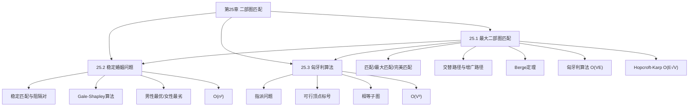

## 相关笔记

- 节笔记：[[25.1 最大二部图匹配]]、[[25.2 稳定婚姻问题]]、[[25.3 匈牙利算法]]
- 前置章节：[[第24章_最大流-章节汇总]]、[[第20章_基本图算法-章节汇总]]
- 后续章节：[[第26章_并行算法-章节汇总]]

> [!abstract] 概览
> 全章围绕==二部图匹配==（Bipartite Matching）问题展开。25.1节重新审视最大二部图匹配，引入==交替路径==和==增广路径==的概念，基于==Berge定理==给出匈牙利算法的框架（25.1）；25.2节转向独立的==稳定婚姻问题==，介绍经典的==Gale-Shapley算法==（延迟接受），并证明其==男性最优==和==女性最劣==性质（25.2）；25.3节讨论==加权二部图匹配==的==指派问题==，介绍==匈牙利算法==（Kuhn-Munkres），通过==可行顶点标号==和==相等子图==实现 $O(V^3)$ 的最优匹配（25.3）。全章的核心主线是 **如何高效求解二部图上的各种匹配问题**——从无权到加权，从最大到稳定。

---

## 知识结构总览

---

## 核心概念回顾

### 三节内容对比

| 比较维度 | 25.1 最大二部图匹配 | 25.2 稳定婚姻问题 | 25.3 匈牙利算法 |
|:---------|:-------------------|:-----------------|:---------------|
| **问题类型** | 无权最大匹配 | 带偏好的稳定匹配 | 加权最小/最大匹配 |
| **核心概念** | 增广路径、Berge定理 | 阻隔对、延迟接受 | 可行标号、相等子图 |
| **核心算法** | 匈牙利算法（匹配） | Gale-Shapley算法 | 匈牙利算法（指派） |
| **关键定理** | Berge定理 | 男性最优=女性最劣 | 相等子图完美匹配=最优 |
| **复杂度** | $O(VE)$ / $O(E\sqrt{V})$ | $O(n^2)$ | $O(V^3)$ |
| **与第24章关系** | 深化24.3的归约方法 | 独立问题 | 加权版最大流 |

### 算法选型指南

> [!note] 匹配问题算法选择
> - **无权二部图最大匹配**：Hopcroft-Karp算法，$O(E\sqrt{V})$，理论最优
> - **稳定匹配（带偏好）**：Gale-Shapley算法，$O(n^2)$，唯一选择
> - **加权二部图完美匹配**：匈牙利算法（Kuhn-Munkres），$O(V^3)$
> - **一般最大流归约**：Edmonds-Karp，$O(VE^2)$，通用但较慢

### 核心定理

> [!def] Berge定理（Theorem 25.7）
> 二部图中的匹配 $M$ 是最大匹配，当且仅当图中不存在 $M$-增广路径。

> [!def] Gale-Shapley最优性（Theorem 25.11 + Corollary 25.13）
> 在Gale-Shapley算法中，所有参与者都能得到稳定匹配。主动求婚方得到**最优**稳定匹配（在所有稳定匹配中最偏好），被动接受方得到**最劣**稳定匹配。

> [!def] 相等子图最优性（Theorem 25.14）
> 给定可行顶点标号 $l$，若相等子图 $G_l$ 中存在完美匹配 $M$，则 $M$ 是原图的最优匹配。

---

## 跨章关联

### 与第24章（最大流）的关系

| 第24章概念 | 第25章应用 |
|:-----------|:----------|
| 最大流（24.2） | 24.3将匹配归约为最大流；25.1给出更高效的专用算法 |
| 二部图匹配归约（24.3） | 25.1深化：从流归约转向专门的增广路径方法 |
| Edmonds-Karp $O(VE^2)$ | 25.1匈牙利算法 $O(VE)$，25.1 Hopcroft-Karp $O(E\sqrt{V})$ |

### 与第20章（基本图算法）的关系

- BFS用于搜索增广路径（25.1匈牙利算法、Hopcroft-Karp）
- DFS也可用于搜索增广路径
- 图的邻接表表示是所有匹配算法的基础

### 与第15章（贪心算法）的关系

- Gale-Shapley算法具有贪心性质：主动方总是向最优未尝试对象求婚
- 但GS算法不是纯贪心——它考虑了稳定性约束（阻隔对），而非简单的局部最优
- 与15.1节活动选择问题的贪心策略形成对比

### 与第14章（动态规划）的关系

- 指派问题（25.3）可以用动态规划求解，但复杂度为 $O(n! \cdot n)$（枚举所有排列），远不如匈牙利算法的 $O(V^3)$
- 匈牙利算法的标号更新过程与动态规划的"最优子结构"思想有类比

---

## 综合复习题

> [!faq]- 复习题 1：Berge定理为什么是匹配算法的理论基础？
> Berge定理建立了"最大匹配"与"增广路径"之间的等价关系：匹配是最大的 ⟺ 不存在增广路径。这意味着：
> 1. **判定性**：要判断一个匹配是否最大，只需检查是否存在增广路径
> 2. **构造性**：要找到更大的匹配，只需找到增广路径并执行增广操作
> 3. **终止性**：每次增广使匹配大小加1，最多增广 $O(V)$ 次
>
> 所有匹配算法（匈牙利算法、Hopcroft-Karp、Blossom算法等）都基于这个框架：反复寻找增广路径直到不存在。区别仅在于**如何高效地搜索增广路径**。

> [!faq]- 复习题 2：Gale-Shapley算法中"主动方最优"的直觉解释是什么？
> 想象男性主动求婚。每个男性按偏好从高到低依次尝试，一旦被更好的男性"抢走"，女性就会接受更好的选择。关键洞察：**没有任何稳定匹配能让主动方得到比GS更好的结果**。因为如果存在这样的匹配，那么在GS过程中，主动方会先向这个更好的对象求婚（GS按偏好顺序求婚），而该对象如果最终没有接受，说明她得到了更好的选择——这与"更好的匹配"矛盾。反过来，被动方得到的是所有稳定匹配中最差的结果，因为她们只能被动等待，无法主动争取更好的选择。

> [!faq]- 复习题 3：匈牙利算法（指派问题）中"可行顶点标号"的作用是什么？
> 可行顶点标号 $l$ 满足 $l(u) + l(v) \ge w(u,v)$（对所有边）。它的核心作用是：
> 1. **提供上界**：对任何可行标号和任何完美匹配 $M$，有 $\sum_{(u,v) \in M} w(u,v) \le \sum_{v \in V} l(v)$。因此标号之和是匹配权值的上界。
> 2. **定义相等子图**：$G_l$ 只包含满足 $l(u) + l(v) = w(u,v)$ 的边。在相等子图中找完美匹配等价于找到达到上界的匹配，即最优匹配。
> 3. **标号更新**：当相等子图中不存在完美匹配时，通过修改标号来扩大相等子图（增加边），同时不破坏可行性。这个过程类似于原始对偶方法中的对偶变量更新。

> [!faq]- 复习题 4：如何理解第25章三个算法之间的递进关系？
> 三个算法解决的是**越来越复杂的匹配问题**：
> 1. **25.1 匈牙利算法（匹配）**：最基础——无权二部图上的最大匹配。只关心"匹配多少对"，不关心权重和偏好。
> 2. **25.2 Gale-Shapley算法**：增加了**偏好**维度——每方对另一方有排序偏好，要求匹配"稳定"（无阻隔对）。不关心权重，但关心满意度。
> 3. **25.3 匈牙利算法（指派）**：增加了**权重**维度——每对匹配有权重，要求总权重最优。不关心偏好，但关心效率。
>
> 三者的共同基础是二部图上的匹配概念，但优化目标不同（数量最大 vs 稳定 vs 权重最优），因此算法设计也完全不同。

---

## 常见误区

> [!warning] 误区1：Gale-Shapley算法产生的是全局最优匹配
> **正确理解**：GS算法产生的是**稳定**匹配，不一定是全局最优的。全局最优需要定义"社会福利函数"（如所有参与者的偏好排名之和最小），但GS算法不优化这个指标。GS算法保证的是**帕累托有效**（主动方）和**稳定性**（双方），而非全局最优。

> [!warning] 误区2：匈牙利算法（匹配）和匈牙利算法（指派）是同一个算法
> **正确理解**：虽然都叫"匈牙利算法"，但它们解决不同的问题：
> - **匹配版**（25.1）：无权二部图最大匹配，基于增广路径，$O(VE)$
> - **指派版**（25.3）：加权二部图最小权完美匹配，基于可行标号和相等子图，$O(V^3)$
> 两者名称相同是因为都由匈牙利数学家发展（Kőnig、Egerváry、Kuhn受匈牙利方法启发），但算法思想和适用场景完全不同。

> [!warning] 误区3：稳定匹配一定存在且唯一
> **正确理解**：稳定匹配**一定存在**（GS算法保证了这一点），但**不一定唯一**。一个实例可能存在多个稳定匹配，GS算法根据谁主动求婚产生不同的结果。男性主动产生男性最优（女性最劣），女性主动产生女性最优（男性最劣）。不同的稳定匹配之间可能差异很大。

---

## 学习要点总结

| 学习目标 | 掌握程度 | 对应笔记 |
|:---------|:---------|:---------|
| 匹配/最大匹配/完美匹配定义 | 熟练 | [[25.1 最大二部图匹配]] |
| Berge定理及证明 | 熟练 | [[25.1 最大二部图匹配]] |
| 匈牙利算法（匹配）与复杂度 | 掌握 | [[25.1 最大二部图匹配]] |
| Hopcroft-Karp算法思想 | 了解 | [[25.1 最大二部图匹配]] |
| 稳定匹配与阻隔对定义 | 熟练 | [[25.2 稳定婚姻问题]] |
| Gale-Shapley算法与正确性证明 | 熟练 | [[25.2 稳定婚姻问题]] |
| 男性最优/女性最劣性质 | 掌握 | [[25.2 稳定婚姻问题]] |
| 指派问题定义 | 掌握 | [[25.3 匈牙利算法]] |
| 可行顶点标号与相等子图 | 熟练 | [[25.3 匈牙利算法]] |
| 匈牙利算法（指派）流程 | 掌握 | [[25.3 匈牙利算法]] |

---

## 参见Wiki

> [!note] 概念页尚未创建

#学习/算法导论/第25章-二部图匹配 #学习/算法导论/二部图匹配/章节汇总
