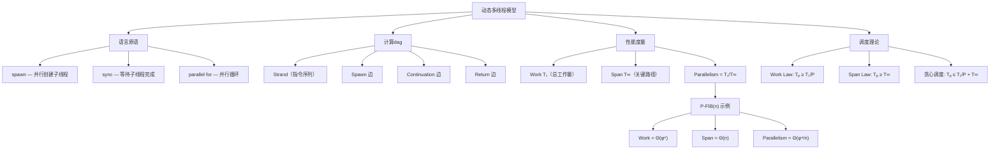
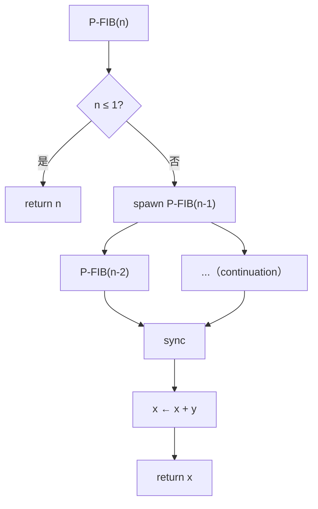

## 相关笔记

**前置依赖：**
- [[4.3 代入法]] — 代入法是求解递推关系的基本方法，动态多线程的 work/span 分析依赖递推求解
- [[4.5 主定理]] — 用于分析动态多线程算法的 work 递推关系
- [[25.1 最大二部图匹配]] — 第25章的网络流与匹配为并行算法提供了应用背景

**后续章节：**
- [[26.2 多线程矩阵乘法]] — 将 work-span 分析应用于具体数值计算
- [[26.3 多线程归并排序]] — 经典排序算法的并行化

**关联Wiki：**
- [[离散数学/concepts/分治法]] | [[离散数学/concepts/渐近分析]] | [[离散数学/concepts/递归树]] | [[离散数学/concepts/Fibonacci数]]

---

> [!abstract] 概览
> 本节介绍**动态多线程**（dynamic multithreading）计算模型，这是分析并行算法性能的理论框架。核心思想是通过 `spawn` 和 `sync` 关键字将串行算法转化为并行算法，并用 ==计算dag==（computation dag）来刻画并行执行的所有可能方式。性能由三个核心度量定义：==Work== $T_1$（单处理器运行时间）、==Span== $T_\infty$（关键路径长度）和 ==Parallelism== $T_1/T_\infty$（理论最大加速比）。==贪心调度==（greedy scheduling）定理保证了在 $P$ 个处理器上，实际运行时间满足 $T_P \le T_1/P + T_\infty$。
>
> **要点列表：**
> - `spawn` 创建可并行执行的子线程，`sync` 等待所有 spawn 的子线程完成
> - 计算dag中每个节点是一个 **strand**（指令序列），边分为 spawn 边、continuation 边和 return 边
> - Work Law：$T_P \ge T_1/P$；Span Law：$T_P \ge T_\infty$
> - 贪心调度：每一步将就绪的 strand 分配给空闲处理器，达到近线性加速
> - P-FIB(n) 示例：work = $\Theta(\varphi^n)$，span = $\Theta(n)$，parallelism = $\Theta(\varphi^n/n)$

---

## 知识结构总览



---

## 核心思想

### 2.1 动态多线程模型

> [!def] 动态多线程计算模型
> 动态多线程模型在普通串行伪代码中引入三个关键字来描述并行性：
> - **`spawn`**：在调用子过程时，被调用者可以与调用者**并行执行**。调用者不必等待被调用者完成即可继续执行后续指令。
> - **`sync`**：等待当前过程通过 `spawn` 创建的所有子线程完成，然后才能继续执行 `sync` 之后的指令。
> - **`parallel for`**：将循环的各次迭代并行执行，等价于对每次迭代进行 spawn 后 sync。

> [!tip] spawn 与普通调用的区别
> - **普通调用**：调用者暂停，等待被调用者返回后继续（串行语义）
> - **`spawn` 调用**：调用者和被调用者可以同时执行（并行语义）
> - `spawn` 的返回值通过后续的 `sync` 来获取，确保数据依赖正确

### 2.2 计算Dag（Computation Dag）

> [!def] 计算dag
> 一个动态多线程程序的执行可以用一个**有向无环图**（dag）来表示，其中：
> - 每个节点（顶点）是一个 **strand**（strand），即一段不包含并行控制指令（spawn/sync/return）的连续指令序列
> - 边表示 strand 之间的**依赖关系**，分为三种类型：
>   - **Spawn 边**：从 spawn 指令所在的 strand 指向被 spawn 出的子过程的第一条 strand
>   - **Continuation 边**：从 spawn 指令所在的 strand 指向 spawn 之后紧接的 strand（调用者的后续代码）
>   - **Return 边**：从子过程的最后一条 strand 指向调用者中等待其返回的 strand

> [!example] 计算dag的直观理解
> 想象一个项目管理图：每个 strand 是一个任务，spawn 边表示"可以同时开始"的委托任务，continuation 边表示"主线程继续做"的后续任务，return 边表示"子任务完成后回来汇报"。整个 dag 描述了所有可能的并行执行方式——调度器只需选择在每个时刻哪些就绪（入度为0）的 strand 可以执行。

### 2.3 P-FIB 示例

> [!tip] 算法执行流程
> P-FIB 是 Fibonacci 数列的并行版本，展示了 spawn/sync 的基本用法：



**伪代码：**

```
P-FIB(n)
1  if n ≤ 1
2      return n
3  else x = spawn P-FIB(n - 1)
4      y = P-FIB(n - 2)
5      sync
6      return x + y
```

**执行要点：**
- 第3行：`spawn P-FIB(n-1)` 创建子线程计算 $F(n-1)$，主线程不等待，继续执行第4行
- 第4行：普通调用 `P-FIB(n-2)`，主线程串行执行
- 第5行：`sync` 等待第3行 spawn 的子线程完成
- 第6行：此时 $x$ 和 $y$ 都已计算完毕，返回 $x + y$

### 2.4 Work、Span 与 Parallelism

> [!def] Work（工作量）
> **Work** $T_1$ 是在**单个处理器**上执行整个计算所需的时间，等于计算dag中所有 strand 的执行时间之和。它反映了计算的**总工作量**，与串行算法的运行时间一致。

> [!def] Span（跨度/关键路径长度）
> **Span** $T_\infty$ 是计算dag中**最长路径**（关键路径）的权重之和，即在**无限多处理器**上的最短完成时间。它反映了计算中**不可避免的串行部分**的长度。

> [!def] Parallelism（并行度）
> **Parallelism** 定义为 $T_1 / T_\infty$，即平均意义上可以保持**忙碌的处理器数量**。它是理论上的最大加速比上界。

**P-FIB(n) 的分析：**

- **Work**：$T_1(n) = T_1(n-1) + T_1(n-2) + \Theta(1)$，与普通 FIB 相同，解得 $T_1(n) = \Theta(\varphi^n)$，其中 $\varphi = (1+\sqrt{5})/2 \approx 1.618$
- **Span**：由于 `P-FIB(n-1)` 是 spawn 的，它与 `P-FIB(n-2)` 并行执行，因此 $T_\infty(n) = \max(T_\infty(n-1),\, T_\infty(n-2)) + \Theta(1) = T_\infty(n-1) + \Theta(1)$，解得 $T_\infty(n) = \Theta(n)$
- **Parallelism**：$T_1/T_\infty = \Theta(\varphi^n / n)$，随 $n$ 指数增长

### 2.5 Work Law 与 Span Law

> [!def] Work Law
> 对任意 $P$ 个处理器的调度，有
> $$T_P \ge T_1 / P$$
> **直觉**：$P$ 个处理器最多同时完成 $P$ 个单位的 work，总 work 为 $T_1$，所以至少需要 $T_1/P$ 时间。

> [!def] Span Law
> 对任意 $P$ 个处理器的调度，有
> $$T_P \ge T_\infty$$
> **直觉**：关键路径上的 strand 必须按顺序执行，无论有多少处理器，至少需要 $T_\infty$ 时间。

### 2.6 贪心调度定理

> [!def] 贪心调度器（Greedy Scheduler）
> 贪心调度器在每个时间步执行以下操作：
> - 将 $P$ 个**就绪的**（ready）strand 分配给 $P$ 个处理器
> - 如果就绪 strand 数量 $< P$，则只分配存在的就绪 strand
> - 如果没有就绪 strand，则所有处理器空闲（incomplete step）
> - 如果所有 $P$ 个处理器都在工作，则称为 **complete step**

**定理（贪心调度时间界）：** 在 $P$ 个处理器上使用贪心调度器执行一个 work 为 $T_1$、span 为 $T_\infty$ 的动态多线程计算，其运行时间满足

$$T_P \le T_1 / P + T_\infty$$

**证明：**

> **【分类讨论（步骤划分）】**
> 将贪心调度的执行过程分为两类步骤：
> - **Complete step**：所有 $P$ 个处理器都在执行 strand，完成 $P$ 个单位的 work
> - **Incomplete step**：至少有一个处理器空闲，完成的 work $< P$

设总共有 $C$ 个 complete step 和 $I$ 个 incomplete step，则：

> **【Work 总量约束】**
> Complete step 完成的 work 总量为 $P \cdot C$，incomplete step 完成的 work 总量 $\le P \cdot I$（实际上每个 incomplete step 至少完成 1 个单位的 work）。因此：
> $$T_1 \ge P \cdot C + I$$
> （因为所有 work 之和不超过 $T_1$）

> **【Span 对步骤总数的约束】**
> 在每个时间步（无论 complete 还是 incomplete），至少有一个 strand 被执行。关键路径上的 strand 必须在不同时间步执行（因为它们之间存在依赖关系），所以：
> $$C + I \le T_\infty$$

> **【代数推导（时间上界）】**
> 由 $T_1 \ge P \cdot C + I$，可得 $C \le (T_1 - I)/P$。
> 总时间 $T_P = C + I \le (T_1 - I)/P + I = T_1/P + I(1 - 1/P)$。

> **【最坏情况分析（I 的上界）】**
> 由于 $C + I \le T_\infty$ 且 $C \ge 0$，有 $I \le T_\infty$。
> 又因为 $1 - 1/P > 0$（$P \ge 1$），所以：
> $$T_P \le T_1/P + T_\infty(1 - 1/P) \le T_1/P + T_\infty$$

> **【结论（贪心调度时间界）】**
> 因此 $T_P \le T_1/P + T_\infty$。$\blacksquare$

**推论（近线性加速）：** 如果 $T_1/T_\infty = \Omega(P)$（即并行度至少与处理器数同阶），则 $T_P = O(T_1/P)$，达到近线性加速。

> [!example] 加速比的实际含义
> 假设 $T_1 = 1000$，$T_\infty = 50$，则 parallelism = 20。
> - 在 $P = 10$ 个处理器上：$T_{10} \le 1000/10 + 50 = 150$，加速比 $\ge 1000/150 \approx 6.67$
> - 在 $P = 20$ 个处理器上：$T_{20} \le 1000/20 + 50 = 100$，加速比 $= 10$
> - 在 $P = 50$ 个处理器上：$T_{50} \le 1000/50 + 50 = 70$，加速比 $\approx 14.3$
> 注意：当 $P$ 超过 parallelism（20）时，再增加处理器收益递减，因为 $T_\infty$ 成为瓶颈。

---

## 补充理解与拓展

> [!info] Cilk 语言与 Work-Span 模型的工程实现
> **来源**：Blumofe, Frigo, Joerg, Leiserson（1996），"Cilk: An Efficient Multithreaded Runtime System"，Journal of Parallel and Distributed Computing
> **链接**：https://dl.acm.org/doi/10.1145/209937.209958
>
> Cilk 是 MIT 开发的多线程编程语言，是动态多线程模型的工程实现。Cilk 引入了 `spawn` 和 `sync` 关键字（与教材中的伪代码一致），其运行时系统采用 **work-stealing** 调度策略：每个处理器维护一个双端队列（deque）存储待执行的 strand，空闲处理器从其他处理器的 deque 底部"偷取"工作。论文证明了对于"fully strict"（良结构）程序，work-stealing 调度器在时间、空间和通信开销上均达到常数因子内的最优。这一结果为教材中贪心调度定理的理论分析提供了工程基础——贪心调度器是 work-stealing 的理想化模型。

> [!info] 并行计算模型对比：PRAM、BSP 与动态多线程
> **来源**：Valiant（1990），"A Bridging Model for Parallel Computation"，Communications of the ACM
> **链接**：https://dl.acm.org/doi/10.1145/79173.79181
>
> 并行计算领域存在多种抽象模型：
> - **PRAM（并行随机访问机）**：假设所有处理器共享全局内存，每个时间步所有处理器可以同时读写。PRAM 模型简单但过于理想化，忽略了通信开销和同步成本。
> - **BSP（整体同步并行）**：由 Valiant 提出，将计算分为一系列超步（superstep），每个超步内处理器本地计算，超步之间进行全局同步和通信。BSP 用三个参数刻画机器：处理器数 $P$、同步延迟 $L$、通信带宽参数 $g$。
> - **动态多线程模型**：通过计算 dag 和 work/span 度量，更关注算法本身的并行结构而非底层硬件细节。它不假设全局共享内存的具体访问模式，而是通过 spawn/sync 抽象来描述并行性。
>
> 动态多线程模型的优势在于：程序员只需关注减少 work 和 span，而调度和负载均衡由运行时系统（如 Cilk 的 work-stealing）自动处理。这使得算法设计与性能分析分离，降低了并行编程的难度。

> [!info] Work-Span 模型的局限性
> **来源**：Culler, Singh, Gupta（1999），"Parallel Computer Architecture: A Hardware/Software Approach"，Morgan Kaufmann
> **链接**：https://www.elsevier.com/books/parallel-computer-architecture/culler/978-0-08-050792-3
>
> Work-Span 模型虽然优雅，但存在若干局限性：
> 1. **忽略缓存层次**：模型假设每个 strand 的执行时间为常数，但实际中缓存命中/缺失对性能影响巨大
> 2. **忽略通信开销**：在分布式内存系统上，处理器间通信延迟可能显著影响实际性能
> 3. **假设无限线程**：实际系统中线程数受限于内存和操作系统调度开销
> 4. **不考虑 NUMA 效应**：现代多核处理器的非均匀内存访问（NUMA）架构使得内存访问时间不一致
>
> 尽管如此，Work-Span 模型仍然是分析并行算法的起点，它提供了"理论上限"的参考，实际性能通常在这个上界的一个常数因子之内。

> [!info] 动态多线程与GPU计算
> 现代GPU（如NVIDIA CUDA）的计算模型与CLRS中的动态多线程模型高度相似。GPU的SIMT（Single Instruction Multiple Threads）执行模型本质上是spawn-sync并行范式的硬件实现。了解GPU编程有助于理解动态多线程理论的实际应用。
> - 参考：[NVIDIA CUDA C++ Programming Guide](https://docs.nvidia.com/cuda/cuda-c-programming-guide/)

---

## 易混淆点与辨析

> [!warning] spawn 与普通调用的区别
> **混淆点**：`spawn P-FIB(n-1)` 和 `P-FIB(n-1)` 的执行方式有何不同？
>
> **辨析**：
> - `spawn` 调用：调用者和被调用者**可以并行执行**。调用者在发出 spawn 后立即继续执行下一条指令（第4行的 `P-FIB(n-2)`），不必等待被调用者完成。
> - 普通调用：调用者**暂停**，等待被调用者返回后才继续执行。普通调用是串行语义。
>
> 在 P-FIB 中，如果第4行也改为 `spawn`，则两个子过程完全并行，span 会进一步减小，但 work 不变（因为总计算量相同）。如果第3行改为普通调用，则整个算法退化为串行版本，span = work = $\Theta(\varphi^n)$。

> [!warning] Span 不是"最深的递归深度"
> **混淆点**：Span 是否等于递归树的最大深度？
>
> **辨析**：不一定。Span 是计算dag中**最长路径**的权重，而递归深度只是路径的一种度量。
> - 在 P-FIB 中，span 恰好等于递归深度 $\Theta(n)$，因为每层递归只贡献 $\Theta(1)$ 的 span
> - 但在其他算法中，如果某个递归分支内部有串行计算，span 可能远大于递归深度
> - 关键在于：span 衡量的是**依赖链的总长度**，而非递归的层数

> [!warning] 贪心调度不是最优调度
> **混淆点**：贪心调度是否给出最短可能的执行时间？
>
> **辨析**：不是。贪心调度给出的是一个**上界** $T_P \le T_1/P + T_\infty$，但最优调度可能更快。习题 27.1-4 展示了贪心调度的不同执行方式可以产生接近 2 倍的时间差异。贪心调度的价值在于：
> 1. 它是**在线**算法——不需要预先知道整个 dag 的结构
> 2. 它的实现简单高效（如 Cilk 的 work-stealing）
> 3. 它的保证足够好——在 parallelism $\gg P$ 时达到近线性加速

---

## 习题精选

| 编号 | 题目摘要 | 难度 | 考察要点 |
|:---:|---------|:---:|---------|
| 27.1-1 | 将 P-FIB 第4行改为 spawn 后分析 work/span | ★★☆ | spawn 对 span 的影响 |
| 27.1-3 | 证明更强的贪心调度界 $T_P \le (T_1 - T_\infty)/P + T_\infty$ | ★★★ | 反证法、调度分析 |
| 27.1-4 | 构造贪心调度执行时间差近2倍的 dag | ★★★ | 调度器非确定性 |
| 27.1-5 | 用 Work Law 和 Span Law 检验测量数据的合理性 | ★★☆ | 性能界限的应用 |

> [!faq]- 27.1-1 将 P-FIB(n-2) 也改为 spawn，分析影响
> **题目**：假设将 P-FIB 第4行的 `P-FIB(n-2)` 改为 `spawn P-FIB(n-2)`，对 work、span 和 parallelism 的渐近值有何影响？
>
> **解答**：
> - **Work**：$T_1$ 不变。spawn 只是改变了执行方式，不改变总计算量。$T_1(n) = T_1(n-1) + T_1(n-2) + \Theta(1) = \Theta(\varphi^n)$。
> - **Span**：现在两个子过程都通过 spawn 并行执行，因此 $T_\infty(n) = \max(T_\infty(n-1),\, T_\infty(n-2)) + \Theta(1) = T_\infty(n-1) + \Theta(1) = \Theta(n)$。与原来相同！
> - **Parallelism**：$T_1/T_\infty = \Theta(\varphi^n/n)$，也不变。
>
> **关键洞察**：在原版 P-FIB 中，`P-FIB(n-1)` 已经是 spawn 的，它与 `P-FIB(n-2)` 并行执行。将 `P-FIB(n-2)` 也改为 spawn 并不改变并行结构——两个子过程本来就是并行的。唯一的区别在于调度器现在可以更灵活地分配 `P-FIB(n-2)` 的执行时机。

> [!faq]- 27.1-3 证明更强的贪心调度时间界
> **题目**：证明贪心调度器满足 $T_P \le (T_1 - T_\infty)/P + T_\infty$。
>
> **解答**：
> 设执行过程中有 $x$ 个 incomplete step。每个 incomplete step 至少完成 1 个单位的 work，因此 complete step 完成的 work 总量至多为 $T_1 - x$。
>
> > **【反证法（贪心调度时间界）】**
> > 假设 complete step 的数量严格大于 $\lfloor(T_1 - x)/P\rfloor$，则 complete step 完成的 work 总量为：
> > $$P \cdot (\lfloor(T_1 - x)/P\rfloor + 1) = P\lfloor(T_1 - x)/P\rfloor + P = (T_1 - x) - ((T_1 - x) \bmod P) + P > T_1 - x$$
> > 这与"complete step 完成的 work 至多为 $T_1 - x$"矛盾。
>
> 因此 complete step 数量 $\le \lfloor(T_1 - x)/P\rfloor$，总时间：
> $$T_P \le \lfloor(T_1 - x)/P\rfloor + x$$
>
> 由于 $T_\infty$ 是所有步骤（complete + incomplete）总数的上界，所以 $x \le T_\infty$。又因为 $\lfloor(T_1 - x)/P\rfloor + x$ 关于 $x$ 单调递增，取 $x$ 的最大可能值 $T_\infty$：
> $$T_P \le \lfloor(T_1 - T_\infty)/P\rfloor + T_\infty$$
> $\blacksquare$

> [!faq]- 27.1-4 贪心调度执行时间差近2倍的 dag
> **题目**：构造一个计算dag，使得贪心调度器的两次不同执行的时间比接近 2。
>
> **解答**：
> 构造如下 dag：一个源节点 $u$ 有 $k$ 个直接后继（左链），每个后继各自有一条长度为 $m$ 的链。另外，$u$ 还有一个后继 $v$（右链），$v$ 有一条长度为 $m$ 的链。在 $k$ 个处理器上执行：
>
> - **执行A**：先并发执行 $k$ 个左链（$m$ 步），再串行执行右链（$m$ 步），总时间 $2m$
> - **执行B**：每步执行 $k-1$ 个左链 strand 和 1 个右链 strand，总时间 $m + m/k$
>
> 时间比 $= 2m/(m + m/k) = 2/(1 + 1/k)$，当 $k \to \infty$ 时趋近于 2。
>
> **关键洞察**：贪心调度器在每一步只要求"分配就绪 strand 给空闲处理器"，但不规定分配策略。不同的分配策略可以导致显著不同的性能。

> [!faq]- 27.1-5 检验测量数据的合理性
> **题目**：Karan 教授声称在 4、10、64 个处理器上的运行时间分别为 $T_4 = 80$、$T_{10} = 42$、$T_{64} = 10$ 秒。证明她在撒谎或数据有误。
>
> **解答**：
> 由 Work Law（$T_P \ge T_1/P$）：
> - $T_1 \le T_4 \times 4 = 320$
> - $T_1 \le T_{10} \times 10 = 420$
> - $T_1 \le T_{64} \times 64 = 640$
>
> 由 Span Law（$T_P \ge T_\infty$）：
> - $T_\infty \le T_4 = 80$，$T_\infty \le T_{10} = 42$，$T_\infty \le T_{64} = 10$
>
> 由习题 27.1-3 的更强界 $T_P \le (T_1 - T_\infty)/P + T_\infty$：
>
> > **【反证法（数据矛盾）】**
> > 从 $T_{10} = 42$ 和 $T_{64} = 10$ 出发：
> > - 由 $T_{64} \le (T_1 - T_\infty)/64 + T_\infty = 10$，得 $T_1 - T_\infty \le 64(10 - T_\infty)$
> > - 由 $T_{10} \le (T_1 - T_\infty)/10 + T_\infty = 42$，得 $T_1 - T_\infty \le 10(42 - T_\infty)$
> >
> > 从 $T_{64} = 10$ 可得 $T_\infty \le 10$。代入 $T_{10}$ 的不等式：
> > $T_1 - T_\infty \le 10(42 - T_\infty) \le 10 \times 32 = 320$
> > 所以 $T_1 \le 320 + T_\infty \le 330$。
> >
> > 但从 $T_4 = 80$：$80 \le (T_1 - T_\infty)/4 + T_\infty$，即 $T_1 - T_\infty \ge 4(80 - T_\infty) = 320 - 4T_\infty$。
> > 结合 $T_\infty \le 10$：$T_1 \ge 320 - 4 \times 10 + T_\infty = 280 + T_\infty \ge 280$。
> >
> > 现在检查 $T_{64}$：$T_{64} \le (T_1 - T_\infty)/64 + T_\infty$。
> > 若 $T_\infty = 10$，则 $T_1 - T_\infty \le 64(10 - 10) = 0$，即 $T_1 \le 10$，与 $T_1 \ge 280$ 矛盾。
> > 若 $T_\infty < 10$，则 $T_1 - T_\infty \le 64(10 - T_\infty)$，且 $T_1 - T_\infty \ge 320 - 4T_\infty$。
> > 需要 $320 - 4T_\infty \le 640 - 64T_\infty$，即 $60T_\infty \le 320$，$T_\infty \le 16/3 \approx 5.33$。
> > 但 $T_\infty \le T_{64} = 10$ 且 $T_\infty$ 必须满足 $T_4 \ge T_\infty = 80 \ge T_\infty$，所以 $T_\infty \le 80$。
> >
> > 综合检查：$T_1 \le 330$ 且 $T_4 \le T_1/4 + T_\infty \le 330/4 + 10 = 92.5$。但 $T_4 = 80$，需要 $T_1 \ge 4(80 - T_\infty) + T_\infty = 320 - 3T_\infty$。
> > 若 $T_\infty = 10$：$T_1 \ge 290$。检查 $T_{64} \le (T_1 - 10)/64 + 10$：若 $T_1 = 290$，则 $(280)/64 + 10 = 14.375 > 10$，矛盾！
>
> 因此三组数据不可能同时满足贪心调度的时间界，教授的数据不正确。

---

## 视频学习指南

| 资源 | 讲者/来源 | 主题 | 时长 | 链接 |
|------|----------|------|------|------|
| MIT 6.046 Lecture 17 | Erik Demaine | Dynamic Multithreading | ~80min | https://www.youtube.com/watch?v=i3mEkf2aXAw |
| MIT 6.006 Lecture 13 | Charles Leiserson | Parallel Algorithms I | ~75min | https://www.youtube.com/watch?v=JmfEgMfKZ9s |
| Cilk Minicourse | Charles Leiserson | Dynamic Multithreaded Algorithms | ~60min | https://live.ocw.mit.edu/courses/6-046j/ |

---

## 教材原文

> [!quote] 算法导论（第4版）第27.1节
> "We shall begin our study of multithreaded algorithms by presenting a simple multithreaded model for executing dynamically spawned computations. This model, which is based on the Cilk language, provides a framework for analyzing the performance of parallel algorithms."
>
> "The key to understanding multithreaded algorithms is the computation dag, which models the dependencies among the strands of the computation. The work of the computation is the total time to execute all the strands on a single processor, and the span is the length of the longest path in the dag."
>
> "A greedy scheduler, which assigns ready strands to processors without any particular strategy, achieves a running time that is within a constant factor of optimal."

---

## 参见Wiki

- [[离散数学/concepts/分治法]] — 动态多线程是分治的并行扩展
- [[离散数学/concepts/Fibonacci数]] — P-FIB 示例的基础数学背景
- [[离散数学/concepts/渐近分析]] — Work 和 Span 的渐近记号
- [[离散数学/concepts/递归树]] — 分析 Work 递推关系的工具
- [[离散数学/concepts/主定理]] — 求解 Work 递推关系
- [[离散数学/concepts/贪心算法]] — 贪心调度策略的思想渊源

---

#学习/算法导论/第26章-并行算法 #学习/算法导论/并行算法/动态多线程基础
