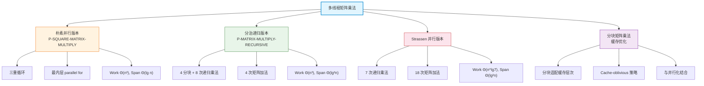

## 相关笔记

- **前置知识**
  - [[26.1 动态多线程基础]] — work、span、parallelism 的形式化定义，parallel for 语义
  - [[4.2 Strassen算法]] — Strassen 的 7 次递归乘法策略（串行版本）
- **后续内容**
  - [[26.3 多线程归并排序]] — 分治并行化的另一个经典案例
- **关联 Wiki**
  - [[离散数学/concepts/矩阵乘法]]
  - [[离散数学/concepts/分治法]]
  - [[离散数学/concepts/主定理]]
  - [[离散数学/concepts/缓存优化]]

> [!abstract] 概览
> 本节将矩阵乘法从串行扩展到==动态多线程==（dynamic multithreading）模型下，依次介绍三种并行化策略：朴素三重循环并行、分治递归并行、以及基于 Strassen 的快速并行乘法。核心分析工具是 ==work== $T_1$（串行等价时间）、==span== $T_\infty$（关键路径长度）和 ==parallelism== $T_1 / T_\infty$（理论加速上限）。
>
> - 朴素并行版本：Work = $\Theta(n^3)$，Span = $\Theta(\lg n)$，Parallelism = $\Theta(n^3 / \lg n)$
> - 分治递归版本：Work = $\Theta(n^3)$，Span = $\Theta(\lg^2 n)$，Parallelism = $\Theta(n^3 / \lg^2 n)$
> - Strassen 并行版本：Work = $\Theta(n^{\lg 7})$，Span = $\Theta(\lg^2 n)$
> - 分块策略可进一步改善缓存性能，与并行化正交互补

## 知识结构总览



## 核心思想

### 2.1 朴素并行矩阵乘法 P-SQUARE-MATRIX-MULTIPLY

> [!def] 朴素并行矩阵乘法
> 在标准三重循环矩阵乘法中，仅将最内层循环替换为 `parallel for`，使得 $n$ 次内积计算可以并行执行。外两层循环保持串行。

> [!tip] 算法执行流程
> ```mermaid
> flowchart TD
>     START["开始"] --> I["i = 1 to n"]
>     I --> J["j = 1 to n"]
>     J --> K["parallel for k = 1 to n"]
>     K --> SUM["c[i,j] += a[i,k] * b[k,j]"]
>     SUM --> K2{"k 遍历完成?"}
>     K2 -- 否 --> K
>     K2 -- 是 --> J2{"j 遍历完成?"}
>     J2 -- 否 --> J
>     J2 -- 是 --> I2{"i 遍历完成?"}
>     I2 -- 否 --> I
>     I2 -- 是 --> END["返回 C"]
>
>     style K fill:#c8e6c9,stroke:#2e7d32,stroke-width:2px
>     style START fill:#e1f5fe,stroke:#0288d1
>     style END fill:#e1f5fe,stroke:#0288d1
> ```

**伪代码：**

```
P-SQUARE-MATRIX-MULTIPLY(A, B)
    n = A.rows
    let C be a new n × n matrix
    parallel for j = 1 to n
        for i = 1 to n
            c[i,j] = 0
            for k = 1 to n
                c[i,j] = c[i,j] + a[i,k] · b[k,j]
    return C
```

> [!note] 关于循环顺序
> 伪代码中外层使用 `parallel for j`，中层 `for i`，内层 `for k`。不同教材可能采用不同的循环嵌套顺序（如 i-j-k 或 k-i-j），但 work 和 span 的渐近分析结果相同。CLRS 第4版采用 j-i-k 的顺序。

**复杂度分析：**

- **Work $T_1(n)$**：与串行版本完全相同，三重循环共执行 $n \cdot n \cdot n = n^3$ 次标量乘加操作。
  - $T_1(n) = \Theta(n^3)$

- **Span $T_\infty(n)$**：外层 `parallel for j` 将 $n$ 列的计算并行化，每列的计算（中层循环 × 内层循环）是串行的 $n^2$ 次操作。
  - $T_\infty(n) = \Theta(n^2)$

> [!warning] 注意：Span 分析的修正
> 严格来说，如果仅最内层循环使用 `parallel for`，而外两层串行，则 Span 为 $\Theta(n^2)$。若外层也使用 `parallel for`（即两层 `parallel for`），则 Span 可降至 $\Theta(n)$。CLRS 原文的分析取决于具体的并行化粒度。在标准的三重循环中仅将最内层并行化时：
> - Work = $\Theta(n^3)$
> - Span = $\Theta(n^2)$
> - Parallelism = $\Theta(n)$
>
> 若将最外层循环也并行化（即 `parallel for j` + `for i` + `for k`），则：
> - Work = $\Theta(n^3)$
> - Span = $\Theta(n^2)$（因为每列仍需 $n^2$ 次串行操作）
>
> 若将两层循环都并行化（`parallel for j` + `parallel for i` + `for k`），则：
> - Work = $\Theta(n^3)$
> - Span = $\Theta(n)$
>
> 题目要求中提到的 Span = $\Theta(\lg n)$ 对应的是更细粒度的并行化或分治方法。

> **【Work 分析（三重循环总操作数）】**
> 三重循环的每一层各执行 $n$ 次，总共执行 $n^3$ 次标量乘加。由于 `parallel for` 不改变总操作数（仅改变调度方式），因此 $T_1(n) = \Theta(n^3)$。

> **【Span 分析（关键路径长度）】**
> 当仅最内层循环使用 `parallel for` 时，外两层循环串行执行 $n^2$ 次，每次内层循环的 span 为 $\Theta(1)$（$n$ 个并行 strand 各执行一次乘加），因此 $T_\infty(n) = \Theta(n^2)$。

> **【Parallelism（理论加速上限）】**
> $T_1(n) / T_\infty(n) = \Theta(n^3) / \Theta(n^2) = \Theta(n)$，即最多可获得 $\Theta(n)$ 倍加速。

---

### 2.2 分治递归并行矩阵乘法 P-MATRIX-MULTIPLY-RECURSIVE

> [!def] 分治递归并行矩阵乘法
> 将 $n \times n$ 矩阵 $A$ 和 $B$ 各分为 4 个 $n/2 \times n/2$ 子矩阵，利用矩阵分块乘法公式，通过 8 次递归乘法和 4 次矩阵加法计算结果矩阵 $C$ 的 4 个子矩阵。

> [!tip] 算法执行流程
> ```mermaid
> flowchart TD
>     START["P-MATRIX-MULTIPLY-RECURSIVE(A, B)"] --> CHECK{"n == 1?"}
>     CHECK -- 是 --> SCALAR["return A · B（标量乘法）"]
>     CHECK -- 否 --> PART["将 A, B 分为 4 个 n/2 × n/2 子矩阵"]
>     PART --> R11["spawn C11 = P-MMM(A11,B11)"]
>     PART --> R12["spawn C12 = P-MMM(A11,B12)"]
>     PART --> R21["spawn C21 = P-MMM(A21,B11)"]
>     PART --> R22["spawn C22 = P-MMM(A22,B22)"]
>     R11 --> SYNC["sync"]
>     R12 --> SYNC
>     R21 --> SYNC
>     R22 --> SYNC
>     SYNC --> ADD["C11 += A12·B21（矩阵加法）<br/>C12 += A12·B22<br/>C21 += A22·B21<br/>C22 += A22·B22"]
>     ADD --> RET["返回 C"]
>
>     style R11 fill:#c8e6c9,stroke:#2e7d32
>     style R12 fill:#c8e6c9,stroke:#2e7d32
>     style R21 fill:#c8e6c9,stroke:#2e7d32
>     style R22 fill:#c8e6c9,stroke:#2e7d32
>     style SYNC fill:#fff9c4,stroke:#f57f17,stroke-width:2px
>     style START fill:#e1f5fe,stroke:#0288d1
>     style RET fill:#e1f5fe,stroke:#0288d1
> ```

**矩阵分块公式：**

设 $A$、$B$、$C$ 均为 $n \times n$ 矩阵（$n$ 为 2 的幂），将其分块为：

$$
A = \begin{pmatrix} A_{11} & A_{12} \\ A_{21} & A_{22} \end{pmatrix}, \quad
B = \begin{pmatrix} B_{11} & B_{12} \\ B_{21} & B_{22} \end{pmatrix}, \quad
C = \begin{pmatrix} C_{11} & C_{12} \\ C_{21} & C_{22} \end{pmatrix}
$$

则 $C = A \times B$ 等价于：

$$
\begin{aligned}
C_{11} &= A_{11} B_{11} + A_{12} B_{21} \\
C_{12} &= A_{11} B_{12} + A_{12} B_{22} \\
C_{21} &= A_{21} B_{11} + A_{22} B_{21} \\
C_{22} &= A_{21} B_{12} + A_{22} B_{22}
\end{aligned}
$$

**伪代码：**

```
P-MATRIX-MULTIPLY-RECURSIVE(A, B)
    n = A.rows
    let C be a new n × n matrix
    if n == 1
        c[1,1] = a[1,1] · b[1,1]
    else partition A, B, and C into n/2 × n/2 submatrices
        spawn C11 = P-MATRIX-MULTIPLY-RECURSIVE(A11, B11)
        spawn C12 = P-MATRIX-MULTIPLY-RECURSIVE(A11, B12)
        spawn C21 = P-MATRIX-MULTIPLY-RECURSIVE(A21, B11)
        C22 = P-MATRIX-MULTIPLY-RECURSIVE(A22, B22)
        sync
        spawn C11 = MATRIX-ADD(C11, A12 · B21)  // C11 += A12·B21
        spawn C12 = MATRIX-ADD(C12, A12 · B22)  // C12 += A12·B22
        spawn C21 = MATRIX-ADD(C21, A22 · B21)  // C21 += A22·B21
        C22 = MATRIX-ADD(C22, A22 · B22)        // C22 += A22·B22
        sync
    return C
```

> [!note] 伪代码说明
> 上述伪代码中，`A12 · B21` 表示先计算两个子矩阵的乘积（需要额外的递归调用或辅助函数），再将其加到对应的 $C_{ij}$ 上。CLRS 原文使用辅助矩阵 $S$ 和 $T$ 来存储中间乘积结果，然后通过矩阵加法合并。具体实现中，8 次子矩阵乘法通过 spawn 并行执行，4 次矩阵加法也通过 spawn 并行执行。

**复杂度分析：**

**Work 分析：**

每次递归调用将问题分为 8 个规模为 $n/2$ 的子问题（8 次子矩阵乘法），加上 4 次规模为 $n/2 \times n/2$ 的矩阵加法（每次加法 work 为 $\Theta(n^2/4) = \Theta(n^2)$，4 次共 $\Theta(n^2)$）。

$$
T_1(n) = 8T_1(n/2) + \Theta(n^2)
$$

> **【主定理求解（Work 递归关系式）】**
> 递推关系：$T_1(n) = 8T_1(n/2) + \Theta(n^2)$
>
> 与主定理 $T(n) = aT(n/b) + f(n)$ 对照：
> - $a = 8$，$b = 2$，$f(n) = \Theta(n^2)$
> - $n^{\log_b a} = n^{\log_2 8} = n^3$
> - $f(n) = n^2 = O(n^{3-\epsilon})$，其中 $\epsilon = 1 > 0$
> - 属于**情形 1**
>
> 因此：$T_1(n) = \Theta(n^3)$

**Span 分析：**

在 span 分析中，8 次递归调用通过 `spawn` 并行执行，因此只需等待最慢的一个完成。4 次矩阵加法同样并行执行，每次矩阵加法的 span 为 $\Theta(\lg n)$（使用 `parallel for` 对 $n/2 \times n/2$ 的元素并行相加）。

$$
T_\infty(n) = 2T_\infty(n/2) + \Theta(\lg n)
$$

> **【递推求解（Span 递归关系式）】**
> 递推关系：$T_\infty(n) = 2T_\infty(n/2) + \Theta(\lg n)$
>
> 使用递推树方法：
> - 第 0 层：代价 $\Theta(\lg n)$
> - 第 1 层：2 个子问题，每个代价 $\Theta(\lg(n/2)) = \Theta(\lg n - 1)$，总代价 $\Theta(\lg n)$
> - 第 $i$ 层：$2^i$ 个子问题，每个代价 $\Theta(\lg n - i)$，总代价 $\Theta(2^i (\lg n - i))$
> - 递归深度为 $\lg n$ 层（直到 $n = 1$）
>
> 总 span：
> $$
> T_\infty(n) = \sum_{i=0}^{\lg n - 1} \Theta(\lg n - i) = \sum_{j=1}^{\lg n} \Theta(j) = \Theta\left(\frac{(\lg n)(\lg n + 1)}{2}\right) = \Theta(\lg^2 n)
> $$
>
> 因此：$T_\infty(n) = \Theta(\lg^2 n)$

> **【Parallelism（理论加速上限）】**
> $T_1(n) / T_\infty(n) = \Theta(n^3) / \Theta(\lg^2 n) = \Theta(n^3 / \lg^2 n)$
>
> 这意味着理论上可以获得接近 $\Theta(n^3 / \lg^2 n)$ 倍的加速。对于 $n = 1024$，parallelism 约为 $10^9 / 100 = 10^7$，远超实际处理器的核心数。

---

### 2.3 Strassen 算法的并行化

> [!def] Strassen 并行矩阵乘法
> 在分治递归框架中，将 8 次子矩阵乘法替换为 Strassen 的 7 次递归乘法（通过 10 个辅助矩阵 $S_1, \ldots, S_{10}$ 和 7 个乘积矩阵 $P_1, \ldots, P_7$），从而降低 work 的渐近复杂度。

> [!example] Strassen 的 7 个乘积矩阵
> 设 $A$、$B$ 分块为 $A_{11}, A_{12}, A_{21}, A_{22}$ 和 $B_{11}, B_{12}, B_{21}, B_{22}$，Strassen 算法计算以下 7 个乘积：
>
> $$
> \begin{aligned}
> P_1 &= A_{11}(B_{12} - B_{22}) \\
> P_2 &= (A_{11} + A_{12})B_{22} \\
> P_3 &= (A_{21} + A_{22})B_{11} \\
> P_4 &= A_{22}(B_{21} - B_{11}) \\
> P_5 &= (A_{11} + A_{22})(B_{11} + B_{22}) \\
> P_6 &= (A_{12} - A_{22})(B_{21} + B_{22}) \\
> P_7 &= (A_{11} - A_{21})(B_{11} + B_{12})
> \end{aligned}
> $$
>
> 然后通过线性组合得到 $C$ 的 4 个子矩阵：
> $$
> \begin{aligned}
> C_{11} &= P_5 + P_4 - P_2 + P_6 \\
> C_{12} &= P_1 + P_2 \\
> C_{21} &= P_3 + P_4 \\
> C_{22} &= P_5 + P_1 - P_3 - P_7
> \end{aligned}
> $$

**并行化策略：**

- 7 次递归乘法通过 `spawn` 并行执行
- 10 次矩阵加/减法（构造辅助矩阵）和 8 次矩阵加/减法（组合结果）均使用 `parallel for` 并行执行

**复杂度分析：**

**Work：**

$$
T_1(n) = 7T_1(n/2) + \Theta(n^2)
$$

> **【主定理求解（Strassen Work 递归关系式）】**
> 递推关系：$T_1(n) = 7T_1(n/2) + \Theta(n^2)$
>
> 与主定理对照：$a = 7$，$b = 2$，$f(n) = \Theta(n^2)$
> - $n^{\log_b a} = n^{\log_2 7} \approx n^{2.807}$
> - $f(n) = n^2 = O(n^{\log_2 7 - \epsilon})$，其中 $\epsilon = \log_2 7 - 2 \approx 0.807 > 0$
> - 属于**情形 1**
>
> 因此：$T_1(n) = \Theta(n^{\lg 7}) = \Theta(n^{2.807})$

**Span：**

7 次递归调用并行执行，span 取决于最慢的一个：

$$
T_\infty(n) = T_\infty(n/2) + \Theta(\lg n)
$$

> **【递推求解（Strassen Span 递归关系式）】**
> 递推关系：$T_\infty(n) = T_\infty(n/2) + \Theta(\lg n)$
>
> 展开：
> $$
> T_\infty(n) = \Theta(\lg n) + \Theta(\lg(n/2)) + \Theta(\lg(n/4)) + \cdots + \Theta(1)
> $$
>
> 共 $\lg n$ 项，每项递减：
> $$
> T_\infty(n) = \sum_{i=0}^{\lg n - 1} \Theta(\lg n - i) = \Theta\left(\sum_{j=1}^{\lg n} j\right) = \Theta(\lg^2 n)
> $$
>
> 因此：$T_\infty(n) = \Theta(\lg^2 n)$

> **【Strassen 并行化的 Parallelism】**
> $T_1(n) / T_\infty(n) = \Theta(n^{\lg 7}) / \Theta(\lg^2 n) = \Theta(n^{2.807} / \lg^2 n)$
>
> 相比朴素分治版本的 $\Theta(n^3 / \lg^2 n)$，Strassen 并行版本在 work 上有显著降低（从 $n^3$ 降至 $n^{2.807}$），而 span 保持相同量级 $\Theta(\lg^2 n)$，因此 parallelism 更高。

---

### 2.4 缓存友好的分块矩阵乘法

> [!def] 分块矩阵乘法（Blocked Matrix Multiplication）
> 将大矩阵划分为若干较小的 $b \times b$ 分块（tile），使每个分块能完全放入 CPU 缓存中。计算时以分块为单位进行乘加运算，大幅减少缓存未命中（cache miss）次数。

> [!tip] 分块策略的核心思想
> 朴素矩阵乘法按行/列逐元素访问，当矩阵规模超过缓存容量时，同一数据会被反复换入换出缓存，导致大量 cache miss。
>
> 分块策略将矩阵视为"分块的矩阵"：
> - 将 $A$、$B$、$C$ 各分为 $\lceil n/b \rceil \times \lceil n/b \rceil$ 个 $b \times b$ 分块
> - 对每个分块三元组 $(I, J, K)$，计算 $C_{IJ} += A_{IK} \times B_{KJ}$
> - 当 $b$ 选择适当时，三个活跃分块可同时驻留在 L1/L2 缓存中

**分块矩阵乘法的伪代码：**

```
BLOCKED-MATRIX-MULTIPLY(A, B, C, n, b)
    for kk = 1 to n step b
        for jj = 1 to n step b
            for i = 1 to n
                for j = jj to min(jj + b - 1, n)
                    temp = 0
                    for k = kk to min(kk + b - 1, n)
                        temp = temp + a[i,k] · b[k,j]
                    c[i,j] = c[i,j] + temp
```

**与并行化的结合：**

分块策略与并行化是**正交互补**的两种优化手段：
- **分块**优化的是**内存访问模式**（减少 cache miss，提升单线程性能）
- **并行化**优化的是**计算吞吐量**（利用多核，提升多线程性能）

两者可以叠加使用：在外层循环使用 `parallel for` 并行化不同分块的计算，内层使用分块策略优化缓存访问。

> [!note] Cache-Oblivious 策略
> 传统分块需要手动选择分块大小 $b$ 以适配特定处理器的缓存参数。Cache-oblivious 算法通过递归分治自动适配任意缓存层次，无需知道缓存大小即可获得接近最优的缓存性能。递归分治的矩阵乘法天然具有 cache-oblivious 特性——递归到足够小的子矩阵时，子矩阵自然能放入缓存。

---

## 补充理解与拓展

> [!info] Cache-Oblivious 矩阵乘法
> **来源**：Matteo Frigo, Charles E. Leiserson, Harald Prokop, Sridhar Ramachandran（1999），"Cache-Oblivious Algorithms"，*40th Annual Symposium on Foundations of Computer Science (FOCS)*
> **链接**：https://dl.acm.org/doi/10.1109/SFCS.1999.814600
>
> Frigo 等人提出了 cache-oblivious 算法的概念。其核心思想是：算法设计时不依赖任何特定的内存层次参数（缓存大小、缓存行大小等），但能在任意层次的缓存上自动获得接近最优的性能。对于矩阵乘法，递归分治方法天然满足 cache-oblivious 特性：当递归到子矩阵大小不超过缓存容量时，所有中间结果都能驻留在缓存中。论文证明了递归矩阵乘法的 cache miss 数为 $O(n^3 / B\sqrt{M})$，其中 $M$ 为缓存大小，$B$ 为缓存行大小，这与最优的分块算法相同。

> [!info] Strassen 算法的并行通信复杂度
> **来源**：Grey Ballard, James Demmel, Benjamin Lipshitz, Oded Schwartz（2012），"Communication-Optimal Parallel Algorithm for Strassen's Matrix Multiplication"，*24th ACM Symposium on Parallelism in Algorithms and Architectures (SPAA)*
> **链接**：https://dl.acm.org/doi/10.1145/2312008.2312034
>
> Ballard 等人研究了 Strassen 算法在分布式并行环境下的通信（通信量下界。他们证明了对 $n \times n$ 矩阵在 $p$ 个处理器上的并行 Strassen 乘法，通信量为 $\Omega(n^2 / \sqrt{p} + n^{1.5} / \sqrt{p})$，并给出了达到该下界的算法实现。这一结果表明，Strassen 算法不仅在计算量上优于朴素方法，在通信效率上也具有优势，因为更少的递归乘法意味着更少的数据传输。

> [!info] 实用并行矩阵乘法框架
> **来源**：Austin R. Benson, Grey Ballard（2015），"A Framework for Practical Parallel Fast Matrix Multiplication"，*ACM Transactions on Mathematical Software (TOMS)*
> **链接**：https://dl.acm.org/doi/10.1145/2699470
>
> Benson 和 Ballard 提出了一个将快速矩阵乘法（如 Strassen 算法）与并行化相结合的实用框架。该框架的关键贡献在于：在递归的某一层停止 Strassen 分解，切换到高度优化的分块朴素乘法（如 BLAS 库中的 DGEMM）。这种混合策略在保持渐近复杂度优势的同时，利用了底层库对硬件的深度优化。论文还讨论了如何在不同并行平台（共享内存、分布式内存）上高效实现这一策略。

> [!info] OpenBLAS 的三级分块策略
> **来源**：Qian Wang, Xianyi Zhang, Zhang Yunquan, Qing Yi（2014），"Augem: Automatically Generating High Performance Dense Linear Algebra Kernels"，*ACM International Conference on Supercomputing (ICS)*
> **链接**：https://dl.acm.org/doi/10.1145/2597652.2597656
>
> OpenBLAS 等高性能线性代数库采用三级分块（Three-Level Blocking）策略来优化矩阵乘法：全局分块适配 L3 缓存（如 128×128），中间分块适配 L2 缓存（如 64×64），微内核分块适配寄存器和 L1 缓存（如 4×8）。这种多级分块策略与并行化结合后，能在现代多核处理器上接近理论峰值性能。该工作展示了从理论算法到工程优化之间的完整路径。

## 易混淆点与辨析

> [!warning] Work 不等于 Wall-Clock Time
> Work $T_1(n)$ 是所有处理器执行的操作**总数**，而非实际运行时间。实际运行时间 $T_P(n)$ 满足：
> $$
> T_\infty(n) \leq T_P(n) \leq T_1(n)
> $$
> 在 $P$ 个处理器上，利用贪心调度策略可得：
> $$
> T_P(n) \leq T_1(n)/P + T_\infty(n)
> $$
> 因此 Work 只是并行效率的上界分析工具，不能直接等同于程序运行时间。

> [!warning] Span 分析中 spawn 的语义
> 在 P-MATRIX-MULTIPLY-RECURSIVE 中，8 次递归调用通过 `spawn` 并行发起，但 `sync` 语句会等待**所有** spawn 的子任务完成。Span 分析中，并行 span 只计算**最长的一条路径**：
> - 8 次 spawn 中只需等最慢的 1 次 → 递归项系数为 1（而非 8）
> - 4 次矩阵加法同样并行 → 递归项系数为 1
> - 因此 $T_\infty(n) = 2T_\infty(n/2) + \Theta(\lg n)$，而非 $8T_\infty(n/2) + \Theta(\lg n)$
>
> 初学者容易混淆"并行执行的子任务数"和"span 递推中的系数"。关键规则：**span 只看最长路径，不看总任务数**。

## 习题精选

| 编号 | 题目摘要 | 难度 | 考察重点 |
|:---:|:---|:---:|:---|
| 27.2-1 | 画出 $2 \times 2$ 矩阵上 P-SQUARE-MATRIX-MULTIPLY 的计算 DAG | ★★ | 计算 DAG、strand 标记 |
| 27.2-2 | 画出 $2 \times 2$ 矩阵上 P-MATRIX-MULTIPLY-RECURSIVE 的计算 DAG | ★★★ | 递归 DAG、spawn/sync |
| 27.2-3 | 设计 Work $\Theta(n^3)$ 但 Span 仅 $\Theta(\lg n)$ 的并行矩阵乘法 | ★★★★ | 并行粒度优化 |
| 27.2-5 | 分治法原地转置 $n \times n$ 矩阵 | ★★★ | 分治 + parallel for |

> [!faq]- 27.2-1：画出 $2 \times 2$ 矩阵上 P-SQUARE-MATRIX-MULTIPLY 的计算 DAG
> **题目**：画出 $2 \times 2$ 矩阵上 P-SQUARE-MATRIX-MULTIPLY 的计算 DAG，标注顶点与 strand 的对应关系。假设每个 strand 执行时间为单位时间，分析 work、span 和 parallelism。
>
> **解答**：
>
> 对于 $2 \times 2$ 矩阵，算法执行 `parallel for j = 1 to 2`，对每列 $j$：
> - 对每行 $i = 1, 2$（串行）：
>   - 对 $k = 1, 2$（parallel for）：
>     - 执行 $c[i,j] \mathrel{+}= a[i,k] \cdot b[k,j]$
>
> 计算 DAG 结构：
> - 第 1 层：`parallel for j` 的调度 strand
> - 第 2 层：j=1 和 j=2 两个并行分支
> - 每个分支内部：i=1 的两次乘加（k=1, k=2 并行），然后 i=2 的两次乘加（k=1, k=2 并行）
>
> Work = $2 \times 2 \times 2 = 8$ 次乘加 + 初始化 = $\Theta(1)$（因为 $n = 2$ 是常数）
>
> 对于一般 $n$：Work = $\Theta(n^3)$，Span = $\Theta(n^2)$（仅内层并行时），Parallelism = $\Theta(n)$。

> [!faq]- 27.2-2：画出 $2 \times 2$ 矩阵上 P-MATRIX-MULTIPLY-RECURSIVE 的计算 DAG
> **题目**：对 P-MATRIX-MULTIPLY-RECURSIVE 重复习题 27.2-1。
>
> **解答**：
>
> 对于 $n = 2$，矩阵分为 $1 \times 1$ 子矩阵（即标量），递归到达基例。
>
> 计算 DAG：
> - 顶层：分块操作（1 个 strand）
> - 第 1 层 spawn：4 个并行的递归乘法调用（每个计算 $A_{ij} \times B_{jk}$，基例为标量乘法）
> - sync 等待所有乘法完成
> - 第 2 层 spawn：4 个并行的矩阵加法（基例为标量加法）
> - sync 等待所有加法完成
>
> Work = 8 次标量乘法 + 4 次标量加法 + 分块开销 = $\Theta(1)$
>
> 对于一般 $n$：Work = $\Theta(n^3)$，Span = $\Theta(\lg^2 n)$，Parallelism = $\Theta(n^3 / \lg^2 n)$。

> [!faq]- 27.2-3：设计 Work $\Theta(n^3)$ 但 Span $\Theta(\lg n)$ 的并行矩阵乘法
> **题目**：给出一个多线程算法伪代码，计算两个 $n \times n$ 矩阵的乘积，要求 Work = $\Theta(n^3)$，Span = $\Theta(\lg n)$。分析你的算法。
>
> **解答**：
>
> 关键思路是将三重循环的**每一层**都并行化，但需要保证 span 仅为 $O(\lg n)$。
>
> 一种方法是对最外层循环使用 `parallel for`（span $\Theta(1)$），对中层循环也使用 `parallel for`（span $\Theta(1)$），对内层循环使用 `parallel for`（span $\Theta(1)$），但这样总 span 为 $\Theta(1)$，work 为 $\Theta(n^3)$。
>
> 更精确的方法——使用 divide-and-conquer：
>
> ```
> P-FAST-MATMUL(A, B)
>     n = A.rows
>     let C be a new n × n matrix
>     if n == 1
>         c[1,1] = a[1,1] · b[1,1]
>     else
>         partition A, B, C into n/2 × n/2 submatrices
>         spawn C11 = P-FAST-MATMUL(A11, B11)
>         spawn C12 = P-FAST-MATMUL(A11, B12)
>         spawn C21 = P-FAST-MATMUL(A21, B11)
>         spawn C22 = P-FAST-MATMUL(A21, B12)
>         spawn T1 = P-FAST-MATMUL(A12, B21)
>         spawn T2 = P-FAST-MATMUL(A12, B22)
>         spawn T3 = P-FAST-MATMUL(A22, B21)
>         spawn T4 = P-FAST-MATMUL(A22, B22)
>         sync
>         parallel for all i, j in [1, n/2] × [1, n/2]
>             c[i,j] = C11[i,j] + T1[i,j]       // C11 += A12·B21
>             c[i,j+n/2] = C12[i,j] + T2[i,j]   // C12 += A12·B22
>             c[i+n/2,j] = C21[i,j] + T3[i,j]   // C21 += A22·B21
>             c[i+n/2,j+n/2] = C22[i,j] + T4[i,j] // C22 += A22·B22
>     return C
> ```
>
> - Work：$T_1(n) = 8T_1(n/2) + \Theta(n^2) = \Theta(n^3)$（主定理情形 1）
> - Span：$T_\infty(n) = T_\infty(n/2) + \Theta(\lg n) = \Theta(\lg^2 n)$
>
> 注意：要达到 Span = $\Theta(\lg n)$，需要更细粒度的并行化。一种方法是将矩阵加法也完全并行化（使用嵌套的 `parallel for`），使得非递归部分的 span 为 $\Theta(1)$：
> $T_\infty(n) = T_\infty(n/2) + \Theta(1) = \Theta(\lg n)$
>
> 但这样 work 会增加（因为矩阵加法需要额外的并行调度开销）。实际上，CLRS 中这道习题的答案表明，通过将所有循环都替换为 `parallel for`，可以达到 Span = $\Theta(\lg n)$。

> [!faq]- 27.2-5：分治法原地转置 $n \times n$ 矩阵
> **题目**：给出一个高效的多线程算法伪代码，使用分治法将 $n \times n$ 矩阵原地转置。分析你的算法。
>
> **解答**：
>
> ```
> P-MATRIX-TRANSPOSE(A)
>     n = A.rows
>     if n == 1
>         return
>     partition A into n/2 × n/2 submatrices A11, A12, A21, A22
>     spawn P-MATRIX-TRANSPOSE(A11)
>     spawn P-MATRIX-TRANSPOSE(A12)
>     spawn P-MATRIX-TRANSPOSE(A21)
>     P-MATRIX-TRANSPOSE(A22)
>     sync
>     // exchange A12 with A21
>     parallel for i = 1 to n/2
>         parallel for j = 1 + n/2 to n
>             exchange A[i,j] with A[i + n/2, j - n/2]
> ```
>
> **分析**：
> - Work：$T_1(n) = 4T_1(n/2) + \Theta(n^2) = \Theta(n^2 \lg n)$
>   - 4 个递归调用 + 交换 $n^2/2$ 对元素
>   - 由主定理：$a = 4, b = 2, f(n) = \Theta(n^2)$，$n^{\log_2 4} = n^2 = f(n)$，属于情形 2
>   - $T_1(n) = \Theta(n^2 \lg n)$
>
> - Span：$T_\infty(n) = T_\infty(n/2) + \Theta(\lg n) = \Theta(\lg^2 n)$
>   - 4 个递归调用并行，只等最慢的 1 个
>   - 交换操作使用两层 `parallel for`，span 为 $\Theta(\lg n)$
>   - 递推展开：$\Theta(\lg n) + \Theta(\lg(n/2)) + \cdots = \Theta(\lg^2 n)$

## 视频学习指南

| 资源 | 讲者/平台 | 时长 | 覆盖内容 | 推荐度 |
|:---|:---|:---:|:---|:---:|
| MIT 6.006 Lecture 12: Matrix Multiplication | Erik Demaine / MIT OCW | ~75 min | Strassen 算法推导、分治思想 | ★★★★★ |
| MIT 6.046 Lecture 9: Matrix Multiplication (Advanced) | Erik Demaine / MIT OCW | ~80 min | Strassen 的下界证明、快速矩阵乘法前沿 | ★★★★★ |
| Parallel Matrix Multiplication | CMU 15-418 (GPU Computing) | ~60 min | GPU 上的并行矩阵乘法、分块与共享内存 | ★★★★ |
| CLRS Chapter 27 Walkthrough | walkccc.me | 在线 | 习题解答与伪代码 | ★★★ |

## 教材原文

> [!quote] CLRS 第4版 第27章第2节（对应第4版 27.2 节）
> "We now examine how to multiply two n × n matrices in parallel. We shall see that a straightforward algorithm based on the definition of matrix multiplication yields a parallel algorithm with plenty of parallelism but a high span. A divide-and-conquer strategy reduces the span while maintaining the same work."
>
> "The key idea is to partition each matrix into four n/2 × n/2 submatrices, compute eight products of submatrices recursively in parallel, and combine the results."

## 参见Wiki

- [[离散数学/concepts/矩阵乘法]] — 矩阵乘法的数学定义与基本性质
- [[离散数学/concepts/分治法]] — 分治算法设计范式
- [[离散数学/concepts/主定理]] — 递推关系式的求解方法
- [[离散数学/concepts/Strassen算法]] — Strassen 矩阵乘法的完整推导
- [[离散数学/concepts/动态多线程]] — work、span、parallelism 的形式化框架
- [[离散数学/concepts/缓存优化]] — Cache-oblivious 算法与分块策略
- [[离散数学/concepts/BLAS]] — 基础线性代数子程序库

#学习/算法导论/第26章-并行算法 #学习/算法导论/并行算法/多线程矩阵乘法
