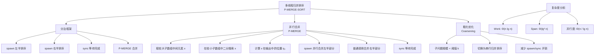
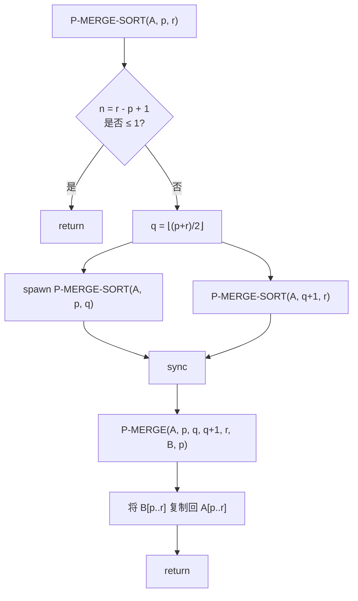
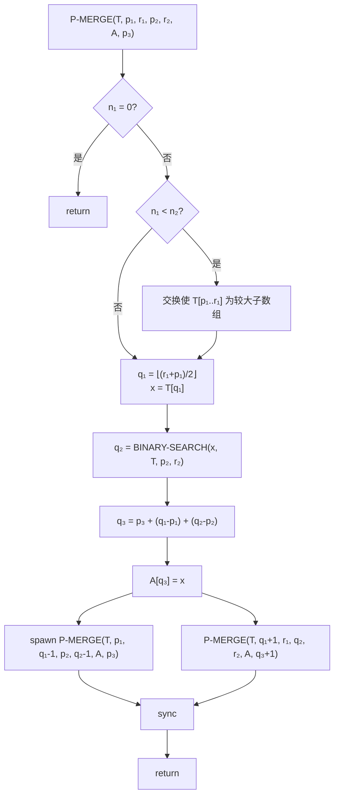

## 相关笔记

**前置知识：**
- [[26.1 动态多线程基础]] — work、span、并行度、spawn/sync 语义
- [[26.2 多线程矩阵乘法]] — 分治策略的并行化范例
- [[离散数学/concepts/归并排序]] — 串行归并排序的完整流程（第2章）
- [[离散数学/concepts/快速排序]] — 另一种分治排序策略（第7章）

**后续内容：**
- 暂无

**关联Wiki：**
- [[离散数学/concepts/并行计算模型]]
- [[离散数学/concepts/分治法]]
- [[离散数学/concepts/递归关系式]]

> [!abstract] 概览
> 本节将经典的==归并排序==改造为==多线程==版本，通过 spawn/sync 机制并行化递归排序与合并操作。核心算法包括 **P-MERGE-SORT**（并行归并排序）和 **P-MERGE**（并行合并），其中 P-MERGE 利用==二分搜索==将合并操作分解为可并行执行的子问题。
>
> **核心要点：**
> - P-MERGE-SORT 的 work 为 $\Theta(n \lg n)$，span 为 $\Theta(\lg^2 n)$，并行度为 $\Theta(n / \lg n)$
> - P-MERGE 的 work 为 $\Theta(n)$，span 为 $\Theta(\lg^2 n)$
> - 通过 ==coarsening==（粗化）优化，在子问题足够小时切换到串行算法，显著减少并行开销
> - 并行排序在比较模型下存在下界：使用 $p$ 个处理器排序 $n$ 个元素至少需要 $\Omega(\lg n / \lg(1 + n/p))$ 时间

## 知识结构总览



## 核心思想

### 2.1 P-MERGE-SORT：多线程归并排序

> [!tip] 算法执行流程
> P-MERGE-SORT 将输入数组递归地分成两半，分别并行排序，最后并行合并两个有序子数组。



> [!def] P-MERGE-SORT
> P-MERGE-SORT 是归并排序的多线程版本。它将数组 $A[p..r]$ 分成两半 $A[p..q]$ 和 $A[q+1..r]$，使用 **spawn** 并行地对两半分别排序，然后调用 P-MERGE 将两个有序子数组合并到辅助数组 $B$ 中，最后复制回 $A$。

**伪代码：**

```
P-MERGE-SORT(A, p, r, B, s)
    n = r - p + 1
    if n == 1
        B[s] = A[p]
        return
    q = ⌊(p + r) / 2⌋
    q' = ⌊(s + r - p) / 2⌋
    spawn P-MERGE-SORT(A, p, q, B, s)
    P-MERGE-SORT(A, q + 1, r, B, q' + 1)
    sync
    P-MERGE(B, s, q', q' + 1, s + n - 1, A, p)
```

**关键说明：**
- 第一个 `spawn` 使左半部分的排序与右半部分的排序并行执行
- `sync` 确保两个排序都完成后才执行合并
- `P-MERGE` 将结果从辅助数组 $B$ 合并回 $A$（注意这里合并方向与串行版本相反，交替使用 $A$ 和 $B$ 避免额外复制）

#### P-MERGE-SORT 的复杂度分析

假设 P-MERGE 的 work 为 $T_1'(n) = \Theta(n)$，span 为 $T_\infty'(n) = \Theta(\lg^2 n)$。

**Work 分析：**

P-MERGE-SORT 的 work 满足递推关系：

$$T_1(n) = 2T_1(n/2) + \Theta(n)$$

> **【递推求解（work: $T_1(n) = 2T_1(n/2) + \Theta(n)$，由主定理情况2得 $T_1(n) = \Theta(n \lg n)$）】**

这与串行归并排序的 work 相同，说明并行化没有增加总计算量。

**Span 分析：**

两个 spawn 的递归调用并行执行，因此 span 取两者中的较大值加上合并的 span：

$$T_\infty(n) = T_\infty(n/2) + \Theta(\lg^2 n)$$

> **【递推求解（span: $T_\infty(n) = T_\infty(n/2) + \Theta(\lg^2 n)$，展开 $\lg n$ 层得 $T_\infty(n) = \sum_{i=0}^{\lg n - 1} \Theta(\lg^2(n/2^i)) = \Theta(\lg^2 n)$）】**

展开递推：
- 第 0 层：$\Theta(\lg^2 n)$
- 第 1 层：$\Theta(\lg^2(n/2)) = \Theta((\lg n - 1)^2)$
- ...
- 第 $\lg n - 1$ 层：$\Theta(\lg^2 1) = \Theta(1)$

总 span = $\sum_{i=0}^{\lg n - 1} (\lg n - i)^2 = \sum_{j=1}^{\lg n} j^2 = \frac{\lg n \cdot (\lg n + 1) \cdot (2\lg n + 1)}{6} = \Theta(\lg^2 n)$

**并行度：**

$$T_1(n) / T_\infty(n) = \Theta(n \lg n) / \Theta(\lg^2 n) = \Theta(n / \lg n)$$

---

### 2.2 P-MERGE：并行合并（核心难点）

> [!tip] 算法执行流程
> P-MERGE 的核心思想是：从较大的有序子数组中取中间元素 $x$，在较小的子数组中二分搜索确定 $x$ 的秩（rank），从而将合并问题分解为两个独立的子合并问题，并行求解。



> [!def] P-MERGE
> P-MERGE 将两个有序子数组 $T[p_1..r_1]$ 和 $T[p_2..r_2]$ 合并到 $A[p_3..r_3]$。算法首先确保 $T[p_1..r_1]$ 是较大的子数组（或两者等大），然后取其中间元素 $x = T[q_1]$，在 $T[p_2..r_2]$ 中二分搜索 $x$ 的插入位置 $q_2$，将 $x$ 放到输出数组的正确位置 $q_3$，最后 spawn 并行合并左半部分、普通调用合并右半部分。

**伪代码：**

```
P-MERGE(T, p₁, r₁, p₂, r₂, A, p₃)
    n₁ = r₁ - p₁ + 1
    n₂ = r₂ - p₂ + 1
    if n₁ == 0
        return
    if n₁ < n₂          // 确保第一个子数组较大
        exchange p₁ with p₂
        exchange r₁ with r₂
        exchange n₁ with n₂
    q₁ = ⌊(p₁ + r₁) / 2⌋
    q₂ = BINARY-SEARCH(T[q₁], T, p₂, r₂)
    q₃ = p₃ + (q₁ - p₁) + (q₂ - p₂)
    A[q₃] = T[q₁]
    spawn P-MERGE(T, p₁, q₁ - 1, p₂, q₂ - 1, A, p₃)
    P-MERGE(T, q₁ + 1, r₁, q₂, r₂, A, q₃ + 1)
    sync
```

**其中 BINARY-SEARCH 的伪代码：**

```
BINARY-SEARCH(x, T, p, r)
    low = p
    high = max(p, r + 1)    // 当 p > r 时，返回 p
    while low < high
        mid = ⌊(low + high) / 2⌋
        if x ≤ T[mid]
            high = mid
        else
            low = mid + 1
    return low
```

> [!example] P-MERGE 执行示例
> 合并 $T[1..4] = [2, 5, 7, 9]$ 和 $T[5..7] = [1, 6, 8]$ 到 $A[1..7]$：
>
> **第 1 层：**
> - $n_1 = 4 \geq n_2 = 3$，不需要交换
> - $q_1 = \lfloor(1+4)/2\rfloor = 2$，$x = T[2] = 5$
> - 在 $T[5..7] = [1, 6, 8]$ 中二分搜索 $5$：$q_2 = 6$（5 应插入位置 6 之前，即索引 6）
> - $q_3 = 1 + (2-1) + (6-5) = 3$，$A[3] = 5$
> - spawn 合并 $T[1..1] = [2]$ 和 $T[5..5] = [1]$ 到 $A[1..2]$
> - 普通调用合并 $T[3..4] = [7, 9]$ 和 $T[6..7] = [6, 8]$ 到 $A[4..7]$
>
> **第 2 层（并行执行）：**
> - 左子问题：$T[1..1] = [2]$，$T[5..5] = [1]$ → $A[1] = 1, A[2] = 2$
> - 右子问题：$q_1 = 3$，$x = 7$，在 $[6, 8]$ 中搜索得 $q_2 = 7$，$q_3 = 4 + (3-3) + (7-6) = 5$，$A[5] = 7$
>   - spawn 合并 $T[3..2]$（空）和 $T[6..6] = [6]$ → $A[4] = 6$
>   - 普通调用合并 $T[4..4] = [9]$ 和 $T[7..7] = [8]$ → $A[6] = 8, A[7] = 9$
>
> **最终结果：** $A[1..7] = [1, 2, 5, 6, 7, 8, 9]$ ✓

#### P-MERGE 的正确性

> **【正确性证明（关键不变式：$x = T[q_1]$ 恰好是合并后数组的第 $q_3 - p_3 + 1$ 个元素）】**

**引理：** P-MERGE 正确地将两个有序子数组合并为一个有序数组。

**证明：** 对 $n = n_1 + n_2$ 进行归纳。

- **基础情况：** $n_1 = 0$ 时，无需合并，直接返回。正确。
- **归纳步骤：** 假设对所有规模小于 $n$ 的输入 P-MERGE 正确。考虑规模为 $n$ 的输入。
  - $x = T[q_1]$ 是较大子数组 $T[p_1..r_1]$ 的中间元素
  - $q_2$ 是 $x$ 在较小子数组 $T[p_2..r_2]$ 中的插入位置，即 $T[p_2..q_2-1]$ 中所有元素 $< x$，$T[q_2..r_2]$ 中所有元素 $\geq x$
  - 因此，合并后数组中恰好有 $(q_1 - p_1)$ 个来自 $T[p_1..q_1-1]$ 的元素和 $(q_2 - p_2)$ 个来自 $T[p_2..q_2-1]$ 的元素小于 $x$
  - $x$ 在合并后数组中的位置为 $q_3 = p_3 + (q_1 - p_1) + (q_2 - p_2)$，正确
  - 左子问题合并 $T[p_1..q_1-1]$ 和 $T[p_2..q_2-1]$，所有元素 $< x$，规模 $< n$
  - 右子问题合并 $T[q_1+1..r_1]$ 和 $T[q_2..r_2]$，所有元素 $\geq x$，规模 $< n$
  - 由归纳假设，两个子问题都正确合并。加上 $A[q_3] = x$，整体正确。$\blacksquare$

#### P-MERGE 的复杂度分析

**Work 分析：**

每次递归调用处理大约一半的元素（$x$ 被取出，剩余分成两部分），加上 $\Theta(\lg n)$ 的二分搜索开销：

$$T_1(n) = T_1(n/2) + \Theta(\lg n) + T_1(n/2) = 2T_1(n/2) + \Theta(\lg n)$$

> **【递推求解（work: $T_1(n) = 2T_1(n/2) + \Theta(\lg n)$，由主定理情况1得 $T_1(n) = \Theta(n)$）】**

验证：$f(n) = \Theta(\lg n) = O(n^{\log_2 2 - \epsilon}) = O(n^{1-\epsilon})$，取 $\epsilon = 1/2$ 即可满足。因此 $T_1(n) = \Theta(n)$。

**Span 分析：**

两个子问题并行执行，span 取较大值加上二分搜索的 span：

$$T_\infty(n) = T_\infty(n/2) + \Theta(\lg n)$$

> **【递推求解（span: $T_\infty(n) = T_\infty(n/2) + \Theta(\lg n)$，展开得 $T_\infty(n) = \sum_{i=0}^{\lg n - 1} \Theta(\lg(n/2^i)) = \Theta(\lg^2 n)$）】**

展开递推：
- 第 0 层：$\Theta(\lg n)$
- 第 1 层：$\Theta(\lg(n/2)) = \Theta(\lg n - 1)$
- ...
- 第 $\lg n - 1$ 层：$\Theta(1)$

总 span = $\sum_{i=0}^{\lg n - 1} (\lg n - i) = \sum_{j=1}^{\lg n} j = \frac{\lg n \cdot (\lg n + 1)}{2} = \Theta(\lg^2 n)$

---

### 2.3 Coarsening（粗化优化）

> [!tip] Coarsening 的核心思想
> 当子数组规模足够小时，并行化的开销（spawn/sync 的线程管理代价）超过了并行执行带来的收益。此时应切换到串行算法，避免不必要的并行开销。

**具体策略：**
- 设定一个阈值 $n_0$（通常为几百到几千）
- 当 $n \leq n_0$ 时，P-MERGE-SORT 直接调用串行 MERGE-SORT
- 当 $n \leq n_0$ 时，P-MERGE 直接调用串行 MERGE

**对复杂度的影响：**
- Work 不变，仍为 $\Theta(n \lg n)$
- Span 在最底层 $\lg n - \lg n_0$ 层后切换为串行，但渐近 span 不变
- 实际运行时间显著降低，因为避免了大量细粒度的 spawn/sync 操作

> [!example] Coarsening 的效果
> 假设 $n = 10^6$，阈值 $n_0 = 1000$：
> - 不使用 coarsening：递归深度约 20 层，产生约 $2 \times 10^6$ 个 spawn 操作
> - 使用 coarsening：递归深度约 10 层（到 $n \leq 1000$ 后串行），spawn 操作约 $2 \times 10^3$ 个
> - 线程管理开销减少约 1000 倍

## 补充理解与拓展

> [!info] Cole 最优并行归并排序
> **来源**：Richard Cole（1988），"Optimal Parallel Merge Sort"，SIAM Journal on Computing, 17(4), pp. 770-785
> **链接**：https://doi.org/10.1137/0217049
>
> Cole 提出了一个在 CREW PRAM 模型上达到 $O(\lg n)$ 时间、$O(n \lg n)$ 总工作的最优并行归并排序算法。其核心创新是使用"==overpick and underpick=="技术，在每一步合并中通过巧妙的抽样策略，使得 $\lg n$ 轮合并即可完成排序。该算法的理论意义在于证明了并行归并排序可以达到==最优==的 $O(\lg n)$ 时间复杂度（匹配 AKS 排序网络的下界），但实际实现中常数因子较大，工程实用性不如本节介绍的 P-MERGE-SORT。

> [!info] 并行排序的下界
> **来源**：Mikhail J. Atallah, S. R. Kosaraju（1984），"Tight Comparison Bounds on the Complexity of Parallel Sorting"，SIAM Journal on Computing, 13(3), pp. 588-600
> **链接**：https://doi.org/10.1137/0213037
>
> 在==比较模型==下，使用 $p$ 个处理器对 $n$ 个元素排序，至少需要 $\Omega\left(\frac{\lg n}{\lg(1 + n/p)}\right)$ 时间。当 $p = \Theta(n)$ 时，下界为 $\Omega(\lg n)$；当 $p = \Theta(n / \lg n)$ 时，下界为 $\Omega(\lg^2 n / \lg \lg n)$。本节的 P-MERGE-SORT 的 span 为 $\Theta(\lg^2 n)$，在 $p = \Theta(n / \lg n)$ 个处理器时接近最优。要达到 $O(\lg n)$ 的 span，需要更复杂的算法（如 Cole 的算法）。

> [!info] 前缀和与并行排序的关系
> **来源**：Guy E. Blelloch（1990），"Prefix Sums and Their Applications"，收录于 John H. Reif 编的 Synthesis of Parallel Algorithms, Morgan Kaufmann
> **链接**：https://www.cs.cmu.edu/~guyb/papers/Ble90.pdf
>
> ==前缀和（Prefix Sums）== 是并行计算中的基本原语，work 为 $\Theta(n)$，span 为 $\Theta(\lg n)$。许多并行排序算法（包括并行归并排序的某些变体）都依赖前缀和来高效计算元素位置。Blelloch 的工作系统性地展示了前缀和在并行算法设计中的核心地位，包括排序、扫描、压缩等应用。理解前缀和有助于深入掌握并行算法的设计范式。

> [!info] Brent 定理与并行算法的实际性能
> **来源**：Richard P. Brent（1974），"The Parallel Evaluation of General Arithmetic Expressions"，Journal of the ACM, 21(2), pp. 201-208
> **链接**：https://doi.org/10.1145/321812.321815
>
> ==Brent 定理==指出，任何 work 为 $T_1$、span 为 $T_\infty$ 的并行算法，在 $p$ 个处理器上的运行时间 $T_p$ 满足：
> $$T_1 / p \leq T_p \leq T_1 / p + T_\infty$$
> 这意味着并行度 $T_1 / T_\infty$ 决定了算法能有效利用的最大处理器数。对于 P-MERGE-SORT，并行度为 $\Theta(n / \lg n)$，因此使用超过 $\Theta(n / \lg n)$ 个处理器不会带来额外加速。Coarsening 的本质就是减少 $T_\infty$ 中的常数因子，使实际 $T_p$ 更接近下界 $T_1 / p$。

## 易混淆点与辨析

> [!warning] P-MERGE 中"较大子数组"的选择
> P-MERGE 要求从==较大==的子数组中取中间元素 $x$，而非较小子数组。原因在于：如果从较小子数组中取中间元素，二分搜索在较大子数组中的开销为 $\Theta(\lg n_1)$（$n_1$ 为较大子数组长度），但递归分解后两个子问题的规模不平衡——一个子问题可能非常小而另一个仍然很大，导致 span 递推变为 $T_\infty(n) = T_\infty(n - 1) + \Theta(\lg n) = \Theta(n \lg n)$，远差于从较大子数组取中间元素时的 $\Theta(\lg^2 n)$。

> [!warning] P-MERGE-SORT 的合并方向
> 注意伪代码中 P-MERGE-SORT 的合并方向：排序结果先写入辅助数组 $B$，然后 P-MERGE 将 $B$ 中的两个有序段合并回 $A$。这与串行归并排序（通常从辅助数组合并回原数组）的方向交替使用，目的是==避免额外的数组复制==操作。在递归的每一层，$A$ 和 $B$ 的角色交替互换。

> [!warning] Span 分析中"并行取最大"的常见错误
> 在分析 P-MERGE 的 span 时，容易犯的错误是将递推写为 $T_\infty(n) = 2T_\infty(n/2) + \Theta(\lg n)$（与 work 分析混淆）。正确的做法是：由于 spawn 使两个子问题==并行==执行，span 只取其中一个分支的深度，即 $T_\infty(n) = T_\infty(n/2) + \Theta(\lg n)$。只有当两个操作必须==串行==执行时，span 才相加。

## 习题精选

| 题号 | 题目描述 | 难度 | 考察重点 |
|:---:|:---|:---:|:---|
| 27.3-1 | 解释如何对 P-MERGE 进行粗化 | ★☆☆ | Coarsening 实践 |
| 27.3-2 | 使用中位数查找的变体并行合并 | ★★★ | P-MERGE 变体设计 |
| 27.3-3 | 并行化 PARTITION 过程 | ★★☆ | 并行分区算法 |
| 27.3-4 | 并行化 RECURSIVE-FFT | ★★☆ | 并行 FFT |
| 27.3-5 | 并行化 RANDOMIZED-SELECT | ★★★ | 并行选择算法 |

> [!faq]- 27.3-1 解释如何对 P-MERGE 进行粗化
> **解答：**
>
> 将 P-MERGE 第 2 行的条件 `if n₁ == 0` 替换为 `if n₁ + n₂ ≤ k`（其中 $k$ 为某个阈值常数）。当子数组总长度不超过 $k$ 时，不再递归分解，而是直接调用==串行合并==（如 MERGE 过程）将 $T[p_1..r_1]$ 和 $T[p_2..r_2]$ 合并到 $A[p_3..r_3]$。
>
> 类似地，对 P-MERGE-SORT 也可以进行粗化：当 $n \leq k$ 时直接调用串行插入排序或归并排序，避免 spawn/sync 的开销。

> [!faq]- 27.3-2 使用中位数查找的变体并行合并
> **解答：**
>
> 利用练习 9.3-8 的结果，可以在 $O(\lg n)$ 时间内找到两个有序数组总体的中位数。修改 P-MERGE 为 P-MEDIAN-MERGE：
>
> ```
> P-MEDIAN-MERGE(T, p₁, r₁, p₂, r₂, A, p₃)
>     n₁ = r₁ - p₁ + 1
>     n₂ = r₂ - p₂ + 1
>     if n₁ < n₂
>         exchange p₁ with p₂
>         exchange r₁ with r₂
>         exchange n₁ with n₂
>     if n₁ == 0
>         return
>     q = MEDIAN(T, p₁, r₁, p₂, r₂)  // 返回中位数位置和所在数组
>     if q.arr == 1                    // 中位数在第一个数组中
>         q₂ = BINARY-SEARCH(T[q.pos], T, p₂, r₂)
>         q₃ = p₃ + q.pos - p₁ + q₂ - p₂
>         A[q₃] = T[q.pos]
>         spawn P-MEDIAN-MERGE(T, p₁, q.pos - 1, p₂, q₂ - 1, A, p₃)
>         P-MEDIAN-MERGE(T, q.pos + 1, r₁, q₂, r₂, A, q₃ + 1)
>         sync
>     else                            // 中位数在第二个数组中
>         q₂ = BINARY-SEARCH(T[q.pos], T, p₁, r₁)
>         q₃ = p₃ + q.pos - p₂ + q₂ - p₁
>         A[q₃] = T[q.pos]
>         spawn P-MEDIAN-MERGE(T, p₁, q₂ - 1, p₂, q.pos - 1, A, p₃)
>         P-MEDIAN-MERGE(T, q₂, r₁, q.pos + 1, r₂, A, q₃ + 1)
>         sync
> ```
>
> **复杂度分析：**
> - Work：$T_1(n) = 2T_1(n/2) + O(\lg n) = \Theta(n)$
> - Span：$T_\infty(n) = T_\infty(n/2) + O(\lg n) + O(\lg n/2) = T_\infty(n/2) + O(\lg n) = \Theta(\lg^2 n)$
>
> 与原始 P-MERGE 的复杂度相同，但中位数查找的常数因子可能更大。

> [!faq]- 27.3-3 并行化 PARTITION 过程
> **解答：**
>
> 给定数组 $A[1..n]$ 和枢轴元素 $A[n]$，目标是并行地将数组分为小于枢轴和大于等于枢轴的两部分。
>
> **算法思路：**
> 1. 将数组分成 $\lceil n/c \rceil$ 个块，分配给 $c$ 个处理器
> 2. 每个处理器统计其块中小于枢轴的元素个数
> 3. 使用并行前缀和计算每个块的起始写入位置
> 4. 每个处理器将其块中的元素写入辅助数组的正确位置
>
> **复杂度分析：**
> - Work：$\Theta(n)$（每个元素被处理常数次）
> - Span：$\Theta(\lg n)$（前缀和的 span）
> - 并行度：$\Theta(n / \lg n)$

> [!faq]- 27.3-4 并行化 RECURSIVE-FFT
> **解答：**
>
> ```
> P-RECURSIVE-FFT(a)
>     n = a.length
>     if n == 1
>         return a
>     wₙ = e^(2πi/n)
>     w = 1
>     a⁰ = [a[0], a[2], ..., a[n-2]]    // 偶数下标
>     a¹ = [a[1], a[3], ..., a[n-1]]    // 奇数下标
>     y⁰ = spawn P-RECURSIVE-FFT(a⁰)
>     y¹ = P-RECURSIVE-FFT(a¹)
>     sync
>     parallel for k = 0 to n/2 - 1
>         y[k] = y⁰[k] + w · y¹[k]
>         y[k + n/2] = y⁰[k] - w · y¹[k]
>         w = w · wₙ
>     return y
> ```
>
> **复杂度分析：**
> - Work：$T_1(n) = 2T_1(n/2) + \Theta(n) = \Theta(n \lg n)$
> - Span：$T_\infty(n) = T_\infty(n/2) + \Theta(\lg n) = \Theta(\lg^2 n)$
> - 并行度：$\Theta(n / \lg n)$

## 视频学习指南

| 资源 | 讲者/来源 | 时长 | 覆盖内容 | 推荐度 |
|:---|:---|:---:|:---|:---:|
| MIT 6.006 Lecture 12: Searching and Sorting | Erik Demaine | ~80min | 归并排序基础 | ★★★ |
| MIT 6.046 Lecture 9: Multithreaded Algorithms | Erik Demaine | ~80min | 动态多线程、work/span | ★★★★ |
| Parallel Merge Sort 可视化 | 网络资源 | ~15min | P-MERGE 执行过程动画 | ★★★ |

## 教材原文

> [!quote] 算法导论（第4版）第26.3节
> "We now examine how to multithread merge sort, a divide-and-conquer algorithm that we saw in Chapter 2. To multithread merge sort, we need to parallelize both the divide step and the combine step. We can parallelize the divide step trivially: just divide the array in half. The combine step, however, requires merging two sorted subarrays, which is more challenging to parallelize."
>
> "The key idea behind P-MERGE is to find the median element of the larger subarray and use binary search to find its position in the smaller subarray. This approach allows us to split the merging problem into two independent subproblems that can be solved in parallel."

## 参见Wiki

- [[离散数学/concepts/并行计算模型]]
- [[离散数学/concepts/分治法]]
- [[离散数学/concepts/递归关系式]]
- [[离散数学/concepts/归并排序]]
- [[离散数学/concepts/快速排序]]
- [[离散数学/concepts/前缀和]]
- [[离散数学/concepts/Brent定理]]
- [[离散数学/concepts/PRAM模型]]

#学习/算法导论/第26章-并行算法 #学习/算法导论/并行算法/多线程归并排序
