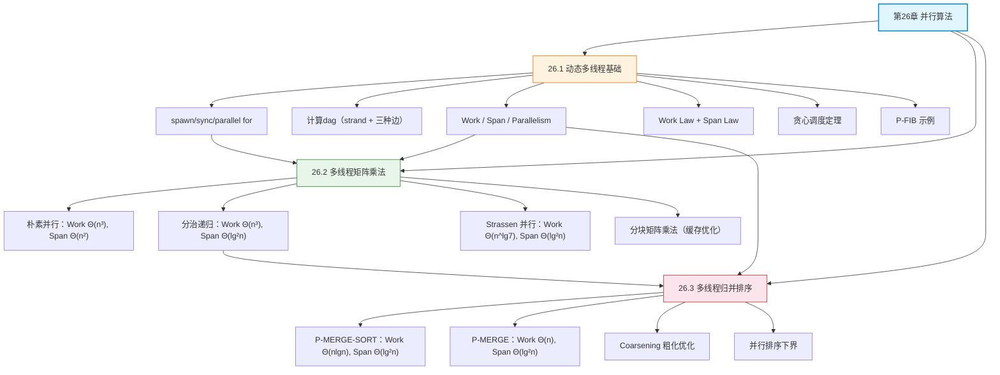

## 相关笔记

**本章节笔记：**
- [[26.1 动态多线程基础]] — 动态多线程计算模型、计算dag、Work/Span/Parallelism、贪心调度定理
- [[26.2 多线程矩阵乘法]] — 朴素并行、分治递归并行、Strassen 并行矩阵乘法
- [[26.3 多线程归并排序]] — P-MERGE-SORT、P-MERGE、Coarsening 优化

**前置章节汇总：**
- [[第25章_二部图匹配-章节汇总]] — 第25章网络流与匹配

**后续章节：**
- 暂无

---

> [!abstract] 概览
> 第26章系统介绍了==并行算法==的设计与分析方法。全章以==动态多线程==（dynamic multithreading）计算模型为核心框架，通过 `spawn` 和 `sync` 关键字描述并行性，用==计算dag==刻画并行执行的依赖结构。性能分析围绕三个核心度量展开：==Work== $T_1$（总工作量）、==Span== $T_\infty$（关键路径长度）和==Parallelism== $T_1/T_\infty$（理论最大加速比）。==贪心调度==定理保证了实际运行时间的上界 $T_P \le T_1/P + T_\infty$。
>
> 在此框架下，本章依次展示了三个经典算法的并行化：(1) 朴素并行矩阵乘法（Work $\Theta(n^3)$，Span $\Theta(n^2)$）；(2) 分治递归并行矩阵乘法（Work $\Theta(n^3)$，Span $\Theta(\lg^2 n)$）；(3) 多线程归并排序（Work $\Theta(n\lg n)$，Span $\Theta(\lg^2 n)$）。此外还介绍了 Strassen 算法的并行化（Work $\Theta(n^{\lg 7})$，Span $\Theta(\lg^2 n)$）和 Coarsening 优化策略。

---

## 知识结构总览

---

## 核心概念回顾

### 三节内容对比

| 维度 | 26.1 动态多线程基础 | 26.2 多线程矩阵乘法 | 26.3 多线程归并排序 |
|:---|:---|:---|:---|
| **核心问题** | 建立并行算法的理论分析框架 | 将矩阵乘法并行化 | 将归并排序并行化 |
| **关键技术** | spawn/sync、计算dag、贪心调度 | parallel for、分治 + spawn | 分治 + spawn + 二分搜索 |
| **Work** | P-FIB: $\Theta(\varphi^n)$ | 朴素 $\Theta(n^3)$，Strassen $\Theta(n^{\lg 7})$ | $\Theta(n \lg n)$ |
| **Span** | P-FIB: $\Theta(n)$ | 朴素 $\Theta(n^2)$，分治 $\Theta(\lg^2 n)$ | $\Theta(\lg^2 n)$ |
| **Parallelism** | P-FIB: $\Theta(\varphi^n/n)$ | 朴素 $\Theta(n)$，分治 $\Theta(n^3/\lg^2 n)$ | $\Theta(n/\lg n)$ |
| **并行化策略** | 模型定义 | 循环并行化 + 分治递归 | 分治递归 + 并行合并 |
| **优化手段** | 贪心调度器 | Strassen + 分块缓存 | Coarsening 粗化 |

> [!note] 算法选型指南
> - **需要高并行度**：优先选择分治递归并行版本（如分治矩阵乘法、归并排序），其 parallelism 远超朴素循环并行
> - **需要降低 Work**：在分治框架中引入 Strassen 等快速算法，可在降低 Work 的同时保持低 Span
> - **需要工程实用性**：结合 Coarsening（粗化）和分块（blocking）策略，减少并行开销和缓存未命中
> - **处理器数有限时**：当 $P \ll T_1/T_\infty$ 时，贪心调度即可达到近线性加速；当 $P$ 接近 parallelism 时，$T_\infty$ 成为瓶颈

> [!def] 核心定理汇总
> 1. **Work Law**：$T_P \ge T_1/P$ — $P$ 个处理器最多同时完成 $P$ 个单位 work
> 2. **Span Law**：$T_P \ge T_\infty$ — 关键路径上的 strand 必须串行执行
> 3. **贪心调度定理**：$T_P \le T_1/P + T_\infty$ — 贪心调度器的时间上界
> 4. **近线性加速推论**：若 $T_1/T_\infty = \Omega(P)$，则 $T_P = O(T_1/P)$

---

## 跨章关联

### 与第4章（分治策略）的关系

动态多线程模型是==分治思想的并行扩展==。第4章中的分治策略（如代入法、递归树、主定理）是分析并行算法 Work 和 Span 的核心工具：
- [[4.3 代入法]] — 用于验证 Work/Span 递推关系的解
- [[4.5 主定理]] — 直接求解 $T_1(n) = aT_1(n/b) + f(n)$ 形式的 Work 递推
- [[4.2 Strassen算法]] — Strassen 矩阵乘法是串行分治算法，26.2 节将其并行化

### 与第2章（入门/归并排序）的关系

- [[第02章_入门-章节汇总]] — 串行归并排序是 P-MERGE-SORT 的基础，两者 Work 相同（$\Theta(n\lg n)$），但并行版本通过 spawn 将 Span 从 $\Theta(n)$ 降至 $\Theta(\lg^2 n)$（假设串行归并排序的 span 为 $\Theta(n)$）

### 与第7章（快速排序）的关系

- [[第07章_快速排序-章节汇总]] — 快速排序也是分治排序策略，其并行化思路与归并排序类似（并行分区 + 并行递归），但 PARTITION 过程的并行化比 MERGE 更复杂

### 与第25章（二部图匹配）的关系

- [[第25章_二部图匹配-章节汇总]] — 第25章的网络流与匹配问题为并行算法提供了应用背景，许多图算法（如最大流、最大匹配）都可以利用动态多线程模型进行并行化

---

## 综合复习题

> [!faq]- Q1：给定一个 work 为 $T_1 = 10000$、span 为 $T_\infty = 100$ 的并行计算，在 $P = 50$ 个处理器上的运行时间范围是多少？能否达到近线性加速？
>
> **解答：**
>
> 由贪心调度定理：$T_P \le T_1/P + T_\infty = 10000/50 + 100 = 200 + 100 = 300$
>
> 由 Work Law：$T_P \ge T_1/P = 200$
>
> 由 Span Law：$T_P \ge T_\infty = 100$
>
> 因此 $200 \le T_P \le 300$。
>
> Parallelism = $T_1/T_\infty = 100$，而 $P = 50$。由于 $T_1/T_\infty = 100 = \Omega(50) = \Omega(P)$，满足近线性加速的条件，$T_P = O(T_1/P) = O(200)$。
>
> 加速比 = $T_1/T_P \ge 10000/300 \approx 33.3$，理论上限为 50（完美线性加速）。

> [!faq]- Q2：为什么 P-MERGE 必须从较大的子数组中取中间元素，而非较小子数组？如果选错会怎样？
>
> **解答：**
>
> P-MERGE 从较大子数组 $T[p_1..r_1]$ 中取中间元素 $x = T[q_1]$，然后在较小子数组中二分搜索 $x$ 的位置 $q_2$。这样分解后：
> - 左子问题规模：$(q_1 - p_1) + (q_2 - p_2) \approx n/2$
> - 右子问题规模：$(r_1 - q_1) + (r_2 - q_2) \approx n/2$
>
> 两个子问题规模大致平衡，span 递推为 $T_\infty(n) = T_\infty(n/2) + \Theta(\lg n) = \Theta(\lg^2 n)$。
>
> 如果从较小子数组中取中间元素，二分搜索在较大子数组中的开销仍为 $\Theta(\lg n)$，但分解后两个子问题严重不平衡——一个子问题可能接近 $n$ 而另一个接近 0，导致 span 递推变为 $T_\infty(n) = T_\infty(n-1) + \Theta(\lg n) = \Theta(n\lg n)$，远差于 $\Theta(\lg^2 n)$。

> [!faq]- Q3：对比分治递归矩阵乘法和 Strassen 并行矩阵乘法，在什么场景下应该选择哪种？为什么？
>
> **解答：**
>
> | 维度 | 分治递归 | Strassen 并行 |
> |:---|:---|:---|
> | Work | $\Theta(n^3)$ | $\Theta(n^{\lg 7}) \approx \Theta(n^{2.807})$ |
> | Span | $\Theta(\lg^2 n)$ | $\Theta(\lg^2 n)$ |
> | Parallelism | $\Theta(n^3/\lg^2 n)$ | $\Theta(n^{2.807}/\lg^2 n)$ |
> | 数值稳定性 | 高 | 较低（浮点误差累积） |
> | 实现复杂度 | 低 | 高（10个辅助矩阵） |
>
> - **选择分治递归**：当数值稳定性要求高、矩阵规模不大、或实现简单性优先时
> - **选择 Strassen**：当矩阵规模很大（$n > 1000$）、对计算速度要求极高、且可以接受一定的数值精度损失时
> - **最佳实践**：混合策略——递归上层使用 Strassen 降低 work，递归下层切换到分治或 BLAS 朴素乘法保证数值稳定性和缓存效率

---

## 常见误区

> [!warning] 误区1：spawn 改变的是执行方式，而非计算量
> `spawn` 只是允许调用者与被调用者并行执行，**不改变总计算量**。因此将普通调用改为 `spawn` 后，Work 保持不变，但 Span 可能减小（因为并行执行消除了部分串行依赖）。初学者常误以为 `spawn` 会增加或减少 Work。

> [!warning] 误区2：Span 分析中并行分支取最大值而非求和
> 当多个子任务通过 `spawn` 并行执行时，Span 只计算**最长路径**的深度，而非所有分支的 span 之和。例如 8 个 spawn 的递归调用，span 递推系数为 1（取最大），而非 8（求和）。这是 Work 分析和 Span 分析的核心区别。

> [!warning] 误区3：Parallelism 越大越好
> Parallelism $T_1/T_\infty$ 只是理论上的最大加速比上界，实际加速比还受限于处理器数 $P$。当 $P \ll T_1/T_\infty$ 时，增加 parallelism 不会带来额外收益。更重要的是，追求高 parallelism 可能导致 Work 增大或实现复杂度上升。工程中需要在 Work、Span 和实现复杂度之间权衡。

---

## 学习要点总结

| 学习目标 | 掌握程度 | 对应笔记 |
|:---|:---:|:---|
| 理解 spawn/sync/parallel for 的语义 | ★★★★★ | [[26.1 动态多线程基础]] |
| 掌握计算dag的结构（strand + 三种边） | ★★★★★ | [[26.1 动态多线程基础]] |
| 掌握 Work/Span/Parallelism 的定义与计算 | ★★★★★ | [[26.1 动态多线程基础]] |
| 理解并证明贪心调度定理 | ★★★★☆ | [[26.1 动态多线程基础]] |
| 分析朴素并行矩阵乘法的 Work/Span | ★★★★☆ | [[26.2 多线程矩阵乘法]] |
| 分析分治递归并行矩阵乘法的 Work/Span | ★★★★★ | [[26.2 多线程矩阵乘法]] |
| 理解 Strassen 并行矩阵乘法 | ★★★★☆ | [[26.2 多线程矩阵乘法]] |
| 理解分块矩阵乘法与缓存优化 | ★★★☆☆ | [[26.2 多线程矩阵乘法]] |
| 掌握 P-MERGE-SORT 的设计与分析 | ★★★★★ | [[26.3 多线程归并排序]] |
| 掌握 P-MERGE 的设计与正确性证明 | ★★★★★ | [[26.3 多线程归并排序]] |
| 理解 Coarsening 优化策略 | ★★★★☆ | [[26.3 多线程归并排序]] |
| 了解并行排序的下界 | ★★★☆☆ | [[26.3 多线程归并排序]] |

---

## 参见Wiki

- [[离散数学/concepts/分治法]] — 并行算法的核心设计范式
- [[离散数学/concepts/主定理]] — Work 递推关系的求解工具
- [[离散数学/concepts/递归树]] — 分析递推关系的直观方法
- [[离散数学/concepts/递归关系式]] — 递推关系的系统化求解
- [[离散数学/concepts/Fibonacci数]] — P-FIB 示例的数学背景
- [[离散数学/concepts/渐近分析]] — Work 和 Span 的渐近记号
- [[离散数学/concepts/矩阵乘法]] — 矩阵乘法的数学定义
- [[离散数学/concepts/Strassen算法]] — Strassen 矩阵乘法的完整推导
- [[离散数学/concepts/归并排序]] — 串行归并排序基础
- [[离散数学/concepts/快速排序]] — 另一种分治排序策略
- [[离散数学/concepts/贪心算法]] — 贪心调度策略的思想渊源

---

#学习/算法导论/第26章-并行算法 #学习/算法导论/并行算法/章节汇总
