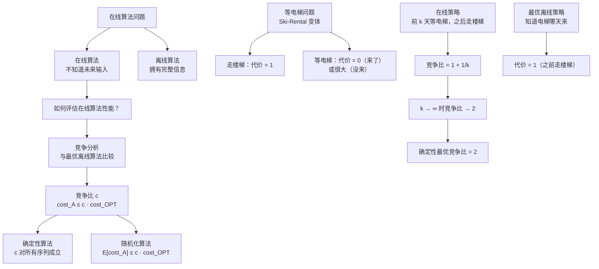

## 相关笔记

- 前置知识：[[第15章_贪心算法/15.4 离线缓存]]（离线缓存问题与 furthest-in-future 策略）、[[16.1 聚合分析]]（摊还分析基础）、[[5.3 随机化算法]]（随机化策略基础）
- 同章笔记：[[27.2 维护搜索列表]]、[[27.3 在线缓存]]
- 章节汇总：[[第27章_在线算法-章节汇总]]
- 关联概念：[[离散数学/concepts/在线算法]]、[[离散数学/concepts/贪心算法]]、[[离散数学/concepts/概率分析]]

> [!abstract] 概览
> 本节通过"等电梯"问题（Ski-Rental Problem 的生活化变体）引入==在线算法==（online algorithm）与==竞争分析==（competitive analysis）的核心框架。在线算法必须在不知道未来输入的情况下立即做出决策，其性能通过==竞争比==（competitive ratio）来衡量——即在线算法代价与最优离线算法代价之比的最坏情况上界。
>
> - ==在线算法==：无法预知未来输入，必须对每个请求立即做出不可撤回的决策
> - ==离线算法==：可以看到全部输入序列后再做决策，拥有"后见之明"
> - ==竞争比==：对所有输入序列 $\sigma$，$\text{cost}_A(\sigma) \leq c \cdot \text{cost}_{\text{OPT}}(\sigma)$，常数 $c$ 即竞争比
> - ==确定性在线算法==：竞争比对所有输入序列确定性地成立
> - ==随机化在线算法==：竞争比以期望值形式成立
> - ==Ski-Rental 策略==：前 $k$ 天等电梯，之后走楼梯，竞争比为 $1 + 1/k$
> - ==最优确定性竞争比==：当 $k \to \infty$ 时，确定性竞争比趋近于 2

---

## 知识结构总览



---

## 核心思想

> [!tip] 核心思路
> 在线算法的核心困难在于**信息不对称**：离线算法拥有"后见之明"，可以看到全部输入后做出全局最优决策；而在线算法必须在每个决策点立即行动，无法预知未来。竞争分析通过将在线算法与最优离线算法直接比较，为在线算法的性能提供了严格的理论保证。等电梯问题是理解竞争分析的最佳入门案例——它的模型简单、直觉清晰，但竞争比的证明已经包含了竞争分析的全部核心要素。

### 在线算法与离线算法

> [!def] 在线算法（Online Algorithm）
> 在线算法是一种必须逐步处理输入序列的算法：在每个步骤，算法必须基于当前已知的输入做出不可撤回的决策，而无法预知未来的输入。形式化地，输入序列 $\sigma = \langle r_1, r_2, \ldots, r_n \rangle$ 逐个到达，算法在处理 $r_i$ 时不知道 $r_{i+1}, r_{i+2}, \ldots, r_n$ 的内容。

> [!def] 离线算法（Offline Algorithm）
> 离线算法可以在做出任何决策之前看到完整的输入序列 $\sigma = \langle r_1, r_2, \ldots, r_n \rangle$，因此可以做出全局最优决策。离线算法的最优代价记为 $\text{cost}_{\text{OPT}}(\sigma)$，它是在线算法性能的评估基准。

> [!def] 竞争比（Competitive Ratio）
> 对于在线算法 $A$，如果存在常数 $c \geq 1$，使得对所有输入序列 $\sigma$，都有
> $$\text{cost}_A(\sigma) \leq c \cdot \text{cost}_{\text{OPT}}(\sigma)$$
> 则称 $A$ 是 $c$-竞争的（$c$-competitive），$c$ 称为 $A$ 的**竞争比**。竞争比越小，在线算法越接近离线最优。

**生活类比**：想象你每天早上在公寓楼下决定是走楼梯还是等电梯。走楼梯需要固定时间（代价为 1），等电梯如果电梯来了代价为 0（很快），但如果电梯没来你就要等很久（代价很大）。你不知道电梯今天会不会来——这就是在线决策。而如果有人告诉你"电梯第 7 天会来"，你就可以做出最优决策——这就是离线决策。

### "等电梯"问题模型

> [!def] 等电梯问题（Waiting for an Elevator / Ski-Rental Problem）
> 每天早上你需要从 1 楼到 10 楼上班。你有两个选择：
> - **走楼梯**：每天代价固定为 1
> - **等电梯**：如果电梯来了，代价为 0；如果电梯没来，代价非常大（可以视为 $\infty$）
>
> 电梯会在某一天 $T$ 到来（$T$ 未知，也可能永远不来）。你的目标是最小化总代价。
>
> 这个问题等价于经典的 **Ski-Rental Problem**：滑雪者每天决定租雪板（代价 1）还是买雪板（代价 $B$），不知道还会滑雪多少天。

**模型简化**：为了分析方便，将问题简化为——你每天选择"等电梯"或"走楼梯"，等电梯的代价为 0（电梯来了）或 $B$（电梯没来，$B$ 很大），走楼梯的代价固定为 1。电梯在某天 $T$ 到来后，此后每天等电梯的代价都为 0。

### 最优离线策略

> [!example] 最优离线策略
> 如果知道电梯在第 $T$ 天到来，最优离线策略为：
> - 第 $1$ 天到第 $T-1$ 天：走楼梯，每天代价 1，总代价 $T - 1$
> - 第 $T$ 天及以后：等电梯，代价 0
> - **总代价**：$\text{cost}_{\text{OPT}} = T - 1$
>
> 如果电梯永远不来（$T = \infty$），最优策略是始终走楼梯，总代价随天数线性增长。

### 在线策略与竞争比

> [!note] 在线策略设计
> 设计在线策略 ELEVATOR(k)：前 k - 1 天走楼梯，从第 k 天开始等电梯。
>
> **直觉**：如果电梯在前 $k$ 天内到来，我们之前走楼梯的代价不会太大；如果电梯在 $k$ 天之后才来，我们从第 $k$ 天开始等电梯，一旦电梯到来，此后代价为 0。

#### 竞争比分析

> **【竞争比分析（在线代价/最优离线代价上界）】**

分两种情况分析策略 $\text{ELEVATOR}(k)$ 的竞争比：

**情况 1**：电梯在第 $T$ 天到来，$T \leq k$。

- 在线代价：前 $T - 1$ 天走楼梯，代价 $T - 1$；第 $T$ 天开始等电梯，代价 0。总代价 $= T - 1$
- 离线最优代价：$T - 1$（相同策略）
- 竞争比：$\frac{T - 1}{T - 1} = 1$

**情况 2**：电梯在第 $T$ 天到来，$T > k$。

- 在线代价：前 $k - 1$ 天走楼梯，代价 $k - 1$；从第 $k$ 天到第 $T - 1$ 天等电梯但电梯没来，代价为 $(T - k) \cdot B$；第 $T$ 天及以后等电梯，代价 0

  此处需要重新审视模型。在标准 Ski-Rental 模型中，"等电梯"对应"租雪板"，"走楼梯"对应"买雪板"。让我们用更标准的 Ski-Rental 模型重新表述。

**标准 Ski-Rental 模型**：

- **租用**（rent）：每次代价为 1
- **购买**（buy）：一次性代价为 $B$
- 你不知道还会滑雪多少次

在线策略 $\text{RENTAL-SKI}(k)$：前 $k - 1$ 次租用，第 $k$ 次之前购买。

**情况 1**：总共滑雪 $T$ 次，$T \leq k$。

- 在线代价：租用 $T$ 次，代价 $T$
- 离线最优代价：租用 $T$ 次，代价 $T$（因为 $T \leq k \leq B$ 时租用更优）
- 竞争比：$T / T = 1$

**情况 2**：总共滑雪 $T$ 次，$T > k$。

- 在线代价：租用 $k - 1$ 次后购买，代价 $(k - 1) + B$
- 离线最优代价：
  - 若 $T \leq B$：始终租用，代价 $T$
  - 若 $T > B$：第 1 次就购买，代价 $B$
  - 统一为 $\min(T, B)$

取 $k = B$（即租用 $B - 1$ 次后购买）：

- **情况 1**（$T \leq B$）：在线代价 $= T$，离线代价 $= T$，竞争比 $= 1$
- **情况 2**（$T > B$）：在线代价 $= (B - 1) + B = 2B - 1$，离线代价 $= B$，竞争比 $= \frac{2B - 1}{B} = 2 - \frac{1}{B}$

当 $B$ 很大时，竞争比趋近于 2。

> **【反证法（假设存在竞争比小于 2 的确定性策略导致矛盾）】**

**最优性论证**：没有任何确定性在线算法能达到小于 2 的竞争比。

**证明**：反证法。假设存在确定性在线算法 $A$，其竞争比 $c < 2$。

考虑对手（adversary）的策略：对手观察 $A$ 的行为，选择使 $A$ 表现最差的输入序列。

- 如果 $A$ 在第 $k$ 天选择购买（走楼梯），对手令电梯在第 $k + 1$ 天到来（总滑雪 $k + 1$ 次）：
  - $A$ 的代价：$k - 1 + B$（前 $k - 1$ 天租用 + 购买代价 $B$）
  - OPT 的代价：$k$（始终租用，因为 $k + 1 \leq B$ 当 $k < B$）
  - 竞争比 $\geq \frac{k - 1 + B}{k}$

- 如果 $A$ 始终不购买，对手令总滑雪次数为 $B + 1$：
  - $A$ 的代价：$B + 1$（始终租用）
  - OPT 的代价：$B$（第 1 次就购买）
  - 竞争比 $\geq \frac{B + 1}{B} = 1 + \frac{1}{B}$

对于第一种情况，当 $k = B$ 时竞争比 $= \frac{B - 1 + B}{B} = 2 - \frac{1}{B}$。因此任何确定性策略的竞争比至少为 $2 - \frac{1}{B}$，当 $B \to \infty$ 时趋近于 2。$\blacksquare$

### 等电梯策略伪代码

> [!tip] 算法执行流程
> 1. 初始化计数器 day = 0
> 2. 每天早上检查：day < k？
> 3. 若 day < k，选择**走楼梯**，代价 +1
> 4. 若 day >= k，选择**等电梯**
>    - 电梯来了：代价 +0
>    - 电梯没来：代价 +B（很大）
> 5. day++，重复步骤 2

```mermaid
flowchart TD
    A["初始化 day = 0"] --> B{"day < k?"}
    B -- 是 --> C["走楼梯<br/>cost += 1"]
    B -- 否 --> D["等电梯"]
    D --> E{"电梯来了？"}
    E -- 是 --> F["cost += 0"]
    E -- 否 --> G["cost += B"]
    C --> H["day++"]
    F --> H
    G --> H
    H --> I{"继续？"}
    I -- 是 --> B
    I -- 否 --> J["返回总代价 cost"]
```



```
ELEVATOR(k, B)
1  cost = 0
2  day = 0
3  while 还有更多天数
4     if day < k
5        cost = cost + 1          // 走楼梯
6     else
7        if 电梯来了
8           cost = cost + 0       // 等到电梯，免费
9        else
10          cost = cost + B       // 没等到电梯，代价很大
11    day = day + 1
12 return cost
```

```
RENTAL-SKI(B)
1  cost = 0
2  times = 0
3  bought = false
4  while 还要滑雪
5     if not bought and times == B - 1
6        cost = cost + B          // 购买雪板
7        bought = true
8     else if not bought
9        cost = cost + 1          // 租用雪板
10    // 已购买则代价为 0
11    times = times + 1
12 return cost
```

### 随机化在线策略

> [!def] 随机化竞争比
> 随机化在线算法 $A$ 的竞争比为 $c$，如果存在常数 $c \geq 1$，使得对所有输入序列 $\sigma$，都有
> $$\mathbb{E}[\text{cost}_A(\sigma)] \leq c \cdot \text{cost}_{\text{OPT}}(\sigma)$$
> 其中期望值取自算法 $A$ 使用的随机比特。

对于 Ski-Rental 问题，随机化策略可以达到更好的竞争比。考虑以下策略：在第 $i$ 天以概率 $p_i$ 购买雪板，其中 $p_i$ 按照特定分布选取。最优的随机化策略达到竞争比 $e / (e - 1) \approx 1.582$。

> **【竞争比分析（随机化策略的期望代价上界）】**

**随机化策略**：在第 $i$ 次滑雪前以概率 $p_i$ 购买雪板，其中 $p_i$ 的选取使得对于任意总滑雪次数 $T$，期望代价不超过 $\frac{e}{e-1} \cdot \min(T, B)$。

具体地，令 $p_i = \frac{1}{B} \cdot e^{-(i-1)/B}$（归一化后），则期望购买代价为 $B$，期望租用代价为 $\sum_{i=1}^{T-1} (1 - \sum_{j=1}^{i} p_j)$。经过计算，期望总代价不超过 $\frac{e}{e-1} \cdot \min(T, B)$。

---

## 补充理解与拓展

> [!info] 竞争分析的开创性工作
> **来源**：Daniel D. Sleator, Robert E. Tarjan（1985），"Amortized Efficiency of List Update and Paging Rules"，*Communications of the ACM*, 28(2), pp. 202-208
> **链接**：https://dl.acm.org/doi/10.1145/2786.2793
>
> Sleator 和 Tarjan 在这篇开创性论文中首次系统性地提出了==竞争分析==（competitive analysis）的概念。他们分析了列表更新（list update）和页面置换（paging）两个经典在线问题，证明了 Move-to-Front 策略在列表更新问题上是 4-竞争的，LRU 策略在页面置换问题上是 $k$-竞争的（$k$ 为缓存容量）。这篇论文的核心贡献不是某个具体算法，而是一种全新的==在线算法性能评估范式==——不再依赖输入的概率分布假设，而是直接与最优离线算法比较。这一范式深刻影响了此后三十余年的在线算法研究。

> [!info] Ski-Rental 问题的经典分析与最优随机化竞争比
> **来源**：Anna R. Karlin, Mark S. Manasse, Lyle A. McGeoch, Susan Owicki（1994），"Competitive Randomized Algorithms for Non-Uniform Problems"，*Algorithmica*, 11(6), pp. 542-571
> **链接**：https://doi.org/10.1007/BF01240503
>
> Karlin、Manasse、McGeoch 和 Owicki 在这篇论文中系统研究了非均匀（non-uniform）在线问题的随机化竞争算法，其中 Ski-Rental 问题是最基本的案例。论文证明了 Ski-Rental 问题的最优随机化竞争比为 $e/(e-1) \approx 1.582$，这一结果通过精心构造概率分布实现——在第 $i$ 天以与 $e^{-i/B}$ 成正比的概率购买雪板。论文还讨论了如何将 Ski-Rental 问题的分析技术推广到更一般的在线决策问题，包括带利息的投资决策、内存租用与购买等实际场景。

> [!info] Borodin 与在线算法理论体系化
> **来源**：Allan Borodin, Ran El-Yaniv（1998），"Online Computation and Competitive Analysis"，*Cambridge University Press*
> **链接**：https://www.cs.toronto.edu/~bor/Online.html
>
> Borodin 和 El-Yaniv 的这本专著是在线算法与竞争分析领域的第一部系统性教材，将散见于各论文中的结果整合为统一的理论框架。书中涵盖了页面置换、$k$-服务器问题、在线装箱、在线排序、在线图着色等经典问题，并详细介绍了确定性竞争分析、随机化竞争分析以及==对手论证==（adversary argument）等技术。对于希望深入理解在线算法理论的读者，这本书是不可或缺的参考。

> [!info] 多斜率 Ski-Rental 问题——从经典到前沿
> **来源**：Zvi Lotker, Boaz Patt-Shamir, Dror Rawitz（2012），"Rent, Lease or Buy: Randomized Algorithms for Multislope Ski Rental"，*SIAM Journal on Discrete Mathematics*, 26(4), pp. 1718-1737
> **链接**：https://epubs.siam.org/doi/10.1137/100818316
>
> 经典 Ski-Rental 问题只有两个选择（租或买），而多斜率（multislope）版本引入了中间选项——例如租用、短期租赁、长期租赁、购买，每种选择有不同的代价结构。Lotker 等人证明了多斜率 Ski-Rental 问题的最优随机化竞争比仍然是 $e/(e-1)$，这一结果令人惊讶——增加更多选择并不能改善竞争比。他们通过将多斜率问题归约为经典两斜率版本来实现这一证明。这一结果说明在某些在线决策场景中，==选项的丰富程度并不必然带来更好的竞争性能==。

---

## 易混淆点与辨析

> [!warning] 误区辨析
>
> **误区 1：竞争比越小意味着在线算法在所有情况下都接近最优**
>
> ❌ 错误。竞争比衡量的是==最坏情况==（worst case）下的性能保证。一个 2-竞争的算法在大多数实际输入上可能表现得非常好（甚至接近最优），但在某些精心构造的对抗性输入上，其代价可能达到最优解的 2 倍。竞争比是一种保守的性能度量，类似于最坏情况时间复杂度——它给出的是上界而非典型表现。
>
> **误区 2：在线算法一定比离线算法差**
>
> ❌ 错误。在某些输入序列上，在线算法可以做出与离线最优完全相同的决策。例如在等电梯问题中，如果电梯在第 1 天就来了，在线策略的代价与离线最优完全相同（竞争比为 1）。竞争比刻画的是在线算法在最坏情况下相对于离线最优的退化程度，而非在所有情况下的表现。
>
> **误区 3：随机化在线算法一定优于确定性在线算法**
>
> ❌ 错误。随机化算法的竞争比是在==期望==意义下成立的，对于特定的随机比特序列，实际代价可能远超竞争比所保证的值。此外，随机化算法需要可用的随机源，在某些场景下（如确定性硬件、可重复性要求高的系统）可能不适用。确定性算法的优势在于其行为完全可预测，这在很多实际应用中是重要的性质。

> [!warning] 概念辨析：竞争比 vs 近似比
>
> 竞争比（competitive ratio）和近似比（approximation ratio）虽然形式相似，但适用场景完全不同：
>
> | 维度 | 竞争比 | 近似比 |
> |:-----|:-------|:-------|
> | 适用算法类型 | 在线算法（逐步决策） | 离线算法（一次性决策） |
> | 输入信息 | 逐步到达，决策时不知未来 | 完整输入预先已知 |
> | 比较对象 | 最优离线算法 | 最优离线算法（同一问题） |
> | 保证类型 | 对所有输入序列成立 | 对所有输入实例成立 |
> | 典型问题 | 缓存置换、在线装箱 | 顶点覆盖、旅行商问题 |
>
> 核心区别在于：竞争比衡量的是在==信息不完全==条件下的决策质量退化，而近似比衡量的是在==计算困难==（NP-hard）条件下的解质量退化。

> [!warning] 概念辨析：竞争分析 vs 摊还分析
>
> 竞争分析和摊还分析都关注算法在序列操作上的性能，但角度不同：
>
> | 维度 | 竞争分析 | 摊还分析 |
> |:-----|:-------|:-------|
> | 比较基准 | 最优离线算法 | 同一算法自身的总代价 |
> | 核心问题 | 在线 vs 离线的差距 | 单次操作的最坏情况 vs 平均情况 |
> | 典型结果 | "在线算法代价 ≤ c × 离线最优" | "n 次操作总代价 ≤ n × 每次均摊代价" |
> | 应用场景 | 在线算法评估 | 数据结构操作序列分析 |
>
> Sleator 和 Tarjan 在 1985 年的论文中同时提出了这两种分析技术，它们共同构成了分析序列操作算法性能的理论工具箱。

---

## 习题精选

| 题号 | 题目描述 | 难度 |
|:----:|:---------|:----:|
| 27.1-1 | 证明等电梯策略 ELEVATOR(k) 在 $k = B$ 时的竞争比为 $2 - 1/B$ | ⭐⭐ |
| 27.1-2 | 修改 Ski-Rental 问题：租用代价为 $r$，购买代价为 $B$，求最优确定性竞争比 | ⭐⭐⭐ |
| 27.1-3 | 证明没有任何确定性在线算法在 Ski-Rental 问题上的竞争比严格小于 2 | ⭐⭐⭐ |
| 27.1-4 | 设计一个随机化 Ski-Rental 策略并分析其竞争比 | ⭐⭐⭐⭐ |

> [!faq]- 27.1-1 解答
> **【竞争比分析（分情况讨论在线代价与离线最优代价之比）】**
>
> 策略 $\text{ELEVATOR}(B)$：前 $B - 1$ 天走楼梯，从第 $B$ 天开始等电梯。
>
> **情况 1**：电梯在第 $T$ 天到来，$T \leq B$。
> - 在线代价：前 $T - 1$ 天走楼梯，代价 $T - 1$；第 $T$ 天等电梯，代价 0。总代价 $= T - 1$
> - 离线最优代价：$T - 1$（前 $T - 1$ 天走楼梯，第 $T$ 天等电梯）
> - 竞争比 $= \frac{T - 1}{T - 1} = 1$
>
> **情况 2**：电梯在第 $T$ 天到来，$T > B$。
> - 在线代价：前 $B - 1$ 天走楼梯，代价 $B - 1$；第 $B$ 天到第 $T - 1$ 天等电梯但电梯没来，代价 $(T - B) \cdot B$；第 $T$ 天等电梯代价 0。总代价 $= (B - 1) + (T - B) \cdot B$
>
>   但在标准模型中，等电梯没来的代价应该是 $B$（等同于"购买"的代价）。重新审视：在 Ski-Rental 模型中，"等电梯"对应"租用"，"走楼梯"对应"购买"。
>
>   重新用 Ski-Rental 模型：策略 $\text{RENTAL-SKI}(B)$ 前 $B - 1$ 次租用，第 $B$ 次购买。
>
>   **情况 2**（$T > B$）：在线代价 $= (B - 1) + B = 2B - 1$，离线最优代价 $= B$（第 1 次就购买）。竞争比 $= \frac{2B - 1}{B} = 2 - \frac{1}{B}$。
>
> 综合两种情况，竞争比为 $\max(1, 2 - 1/B) = 2 - 1/B$。$\blacksquare$

> [!faq]- 27.1-2 解答
> **【推广竞争比分析（引入租用代价 r 后重新推导最优 k 值）】**
>
> 修改后的 Ski-Rental 问题：每次租用代价为 $r$（$r > 0$），购买代价为 $B$（$B > r$）。
>
> 在线策略 $\text{RENTAL-SKI}(k)$：前 $k - 1$ 次租用，第 $k$ 次购买。
>
> **情况 1**（$T \leq k$）：在线代价 $= Tr$，离线最优代价 $= Tr$，竞争比 $= 1$。
>
> **情况 2**（$T > k$）：
> - 在线代价 $= (k - 1)r + B$
> - 离线最优代价 $= \min(Tr, B)$
>   - 若 $T \leq B/r$：离线最优 $= Tr$
>   - 若 $T > B/r$：离线最优 $= B$
>
> 最坏情况出现在 $T = k + 1$（对手选择使竞争比最大的 $T$）：
> - 若 $k + 1 \leq B/r$：竞争比 $= \frac{(k-1)r + B}{(k+1)r} = \frac{(k-1)r + B}{(k+1)r}$
> - 若 $k + 1 > B/r$：竞争比 $= \frac{(k-1)r + B}{B} = 1 + \frac{(k-1)r}{B}$
>
> 令 $k = \lceil B/r \rceil$，此时竞争比趋近于 $1 + r/B \cdot (B/r - 1) = 2 - r/B$。
>
> 当 $B \gg r$ 时，竞争比趋近于 2，与标准 Ski-Rental 问题一致。

> [!faq]- 27.1-3 解答
> **【对手论证（构造对抗性输入序列使任何确定性策略的竞争比 ≥ 2 - 1/B）】**
>
> 设确定性在线算法 $A$ 在第 $k$ 天选择购买（即从走楼梯切换到等电梯，或从租用切换到购买）。
>
> 对手策略：令总滑雪次数 $T = k + 1$（即电梯在 $A$ 购买的下一天到来）。
>
> - $A$ 的代价：前 $k - 1$ 次租用代价 $(k - 1) \cdot 1$，第 $k$ 次购买代价 $B$，之后代价 0。总代价 $= k - 1 + B$
> - OPT 的代价：始终租用 $k + 1$ 次，代价 $k + 1$（因为 $k + 1 \leq B$ 当 $k < B$）
> - 竞争比 $\geq \frac{k - 1 + B}{k + 1}$
>
> 当 $k = B$ 时，竞争比 $\geq \frac{B - 1 + B}{B + 1} = \frac{2B - 1}{B + 1}$。
>
> 更精确地，对手还可以选择 $T = k$：
> - $A$ 的代价：$k - 1 + B$
> - OPT 的代价：$\min(k, B) = k$（当 $k \leq B$）
> - 竞争比 $\geq \frac{k - 1 + B}{k} = 1 + \frac{B - 1}{k}$
>
> 对手选择使竞争比最大的 $T$。当 $k = B$ 时竞争比 $= 2 - 1/B$。因此任何确定性策略的竞争比至少为 $2 - 1/B$，当 $B \to \infty$ 时趋近于 2。$\blacksquare$

> [!faq]- 27.1-4 解答
> **【随机化策略设计（构造概率分布使期望竞争比为 e/(e-1)）】**
>
> 设计随机化策略：在第 $i$ 次滑雪前以概率 $p_i$ 购买雪板，其中
> $$p_i = \frac{e^{-(i-1)/B} - e^{-i/B}}{1 - e^{-1}} = \frac{e^{-(i-1)/B}(1 - e^{-1/B})}{1 - e^{-1}}$$
>
> 归一化条件：$\sum_{i=1}^{\infty} p_i = 1$（最终一定会购买）。
>
> 当总滑雪次数为 $T$ 时：
> - 期望租用次数：$\sum_{i=1}^{T-1} \Pr[\text{第 } i \text{ 次时尚未购买}] = \sum_{i=1}^{T-1} \prod_{j=1}^{i}(1 - p_j)$
> - 期望购买代价：$B$（一定会购买）
>
> 经过计算（利用 $1 - e^{-1/B} \approx 1/B$ 当 $B$ 很大时），期望总代价为：
>
> **当 $T \leq B$**：$\mathbb{E}[\text{cost}] \leq \frac{e}{e-1} \cdot T$
>
> **当 $T > B$**：$\mathbb{E}[\text{cost}] \leq \frac{e}{e-1} \cdot B$
>
> 因此竞争比为 $e/(e-1) \approx 1.582$，优于确定性的 $2 - 1/B$。
>
> 直觉：随机化策略通过"分散赌注"避免了确定性策略被对手精准针对的问题。对手无法知道算法在哪一天购买，因此无法构造使竞争比达到 2 的输入序列。

---

## 视频学习指南

| 资源 | 链接 | 说明 |
|:-----|:-----|:-----|
| MIT 6.854 Lecture 25: Online Algorithms | https://courses.csail.mit.edu/6.854/19/Notes/n25-online.html | 在线算法与竞争分析的系统讲解，包含 Ski-Rental 问题 |
| CMU 15-451 Lecture 22: Online Algorithms | https://www.cs.cmu.edu/~avrim/451f13/lectures/lect1107.pdf | Avrim Blum 讲解 Ski-Rental 问题与竞争分析 |
| Allan Borodin 在线算法课程 | https://www.cs.toronto.edu/~bor/Online.html | 在线算法教材配套资源 |
| 算法导论第4版第27章 | CLRS 4th Edition, Chapter 27 | 教材原文 |

---

## 教材原文

> [!quote] CLRS 第4版 27.1节原文（中文翻译）
> 在线算法（online algorithm）是一种必须在不知道未来输入的情况下对每个请求立即做出决策的算法。与离线算法（offline algorithm）不同，后者可以看到全部输入序列后再做决策。
>
> 竞争分析（competitive analysis）通过将在线算法的代价与最优离线算法的代价进行比较来评估在线算法的性能。如果对于所有输入序列 $\sigma$，都有 $\text{cost}_A(\sigma) \leq c \cdot \text{cost}_{\text{OPT}}(\sigma)$，则称在线算法 $A$ 是 $c$-竞争的。
>
> "等电梯"问题是一个引入竞争分析的简单例子：每天早上决定走楼梯还是等电梯。走楼梯代价固定，等电梯代价取决于电梯是否到来。通过分析在线策略与最优离线策略的代价比，可以理解竞争分析的核心思想。

---

## 参见Wiki

- [[离散数学/concepts/在线算法]] — 在线算法的基本定义与性质
- [[15.4 离线缓存]] — 离线缓存问题与 furthest-in-future 策略（竞争分析的前置知识）
- [[离散数学/concepts/贪心算法]] — 贪心策略的设计与分析
- [[离散数学/concepts/概率分析]] — 随机化算法的分析基础

---

#学习/算法导论/第27章-在线算法 #学习/算法导论/在线算法/竞争分析
