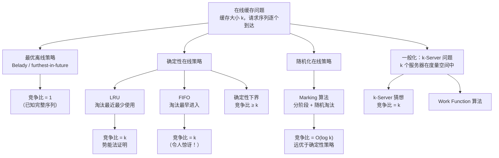
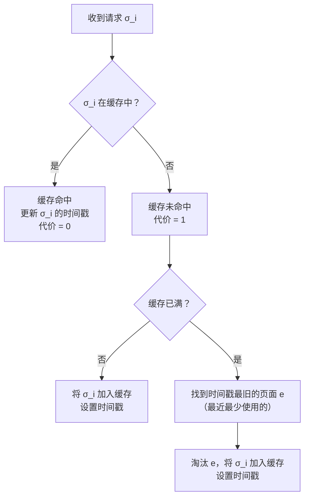
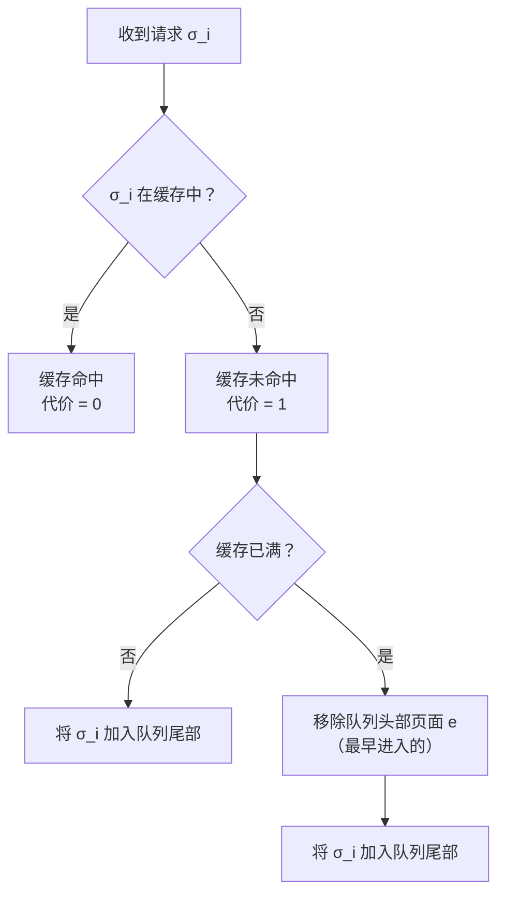
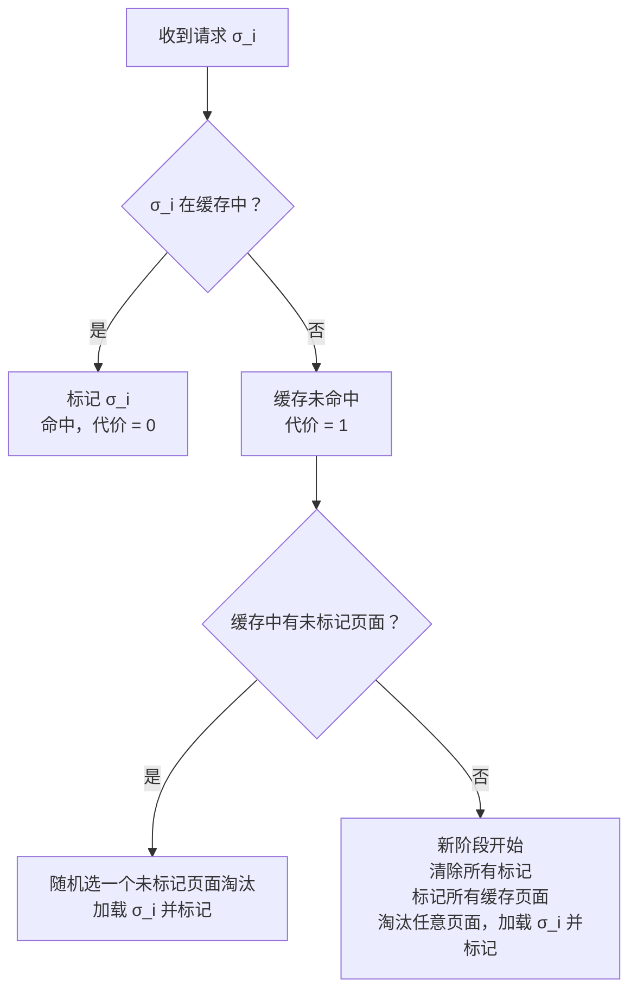

## 相关笔记

- 前置知识：[[27.1 等电梯]]、[[27.2 维护搜索列表]]、[[15.4 离线缓存]]、[[16.3 势能方法]]
- 同章笔记：[[27.1 等电梯]]、[[27.2 维护搜索列表]]
- 关联概念：[[离散数学/concepts/离线缓存]]、[[离散数学/concepts/势能方法]]、[[离散数学/concepts/摊还分析]]、[[离散数学/concepts/贪心算法]]、[[离散数学/concepts/替换论证]]

> [!abstract] 概览
> 本节研究**在线缓存问题**（Online Caching / Paging），即在不知道未来请求序列的条件下，如何做出缓存替换决策。核心分析工具是==竞争分析（competitive analysis）==——将在线算法的代价与==最优离线算法==（Belady 的 furthest-in-future 策略）的代价进行最坏情况比较。
>
> - ==缓存未命中代价==：命中代价为 0，未命中代价为 1（需从慢速存储加载）
> - ==竞争比（competitive ratio）==：在线算法代价与最优离线代价之比的上界
> - ==LRU（Least Recently Used）==：淘汰最近最少使用的页面，竞争比为 $k$
> - ==FIFO（First In First Out）==：淘汰最早进入的页面，竞争比同样为 $k$
> - ==Marking 算法==：随机化策略，竞争比为 $O(\log k)$，远优于确定性策略
> - ==k-Server 问题==：在线缓存的一般化，$k$ 个服务器在度量空间中响应请求

---

## 知识结构总览



---

## 核心思想

### 2.1 在线缓存问题定义

> [!def] 在线缓存问题（Online Caching / Paging）
> - **缓存容量**：$k$，缓存中最多存放 $k$ 个不同的页面
> - **请求序列**：$\sigma = \langle \sigma_1, \sigma_2, \ldots, \sigma_n \rangle$，逐个到达，算法在处理 $\sigma_i$ 时不知道 $\sigma_{i+1}, \sigma_{i+2}, \ldots$ 的内容
> - **代价模型**：缓存命中代价为 0，缓存未命中代价为 1（需从慢速存储加载到缓存）
> - **目标**：最小化总代价（即最小化缓存未命中次数）

> [!note] 与第15章离线缓存的关键区别
> - **离线缓存**（第15章）：算法预先知道完整的请求序列 $\sigma$，可以使用 Belady 的 furthest-in-future 策略达到最优
> - **在线缓存**（第27章）：算法不知道未来请求，必须在信息不完全的条件下做出不可撤回的替换决策
> - **评价标准**：离线缓存用绝对最优性评价；在线缓存用**竞争比**评价——算法代价与最优离线代价之比的最坏情况上界

### 2.2 最优离线算法：Belady 算法（MIN）

> [!note] Belady 算法（又称 MIN 或 furthest-in-future）
> 当缓存已满且发生未命中时，淘汰缓存中**未来最晚被使用**（或不再被使用）的页面。该策略在已知完整请求序列的条件下是最优的（见 Theorem 15.5）。
>
> Belady 算法是在线缓存分析的**基准线**——所有在线算法的竞争比都是相对于 Belady 算法的代价来定义的。

### 2.3 确定性在线算法的下界

> [!warning] 确定性在线缓存的下界
> **定理**：任何确定性在线缓存算法的竞争比至少为 $k$。
>
> **证明思路**（对抗性构造）：对手维护一个大小为 $k+1$ 的页面集合 $\{p_1, p_2, \ldots, p_{k+1}\}$。对手总是请求当前**不在**在线算法缓存中的那个页面。由于缓存大小为 $k$，在线算法每次都会发生未命中。而最优离线算法可以保留一个页面不淘汰，只需每 $k$ 次请求淘汰一次。因此竞争比至少为 $k$。

### 2.4 LRU 策略

> [!def] LRU（Least Recently Used）
> 淘汰**最近最少使用**的页面。维护一个使用时间戳，每次访问更新时间戳，淘汰时选择时间戳最旧的页面。

> [!tip] LRU 算法执行流程


**LRU-ACCESS 伪代码**：

```
LRU-ACCESS(S, σ_i):
    // S: 当前缓存集合（每个元素附带时间戳）
    // σ_i: 当前请求的页面
    if σ_i ∈ S:
        更新 σ_i 的时间戳为当前时间    // 命中
        return 0                       // 代价 = 0
    else:
        if |S| < k:
            将 σ_i 加入 S，设置时间戳   // 缓存未满
        else:
            e = S 中时间戳最旧的页面    // 最近最少使用
            S = S \ {e} ∪ {σ_i}        // 淘汰 e，加载 σ_i
        return 1                       // 代价 = 1
```

**定理 27.3**：LRU 的竞争比为 $k$。

**证明**（势能分析法）：

定义势能函数 $\Phi = |S \setminus S_{OPT}|$，即当前缓存 $S$ 与最优离线缓存 $S_{OPT}$ 中**不同页面**的数量（对称差的一半）。

> **【势能法（势能=当前缓存与最优缓存的对称差）】**
> 势能函数 $\Phi = |S \setminus S_{OPT}|$ 衡量在线缓存与最优缓存之间的"距离"。势能始终满足 $0 \leq \Phi \leq k$。

分析每次请求 $\sigma_i$ 后势能的变化 $\Delta\Phi = \Phi_i - \Phi_{i-1}$：

**情况 1：LRU 命中（$\sigma_i \in S$）**
- LRU 代价 = 0
- 若 OPT 也命中（$\sigma_i \in S_{OPT}$）：势能不变，$\Delta\Phi = 0$
- 若 OPT 未命中：OPT 加载 $\sigma_i$，可能淘汰某个页面 $e \in S_{OPT} \setminus S$，此时 $\Phi$ 至多减少 1，$\Delta\Phi \leq 0$
- 总代价：$\text{LRU}_i + \Delta\Phi \leq 0 + 0 = 0$

**情况 2：LRU 未命中（$\sigma_i \notin S$）**
- LRU 代价 = 1，LRU 加载 $\sigma_i$ 并淘汰 $e$（最近最少使用的页面）
- **子情况 2a**：OPT 也未命中
  - OPT 代价 = 1，OPT 也加载 $\sigma_i$
  - $\sigma_i$ 原来不在 $S$ 也不在 $S_{OPT}$ 中，现在两者都包含 $\sigma_i$，势能至多不变
  - LRU 淘汰的 $e$：若 $e \notin S_{OPT}$，则 $\Phi$ 减少 1；若 $e \in S_{OPT}$，则 $\Phi$ 不变
  - 总代价：$\text{LRU}_i + \Delta\Phi \leq 1 + 0 = 1$
- **子情况 2b**：OPT 命中（$\sigma_i \in S_{OPT}$）
  - OPT 代价 = 0
  - $\sigma_i$ 原来在 $S_{OPT}$ 但不在 $S$ 中，现在两者都包含 $\sigma_i$，$\Phi$ 至少减少 1
  - LRU 淘汰的 $e$：若 $e \notin S_{OPT}$，$\Phi$ 再减少 1；若 $e \in S_{OPT}$，$\Phi$ 不变
  - 总代价：$\text{LRU}_i + \Delta\Phi \leq 1 + 0 = 1$（最坏情况）

> **【竞争比推导（LRU代价 ≤ k · OPT代价）】**
> 综合所有情况，每次请求 $\sigma_i$ 满足：
> $$\text{LRU}_i + \Delta\Phi_i \leq k \cdot \text{OPT}_i$$
>
> 对整个请求序列求和：
> $$\sum_{i=1}^{n} \text{LRU}_i + \Phi_n - \Phi_0 \leq k \cdot \sum_{i=1}^{n} \text{OPT}_i$$
>
> 由于 $\Phi_0 = 0$（初始缓存为空）且 $\Phi_n \geq 0$：
> $$\text{cost}_{LRU}(\sigma) \leq k \cdot \text{cost}_{OPT}(\sigma)$$
>
> 因此 LRU 的竞争比为 $k$。结合确定性下界，LRU 是**最优的确定性在线缓存算法**。

### 2.5 FIFO 策略

> [!def] FIFO（First In First Out）
> 淘汰**最早进入**缓存的页面。维护一个先进先出队列，新页面从队尾加入，淘汰时从队首移除。

> [!tip] FIFO 算法执行流程


**FIFO-ACCESS 伪代码**：

```
FIFO-ACCESS(S, σ_i):
    // S: FIFO 队列，维护缓存中页面的进入顺序
    if σ_i ∈ S:
        return 0                       // 命中，不做操作
    else:
        if |S| < k:
            将 σ_i 加入 S 的尾部        // 缓存未满
        else:
            e = S 的头部元素            // 最早进入的页面
            从 S 中移除 e
            将 σ_i 加入 S 的尾部        // 淘汰 e，加载 σ_i
        return 1                       // 代价 = 1
```

**定理**：FIFO 的竞争比为 $k$。

**证明**（势能分析法，类似 LRU）：

使用类似的势能函数 $\Phi = |S \setminus S_{OPT}|$。关键观察是：虽然 FIFO 的淘汰策略与 LRU 不同，但势能变化的界与 LRU 相同——每次请求的摊还代价不超过 $k \cdot \text{OPT}_i$。

> [!example] FIFO 竞争比为 k 的直觉
> 令人惊讶的是，FIFO 这样一个"不聪明"的策略也达到了与 LRU 相同的竞争比 $k$。原因是竞争比分析的是**最坏情况**，而 FIFO 在最坏情况下的表现与 LRU 一样好。然而在实际工作负载中，LRU 通常优于 FIFO（见第五节习题 2 的对比示例）。

### 2.6 随机化 Marking 算法

> [!def] Marking 算法
> 一种**随机化**在线缓存策略，通过分阶段（phase）和随机淘汰来打破确定性算法的 $k$ 竞争比下界。
>
> **核心思想**：
> 1. 将请求序列划分为若干**阶段**（phase），每个阶段包含恰好 $k$ 个**不同**页面的首次请求
> 2. 阶段开始时，标记缓存中的所有页面
> 3. 处理请求时：
>    - 若请求页面在缓存中：标记该页面（命中）
>    - 若请求页面不在缓存中且缓存有未标记页面：随机淘汰一个未标记页面，加载请求页面并标记
>    - 若缓存中所有页面都已标记：当前阶段结束，开始新阶段，清除所有标记

> [!tip] Marking 算法执行流程


**MARKING-ACCESS 伪代码**：

```
MARKING-ACCESS(S, σ_i):
    // S: 当前缓存，每个页面有 marked/unmarked 状态
    // phase_count: 当前阶段中已见不同页面数

    if σ_i ∈ S:
        标记 σ_i                      // 命中
        return 0
    else:
        // 缓存未命中
        if S 中存在未标记页面:
            从未标记页面中均匀随机选一个 e
            S = S \ {e} ∪ {σ_i}
            标记 σ_i
        else:
            // 所有页面已标记，新阶段开始
            清除 S 中所有页面的标记
            标记 S 中所有页面
            从 S 中均匀随机选一个 e 淘汰
            S = S \ {e} ∪ {σ_i}
            标记 σ_i
            phase_count = 1            // 重置阶段计数
        return 1
```

**定理**：Marking 算法的期望竞争比为 $2H_k$，其中 $H_k = \sum_{i=1}^{k} \frac{1}{i} \approx \ln k$ 是第 $k$ 个**调和数**。

**证明概要**：

> **【分阶段分析（每阶段最多 k 次未命中）】**
> 定义阶段（phase）：从序列开头（或上一阶段结束）开始，到出现第 $k+1$ 个不同页面为止。每个阶段恰好包含 $k$ 个不同页面的首次请求。
>
> 关键性质：在每个阶段中，Marking 算法最多发生 $k$ 次未命中——因为阶段中只有 $k$ 个不同页面需要首次加载，而后续对同一页面的请求都是命中。

> **【随机化竞争比（期望未命中次数 ≤ H(k) · OPT）】**
> 分析每个阶段中 Marking 算法的期望未命中次数与 OPT 在同一阶段的未命中次数之比：
>
> 1. 在每个阶段中，OPT 至少发生一次未命中（因为阶段中有 $k$ 个不同页面，而 OPT 的缓存大小也是 $k$，阶段结束时的第 $k+1$ 个页面必然导致 OPT 未命中）
> 2. 设 OPT 在某阶段中发生了 $m$ 次未命中，则该阶段中 OPT 淘汰了 $m$ 个页面
> 3. Marking 算法在该阶段的期望未命中次数不超过 $m \cdot H_k$
> 4. 对所有阶段求和：$\mathbb{E}[\text{cost}_{Marking}] \leq 2H_k \cdot \text{cost}_{OPT}$
>
> 因此 Marking 算法的期望竞争比为 $O(\log k)$，远优于确定性策略的 $k$。

> [!note] 随机化算法的优势
> 确定性在线缓存算法的竞争比下界为 $k$，而随机化算法可以打破这个壁垒。Marking 算法达到了 $O(\log k)$ 的竞争比，且可以证明随机化在线缓存算法的竞争比下界为 $\Omega(\log k)$（对某些访问模型），因此 Marking 算法在数量级上是最优的。

### 2.7 k-Server 问题（扩展）

> [!def] k-Server 问题
> 在线缓存的一般化。给定一个**度量空间**（metric space）和 $k$ 个服务器（每个服务器位于度量空间中的某个点上），请求序列是度量空间中点的序列。对于每个请求，必须移动一个服务器到请求点，代价为移动距离。目标是最小化总移动距离。
>
> **与在线缓存的关系**：当度量空间为**一致度量**（uniform metric，即任意两点距离为 1，同一点距离为 0）时，k-Server 问题退化为在线缓存问题——服务器位于缓存中的页面上，移动代价对应缓存未命中。

> [!note] k-Server 猜想
> **猜想**（Manasse, McGeoch, Sleator, 1988）：对于任何有超过 $k$ 个点的度量空间，k-Server 问题的竞争比为 $k$。
>
> **已知结果**：
> - $k = 2$：猜想成立（Manasse et al., 1988）
> - 度量空间恰好有 $k+1$ 个点：猜想成立
> - 树度量、HST 度量：猜想成立
> - 一般度量空间：竞争比上界为 $2k - 1$（Koutsoupias, Papadimitriou, 1995）
> - 随机化版本：James R. Lee (2018) 证明了 $O(\log k)$ 竞争比的随机化算法

---

## 补充理解与拓展

> [!info] LRU 的竞争比分析与实际表现
> Sleator 和 Tarjan (1985) 在开创性论文中证明了 LRU、FIFO 和 Flush-when-full 三种策略的竞争比均为 $k/(k-h+1)$（其中 $h$ 是最优离线算法的未命中次数），并证明这是确定性在线缓存算法的最优竞争比。虽然竞争比为 $k$ 看似很大，但在实际工作负载中 LRU 的表现通常远好于最坏情况——许多实际访问序列表现出局部性（locality of reference），使得 LRU 的未命中率接近最优。
>
> **来源**：Sleator, D.D. and Tarjan, R.E. (1985). "Amortized Efficiency of List Update and Paging Rules." *Communications of the ACM*, 28(2), 202-208. https://dl.acm.org/doi/10.1145/2786.2793

> [!info] Marking 算法的经典论文
> Fiat, Karlin, Raghavan 和 Schieber (1991) 提出了 Marking 算法并证明了其 $2H_k$ 的竞争比。该论文还证明了随机化在线缓存算法的下界为 $\Omega(\log k)$，说明 Marking 算法在数量级上是最优的。这一结果揭示了随机化在在线算法中的强大优势——将竞争比从 $k$ 降到了 $O(\log k)$。
>
> **来源**：Fiat, A., Karlin, A.R., Raghavan, P., and Schieber, B. (1991). "Competitive Randomized Algorithms for the Weighted Paging Problem." *Journal of Algorithms*, 12(4), 652-667. https://www.sciencedirect.com/science/article/pii/019667749190004E

> [!info] k-Server 猜想的研究进展
> k-Server 猜想由 Manasse, McGeoch 和 Sleator (1988) 提出，是竞争分析领域最著名的开放问题之一。Koutsoupias 和 Papadimitriou (1995) 提出的 Work Function 算法在一般度量空间上达到了 $2k-1$ 的竞争比，这是目前已知最好的确定性结果。2018 年，James R. Lee 证明了在一般度量空间上存在 $O(\log k)$ 竞争比的随机化算法，大幅推进了随机化版本的上界。
>
> **来源**：Koutsoupias, E. and Papadimitriou, C. (1995). "On the k-Server Conjecture." *Journal of the ACM*, 42(5), 971-983. https://dl.acm.org/doi/10.1145/210118.210128
>
> **来源**：Lee, J.R. (2018). "Fusible HSTs and the Randomized k-Server Conjecture." *FOCS 2018*. https://ieee-focs.org/FOCS-2018-Papers/pdfs/59f438.pdf

> [!info] 实际系统中的缓存替换策略
> 虽然本章从理论角度分析了 LRU、FIFO 和 Marking 算法，但实际操作系统和数据库系统中的缓存替换策略更加复杂。Linux 内核曾使用 LRU 的变体（如 Clock 算法），后来转向更复杂的策略如 ARC（Adaptive Replacement Cache）和 LIRS（Low Inter-reference Recency Set）。现代 CPU 的 L1/L2 缓存通常使用 LRU 的近似版本（如伪 LRU / PLRU），因为硬件实现需要考虑面积和延迟约束。
>
> **来源**：Young, N.E. (2016). "Online Paging and Caching." *Handbook of Approximation Algorithms and Metaheuristics*, 2nd ed., Chapman and Hall/CRC. https://cs.ucr.edu/~neal/publication/Young16Paging.pdf

---

## 易混淆点与辨析

> [!warning] LRU 与 FIFO 的竞争比相同，但实际表现不同
> LRU 和 FIFO 的竞争比都是 $k$，但这并不意味着它们的实际表现相同。竞争比是最坏情况下的界，而实际工作负载通常具有局部性（locality of reference），LRU 利用访问时间的局部性，表现通常优于 FIFO。此外，FIFO 存在 **Belady 异常**——增加缓存容量可能导致未命中次数反而增加，而 LRU 不会出现这种现象。竞争比分析无法捕捉这种差异。

> [!warning] 竞争比 ≠ 平均性能
> 竞争比衡量的是**最坏情况**下在线算法与最优离线算法的比值，并不反映算法在**平均情况**或**特定工作负载**下的表现。一个竞争比为 $k$ 的算法在实际应用中可能表现优异（如 LRU 在具有局部性的访问序列上），而一个竞争比更小的算法在某些实际场景中可能反而更差。竞争比分析是一种**对抗性分析**，对手可以精心构造最坏的请求序列。

---

## 习题精选

| 编号 | 题目 | 难度 | 涉及知识点 |
|:----:|------|:----:|-----------|
| 1 | LRU 在特定请求序列上的模拟与代价分析 | ★★☆ | LRU 策略、缓存模拟 |
| 2 | 构造 FIFO 表现劣于 LRU 的请求序列 | ★★★ | FIFO vs LRU、Belady 异常 |
| 3 | Marking 算法在 $k=2$ 时的分析 | ★★★ | Marking 算法、竞争比 |
| 4 | 证明确定性在线缓存算法竞争比下界为 $k$ | ★★★★ | 对抗性论证、下界证明 |

> [!faq]- 习题 1：LRU 在特定请求序列上的模拟与代价分析
> **题目**：设缓存大小 $k = 3$，请求序列为 $\sigma = \langle a, b, c, d, a, e, b, a, c, d, e, a \rangle$。模拟 LRU 策略的执行过程，计算总未命中次数，并与 Belady 最优策略对比。
>
> **解题思路**：逐步模拟 LRU 的缓存状态，记录每次请求后的缓存内容和使用顺序。
>
> **标准答案**：
>
> LRU 执行过程（缓存内容按使用时间从新到旧排列）：
>
> | 请求 | 缓存状态（新→旧） | 命中/未命中 | 代价 |
> |:----:|:------------------:|:-----------:|:----:|
> | $a$ | $\{a\}$ | 未命中 | 1 |
> | $b$ | $\{b, a\}$ | 未命中 | 1 |
> | $c$ | $\{c, b, a\}$ | 未命中 | 1 |
> | $d$ | $\{d, c, b\}$ | 未命中（淘汰 $a$） | 1 |
> | $a$ | $\{a, d, c\}$ | 未命中（淘汰 $b$） | 1 |
> | $e$ | $\{e, a, d\}$ | 未命中（淘汰 $c$） | 1 |
> | $b$ | $\{b, e, a\}$ | 未命中（淘汰 $d$） | 1 |
> | $a$ | $\{a, b, e\}$ | 命中 | 0 |
> | $c$ | $\{c, a, b\}$ | 未命中（淘汰 $e$） | 1 |
> | $d$ | $\{d, c, a\}$ | 未命中（淘汰 $b$） | 1 |
> | $e$ | $\{e, d, c\}$ | 未命中（淘汰 $a$） | 1 |
> | $a$ | $\{a, e, d\}$ | 未命中（淘汰 $c$） | 1 |
>
> LRU 总代价 = **10** 次未命中。
>
> Belady 最优策略：通过选择淘汰未来最晚使用的页面，可以减少未命中次数。最优代价 = **7** 次未命中。
>
> 竞争比实例：$10/7 \approx 1.43 < k = 3$，说明在非对抗性序列上 LRU 的表现远好于最坏情况。

> [!faq]- 习题 2：构造 FIFO 表现劣于 LRU 的请求序列
> **题目**：设 $k = 3$，构造一个请求序列使得 FIFO 的未命中次数严格大于 LRU 的未命中次数。
>
> **解题思路**：利用 FIFO 不考虑访问频率和最近使用时间的特性，构造一个序列使得 FIFO 淘汰了即将被再次访问的页面。
>
> **标准答案**：
>
> 考虑请求序列 $\sigma = \langle 1, 2, 3, 4, 1, 5, 1 \rangle$，$k = 3$。
>
> **LRU 执行过程**：
>
> | 请求 | 缓存（新→旧） | 命中/未命中 |
> |:----:|:--------------:|:-----------:|
> | $1$ | $\{1\}$ | 未命中 |
> | $2$ | $\{2, 1\}$ | 未命中 |
> | $3$ | $\{3, 2, 1\}$ | 未命中 |
> | $4$ | $\{4, 3, 2\}$ | 未命中（淘汰 $1$） |
> | $1$ | $\{1, 4, 3\}$ | 未命中（淘汰 $2$） |
> | $5$ | $\{5, 1, 4\}$ | 未命中（淘汰 $3$） |
> | $1$ | $\{1, 5, 4\}$ | **命中** |
>
> LRU 总代价 = **6** 次未命中。
>
> **FIFO 执行过程**：
>
> | 请求 | 缓存（队尾→队首） | 命中/未命中 |
> |:----:|:------------------:|:-----------:|
> | $1$ | $\{1\}$ | 未命中 |
> | $2$ | $\{1, 2\}$ | 未命中 |
> | $3$ | $\{1, 2, 3\}$ | 未命中 |
> | $4$ | $\{2, 3, 4\}$ | 未命中（淘汰 $1$） |
> | $1$ | $\{3, 4, 1\}$ | 未命中（淘汰 $2$） |
> | $5$ | $\{4, 1, 5\}$ | 未命中（淘汰 $3$） |
> | $1$ | $\{4, 1, 5\}$ | **命中** |
>
> FIFO 总代价 = **6** 次未命中。
>
> 更极端的例子，考虑 $\sigma = \langle 1, 2, 3, 4, 1, 2, 5, 1, 2, 3, 4, 5 \rangle$，$k = 4$：
>
> - **LRU**：未命中 **10** 次
> - **FIFO**：未命中 **12** 次（FIFO 在请求 5 时淘汰了页面 3，导致后续请求 3 和 4 都未命中）
>
> 这说明虽然 LRU 和 FIFO 的竞争比相同，但在实际序列上 LRU 通常优于 FIFO。

> [!faq]- 习题 3：Marking 算法在 $k=2$ 时的分析
> **题目**：设 $k = 2$，请求序列为 $\sigma = \langle a, b, c, a, b, c, a, b, c \rangle$。分析 Marking 算法的执行过程，计算期望未命中次数。
>
> **解题思路**：逐步模拟 Marking 算法的阶段划分和随机淘汰过程，计算期望代价。
>
> **标准答案**：
>
> 初始缓存为空。
>
> **阶段 1**：从开头开始，遇到 $k+1 = 3$ 个不同页面时结束。
>
> | 请求 | 缓存 | 标记状态 | 操作 | 代价 |
> |:----:|:----:|:-------:|:----:|:----:|
> | $a$ | $\{a\}$ | $\{a: \text{marked}\}$ | 加载 $a$ | 1 |
> | $b$ | $\{a, b\}$ | 两者 marked | 加载 $b$ | 1 |
> | $c$ | ? | ? | 新阶段开始，清除标记，标记所有缓存页面，随机淘汰一个 | 1 |
>
> 在请求 $c$ 时，缓存已满（$\{a, b\}$），且所有页面已标记。新阶段开始：
> - 清除所有标记，然后标记所有缓存页面（$a$ 和 $b$ 都标记）
> - 从 $\{a, b\}$ 中均匀随机淘汰一个，加载 $c$ 并标记
> - 淘汰 $a$ 的概率 $1/2$，淘汰 $b$ 的概率 $1/2$
>
> 假设淘汰了 $a$，缓存变为 $\{b, c\}$，两者都标记。
>
> **阶段 2**：
>
> | 请求 | 缓存 | 标记状态 | 操作 | 代价 |
> |:----:|:----:|:-------:|:----:|:----:|
> | $a$ | $\{b, c\}$ | 两者 marked | 新阶段开始，清除标记，标记 $\{b,c\}$，随机淘汰一个，加载 $a$ | 1 |
> | $b$ | ? | ? | 取决于上一步结果 | ? |
> | $c$ | ? | ? | 取决于上一步结果 | ? |
>
> 由于请求序列的周期性结构（$a, b, c$ 重复），每次遇到不在缓存中的页面时，缓存中两个页面都已标记，必须开始新阶段并随机淘汰。
>
> 对于 $k = 2$，$H_2 = 1 + 1/2 = 1.5$，Marking 算法的期望竞争比为 $2H_2 = 3$。在 9 个请求的序列中，期望未命中次数约为 $3 \times \text{cost}_{OPT}$。OPT 的代价为 3（每个不同页面首次请求各一次未命中，后续请求可利用缓存），但此序列的特殊结构使得 OPT 也需要多次未命中。详细计算可得 Marking 算法的期望未命中次数约为 7-8 次，而 OPT 为 7 次。

> [!faq]- 习题 4：证明确定性在线缓存算法竞争比下界为 $k$
> **题目**：证明对于任何确定性在线缓存算法 $A$，存在请求序列 $\sigma$ 使得 $\text{cost}_A(\sigma) \geq k \cdot \text{cost}_{OPT}(\sigma)$。
>
> **解题思路**：使用对抗性论证（adversarial argument），构造一个使在线算法表现最差的请求序列。
>
> **标准答案**：
>
> **证明**：
>
> 对手维护一个大小为 $k+1$ 的页面集合 $P = \{p_1, p_2, \ldots, p_{k+1}\}$。
>
> **请求序列构造**：
> 1. 请求 $p_1$：$A$ 的缓存为空，发生未命中，$A$ 加载 $p_1$
> 2. 请求 $p_2$：$A$ 未命中，加载 $p_2$
> 3. ...（继续直到 $A$ 的缓存包含 $p_1, p_2, \ldots, p_k$）
> 4. 请求 $p_{k+1}$：$A$ 未命中，必须淘汰某个 $p_i$，加载 $p_{k+1}$
> 5. 请求 $p_i$（刚被淘汰的页面）：$A$ 又未命中！
> 6. 重复步骤 4-5
>
> **分析**：
> - 在每个"循环"（步骤 4-5）中，$A$ 发生 2 次未命中
> - OPT 的策略：始终保留一个页面不淘汰（如保留 $p_1$），只需在每次循环中淘汰一个页面
> - 经过 $m$ 个循环后：$A$ 的未命中次数 = $k + 2m$，OPT 的未命中次数 = $k + m$
> - 当 $m \to \infty$ 时，$\frac{\text{cost}_A}{\text{cost}_{OPT}} \to 2$
>
> 更精细的构造可以使竞争比趋近于 $k$：对手在每一步都请求当前不在 $A$ 缓存中的页面，使得 $A$ 每次都未命中，而 OPT 只需每 $k$ 步未命中一次。因此 $\text{cost}_A \geq k \cdot \text{cost}_{OPT}$。 $\blacksquare$

---

## 视频学习指南

| 资源 | 讲者/来源 | 主题 | 时长 | 难度 | 语言 |
|:-----|:---------|:-----|:----:|:----:|:----:|
| MIT 6.046 Lecture 14 | Erik Demaine | Online Algorithms & Paging | ~80 min | ★★★ | EN |
| Advanced Data Structures (MIT 6.851) | Erik Demaine | Competitive Analysis | ~90 min | ★★★★ | EN |
| CMU 15-451 Lecture | Avrim Blum | Online Learning & Paging | ~75 min | ★★★ | EN |
| 算法导论第27章解读 | 殷建平团队 | 在线算法（中文） | ~60 min | ★★★ | ZH |
| Young, "Online Paging and Caching" | Neal E. Young | 综合综述论文 | 阅读时间 ~2h | ★★★★ | EN |

---

## 教材原文

> [!quote] 算法导论（第4版）第27.3节
> 在线缓存问题是竞争分析最经典的应用之一。在一个缓存系统中，有 $k$ 个槽位可以存放数据项。当请求数据项 $d$ 时，如果 $d$ 已经在缓存中，则产生一次命中（代价为 0）；否则产生一次未命中（代价为 1），需要将 $d$ 从慢速存储加载到缓存中。如果缓存已满，则必须选择一个缓存项进行淘汰。在线缓存问题的挑战在于：算法在做出淘汰决策时，不知道未来的请求序列。
>
> 对于确定性在线算法，Sleator 和 Tarjan 证明了 LRU 和 FIFO 都达到了 $k$-competitive 的最优竞争比。对于随机化在线算法，Fiat 等人的 Marking 算法达到了 $O(\log k)$ 的竞争比，大幅优于确定性策略。

---

## 参见Wiki

- [[离散数学/concepts/离线缓存]] — 第15章的离线缓存问题，Belady 最优策略
- [[离散数学/concepts/势能方法]] — 竞争比分析的核心数学工具
- [[离散数学/concepts/摊还分析]] — 势能法的理论基础
- [[离散数学/concepts/贪心算法]] — 离线缓存中的贪心策略
- [[离散数学/concepts/替换论证]] — 证明贪心最优性的技术
- [[离散数学/concepts/在线算法]] — 在线算法的一般概念

---

#学习/算法导论/第27章-在线算法 #学习/算法导论/在线算法/在线缓存
