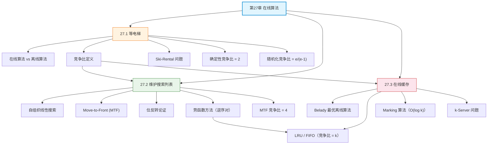

## 相关笔记

**本章节笔记：**
- [[27.1 等电梯]] — 在线算法与竞争分析的基本框架、Ski-Rental 问题、确定性/随机化竞争比
- [[27.2 维护搜索列表]] — 自组织线性搜索、Move-to-Front 策略、4-竞争比证明
- [[27.3 在线缓存]] — LRU/FIFO/Marking 算法、k-Server 问题、势能分析法

**前置章节汇总：**
- [[第26章_并行算法-章节汇总]] — 第26章并行算法
- [[第16章_摊还分析-章节汇总]] — 摊还分析（势能方法的理论基础）
- [[第15章_贪心算法-章节汇总]] — 贪心算法（离线缓存的前置知识）

**后续章节：**
- 暂无

---

> [!abstract] 概览
> 第27章系统介绍了==在线算法==（online algorithm）的设计与分析方法。全章以==竞争分析==（competitive analysis）为核心评估框架，通过将在线算法的代价与==最优离线算法==的代价进行最坏情况比较，为在信息不完全条件下做决策的算法提供严格的理论保证。
>
> 三节内容从入门到进阶：(1) 等电梯问题引入竞争比概念，证明确定性最优竞争比为 2、随机化最优竞争比为 $e/(e-1) \approx 1.582$；(2) 维护搜索列表问题展示 Move-to-Front 策略的 4-竞争比证明（位反转论证 + 势函数方法）；(3) 在线缓存问题分析 LRU/FIFO 的 $k$-竞争比和 Marking 算法的 $O(\log k)$ 随机化竞争比，并介绍 k-Server 问题作为一般化框架。

---

## 知识结构总览

---

## 核心概念回顾

### 三节内容对比

| 维度 | 27.1 等电梯 | 27.2 维护搜索列表 | 27.3 在线缓存 |
|:---|:---|:---|:---|
| **核心问题** | 引入竞争分析框架 | 自组织线性搜索 | 缓存页面置换 |
| **在线策略** | 前 $k$ 天租用后购买 | Move-to-Front | LRU / FIFO / Marking |
| **确定性竞争比** | 2（最优） | 4 | $k$（最优） |
| **随机化竞争比** | $e/(e-1) \approx 1.582$ | — | $O(\log k)$（Marking） |
| **核心证明技术** | 对抗性论证（对手构造） | 位反转论证 + 势函数 | 势能法 + 分阶段分析 |
| **最优离线策略** | 知道总次数后选择租/买 | 按频率降序排列 | Belady（furthest-in-future） |
| **一般化** | — | — | k-Server 问题 |

> [!note] 算法选型指南
> - **需要确定性保证**：LRU/FIFO 在缓存问题中达到最优确定性竞争比 $k$
> - **需要更好的竞争比**：随机化算法（Marking）可将竞争比从 $k$ 降到 $O(\log k)$
> - **实际工作负载**：竞争比是最坏情况保证，实际中 LRU 通常远优于 $k$（利用局部性）
> - **自组织搜索**：MTF 在具有时间局部性的访问序列上表现优异，优于频率计数策略

> [!def] 核心定理汇总
> 1. **竞争比定义**：$\text{cost}_A(\sigma) \leq c \cdot \text{cost}_{\text{OPT}}(\sigma)$，对所有 $\sigma$ 成立
> 2. **Ski-Rental 确定性下界**：竞争比 $\geq 2 - 1/B$，当 $B \to \infty$ 时趋近于 2
> 3. **Ski-Rental 随机化最优**：竞争比 $= e/(e-1) \approx 1.582$
> 4. **MTF 竞争比**：$\text{MTF}(\sigma) \leq 4 \cdot \text{OPT}(\sigma)$（势函数法证明）
> 5. **LRU/FIFO 竞争比**：$= k$，且确定性下界也是 $k$（最优）
> 6. **Marking 竞争比**：期望 $= 2H_k = O(\log k)$

---

## 跨章关联

### 与第15章（贪心算法）的关系

- [[15.4 离线缓存]] 的 Belady 最优策略是在线缓存分析的==基准线==——所有在线算法的竞争比都相对于 Belady 算法定义
- [[离散数学/concepts/替换论证]] 技术在贪心算法（证明贪心选择性质）和竞争分析（证明竞争比上界）中都有应用
- 离线缓存是贪心算法的经典应用，在线缓存是其在线版本

### 与第16章（摊还分析）的关系

- ==势能方法==是摊还分析和竞争分析的共同核心工具
- 竞争分析可以视为摊还分析在"在线 vs 离线"场景下的扩展：摊还分析比较同一算法不同操作的代价，竞争分析比较在线算法与最优离线算法的代价
- MTF 的 4-竞争比证明和 LRU 的 $k$-竞争比证明都使用了势能方法

### 与第5章（概率分析与随机化算法）的关系

- 随机化竞争比的定义 $\mathbb{E}[\text{cost}_A(\sigma)] \leq c \cdot \text{cost}_{\text{OPT}}(\sigma)$ 依赖[[离散数学/concepts/概率分析]]
- Ski-Rental 的最优随机化策略设计使用了概率分布构造（与 $e^{-i/B}$ 成正比的购买概率）
- Marking 算法的 $O(\log k)$ 竞争比通过分析随机淘汰的期望代价得到

### 与第26章（并行算法）的关系

- 两者都关注算法在特定约束下的性能保证：并行算法受限于处理器数 $P$，在线算法受限于信息不完全
- Work/Span/Parallelism 框架为并行算法提供了类似竞争比的性能度量

---

## 综合复习题

> [!faq]- Q1：竞争比和近似比有什么区别？一个 2-竞争的在线缓存算法和一个 2-近似的离线算法，哪个"更好"？
>
> **解答：**
>
> 竞争比和近似比的核心区别在于**约束类型**：
> - 竞争比衡量的是在==信息不完全==（输入逐步到达）条件下的决策质量退化
> - 近似比衡量的是在==计算困难==（NP-hard）条件下的解质量退化
>
> 一个 2-竞争的在线缓存算法和 2-近似的离线算法不能直接比较"好坏"——它们解决的是不同维度的问题：
> - 2-竞争意味着：即使对手精心构造请求序列，在线算法的代价也不超过最优离线算法的 2 倍
> - 2-近似意味着：即使实例结构最不利，近似算法的解也不超过最优解的 2 倍
>
> 在实际应用中，如果一个问题是 NP-hard 的且输入在线到达，可能需要同时考虑近似比和竞争比。

> [!faq]- Q2：为什么 LRU 和 FIFO 的竞争比相同（都是 $k$），但在实际中 LRU 通常优于 FIFO？竞争比分析能否捕捉这种差异？
>
> **解答：**
>
> 竞争比分析的是==最坏情况==下的性能保证，而 LRU 和 FIFO 在最坏情况下的表现确实相同（对手都可以构造使两者达到 $k$ 倍竞争比的序列）。但在实际工作负载中：
>
> 1. **时间局部性**：实际访问序列具有局部性（最近访问的元素更可能再次被访问），LRU 直接利用这一特性，而 FIFO 不考虑访问时间
> 2. **Belady 异常**：FIFO 存在增加缓存容量反而增加未命中次数的现象（Belady 异常），LRU 不会
> 3. **自适应能力**：当访问模式突然变化时，LRU 能立即响应，FIFO 需要等待旧页面自然淘汰
>
> 竞争比分析==无法==捕捉这种差异，因为它只关注最坏情况。要区分 LRU 和 FIFO 的实际性能，需要使用其他分析方法（如工作负载建模、实验评估）或更精细的理论框架（如带局部性的竞争分析）。

> [!faq]- Q3：证明 Marking 算法的竞争比为 $O(\log k)$ 的关键思路是什么？为什么随机化能将竞争比从 $k$ 降到 $O(\log k)$？
>
> **解答：**
>
> **证明关键思路**：
> 1. 将请求序列划分为若干**阶段**（phase），每个阶段包含恰好 $k$ 个不同页面的首次请求
> 2. 在每个阶段中，Marking 算法最多发生 $k$ 次未命中（只有 $k$ 个不同页面需要首次加载）
> 3. 分析每个阶段中 Marking 的期望未命中次数与 OPT 的未命中次数之比
> 4. 利用调和数 $H_k = \sum_{i=1}^k 1/i \approx \ln k$ 的性质，证明期望竞争比为 $2H_k$
>
> **随机化的优势**：
> - 确定性算法的弱点在于对手可以==观察算法的确定性行为==，然后构造使算法表现最差的输入（如缓存问题中对手总是请求不在缓存中的页面）
> - 随机化算法通过引入随机性，使得对手==无法预测算法的具体行为==，从而无法构造最坏的输入序列
> - 在 Marking 算法中，随机淘汰使得对手无法知道哪个未标记页面会被淘汰，从而"平滑"了最坏情况

---

## 常见误区

> [!warning] 误区1：竞争比越小意味着算法在所有情况下都接近最优
> 竞争比衡量的是==最坏情况==下的性能保证。一个 2-竞争的算法在大多数实际输入上可能表现得非常好（甚至接近最优），但在某些精心构造的对抗性输入上，其代价可能达到最优解的 2 倍。竞争比是一种保守的度量，类似于最坏情况时间复杂度。

> [!warning] 误区2：随机化在线算法一定优于确定性在线算法
> 随机化算法的竞争比是在==期望==意义下成立的，对于特定的随机比特序列，实际代价可能远超竞争比所保证的值。此外，随机化算法需要可用的随机源，在某些场景下（如确定性硬件、可重复性要求高的系统）可能不适用。

> [!warning] 误区3：竞争分析 vs 摊还分析是同一回事
> 竞争分析比较的是==在线算法 vs 最优离线算法==，摊还分析比较的是==同一算法不同操作的代价==。两者的共同工具是势能方法，但分析目标和结论不同。竞争分析的结果更"悲观"（因为对手可以构造最坏输入），摊还分析的结果更"乐观"（因为比较的是同一算法自身的代价分摊）。

> [!warning] 误区4：增加缓存容量一定能减少未命中次数
> 对于 FIFO 策略，增加缓存容量可能导致未命中次数反而增加（Belady 异常）。LRU 不会出现这种现象。这说明缓存策略的选择比缓存容量的大小更重要。

---

## 学习要点总结

| 学习目标 | 掌握程度 | 对应笔记 |
|:---|:---:|:---|
| 理解在线算法与离线算法的区别 | ★★★★★ | [[27.1 等电梯]] |
| 掌握竞争比的严格定义 | ★★★★★ | [[27.1 等电梯]] |
| 掌握 Ski-Rental 问题的竞争比分析 | ★★★★★ | [[27.1 等电梯]] |
| 理解随机化竞争比的优势 | ★★★★☆ | [[27.1 等电梯]] |
| 掌握 MTF 策略的执行流程 | ★★★★★ | [[27.2 维护搜索列表]] |
| 理解位反转论证的直觉 | ★★★★☆ | [[27.2 维护搜索列表]] |
| 掌握势函数法证明 MTF 的 4-竞争比 | ★★★★★ | [[27.2 维护搜索列表]] |
| 掌握 LRU/FIFO 的 $k$-竞争比证明 | ★★★★★ | [[27.3 在线缓存]] |
| 理解 Marking 算法的设计与分析 | ★★★★☆ | [[27.3 在线缓存]] |
| 了解 k-Server 问题及其与缓存的关系 | ★★★☆☆ | [[27.3 在线缓存]] |

---

## 参见Wiki

- [[离散数学/concepts/在线算法]] — 在线算法的基本定义与性质
- [[离散数学/concepts/摊还分析]] — 势能方法的理论基础
- [[离散数学/concepts/势能方法]] — 竞争比分析的核心数学工具
- [[离散数学/concepts/贪心算法]] — 离线缓存中的贪心策略
- [[离散数学/concepts/离线缓存]] — 第15章的离线缓存问题
- [[离散数学/concepts/替换论证]] — 证明贪心最优性的技术
- [[离散数学/concepts/概率分析]] — 随机化算法的分析基础

---

#学习/算法导论/第27章-在线算法 #学习/算法导论/在线算法/章节汇总
