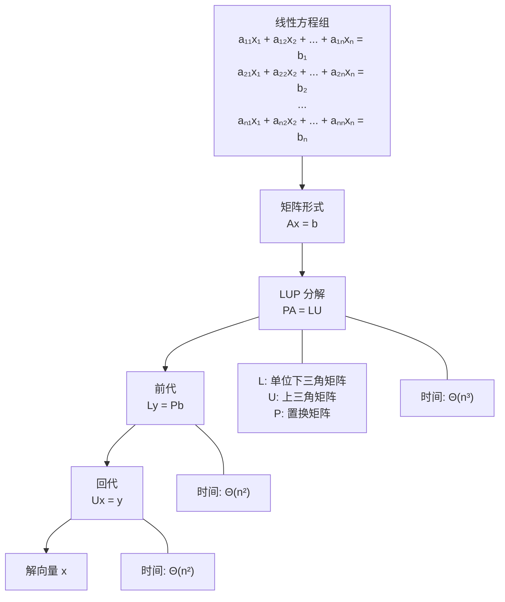
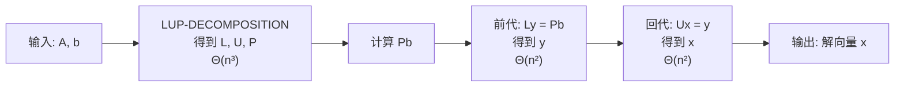

> [!abstract] 概览
> 本节介绍如何利用 **LUP 分解** 高效求解线性方程组 $Ax = b$。核心思想是将一个 $n \times n$ 的线性方程组分解为三个计算上更简单的步骤：首先对矩阵 $A$ 进行 LUP 分解得到 $PA = LU$，然后通过**前代**（forward substitution）求解下三角方程组 $Ly = Pb$，最后通过**回代**（back substitution）求解上三角方程组 $Ux = y$。整个求解过程的计算复杂度为 $\Theta(n^3)$（分解）加 $\Theta(n^2)$（求解），当需要求解多个具有相同系数矩阵但不同右端向量的方程组时，分解只需执行一次，后续每次求解仅需 $\Theta(n^2)$。

---

## 知识结构总览



**知识依赖关系**：

| 前置知识 | 本节内容 | 后续内容 |
|:---|:---|:---|
| [[第04章_分治策略/4.1 矩阵乘法]] | LUP 分解与求解 | [[28.2 矩阵求逆]] |
| [[第04章_分治策略-章节汇总]] | 前代与回代 | [[28.3 对称正定矩阵]] |
| 矩阵基本运算 | 正确性证明与复杂度分析 | [[第28章_矩阵运算-章节汇总]] |

---

## 核心思想

### 2.1 线性方程组的矩阵表示

含有 $n$ 个未知数、$n$ 个方程的线性方程组可以写成如下形式：

$$
\begin{aligned}
a_{11}x_1 + a_{12}x_2 + \cdots + a_{1n}x_n &= b_1 \\
a_{21}x_1 + a_{22}x_2 + \cdots + a_{2n}x_n &= b_2 \\
&\vdots \\
a_{n1}x_1 + a_{n2}x_2 + \cdots + a_{nn}x_n &= b_n
\end{aligned}
$$

将其写成紧凑的**矩阵-向量乘法**形式：

$$Ax = b$$

其中 $A$ 是一个 $n \times n$ 的**系数矩阵**，$x$ 是 $n \times 1$ 的**未知向量**，$b$ 是 $n \times 1$ 的**右端向量**：

$$
A = \begin{pmatrix} a_{11} & a_{12} & \cdots & a_{1n} \\ a_{21} & a_{22} & \cdots & a_{2n} \\ \vdots & \vdots & \ddots & \vdots \\ a_{n1} & a_{n2} & \cdots & a_{nn} \end{pmatrix}, \quad
x = \begin{pmatrix} x_1 \\ x_2 \\ \vdots \\ x_n \end{pmatrix}, \quad
b = \begin{pmatrix} b_1 \\ b_2 \\ \vdots \\ b_n \end{pmatrix}
$$

求解线性方程组的目标是：给定 $A$ 和 $b$，找到满足 $Ax = b$ 的向量 $x$。

> **生活化类比**：想象你在解一个谜题——已知一组食材的混合配方（矩阵 $A$）和最终成品的营养成分（向量 $b$），需要反推出每种食材的用量（向量 $x$）。LUP 分解就像先把复杂配方拆解成几个简单步骤，然后逐步求解。

### 2.2 LUP 分解的定义

**LUP 分解**是将矩阵 $A$ 分解为三个矩阵乘积的形式：

$$PA = LU$$

其中：

- **$L$（Lower triangular）**：**单位下三角矩阵**，即对角线元素全为 1，对角线以下的元素可以非零，对角线以上的元素全为 0。
- **$U$（Upper triangular）**：**上三角矩阵**，即对角线以下的元素全为 0，对角线及以上的元素可以非零。
- **$P$（Permutation）**：**置换矩阵**，即单位矩阵的行经过重新排列后得到的矩阵，每一行和每一列恰好有一个 1，其余元素为 0。

用数学语言精确描述：

$$
L = \begin{pmatrix} 1 & 0 & \cdots & 0 \\ l_{21} & 1 & \cdots & 0 \\ \vdots & \vdots & \ddots & \vdots \\ l_{n1} & l_{n2} & \cdots & 1 \end{pmatrix}, \quad
U = \begin{pmatrix} u_{11} & u_{12} & \cdots & u_{1n} \\ 0 & u_{22} & \cdots & u_{2n} \\ \vdots & \vdots & \ddots & \vdots \\ 0 & 0 & \cdots & u_{nn} \end{pmatrix}
$$

**为什么需要置换矩阵 $P$？** 并非所有矩阵都能直接分解为 $A = LU$ 的形式。例如，当主元位置（消元过程中对角线位置）出现 0 时，消元过程无法继续。置换矩阵 $P$ 通过交换矩阵 $A$ 的行来避免主元为零的情况，确保分解过程始终可行。对于任意非奇异矩阵 $A$，LUP 分解一定存在。

### 2.3 前代（Forward Substitution）

LUP 分解完成后，原方程组 $Ax = b$ 等价于：

$$PAx = Pb$$

将 $PA = LU$ 代入：

$$LUx = Pb$$

令 $y = Ux$，则先求解下三角方程组：

$$Ly = Pb$$

由于 $L$ 是单位下三角矩阵，这个方程组可以**从上到下**逐个求解：

$$
\begin{aligned}
y_1 &= (Pb)_1 \\
y_2 &= (Pb)_2 - l_{21}y_1 \\
y_3 &= (Pb)_3 - l_{31}y_1 - l_{32}y_2 \\
&\vdots \\
y_n &= (Pb)_n - \sum_{j=1}^{n-1} l_{nj} y_j
\end{aligned}
$$

**前代算法 LUP-SOLVE 中的前代部分**：

```
// 求解 Ly = Pb（前代）
for i ← 1 to n
    y[i] ← (Pb)[i]
    for j ← 1 to i - 1
        y[i] ← y[i] - L[i][j] × y[j]
```

**时间复杂度**：外层循环执行 $n$ 次，内层循环分别执行 $0, 1, 2, \ldots, n-1$ 次，总操作次数为 $\sum_{i=1}^{n}(i-1) = \frac{n(n-1)}{2} = \Theta(n^2)$。

### 2.4 回代（Back Substitution）

求得 $y$ 之后，再求解上三角方程组：

$$Ux = y$$

由于 $U$ 是上三角矩阵，这个方程组可以**从下到上**逐个求解：

$$
\begin{aligned}
x_n &= \frac{y_n}{u_{nn}} \\
x_{n-1} &= \frac{y_{n-1} - u_{n-1,n} \cdot x_n}{u_{n-1,n-1}} \\
&\vdots \\
x_1 &= \frac{y_1 - \sum_{j=2}^{n} u_{1j} x_j}{u_{11}}
\end{aligned}
$$

**回代算法 LUP-SOLVE 中的回代部分**：

```
// 求解 Ux = y（回代）
for i ← n downto 1
    x[i] ← y[i]
    for j ← i + 1 to n
        x[i] ← x[i] - U[i][j] × x[j]
    x[i] ← x[i] / U[i][i]
```

**时间复杂度**：与前代对称，总操作次数为 $\sum_{i=1}^{n}(n-i) = \frac{n(n-1)}{2} = \Theta(n^2)$。

### 2.5 算法执行流程

> [!tip] LUP 分解求解线性方程组的完整流程
>
> **步骤一：LUP 分解**
> 对系数矩阵 A 执行 LUP-DECOMPOSITION，得到 L、U、P 三个矩阵。时间复杂度 Θ(n³)。
>
> **步骤二：计算置换后的右端向量**
> 用置换矩阵 P 对右端向量 b 做行置换，得到 Pb。
>
> **步骤三：前代求解**
> 利用下三角矩阵 L，求解 Ly = Pb，得到中间向量 y。时间复杂度 Θ(n²)。
>
> **步骤四：回代求解**
> 利用上三角矩阵 U，求解 Ux = y，得到最终解向量 x。时间复杂度 Θ(n²)。
>
> **关键优势**：当需要求解多个具有相同系数矩阵 A 但不同右端向量的方程组时，LUP 分解只需执行一次，后续每次求解仅需 Θ(n²)。



### 2.6 LUP-SOLVE 伪代码

```
LUP-SOLVE(L, U, π, b)
// 输入: 单位下三角矩阵 L, 上三角矩阵 U, 置换向量 π, 右端向量 b
// 输出: 方程组 Ax = b 的解 x，其中 PA = LU, π 记录了 P 的置换信息
// π[i] = k 表示 P 的第 i 行是 I 的第 k 行

  n ← L.rows
  // 步骤一: 计算 Pb，同时执行前代求解 Ly = Pb
  for i ← 1 to n
      x[i] ← b[π[i]]           // 置换 b 的第 i 个分量
      for j ← 1 to i - 1
          x[i] ← x[i] - L[i][j] × x[j]
  // 步骤二: 回代求解 Ux = y（此时 x 中存储的是 y）
  for i ← n downto 1
      for j ← i + 1 to n
          x[i] ← x[i] - U[i][j] × x[j]
      x[i] ← x[i] / U[i][i]
  return x
```

**代码解读**：

- 第 5-8 行：将**置换**和**前代**合并在一起。`x[i] ← b[π[i]]` 完成了对 $b$ 的置换，内层循环完成前代。
- 第 9-13 行：**回代**阶段，从最后一个分量 $x_n$ 开始，逐步向前求解。
- 注意第 13 行的除法 `x[i] / U[i][i]`，这里要求 $U[i][i] \neq 0$，即矩阵 $A$ 必须是非奇异的。

### 2.7 LUP-DECOMPOSITION 伪代码

```
LUP-DECOMPOSITION(A)
// 输入: n×n 矩阵 A
// 输出: 单位下三角矩阵 L, 上三角矩阵 U, 置换向量 π
// 满足 PA = LU，其中 P 由 π 确定

  n ← A.rows
  // 初始化 π 为恒等置换
  for i ← 1 to n
      π[i] ← i
  // 将 A 复制到 U（后续原地修改）
  for i ← 1 to n
      for j ← 1 to n
          U[i][j] ← A[i][j]
  // 初始化 L 为单位矩阵
  for i ← 1 to n
      for j ← 1 to n
          if i = j
              L[i][j] ← 1
          else
              L[i][j] ← 0
  // 主消元循环
  for k ← 1 to n
      // 部分主元选取: 在第 k 列中找到绝对值最大的元素
      k' ← k
      for i ← k + 1 to n
          if |U[i][k]| > |U[k'][k]|
              k' ← i
      // 交换行: U 的第 k 行与第 k' 行互换
      if k' ≠ k
          swap U[k][1..n] ↔ U[k'][1..n]
          swap π[k] ↔ π[k']
          swap L[k][1..k-1] ↔ L[k'][1..k-1]
      // 消元: 将第 k 列对角线以下元素消为零
      for i ← k + 1 to n
          // 计算乘数（存储在 L 中）
          L[i][k] ← U[i][k] / U[k][k]
          // 更新 U 的第 i 行
          for j ← k + 1 to n
              U[i][j] ← U[i][j] - L[i][k] × U[k][j]
          // 将 U[i][k] 设为 0（消元完成）
          U[i][k] ← 0
  return (L, U, π)
```

**代码解读**：

- **第 3-4 行**：初始化置换向量 $\pi$ 为恒等置换 $(1, 2, \ldots, n)$。
- **第 5-10 行**：将 $A$ 复制到 $U$，初始化 $L$ 为单位矩阵。
- **第 12-16 行**：**部分主元选取**（partial pivoting），在第 $k$ 列的第 $k$ 行到第 $n$ 行中，找到绝对值最大的元素 $U[k'][k]$，将其所在行 $k'$ 与第 $k$ 行交换。这一步保证了 $|L[i][k]| \leq 1$，从而提高数值稳定性。
- **第 17-20 行**：交换操作同时作用于 $U$（完整行）、$\pi$（置换记录）和 $L$（已计算的部分）。
- **第 22-28 行**：**消元操作**，计算乘数 $L[i][k] = U[i][k] / U[k][k]$ 并存储在 $L$ 中，然后更新 $U$ 的子矩阵。

### 2.8 正确性证明

**定理**：给定非奇异矩阵 $A$，若 LUP-DECOMPOSITION 返回满足 $PA = LU$ 的 $L$、$U$、$\pi$，则 LUP-SOLVE 返回的 $x$ 是方程组 $Ax = b$ 的唯一解。

**证明**：

**【目标（证明 x 满足原方程组）】** 我们需要证明 LUP-SOLVE 返回的 $x$ 满足 $Ax = b$。

**【第一步（LUP 分解的等价性）】** 由 LUP-DECOMPOSITION 的正确性（此处假设分解过程正确），我们有 $PA = LU$。由于 $A$ 是非奇异矩阵，$P$ 是置换矩阵（也是非奇异的），因此 $PA$ 也是非奇异的。又因为 $PA = LU$，所以 $L$ 和 $U$ 都是非奇异的（$L$ 的行列式为 1，$U$ 的行列式为 $\prod_{i=1}^{n} u_{ii} \neq 0$）。

**【第二步（前代求解的正确性）】** LUP-SOLVE 的第 5-8 行求解 $Ly = Pb$。由于 $L$ 是单位下三角矩阵，$L$ 的对角线元素全为 1，因此 $L$ 一定非奇异。根据线性代数的基本理论，下三角方程组 $Ly = Pb$ 有唯一解 $y$。前代过程从 $y_1$ 开始逐个求解，每一步都是确定性的，因此得到的 $y$ 确实是 $Ly = Pb$ 的唯一解。

**【第三步（回代求解的正确性）】** LUP-SOLVE 的第 9-13 行求解 $Ux = y$。由于 $U$ 是上三角矩阵且 $U$ 非奇异（所有对角线元素 $u_{ii} \neq 0$），上三角方程组 $Ux = y$ 有唯一解 $x$。回代过程从 $x_n$ 开始逐个向前求解，每一步都是确定性的，因此得到的 $x$ 确实是 $Ux = y$ 的唯一解。

**【第四步（验证 x 满足原方程组）】** 将上述两步的结果组合：

$$LUx = L(Ux) = Ly = Pb$$

因此：

$$LUx = Pb$$

又因为 $PA = LU$，所以：

$$PAx = LUx = Pb$$

两边左乘 $P^{-1}$（由于 $P$ 是置换矩阵，$P^{-1} = P^T$）：

$$Ax = P^{-1}Pb = b$$

**【结论（唯一性）】** 由于 $A$ 是非奇异矩阵，方程组 $Ax = b$ 有且仅有一个解。我们已证明 LUP-SOLVE 返回的 $x$ 满足 $Ax = b$，因此 $x$ 就是原方程组的唯一解。$\blacksquare$

### 2.9 计算复杂度分析

**LUP-DECOMPOSITION 的复杂度**：

- 外层循环（第 11 行）执行 $n$ 次。
- 部分主元选取（第 13-16 行）：每次最多比较 $n - k$ 个元素，总计 $\sum_{k=1}^{n}(n-k) = \Theta(n^2)$。
- 行交换（第 17-20 行）：每次交换 $O(n)$ 个元素，总计 $\Theta(n^2)$。
- **消元操作**（第 22-28 行）：这是主要开销。对于每个 $k$，内层双重循环执行 $(n-k) \times (n-k)$ 次乘法和减法。总计：
$$
\sum_{k=1}^{n-1}(n-k)^2 = \sum_{j=1}^{n-1}j^2 = \frac{(n-1)n(2n-1)}{6} = \Theta(n^3)
$$

因此，**LUP-DECOMPOSITION 的时间复杂度为 $\Theta(n^3)$**。

**LUP-SOLVE 的复杂度**：

- 前代阶段：$\Theta(n^2)$
- 回代阶段：$\Theta(n^2)$
- 总计：**$\Theta(n^2)$**

**总复杂度**：

| 阶段 | 时间复杂度 |
|:---|:---|
| LUP 分解 | $\Theta(n^3)$ |
| 前代求解 $Ly = Pb$ | $\Theta(n^2)$ |
| 回代求解 $Ux = y$ | $\Theta(n^2)$ |
| **总计** | **$\Theta(n^3)$** |

**重要应用场景**：当需要求解 $Ax^{(1)} = b^{(1)}, Ax^{(2)} = b^{(2)}, \ldots, Ax^{(m)} = b^{(m)}$（$m$ 个方程组共享同一系数矩阵 $A$）时，LUP 分解只需执行一次（$\Theta(n^3)$），后续每次求解仅需 $\Theta(n^2)$，总时间为 $\Theta(n^3 + mn^2)$。当 $m = o(n)$ 时，这比每次从头求解（$m \cdot \Theta(n^3)$）高效得多。

### 2.10 具体数值示例：3×3 矩阵的完整 LUP 分解求解过程

**题目**：求解线性方程组 $Ax = b$，其中：

$$
A = \begin{pmatrix} 2 & 1 & 1 \\ 4 & 3 & 3 \\ 8 & 7 & 9 \end{pmatrix}, \quad
b = \begin{pmatrix} 1 \\ 1 \\ 1 \end{pmatrix}
$$

#### 第一步：LUP 分解

**初始化**：$\pi = (1, 2, 3)$，$U = A$，$L = I_3$。

$$
U^{(0)} = \begin{pmatrix} 2 & 1 & 1 \\ 4 & 3 & 3 \\ 8 & 7 & 9 \end{pmatrix}, \quad
L^{(0)} = \begin{pmatrix} 1 & 0 & 0 \\ 0 & 1 & 0 \\ 0 & 0 & 1 \end{pmatrix}
$$

**k = 1**：在第 1 列中找绝对值最大的元素。

- $|U[1][1]| = 2$，$|U[2][1]| = 4$，$|U[3][1]| = 8$
- 最大值为 8，位于第 3 行，所以 $k' = 3$
- 交换 $U$ 的第 1 行和第 3 行，交换 $\pi[1]$ 和 $\pi[3]$

$$
\pi = (3, 2, 1), \quad
U = \begin{pmatrix} 8 & 7 & 9 \\ 4 & 3 & 3 \\ 2 & 1 & 1 \end{pmatrix}
$$

- 消元：
  - $L[2][1] = U[2][1] / U[1][1] = 4/8 = 0.5$
  - $L[3][1] = U[3][1] / U[1][1] = 2/8 = 0.25$
  - $U[2][2] = 3 - 0.5 \times 7 = -0.5$
  - $U[2][3] = 3 - 0.5 \times 9 = -1.5$
  - $U[3][2] = 1 - 0.25 \times 7 = -0.75$
  - $U[3][3] = 1 - 0.25 \times 9 = -1.25$
  - $U[2][1] = 0$，$U[3][1] = 0$

$$
U = \begin{pmatrix} 8 & 7 & 9 \\ 0 & -0.5 & -1.5 \\ 0 & -0.75 & -1.25 \end{pmatrix}, \quad
L = \begin{pmatrix} 1 & 0 & 0 \\ 0.5 & 1 & 0 \\ 0.25 & 0 & 1 \end{pmatrix}
$$

**k = 2**：在第 2 列中（第 2 行及以下）找绝对值最大的元素。

- $|U[2][2]| = 0.5$，$|U[3][2]| = 0.75$
- 最大值为 0.75，位于第 3 行，所以 $k' = 3$
- 交换 $U$ 的第 2 行和第 3 行，交换 $\pi[2]$ 和 $\pi[3]$
- 同时交换 $L$ 的第 2 行和第 3 行的第 1 列（即 $L[2][1]$ 和 $L[3][1]$）

$$
\pi = (3, 1, 2), \quad
U = \begin{pmatrix} 8 & 7 & 9 \\ 0 & -0.75 & -1.25 \\ 0 & -0.5 & -1.5 \end{pmatrix}, \quad
L = \begin{pmatrix} 1 & 0 & 0 \\ 0.25 & 1 & 0 \\ 0.5 & 0 & 1 \end{pmatrix}
$$

- 消元：
  - $L[3][2] = U[3][2] / U[2][2] = (-0.5)/(-0.75) = 2/3$
  - $U[3][3] = -1.5 - (2/3) \times (-1.25) = -1.5 + 5/6 = -2/3$
  - $U[3][2] = 0$

$$
U = \begin{pmatrix} 8 & 7 & 9 \\ 0 & -0.75 & -1.25 \\ 0 & 0 & -2/3 \end{pmatrix}, \quad
L = \begin{pmatrix} 1 & 0 & 0 \\ 0.25 & 1 & 0 \\ 0.5 & 2/3 & 1 \end{pmatrix}
$$

**k = 3**：无需消元（已到达最后一行）。

**LUP 分解结果**：

$$
L = \begin{pmatrix} 1 & 0 & 0 \\ 0.25 & 1 & 0 \\ 0.5 & 2/3 & 1 \end{pmatrix}, \quad
U = \begin{pmatrix} 8 & 7 & 9 \\ 0 & -0.75 & -1.25 \\ 0 & 0 & -2/3 \end{pmatrix}, \quad
\pi = (3, 1, 2)
$$

**验证**：$PA = LU$，其中 $P$ 由 $\pi = (3, 1, 2)$ 确定，即 $P$ 的第 1 行取 $I$ 的第 3 行，第 2 行取第 1 行，第 3 行取第 2 行：

$$
P = \begin{pmatrix} 0 & 0 & 1 \\ 1 & 0 & 0 \\ 0 & 1 & 0 \end{pmatrix}
$$

$$
PA = \begin{pmatrix} 0 & 0 & 1 \\ 1 & 0 & 0 \\ 0 & 1 & 0 \end{pmatrix} \begin{pmatrix} 2 & 1 & 1 \\ 4 & 3 & 3 \\ 8 & 7 & 9 \end{pmatrix} = \begin{pmatrix} 8 & 7 & 9 \\ 2 & 1 & 1 \\ 4 & 3 & 3 \end{pmatrix}
$$

$$
LU = \begin{pmatrix} 1 & 0 & 0 \\ 0.25 & 1 & 0 \\ 0.5 & 2/3 & 1 \end{pmatrix} \begin{pmatrix} 8 & 7 & 9 \\ 0 & -0.75 & -1.25 \\ 0 & 0 & -2/3 \end{pmatrix} = \begin{pmatrix} 8 & 7 & 9 \\ 2 & -0.25 & -1 \\ 4 & 2.583\overline{3} & 4 \end{pmatrix}
$$

（注：$0.25 \times 7 + (-0.75) = 1.75 - 0.75 = 1$；$0.25 \times 9 + (-1.25) = 2.25 - 1.25 = 1$；$0.5 \times 7 + (2/3)(-0.75) = 3.5 - 0.5 = 3$；$0.5 \times 9 + (2/3)(-1.25) + (-2/3) = 4.5 - 5/6 - 2/3 = 4.5 - 5/6 - 4/6 = 4.5 - 9/6 = 4.5 - 1.5 = 3$。）

$$
LU = \begin{pmatrix} 8 & 7 & 9 \\ 2 & 1 & 1 \\ 4 & 3 & 3 \end{pmatrix} = PA \quad \checkmark
$$

#### 第二步：前代求解 $Ly = Pb$

计算 $Pb$：

$$
Pb = \begin{pmatrix} 0 & 0 & 1 \\ 1 & 0 & 0 \\ 0 & 1 & 0 \end{pmatrix} \begin{pmatrix} 1 \\ 1 \\ 1 \end{pmatrix} = \begin{pmatrix} 1 \\ 1 \\ 1 \end{pmatrix}
$$

求解 $Ly = Pb$：

$$
\begin{pmatrix} 1 & 0 & 0 \\ 0.25 & 1 & 0 \\ 0.5 & 2/3 & 1 \end{pmatrix} \begin{pmatrix} y_1 \\ y_2 \\ y_3 \end{pmatrix} = \begin{pmatrix} 1 \\ 1 \\ 1 \end{pmatrix}
$$

- $y_1 = 1$
- $y_2 = 1 - 0.25 \times 1 = 0.75$
- $y_3 = 1 - 0.5 \times 1 - (2/3) \times 0.75 = 1 - 0.5 - 0.5 = 0$

$$y = \begin{pmatrix} 1 \\ 0.75 \\ 0 \end{pmatrix}$$

#### 第三步：回代求解 $Ux = y$

$$
\begin{pmatrix} 8 & 7 & 9 \\ 0 & -0.75 & -1.25 \\ 0 & 0 & -2/3 \end{pmatrix} \begin{pmatrix} x_1 \\ x_2 \\ x_3 \end{pmatrix} = \begin{pmatrix} 1 \\ 0.75 \\ 0 \end{pmatrix}
$$

- $x_3 = 0 / (-2/3) = 0$
- $x_2 = (0.75 - (-1.25) \times 0) / (-0.75) = 0.75 / (-0.75) = -1$
- $x_1 = (1 - 7 \times (-1) - 9 \times 0) / 8 = (1 + 7) / 8 = 8 / 8 = 1$

$$x = \begin{pmatrix} 1 \\ -1 \\ 0 \end{pmatrix}$$

**验证**：$Ax = \begin{pmatrix} 2 & 1 & 1 \\ 4 & 3 & 3 \\ 8 & 7 & 9 \end{pmatrix} \begin{pmatrix} 1 \\ -1 \\ 0 \end{pmatrix} = \begin{pmatrix} 2-1+0 \\ 4-3+0 \\ 8-7+0 \end{pmatrix} = \begin{pmatrix} 1 \\ 1 \\ 1 \end{pmatrix} = b \quad \checkmark$

---

## 补充理解与拓展

> [!info] 部分主元选取（Partial Pivoting）与数值稳定性
>
> **部分主元选取**是 LUP-DECOMPOSITION 中第 12-16 行的关键步骤。其核心策略是：在每一步消元之前，在第 $k$ 列的第 $k$ 行到第 $n$ 行中，选择绝对值最大的元素作为**主元**（pivot），然后通过行交换将其移到对角线位置。
>
> **为什么需要部分主元选取？**
>
> 1. **避免除零**：如果对角线元素 $U[k][k] = 0$，消元过程无法继续（除数为零）。部分主元选取通过选择非零元素来避免这一问题。
> 2. **控制舍入误差增长**：乘数 $L[i][k] = U[i][k] / U[k][k]$ 的绝对值被限制在 $|L[i][k]| \leq 1$ 范围内，这有效防止了消元过程中舍入误差的指数级放大。
>
> **数值稳定性分析**：
>
> - 高斯消元（带部分主元选取）在理论上被证明是**向后稳定的**（backward stable），但稳定性依赖于一个关键参数——**增长因子**（growth factor）$\rho$。
> - 增长因子的理论上界为 $\rho \leq 2^{n-1}$，对于某些特殊构造的矩阵（如 Wilkinson 矩阵），这个上界是可以达到的。
> - 尽管理论上存在不稳定的极端情况，但在实际应用中，高斯消元（带部分主元选取）表现出极好的数值稳定性。Trefethen 和 Bau 在其经典教材中指出："Gaussian elimination with partial pivoting is explosively unstable for certain matrices, yet stable in practice. This apparent paradox has a statistical explanation."
>
> **完全主元选取**（complete pivoting）在所有剩余子矩阵中（而非仅在第 $k$ 列中）选择绝对值最大的元素，同时交换行和列。完全主元选取的增长因子上界更紧（$\rho \leq n^{1/2}(2 \cdot 3^{1/2} \cdot \cdots \cdot n^{1/(n-1)})^{1/2}$），但计算成本更高（需要 $O(n^3)$ 次比较 vs. 部分主元的 $O(n^2)$ 次），因此在实践中部分主元选取是更常用的选择。
>
> **参考来源**：Lloyd N. Trefethen and David Bau III, *Numerical Linear Algebra*, SIAM, 1997; Nicholas J. Higham, *Accuracy and Stability of Numerical Algorithms*, SIAM, 2002.

> [!info] LUP 分解 vs QR 分解
>
> LUP 分解和 QR 分解是求解线性方程组的两种主要方法，各有其适用场景和优劣。
>
> | 特性 | LUP 分解 | QR 分解 |
> |:---|:---|:---|
> | **主要用途** | 求解方阵线性方程组 $Ax = b$ | 求解最小二乘问题 $Ax \approx b$ |
> | **适用范围** | 要求 $A$ 为 $n \times n$ 非奇异方阵 | 适用于任意 $m \times n$ 矩阵（满列秩） |
> | **数值稳定性** | 带部分主元选取时通常稳定，但存在理论上的不稳定情况 | 使用正交变换，**天然数值稳定**，不放大舍入误差 |
> | **计算代价** | 约 $\frac{2}{3}n^3$ 次浮点运算 | 约 $\frac{4}{3}n^3$ 次浮点运算（约为 LU 的两倍） |
> | **分解形式** | $PA = LU$ | $A = QR$（$Q$ 正交，$R$ 上三角） |
>
> **选择建议**：
>
> - 求解**方阵线性方程组**且追求速度时，选择 **LUP 分解**（带部分主元选取），它是标准的高效方法，对大多数实际应用足够稳定。
> - 求解**超定方程组**（最小二乘问题）时，选择 **QR 分解**，它是此类问题的标准方法。
> - 当矩阵**严重病态**（条件数极大）且需要最大数值稳定性时，即使对方阵系统也应优先考虑 QR 分解。
>
> **参考来源**：Eric Darve, *A Course on Numerical Linear Algebra*, Stanford University.

> [!info] LAPACK 中的 LUP 分解实现
>
> **LAPACK**（Linear Algebra PACKage）是数值线性代数领域的标准软件库，其 LUP 分解通过 `DGETRF` 子程序实现。
>
> **函数签名**（Fortran 接口）：
> ```
> SUBROUTINE DGETRF(M, N, A, LDA, IPIV, INFO)
> ```
>
> **参数说明**：
>
> | 参数 | 类型 | 说明 |
> |:---|:---|:---|
> | `M` | INTEGER | 矩阵 $A$ 的行数 |
> | `N` | INTEGER | 矩阵 $A$ 的列数 |
> | `A` | DOUBLE PRECISION | 输入/输出：输入为待分解矩阵，输出时紧凑存储 $L$ 和 $U$（$L$ 的单位对角线不存储） |
> | `LDA` | INTEGER | $A$ 的 leading dimension |
> | `IPIV` | INTEGER | 输出：主元索引数组，`IPIV(i)` 表示第 $i$ 行与哪一行交换 |
> | `INFO` | INTEGER | 输出：0 表示成功；`INFO > 0` 表示 $U$ 奇异 |
>
> **实现特点**：
>
> 1. **紧凑存储**：$L$ 和 $U$ 紧凑地存储在同一个矩阵 $A$ 中。$U$ 的上三角部分（含对角线）存储 $U$ 的对应元素，$L$ 的严格下三角部分存储 $L$ 的对应元素（$L$ 的单位对角线不存储，节省空间）。
> 2. **分块算法**：DGETRF 采用 **right-looking Level 3 BLAS** 版本，将矩阵分块处理，充分利用高速缓存，显著提升了实际运行性能。
> 3. **配套求解器**：分解完成后，调用 `DGETRS` 求解线性方程组，调用 `DGETRI` 计算矩阵逆。
>
> **Python 调用示例**：
> ```python
> import numpy as np
> from scipy.linalg import lu_factor, lu_solve
>
> A = np.array([[2, 1, 1], [4, 3, 3], [8, 7, 9]], dtype=float)
> b = np.array([1, 1, 1], dtype=float)
>
> # LUP 分解（内部调用 dgetrf）
> lu, piv = lu_factor(A)
>
> # 求解（内部调用 dgetrs）
> x = lu_solve((lu, piv), b)
> ```
>
> **参考来源**：Oracle Solaris Studio LAPACK Documentation; LAPACK Reference Guide.

> [!info] Strang MIT 线性代数课程推荐
>
> **Gilbert Strang** 教授的 **MIT 18.06 线性代数**课程是全球最受欢迎的线性代数课程之一，是理解本节内容的绝佳补充资源。
>
> **课程资源**：
>
> | 资源 | 链接 | 说明 |
> |:---|:---|:---|
> | MIT OCW 视频讲座 | MIT OpenCourseWare 18.06 | 35 讲完整课程视频 |
> | 教材 | *Introduction to Linear Algebra*, 6th Edition (2023) | Strang 亲自撰写的经典教材 |
> | 课堂笔记 | MIT Math 18.06 Lecture Notes | 配套讲义，PDF 格式 |
> | Strang 讲义集 | *Lecture Notes for Linear Algebra* (SIAM, 2022) | 教师版详细讲义 |
>
> **与本节相关的重点讲座**：
>
> - **Lecture 2**：线性方程组的消元法（Elimination with Matrices）——对应本节的 LUP 分解核心思想
> - **Lecture 3**：矩阵乘法和逆矩阵（Multiplication and Inverse Matrices）——对应 [[4.1 矩阵乘法]]
> - **Lecture 4**：$A = LU$ 分解（Factorization into $A = LU$）——直接对应本节内容
> - **Lecture 5**：转置、置换和向量空间（Transposes, Permutations, Spaces）——置换矩阵 $P$ 的深入讨论
>
> **推荐学习路径**：先观看 Lecture 2 和 Lecture 4 理解消元法和 LU 分解的直觉，再阅读 CLRS 本节内容掌握算法细节和伪代码，最后通过 Lecture 5 加深对置换矩阵的理解。
>
> **参考来源**：Gilbert Strang, MIT OpenCourseWare, math.mit.edu.

---

## 易混淆点

> [!warning] LU 分解 vs LUP 分解的区别
>
> **LU 分解**（不带置换）：将矩阵 $A$ 直接分解为 $A = LU$。并非所有非奇异矩阵都存在 LU 分解——只有所有顺序主子式都非零的矩阵才保证存在 LU 分解。例如：
> $$
> A = \begin{pmatrix} 0 & 1 \\ 1 & 0 \end{pmatrix}
> $$
> 这个矩阵是非奇异的（$\det(A) = -1 \neq 0$），但不存在 LU 分解，因为第一步消元时 $a_{11} = 0$，无法作为除数。
>
> **LUP 分解**（带置换）：将矩阵 $A$ 分解为 $PA = LU$。对于**任意非奇异矩阵**，LUP 分解一定存在。置换矩阵 $P$ 通过行交换解决了主元为零的问题。
>
> **关键区别**：LUP 分解是 LU 分解的推广，适用范围更广。在实际的数值计算中，几乎总是使用 LUP 分解（带部分主元选取），而非纯粹的 LU 分解。

> [!warning] 置换矩阵 P 的作用
>
> **常见误解**：认为置换矩阵 $P$ 仅仅是"为了处理零主元"而添加的附属品。
>
> **实际作用**：置换矩阵 $P$ 有两个关键作用：
>
> 1. **保证分解存在性**：通过行交换避免主元为零，确保 LUP 分解对任意非奇异矩阵都存在。
> 2. **提高数值稳定性**：部分主元选取策略选择绝对值最大的元素作为主元，使得乘数 $|L[i][k]| \leq 1$，有效控制舍入误差的传播。即使主元不为零，如果主元很小（接近零），也会导致乘数很大，从而放大舍入误差。
>
> **置换矩阵的性质**：
> - $P$ 是正交矩阵：$P^T P = PP^T = I$，因此 $P^{-1} = P^T$
> - $P$ 的行列式为 $\det(P) = (-1)^s$，其中 $s$ 是行交换的次数
> - 置换矩阵的乘积仍然是置换矩阵

> [!warning] 矩阵奇异 vs 病态
>
> **奇异矩阵**（Singular Matrix）：矩阵的行列式为零，即 $\det(A) = 0$，等价于矩阵不可逆。此时方程组 $Ax = b$ 可能无解或有无穷多解（取决于 $b$ 是否在 $A$ 的列空间中）。在 LUP 分解中，如果 $U$ 的某个对角线元素 $u_{kk} = 0$，则矩阵 $A$ 是奇异的。
>
> **病态矩阵**（Ill-conditioned Matrix）：矩阵的条件数 $\kappa(A) = \|A\| \cdot \|A^{-1}\|$ 很大。病态矩阵**不一定是奇异矩阵**（它仍然可逆），但它的解对输入数据的微小扰动极其敏感。例如：
> $$
> A = \begin{pmatrix} 1 & 1 \\ 1 & 1.0001 \end{pmatrix}
> $$
> 这个矩阵的条件数约为 40000，属于病态矩阵。右端向量 $b$ 的微小变化可能导致解 $x$ 的巨大变化。
>
> **关键区别**：
> - 奇异 = 不可逆 = 行列式为零 = 方程组不一定有唯一解
> - 病态 = 可逆但条件数大 = 解对扰动敏感 = 数值计算可能不准确
> - LUP 分解能检测奇异性（$u_{kk} = 0$），但不能直接判断病态程度（需要额外计算条件数）

---

## 习题精选

| 题号 | 题目 | 难度 | 考察重点 |
|:---|:---|:---:|:---|
| 28.1-1 | 验证给定的 LUP 分解是否正确 | ★☆☆ | LUP 分解的定义与验证 |
| 28.1-2 | 手动执行 LUP-SOLVE | ★★☆ | 前代与回代的执行过程 |
| 28.1-4 | 修改 LUP-SOLVE 处理奇异矩阵 | ★★★ | 奇异矩阵的检测与处理 |
| 28.1-5 | 证明 LUP 分解的唯一性 | ★★★ | 数学证明能力 |

> [!faq]- 习题 28.1-1：验证 LUP 分解的正确性
>
> **题目**：给定矩阵
> $$
> A = \begin{pmatrix} 1 & 2 & 0 \\ 3 & 4 & 1 \\ 0 & 1 & 1 \end{pmatrix}
> $$
> 以及
> $$
> L = \begin{pmatrix} 1 & 0 & 0 \\ 3 & 1 & 0 \\ 0 & -1 & 1 \end{pmatrix}, \quad
> U = \begin{pmatrix} 1 & 2 & 0 \\ 0 & -2 & 1 \\ 0 & 0 & 2 \end{pmatrix}, \quad
> P = \begin{pmatrix} 1 & 0 & 0 \\ 0 & 1 & 0 \\ 0 & 0 & 1 \end{pmatrix}
> $$
> 验证 $PA = LU$ 是否成立。
>
> **解题思路**：计算 $LU$ 的乘积，然后与 $PA$ 比较。
>
> **解答**：
>
> 由于 $P = I$（单位矩阵），$PA = A$。
>
> 计算 $LU$：
> $$
> LU = \begin{pmatrix} 1 & 0 & 0 \\ 3 & 1 & 0 \\ 0 & -1 & 1 \end{pmatrix} \begin{pmatrix} 1 & 2 & 0 \\ 0 & -2 & 1 \\ 0 & 0 & 2 \end{pmatrix}
> $$
>
> - $(LU)_{11} = 1 \times 1 + 0 + 0 = 1$
> - $(LU)_{12} = 1 \times 2 + 0 + 0 = 2$
> - $(LU)_{13} = 1 \times 0 + 0 + 0 = 0$
> - $(LU)_{21} = 3 \times 1 + 1 \times 0 + 0 = 3$
> - $(LU)_{22} = 3 \times 2 + 1 \times (-2) + 0 = 6 - 2 = 4$
> - $(LU)_{23} = 3 \times 0 + 1 \times 1 + 0 = 1$
> - $(LU)_{31} = 0 + (-1) \times 0 + 1 \times 0 = 0$
> - $(LU)_{32} = 0 + (-1) \times (-2) + 1 \times 0 = 2$
> - $(LU)_{33} = 0 + (-1) \times 1 + 1 \times 2 = 1$
>
> $$
> LU = \begin{pmatrix} 1 & 2 & 0 \\ 3 & 4 & 1 \\ 0 & 2 & 1 \end{pmatrix}
> $$
>
> 与 $A = \begin{pmatrix} 1 & 2 & 0 \\ 3 & 4 & 1 \\ 0 & 1 & 1 \end{pmatrix}$ 比较，$(LU)_{32} = 2 \neq 1 = A_{32}$。
>
> **结论**：$PA \neq LU$，给定的 LUP 分解**不正确**。

> [!faq]- 习题 28.1-2：手动执行 LUP-SOLVE
>
> **题目**：给定
> $$
> L = \begin{pmatrix} 1 & 0 & 0 \\ 0.5 & 1 & 0 \\ 0.25 & 0.5 & 1 \end{pmatrix}, \quad
> U = \begin{pmatrix} 4 & 2 & 0 \\ 0 & 3 & 1 \\ 0 & 0 & 2 \end{pmatrix}, \quad
> \pi = (2, 3, 1), \quad
> b = \begin{pmatrix} 2 \\ 5 \\ 1 \end{pmatrix}
> $$
> 使用 LUP-SOLVE 求解 $Ax = b$。
>
> **解题思路**：按照 LUP-SOLVE 的步骤，先计算 $Pb$ 并执行前代，再执行回代。
>
> **解答**：
>
> **步骤一：计算 $Pb$ 并前代求解 $Ly = Pb$**
>
> $\pi = (2, 3, 1)$ 意味着：
> - $y_1 = b[\pi[1]] = b[2] = 5$
> - $y_2 = b[\pi[2]] = b[3] = 1$
> - $y_3 = b[\pi[3]] = b[1] = 2$
>
> 然后执行前代：
> - $y_1 = 5$（无修改）
> - $y_2 = 1 - L[2][1] \times y_1 = 1 - 0.5 \times 5 = 1 - 2.5 = -1.5$
> - $y_3 = 2 - L[3][1] \times y_1 - L[3][2] \times y_2 = 2 - 0.25 \times 5 - 0.5 \times (-1.5) = 2 - 1.25 + 0.75 = 1.5$
>
> **步骤二：回代求解 $Ux = y$**
>
> - $x_3 = y_3 / U[3][3] = 1.5 / 2 = 0.75$
> - $x_2 = (y_2 - U[2][3] \times x_3) / U[2][2] = (-1.5 - 1 \times 0.75) / 3 = -2.25 / 3 = -0.75$
> - $x_1 = (y_1 - U[1][2] \times x_2 - U[1][3] \times x_3) / U[1][1] = (5 - 2 \times (-0.75) - 0 \times 0.75) / 4 = (5 + 1.5) / 4 = 6.5 / 4 = 1.625$
>
> **解**：$x = \begin{pmatrix} 1.625 \\ -0.75 \\ 0.75 \end{pmatrix}$

> [!faq]- 习题 28.1-4：修改 LUP-SOLVE 处理奇异矩阵
>
> **题目**：说明如何修改 LUP-SOLVE，使其在矩阵 $A$ 为奇异矩阵时能够检测到这一情况并报告错误，而非产生错误的解或导致除零错误。
>
> **解题思路**：奇异矩阵的 LUP 分解中，$U$ 的某个对角线元素 $u_{kk} = 0$。在回代过程中，当遇到 $u_{kk} = 0$ 时，需要判断方程组是否有解。
>
> **解答**：
>
> 修改 LUP-SOLVE 的回代部分：
>
> ```
> LUP-SOLVE-CHECK(L, U, π, b)
>   n ← L.rows
>   // 前代（与原版相同）
>   for i ← 1 to n
>       x[i] ← b[π[i]]
>       for j ← 1 to i - 1
>           x[i] ← x[i] - L[i][j] × x[j]
>   // 回代（增加奇异检测）
>   for i ← n downto 1
>       for j ← i + 1 to n
>           x[i] ← x[i] - U[i][j] × x[j]
>       if U[i][i] = 0
>           // 检查是否一致（即 x[i] 是否也为 0）
>           if x[i] ≠ 0
>               error "方程组无解（不一致）"
>           else
>               x[i] ← 0  // 自由变量，设为 0（或任意值）
>       else
>           x[i] ← x[i] / U[i][i]
>   return x
> ```
>
> **关键逻辑**：
>
> - 当 $U[i][i] = 0$ 且 $x[i] \neq 0$ 时，方程 $0 \cdot x_i = x[i]$ 无解，说明方程组**不一致**。
> - 当 $U[i][i] = 0$ 且 $x[i] = 0$ 时，方程 $0 \cdot x_i = 0$ 对任意 $x_i$ 成立，$x_i$ 是**自由变量**，方程组有无穷多解。
> - 在实际应用中，由于浮点运算的精度限制，通常使用一个小的阈值（如 $|U[i][i]| < \epsilon$）来判断"零"。

> [!faq]- 习题 28.1-5：证明 LUP 分解的唯一性
>
> **题目**：证明：如果非奇异矩阵 $A$ 存在 LUP 分解 $PA = LU$，其中 $L$ 是单位下三角矩阵，$U$ 是非奇异上三角矩阵，$P$ 是置换矩阵，则该分解是**唯一的**。
>
> **解题思路**：假设存在两组 LUP 分解，证明它们必须相同。
>
> **解答**：
>
> **【目标（证明唯一性）】** 假设 $A$ 有两组 LUP 分解：$P_1 A = L_1 U_1$ 和 $P_2 A = L_2 U_2$，证明 $P_1 = P_2$，$L_1 = L_2$，$U_1 = U_2$。
>
> **【第一步（建立两组分解的关系）】** 由 $P_1 A = L_1 U_1$ 得 $A = P_1^{-1} L_1 U_1$。代入 $P_2 A = L_2 U_2$：
>
> $P_2 (P_1^{-1} L_1 U_1) = L_2 U_2$
>
> 令 $P = P_2 P_1^{-1} = P_2 P_1^T$（因为 $P_1$ 是正交矩阵），则：
>
> $P L_1 U_1 = L_2 U_2$
>
> **【第二步（分析置换后的下三角矩阵）】** 注意 $P L_1$ 是将 $L_1$ 的行重新排列。由于 $L_1$ 是单位下三角矩阵，$P L_1$ 的第一行一定是某个单位向量 $e_k^T$（即第 $k$ 行为 $(0, \ldots, 0, 1, 0, \ldots, 0)$，其中 1 在第 $k$ 个位置）。
>
> **【第三步（利用上三角矩阵的结构）】** 将 $P L_1 U_1 = L_2 U_2$ 写成 $L_2^{-1} P L_1 = U_2 U_1^{-1}$。左边是下三角矩阵（$L_2^{-1}$ 是下三角，$P L_1$ 的结构使得乘积为下三角），右边是上三角矩阵。一个矩阵同时是下三角和上三角，则它必须是对角矩阵。
>
> **【第四步（对角矩阵的分析）】** $L_2^{-1} P L_1 = D$（对角矩阵）。由于 $L_1$ 和 $L_2$ 都是单位下三角矩阵，它们的逆也是单位下三角矩阵。因此 $D$ 的对角线元素全为 1，即 $D = I$。
>
> **【第五步（得出唯一性结论）】** 由 $D = I$：
> - $L_2^{-1} P L_1 = I \Rightarrow P L_1 = L_2$
> - 由于 $P$ 是置换矩阵且 $L_1$、$L_2$ 都是单位下三角矩阵，$P$ 必须是单位矩阵（否则 $P L_1$ 的第一行不是单位下三角的形式），因此 $P = I$，即 $P_1 = P_2$。
> - 由 $P = I$ 得 $L_1 = L_2$。
> - 由 $L_1 U_1 = L_2 U_2$ 且 $L_1 = L_2$，左乘 $L_1^{-1}$ 得 $U_1 = U_2$。
>
> **【结论】** $P_1 = P_2$，$L_1 = L_2$，$U_1 = U_2$，LUP 分解是唯一的。$\blacksquare$

---

## 视频学习指南

| 资源 | 讲者/平台 | 与本节的关联 | 链接 |
|:---|:---|:---|:---|
| MIT 18.06 Lecture 2: Elimination with Matrices | Gilbert Strang / MIT OCW | 高斯消元法的基本思想 | MIT OpenCourseWare |
| MIT 18.06 Lecture 4: Factorization into A = LU | Gilbert Strang / MIT OCW | LU 分解的直觉理解 | MIT OpenCourseWare |
| MIT 18.06 Lecture 5: Transposes, Permutations, Spaces | Gilbert Strang / MIT OCW | 置换矩阵 $P$ 的深入讨论 | MIT OpenCourseWare |
| 3Blue1Brown: Essence of Linear Algebra | Grant Sanderson / YouTube | 线性代数的几何直觉 | 3b1b.co |
| 3Blue1Brown: Chapter 5 (Inverse matrices, column space, null space) | Grant Sanderson / YouTube | 矩阵可逆性与解空间 | YouTube |
| 3Blue1Brown: Chapter 7 (Inverse matrices, column space, null space) | Grant Sanderson / YouTube | 非方阵与最小二乘 | YouTube |

**推荐学习顺序**：

1. 先观看 **3Blue1Brown Essence of Linear Algebra** 系列，建立线性代数的几何直觉
2. 再观看 **MIT 18.06 Lecture 2 和 Lecture 4**，理解消元法和 LU 分解的计算过程
3. 最后阅读 CLRS 本节内容，掌握算法的伪代码实现和复杂度分析

---

## 教材原文

> [!quote] CLRS 第4版 第28.1节
> "We can regard the operation of solving a system of linear equations as a two-stage process. In the first stage, we compute an LUP decomposition of the coefficient matrix $A$. In the second stage, we solve the resulting triangular systems $Ly = Pb$ by forward substitution and $Ux = y$ by back substitution. The LUP decomposition is the most common way to solve systems of linear equations in practice."
>
> "The key idea is that we can solve $Ax = b$ by first solving $Ly = Pb$ and then solving $Ux = y$. Since $L$ and $U$ are triangular, both of these systems can be solved in $\Theta(n^2)$ time."

---

## 参见Wiki

- [[离散数学/concepts/矩阵乘法]]：矩阵乘法的基本定义和性质，是理解 LUP 分解的基础
- [[离散数学/concepts/Strassen算法]]：[[4.1 矩阵乘法]] 中的分治矩阵乘法算法，展示了矩阵运算的优化思路
- [[离散数学/concepts/分治法]]：第4章的核心算法设计范式，Strassen 算法即分治法的经典应用
- [[第28章_矩阵运算/28.2 矩阵求逆]]：利用 LUP 分解计算矩阵的逆
- [[第28章_矩阵运算/28.3 对称正定矩阵]]：Cholesky 分解——对称正定矩阵的高效分解方法
- [[第28章_矩阵运算-章节汇总]]：第28章完整知识体系

---

#学习/算法导论/第28章-矩阵运算 #学习/算法导论/矩阵运算/LUP分解
