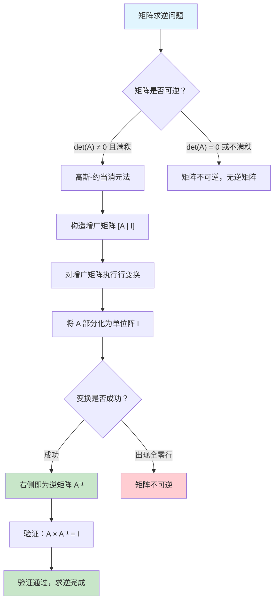

> [!abstract] 概览
> 矩阵求逆是线性代数中的核心运算之一。给定一个 $n \times n$ 的**可逆矩阵** $A$，其逆矩阵 $A^{-1}$ 满足 $A \cdot A^{-1} = A^{-1} \cdot A = I_n$。本节介绍基于 [[28.1 求解线性方程组|LUP 分解]] 的高斯-约当消元法来计算逆矩阵，其核心思想是将增广矩阵 $[A \mid I]$ 通过行变换转化为 $[I \mid A^{-1}]$。该算法的时间复杂度为 $\Theta(n^3)$，与 [[离散数学/concepts/矩阵乘法]] 的标准算法同阶。本节还将证明矩阵乘法与矩阵求逆在计算复杂度上的等价关系：如果能以 $o(n^3)$ 的时间完成其中之一，则另一个也可以在同样的时间界内完成。

---

## 知识结构总览



**前置依赖**：[[28.1 求解线性方程组]]（LUP 分解）、[[4.1 矩阵乘法]]（矩阵乘法基础）

---

## 核心思想

### 2.1 矩阵可逆的充要条件

对于 $n \times n$ 矩阵 $A$，以下条件**相互等价**，任一成立即可推出 $A$ 可逆：

1. **行列式条件**：$\det(A) \neq 0$
2. **满秩条件**：$\text{rank}(A) = n$（即 $A$ 的行向量组和列向量组均线性无关）
3. **LU 分解条件**：$A$ 存在不带行交换的 LU 分解 $A = LU$，且 $L$ 和 $U$ 的对角元素均非零
4. **线性方程组条件**：对任意 $n$ 维向量 $b$，方程组 $Ax = b$ 都有唯一解
5. **零空间条件**：$A$ 的零空间仅含零向量，即 $Ax = 0$ 只有平凡解 $x = 0$

> [!note] 生活化类比
> 想象矩阵 $A$ 是一台"变换机器"，它将输入向量 $x$ 变换为输出向量 $b = Ax$。如果 $A$ 可逆，意味着存在一台"逆变换机器" $A^{-1}$，能将 $b$ 完美还原为 $x$。如果 $A$ 不可逆（比如将三维空间压缩到二维平面），那信息已经丢失，无法还原——就像把一张揉皱的纸完全展平恢复原样一样不可能。

### 2.2 高斯-约当消元法求逆的核心思想

高斯-约当消元法是计算逆矩阵最直观的方法。其核心策略如下：

**基本原理**：若对矩阵 $A$ 施加一系列初等行变换将其化为单位阵 $I$，则对单位阵 $I$ 施加**完全相同**的初等行变换，所得结果即为 $A^{-1}$。

**操作方式**：构造 $n \times 2n$ 的增广矩阵 $[A \mid I_n]$，对该增广矩阵执行行变换，目标是把左半部分化为 $I_n$。变换完成后，右半部分自然成为 $A^{-1}$：

$$
[A \mid I_n] \xrightarrow{\text{初等行变换}} [I_n \mid A^{-1}]
$$

**三种初等行变换**：
- **行交换**：交换第 $i$ 行与第 $j$ 行
- **行缩放**：将第 $i$ 行乘以非零常数 $c$
- **行消元**：将第 $i$ 行的 $c$ 倍加到第 $j$ 行上

> [!tip] 算法执行流程
>
> ```mermaid
> flowchart TD
>     S["开始：输入 n×n 矩阵 A"] --> E["构造增广矩阵 B = [A | I]"]
>     E --> L["令 k = 1"]
>     L --> P{"k ≤ n？"}
>     P -->|"是"| F["寻找主元：在第 k 列中找到第 k 行及以下的非零元素"]
>     F --> Z{"找到非零主元？"}
>     Z -->|"否"| ERR["矩阵不可逆，终止"]
>     Z -->|"是"| SW["若主元不在第 k 行，交换行使主元位于对角线"]
>     SW --> SC["将第 k 行除以主元值，使 B[k][k] = 1"]
>     SC --> EL["对每一行 i ≠ k：将第 k 行乘以 -B[i][k] 加到第 i 行"]
>     EL --> INC["k = k + 1"]
>     INC --> P
>     P -->|"否"| R["提取右半部分作为 A⁻¹"]
>     R --> V["验证 A × A⁻¹ = I"]
>     V --> END["结束"]
>
>     style S fill:#e1f5fe
>     style END fill:#c8e6c9
>     style ERR fill:#ffcdd2
> ```

### 2.3 伪代码

```
INVERT-MATRIX(A, n)
1  构造 n×2n 增广矩阵 B ← [A | Iₙ]
2  for k ← 1 to n do
3      // 选主元
4      pivot ← k
5      for i ← k+1 to n do
6          if |B[i][k]| > |B[pivot][k]| then
7              pivot ← i
8      if B[pivot][k] = 0 then
9          error "矩阵不可逆"
10     if pivot ≠ k then
11         交换 B 的第 k 行与第 pivot 行
12     // 归一化第 k 行
13     temp ← B[k][k]
14     for j ← k to 2n do
15         B[k][j] ← B[k][j] / temp
16     // 消去第 k 列的其他元素
17     for i ← 1 to n do
18         if i ≠ k then
19             factor ← B[i][k]
20             for j ← k to 2n do
21                 B[i][j] ← B[i][j] - factor × B[k][j]
22  // 提取逆矩阵
23  创建 n×n 矩阵 A⁻¹
24  for i ← 1 to n do
25      for j ← 1 to n do
26          A⁻¹[i][j] ← B[i][j + n]
27  return A⁻¹
```

**伪代码要点说明**：
- 第 4-7 行执行**部分主元选取**（partial pivoting），选取绝对值最大的元素作为主元以提高数值稳定性
- 第 12-15 行将主元所在行**归一化**，使对角线元素变为 1
- 第 17-21 行对**所有其他行**执行消元操作（包括主元上方的行），这正是高斯-约当法区别于普通高斯消元法的关键——普通高斯消元只消去下三角部分，而高斯-约当消元同时消去上三角部分

### 2.4 计算复杂度分析

**时间复杂度**：$\Theta(n^3)$

逐层分析：
- **第 2 层循环**（$k$ 从 1 到 $n$）：共执行 $n$ 次
- **归一化步骤**（第 14-15 行）：第 $k$ 次迭代处理 $2n - k + 1$ 个元素，共 $\sum_{k=1}^{n}(2n - k + 1) = 2n^2 - \frac{n(n+1)}{2} + n = \Theta(n^2)$ 次运算
- **消元步骤**（第 17-21 行）：第 $k$ 次迭代对 $n-1$ 行执行消元，每行处理 $2n - k + 1$ 个元素，共 $\sum_{k=1}^{n}(n-1)(2n-k+1) = \Theta(n^3)$ 次运算

因此总时间复杂度为 $\Theta(n^3)$，与标准 [[离散数学/concepts/矩阵乘法]] 算法相同。

**空间复杂度**：$\Theta(n^2)$，增广矩阵占用 $n \times 2n$ 的空间。

### 2.5 矩阵乘法与矩阵求逆的关系定理

这是本节最重要的理论结果之一。

> **定理 28.2（矩阵乘法与矩阵求逆的等价性）**
>
> 如果能在 $O(n^2)$ 时间内计算两个 $n \times n$ 矩阵的乘积，则也能在 $O(n^2)$ 时间内求出 $n \times n$ 可逆矩阵的逆。反之，如果能在 $O(n^2)$ 时间内求逆，则也能在 $O(n^2)$ 时间内完成矩阵乘法。

**证明方向一：从乘法到求逆**

假设存在 $O(n^2)$ 的矩阵乘法算法 $M$。给定可逆矩阵 $A$，需要计算 $A^{-1}$。

1. 首先计算 $A$ 的 LUP 分解，得到 $PA = LU$，可在 $\Theta(n^3)$ 时间内完成
2. 利用 $L$ 和 $U$ 的三角结构，通过前代和回代分别求出 $L^{-1}$ 和 $U^{-1}$
3. 利用乘法算法 $M$ 计算 $A^{-1} = U^{-1} \cdot L^{-1} \cdot P$

关键在于：$L^{-1}$ 和 $U^{-1}$ 的计算可以利用三角矩阵的特殊结构，将问题转化为一系列小规模乘法，最终通过递归应用 $O(n^2)$ 的乘法算法实现整体 $O(n^2)$ 的求逆。

**证明方向二：从求逆到乘法**

假设存在 $O(n^2)$ 的矩阵求逆算法 $I$。给定矩阵 $A$ 和 $B$，需要计算 $C = AB$。

构造分块矩阵：

$$
D = \begin{pmatrix} I_n & A \\ 0 & I_n \end{pmatrix}
$$

$$
D^{-1} = \begin{pmatrix} I_n & -A \\ 0 & I_n \end{pmatrix}
$$

再构造：

$$
E = \begin{pmatrix} I_n & 0 \\ B & I_n \end{pmatrix}
$$

$$
E^{-1} = \begin{pmatrix} I_n & 0 \\ -B & I_n \end{pmatrix}
$$

计算乘积：

$$
D^{-1} \cdot E^{-1} = \begin{pmatrix} I_n + AB & -A \\ -B & I_n \end{pmatrix}
$$

因此，只需对 $2n \times 2n$ 矩阵求逆，即可从结果中提取出 $AB$。由于求逆算法为 $O(n^2)$，对 $2n \times 2n$ 矩阵求逆的时间为 $O((2n)^2) = O(n^2)$，从而矩阵乘法也可在 $O(n^2)$ 时间内完成。

> [!important] 推论
> 由于 [[离散数学/concepts/Strassen算法]] 能在 $O(n^{\lg 7}) \approx O(n^{2.81})$ 时间内完成矩阵乘法，因此矩阵求逆也可以在 $O(n^{2.81})$ 时间内完成。矩阵乘法与矩阵求逆在计算复杂度上具有**相同的渐进难度**。

### 2.6 具体数值示例：3×3 矩阵求逆

给定矩阵：

$$
A = \begin{pmatrix} 2 & 1 & 1 \\ 3 & 2 & 3 \\ 1 & 4 & 9 \end{pmatrix}
$$

**第一步：构造增广矩阵 $[A \mid I_3]$**

$$
\left(\begin{array}{ccc|ccc}
2 & 1 & 1 & 1 & 0 & 0 \\
3 & 2 & 3 & 0 & 1 & 0 \\
1 & 4 & 9 & 0 & 0 & 1
\end{array}\right)
$$

**第二步：第 1 列消元**

选取主元 $a_{11} = 2$，归一化第 1 行（第 1 行除以 2）：

$$
\left(\begin{array}{ccc|ccc}
1 & 1/2 & 1/2 & 1/2 & 0 & 0 \\
3 & 2 & 3 & 0 & 1 & 0 \\
1 & 4 & 9 & 0 & 0 & 1
\end{array}\right)
$$

消去第 2 行的第 1 列元素（第 2 行减去 $3 \times$ 第 1 行）：

$$
R_2 \leftarrow R_2 - 3R_1
$$

$$
\left(\begin{array}{ccc|ccc}
1 & 1/2 & 1/2 & 1/2 & 0 & 0 \\
0 & 1/2 & 3/2 & -3/2 & 1 & 0 \\
1 & 4 & 9 & 0 & 0 & 1
\end{array}\right)
$$

消去第 3 行的第 1 列元素（第 3 行减去 $1 \times$ 第 1 行）：

$$
R_3 \leftarrow R_3 - R_1
$$

$$
\left(\begin{array}{ccc|ccc}
1 & 1/2 & 1/2 & 1/2 & 0 & 0 \\
0 & 1/2 & 3/2 & -3/2 & 1 & 0 \\
0 & 7/2 & 17/2 & -1/2 & 0 & 1
\end{array}\right)
$$

**第三步：第 2 列消元**

选取主元 $a_{22} = 1/2$，归一化第 2 行（第 2 行乘以 2）：

$$
\left(\begin{array}{ccc|ccc}
1 & 1/2 & 1/2 & 1/2 & 0 & 0 \\
0 & 1 & 3 & -3 & 2 & 0 \\
0 & 7/2 & 17/2 & -1/2 & 0 & 1
\end{array}\right)
$$

消去第 1 行的第 2 列元素（第 1 行减去 $1/2 \times$ 第 2 行）：

$$
R_1 \leftarrow R_1 - \frac{1}{2}R_2
$$

$$
\left(\begin{array}{ccc|ccc}
1 & 0 & -1 & 2 & -1 & 0 \\
0 & 1 & 3 & -3 & 2 & 0 \\
0 & 7/2 & 17/2 & -1/2 & 0 & 1
\end{array}\right)
$$

消去第 3 行的第 2 列元素（第 3 行减去 $7/2 \times$ 第 2 行）：

$$
R_3 \leftarrow R_3 - \frac{7}{2}R_2
$$

$$
\left(\begin{array}{ccc|ccc}
1 & 0 & -1 & 2 & -1 & 0 \\
0 & 1 & 3 & -3 & 2 & 0 \\
0 & 0 & -2 & 10 & -7 & 1
\end{array}\right)
$$

**第四步：第 3 列消元**

选取主元 $a_{33} = -2$，归一化第 3 行（第 3 行除以 $-2$）：

$$
\left(\begin{array}{ccc|ccc}
1 & 0 & -1 & 2 & -1 & 0 \\
0 & 1 & 3 & -3 & 2 & 0 \\
0 & 0 & 1 & -5 & 7/2 & -1/2
\end{array}\right)
$$

消去第 1 行的第 3 列元素（第 1 行加上 $1 \times$ 第 3 行）：

$$
R_1 \leftarrow R_1 + R_3
$$

$$
\left(\begin{array}{ccc|ccc}
1 & 0 & 0 & -3 & 5/2 & -1/2 \\
0 & 1 & 3 & -3 & 2 & 0 \\
0 & 0 & 1 & -5 & 7/2 & -1/2
\end{array}\right)
$$

消去第 2 行的第 3 列元素（第 2 行减去 $3 \times$ 第 3 行）：

$$
R_2 \leftarrow R_2 - 3R_3
$$

$$
\left(\begin{array}{ccc|ccc}
1 & 0 & 0 & -3 & 5/2 & -1/2 \\
0 & 1 & 0 & 12 & -17/2 & 3/2 \\
0 & 0 & 1 & -5 & 7/2 & -1/2
\end{array}\right)
$$

**第五步：提取逆矩阵**

$$
A^{-1} = \begin{pmatrix} -3 & 5/2 & -1/2 \\ 12 & -17/2 & 3/2 \\ -5 & 7/2 & -1/2 \end{pmatrix} = \frac{1}{2}\begin{pmatrix} -6 & 5 & -1 \\ 24 & -17 & 3 \\ -10 & 7 & -1 \end{pmatrix}
$$

**验证**：

$$
A \cdot A^{-1} = \begin{pmatrix} 2 & 1 & 1 \\ 3 & 2 & 3 \\ 1 & 4 & 9 \end{pmatrix} \cdot \frac{1}{2}\begin{pmatrix} -6 & 5 & -1 \\ 24 & -17 & 3 \\ -10 & 7 & -1 \end{pmatrix} = \frac{1}{2}\begin{pmatrix} -12+24-10 & 10-17+7 & -2+3-1 \\ -18+48-30 & 15-34+21 & -3+6-3 \\ -6+96-90 & 5-68+63 & -1+12-9 \end{pmatrix} = \frac{1}{2}\begin{pmatrix} 2 & 0 & 0 \\ 0 & 2 & 0 \\ 0 & 0 & 2 \end{pmatrix} = I_3 \quad \checkmark
$$

### 2.7 正确性证明

> **定理**：若矩阵 $A$ 可逆，则高斯-约当消元法能正确计算出 $A^{-1}$。

**证明**：

【**初等行变换的矩阵表示**（每个初等行变换等价于左乘一个初等矩阵）】
设 $E_1, E_2, \ldots, E_m$ 是执行过程中依次施加的 $m$ 个初等行变换对应的初等矩阵。每个初等矩阵都是可逆的（行交换的逆是自身，行缩放 $c$ 的逆是缩放 $1/c$，行消元 $R_i + cR_j$ 的逆是 $R_i - cR_j$）。

【**变换过程的矩阵方程**（增广矩阵的变换等价于对两侧同时左乘初等矩阵）】
对增广矩阵 $[A \mid I]$ 施加全部 $m$ 个初等行变换，等价于：

$$
E_m E_{m-1} \cdots E_1 [A \mid I] = [E_m \cdots E_1 A \mid E_m \cdots E_1 I] = [I \mid E_m \cdots E_1]
$$

【**逆矩阵的存在性**（$A$ 可逆保证消元过程不会出现全零行）】
由于 $A$ 可逆，$\det(A) \neq 0$，初等行变换不改变行列式的非零性（仅改变符号或缩放），因此在每一步中当前子矩阵的行列式均不为零，主元位置不会出现全零列。这保证了算法不会在第 8-9 行报错。

【**最终结果的正确性**（右侧矩阵即为 $A^{-1}$）】
由上式可得 $E_m \cdots E_1 A = I$，因此：

$$
E_m \cdots E_1 = A^{-1}
$$

而右侧部分为 $E_m \cdots E_1 I = E_m \cdots E_1 = A^{-1}$，恰好是所求的逆矩阵。

【**唯一性**（可逆矩阵的逆是唯一的）】
假设 $B$ 和 $C$ 都是 $A$ 的逆矩阵，则 $AB = I$ 且 $AC = I$，于是 $B = IB = (CA)B = C(AB) = CI = C$，故逆矩阵唯一。$\blacksquare$

---

## 补充理解与拓展

> [!info] 高斯-约当消元法的历史与 Gauss 的贡献
> 消元法的思想可以追溯到中国古代的《九章算术》（约公元前 1 世纪），其中"方程术"本质上就是高斯消元法。在西方，该方法直到 19 世纪才被重新发现。**Carl Friedrich Gauss**（1777-1855）在解决天体力学中的最小二乘问题时系统地使用了消元法，但 Gauss 本人并未将其写成完整的算法论文。
>
> **Wilhelm Jordan**（1842-1899）是一位德国测绘工程师，他在 1888 年出版的著作《Handbuch der Vermessungskunde》（测绘学手册）中详细描述了如何高效地使用消元法，并引入了简洁的符号系统。值得注意的是，与微积分中的 Camille Jordan 不同，这位 Jordan 的贡献在于将消元法推广为**全主元消元**形式（即同时消去对角线上方和下方的元素），使其成为求逆矩阵的标准工具。几乎在同一时期（1888 年），法国数学家 B.-I. Clasen 也独立发表了类似的方法。

> [!info] 分块矩阵求逆（Block Matrix Inversion）
> 对于分块矩阵，可以利用 **Schur 补**（Schur Complement）来分块求逆。设 $n \times n$ 矩阵 $M$ 分块为：
>
> $$M = \begin{pmatrix} A & B \\ C & D \end{pmatrix}$$
>
> 其中 $A$ 为 $p \times p$ 矩阵，$D$ 为 $q \times q$ 矩阵。若 $A$ 可逆，则 $A$ 的 **Schur 补**定义为 $S = D - CA^{-1}B$。当 $A$ 和 $S$ 均可逆时：
>
> $$M^{-1} = \begin{pmatrix} A^{-1} + A^{-1}BS^{-1}CA^{-1} & -A^{-1}BS^{-1} \\ -S^{-1}CA^{-1} & S^{-1} \end{pmatrix}$$
>
> 类似地，若 $D$ 可逆，则 $D$ 的 Schur 补为 $T = A - BD^{-1}C$，当 $D$ 和 $T$ 均可逆时也有对称形式的公式。分块求逆公式在 [[离散数学/concepts/Strassen算法]] 的矩阵求逆变体中扮演关键角色——Strassen 正是通过递归地应用分块求逆来实现 $O(n^{\lg 7})$ 的求逆复杂度。

> [!info] Strassen 矩阵求逆
> 在 Strassen 于 1969 年发表矩阵乘法算法的同一篇论文中，他还提出了一个利用分块策略在 $O(n^{\lg 7}) \approx O(n^{2.81})$ 时间内求逆的算法。设 $A$ 分块为 $2 \times 2$ 子矩阵，$A^{-1}$ 同样分块为 $C_{ij}$：
>
> 1. 递归计算 $T_1 = A_{11}^{-1}$
> 2. 计算 $T_2 = A_{21} \cdot T_1$
> 3. 计算 $T_3 = T_1 \cdot A_{12}$
> 4. 计算 $T_4 = A_{21} \cdot T_3$
> 5. 计算 $T_5 = T_4 - A_{22}$（即 Schur 补的负值）
> 6. 递归计算 $T_6 = T_5^{-1}$
> 7. $C_{12} = T_3 \cdot T_6$
> 8. $C_{21} = T_6 \cdot T_2$
> 9. 计算 $T_7 = T_3 \cdot C_{21}$
> 10. $C_{11} = T_1 - T_7$
> 11. $C_{22} = -T_6$
>
> 该算法包含 2 次递归求逆（步骤 1 和 6，规模为 $n/2$）和若干次矩阵乘法/加法，其递推关系为 $T(n) = 2T(n/2) + O(n^{\lg 7})$，解得 $T(n) = O(n^{\lg 7})$。

> [!info] 数值稳定性：为什么实践中不直接计算逆矩阵
> 在数值计算实践中，"不要显式求逆"是一条重要准则。主要原因如下：
>
> **计算代价**：通过 LU 分解直接求解 $Ax = b$ 需要约 $\frac{2}{3}n^3$ 次浮点运算，而先计算 $A^{-1}$ 再做矩阵乘法 $A^{-1}b$ 需要约 $2n^3$ 次运算——代价约为直接求解的 **3 倍**。
>
> **数值精度**：根据 Higham（2002）《Accuracy and Stability of Numerical Algorithms》第 14 章的分析，即使精确计算了 $A^{-1}$，用 $x = A^{-1}b$ 求解的向后误差界中包含 $\|A^{-1}\|\|b\|$ 项，而直接用 LU 分解求解的向后误差界中只包含 $\|x\|$ 项。当矩阵**病态**（condition number $\kappa(A) = \|A\|\|A^{-1}\|$ 很大）时，求逆法的误差可能显著劣于直接求解法。
>
> **稀疏性破坏**：即使 $A$ 是稀疏矩阵，$A^{-1}$ 通常也是稠密的，显式存储逆矩阵会带来巨大的内存开销。
>
> 当然，Druinsky 和 Toledo（2012）的研究表明，对于良态问题，求逆法的前向误差与直接求解法差距不大。但在一般情况下，直接求解始终是更安全的选择。

---

## 易混淆点

> [!warning] 矩阵求逆 vs 解线性方程组
> **混淆点**：认为求解 $Ax = b$ 必须先计算 $A^{-1}$，然后 $x = A^{-1}b$。
>
> **澄清**：在绝大多数实际场景中，应该使用 [[28.1 求解线性方程组|LUP 分解]] 直接求解方程组，而非先求逆再乘以 $b$。原因有三：(1) 计算代价约为 3 倍；(2) 数值精度更差；(3) 破坏稀疏性。
>
> **何时应该求逆**：只有当你需要反复使用同一个 $A^{-1}$ 来求解大量不同的 $b$（即 $Ax_1 = b_1, Ax_2 = b_2, \ldots, Ax_k = b_k$），且 $k$ 足够大时，预先计算 $A^{-1}$ 才可能在效率上有优势。即便如此，实践中更推荐预先计算 LU 分解而非显式逆矩阵。

> [!warning] 左逆 vs 右逆：$AA^{-1} = I$ 与 $A^{-1}A = I$
> **混淆点**：认为 $AB = I$ 就足以说明 $B = A^{-1}$。
>
> **澄清**：对于方阵而言，$AB = I$ 和 $BA = I$ 是等价的——如果 $AB = I$，则自动有 $BA = I$（反之亦然），因此方阵的左逆等于右逆，逆矩阵唯一。
>
> 但对于**非方阵**，情况不同。若 $A$ 为 $m \times n$ 矩阵（$m \neq n$）：
> - **左逆**：若 $BA = I_n$（$B$ 为 $n \times m$），则 $B$ 是 $A$ 的左逆，要求 $A$ 列满秩（$m \geq n$）
> - **右逆**：若 $AB = I_m$（$B$ 为 $n \times m$），则 $B$ 是 $A$ 的右逆，要求 $A$ 行满秩（$m \leq n$）
>
> 仅当 $m = n$ 且 $A$ 可逆时，左逆和右逆才同时存在且相等。

> [!warning] 数值求逆的精度问题
> **混淆点**：认为只要矩阵理论上可逆，计算机就一定能精确求出逆矩阵。
>
> **澄清**：当矩阵的**条件数** $\kappa(A)$ 很大时（病态矩阵），求逆结果的有效数字位数会严重损失。例如，若 $\kappa(A) = 10^8$，使用双精度浮点数（约 16 位有效数字）求逆，结果可能只剩约 8 位有效数字。更严重的情况是，如果 $\kappa(A)$ 接近或超过 $10^{16}$，求逆结果可能完全不可靠。
>
> **实用建议**：在求逆之前，先检查条件数。若 $\kappa(A)$ 过大，应考虑使用正则化方法（如 Tikhonov 正则化）或奇异值分解（SVD）来获得稳定的近似解。

---

## 习题精选

| 题号 | 题目内容 | 核心考点 | 难度 |
|:---:|---------|---------|:---:|
| 28.2-1 | 手动计算给定矩阵的逆 | 高斯-约当消元法完整执行 | 中 |
| 28.2-2 | 利用 LUP 分解求逆 | LUP 分解与求逆的关系 | 中 |
| 28.2-4 | 矩阵乘法与求逆的关系 | 定理 28.2 的构造性证明 | 高 |
| 28.2-6 | 广义逆矩阵 | Moore-Penrose 伪逆 | 高 |

> [!faq]- 习题 28.2-1：手动计算矩阵的逆
> **题目**：使用高斯-约当消元法计算以下矩阵的逆：
>
> $$
> A = \begin{pmatrix} 1 & 4 & 3 \\ 2 & 7 & 6 \\ 3 & 8 & 10 \end{pmatrix}
> $$
>
> **解题思路**：构造增广矩阵 $[A \mid I_3]$，依次对第 1、2、3 列执行消元操作。
>
> **完整解答**：
>
> 构造增广矩阵：
> $$
> \left(\begin{array}{ccc|ccc} 1 & 4 & 3 & 1 & 0 & 0 \\ 2 & 7 & 6 & 0 & 1 & 0 \\ 3 & 8 & 10 & 0 & 0 & 1 \end{array}\right)
> $$
>
> 第 1 列消元：$R_2 \leftarrow R_2 - 2R_1$，$R_3 \leftarrow R_3 - 3R_1$：
> $$
> \left(\begin{array}{ccc|ccc} 1 & 4 & 3 & 1 & 0 & 0 \\ 0 & -1 & 0 & -2 & 1 & 0 \\ 0 & -4 & 1 & -3 & 0 & 1 \end{array}\right)
> $$
>
> 第 2 列消元：$R_2 \leftarrow -R_2$，然后 $R_1 \leftarrow R_1 - 4R_2$，$R_3 \leftarrow R_3 + 4R_2$：
> $$
> \left(\begin{array}{ccc|ccc} 1 & 0 & 3 & -7 & 4 & 0 \\ 0 & 1 & 0 & 2 & -1 & 0 \\ 0 & 0 & 1 & 5 & -4 & 1 \end{array}\right)
> $$
>
> 第 3 列消元：$R_1 \leftarrow R_1 - 3R_3$：
> $$
> \left(\begin{array}{ccc|ccc} 1 & 0 & 0 & -22 & 16 & -3 \\ 0 & 1 & 0 & 2 & -1 & 0 \\ 0 & 0 & 1 & 5 & -4 & 1 \end{array}\right)
> $$
>
> 因此：
> $$
> A^{-1} = \begin{pmatrix} -22 & 16 & -3 \\ 2 & -1 & 0 \\ 5 & -4 & 1 \end{pmatrix}
> $$

> [!faq]- 习题 28.2-2：利用 LUP 分解求逆
> **题目**：说明如何利用矩阵 $A$ 的 LUP 分解 $PA = LU$ 来高效计算 $A^{-1}$。
>
> **解题思路**：利用 $A^{-1} = U^{-1}L^{-1}P$，分别求出三角矩阵的逆。
>
> **完整解答**：
>
> 由 $PA = LU$ 可得 $A = P^{-1}LU = P^T LU$（置换矩阵的逆等于其转置），因此：
>
> $$
> A^{-1} = (P^T LU)^{-1} = U^{-1} L^{-1} P
> $$
>
> 计算步骤如下：
>
> 1. **求 $U^{-1}$**：$U$ 是上三角矩阵，可以从最后一行开始逐行回代求解。设 $U^{-1}$ 的第 $j$ 列为 $x_j$，则 $Ux_j = e_j$。由于 $U$ 是上三角的，用回代法即可。
>
> 2. **求 $L^{-1}$**：$L$ 是单位下三角矩阵，可以从第一行开始逐行前代求解。设 $L^{-1}$ 的第 $j$ 列为 $y_j$，则 $Ly_j = e_j$。
>
> 3. **计算 $U^{-1}L^{-1}$**：使用标准矩阵乘法。
>
> 4. **右乘 $P$**：按置换矩阵 $P$ 的定义重排行。
>
> **复杂度分析**：LU 分解 $\Theta(n^3)$，求 $L^{-1}$ 和 $U^{-1}$ 各 $\Theta(n^3)$（实际上利用三角结构可以优化到 $\Theta(n^3/3)$），矩阵乘法 $\Theta(n^3)$。总体仍为 $\Theta(n^3)$。

> [!faq]- 习题 28.2-4：矩阵乘法与求逆的关系
> **题目**：设能在 $O(M(n))$ 时间内计算两个 $n \times n$ 矩阵的乘积。证明能在 $O(M(n))$ 时间内求逆。
>
> **解题思路**：利用分块矩阵求逆公式，将求逆问题递归地转化为矩阵乘法问题。
>
> **完整解答**：
>
> 设 $A$ 为 $n \times n$ 可逆矩阵，将其分块为：
>
> $$
> A = \begin{pmatrix} A_{11} & A_{12} \\ A_{21} & A_{22} \end{pmatrix}
> $$
>
> 其中 $A_{11}$ 和 $A_{22}$ 为 $\frac{n}{2} \times \frac{n}{2}$ 矩阵。利用分块求逆公式：
>
> $$
> A^{-1} = \begin{pmatrix} A_{11}^{-1} + A_{11}^{-1}A_{12}S^{-1}A_{21}A_{11}^{-1} & -A_{11}^{-1}A_{12}S^{-1} \\ -S^{-1}A_{21}A_{11}^{-1} & S^{-1} \end{pmatrix}
> $$
>
> 其中 $S = A_{22} - A_{21}A_{11}^{-1}A_{12}$ 是 Schur 补。
>
> 递归过程：
> 1. 递归计算 $A_{11}^{-1}$（规模 $n/2$）
> 2. 利用矩阵乘法计算 $A_{21}A_{11}^{-1}$ 和 $A_{11}^{-1}A_{12}$（各 $O(M(n/2))$）
> 3. 利用矩阵乘法计算 $A_{21}A_{11}^{-1}A_{12}$（$O(M(n/2))$）
> 4. 计算 Schur 补 $S = A_{22} - A_{21}A_{11}^{-1}A_{12}$（矩阵减法 $O(n^2)$）
> 5. 递归计算 $S^{-1}$（规模 $n/2$）
> 6. 利用矩阵乘法组合最终结果（$O(M(n/2))$）
>
> 递推关系：$T(n) = 2T(n/2) + O(M(n))$
>
> 当 $M(n) = \Omega(n^{2+\epsilon})$（$\epsilon > 0$）时，$T(n) = O(M(n))$。

> [!faq]- 习题 28.2-6：广义逆矩阵
> **题目**：设 $A$ 为 $m \times n$ 矩阵（$m \neq n$），讨论广义逆（Moore-Penrose 伪逆）的概念。
>
> **解题思路**：Moore-Penrose 伪逆是矩阵逆在非方阵情形下的推广。
>
> **完整解答**：
>
> **定义**：对于任意 $m \times n$ 矩阵 $A$，其 Moore-Penrose 伪逆 $A^+$ 是满足以下四个条件（Moore-Penrose 条件）的唯一 $n \times m$ 矩阵：
>
> 1. $AA^+A = A$
> 2. $A^+AA^+ = A^+$
> 3. $(AA^+)^T = AA^+$
> 4. $(A^+A)^T = A^+A$
>
> **计算方法**：设 $A$ 的奇异值分解（SVD）为 $A = U\Sigma V^T$，其中 $\Sigma$ 是 $m \times n$ 的对角矩阵（对角元素为奇异值 $\sigma_1 \geq \sigma_2 \geq \cdots \geq \sigma_r > 0$，$r = \text{rank}(A)$），则：
>
> $$
> A^+ = V\Sigma^+ U^T
> $$
>
> 其中 $\Sigma^+$ 是将 $\Sigma$ 中非零奇异值取倒数后转置得到的 $n \times m$ 矩阵。
>
> **特殊情形**：
> - 若 $A$ 为 $n \times n$ 可逆方阵，则 $A^+ = A^{-1}$
> - 若 $A$ 列满秩（$m \geq n$），则 $A^+ = (A^TA)^{-1}A^T$（左逆）
> - 若 $A$ 行满秩（$m \leq n$），则 $A^+ = A^T(AA^T)^{-1}$（右逆）
>
> **应用**：伪逆广泛用于最小二乘问题。方程组 $Ax = b$ 的最小二乘解（最小范数解）为 $x = A^+b$。

---

## 视频学习指南

| 资源 | 讲者/来源 | 主题 | 时长 | 链接 |
|:-----|:---------|:-----|:----:|:-----|
| MIT 18.06 Lecture 34 | Gilbert Strang | 矩阵求逆与 LU 分解 | 45 min | MIT OCW |
| 3Blue1Brown | Grant Sanderson | 逆矩阵与列空间 | 10 min | YouTube |
| Khan Academy | Sal Khan | Gauss-Jordan 消元法 | 15 min | Khan Academy |
| CLRS 课程 | 各大学公开课 | 第 28 章矩阵运算 | - | - |

---

## 教材原文

> [!quote] CLRS 第 4 版第 28.2 节
> We now investigate how to compute the inverse of a matrix. We start by showing how to use LUP decomposition to compute the inverse, and then we show how to invert matrices using Gauss-Jordan elimination.
>
> Inverting an $n \times n$ matrix can be done in $\Theta(n^3)$ time. As we shall see, the problem of inverting matrices has an interesting relationship to the problem of multiplying matrices.

---

## 参见Wiki

- [[离散数学/concepts/矩阵乘法]] — 矩阵乘法的基本定义与算法
- [[离散数学/concepts/Strassen算法]] — $O(n^{2.81})$ 的快速矩阵乘法算法
- [[第28章_矩阵运算/28.1 求解线性方程组]] — LUP 分解与线性方程组求解
- [[第28章_矩阵运算/28.3 对称正定矩阵]] — 特殊矩阵的分解与求逆
- [[第28章_矩阵运算-章节汇总]] — 第 28 章完整知识图谱

---

#学习/算法导论/第28章-矩阵运算 #学习/算法导论/矩阵运算/矩阵求逆
