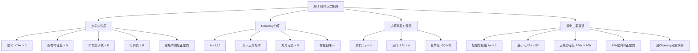
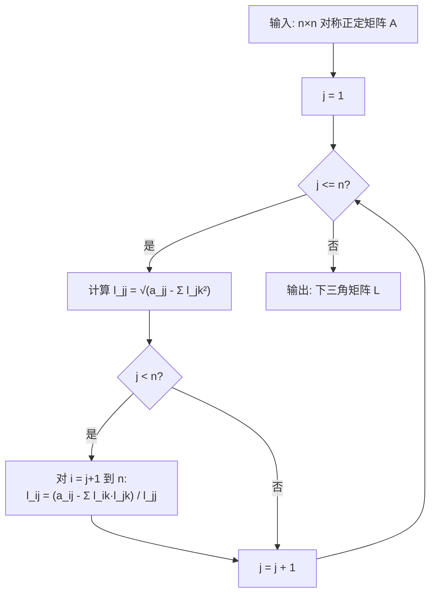

## 相关笔记

- 前置知识：[[28.1 求解线性方程组]]（LUP分解基础）、[[28.2 矩阵求逆]]（矩阵求逆方法）、[[15.4 离线缓存]]（贪心算法背景）
- 同章笔记：[[28.1 求解线性方程组]]、[[28.2 矩阵求逆]]
- 章节汇总：[[第28章_矩阵运算-章节汇总]]
- 关联概念：[[离散数学/concepts/矩阵乘法]]、[[离散数学/concepts/Strassen算法]]、[[离散数学/concepts/分治法]]

> [!abstract] 概览
> 本节介绍==对称正定矩阵==（Symmetric Positive-Definite Matrices）这一重要的矩阵类，以及与之密切相关的 ==Cholesky 分解==和==最小二乘逼近==。对称正定矩阵在科学计算、优化理论、机器学习等领域有广泛应用。对于对称正定矩阵，我们可以使用 Cholesky 分解 $A = LL^T$（其中 $L$ 为下三角矩阵）来替代一般的 LUP 分解，将求解线性方程组的计算量从 $\Theta(n^3)$ 降低到 $\Theta(n^3/3)$，效率提升约 2 倍。此外，Cholesky 分解是求解==最小二乘问题==的关键工具——通过构造正规方程组 $A^TAx = A^Tb$，将超定方程组转化为对称正定系统，再用 Cholesky 分解高效求解。
>
> **要点列表：**
> - 对称正定矩阵要求对所有非零向量 $x$，有 $x^TAx > 0$，这保证了矩阵的"能量"始终为正
> - 对称正定矩阵的所有特征值严格大于零，所有顺序主子式严格大于零
> - ==Cholesky 分解== $A = LL^T$ 存在且唯一，$L$ 为具有正对角元素的下三角矩阵
> - Cholesky 分解的计算复杂度为 $\Theta(n^3/3)$，比 LU 分解快约 2 倍，且数值稳定性更好
> - ==最小二乘逼近==将超定方程组 $Ax = b$ 转化为正规方程组 $A^TAx = A^Tb$，其中 $A^TA$ 是对称正定的
> - 利用 Cholesky 分解求解正规方程组，是求解最小二乘问题的经典方法之一

---

## 知识结构总览



---

## 核心思想

### 对称正定矩阵的定义

> [!def] 对称正定矩阵
> 一个 $n \times n$ 的==实对称矩阵== $A$ 是==正定的==（positive-definite），当且仅当对于所有非零向量 $x \in \mathbb{R}^n$，都有
> $$x^TAx > 0$$
>
> 如果将条件放宽为 $x^TAx \geq 0$，则称 $A$ 为==半正定的==（positive-semidefinite）。

**直观理解：** $x^TAx$ 可以理解为矩阵 $A$ 在向量 $x$ 方向上"产生"的能量。如果无论朝哪个方向（只要不是零向量），这个能量都严格为正，那么 $A$ 就是正定的。这类似于物理学中的动能——只要物体有速度（非零向量），动能就一定大于零。

**等价定义（通过特征值）：** 一个实对称矩阵 $A$ 是正定的，当且仅当 $A$ 的所有特征值都严格大于零。这是因为实对称矩阵可以正交对角化为 $A = Q\Lambda Q^T$，其中 $\Lambda = \text{diag}(\lambda_1, \lambda_2, \ldots, \lambda_n)$，于是

$$x^TAx = x^TQ\Lambda Q^Tx = (Q^Tx)^T\Lambda(Q^Tx) = \sum_{i=1}^{n}\lambda_i y_i^2$$

其中 $y = Q^Tx$。由于 $Q$ 是正交矩阵，$x \neq 0$ 当且仅当 $y \neq 0$。因此 $x^TAx > 0$ 对所有非零 $x$ 成立，当且仅当所有 $\lambda_i > 0$。

### 对称正定矩阵的关键性质

> [!important] 五条核心性质
> 设 $A$ 是一个 $n \times n$ 的实对称正定矩阵，则以下性质成立：
>
> 1. **所有特征值严格大于零：** $\lambda_i > 0$，$i = 1, 2, \ldots, n$
> 2. **所有顺序主子式严格大于零：** 对 $k = 1, 2, \ldots, n$，$A$ 的 $k \times k$ 左上角子矩阵的行列式 $\det(A_{1:k, 1:k}) > 0$（Sylvester 准则）
> 3. **Cholesky 分解存在且唯一：** $A = LL^T$，其中 $L$ 是具有正对角元素的下三角矩阵
> 4. **逆矩阵也是正定的：** $A^{-1}$ 存在且 $A^{-1}$ 也是对称正定矩阵
> 5. **行列式大于零：** $\det(A) = \prod_{i=1}^{n}\lambda_i > 0$

**性质 4 的证明：** 设 $A$ 是对称正定矩阵。由于所有特征值 $\lambda_i > 0$，$\det(A) = \prod_{i=1}^{n}\lambda_i > 0$，故 $A$ 可逆。$A^{-1}$ 的对称性由 $(A^{-1})^T = (A^T)^{-1} = A^{-1}$ 保证。对于任意非零 $x$，令 $y = A^{-1}x$，则 $y \neq 0$（因为 $A^{-1}$ 可逆），于是

$$x^TA^{-1}x = (Ay)^TA^{-1}(Ay) = y^TA^TA^{-1}Ay = y^TAy > 0$$

因此 $A^{-1}$ 也是正定的。

### Cholesky 分解

> [!def] Cholesky 分解
> 对于任意 $n \times n$ 的对称正定矩阵 $A$，存在唯一的分解
> $$A = LL^T$$
> 其中 $L$ 是一个==下三角矩阵==，且所有对角元素 $l_{ii} > 0$。这个分解称为 $A$ 的 ==Cholesky 分解==。

**与 LU 分解的关系：** Cholesky 分解可以看作 LU 分解在对称正定矩阵上的特化。在 LU 分解中，$A = LU$，其中 $L$ 是单位下三角矩阵，$U$ 是上三角矩阵。对于对称正定矩阵，$U = DL^T$（其中 $D$ 是对角矩阵），因此 $A = LDL^T$。进一步地，由于对角元素都是正的，可以将 $D$ 吸收到 $L$ 中，得到 $A = (L\sqrt{D})(L\sqrt{D})^T = LL^T$。

> [!tip] 算法执行流程
> Cholesky 分解逐列计算下三角矩阵 L 的元素：
> 1. 对于第 j 列（j 从 1 到 n），首先计算对角元素 l_jj
> 2. l_jj 等于 a_jj 减去已计算的 L 行的点积平方，再开平方
> 3. 然后计算第 j 列中 j 下方的非对角元素 l_ij（i 从 j+1 到 n）
> 4. l_ij 等于 (a_ij 减去已计算行的点积) 除以 l_jj
> 5. 重复以上步骤直到所有列计算完毕



### Cholesky 分解伪代码

```
CHOLESKY-DECOMPOSITION(A, n)
1  let L[1..n][1..n] be a new matrix
2  for j = 1 to n
3      // 计算对角元素 l_jj
4      l_jj = a_jj
5      for k = 1 to j-1
6          l_jj = l_jj - l_jk · l_jk
7      l_jj = √(l_jj)
8      // 计算非对角元素 l_ij (i > j)
9      for i = j+1 to n
10         l_ij = a_ij
11         for k = 1 to j-1
12             l_ij = l_ij - l_ik · l_jk
13         l_ij = l_ij / l_jj
14 return L
```

> [!def] CHOLESKY-DECOMPOSITION
> **输入：** $n \times n$ 对称正定矩阵 $A$
> **输出：** 下三角矩阵 $L$，使得 $A = LL^T$
>
> **算法步骤：**
> 1. 对每一列 $j = 1, 2, \ldots, n$：
>    - **计算对角元素：** $l_{jj} = \sqrt{a_{jj} - \sum_{k=1}^{j-1}l_{jk}^2}$
>    - **计算非对角元素：** 对 $i = j+1, \ldots, n$，$l_{ij} = \left(a_{ij} - \sum_{k=1}^{j-1}l_{ik}l_{jk}\right) / l_{jj}$
> 2. 返回 $L$

### 利用 Cholesky 分解求解线性方程组

给定对称正定方程组 $Ax = b$，通过 Cholesky 分解 $A = LL^T$，可以将求解过程分解为两个三角方程组：

1. **前代求解 $Ly = b$**（下三角方程组）：由于 $L$ 是下三角矩阵，可以从 $y_1$ 开始依次求解 $y_2, y_3, \ldots, y_n$
2. **回代求解 $L^Tx = y$**（上三角方程组）：由于 $L^T$ 是上三角矩阵，可以从 $x_n$ 开始依次回代求解 $x_{n-1}, \ldots, x_1$

> [!tip] 求解流程
> 利用 Cholesky 分解求解 Ax = b 的完整流程：
> 1. 对矩阵 A 执行 Cholesky 分解，得到下三角矩阵 L（使得 A = LLᵀ）
> 2. 前代求解：解下三角方程组 Ly = b，从 y₁ 开始逐个求出 y 的所有分量
> 3. 回代求解：解上三角方程组 Lᵀx = y，从 xₙ 开始逐个回代求出 x 的所有分量
> 4. 返回解向量 x

### 计算复杂度分析

> [!def] Cholesky 分解的复杂度 $\Theta(n^3/3)$
> Cholesky 分解的计算复杂度由以下部分组成：
>
> 1. **分解阶段：** 外层循环 $j$ 从 $1$ 到 $n$：
>    - 计算对角元素 $l_{jj}$：内层循环 $k$ 从 $1$ 到 $j-1$，共 $j-1$ 次乘法
>    - 计算非对角元素 $l_{ij}$：对 $i = j+1$ 到 $n$，每个需要 $j-1$ 次乘法和 1 次除法，共 $(n-j)(j-1)$ 次乘法
>    - 总浮点运算次数：$\sum_{j=1}^{n}\left[(j-1) + (n-j)(j-1)\right] \approx \frac{n^3}{3}$
>
> 2. **前代 + 回代：** 各需要 $\Theta(n^2)$ 时间
>
> **总运行时间：** $\Theta(n^3/3) + \Theta(n^2) = $ ==$\Theta(n^3/3)$==
>
> 对比 [[28.1 求解线性方程组]] 中的 LU 分解（$\Theta(n^3)$），Cholesky 分解快约 2 倍。这是因为对称性使得我们只需要计算一半的元素。

### 最小二乘逼近

#### 超定方程组

在实际应用中，我们经常遇到==超定方程组==（overdetermined system）$Ax = b$，其中 $A$ 是一个 $m \times n$ 矩阵（$m > n$），即方程的个数多于未知数的个数。由于方程数多于未知数，这样的系统通常没有精确解。

#### 最小二乘目标

最小二乘法的目标是找到一个向量 $x$，使得残差 $\|Ax - b\|$ 最小化：

$$\min_{x \in \mathbb{R}^n} \|Ax - b\|^2 = \min_{x \in \mathbb{R}^n} (Ax - b)^T(Ax - b)$$

**几何直觉：** 想象 $A$ 的列向量张成一个 $n$ 维子空间。$b$ 通常不在这个子空间中。最小二乘解 $x^*$ 使得 $Ax^*$ 是 $b$ 在这个子空间上的==正交投影==，即残差 $b - Ax^*$ 与 $A$ 的所有列正交。

#### 正规方程组

> [!def] 正规方程组
> 对目标函数 $f(x) = \|Ax - b\|^2$ 关于 $x$ 求导并令梯度为零：
> $$\nabla f(x) = 2A^T(Ax - b) = 0$$
> 化简得到==正规方程组==（normal equations）：
> $$A^TAx = A^Tb$$
>
> 其中 $A^TA$ 是一个 $n \times n$ 的==对称正定矩阵==（假设 $A$ 的列线性无关），$A^Tb$ 是一个 $n$ 维向量。

**为什么 $A^TA$ 是对称正定的？**

1. **对称性：** $(A^TA)^T = A^T(A^T)^T = A^TA$
2. **正定性：** 对任意非零 $x$，$x^T(A^TA)x = (Ax)^T(Ax) = \|Ax\|^2 \geq 0$。当 $A$ 的列线性无关时，$Ax \neq 0$（对 $x \neq 0$），因此 $\|Ax\|^2 > 0$

#### 用 Cholesky 分解求解正规方程组

> [!tip] 最小二乘求解流程
> 利用 Cholesky 分解求解最小二乘问题的完整流程：
> 1. 计算矩阵乘积 C = AᵀA 和向量 d = Aᵀb
> 2. 对对称正定矩阵 C 执行 Cholesky 分解，得到 C = LLᵀ
> 3. 前代求解下三角方程组 Ly = d
> 4. 回代求解上三角方程组 Lᵀx = y
> 5. 返回最小二乘解 x

### 正确性证明

**定理（Cholesky 分解的存在性与唯一性）：** 如果 $A$ 是 $n \times n$ 对称正定矩阵，则存在唯一的下三角矩阵 $L$（具有正对角元素），使得 $A = LL^T$。

**证明：** 对 $n$ 进行数学归纳法。

> **【归纳基础（n=1）】** 一阶正定矩阵 $A = [a_{11}]$，其中 $a_{11} > 0$（因为 $x^TAx = a_{11}x_1^2 > 0$ 对所有 $x_1 \neq 0$ 成立）。取 $L = [\sqrt{a_{11}}]$，则 $LL^T = [\sqrt{a_{11}}][\sqrt{a_{11}}] = [a_{11}] = A$。由于 $a_{11} > 0$，$L$ 的对角元素唯一确定为 $\sqrt{a_{11}} > 0$。

> **【归纳假设】** 假设对所有 $(n-1) \times (n-1)$ 对称正定矩阵，Cholesky 分解存在且唯一。

> **【归纳步（n阶矩阵）】** 将 $A$ 分块为
> $$A = \begin{pmatrix} a_{11} & w^T \\ w & A_{22} \end{pmatrix}$$
> 其中 $w \in \mathbb{R}^{n-1}$，$A_{22}$ 是 $(n-1) \times (n-1)$ 矩阵。

> **【Schur补推导（分块消元）】** 由于 $A$ 正定，$a_{11} > 0$。令 $L$ 分块为
> $$L = \begin{pmatrix} l_{11} & 0 \\ v & L_{22} \end{pmatrix}$$
> 则 $LL^T = \begin{pmatrix} l_{11}^2 & l_{11}v^T \\ l_{11}v & vv^T + L_{22}L_{22}^T \end{pmatrix}$
>
> 比较 $A = LL^T$ 的各块：
> - $l_{11}^2 = a_{11}$，故 $l_{11} = \sqrt{a_{11}} > 0$（唯一确定）
> - $l_{11}v^T = w^T$，故 $v = w / l_{11}$（唯一确定）
> - $vv^T + L_{22}L_{22}^T = A_{22}$，故 $L_{22}L_{22}^T = A_{22} - vv^T =: S$

> **【正定性传递（Schur补的正定性）】** 矩阵 $S = A_{22} - ww^T/a_{11}$ 是 $A$ 的 Schur 补。可以证明 $S$ 也是对称正定的（因为 $A$ 正定蕴含其所有 Schur 补正定）。由归纳假设，$S$ 存在唯一的 Cholesky 分解 $S = L_{22}L_{22}^T$。

> **【唯一性论证（各块唯一确定）】** 由于 $l_{11}$、$v$、$L_{22}$ 都唯一确定，$L$ 唯一确定。归纳完成。

**定理（正规方程组的最优性）：** 如果 $A$ 是 $m \times n$ 矩阵（列满秩），$b \in \mathbb{R}^m$，则正规方程组 $A^TAx = A^Tb$ 的解 $x^*$ 是最小二乘问题 $\min_x\|Ax - b\|^2$ 的唯一解。

**证明：**

> **【目标函数展开（二次型配方法）】** 展开 $\|Ax - b\|^2$：
> $$\|Ax - b\|^2 = x^TA^TAx - 2b^TAx + b^Tb$$
> 这是一个关于 $x$ 的二次函数，由于 $A^TA$ 正定，该函数有唯一的全局最小值。

> **【梯度条件（一阶必要条件）】** 对 $f(x) = x^TA^TAx - 2b^TAx + b^Tb$ 求梯度：
> $$\nabla f(x) = 2A^TAx - 2A^Tb$$
> 令 $\nabla f(x^*) = 0$，得到 $A^TAx^* = A^Tb$。

> **【Hessian矩阵（二阶充分条件）】** Hessian 矩阵为 $H = 2A^TA$。由于 $A$ 列满秩，$A^TA$ 正定，故 $H$ 正定。因此 $x^*$ 是 $f(x)$ 的唯一全局最小值点。

### 具体数值示例：最小二乘求解

**问题：** 给定设计矩阵和观测向量，求最小二乘解。

$$A = \begin{pmatrix} 1 & 1 \\ 1 & 2 \\ 1 & 3 \end{pmatrix}, \quad b = \begin{pmatrix} 1 \\ 2 \\ 2 \end{pmatrix}$$

这是一个 $3 \times 2$ 的超定方程组（$m = 3 > n = 2$），没有精确解。

**第一步：计算 $A^TA$ 和 $A^Tb$**

$$A^TA = \begin{pmatrix} 1 & 1 & 1 \\ 1 & 2 & 3 \end{pmatrix} \begin{pmatrix} 1 & 1 \\ 1 & 2 \\ 1 & 3 \end{pmatrix} = \begin{pmatrix} 3 & 6 \\ 6 & 14 \end{pmatrix}$$

$$A^Tb = \begin{pmatrix} 1 & 1 & 1 \\ 1 & 2 & 3 \end{pmatrix} \begin{pmatrix} 1 \\ 2 \\ 2 \end{pmatrix} = \begin{pmatrix} 5 \\ 11 \end{pmatrix}$$

**第二步：验证 $A^TA$ 是对称正定的**

- 对称性：显然 $(A^TA)^T = A^TA$
- 顺序主子式：$\det([3]) = 3 > 0$，$\det\begin{pmatrix} 3 & 6 \\ 6 & 14 \end{pmatrix} = 3 \times 14 - 6 \times 6 = 42 - 36 = 6 > 0$

**第三步：对 $A^TA$ 执行 Cholesky 分解**

求 $L = \begin{pmatrix} l_{11} & 0 \\ l_{21} & l_{22} \end{pmatrix}$ 使得 $LL^T = \begin{pmatrix} 3 & 6 \\ 6 & 14 \end{pmatrix}$。

- $l_{11} = \sqrt{a_{11}} = \sqrt{3}$
- $l_{21} = a_{21} / l_{11} = 6 / \sqrt{3} = 2\sqrt{3}$
- $l_{22} = \sqrt{a_{22} - l_{21}^2} = \sqrt{14 - (2\sqrt{3})^2} = \sqrt{14 - 12} = \sqrt{2}$

因此：

$$L = \begin{pmatrix} \sqrt{3} & 0 \\ 2\sqrt{3} & \sqrt{2} \end{pmatrix}$$

**验证：** $LL^T = \begin{pmatrix} \sqrt{3} & 0 \\ 2\sqrt{3} & \sqrt{2} \end{pmatrix} \begin{pmatrix} \sqrt{3} & 2\sqrt{3} \\ 0 & \sqrt{2} \end{pmatrix} = \begin{pmatrix} 3 & 6 \\ 6 & 14 \end{pmatrix}$ ✓

**第四步：前代求解 $Ly = A^Tb$**

$$\begin{pmatrix} \sqrt{3} & 0 \\ 2\sqrt{3} & \sqrt{2} \end{pmatrix} \begin{pmatrix} y_1 \\ y_2 \end{pmatrix} = \begin{pmatrix} 5 \\ 11 \end{pmatrix}$$

- $y_1 = 5 / \sqrt{3} = 5\sqrt{3}/3$
- $2\sqrt{3} \cdot y_1 + \sqrt{2} \cdot y_2 = 11$
- $\sqrt{2} \cdot y_2 = 11 - 2\sqrt{3} \cdot 5\sqrt{3}/3 = 11 - 10 = 1$
- $y_2 = 1/\sqrt{2} = \sqrt{2}/2$

**第五步：回代求解 $L^Tx = y$**

$$\begin{pmatrix} \sqrt{3} & 2\sqrt{3} \\ 0 & \sqrt{2} \end{pmatrix} \begin{pmatrix} x_1 \\ x_2 \end{pmatrix} = \begin{pmatrix} 5\sqrt{3}/3 \\ \sqrt{2}/2 \end{pmatrix}$$

- $\sqrt{2} \cdot x_2 = \sqrt{2}/2$，故 $x_2 = 1/2$
- $\sqrt{3} \cdot x_1 + 2\sqrt{3} \cdot (1/2) = 5\sqrt{3}/3$
- $\sqrt{3} \cdot x_1 = 5\sqrt{3}/3 - \sqrt{3} = 5\sqrt{3}/3 - 3\sqrt{3}/3 = 2\sqrt{3}/3$
- $x_1 = 2/3$

**最终结果：** 最小二乘解为 $x^* = \begin{pmatrix} 2/3 \\ 1/2 \end{pmatrix}$

**验证：** $Ax^* = \begin{pmatrix} 1 & 1 \\ 1 & 2 \\ 1 & 3 \end{pmatrix} \begin{pmatrix} 2/3 \\ 1/2 \end{pmatrix} = \begin{pmatrix} 7/6 \\ 7/3 \\ 13/6 \end{pmatrix}$

残差 $\|Ax^* - b\|^2 = (7/6 - 1)^2 + (7/3 - 2)^2 + (13/6 - 2)^2 = (1/6)^2 + (1/3)^2 + (1/6)^2 = 1/36 + 4/36 + 1/36 = 6/36 = 1/6$

---

## 补充理解与拓展

> [!info] Cholesky 分解的数值稳定性优势
>
> Cholesky 分解在数值稳定性方面相比 LU 分解有显著优势，这源于对称正定矩阵的特殊结构：
>
> 1. **无需选主元（Pivoting）：** 对称正定矩阵的正定性保证了算法中每一步计算对角元素 $l_{jj} = \sqrt{a_{jj} - \sum_{k=1}^{j-1}l_{jk}^2}$ 时，根号内的值始终为正。这意味着永远不会出现除以零或除以极小值的情况，因此不需要像 LU 分解那样进行部分选主元（partial pivoting）来保证稳定性。
>
> 2. **误差传播可控：** Cholesky 分解的计算公式具有内在的稳定性。具体而言，$l_{jj}$ 的计算涉及开平方运算，这会"压缩"误差而非放大误差。而 LU 分解中的除法操作可能在遇到小主元时放大舍入误差。
>
> 3. **存储效率：** 由于对称性，只需存储矩阵的下三角部分（含对角线），存储量减半。LU 分解需要分别存储 $L$ 和 $U$ 两个矩阵。
>
> 4. **计算效率：** Cholesky 分解需要约 $n^3/3$ 次浮点运算，而 LU 分解需要约 $2n^3/3$ 次。效率提升约 2 倍。
>
> 来源：Trefethen & Bau, *Numerical Linear Algebra*, Lecture 23; Eric Darve, Stanford CME 302/338 Lecture Notes
>
> **实践建议：** 当确认矩阵是对称正定时，始终优先选择 Cholesky 分解而非 LU 分解。在机器学习中，训练线性回归、高斯过程回归等算法中频繁出现的正规方程组 $A^TAx = A^Tb$，Cholesky 分解是标准求解方法。

> [!info] 正规方程组 vs QR 分解求解最小二乘
>
> 求解最小二乘问题有两种主要方法：正规方程组 + Cholesky 分解，以及 QR 分解。两者的对比如下：
>
> | 比较维度 | 正规方程组 + Cholesky | QR 分解 |
> |---------|---------------------|---------|
> | 核心步骤 | 计算 $A^TA$ 和 $A^Tb$，再 Cholesky 分解 | 对 $A$ 做 QR 分解 $A = QR$，解 $Rx = Q^Tb$ |
> | 浮点运算量 | 约 $mn^2 + n^3/3$ | 约 $2mn^2$（Householder QR） |
> | 条件数 | $\kappa(A^TA) = [\kappa(A)]^2$（条件数平方！） | $\kappa(A)$（保持原条件数） |
> | 数值稳定性 | 条件数平方效应，对病态问题不稳定 | 数值稳定，不放大条件数 |
> | 适用场景 | $A$ 列满秩且条件数适中 | 通用，尤其适合病态问题 |
>
> **关键问题——条件数平方效应：** 正规方程组将条件数从 $\kappa(A)$ 放大到 $[\kappa(A)]^2$。如果 $\kappa(A) = 10^4$，则 $\kappa(A^TA) = 10^8$，这意味着在正规方程组中，相对误差被放大了 $10^8$ 倍而非 $10^4$ 倍。对于病态问题（$\kappa(A)$ 很大），这种放大可能导致完全不可用的结果。
>
> **实践建议：**
> - 当 $A$ 的条件数较小（$< 10^3$）且 $n$ 远小于 $m$ 时，正规方程组 + Cholesky 更快
> - 当 $A$ 的条件数较大或需要高精度时，QR 分解更可靠
> - 当 $A$ 可能秩亏时，应使用 SVD 方法（见下文）
>
> 来源：Trefethen & Bau, *Numerical Linear Algebra*, Lecture 11; Lee, "Numerically Efficient Methods for Solving Least Squares Problems", UChicago REU 2012

> [!info] Trefethen & Bau《数值线性代数》推荐
>
> Lloyd N. Trefethen 和 David Bau III 合著的 *Numerical Linear Algebra*（SIAM, 1997）是数值线性代数领域最经典的教材之一，以"讲座"（Lecture）的形式组织内容，共 34 讲，每讲聚焦一个核心主题，语言简洁而深刻。
>
> **与 CLRS 第 28 章的互补关系：**
> - CLRS 侧重于==算法设计==视角——给出伪代码、分析复杂度、证明正确性
> - Trefethen & Bau 侧重于==数值分析==视角——讨论条件数、向后稳定性、误差传播
>
> **推荐阅读路径（配合 CLRS 第 28 章）：**
> - Lecture 1（矩阵-向量乘法）→ 对应 CLRS 4.1-4.2 [[离散数学/concepts/矩阵乘法]]、[[离散数学/concepts/Strassen算法]]
> - Lecture 20（LU 分解）→ 对应 CLRS 28.1 [[28.1 求解线性方程组]]
> - Lecture 21（Cholesky 分解）→ 对应 CLRS 28.3 本节
> - Lecture 11（QR 分解与最小二乘）→ 对应 CLRS 28.3 最小二乘部分
> - Lecture 12（条件数与条件化）→ 理解为何正规方程组可能不精确
>
> **特色：** 该书的 Lecture 23 专门讨论了 Cholesky 分解的"惊人稳定性"（remarkable stability），从向后误差分析的角度解释了为何 Cholesky 分解即使不选主元也能保持数值稳定——这是对称正定结构赋予的"天然保护"。
>
> 来源：Trefethen & Bau, *Numerical Linear Algebra*, SIAM, 1997; SIAM 出版物页面

> [!info] SVD 与最小二乘的关系
>
> 奇异值分解（Singular Value Decomposition, SVD）是求解最小二乘问题最通用、最鲁棒的方法。对于任意 $m \times n$ 矩阵 $A$（无论是否列满秩），SVD 都能给出最小二乘解。
>
> **SVD 的形式：** $A = U\Sigma V^T$，其中 $U$ 是 $m \times m$ 正交矩阵，$V$ 是 $n \times n$ 正交矩阵，$\Sigma$ 是 $m \times n$ 对角矩阵，对角元素 $\sigma_1 \geq \sigma_2 \geq \cdots \geq \sigma_r > 0$ 是 $A$ 的奇异值（$r = \text{rank}(A)$）。
>
> **Moore-Penrose 伪逆：** 利用 SVD，$A$ 的伪逆为
> $$A^+ = V\Sigma^+ U^T$$
> 其中 $\Sigma^+$ 将 $\Sigma$ 的非零对角元素取倒数后转置。最小二乘解为 $x^* = A^+b$。
>
> **三种方法的适用场景：**
> | 方法 | 适用条件 | 优势 | 劣势 |
> |------|---------|------|------|
> | 正规方程组 + Cholesky | $A$ 列满秩，条件数小 | 最快（$mn^2 + n^3/3$） | 条件数平方效应 |
> | QR 分解 | $A$ 列满秩 | 数值稳定 | 比正规方程组慢 |
> | SVD | 任意矩阵 | 最通用，处理秩亏 | 最慢（$O(mn^2 + n^3)$ 或更多） |
>
> **SVD 的独特优势：** 当 $A$ 秩亏（rank-deficient）时，正规方程组和 QR 分解都会遇到困难（$A^TA$ 奇异，$R$ 有零对角元素），而 SVD 可以自然地给出==最小范数最小二乘解==——在所有使 $\|Ax - b\|$ 最小的 $x$ 中，选择 $\|x\|$ 最小的那个。这在反问题（inverse problems）、图像重建等领域非常重要。
>
> 来源：Trefethen & Bau, *Numerical Linear Algebra*, Lecture 31; Strang, *Linear Algebra and Its Applications*; Columbia COMS 4771 Lecture Notes on SVD

---

## 易混淆点与辨析

> [!warning] 对称矩阵 vs 对称正定矩阵
> ❌ **错误理解：** "对称矩阵就是对称正定矩阵，因为正定只是加了一个条件而已"
>
> ✅ **正确理解：** 对称正定矩阵是对称矩阵的一个==严格子集==。一个矩阵可以是对称的但不是正定的。例如：
> $$A = \begin{pmatrix} 1 & 0 \\ 0 & -1 \end{pmatrix}$$
> 是对称的（$A^T = A$），但不是正定的——取 $x = (0, 1)^T$，则 $x^TAx = -1 < 0$。
>
> **判断方法：** 要验证一个对称矩阵是否正定，可以使用以下任一充分必要条件：
> - 所有特征值 $> 0$
> - 所有顺序主子式 $> 0$（Sylvester 准则）
> - Cholesky 分解成功完成（对角元素均为正）
> - 对所有非零 $x$，$x^TAx > 0$（定义）
>
> **半正定矩阵：** 如果 $x^TAx \geq 0$（允许等于零），则 $A$ 是半正定的。半正定矩阵允许有零特征值。例如 $A = \begin{pmatrix} 1 & 0 \\ 0 & 0 \end{pmatrix}$ 是半正定的但不是正定的。

> [!warning] Cholesky 分解 vs LU 分解——何时用哪个
> ❌ **错误理解：** "Cholesky 分解只是 LU 分解的特例，没什么本质区别，用哪个都行"
>
> ✅ **正确理解：** Cholesky 分解确实可以视为 LU 分解在对称正定矩阵上的特化，但两者在效率、稳定性和适用范围上有本质区别：
>
> | 比较维度 | Cholesky 分解 | LU 分解 |
> |---------|-------------|---------|
> | 适用范围 | 仅对称正定矩阵 | 任意非奇异方阵 |
> | 计算量 | $n^3/3$ | $2n^3/3$ |
> | 存储量 | 仅一个三角矩阵 | 两个三角矩阵 |
> | 选主元 | 不需要 | 通常需要部分选主元 |
> | 数值稳定性 | 天然稳定 | 依赖选主元策略 |
>
> **使用原则：**
> - 如果矩阵**确定**是对称正定的 → 用 Cholesky 分解（更快、更省内存、更稳定）
> - 如果矩阵**不确定**是否正定，或不是对称的 → 用 LU 分解（更通用）
> - 在实践中，可以先尝试 Cholesky 分解；如果分解过程中对角元素出现负值或零，说明矩阵不是正定的，再回退到 LU 分解

> [!warning] 最小二乘的正规方程组为何可能病态
> ❌ **错误理解：** "正规方程组 $A^TAx = A^Tb$ 只是把 $Ax = b$ 两边乘以 $A^T$，条件数不会变差"
>
> ✅ **正确理解：** 正规方程组将条件数从 $\kappa(A)$ 放大到 $[\kappa(A)]^2$，这是一个严重的数值问题。
>
> **具体分析：** 设 $A$ 的条件数为 $\kappa(A) = \sigma_{\max}/\sigma_{\min}$（最大奇异值与最小奇异值之比）。则
> $$\kappa(A^TA) = \frac{\sigma_{\max}^2}{\sigma_{\min}^2} = [\kappa(A)]^2$$
>
> **数值影响：** 在浮点运算中，相对误差的上界与条件数成正比。如果 $\kappa(A) = 10^8$（在双精度浮点数下已经接近精度极限），则 $\kappa(A^TA) = 10^{16}$，这意味着正规方程组的解可能完全没有有效数字！
>
> **实际例子：** 在多项式拟合中，如果用高次多项式拟合数据点，设计矩阵 $A$ 的列（$1, t, t^2, t^3, \ldots$）高度相关，导致 $A$ 的条件数很大。此时正规方程组会严重损失精度。
>
> **解决方案：** 对病态问题，应使用 QR 分解或 SVD 代替正规方程组。或者对数据进行预处理（如标准化、中心化）来降低条件数。

---

## 习题精选

| 题号 | 题目描述 | 难度 |
|:---:|----------|:---:|
| 28.3-1 | 证明矩阵 $A = \begin{pmatrix} 4 & 12 & -16 \\ 12 & 37 & -43 \\ -16 & -43 & 98 \end{pmatrix}$ 是对称正定的 | ⭐⭐ |
| 28.3-2 | 对矩阵 $A = \begin{pmatrix} 4 & 12 & -16 \\ 12 & 37 & -43 \\ -16 & -43 & 98 \end{pmatrix}$ 手动执行 Cholesky 分解 | ⭐⭐ |
| 28.3-4 | 利用 Cholesky 分解求解方程组 $Ax = b$，其中 $A$ 同上，$b = (1, 2, 3)^T$ | ⭐⭐⭐ |
| 28.3-5 | 给定数据点 $(1, 2)$、$(2, 3)$、$(3, 5)$，用最小二乘法求最佳拟合直线 $y = c_0 + c_1 x$ | ⭐⭐ |

> [!faq]- 28.3-1 解答：验证对称正定性
> **目标：** 证明 $A = \begin{pmatrix} 4 & 12 & -16 \\ 12 & 37 & -43 \\ -16 & -43 & 98 \end{pmatrix}$ 是对称正定的。
>
> **方法一：Sylvester 准则（验证顺序主子式）**
>
> 一阶顺序主子式：$\det([4]) = 4 > 0$ ✓
>
> 二阶顺序主子式：$\det\begin{pmatrix} 4 & 12 \\ 12 & 37 \end{pmatrix} = 4 \times 37 - 12 \times 12 = 148 - 144 = 4 > 0$ ✓
>
> 三阶顺序主子式（即 $\det(A)$）：
> $$\det(A) = 4(37 \times 98 - (-43)(-43)) - 12(12 \times 98 - (-43)(-16)) + (-16)(12 \times (-43) - 37 \times (-16))$$
> $$= 4(3626 - 1849) - 12(1176 - 688) + (-16)(-516 + 592)$$
> $$= 4 \times 1777 - 12 \times 488 + (-16) \times 76$$
> $$= 7108 - 5856 - 1216 = 36 > 0$$ ✓
>
> 所有顺序主子式严格大于零，由 Sylvester 准则，$A$ 是对称正定的。
>
> **方法二：直接验证定义**
> 对任意非零 $x = (x_1, x_2, x_3)^T$：
> $$x^TAx = 4x_1^2 + 74x_2^2 + 98x_3^2 + 24x_1x_2 - 32x_1x_3 - 86x_2x_3$$
> 可以验证这是一个正定二次型（通过配方法或计算特征值）。由于计算较繁琐，Sylvester 准则是更高效的方法。

> [!faq]- 28.3-2 解答：手动执行 Cholesky 分解
> **目标：** 对 $A = \begin{pmatrix} 4 & 12 & -16 \\ 12 & 37 & -43 \\ -16 & -43 & 98 \end{pmatrix}$ 执行 Cholesky 分解。
>
> 设 $L = \begin{pmatrix} l_{11} & 0 & 0 \\ l_{21} & l_{22} & 0 \\ l_{31} & l_{32} & l_{33} \end{pmatrix}$，使得 $A = LL^T$。
>
> **第 1 列（j=1）：**
> - $l_{11} = \sqrt{a_{11}} = \sqrt{4} = 2$
> - $l_{21} = a_{21}/l_{11} = 12/2 = 6$
> - $l_{31} = a_{31}/l_{11} = -16/2 = -8$
>
> **第 2 列（j=2）：**
> - $l_{22} = \sqrt{a_{22} - l_{21}^2} = \sqrt{37 - 36} = \sqrt{1} = 1$
> - $l_{32} = (a_{32} - l_{31}l_{21})/l_{22} = (-43 - (-8)(6))/1 = (-43 + 48)/1 = 5$
>
> **第 3 列（j=3）：**
> - $l_{33} = \sqrt{a_{33} - l_{31}^2 - l_{32}^2} = \sqrt{98 - 64 - 25} = \sqrt{9} = 3$
>
> **结果：**
> $$L = \begin{pmatrix} 2 & 0 & 0 \\ 6 & 1 & 0 \\ -8 & 5 & 3 \end{pmatrix}$$
>
> **验证：** $LL^T = \begin{pmatrix} 2 & 0 & 0 \\ 6 & 1 & 0 \\ -8 & 5 & 3 \end{pmatrix} \begin{pmatrix} 2 & 6 & -8 \\ 0 & 1 & 5 \\ 0 & 0 & 3 \end{pmatrix} = \begin{pmatrix} 4 & 12 & -16 \\ 12 & 37 & -43 \\ -16 & -43 & 98 \end{pmatrix} = A$ ✓

> [!faq]- 28.3-4 解答：利用 Cholesky 分解求解方程组
> **目标：** 求解 $Ax = b$，其中 $A = \begin{pmatrix} 4 & 12 & -16 \\ 12 & 37 & -43 \\ -16 & -43 & 98 \end{pmatrix}$，$b = (1, 2, 3)^T$。
>
> 由 28.3-2，$A = LL^T$，其中 $L = \begin{pmatrix} 2 & 0 & 0 \\ 6 & 1 & 0 \\ -8 & 5 & 3 \end{pmatrix}$。
>
> **第一步：前代求解 $Ly = b$**
> $$\begin{pmatrix} 2 & 0 & 0 \\ 6 & 1 & 0 \\ -8 & 5 & 3 \end{pmatrix} \begin{pmatrix} y_1 \\ y_2 \\ y_3 \end{pmatrix} = \begin{pmatrix} 1 \\ 2 \\ 3 \end{pmatrix}$$
>
> - $2y_1 = 1 \Rightarrow y_1 = 1/2$
> - $6(1/2) + y_2 = 2 \Rightarrow y_2 = 2 - 3 = -1$
> - $-8(1/2) + 5(-1) + 3y_3 = 3 \Rightarrow -4 - 5 + 3y_3 = 3 \Rightarrow 3y_3 = 12 \Rightarrow y_3 = 4$
>
> $y = (1/2, -1, 4)^T$
>
> **第二步：回代求解 $L^Tx = y$**
> $$\begin{pmatrix} 2 & 6 & -8 \\ 0 & 1 & 5 \\ 0 & 0 & 3 \end{pmatrix} \begin{pmatrix} x_1 \\ x_2 \\ x_3 \end{pmatrix} = \begin{pmatrix} 1/2 \\ -1 \\ 4 \end{pmatrix}$$
>
> - $3x_3 = 4 \Rightarrow x_3 = 4/3$
> - $x_2 + 5(4/3) = -1 \Rightarrow x_2 = -1 - 20/3 = -23/3$
> - $2x_1 + 6(-23/3) + (-8)(4/3) = 1/2 \Rightarrow 2x_1 - 46 - 32/3 = 1/2$
> - $2x_1 = 1/2 + 46 + 32/3 = 1/2 + 138/3 + 32/3 = 1/2 + 170/3 = 3/6 + 340/6 = 343/6$
> - $x_1 = 343/12$
>
> **最终解：** $x = \begin{pmatrix} 343/12 \\ -23/3 \\ 4/3 \end{pmatrix}$

> [!faq]- 28.3-5 解答：最小二乘拟合直线
> **目标：** 给定数据点 $(1, 2)$、$(2, 3)$、$(3, 5)$，求最佳拟合直线 $y = c_0 + c_1 x$。
>
> **第一步：建立设计矩阵和观测向量**
> $$A = \begin{pmatrix} 1 & 1 \\ 1 & 2 \\ 1 & 3 \end{pmatrix}, \quad b = \begin{pmatrix} 2 \\ 3 \\ 5 \end{pmatrix}, \quad x = \begin{pmatrix} c_0 \\ c_1 \end{pmatrix}$$
>
> **第二步：计算正规方程组**
> $$A^TA = \begin{pmatrix} 1 & 1 & 1 \\ 1 & 2 & 3 \end{pmatrix} \begin{pmatrix} 1 & 1 \\ 1 & 2 \\ 1 & 3 \end{pmatrix} = \begin{pmatrix} 3 & 6 \\ 6 & 14 \end{pmatrix}$$
> $$A^Tb = \begin{pmatrix} 1 & 1 & 1 \\ 1 & 2 & 3 \end{pmatrix} \begin{pmatrix} 2 \\ 3 \\ 5 \end{pmatrix} = \begin{pmatrix} 10 \\ 23 \end{pmatrix}$$
>
> 正规方程组：$\begin{pmatrix} 3 & 6 \\ 6 & 14 \end{pmatrix} \begin{pmatrix} c_0 \\ c_1 \end{pmatrix} = \begin{pmatrix} 10 \\ 23 \end{pmatrix}$
>
> **第三步：Cholesky 分解 $A^TA$**
> - $l_{11} = \sqrt{3}$
> - $l_{21} = 6/\sqrt{3} = 2\sqrt{3}$
> - $l_{22} = \sqrt{14 - 12} = \sqrt{2}$
>
> **第四步：前代 $Ly = A^Tb$**
> - $y_1 = 10/\sqrt{3}$
> - $\sqrt{2} \cdot y_2 = 23 - 2\sqrt{3} \cdot 10/\sqrt{3} = 23 - 20 = 3$
> - $y_2 = 3/\sqrt{2}$
>
> **第五步：回代 $L^Tx = y$**
> - $\sqrt{2} \cdot c_1 = 3/\sqrt{2} \Rightarrow c_1 = 3/2$
> - $\sqrt{3} \cdot c_0 + 2\sqrt{3} \cdot (3/2) = 10/\sqrt{3}$
> - $\sqrt{3} \cdot c_0 = 10/\sqrt{3} - 3\sqrt{3} = 10/\sqrt{3} - 9/\sqrt{3} = 1/\sqrt{3}$
> - $c_0 = 1/3$
>
> **最终结果：** 最佳拟合直线为 $y = \dfrac{1}{3} + \dfrac{3}{2}x$
>
> **验证：**
> - $x=1$: $y = 1/3 + 3/2 = 11/6 \approx 1.833$（实际值 2，残差 $0.167$）
> - $x=2$: $y = 1/3 + 3 = 10/3 \approx 3.333$（实际值 3，残差 $-0.333$）
> - $x=3$: $y = 1/3 + 9/2 = 29/6 \approx 4.833$（实际值 5，残差 $0.167$）
>
> 残差平方和：$(1/6)^2 + (-1/3)^2 + (1/6)^2 = 1/36 + 4/36 + 1/36 = 6/36 = 1/6$

---

## 视频学习指南

| 资源 | 主题 | 链接 | 说明 |
|:-----|:-----|:-----|:-----|
| MIT 18.06 Lecture 27 | Positive Definite Matrices | https://www.youtube.com/watch?v=FsKxWRqk5GY | Gilbert Strang 经典讲解正定矩阵 |
| MIT 18.06 Lecture 28 | Cholesky Decomposition | https://www.youtube.com/watch?v=CH7gIj1yqiA | Strang 讲解 Cholesky 分解 |
| 3Blue1Brown | Least Squares | https://www.youtube.com/watch?v=MPiz50TjIbE | 直觉性讲解最小二乘的几何意义 |
| Stanford CME 302 | Cholesky Factorization | https://ericdarve.github.io/NLA/content/cholesky.html | Eric Darve 的完整笔记 |
| Trefethen & Bau | Lecture 23: Cholesky | 配合教材阅读 | 从数值稳定性角度深入分析 |

---

## 教材原文

> [!quote] CLRS 第4版 28.3节原文
> Symmetric positive-definite matrices have several properties that make them important in practice. For any symmetric positive-definite matrix $A$, we can factor it as $A = LL^T$, where $L$ is a lower-triangular matrix with positive entries on the diagonal. This factorization is called the Cholesky factorization. The Cholesky factorization can be computed in $\Theta(n^3/3)$ time, which is about twice as fast as LU factorization.
>
> One important application of symmetric positive-definite matrices and Cholesky factorization is in solving least-squares problems. Given an $m \times n$ matrix $A$ with $m > n$ and a vector $b$, we wish to find $x$ that minimizes $\|Ax - b\|^2$. By setting the gradient of this expression to zero, we obtain the normal equations $A^TAx = A^Tb$. The matrix $A^TA$ is symmetric and positive definite (assuming $A$ has full column rank), and so we can solve the normal equations using Cholesky factorization.

---

## 参见Wiki

- [[离散数学/concepts/矩阵乘法]] — 矩阵运算的基础操作
- [[离散数学/concepts/Strassen算法]] — 分治策略加速矩阵乘法
- [[离散数学/concepts/分治法]] — 将问题分解为子问题的算法设计范式
- [[第28章_矩阵运算/28.1 求解线性方程组]] — LUP 分解求解一般线性方程组
- [[第28章_矩阵运算/28.2 矩阵求逆]] — 利用 LUP 分解计算矩阵的逆

#学习/算法导论/第28章-矩阵运算 #学习/算法导论/矩阵运算/对称正定矩阵
