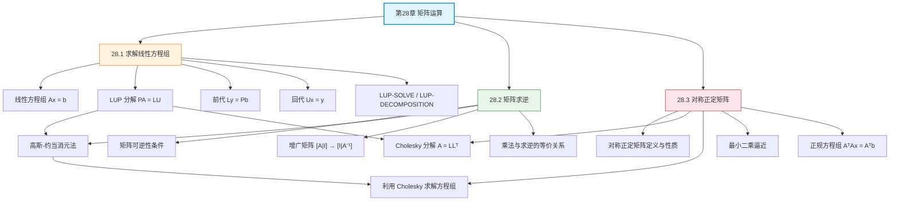

## 相关笔记

**本章节笔记：**
- [[28.1 求解线性方程组]] — LUP 分解、前代与回代、Θ(n³) 复杂度
- [[28.2 矩阵求逆]] — 高斯-约当消元法、矩阵乘法与求逆的等价关系
- [[28.3 对称正定矩阵]] — Cholesky 分解、最小二乘逼近、正规方程组

**前置章节汇总：**
- [[第27章_在线算法-章节汇总]] — 第27章在线算法
- [[第04章_分治策略-章节汇总]] — 分治策略（Strassen 矩阵乘法）

**后续章节：**
- [[第29章_线性规划-章节汇总]] — 第29章线性规划（待学习）

---

> [!abstract] 概览
> 第28章系统介绍了==矩阵运算==的核心算法，围绕"求解线性方程组"这一中心问题展开。全章以==LUP 分解==为基础工具，逐步扩展到矩阵求逆和对称正定矩阵的特殊处理方法。
>
> 三节内容从通用到特化：(1) 28.1 节介绍 LUP 分解（$PA = LU$），将一般线性方程组 $Ax = b$ 转化为两个三角方程组，在 $\Theta(n^3)$ 时间内求解；(2) 28.2 节利用 LUP 分解实现矩阵求逆（高斯-约当消元法），并证明矩阵乘法与矩阵求逆在计算复杂度上的等价关系；(3) 28.3 节针对对称正定矩阵这一重要特殊类，介绍 Cholesky 分解（$A = LL^T$），比 LU 分解快约 2 倍，并将其应用于最小二乘逼近问题。

---

## 知识结构总览

---

## 核心概念回顾

### 三节内容对比

| 维度 | 28.1 求解线性方程组 | 28.2 矩阵求逆 | 28.3 对称正定矩阵 |
|:---|:---|:---|:---|
| **核心问题** | 求解 $Ax = b$ | 计算 $A^{-1}$ | 求解 $Ax = b$（A 为 SPD） |
| **核心方法** | LUP 分解 | 高斯-约当消元法 | Cholesky 分解 |
| **分解形式** | $PA = LU$ | 增广矩阵 $[A\|I] \to [I\|A^{-1}]$ | $A = LL^T$ |
| **时间复杂度** | $\Theta(n^3)$ | $\Theta(n^3)$ | $\Theta(n^3/3)$ |
| **数值稳定性** | 部分主元选取保证 | 较差（实践中避免直接求逆） | 优秀（正定性保证） |
| **适用范围** | 任意非奇异方阵 | 任意非奇异方阵 | 对称正定矩阵 |
| **扩展应用** | — | 矩阵乘法与求逆等价 | 最小二乘逼近 |

> [!note] 算法选型指南
> - **一般线性方程组**：优先使用 LUP 分解（28.1），数值稳定且高效
> - **需要显式逆矩阵**：使用高斯-约当消元法（28.2），但实际中应尽量避免直接求逆
> - **对称正定矩阵**：使用 Cholesky 分解（28.3），速度比 LU 快约 2 倍，数值稳定性更好
> - **超定方程组（最小二乘）**：先构造正规方程组 $A^TAx = A^Tb$，再用 Cholesky 分解求解
> - **大规模稀疏矩阵**：考虑迭代法（共轭梯度法等），超出本章范围

> [!def] 核心定理汇总
> 1. **LUP 分解定理**：任何非奇异矩阵 $A$ 都存在 LUP 分解 $PA = LU$
> 2. **前代-回代复杂度**：给定 L、U、π，LUP-SOLVE 运行时间为 $\Theta(n^2)$
> 3. **LUP 分解复杂度**：LUP-DECOMPOSITION 运行时间为 $\Theta(n^3)$
> 4. **乘法-求逆等价性**：矩阵乘法与矩阵求逆在计算复杂度上等价
> 5. **Cholesky 分解定理**：对称正定矩阵 $A$ 存在唯一的 Cholesky 分解 $A = LL^T$
> 6. **Cholesky 复杂度**：$\Theta(n^3/3)$，约为 LU 分解的一半
> 7. **正规方程组**：最小二乘解 $x$ 满足 $A^TAx = A^Tb$，其中 $A^TA$ 是对称正定的

---

## 跨章关联

### 与第4章（分治策略）的关系

- [[4.1 矩阵乘法]] 介绍了朴素矩阵乘法（$\Theta(n^3)$），[[离散数学/concepts/Strassen算法]] 将其优化到 $O(n^{2.81})$
- 28.2 节证明矩阵乘法与矩阵求逆的计算复杂度等价：如果 Strassen 乘法可以在 $O(n^{2.81})$ 内完成，则矩阵求逆也可以
- 矩阵乘法的分治思想（将矩阵分块）在分块矩阵求逆中也有应用

### 与第14章（动态规划）的关系

- [[14.2 矩阵链乘法]] 中的矩阵乘法与本章的矩阵运算直接相关
- 最小二乘逼近可以视为一种优化问题，其思想与动态规划的"最优子结构"有相通之处

### 与第15章（贪心算法）的关系

- [[15.4 离线缓存]] 中的贪心策略与数值线性代数中的局部最优策略有类比关系

### 与第27章（在线算法）的关系

- 两者都关注算法在特定约束下的性能保证
- 矩阵运算受限于数值精度，在线算法受限于信息不完全

### 与附录 D（矩阵基础）的关系

- 附录 D 提供了矩阵的基本定义、运算规则和重要性质
- 本章是附录 D 的算法化延伸：将矩阵理论转化为可执行的算法

---

## 综合复习题

> [!faq]- Q1：给定一个 $n \times n$ 的非奇异矩阵 $A$，需要求解 $m$ 个不同的线性方程组 $Ax = b_1, Ax = b_2, \ldots, Ax = b_m$。使用 LUP 分解和直接使用矩阵求逆，哪种方法更高效？为什么？
>
> **解答：**
>
> **使用 LUP 分解更高效。**
>
> - **LUP 分解方法**：先执行一次 LUP-DECOMPOSITION（$\Theta(n^3)$），然后对每个 $b_i$ 执行 LUP-SOLVE（$\Theta(n^2)$）。总时间 = $\Theta(n^3) + m \cdot \Theta(n^2) = \Theta(n^3 + mn^2)$。
> - **矩阵求逆方法**：先计算 $A^{-1}$（$\Theta(n^3)$），然后对每个 $b_i$ 计算矩阵-向量乘法 $A^{-1}b_i$（$\Theta(n^2)$）。总时间 = $\Theta(n^3) + m \cdot \Theta(n^2) = \Theta(n^3 + mn^2)$。
>
> 从渐进复杂度看两者相同，但 LUP 分解方法在实践中更优，因为：
> 1. LUP-SOLVE 的常数因子更小（只需前代+回代，而非完整的矩阵-向量乘法）
> 2. LUP 分解的数值稳定性更好（直接求逆会放大舍入误差）
> 3. 当 $A$ 是稀疏矩阵时，LUP 分解可以保持稀疏性，而 $A^{-1}$ 通常是稠密的

> [!faq]- Q2：为什么对称正定矩阵的 Cholesky 分解比一般矩阵的 LU 分解快约 2 倍？这种加速的本质原因是什么？
>
> **解答：**
>
> **加速的本质原因是==对称性==。**
>
> - **LU 分解**：需要计算 $L$ 和 $U$ 两个三角矩阵，共需确定 $n^2$ 个未知参数（$L$ 的 $n(n-1)/2$ 个下三角元素 + $U$ 的 $n(n+1)/2$ 个上三角元素）
> - **Cholesky 分解**：只需计算一个下三角矩阵 $L$，共需确定 $n(n+1)/2$ 个参数（$L$ 的下三角元素），约为 LU 分解的一半
>
> 从运算量看：
> - LU 分解：约 $\frac{2}{3}n^3$ 次乘法/除法
> - Cholesky 分解：约 $\frac{1}{3}n^3$ 次乘法/除法 + $n$ 次开平方
>
> 此外，对称正定矩阵的==正定性==保证了分解过程中不会出现零主元或负数开平方，因此不需要选主元操作，进一步简化了算法。

> [!faq]- Q3：在最小二乘问题中，为什么正规方程组 $A^TAx = A^Tb$ 的系数矩阵 $A^TA$ 一定是对称正定的（假设 $A$ 列满秩）？如果 $A$ 不是列满秩的，会出现什么问题？
>
> **解答：**
>
> **$A^TA$ 的对称正定性证明：**
>
> 1. **对称性**：$(A^TA)^T = A^T(A^T)^T = A^TA$ ✅
> 2. **正定性**（假设 $A$ 列满秩，即 $\text{rank}(A) = n$）：
>    - 对任意非零向量 $x$，$x^T(A^TA)x = (Ax)^T(Ax) = \|Ax\|^2$
>    - 因为 $A$ 列满秩，$Ax = 0$ 当且仅当 $x = 0$
>    - 所以对 $x \neq 0$，$\|Ax\|^2 > 0$，即 $x^T(A^TA)x > 0$ ✅
>
> **如果 $A$ 不是列满秩（$\text{rank}(A) < n$）：**
> - $A^TA$ 是半正定的（存在非零 $x$ 使 $Ax = 0$，此时 $x^TA^TAx = 0$）
> - $A^TA$ 是奇异的，正规方程组没有唯一解
> - Cholesky 分解会在某一步遇到非正对角元素而失败
> - 解决方案：使用 SVD（奇异值分解）或 QR 分解来处理秩亏情况

---

## 常见误区

> [!warning] 误区1：求解 $Ax = b$ 时应该先计算 $A^{-1}$ 再乘以 $b$
> 在实际计算中，应该使用 LUP 分解直接求解，而非先求逆。原因：(1) 求逆的计算量约为直接求解的 3 倍；(2) 求逆会放大舍入误差，数值精度更差；(3) 如果 $A$ 是稀疏矩阵，$A^{-1}$ 通常是稠密的，破坏稀疏性。只有在需要**显式使用**逆矩阵（如计算方差-协方差矩阵）时才应该求逆。

> [!warning] 误区2：Cholesky 分解可以用于任意方阵
> Cholesky 分解仅适用于==对称正定==矩阵。对于一般的非奇异矩阵，应使用 LU 分解（LUP 分解）。如果对非正定矩阵尝试 Cholesky 分解，会在计算对角元素时遇到负数开平方的错误。判断矩阵是否适合 Cholesky 分解的方法：检查所有前 $k$ 阶主子式的行列式是否为正。

> [!warning] 误区3：最小二乘问题总是应该通过正规方程组求解
> 正规方程组 $A^TAx = A^Tb$ 的条件数是原矩阵 $A$ 的条件数的==平方==，这意味着当 $A$ 接近秩亏时，正规方程组的数值稳定性会显著恶化。对于病态问题，QR 分解（$A = QR$，然后求解 $Rx = Q^Tb$）或 SVD 方法在数值上更稳定，虽然计算量稍大。

> [!warning] 误区4：LUP 分解中的置换矩阵 P 可以省略
> 置换矩阵 $P$ 的作用是选主元（partial pivoting），保证数值稳定性。如果省略 $P$（即只做 LU 分解），当主元接近零时会产生巨大的舍入误差，甚至导致算法失败。虽然理论上任何非奇异矩阵都存在 LU 分解，但实际计算中必须使用 LUP 分解来保证可靠性。

---

## 学习要点总结

| 学习目标 | 掌握程度 | 对应笔记 |
|:---|:---:|:---|
| 理解线性方程组的矩阵表示 $Ax = b$ | ★★★★★ | [[28.1 求解线性方程组]] |
| 掌握 LUP 分解的定义和计算过程 | ★★★★★ | [[28.1 求解线性方程组]] |
| 掌握前代和回代的执行逻辑 | ★★★★★ | [[28.1 求解线性方程组]] |
| 理解 LUP 分解的数值稳定性优势 | ★★★★☆ | [[28.1 求解线性方程组]] |
| 掌握高斯-约当消元法求逆 | ★★★★★ | [[28.2 矩阵求逆]] |
| 理解矩阵乘法与求逆的等价关系 | ★★★★☆ | [[28.2 矩阵求逆]] |
| 了解实践中避免直接求逆的原因 | ★★★★★ | [[28.2 矩阵求逆]] |
| 掌握对称正定矩阵的定义与性质 | ★★★★★ | [[28.3 对称正定矩阵]] |
| 掌握 Cholesky 分解的计算过程 | ★★★★★ | [[28.3 对称正定矩阵]] |
| 掌握最小二乘逼近与正规方程组 | ★★★★★ | [[28.3 对称正定矩阵]] |
| 了解正规方程组的数值稳定性问题 | ★★★★☆ | [[28.3 对称正定矩阵]] |

---

## 参见Wiki

- [[离散数学/concepts/矩阵乘法]] — 矩阵乘法的基本定义与算法
- [[离散数学/concepts/Strassen算法]] — $O(n^{2.81})$ 的快速矩阵乘法算法
- [[离散数学/concepts/分治法]] — 分治策略的核心思想
- [[离散数学/concepts/动态规划]] — 矩阵链乘法等动态规划应用

---

#学习/算法导论/第28章-矩阵运算 #学习/算法导论/矩阵运算/章节汇总
