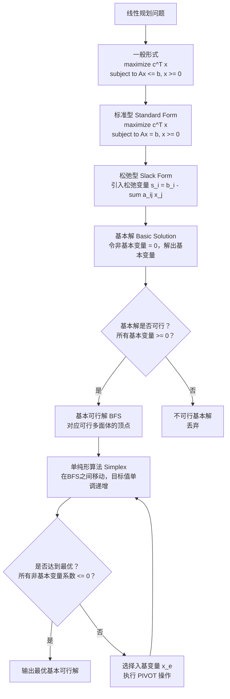
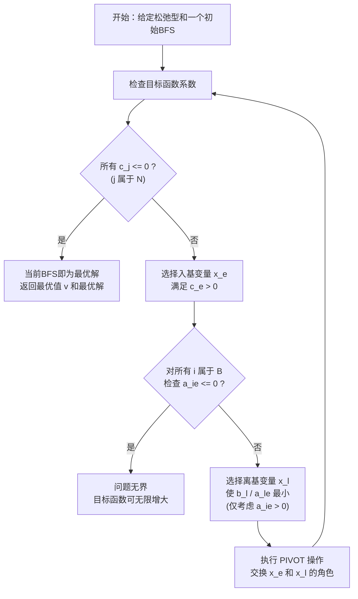

> [!abstract] 概览
> 线性规划（Linear Programming, LP）是运筹学与优化理论中最基础也最重要的工具之一。其核心思想是在一组**线性约束**条件下，寻找一个**线性目标函数**的最大值（或最小值）。本节从线性规划的**一般形式**出发，介绍两种关键的规范化表示——**标准型**（standard form）和**松弛型**（slack form），并详细讲解求解线性规划的**单纯形算法**（simplex algorithm）。单纯形算法由 George Dantzig 于 1947 年提出，通过在可行区域的顶点之间进行系统搜索来找到最优解。尽管其最坏情况复杂度为指数级，但在实际应用中表现出极高的效率，至今仍是工业界求解线性规划的主流方法之一。

---

## 知识结构总览



---

## 核心思想

### 2.1 线性规划的一般形式

线性规划问题的一般形式为：

$$
\text{maximize} \quad \sum_{j=1}^{n} c_j x_j
$$

$$
\text{subject to} \quad \sum_{j=1}^{n} a_{ij} x_j \leq b_i \quad (i = 1, 2, \ldots, m)
$$

$$
x_j \geq 0 \quad (j = 1, 2, \ldots, n)
$$

用矩阵表示为：

$$
\text{maximize} \quad \mathbf{c}^T \mathbf{x}
$$

$$
\text{subject to} \quad A\mathbf{x} \leq \mathbf{b}, \quad \mathbf{x} \geq \mathbf{0}
$$

其中：
- $\mathbf{x} = (x_1, x_2, \ldots, x_n)^T$ 是**决策变量**向量，共 $n$ 个
- $\mathbf{c} = (c_1, c_2, \ldots, c_n)^T$ 是**目标函数系数**向量
- $A$ 是 $m \times n$ 的**约束系数矩阵**
- $\mathbf{b} = (b_1, b_2, \ldots, b_m)^T$ 是**右端项**向量
- $m$ 是约束条件的数量

**生活化类比**：假设你是一家工厂的经理，有 $n$ 种产品可以生产。每种产品 $j$ 的单位利润为 $c_j$ 元，生产单位产品 $j$ 需要消耗 $a_{ij}$ 单位的资源 $i$，而资源 $i$ 的总量上限为 $b_i$。你的目标是最大化总利润，同时不超过每种资源的上限——这就是一个典型的线性规划问题。

### 2.2 标准型（Standard Form）

**标准型**要求所有约束都是等式约束，且所有变量非负：

$$
\text{maximize} \quad \sum_{j=1}^{n} c_j x_j
$$

$$
\text{subject to} \quad \sum_{j=1}^{n} a_{ij} x_j = b_i \quad (i = 1, 2, \ldots, m)
$$

$$
x_j \geq 0 \quad (j = 1, 2, \ldots, n)
$$

将一般形式转化为标准型的方法：

**方法一：引入松弛变量（处理不等式约束）**

对于 $\leq$ 不等式 $\sum_{j=1}^{n} a_{ij} x_j \leq b_i$，引入非负松弛变量 $s_i \geq 0$，变为：

$$
\sum_{j=1}^{n} a_{ij} x_j + s_i = b_i
$$

**方法二：处理 $\geq$ 不等式**

对于 $\geq$ 不等式 $\sum_{j=1}^{n} a_{ij} x_j \geq b_i$，两边乘以 $-1$ 转化为 $\leq$ 形式，再引入松弛变量：

$$
-\sum_{j=1}^{n} a_{ij} x_j \leq -b_i \implies -\sum_{j=1}^{n} a_{ij} x_j + s_i = -b_i
$$

**方法三：处理自由变量**

若变量 $x_j$ 没有非负约束（即 $x_j$ 是自由变量），则用两个非负变量之差替换：

$$
x_j = x_j^+ - x_j^- , \quad x_j^+ \geq 0, \quad x_j^- \geq 0
$$

**方法四：将最小化转化为最大化**

$$
\text{minimize} \quad \sum_{j=1}^{n} c_j x_j \iff \text{maximize} \quad \sum_{j=1}^{n} (-c_j) x_j
$$

### 2.3 松弛型（Slack Form）

**松弛型**是单纯形算法直接操作的形式。对于每个约束，将右端项移到左边，并引入**松弛变量** $s_i$：

$$
s_i = b_i - \sum_{j=1}^{n} a_{ij} x_j \quad (i = 1, 2, \ldots, m)
$$

松弛型的完整表示包含：
- **目标函数**：$z = v + \sum_{j \in N} c_j x_j$，其中 $v$ 是当前常数项
- **约束方程**：每个方程左边是一个基本变量，右边是常数减去非基本变量的线性组合

形式化地，松弛型由以下元素定义：
- $N$：**非基本变量**（nonbasic variables）的索引集合
- $B$：**基本变量**（basic variables）的索引集合，$B \cup N = \{1, 2, \ldots, n+m\}$，$B \cap N = \emptyset$
- $\mathbf{b}$：右端常数向量
- $A$：约束系数矩阵
- $\mathbf{c}$：目标函数中非基本变量的系数向量
- $v$：目标函数的常数项

$$
z = v + \sum_{j \in N} c_j x_j
$$

$$
x_i = b_i - \sum_{j \in N} a_{ij} x_j \quad (i \in B)
$$

**关键区别**：标准型中所有变量出现在等式左侧，而松弛型中每个约束方程恰好有一个"被解出"的变量（基本变量）在等号左侧。

### 2.4 基本变量与非基本变量

给定松弛型，将变量集合划分为两个不相交的子集：

- **基本变量** $B$：出现在等号左侧的变量，共 $m$ 个（等于约束数量）
- **非基本变量** $N$：出现在等号右侧的变量，共 $n$ 个

**基本解**（basic solution）：令所有非基本变量 $x_j = 0 \;(j \in N)$，然后通过约束方程直接解出所有基本变量的值：

$$
x_i = b_i - \sum_{j \in N} a_{ij} \cdot 0 = b_i \quad (i \in B)
$$

**基本可行解**（Basic Feasible Solution, BFS）：如果基本解中所有基本变量的值都非负（$x_i = b_i \geq 0 \; \forall i \in B$），则称该基本解为**基本可行解**。

### 2.5 可行区域的几何解释

线性规划的可行区域是 $\mathbb{R}^n$ 中由线性约束定义的一个**凸多面体**（convex polyhedron）。几何上：

- 每个等式约束 $\sum_{j} a_{ij} x_j = b_i$ 定义一个**超平面**
- 每个不等式约束 $\sum_{j} a_{ij} x_j \leq b_i$ 定义一个**半空间**
- 可行区域 = 所有半空间的交集 = 一个凸多面体

**核心定理**：凸多面体的**顶点**（extreme point）与线性规划的**基本可行解**之间存在一一对应关系。

- 每个基本可行解对应可行多面体的一个顶点
- 每个顶点至少对应一个基本可行解（可能退化时对应多个）
- 线性规划的最优值（如果存在有限最优解）一定在某个顶点处取得

**直观理解**：想象一个多面体（如立方体），目标函数 $z = \mathbf{c}^T \mathbf{x}$ 的等值面是一族平行的超平面。当等值面沿着 $\mathbf{c}$ 的方向移动时，最后离开可行区域的那个接触点就是最优点——它一定落在多面体的某个顶点上。

### 2.6 单纯形算法

> [!tip] 单纯形算法执行流程
> 单纯形算法的核心策略是：从可行多面体的一个顶点出发，沿着使目标函数值严格增大的边，移动到相邻的"更好"顶点，直到找不到更好的邻居为止——此时当前顶点即为最优解。



#### PIVOT 操作

PIVOT 操作是单纯形算法的核心原子操作，它交换一个基本变量和一个非基本变量的角色，从而从一个基本可行解移动到相邻的另一个基本可行解。

```
PIVOT(N, B, A, b, c, v, l, e)

1  // 计算变换后的系数
2  b̄_e ← b_l / a_le
3
4  对每个 j 属于 N - {e}:
5      ā_ej ← a_lj / a_le
6
7  ā_el ← 1 / a_le
8
9  对每个 i 属于 B - {l}:
10     b̄_i ← b_i - a_ie × b̄_e
11
12     对每个 j 属于 N - {e}:
13         ā_ij ← a_ij - a_ie × ā_ej
14
15     ā_il ← -a_ie / a_le
16
17  v̄ ← v + c_e × b̄_e
18
19  对每个 j 属于 N - {e}:
20     c̄_j ← c_j - c_e × ā_ej
21
22  c̄_l ← -c_e / a_le
23
24  // 更新基本变量和非基本变量集合
25  N̄ ← (N - {e}) ∪ {l}
26  B̄ ← (B - {l}) ∪ {e}
27
28  return (N̄, B̄, Ā, b̄, c̄, v̄)
```

**PIVOT 操作的直观理解**：将 $x_e$ 从非基本变量集合移入基本变量集合，将 $x_l$ 从基本变量集合移入非基本变量集合。这等价于对约束方程组进行一次**高斯消元**，以 $a_{le}$ 为主元消去 $x_e$ 在其他方程中的出现。

#### SIMPLEX 算法

```
SIMPLEX(A, b, c)

1  (N, B, A, b, c, v) ← INITIALIZE-SIMPLEX(A, b, c)
2
3  let Δ be a new vector of size m
4
5  while 某个索引 j 属于 N 满足 c_j > 0:
6      // 选择入基变量：取 c_j 最大的那个
7      e ← 选择 j 属于 N 使得 c_j > 0 的下标
8
9      // 检查无界性
10     对所有 i 属于 B:
11         if a_ie > 0:
12             Δ_i ← b_i / a_ie
13         else:
14             Δ_i ← +∞
15
16     // 选择离基变量：取 Δ_i 最小的那个
17     l ← 选择 i 属于 B 使得 Δ_i 最小的下标
18
19     if Δ_l = +∞:
20         return "无界"
21
22     // 执行旋转操作
23     (N, B, A, b, c, v) ← PIVOT(N, B, A, b, c, v, l, e)
24
25 return (N, B, A, b, c, v)
```

**算法要点**：
- 第5行的循环条件：只要目标函数中还有系数为正的非基本变量，就说明还有改进空间
- 第7行的入基选择策略（最大系数规则）：选择使目标函数增长最快的方向
- 第17行的离基选择策略（最小比值规则）：确保移动后仍在可行区域内
- 第19行的无界检测：如果所有 $a_{ie} \leq 0$，说明可以无限增大 $x_e$ 而不违反任何约束

### 2.7 正确性证明

#### 引理 29.2：PIVOT 保持等价性

> **引理 29.2**：假设 $(N, B, A, b, c, v)$ 是一个松弛型，PIVOT 操作产生的 $(N̄, B̄, Ā, b̄, c̄, v̄)$ 也是松弛型，且两者表示同一组可行解集合。

**证明**：

【目标（证明新旧松弛型等价）】

考虑 PIVOT 操作以 $(l, e)$ 为参数，将 $x_e$ 移入 $B$，将 $x_l$ 移入 $N$。

【前提（PIVOT 基于原松弛型的第 $l$ 个约束方程）】

原松弛型中第 $l$ 个约束为：

$$
x_l = b_l - \sum_{j \in N} a_{lj} x_j
$$

从中解出 $x_e$（注意 $e \in N$，所以 $a_{le}$ 存在）：

$$
x_e = \frac{b_l}{a_{le}} - \sum_{j \in N - \{e\}} \frac{a_{lj}}{a_{le}} x_j - \frac{1}{a_{le}} x_l
$$

【推导（将 $x_e$ 的表达式代入其余方程）】

对于任意 $i \in B - \{l\}$，原约束为：

$$
x_i = b_i - \sum_{j \in N} a_{ij} x_j
$$

将 $x_e$ 的表达式代入：

$$
x_i = b_i - a_{ie} \left( \frac{b_l}{a_{le}} - \sum_{j \in N - \{e\}} \frac{a_{lj}}{a_{le}} x_j - \frac{1}{a_{le}} x_l \right) - \sum_{j \in N - \{e\}} a_{ij} x_j
$$

整理得：

$$
x_i = \underbrace{\left( b_i - \frac{a_{ie} b_l}{a_{le}} \right)}_{b̄_i} - \sum_{j \in N - \{e\}} \underbrace{\left( a_{ij} - \frac{a_{ie} a_{lj}}{a_{le}} \right)}_{ā_{ij}} x_j - \underbrace{\left( -\frac{a_{ie}}{a_{le}} \right)}_{ā_{il}} x_l
$$

这正是 PIVOT 伪代码中第10-15行所计算的结果。

【结论（新松弛型与原松弛型描述同一可行解集合）】

类似地，将 $x_e$ 的表达式代入目标函数 $z = v + \sum_{j \in N} c_j x_j$，得到新的目标函数表达式（对应伪代码第17-22行）。由于我们只做了等价代换，新旧松弛型描述的是完全相同的可行解集合。$\blacksquare$

#### 引理 29.3：基本解的唯一性

> **引理 29.3**：给定一个松弛型，令 $\bar{\mathbf{x}}$ 为由令所有非基本变量为 0 得到的基本解。则 $\bar{\mathbf{x}}$ 是满足 $\bar{x}_j = 0 \;(\forall j \in N)$ 的**唯一**解。

**证明**：

【目标（证明基本解是唯一的）】

给定松弛型，每个基本变量 $x_i \;(i \in B)$ 由方程唯一确定：

$$
x_i = b_i - \sum_{j \in N} a_{ij} x_j
$$

【前提（令所有非基本变量为 0）】

令 $\bar{x}_j = 0$ 对所有 $j \in N$，代入上式：

$$
\bar{x}_i = b_i - \sum_{j \in N} a_{ij} \cdot 0 = b_i
$$

【结论（每个基本变量的值被唯一确定）】

由于每个基本变量恰好出现在一个方程的左侧，且该方程中不包含其他基本变量，因此每个 $\bar{x}_i$ 的值被 $b_i$ 唯一确定。不存在其他自由度，故基本解唯一。$\blacksquare$

#### 引理 29.4：目标值单调递增

> **引理 29.4**：如果 SIMPLEX 算法在 PIVOT 前的基本可行解不是最优解，则 PIVOT 后的目标函数值严格大于 PIVOT 前的目标函数值。

**证明**：

【目标（证明每次 PIVOT 使目标值严格增大）】

设 PIVOT 前的目标函数为 $z = v + \sum_{j \in N} c_j x_j$，当前基本可行解的目标值为 $z = v$（因为所有非基本变量为 0）。

【前提（选择入基变量 $x_e$ 满足 $c_e > 0$）】

PIVOT 选择 $e \in N$ 使得 $c_e > 0$。PIVOT 后，$x_e$ 成为基本变量，其值为：

$$
\bar{x}_e = \frac{b_l}{a_{le}}
$$

其中 $l$ 是离基变量，且由最小比值规则，$b_l > 0$ 且 $a_{le} > 0$，故 $\bar{x}_e > 0$。

【推导（计算新的目标函数值）】

PIVOT 后的新目标函数常数为：

$$
\bar{v} = v + c_e \cdot \frac{b_l}{a_{le}}
$$

由于 $c_e > 0$、$b_l > 0$、$a_{le} > 0$，故 $c_e \cdot \frac{b_l}{a_{le}} > 0$，从而：

$$
\bar{v} = v + c_e \cdot \frac{b_l}{a_{le}} > v
$$

【结论（目标值严格递增，算法不会陷入循环）】

因此每次 PIVOT 操作后，目标函数值严格增大。由于基本可行解的数量是有限的，算法必定在有限步内终止。$\blacksquare$

### 2.8 最坏情况复杂度分析

**最坏情况：指数级时间复杂度**

1972 年，Klee 和 Minty 构造了一族精心设计的线性规划实例（称为 **Klee-Minty 立方体**），使得单纯形算法（使用最大系数规则选择入基变量）必须遍历可行多面体的**全部 $2^n$ 个顶点**才能找到最优解。这意味着单纯形算法在最坏情况下的迭代次数为 $O(2^n)$，是**指数级**的。

$n$ 维 Klee-Minty 立方体的一个实例：

$$
\text{maximize} \quad \sum_{j=1}^{n} 2^{n-j} x_j
$$

$$
\text{subject to} \quad \sum_{j=1}^{k} 2^{k-j} x_j \leq 1 \quad (k = 1, 2, \ldots, n)
$$

$$
x_j \geq 0 \quad (j = 1, 2, \ldots, n)
$$

**实际效率：远优于最坏情况**

尽管存在指数级最坏情况，但实际应用中单纯形算法的表现极为出色：

- 对于典型的工业规模问题（数千个变量和约束），单纯形算法通常只需 $O(m)$ 到 $O(m + n)$ 次迭代
- Klee-Minty 反例的结构极其特殊，对系数的微小扰动（如将 $4x_1 + x_2 \leq 25$ 改为 $4.01x_1 + 0.99x_2 \leq 25.02$）就会破坏其指数级行为
- 单纯形算法在实践中被广泛认为是求解线性规划最高效的方法之一

### 2.9 具体数值示例

#### 问题描述

$$
\text{maximize} \quad z = 3x_1 + 5x_2
$$

$$
\text{subject to} \quad x_1 \leq 4
$$

$$
x_2 \leq 6
$$

$$
x_1 + x_2 \leq 8
$$

$$
x_1, x_2 \geq 0
$$

#### 图解法

可行区域是由以下四条直线围成的凸多边形：
- $x_1 = 0$（y 轴）
- $x_2 = 0$（x 轴）
- $x_1 = 4$（垂直线）
- $x_2 = 6$（水平线）
- $x_1 + x_2 = 8$（斜线）

可行区域的顶点为：$(0,0)$、$(4,0)$、$(4,4)$、$(2,6)$、$(0,6)$。

计算各顶点的目标函数值：
- $(0,0)$：$z = 0$
- $(4,0)$：$z = 12$
- $(4,4)$：$z = 12 + 20 = 32$
- $(2,6)$：$z = 6 + 30 = 36$
- $(0,6)$：$z = 30$

最优解为 $(2, 6)$，最优值为 $z = 36$。

#### 单纯形法逐步求解

**第一步：转化为松弛型**

引入松弛变量 $s_1, s_2, s_3$：

$$
z = 0 + 3x_1 + 5x_2
$$

$$
s_1 = 4 - x_1
$$

$$
s_2 = 6 - x_2
$$

$$
s_3 = 8 - x_1 - x_2
$$

初始状态：$B = \{s_1, s_2, s_3\}$，$N = \{x_1, x_2\}$

初始基本可行解：$x_1 = 0, x_2 = 0, s_1 = 4, s_2 = 6, s_3 = 8$，目标值 $z = 0$。

**第二步：第一次迭代**

目标函数中 $x_2$ 的系数 $c_2 = 5 > 0$（最大），选择 $x_2$ 入基。

计算最小比值：
- $s_1$ 行：$a_{12} = 0 \leq 0$，跳过
- $s_2$ 行：$\Delta_2 = 6 / 1 = 6$
- $s_3$ 行：$\Delta_3 = 8 / 1 = 8$

最小比值为 6，选择 $s_2$ 离基。主元 $a_{22} = 1$。

执行 PIVOT$(N, B, A, b, c, v, s_2, x_2)$：

从 $s_2$ 的方程解出 $x_2$：$x_2 = 6 - s_2$

代入其他方程：
- $z = 0 + 3x_1 + 5(6 - s_2) = 30 + 3x_1 - 5s_2$
- $s_1 = 4 - x_1$
- $s_3 = 8 - x_1 - (6 - s_2) = 2 - x_1 + s_2$

新状态：$B = \{s_1, x_2, s_3\}$，$N = \{x_1, s_2\}$

基本可行解：$x_1 = 0, s_2 = 0, s_1 = 4, x_2 = 6, s_3 = 2$，目标值 $z = 30$。

**第三步：第二次迭代**

目标函数中 $x_1$ 的系数 $c_1 = 3 > 0$，选择 $x_1$ 入基。

计算最小比值：
- $s_1$ 行：$\Delta_1 = 4 / 1 = 4$
- $x_2$ 行：$a_{21} = 0 \leq 0$，跳过
- $s_3$ 行：$\Delta_3 = 2 / 1 = 2$

最小比值为 2，选择 $s_3$ 离基。主元 $a_{31} = 1$。

执行 PIVOT$(N, B, A, b, c, v, s_3, x_1)$：

从 $s_3$ 的方程解出 $x_1$：$x_1 = 2 + s_2 - s_3$

代入其他方程：
- $z = 30 + 3(2 + s_2 - s_3) - 5s_2 = 36 - 2s_2 - 3s_3$
- $s_1 = 4 - (2 + s_2 - s_3) = 2 - s_2 + s_3$
- $x_2 = 6$

新状态：$B = \{s_1, x_2, x_1\}$，$N = \{s_2, s_3\}$

基本可行解：$s_2 = 0, s_3 = 0, s_1 = 2, x_2 = 6, x_1 = 2$，目标值 $z = 36$。

**第四步：终止判断**

目标函数 $z = 36 - 2s_2 - 3s_3$ 中，所有非基本变量的系数均为负（$-2 < 0$，$-3 < 0$），无法再增大目标值。

**最优解**：$x_1 = 2, x_2 = 6$，最优值 $z = 36$。与图解法结果一致。

---

## 补充理解与拓展

> [!info] Dantzig 与单纯形法的历史
> 1947 年，美国空军数学顾问 **George Bernard Dantzig**（1914-2005）在解决军事资源分配问题时，系统地提出了线性规划的**标准形式**和**单纯形法**。当时 Dantzig 是美国空军 SCOOP（Scientific Computation of Optimum Programs）项目的核心成员，该项目旨在为军方制定最优的后勤规划方案。
>
> Dantzig 的贡献被公认为 20 世纪应用数学领域最具影响力的成果之一。他不仅发明了单纯形法，还建立了线性规划的对偶理论框架。著名数学家 **John von Neumann** 在得知 Dantzig 的工作后，迅速认识到其深刻意义，并独立提出了线性规划的对偶理论。
>
> 单纯形法问世后迅速在工业界得到广泛应用。1949 年，Dantzig 在首次数学规划会议上公开报告了这一方法，此后线性规划成为运筹学的核心工具。Dantzig 因此被称为**"线性规划之父"**。

> [!info] Klee-Minty 反例：单纯形法的指数级最坏情况
> 1972 年，数学家 **Victor Klee** 和 **George Minty** 发表了一篇具有里程碑意义的论文，构造了一族被称为 **Klee-Minty 立方体**的线性规划实例。在这些实例上，使用**最大系数规则**（largest-coefficient rule）选择入基变量的单纯形算法，必须遍历可行多面体的全部 $2^n$ 个顶点才能到达最优解。
>
> 以 3 维 Klee-Minty 立方体为例：
> - 最大化 $100x_1 + 10x_2 + x_3$
> - 约束：$x_1 \leq 1$，$20x_1 + x_2 \leq 100$，$200x_1 + 20x_2 + x_3 \leq 10000$
> - $x_1, x_2, x_3 \geq 0$
>
> 该反例证明了单纯形算法在最坏情况下具有**指数时间复杂度**，这意味着线性规划问题是否属于 P 类在当时仍是一个开放问题。然而值得注意的是，Klee-Minty 立方体的结构极其"脆弱"——即使对系数进行微小的随机扰动（例如将 $4x_1 + x_2 \leq 25$ 改为 $4.01x_1 + 0.99x_2 \leq 25.02$），也会破坏迫使单纯形遍历所有顶点的特殊结构，使算法恢复到多项式级别的迭代次数。

> [!info] 内点法 vs 单纯形法
> 1984 年，贝尔实验室的 **Narendra Karmarkar** 提出了**内点法**（interior-point method），这是自单纯形法以来线性规划领域最重要的突破。Karmarkar 的投影算法在最坏情况下实现了 $O(n^{3.5} L)$ 的算术运算复杂度，其中 $n$ 是变量数，$L$ 是输入的比特长度，首次证明了线性规划可以在**多项式时间**内求解。
>
> **内点法 vs 单纯形法的对比**：
>
> | 特性 | 单纯形法 | 内点法 |
> |------|---------|--------|
> | 搜索路径 | 沿可行多面体的顶点和边移动 | 从可行区域内部穿越 |
> | 理论复杂度 | 指数级（最坏情况） | 多项式级 |
> | 实际效率 | 通常极快，尤其对小中规模问题 | 对大规模稀疏问题优势明显 |
> | 灵敏度分析 | 天然支持（B 表直接给出对偶信息） | 需要额外计算 |
> | 初始解 | 需要初始基本可行解 | 不需要顶点，从内部任意点出发 |
>
> 现代求解器（如 CPLEX、Gurobi）通常**同时实现两种算法**，根据问题特征自动选择最合适的方法，甚至将两者结合使用。

> [!info] 单纯形法在实际中的应用
> 单纯形法是现代工业优化求解器的核心算法之一，被广泛应用于以下领域：
>
> - **供应链与物流优化**：运输问题、设施选址、库存管理、车辆路径规划
> - **生产计划与调度**：在有限资源下优化产品组合、排班调度
> - **金融工程**：投资组合优化、风险管理、套利检测
> - **能源系统**：电力调度、电网优化、能源分配
> - **通信网络**：网络流量优化、带宽分配、路由规划
>
> 当前工业界最主流的商业求解器包括：
> - **Gurobi**：由 Gurobi Optimization 公司开发，在全球求解器基准测试中表现优异，支持 LP、MIP、QP 等多种优化问题，全球用户超过 2600 家
> - **IBM CPLEX**：IBM 开发的高性能求解器，在结构化强、约束密集的 LP 问题上表现突出
> - **FICO Xpress**：FICO 公司的商业求解器，在金融行业应用广泛
>
> 这些求解器都实现了高度优化的单纯形法（包括对偶单纯形法、修正单纯形法等变体），并结合内点法、启发式方法、预处理技术等，能够高效求解包含数百万个变量和约束的大规模实际问题。

---

## 易混淆点

> [!warning] 标准型 vs 松弛型的区别
> **标准型**和**松弛型**都是线性规划的规范化表示，但它们的用途和形式不同：
>
> | 特征 | 标准型 | 松弛型 |
> |------|--------|--------|
> | 约束形式 | $Ax = b$（等式约束） | $x_i = b_i - \sum a_{ij} x_j$（解出形式） |
> | 变量分类 | 所有变量地位平等 | 明确区分基本变量和非基本变量 |
> | 主要用途 | 理论分析、对偶理论 | 单纯形算法的直接操作对象 |
> | 引入松弛变量 | 是（将不等式转为等式） | 是（且松弛变量成为基本变量） |
>
> **关键区别**：标准型中所有变量在等式左侧，地位对称；松弛型中每个约束方程恰好有一个变量被"解出"放在等号左侧（基本变量），其余变量在右侧（非基本变量）。松弛型是标准型经过变量重排后的等价形式。

> [!warning] 基本解 vs 基本可行解
> **基本解**和**基本可行解**是两个不同的概念：
>
> - **基本解**（basic solution）：令所有非基本变量为 0，解出基本变量得到的解。基本解不一定满足非负约束。
> - **基本可行解**（Basic Feasible Solution, BFS）：基本解中所有变量的值都**非负**（$x_i \geq 0$ 对所有 $i$）。
>
> 并非所有基本解都是可行的。如果一个基本解中某个基本变量的值为负，则该基本解不可行，对应的顶点落在可行区域之外。单纯形算法只在**基本可行解**之间移动，确保每一步都保持在可行区域内。

> [!warning] 单纯形法的多项式/指数复杂度
> 单纯形法的复杂度需要区分**最坏情况**和**实际表现**：
>
> - **最坏情况**：Klee-Minty 反例证明，单纯形法在最坏情况下需要 $O(2^n)$ 次迭代，是**指数级**的。这意味着单纯形法**不是**一个多项式时间算法。
> - **实际表现**：在实际问题中，单纯形法通常只需 $O(m)$ 到 $O(3m/2)$ 次迭代，表现出接近多项式时间的效率。
> - **理论意义**：Karmarkar 的内点法（1984）首次实现了多项式时间复杂度，但实际效率未必优于单纯形法。
>
> **注意**：指数级最坏复杂度并不影响单纯形法的实用价值。这类似于快速排序——最坏情况 $O(n^2)$，但平均情况 $O(n \log n)$ 且实际表现极好。单纯形法的情况类似：最坏指数级，但实际中几乎总是高效运行。

---

## 习题精选

| 题号 | 题目内容 | 考察知识点 | 难度 |
|:----:|---------|-----------|:----:|
| 29.1-1 | 将一般线性规划转化为标准型 | 标准型转换方法 | 中 |
| 29.1-4 | 将线性规划转化为松弛型 | 松弛型构造 | 中 |
| 29.1-6 | 证明线性规划不可行 | 不可行性判定 | 高 |
| 29.1-7 | 证明线性规划无界 | 无界性判定 | 高 |

> [!faq]- 习题 29.1-1：将一般线性规划转化为标准型
> **题目**：将以下线性规划转化为标准型：
> $$
> \text{maximize} \quad 2x_1 + 3x_2
> $$
> $$
> \text{subject to} \quad x_1 + 2x_2 \leq 4
> $$
> $$
> x_1 - x_2 \geq 1
> $$
> $$
> x_1 \geq 0
> $$
> （注意 $x_2$ 是自由变量）
>
> **解题思路提示**：
> 1. 处理自由变量 $x_2$：令 $x_2 = x_2^+ - x_2^-$，其中 $x_2^+, x_2^- \geq 0$
> 2. 处理 $\geq$ 不等式：两边乘以 $-1$ 转为 $\leq$
> 3. 引入松弛变量将 $\leq$ 转为等式
>
> **标准答案**：
> $$
> \text{maximize} \quad 2x_1 + 3x_2^+ - 3x_2^-
> $$
> $$
> \text{subject to} \quad x_1 + 2x_2^+ - 2x_2^- + s_1 = 4
> $$
> $$
> -x_1 + x_2^+ - x_2^- + s_2 = -1
> $$
> $$
> x_1, x_2^+, x_2^-, s_1, s_2 \geq 0
> $$

> [!faq]- 习题 29.1-4：将线性规划转化为松弛型
> **题目**：将以下线性规划转化为松弛型：
> $$
> \text{maximize} \quad x_1 + x_2
> $$
> $$
> \text{subject to} \quad 2x_1 + x_2 \leq 4
> $$
> $$
> x_1 + 2x_2 \leq 3
> $$
> $$
> x_1, x_2 \geq 0
> $$
>
> **解题思路提示**：
> 1. 引入松弛变量 $s_1, s_2 \geq 0$
> 2. 将每个不等式改写为等式，松弛变量作为基本变量
> 3. 写出目标函数和约束方程
>
> **标准答案**：
> $$
> z = 0 + x_1 + x_2
> $$
> $$
> s_1 = 4 - 2x_1 - x_2
> $$
> $$
> s_2 = 3 - x_1 - 2x_2
> $$
> 其中 $B = \{s_1, s_2\}$，$N = \{x_1, x_2\}$，初始基本可行解为 $x_1 = 0, x_2 = 0, s_1 = 4, s_2 = 3$。

> [!faq]- 习题 29.1-6：证明线性规划不可行
> **题目**：证明以下线性规划是不可行的：
> $$
> \text{maximize} \quad x_1 + x_2
> $$
> $$
> \text{subject to} \quad x_1 - x_2 \leq 1
> $$
> $$
> -x_1 + x_2 \leq -2
> $$
> $$
> x_1, x_2 \geq 0
> $$
>
> **解题思路提示**：
> 1. 将两个不等式相加，观察是否能导出矛盾
> 2. 注意非负约束 $x_1, x_2 \geq 0$ 的限制
>
> **标准答案**：
> 由第一个约束：$x_1 - x_2 \leq 1$，即 $x_1 \leq 1 + x_2$。
>
> 由第二个约束：$-x_1 + x_2 \leq -2$，即 $x_2 \leq x_1 - 2$。
>
> 将 $x_1 \leq 1 + x_2$ 代入 $x_2 \leq x_1 - 2$：
> $$
> x_2 \leq (1 + x_2) - 2 = x_2 - 1
> $$
> 这要求 $x_2 \leq x_2 - 1$，即 $0 \leq -1$，矛盾。
>
> 因此不存在同时满足所有约束的 $(x_1, x_2)$，该线性规划不可行。$\blacksquare$

> [!faq]- 习题 29.1-7：证明线性规划无界
> **题目**：证明以下线性规划是无界的：
> $$
> \text{maximize} \quad x_1 - x_2
> $$
> $$
> \text{subject to} \quad -x_1 + x_2 \leq 1
> $$
> $$
> -x_1 - x_2 \leq -2
> $$
> $$
> x_1, x_2 \geq 0
> $$
>
> **解题思路提示**：
> 1. 找到一个可行解作为起点
> 2. 构造一个可行方向，使目标函数值可以无限增大
> 3. 验证沿该方向移动不会违反任何约束
>
> **标准答案**：
> 首先验证 $(x_1, x_2) = (2, 0)$ 是可行解：
> - $-2 + 0 = -2 \leq 1$ ✓
> - $-2 - 0 = -2 \leq -2$ ✓
> - $x_1 = 2 \geq 0$ ✓，$x_2 = 0 \geq 0$ ✓
>
> 考虑沿 $x_1$ 增大的方向移动。令 $x_1 = t, x_2 = 0$（$t \geq 2$）：
> - 第一个约束：$-t + 0 = -t \leq 1$，对所有 $t \geq 2$ 成立 ✓
> - 第二个约束：$-t - 0 = -t \leq -2$，对所有 $t \geq 2$ 成立 ✓
> - 非负约束：$t \geq 0$ ✓，$0 \geq 0$ ✓
>
> 目标函数值为 $z = t - 0 = t$，当 $t \to +\infty$ 时，$z \to +\infty$。
>
> 因此该线性规划无界。$\blacksquare$

---

## 视频学习指南

| 资源 | 讲者/来源 | 内容 | 链接 |
|------|----------|------|------|
| MIT 18.065 Lecture 11 | Gilbert Strang | 线性规划与单纯形法基础 | [YouTube](https://www.youtube.com/watch?v=M4K6HYLHfqE) |
| CS 170 Lecture 18 | UC Berkeley | 单纯形算法、对偶性、Klee-Minty 立方体 | [课程页面](https://cs170.org/) |
| 线性规划入门 | 3Blue1Brown | 线性规划的几何直觉 | [YouTube](https://www.youtube.com/@3blue1brown) |
| 单纯形法详解 | 数学建模教练 | 中文讲解，含数值示例 | [Bilibili](https://www.bilibili.com/) |

---

## 教材原文

> [!quote] CLRS 第4版 第29.1节
> "In linear programming, we wish to maximize or minimize a linear objective function subject to linear constraints. The simplex algorithm is a remarkably efficient and widely used method for solving linear programs in practice. Although the simplex method is not a polynomial-time algorithm in the worst case, it is efficient in practice. The algorithm maintains a 'basic feasible solution' and iteratively improves it by moving along edges of the feasible polyhedron to adjacent vertices with better objective values."
>
> "A linear program in slack form is the starting point for the simplex method. We can always convert a linear program into slack form by introducing slack variables. The key idea is that at each iteration, the simplex method chooses a nonbasic variable to increase (the 'entering variable') and a basic variable to decrease to zero (the 'leaving variable'), thereby moving to an adjacent basic feasible solution."

---

## 参见Wiki

- [[离散数学/concepts/矩阵乘法]]：线性规划中约束矩阵的运算基础
- [[离散数学/concepts/贪心算法]]：单纯形法在每步选择最优入基变量的贪心策略
- [[离散数学/concepts/动态规划]]：与线性规划同为优化方法，适用于不同问题结构
- [[第28章_矩阵运算/28.1 求解线性方程组]]：高斯消元法是 PIVOT 操作的数学基础
- [[第28章_矩阵运算-章节汇总]]：矩阵运算的完整知识体系
- [[第29章_线性规划/29.2 将问题表述为线性规划]]：如何将实际问题建模为线性规划
- [[第29章_线性规划/29.3 对偶性]]：线性规划的对偶理论及其应用
- [[第29章_线性规划-章节汇总]]：第29章完整知识框架

---

#学习/算法导论/第29章-线性规划
#学习/算法导论/线性规划/单纯形算法
